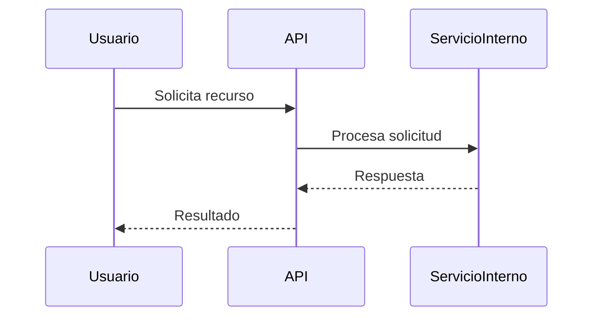

# Instrucciones para GitHub Copilot en este proyecto

## Tabla de Contenido

1. Contexto General
2. Tecnologías y Prácticas Obligatorias
3. Identidad y Seguridad
4. Observabilidad y Monitoreo
5. Modelo Arquitectónico y DSL
6. Decisiones Arquitectónicas (ADRs)
7. Documentación de Servicios
8. Estilo y Redacción
9. Errores Comunes
10. Preguntas Frecuentes (FAQ)

---

## 1. Contexto General

- Proyecto en **C# con .NET 8+**, arquitectura **Clean Architecture** y modelo **C4** (Structurizr DSL).
- Documentación con **Docusaurus** y plantilla **arc42**.
- Servicios corporativos multipaís (Perú, Ecuador, Colombia, México).
- Prioridad: simplicidad, escalabilidad, claridad técnica.
- Toda la documentación debe ser **compatible con Docusaurus** (estructura, metadatos y formato).

**Propósito**: Todas las sugerencias de Copilot deben alinearse a las tecnologías, patrones y lineamientos descritos en este documento. Las desviaciones solo están permitidas si existe un ADR que las respalde.

---

## 2. Tecnologías y Prácticas Obligatorias

| Categoría        | Tecnología                   | Uso principal                               |
| ---------------- | ---------------------------- | ------------------------------------------- |
| Arquitectura     | Clean Architecture           | Separación de responsabilidades             |
| Arquitectura     | DDD                          | Modelado de dominio y reglas de negocio     |
| Lenguaje         | C# (.NET 8+)                 | Desarrollo principal                        |
| Validación       | FluentValidation             | Validación de datos                         |
| Mapeo de objetos | Mapster                      | Conversión DTOs ↔ entidades (no AutoMapper) |
| ORM              | Entity Framework Core        | Acceso y persistencia                       |
| CQRS             | Sin MediatR                  | Comandos y queries en capa de aplicación    |
| Autenticación    | Keycloak                     | Identidad y autorización                    |
| Observabilidad   | Prometheus, Grafana          | Métricas y visualización                    |
| Observabilidad   | Loki, Serilog, OpenTelemetry | Logs estructurados y trazas distribuidas    |
| Observabilidad   | Jaeger                       | Visualización de trazas                     |
| Contenedores     | Docker                       | Despliegue de servicios                     |

### Reglas de Generación de Código para Copilot

- Usar siempre `Mapster` para mapeo.
- Usar `FluentValidation` para validaciones.
- Usar `Entity Framework Core` para acceso a datos relacionales.
- Implementar CQRS sin frameworks externos.
- Respetar separación de capas según Clean Architecture.
- No sugerir tecnologías marcadas como excluidas (`AutoMapper`, `MediatR`, `Dapper`).
- Código en C# con convenciones estándar (PascalCase, comentarios claros, sin abreviaturas innecesarias).

### Contenedores y Docker

- Usar siempre **imágenes oficiales LTS**, de preferencia **Alpine** (Slim solo si Alpine no es compatible).
- Ejemplos:
  - `mcr.microsoft.com/dotnet/sdk:8.0-alpine` (compilación).
  - `mcr.microsoft.com/dotnet/aspnet:8.0-alpine` (runtime).
- Evitar `latest` y versiones no LTS.
- Usar **multi-stage builds**:
  - `sdk` para build.
  - `aspnet` para runtime.
- Minimizar tamaño de imágenes:
  - Copiar solo binarios publicados (`dotnet publish -c Release -o /app/out`).
  - No incluir dependencias innecesarias.
- Nunca agregar secretos, contraseñas ni configuraciones sensibles en la imagen.
- Exponer solo los puertos requeridos en `Dockerfile`.
- Para entornos locales, definir `docker-compose.yml` con servicios auxiliares (DBs, brokers, etc.) y redes nombradas consistentemente.
- Seguir naming consistente con DSL y ADRs en nombres de servicios y contenedores.

---

## 3. Identidad y Seguridad

- Autenticación/autorización con **Keycloak**.
- Validar `JWTs` emitidos por Keycloak.
- Usar claims y roles, no lógica personalizada.
- Usar notación `tenant (realm)` o `tenants (realms)` para consistencia corporativa.

| Término Corporativo | Término en Herramienta | Uso en Documentación |
| ------------------- | ---------------------- | -------------------- |
| tenant / tenants    | realm / realms         | `tenant (realm)`     |
| servicio            | service                | servicio             |

---

## 4. Observabilidad y Monitoreo

| Función       | Tecnología                   |
| ------------- | ---------------------------- |
| Métricas      | Prometheus                   |
| Visualización | Grafana                      |
| Logs          | Loki (Serilog/OpenTelemetry) |
| Trazas        | Jaeger (OpenTelemetry)       |

- Logs estructurados con Serilog.
- Métricas expuestas con Prometheus.
- Trazas distribuidas con OpenTelemetry y Jaeger.
- **Regla para Copilot**: Cada clase de servicio o componente nuevo debe incluir instrumentación básica (logs, métricas, trazas) desde su definición inicial.

---

## 5. Modelo Arquitectónico y DSL

- Modelo **C4** en `/design` con Structurizr DSL.
- Los archivos DSL son la **única fuente de verdad**.
- No modificarlos, solo referenciar.
- Ejemplo:
  `Ver definición de contenedor en /design/servicio-x.dsl`

---

## 6. Decisiones Arquitectónicas (ADRs)

- Guardar en `/docs/adrs`, formato Markdown estándar.
- ID único: `ADR-001`, `ADR-002`, etc.
- Contenido: título, estado, contexto, decisión, consecuencias.
- Enlazar diagramas o referencias relevantes.
- Antes de sugerir un cambio, revisar ADRs existentes.

---

## 7. Documentación de Servicios

Cada servicio en `/docs/<servicio>/` con estructura arc42:

- 01-introduccion-objetivos.md
- 02-restricciones-arquitectura.md
- 03-contexto-alcance.md
- 04-estrategia-solucion.md
- 05-vista-bloques-construccion.md
- 06-vista-tiempo-ejecucion.md
- 07-vista-implementacion.md
- 08-conceptos-transversales.md
- 09-decisiones-arquitectura.md
- 10-requisitos-calidad.md
- 11-riesgos-deuda-tecnica.md
- 12-glosario.md

Reglas:

- Usar siempre nombres del DSL y referencias a ADRs.
- No duplicar ni reinterpretar información.
- Si un cambio es necesario → actualizar primero el DSL o ADR correspondiente.
- Redacción profesional, sin frases como “según el DSL”.

---

## 8. Estilo y Redacción

- Voz activa, español neutro.
- No usar pronombres personales.
- Encabezados en Pascal Case.
- Inglés solo para términos técnicos o código.
- Preferir tablas cuando sea posible.
- Siempre usar backticks para términos técnicos, fragmentos de código corto o valores.
  Ejemplo: `latencia < 100ms (P95)`.

### Código y ejemplos

- Bloques de código → backticks triples (```) con lenguaje.
- Código en línea → backticks simples.

Ejemplo:

```csharp
public class ServicioEjemplo {
    // Comentario claro y directo
}
```

- Diagramas de flujo, secuencia o arquitectura deben realizarse usando **Mermaid** en bloques de código con el tipo `mermaid`.
  Ejemplo:



---

## 9. Errores Comunes a Evitar

- Repetir información ya definida en ADRs o DSL
- Modificar archivos DSL
- Usar tecnologías no aprobadas
- Redactar en primera persona
- Omitir instrumentación de observabilidad
- No usar ejemplos en inglés salvo en código.
- No inventar diagramas Mermaid (solo basarse en DSL/ADRs).
- No generar documentación duplicada en varias rutas (/docs vs /design).

---

## 10. Preguntas Frecuentes (FAQ)

**¿Cómo referencio un ADR?**
Ejemplo: Ver ADR-001 para detalles de Clean Architecture.

**¿Puedo proponer nueva tecnología?**
Sí, pero solo mediante ADR.

**¿Qué hago si Copilot sugiere algo no permitido?**
Ignorar la sugerencia y ajustarla manualmente a las reglas definidas.

**¿Puede Copilot generar ADRs?**
Sí, pero deben cumplir el formato estándar y ser validados por el equipo.

**¿Qué hago si hay conflicto entre DSL y ADR?**
Priorizar el DSL como fuente de verdad.

---
