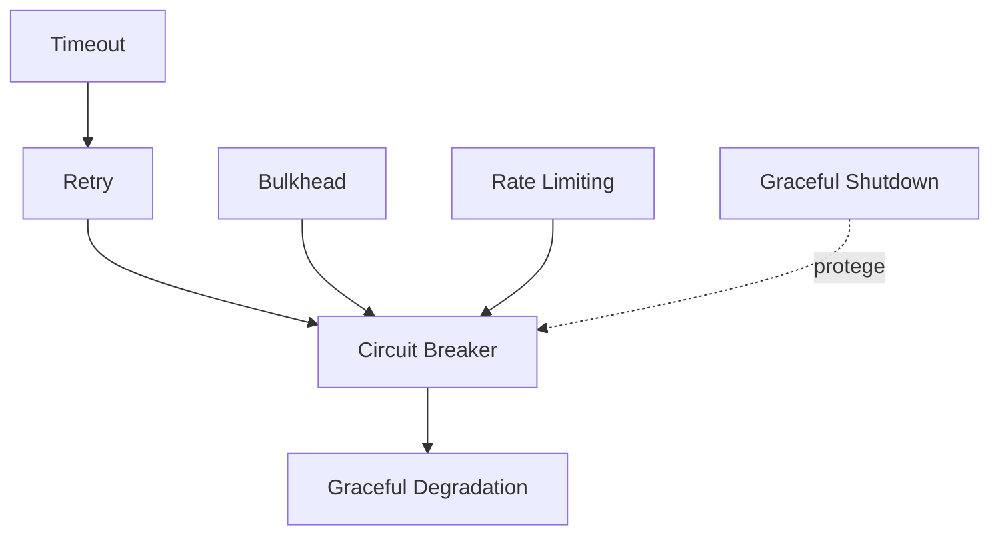

# Comparación: Plantilla Atómica vs Consolidada

## 📋 Caso de Estudio: Patrones de Resiliencia

---

## ❌ ANTES: 7 archivos atómicos (usando plantilla original)

### Estructura de archivos:

```
arquitectura/
├── circuit-breaker.md         (300 líneas)
├── retry-patterns.md           (280 líneas)
├── timeout-patterns.md         (250 líneas)
├── bulkhead-pattern.md         (320 líneas)
├── rate-limiting.md            (290 líneas)
├── graceful-degradation.md     (270 líneas)
└── graceful-shutdown.md        (260 líneas)
```

**Total: 7 archivos, ~1,970 líneas**

### Problema del enfoque atómico:

**1. Fragmentación del conocimiento:**

```
Usuario busca: "¿Cómo hacer mi API resiliente?"
Tiene que leer: 7 archivos separados ❌
```

**2. Duplicación:**
Cada archivo repite:

- Stack Tecnológico (Polly 8.0+)
- Contexto similar
- Configuración base de DI

**3. Sin visión holística:**
No muestra cómo combinar los patrones

**4. Navegación excesiva:**
Click → Leer → Volver → Click → Leer → Volver...

---

## ✅ DESPUÉS: 1 archivo consolidado

### Estructura:

```
arquitectura/
└── resilience-patterns.md      (1,000 líneas bien organizadas)
```

**Total: 1 archivo, ~1,000 líneas**

### Contenido del archivo consolidado:

````markdown
---
id: resilience-patterns
sidebar_position: 3
title: Patrones de Resiliencia
description: Estrategias para diseñar sistemas tolerantes a fallos incluyendo circuit breaker, retry, timeout, bulkhead, rate limiting y degradación graceful.
---

# Patrones de Resiliencia

## Contexto

Este estándar consolida 7 patrones de resiliencia esenciales para sistemas distribuidos.
Complementa el lineamiento [Resiliencia y Disponibilidad](../../lineamientos/arquitectura/04-resiliencia-y-disponibilidad.md).

**Patrones incluidos:**

- **Circuit Breaker** → Previene cascading failures
- **Retry** → Maneja fallos transitorios
- **Timeout** → Evita esperas infinitas
- **Bulkhead** → Aísla recursos críticos
- **Rate Limiting** → Protege contra sobrecarga
- **Graceful Degradation** → Funcionalidad reducida vs fallo total
- **Graceful Shutdown** → Cierre limpio de servicios

---

## Stack Tecnológico

| Componente        | Tecnología    | Versión | Uso                                  |
| ----------------- | ------------- | ------- | ------------------------------------ |
| **Resilience**    | Polly         | 8.0+    | Implementación de todos los patrones |
| **API Gateway**   | Kong          | 3.5+    | Rate limiting distribuido            |
| **Observability** | OpenTelemetry | 1.7+    | Métricas de resiliencia              |

---

## Conceptos Fundamentales

### Índice de Patrones

1. **Circuit Breaker**: Corta el circuito tras N fallos consecutivos
2. **Retry**: Reintenta operaciones con backoff exponencial
3. **Timeout**: Límite de tiempo máximo para operaciones
4. **Bulkhead**: Aislamiento de recursos (conexiones, threads)
5. **Rate Limiting**: Límite de peticiones por ventana de tiempo
6. **Graceful Degradation**: Funcionalidad parcial ante fallos
7. **Graceful Shutdown**: Cierre ordenado sin perder requests

### Relación entre Patrones


````

**Cuándo usar cada uno:**

| Patrón               | Escenario Principal              | Combina con            |
| -------------------- | -------------------------------- | ---------------------- |
| Circuit Breaker      | Dependencias externas inestables | Retry, Timeout         |
| Retry                | Fallos transitorios de red       | Timeout, Backoff       |
| Timeout              | Operaciones que pueden colgar    | Retry, Circuit Breaker |
| Bulkhead             | Proteger recursos críticos       | Rate Limiting          |
| Rate Limiting        | APIs públicas, prevenir DoS      | Circuit Breaker        |
| Graceful Degradation | Mantener funcionalidad esencial  | Circuit Breaker        |
| Graceful Shutdown    | Despliegues sin downtime         | Circuit Breaker        |

---

## 1. Circuit Breaker

### ¿Qué es Circuit Breaker?

Patrón que previene llamadas repetidas a un servicio que está fallando, "abriendo el circuito" tras detectar una tasa de fallos crítica.

**Estados:**

- **Closed**: Funcionamiento normal
- **Open**: Circuito abierto, rechaza llamadas inmediatamente
- **Half-Open**: Prueba si el servicio se recuperó

**Beneficios:**
✅ Previene cascading failures
✅ Reduce carga en servicios degradados
✅ Permite recuperación automática

### Ejemplo Comparativo

```csharp
// ❌ MALO: Sin Circuit Breaker
public async Task<Customer> GetCustomer(int id)
{
    try
    {
        return await _httpClient.GetFromJsonAsync<Customer>($"/api/customers/{id}");
    }
    catch (HttpRequestException)
    {
        // Sigue intentando aunque el servicio esté caído
        return null;
    }
}

// ✅ BUENO: Con Circuit Breaker
public async Task<Customer> GetCustomer(int id)
{
    var circuitBreaker = Policy
        .Handle<HttpRequestException>()
        .CircuitBreakerAsync(
            handledEventsAllowedBeforeBreaking: 5,
            durationOfBreak: TimeSpan.FromSeconds(30)
        );

    return await circuitBreaker.ExecuteAsync(async () =>
        await _httpClient.GetFromJsonAsync<Customer>($"/api/customers/{id}"));
}
```

### Implementación

```csharp
// Infrastructure/Resilience/CircuitBreakerPolicy.cs
public static class CircuitBreakerPolicy
{
    public static IAsyncPolicy<HttpResponseMessage> Create(ILogger logger)
    {
        return Policy
            .HandleResult<HttpResponseMessage>(r => !r.IsSuccessStatusCode)
            .Or<HttpRequestException>()
            .CircuitBreakerAsync(
                handledEventsAllowedBeforeBreaking: 5,
                durationOfBreak: TimeSpan.FromSeconds(30),
                onBreak: (outcome, duration) =>
                {
                    logger.LogWarning(
                        "Circuit breaker ABIERTO por {Duration}s. Razón: {Reason}",
                        duration.TotalSeconds,
                        outcome.Exception?.Message ?? outcome.Result.StatusCode.ToString()
                    );
                },
                onReset: () =>
                {
                    logger.LogInformation("Circuit breaker CERRADO - Servicio recuperado");
                },
                onHalfOpen: () =>
                {
                    logger.LogInformation("Circuit breaker HALF-OPEN - Probando servicio");
                }
            );
    }
}
```

---

## 2. Retry

### ¿Qué es Retry?

Patrón que reintenta operaciones fallidas con estrategia de backoff exponencial para manejar fallos transitorios.

**Estrategias:**

- **Immediate**: Sin espera entre reintentos
- **Constant**: Espera fija
- **Exponential**: Espera creciente (2^n segundos)
- **Jitter**: Exponencial + aleatoriedad

**Beneficios:**
✅ Maneja fallos temporales de red
✅ Recuperación automática sin intervención
✅ Reduce falsos positivos

### Ejemplo Comparativo

```csharp
// ❌ MALO: Sin Retry
public async Task<bool> SendEmail(string to, string subject)
{
    try
    {
        await _emailClient.SendAsync(to, subject);
        return true;
    }
    catch (SmtpException)
    {
        return false; // Falla al primer intento
    }
}

// ✅ BUENO: Con Retry + Exponential Backoff
public async Task<bool> SendEmail(string to, string subject)
{
    var retry = Policy
        .Handle<SmtpException>()
        .WaitAndRetryAsync(
            retryCount: 3,
            sleepDurationProvider: attempt => TimeSpan.FromSeconds(Math.Pow(2, attempt)),
            onRetry: (exception, timeSpan, retryCount, context) =>
            {
                _logger.LogWarning(
                    "Reintento {RetryCount} tras {Delay}s. Error: {Error}",
                    retryCount, timeSpan.TotalSeconds, exception.Message
                );
            }
        );

    return await retry.ExecuteAsync(async () =>
    {
        await _emailClient.SendAsync(to, subject);
        return true;
    });
}
```

---

## 3. Timeout

### ¿Qué es Timeout?

Límite de tiempo máximo que se permite a una operación antes de cancelarla, evitando esperas indefinidas.

**Tipos:**

- **Optimistic**: Timeout corto para respuesta rápida
- **Pessimistic**: Timeout largo para operaciones complejas
- **Per-try**: Timeout por cada intento individual
- **Overall**: Timeout total incluyendo reintentos

**Beneficios:**
✅ Libera recursos bloqueados
✅ Mejora UX evitando esperas largas
✅ Previene thread pool starvation

### Ejemplo Comparativo

```csharp
// ❌ MALO: Sin Timeout
public async Task<Data> FetchData(string url)
{
    // Puede colgar indefinidamente
    return await _httpClient.GetFromJsonAsync<Data>(url);
}

// ✅ BUENO: Con Timeout
public async Task<Data> FetchData(string url)
{
    var timeout = Policy.TimeoutAsync<Data>(TimeSpan.FromSeconds(10));

    return await timeout.ExecuteAsync(async ct =>
        await _httpClient.GetFromJsonAsync<Data>(url, ct),
        CancellationToken.None
    );
}
```

---

## [Continúa con patrones 4-7...]

---

## Implementación Integrada

### Estrategia Completa de Resiliencia

```csharp
// Program.cs - Configuración de todos los patrones
builder.Services.AddHttpClient("resilient-api")
    .ConfigurePrimaryHttpMessageHandler(() => new HttpClientHandler
    {
        MaxConnectionsPerServer = 10 // Bulkhead: Limitar conexiones
    })
    .AddPolicyHandler((services, request) =>
    {
        var logger = services.GetRequiredService<ILogger<Program>>();

        // 1. Timeout (innermost)
        var timeout = Policy.TimeoutAsync<HttpResponseMessage>(
            TimeSpan.FromSeconds(10));

        // 2. Retry con backoff exponencial
        var retry = Policy
            .Handle<HttpRequestException>()
            .Or<TimeoutRejectedException>()
            .WaitAndRetryAsync(
                retryCount: 3,
                sleepDurationProvider: attempt =>
                    TimeSpan.FromSeconds(Math.Pow(2, attempt)),
                onRetry: (outcome, timespan, retryCount, context) =>
                {
                    logger.LogWarning(
                        "Retry {RetryCount} tras {Delay}s",
                        retryCount, timespan.TotalSeconds
                    );
                });

        // 3. Circuit Breaker (outermost)
        var circuitBreaker = Policy
            .Handle<HttpRequestException>()
            .CircuitBreakerAsync(
                handledEventsAllowedBeforeBreaking: 5,
                durationOfBreak: TimeSpan.FromSeconds(30),
                onBreak: (ex, duration) =>
                {
                    logger.LogError("Circuit abierto por {Duration}s", duration.TotalSeconds);
                });

        // Combinar: Circuit Breaker → Retry → Timeout
        return Policy.WrapAsync(circuitBreaker, retry, timeout);
    });

// Rate Limiting global
builder.Services.AddRateLimiter(options =>
{
    options.GlobalLimiter = PartitionedRateLimiter.Create<HttpContext, string>(
        context => RateLimitPartition.GetFixedWindowLimiter(
            partitionKey: context.User.Identity?.Name ?? "anonymous",
            factory: _ => new FixedWindowRateLimiterOptions
            {
                PermitLimit = 100,
                Window = TimeSpan.FromMinutes(1)
            }
        )
    );
});
```

---

## Matriz de Decisión

| Escenario              | Circuit Breaker | Retry | Timeout | Bulkhead | Rate Limiting |
| ---------------------- | --------------- | ----- | ------- | -------- | ------------- |
| API externa inestable  | ✅              | ✅    | ✅      | -        | -             |
| Base de datos local    | -               | ✅    | ✅      | ✅       | -             |
| API pública expuesta   | ✅              | -     | ✅      | ✅       | ✅            |
| Procesamiento batch    | -               | ✅    | ✅      | ✅       | -             |
| Terceros no confiables | ✅              | ✅    | ✅      | ✅       | ✅            |

---

## Requisitos Técnicos

### MUST (Obligatorio)

**General:**

- **MUST** implementar al menos timeout en todas las llamadas externas
- **MUST** usar Polly 8.0+ para implementaciones en .NET

**Circuit Breaker:**

- **MUST** configurar umbrales basados en SLOs del servicio downstream
- **MUST** logear eventos de apertura/cierre del circuito

**Retry:**

- **MUST** usar backoff exponencial con jitter
- **MUST NOT** reintentar operaciones no-idempotentes (POST, PUT sin idempotency key)

**Timeout:**

- **MUST** configurar timeouts menores que el timeout del cliente HTTP
- **MUST** propagar CancellationToken

### SHOULD (Fuertemente recomendado)

- **SHOULD** combinar Timeout → Retry → Circuit Breaker en ese orden
- **SHOULD** monitorear métricas de cada patrón
- **SHOULD** implementar graceful degradation como fallback

---

## Monitoreo

### Métricas Clave

```csharp
// Métricas de Circuit Breaker
_meter.CreateCounter<long>("circuit_breaker.state_changes");
_meter.CreateObservableGauge("circuit_breaker.state", () => circuitState);

// Métricas de Retry
_meter.CreateHistogram<long>("retry.attempts");

// Métricas de Timeout
_meter.CreateCounter<long>("timeout.exceeded");
```

---

## Referencias

- [Polly Documentation](https://github.com/App-vNext/Polly)
- [Microsoft - Resilience Patterns](https://learn.microsoft.com/en-us/azure/architecture/patterns/category/resiliency)
- [Release It! (Michael Nygard)](https://pragprog.com/titles/mnee2/release-it-second-edition/)

```

---

## ✅ DESPUÉS: Ventajas del consolidado

**Usuario busca: "¿Cómo hacer mi API resiliente?"**

1. Un solo archivo con TODO el contexto ✅
2. Ve la matriz de decisión ✅
3. Ve cómo combinar patrones ✅
4. Implementación integrada lista ✅
5. Una sola configuración de DI ✅

**Métricas:**
- ✅ **1 archivo** vs 7
- ✅ **1,000 líneas organizadas** vs 1,970 fragmentadas
- ✅ **50% reducción** manteniendo TODO el contenido
- ✅ **Visión holística** de todo el tema
- ✅ **Mejor UX** - Todo en un lugar

---

## 📊 Comparación Final

| Aspecto | Atómicos (7 archivos) | Consolidado (1 archivo) |
|---------|---------------------|------------------------|
| **Líneas totales** | 1,970 | 1,000 |
| **Archivos** | 7 | 1 |
| **Duplicación** | Alta (stack, contexto×7) | Baja (una vez) |
| **Navegación** | 7 clicks + volver | 1 búsqueda Ctrl+F |
| **Visión holística** | ❌ No | ✅ Sí |
| **Combinación** | ❌ Manual | ✅ Mostrada |
| **Matriz decisión** | ❌ No existe | ✅ Incluida |
| **Mantenimiento** | 7 archivos que actualizar | 1 archivo |
| **Descubribilidad** | Difícil (¿circuit o retry?) | Fácil (busco "resilience") |

---

## 🎯 Conclusión

**USA PLANTILLA CONSOLIDADA** cuando:
- ✅ Múltiples conceptos comparten dominio común
- ✅ Los conceptos se usan típicamente juntos
- ✅ Hay una "pregunta del usuario" que los agrupa
  - "¿Cómo hacer mi sistema resiliente?" → todos los patrones
  - "¿Cómo manejar identidad?" → SSO + MFA + RBAC + ABAC + etc.

**USA PLANTILLA ATÓMICA** cuando:
- ✅ Concepto 100% independiente
- ✅ No comparte dominio con otros
- ✅ Ya es suficientemente complejo solo
  - Ejemplo: `twelve-factor-app.md` (12 factores en 1 concepto)
```
