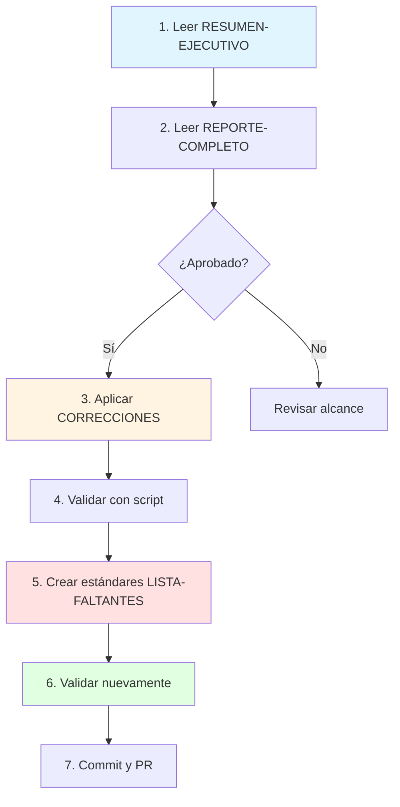

# 📚 Índice de Análisis de Referencias a Estándares

> Análisis completo de 35 lineamientos en docs/fundamentos-corporativos/lineamientos/
> Fecha: 17 de febrero de 2026

---

## 🎯 Documentos Generados

### 1. 📊 [RESUMEN-EJECUTIVO-REFERENCIAS.md](RESUMEN-EJECUTIVO-REFERENCIAS.md)

**Para:** Dirección y líderes técnicos
**Contenido:**

- Números clave y métricas
- Top 4 estándares críticos faltantes
- Cobertura por categoría (gráfico)
- Plan de acción de 4 semanas
- Recomendaciones ejecutivas

**⏱️ Tiempo de lectura:** 3-5 minutos

---

### 2. 📄 [REPORTE-ANALISIS-REFERENCIAS-ESTANDARES.md](REPORTE-ANALISIS-REFERENCIAS-ESTANDARES.md)

**Para:** Arquitectos y equipo técnico
**Contenido:**

- Análisis detallado de 122 referencias
- Enlaces rotos por categoría (40+ estándares faltantes)
- Lineamientos sin referencias (9)
- Gaps críticos priorizados
- Estadísticas completas
- Plan de acción detallado

**⏱️ Tiempo de lectura:** 10-15 minutos

---

### 3. 📋 [LISTA-ESTANDARES-FALTANTES.md](LISTA-ESTANDARES-FALTANTES.md)

**Para:** Equipo de implementación
**Contenido:**

- Lista completa de 44+ estándares a crear
- Priorización en 3 niveles (Crítico, Alta, Media)
- Contenido requerido por estándar
- Secciones específicas referenciadas
- Comandos útiles de ejecución
- Tracking de progreso

**⏱️ Tiempo de lectura:** 15-20 minutos

---

### 4. 🔧 [CORRECCIONES-REFERENCIAS.md](CORRECCIONES-REFERENCIAS.md)

**Para:** Equipo de implementación
**Contenido:**

- 5 correcciones específicas de referencias
- Duplicados detectados (arquitectura/ vs documentacion/)
- Script de corrección automática
- Checklist de validación
- Impacto de correcciones

**⏱️ Tiempo de lectura:** 5-10 minutos
**⚡ Acción:** Aplicar correcciones ANTES de crear estándares

---

## 🛠️ Scripts Generados

### 1. [scripts/analizar-referencias-estandares.py](scripts/analizar-referencias-estandares.py)

**Uso:**

```bash
python3 scripts/analizar-referencias-estandares.py
```

**Función:** Análisis completo automatizado de referencias

---

### 2. [scripts/validar-referencias-estandares.sh](scripts/validar-referencias-estandares.sh)

**Uso:**

```bash
bash scripts/validar-referencias-estandares.sh
```

**Función:** Validación de enlaces rotos (ejecutable)
**CI/CD:** ✅ Listo para integrar en pipeline

---

## 🚀 Flujo de Trabajo Recomendado



---

## 📊 Resumen de Hallazgos

| Métrica                 | Valor | Documento         |
| ----------------------- | ----- | ----------------- |
| Lineamientos analizados | 35    | RESUMEN-EJECUTIVO |
| Cobertura general       | 74%   | RESUMEN-EJECUTIVO |
| Enlaces rotos           | 40+   | REPORTE-COMPLETO  |
| Estándares críticos     | 4     | LISTA-FALTANTES   |
| Correcciones inmediatas | 5     | CORRECCIONES      |
| Duplicados              | 5     | CORRECCIONES      |

---

## 🎯 Roadmap de Implementación

### Semana 1 - CORRECCIONES + CRÍTICO

1. ✅ Leer documentación generada
2. ✅ Aplicar correcciones de referencias (5 items)
3. ✅ Crear 4 estándares críticos:
   - seguridad/data-protection.md
   - operabilidad/disaster-recovery.md
   - gobierno/architecture-review.md
   - desarrollo/repositorios.md

### Semana 2 - ALTA PRIORIDAD

4. ✅ Crear carpeta `gobierno/`
5. ✅ Crear 5 estándares de gobierno
6. ✅ Crear 4 estándares de seguridad

### Semana 3 - MEDIA PRIORIDAD

7. ✅ Crear estándares de arquitectura (5)
8. ✅ Agregar secciones faltantes (1)

### Semana 4 - VALIDACIÓN

9. ✅ Ejecutar validación completa
10. ✅ Revisar coherencia
11. ✅ Integrar validación en CI/CD
12. ✅ Documentar en README

---

## 🔍 Categorías de Estándares Faltantes

| Categoría      | Faltantes | Prioridad  | Ver Detalle     |
| -------------- | --------- | ---------- | --------------- |
| Gobierno       | 5         | 🔴 Crítico | LISTA-FALTANTES |
| Seguridad      | 6         | 🔴 Crítico | LISTA-FALTANTES |
| Operabilidad   | 1         | 🔴 Crítico | LISTA-FALTANTES |
| Desarrollo     | 1         | 🔴 Crítico | LISTA-FALTANTES |
| Arquitectura   | 6         | ⚡ Alta    | LISTA-FALTANTES |
| Observabilidad | 1         | ⚡ Alta    | LISTA-FALTANTES |
| APIs           | 1         | 📋 Media   | LISTA-FALTANTES |

---

## 📁 Estructura de Archivos

```
tlm-doc-architecture/
├── RESUMEN-EJECUTIVO-REFERENCIAS.md          ← 📊 Resumen para dirección
├── REPORTE-ANALISIS-REFERENCIAS-ESTANDARES.md ← 📄 Análisis completo
├── LISTA-ESTANDARES-FALTANTES.md             ← 📋 Plan de implementación
├── CORRECCIONES-REFERENCIAS.md               ← 🔧 Correcciones inmediatas
├── INDICE-ANALISIS-REFERENCIAS.md            ← 📚 Este archivo
│
├── docs/fundamentos-corporativos/
│   ├── lineamientos/                         ← 35 archivos analizados
│   │   ├── arquitectura/ (13)
│   │   ├── datos/ (3)
│   │   ├── desarrollo/ (4)
│   │   ├── gobierno/ (3)
│   │   ├── operabilidad/ (4)
│   │   └── seguridad/ (8)
│   │
│   └── estandares/                           ← 30 existentes, 40+ faltantes
│       ├── apis/ (1)
│       ├── arquitectura/ (4)
│       ├── datos/ (2)
│       ├── desarrollo/ (7)
│       ├── documentacion/ (3)
│       ├── gobierno/ (0) ← CREAR
│       ├── infraestructura/ (4)
│       ├── mensajeria/ (1)
│       ├── observabilidad/ (1)
│       ├── seguridad/ (6+1)
│       └── testing/ (1)
│
└── scripts/
    ├── analizar-referencias-estandares.py    ← 🐍 Análisis automático
    └── validar-referencias-estandares.sh     ← ✅ Validación (CI/CD ready)
```

---

## 💡 Preguntas Frecuentes

### ¿Por dónde empiezo?

👉 Lee [RESUMEN-EJECUTIVO-REFERENCIAS.md](RESUMEN-EJECUTIVO-REFERENCIAS.md) primero (3 min)

### ¿Qué debo crear primero?

👉 Aplica [CORRECCIONES-REFERENCIAS.md](CORRECCIONES-REFERENCIAS.md), luego los 4 críticos en [LISTA-ESTANDARES-FALTANTES.md](LISTA-ESTANDARES-FALTANTES.md)

### ¿Cómo valido mis cambios?

👉 Ejecuta:

```bash
bash scripts/validar-referencias-estandares.sh
```

### ¿Hay duplicados?

👉 Sí, 5 detectados. Ver [CORRECCIONES-REFERENCIAS.md](CORRECCIONES-REFERENCIAS.md)

### ¿Cuántos estándares faltan?

👉 40+ críticos. Ver priorización en [LISTA-ESTANDARES-FALTANTES.md](LISTA-ESTANDARES-FALTANTES.md)

---

## 🎓 Contexto del Análisis

### Metodología

1. ✅ Búsqueda de referencias con `grep_search`
2. ✅ Verificación de existencia de archivos
3. ✅ Clasificación por prioridad
4. ✅ Detección de duplicados
5. ✅ Generación de reportes

### Herramientas Utilizadas

- Python 3 (análisis automatizado)
- Bash (validación de enlaces)
- Grep/Find (búsqueda de patrones)
- Markdown (documentación)

### Cobertura del Análisis

- ✅ 35 lineamientos (100%)
- ✅ 6 categorías
- ✅ 122 referencias encontradas
- ✅ 70+ referencias únicas
- ✅ 30 estándares existentes verificados

---

## 📞 Próximos Pasos

### Acción Inmediata (HOY)

1. Leer RESUMEN-EJECUTIVO-REFERENCIAS.md
2. Aprobar plan de acción
3. Asignar responsables

### Esta Semana

4. Aplicar CORRECCIONES-REFERENCIAS.md
5. Crear 4 estándares críticos
6. Validar con scripts

### Próximas Semanas

7. Seguir LISTA-ESTANDARES-FALTANTES.md
8. Integrar validación en CI/CD
9. Mantener documentación actualizada

---

## 🏆 Métricas de Éxito

Al completar el plan:

- ✅ 100% de referencias válidas (0 enlaces rotos)
- ✅ 100% de lineamientos con al menos 1 referencia
- ✅ Validación automática en CI/CD
- ✅ Documentación coherente y navegable

---

> **Generado el:** 17 de febrero de 2026
> **Herramientas:** grep_search, file_search, análisis manual
> **Estado:** ✅ Completo y listo para implementación
