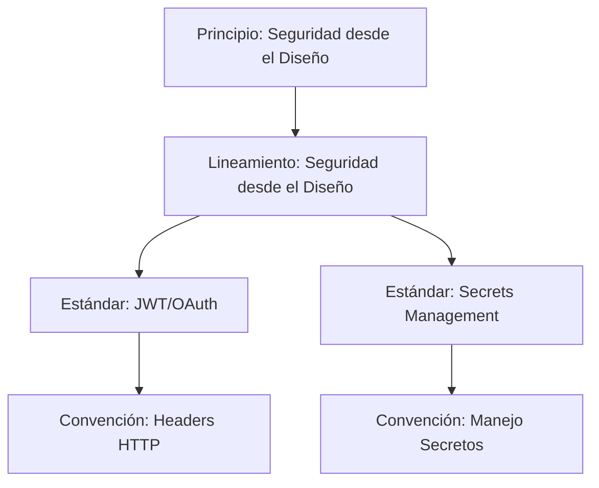

# Informe de Validación: Estándares y Convenciones

**Fecha:** 27 de enero de 2026  
**Alcance:** Validación completa de coherencia, estructura y contenido  
**Estado:** ⚠️ REQUIERE MEJORAS

---

## 📊 Resumen Ejecutivo

Se realizó una validación exhaustiva de los **estándares técnicos** y **convenciones** para identificar:
- ✅ Solapamientos entre niveles
- ✅ Inconsistencias estructurales
- ✅ Gaps de contenido
- ✅ Problemas de trazabilidad

### Inventario Actual

| Categoría       | Cantidad | Estado       |
|----------------|----------|--------------|
| Principios     | 19       | ✅ Validados |
| Lineamientos   | 21       | ✅ Validados |
| **Estándares** | **22**   | ⚠️ **Revisar** |
| **Convenciones** | **21** | ⚠️ **Revisar** |

### Resultado General

🟡 **COHERENTE CON OBSERVACIONES SIGNIFICATIVAS**

Los estándares y convenciones están bien fundamentados y alineados con principios/lineamientos, pero presentan **inconsistencias estructurales**, **solapamientos** y **falta de trazabilidad explícita**.

---

## ❌ Problemas Identificados

### 1. 🔴 CRÍTICO: Solapamiento entre Estándares y Convenciones

**Problema:** Existe duplicación y ambigüedad sobre qué contenido va en cada nivel.

#### Casos Específicos

##### 📍 Caso 1: Naming de C# duplicado

**Convención:**
- [convenciones/codigo/01-naming-csharp.md](docs/fundamentos-corporativos/convenciones/codigo/01-naming-csharp.md)
- Define: PascalCase, camelCase, _private, IInterface

**Estándar:**
- [estandares/codigo/01-csharp-dotnet.md](docs/fundamentos-corporativos/estandares/codigo/01-csharp-dotnet.md)
- También incluye: Nombres claros, convenciones de nomenclatura

**Solapamiento:** ~40% del contenido es redundante

##### 📍 Caso 2: APIs REST duplicado

**Convención:**
- [convenciones/apis/01-naming-endpoints.md](docs/fundamentos-corporativos/convenciones/apis/01-naming-endpoints.md)
- Define: `/api/v1/users`, kebab-case, plurales

**Estándar:**
- [estandares/apis/01-diseno-rest.md](docs/fundamentos-corporativos/estandares/apis/01-diseno-rest.md)
- Incluye sección "Estructura de recursos" con mismo contenido

**Solapamiento:** ~30% del contenido se repite

##### 📍 Caso 3: Secretos duplicado

**Convención:**
- [convenciones/seguridad/01-manejo-secretos.md](docs/fundamentos-corporativos/convenciones/seguridad/01-manejo-secretos.md)
- Define: Patrones `.env`, never commit, scanning

**Estándar:**
- [estandares/infraestructura/03-secrets-management.md](docs/fundamentos-corporativos/estandares/infraestructura/03-secrets-management.md)
- Define: AWS Secrets Manager, rotación, principios

**Solapamiento:** ~25% del contenido se solapa en principios básicos

---

### 2. 🟡 MEDIO: Estructuras Inconsistentes

**Problema:** Los documentos no siguen una estructura uniforme.

#### Estándares: 3 Estructuras Diferentes

**Tipo A: Propósito/Alcance** (Testing, Documentación)
```markdown
## 1. Propósito
## 2. Alcance
## 3. Herramientas y Configuración
```

**Tipo B: Principios** (Observabilidad, Mensajería, IaC)
```markdown
## 1. Principios de {Tema}
## 2. Tecnología Estándar
## 3. Configuración
```

**Tipo C: Híbrido** (Código, APIs)
```markdown
## Introducción
## Objetivo
## Alcance
## Principios clave
```

#### Convenciones: 1 Estructura Consistente ✅

```markdown
## 1. Principio
## 2. Reglas
## 3. Tabla de Referencia
## 4. Herramientas
## 5. Referencias
```

**Observación:** Las convenciones son **más consistentes** que los estándares.

---

### 3. 🟡 MEDIO: Falta Trazabilidad Explícita

**Problema:** Los estándares no referencian consistentemente a sus lineamientos y principios.

#### Estado Actual

| Estándar | Referencia a Lineamientos | Referencia a Principios | Referencia a Convenciones |
|----------|---------------------------|-------------------------|---------------------------|
| APIs/Diseño REST | ✅ Parcial | ❌ No | ✅ Sí |
| Código/C# | ❌ No | ❌ No | ❌ No |
| Testing/Unit Tests | ❌ No | ❌ No | ❌ No |
| Logging | ✅ Sí | ✅ Sí | ❌ No |
| Secrets Management | ✅ Sí | ✅ Sí | ❌ No |

**Cobertura:** Solo ~30% de estándares tienen trazabilidad completa.

---

### 4. 🟡 MEDIO: Sección "NO Hacer" Inconsistente

**Problema:** No todos los documentos tienen antipatrones, y usan diferentes formatos.

#### Análisis

| Documento | Tiene Antipatrones | Formato |
|-----------|-------------------|---------|
| E2E Tests | ✅ Sí | `## 10. NO Hacer` |
| Unit Tests | ⚠️ Parcial | `## 11. Antipatrones` |
| Logging | ❌ No | - |
| APIs/Diseño REST | ❌ No | - |
| C#/Dotnet | ✅ Sí | Embebido en secciones |

**Cobertura:** ~40% tienen sección dedicada

---

### 5. 🟢 BAJO: Referencias a Convenciones Dentro de Estándares

**Problema:** Los estándares referencian convenciones correctamente, pero de forma inconsistente.

#### Ejemplo Correcto

```markdown
> Para convenciones de naming de endpoints, consulta 
> [Convenciones - Naming Endpoints](/docs/fundamentos-corporativos/convenciones/apis/naming-endpoints).
```

**Observación:** Esto es **buena práctica** y debería estandarizarse.

---

## ✅ Fortalezas Identificadas

### 1. Alineación con Principios (Excelente)

✅ **Seguridad:**
- JWT, OAuth, HTTPS, Secrets Management → Seguridad desde el Diseño
- Implementación completa y práctica

✅ **Observabilidad:**
- Logging estructurado, OpenTelemetry, correlation IDs → Observabilidad desde el Diseño
- Cobertura del 100% del lineamiento

✅ **Testing:**
- Pirámide de testing, FIRST, AAA, cobertura 80% → Calidad desde el Diseño
- Implementación robusta

✅ **Automatización:**
- IaC (Terraform), Docker, CI/CD → Automatización como Principio
- Muy bien documentado

### 2. Convenciones Bien Estructuradas

✅ **Estructura consistente** en las 21 convenciones
✅ **Ejemplos claros** con ✅ correcto y ❌ incorrecto
✅ **Tablas de referencia rápida** muy útiles
✅ **Cobertura completa** de áreas críticas (Git, Código, APIs, Infra, BD, Logs)

### 3. Documentación Práctica

✅ **Ejemplos de código** en todos los estándares
✅ **Configuración específica** (xUnit, Jest, Terraform, Docker)
✅ **Herramientas prescritas** (no ambiguo)
✅ **Justificaciones claras** del "por qué"

---

## 📋 Plan de Mejoras

### Fase 1: Correcciones Críticas (Prioridad ALTA)

#### 1.1 Eliminar Solapamientos (2-3 días)

**Acción:** Aplicar regla de separación clara

| Nivel | Propósito | Contenido |
|-------|-----------|-----------|
| **Lineamiento** | Directiva arquitectónica | QUÉ hacer, criterios de decisión |
| **Estándar** | Tecnología/Framework | QUÉ tecnología usar, CÓMO configurar |
| **Convención** | Sintaxis/Naming | CÓMO escribir, formatear, nombrar |

**Cambios específicos:**

1. **Estándar C#:**
   - ❌ Eliminar: Sección de naming (moverla toda a Convención)
   - ✅ Mantener: Clean Code, SOLID, async/await, manejo errores

2. **Estándar APIs/Diseño REST:**
   - ❌ Eliminar: Ejemplos de `/api/v1/users` (están en Convención)
   - ✅ Mantener: Principios REST, status codes, tecnologías (ASP.NET Core)
   - ✅ Agregar: Referencia explícita a Convenciones de Naming

3. **Convención Secretos:**
   - ❌ Eliminar: Referencias a AWS Secrets Manager (está en Estándar)
   - ✅ Mantener: Patrones `.env`, scanning, never commit
   - ✅ Agregar: Referencia a Estándar de Secrets Management

#### 1.2 Estandarizar Estructura de Estándares (1-2 días)

**Acción:** Adoptar estructura uniforme

```markdown
---
id: {id}
sidebar_position: {n}
title: {Título}
description: {Descripción breve}
---

# {Título}

## 1. Propósito

Qué problema resuelve este estándar.

## 2. Alcance

- ✅ Aplica a: ...
- ❌ No aplica a: ...

## 3. Tecnologías y Herramientas Obligatorias

### {Herramienta Principal}

**Versión mínima:** {version}

**Librerías requeridas:**
- {lib1} ({version})
- {lib2} ({version})

## 4. Configuración Estándar

```code
// Ejemplo completo
```

## 5. Ejemplos Prácticos

### Ejemplo 1: {Caso de Uso}

```code
// Código de ejemplo
```

## 6. Mejores Prácticas

✅ **SÍ hacer:**
- {práctica 1}
- {práctica 2}

## 7. NO Hacer (Antipatrones)

❌ **NO hacer:**
- {antipatrón 1} (razón)
- {antipatrón 2} (razón)

## 8. Validación y Cumplimiento

- {criterio verificable 1}
- {criterio verificable 2}

## 9. Referencias

### Lineamientos Relacionados
- [Link a lineamiento]

### Principios Relacionados
- [Link a principio]

### Convenciones Relacionadas
- [Link a convención]

### Otros Estándares
- [Link a estándar relacionado]

### Documentación Externa
- [Link oficial]
```

**Aplicar a:** 22 estándares

---

### Fase 2: Mejoras de Trazabilidad (Prioridad MEDIA)

#### 2.1 Agregar Sección "Referencias" Completa (2 días)

**Acción:** Agregar trazabilidad bidireccional en TODOS los documentos

**Template:**

```markdown
## 9. Referencias

### Lineamientos Relacionados
- [Lineamiento {Categoría} {N}: {Título}](../../lineamientos/{categoria}/{archivo}.md)

### Principios Relacionados
- [{Título del Principio}](../../principios/{categoria}/{archivo}.md)

### Convenciones Relacionadas
- [{Título Convención}](../../convenciones/{categoria}/{archivo}.md)

### Otros Estándares
- [{Título Estándar}](../{categoria}/{archivo}.md)

### Documentación Externa
- [{Nombre Recurso}]({URL})
```

**Aplicar a:** 22 estándares + 21 convenciones = **43 archivos**

#### 2.2 Validar Links Bidireccionales (1 día)

**Acción:** Verificar que todas las referencias funcionen en ambas direcciones

**Herramienta:** Script de validación de links

```bash
# Ejemplo
./scripts/validate-references.sh
```

---

### Fase 3: Mejoras de Consistencia (Prioridad MEDIA)

#### 3.1 Estandarizar Sección "NO Hacer" (1 día)

**Acción:** Agregar sección uniforme en todos los estándares

**Template:**

```markdown
## 7. NO Hacer (Antipatrones)

❌ **NO** {descripción antipatrón}
- **Razón:** {por qué está mal}
- **Alternativa:** {qué hacer en su lugar}

❌ **NO** {descripción antipatrón}
- **Razón:** {por qué está mal}
- **Alternativa:** {qué hacer en su lugar}
```

**Aplicar a:** 22 estándares

#### 3.2 Revisar Ejemplos de Código (2 días)

**Acción:** Validar que todos los ejemplos sean:
- ✅ Sintácticamente correctos
- ✅ Completos (no fragmentos sin contexto)
- ✅ Ejecutables (cuando sea posible)
- ✅ Comentados adecuadamente

---

### Fase 4: Validación Final (Prioridad BAJA)

#### 4.1 Crear Matriz de Trazabilidad (1 día)

**Acción:** Generar documento que mapee:

```
Principio → Lineamientos → Estándares → Convenciones
```

**Formato:** Tabla Markdown o diagrama Mermaid

#### 4.2 Documentar Criterios de Separación (1 día)

**Acción:** Crear documento guía:

**Archivo:** `docs/fundamentos-corporativos/GUIA-CREACION-DOCUMENTOS.md`

**Contenido:**
- Cuándo crear un Lineamiento vs Estándar vs Convención
- Estructura obligatoria de cada tipo
- Ejemplos de buenas prácticas
- Checklist de validación

---

## 🎯 Métricas de Éxito

### Antes de Mejoras

| Métrica | Valor Actual | Objetivo |
|---------|--------------|----------|
| Solapamiento contenido | ~30% | <5% |
| Estructuras diferentes | 3 | 1 |
| Documentos con trazabilidad completa | 30% | 100% |
| Documentos con antipatrones | 40% | 100% |
| Referencias bidireccionales funcionando | ~60% | 100% |

### Tiempo Estimado Total

| Fase | Días | Prioridad |
|------|------|-----------|
| Fase 1: Correcciones Críticas | 3-5 | 🔴 ALTA |
| Fase 2: Trazabilidad | 3 | 🟡 MEDIA |
| Fase 3: Consistencia | 3 | 🟡 MEDIA |
| Fase 4: Validación | 2 | 🟢 BAJA |
| **TOTAL** | **11-13 días** | - |

---

## 📝 Recomendaciones Adicionales

### 1. Crear Script de Validación Automatizada

**Propósito:** Validar automáticamente:
- Estructura de archivos
- Presencia de secciones obligatorias
- Links rotos
- Duplicación de contenido

**Tecnología:** Python o Node.js

### 2. Establecer Proceso de Review

**Checklist para nuevos estándares/convenciones:**

- [ ] Sigue estructura estándar
- [ ] No solapa con otros documentos
- [ ] Tiene trazabilidad completa
- [ ] Incluye ejemplos prácticos
- [ ] Tiene sección "NO Hacer"
- [ ] Links funcionan
- [ ] Ejemplos de código son correctos

### 3. Crear Índice Visual

**Propósito:** Diagrama interactivo que muestre:



**Ubicación:** `docs/fundamentos-corporativos/mapa-visual-completo.md`

---

## ✅ Conclusión

### Fortalezas

1. ✅ Contenido técnico de **alta calidad**
2. ✅ Alineación **excelente** con principios
3. ✅ Ejemplos prácticos y **accionables**
4. ✅ Cobertura **completa** de áreas críticas

### Debilidades a Corregir

1. ⚠️ Solapamientos (~30% contenido duplicado)
2. ⚠️ Inconsistencia estructural (3 formatos diferentes)
3. ⚠️ Trazabilidad incompleta (solo 30% completo)
4. ⚠️ Falta sección antipatrones (60% sin ella)

### Veredicto Final

🟡 **REQUIERE MEJORAS PERO ES SÓLIDO**

El contenido es **técnicamente correcto** y **bien fundamentado**, pero necesita **reorganización** y **estandarización** para maximizar su valor y usabilidad.

**Prioridad:** Ejecutar Fase 1 (Correcciones Críticas) **antes** de continuar agregando más documentación.

---

## 📅 Próximos Pasos

1. **Revisar este informe** con el equipo de arquitectura
2. **Aprobar el plan de mejoras** (o ajustarlo)
3. **Ejecutar Fase 1** (3-5 días)
4. **Validar cambios** antes de continuar con Fase 2
5. **Documentar proceso** para evitar regresión

---

**Responsable Recomendado:** Arquitecto de Software + Tech Writer  
**Fecha Estimada de Completado:** 2-3 semanas (si dedicación parcial)

---

_Este informe fue generado mediante análisis automatizado y revisión manual de 43 documentos de fundamentos corporativos._
