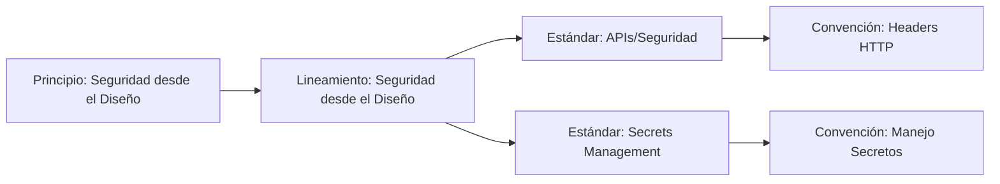
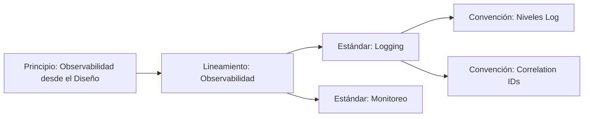
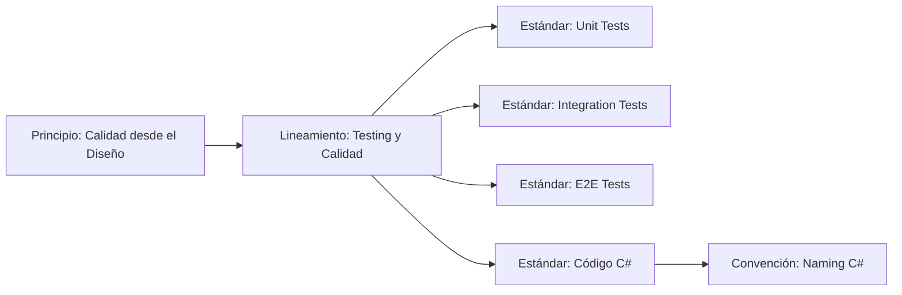

# Plan de Mejoras: Estándares y Convenciones

**Fecha:** 27 de enero de 2026  
**Versión:** 1.0  
**Estado:** 📋 PENDIENTE APROBACIÓN

---

## 🎯 Objetivo

Eliminar solapamientos, estandarizar estructuras y mejorar trazabilidad de estándares y convenciones para maximizar su valor y usabilidad.

---

## 📊 Resumen de Cambios Propuestos

| Categoría | Cambios | Archivos Afectados | Esfuerzo |
|-----------|---------|-------------------|----------|
| **Eliminación de Solapamientos** | Consolidar contenido duplicado | 6 archivos | 2-3 días |
| **Estandarización de Estructura** | Unificar formato | 22 archivos | 1-2 días |
| **Trazabilidad** | Agregar referencias | 43 archivos | 2-3 días |
| **Antipatrones** | Agregar sección "NO Hacer" | 13 archivos | 1 día |
| **Validación** | Scripts y checklists | 3 archivos | 2 días |
| **TOTAL** | - | **43 archivos** | **8-11 días** |

---

## 📅 FASE 1: Correcciones Críticas (PRIORIDAD ALTA)

### 🔴 Tarea 1.1: Separar Naming de Estándares de Código

**Problema:** Solapamiento entre estándar C# y convención C#

#### Archivos a Modificar

**1. estandares/codigo/01-csharp-dotnet.md**

**Acción:** ELIMINAR contenido de naming

**Contenido a eliminar:**
- Sección de nombres de variables/clases (va a Convención)

**Contenido a mantener:**
- Principios Clean Code (SOLID, DRY, KISS, YAGNI)
- Async/await
- Manejo de errores
- LINQ
- Dependency Injection
- Entity Framework

**Contenido a agregar:**
```markdown
## 9. Referencias

### Convenciones Relacionadas
- [Naming - C#](../../convenciones/codigo/01-naming-csharp.md)

### Lineamientos Relacionados
- [Testing y Calidad](../../lineamientos/operabilidad/04-testing-y-calidad.md)

### Principios Relacionados
- [Calidad desde el Diseño](../../principios/operabilidad/03-calidad-desde-el-diseno.md)
```

---

**2. estandares/codigo/02-typescript.md**

**Acción:** ELIMINAR contenido de naming

**Contenido a eliminar:**
- Sección de nombres de variables/clases (va a Convención)

**Contenido a mantener:**
- Principios Clean Code para TypeScript
- Type safety
- Async/await
- Error handling

**Contenido a agregar:**
```markdown
## 9. Referencias

### Convenciones Relacionadas
- [Naming - TypeScript](../../convenciones/codigo/02-naming-typescript.md)
```

---

### 🔴 Tarea 1.2: Separar Naming de Endpoints de Diseño REST

**Problema:** Solapamiento entre estándar APIs/Diseño REST y convención Naming Endpoints

#### Archivos a Modificar

**1. estandares/apis/01-diseno-rest.md**

**Acción:** ELIMINAR ejemplos específicos de naming

**Contenido a eliminar:**
```markdown
## Estructura de recursos

### Jerarquía de recursos

```text
/api/v1/companies/{company-id}
├── /users                    
├── /departments              
```

**Esto debe estar SOLO en Convenciones**

**Contenido a mantener:**
- Principios RESTful (sin estado, recursos, verbos HTTP)
- Códigos de estado HTTP
- Tecnologías (ASP.NET Core, configuración)
- Paginación (implementación técnica)

**Contenido a agregar:**
```markdown
## 2. Estructura de Recursos

Para convenciones de nomenclatura de endpoints, consulta:
- [Convenciones - Naming Endpoints](../../convenciones/apis/01-naming-endpoints.md)

Las decisiones de diseño REST deben considerar:
- Principios de recursos representacionales
- Uso apropiado de verbos HTTP
- Status codes según operación
```

---

**2. convenciones/apis/01-naming-endpoints.md**

**Acción:** CONSOLIDAR todo el naming aquí

**Contenido a verificar está completo:**
- ✅ Estructura base `/api/v{version}/{recurso}`
- ✅ Plurales vs singulares
- ✅ kebab-case
- ✅ Sub-recursos
- ✅ Acciones no-CRUD
- ✅ Query parameters (filtros, sorting)

**Contenido a agregar:**
```markdown
## 6. Referencias

### Estándares Relacionados
- [Diseño REST](../../estandares/apis/01-diseno-rest.md) - Implementación técnica
- [Versionado APIs](../../estandares/apis/04-versionado.md)

### Lineamientos Relacionados
- [Diseño de APIs](../../lineamientos/arquitectura/06-diseno-de-apis.md)
```

---

### 🔴 Tarea 1.3: Separar Secretos entre Convención y Estándar

**Problema:** Solapamiento entre convención manejo secretos y estándar secrets management

#### Archivos a Modificar

**1. convenciones/seguridad/01-manejo-secretos.md**

**Acción:** ENFOCARSE solo en reglas de código y git

**Contenido a mantener:**
- Never commit secrets
- Patrones de archivos (`.env`, `.env.local`, `.env.example`)
- Git ignore patterns
- Scanning de secretos (git-secrets, trufflehog)
- Formato de variables de entorno

**Contenido a eliminar:**
- Referencias específicas a AWS Secrets Manager (va a Estándar)
- Rotación de secretos (va a Estándar)

**Contenido a agregar:**
```markdown
## 6. Referencias

### Estándares Relacionados
- [Secrets Management](../../estandares/infraestructura/03-secrets-management.md) - Herramientas y rotación

### Lineamientos Relacionados
- [Seguridad desde el Diseño](../../lineamientos/seguridad/01-seguridad-desde-el-diseno.md)
```

---

**2. estandares/infraestructura/03-secrets-management.md**

**Acción:** ENFOCARSE en tecnología y arquitectura

**Contenido a mantener:**
- AWS Secrets Manager
- Azure Key Vault
- HashiCorp Vault
- Rotación automática
- Encryption at rest/in transit
- IAM policies

**Contenido a agregar:**
```markdown
## 9. Referencias

### Convenciones Relacionadas
- [Manejo de Secretos](../../convenciones/seguridad/01-manejo-secretos.md) - Reglas de código

### Lineamientos Relacionados
- [Seguridad desde el Diseño](../../lineamientos/seguridad/01-seguridad-desde-el-diseno.md)
- [Diseño Cloud Native](../../lineamientos/arquitectura/03-diseño-cloud-native.md)
```

---

### 🔴 Tarea 1.4: Estandarizar Estructura de TODOS los Estándares

**Acción:** Aplicar template uniforme a 22 archivos

#### Template a Aplicar

```markdown
---
id: {id}
sidebar_position: {n}
title: {Título}
description: {Descripción breve}
---

# {Título}

## 1. Propósito

Explicación clara de qué problema resuelve este estándar.

## 2. Alcance

**Aplica a:**
- Tipo de proyecto 1
- Tipo de proyecto 2

**No aplica a:**
- Excepción 1
- Excepción 2

## 3. Tecnologías y Herramientas Obligatorias

### {Herramienta Principal}

**Versión mínima:** {version}

**Librerías requeridas:**
- `{libreria}` ({version}) - {propósito}

**Instalación:**

```bash
# Comando de instalación
```

## 4. Configuración Estándar

### Configuración Mínima

```code
// Ejemplo completo de configuración
```

### Configuración Avanzada (Opcional)

```code
// Configuración para casos específicos
```

## 5. Ejemplos Prácticos

### Ejemplo 1: {Caso de Uso Básico}

**Contexto:** {Explicación del escenario}

```code
// Código completo y ejecutable
```

**Explicación:** {Qué hace el código}

### Ejemplo 2: {Caso de Uso Avanzado}

```code
// Código completo y ejecutable
```

## 6. Mejores Prácticas

✅ **SÍ hacer:**
- {Práctica 1} - {justificación}
- {Práctica 2} - {justificación}

## 7. NO Hacer (Antipatrones)

❌ **NO** {descripción antipatrón}
- **Razón:** {por qué está mal}
- **Alternativa:** {qué hacer en su lugar}

❌ **NO** {descripción antipatrón}
- **Razón:** {por qué está mal}
- **Alternativa:** {qué hacer en su lugar}

## 8. Validación y Cumplimiento

**Criterios verificables:**
- [ ] {Criterio 1}
- [ ] {Criterio 2}

**Herramientas de validación:**
- {Linter/Tool} - {qué valida}

## 9. Referencias

### Lineamientos Relacionados
- [{Título}](../../lineamientos/{categoria}/{archivo}.md)

### Principios Relacionados
- [{Título}](../../principios/{categoria}/{archivo}.md)

### Convenciones Relacionadas
- [{Título}](../../convenciones/{categoria}/{archivo}.md)

### Otros Estándares
- [{Título}](../{categoria}/{archivo}.md)

### Documentación Externa
- [{Nombre}]({URL}) - {Descripción}
```

#### Lista de Archivos a Actualizar

**APIs (5 archivos):**
- [x] 01-diseno-rest.md
- [ ] 02-seguridad-apis.md
- [ ] 03-validacion-y-errores.md
- [ ] 04-versionado.md
- [ ] 05-performance.md

**Código (3 archivos):**
- [x] 01-csharp-dotnet.md
- [x] 02-typescript.md
- [ ] 03-sql.md

**Infraestructura (4 archivos):**
- [ ] 01-docker.md
- [ ] 02-infraestructura-como-codigo.md
- [x] 03-secrets-management.md
- [ ] 04-docker-compose.md

**Testing (3 archivos):**
- [ ] 01-unit-tests.md
- [ ] 02-integration-tests.md
- [ ] 03-e2e-tests.md

**Observabilidad (2 archivos):**
- [ ] 01-logging.md
- [ ] 02-monitoreo-metricas.md

**Mensajería (2 archivos):**
- [ ] 01-kafka-eventos.md
- [ ] 02-queues.md

**Documentación (3 archivos):**
- [ ] 01-arc42.md
- [ ] 02-c4-model.md
- [ ] 03-openapi-swagger.md

---

## 📅 FASE 2: Trazabilidad (PRIORIDAD MEDIA)

### 🟡 Tarea 2.1: Agregar Sección Referencias a Estándares

**Acción:** Agregar sección 9 (Referencias) a TODOS los estándares

#### Matriz de Trazabilidad

| Estándar | → Lineamiento | → Principio | → Convención |
|----------|---------------|-------------|--------------|
| APIs/Diseño REST | Diseño de APIs | Contratos Integración | Naming Endpoints |
| APIs/Seguridad | Seguridad desde Diseño | Seguridad desde Diseño | Headers HTTP |
| APIs/Validación | Diseño de APIs | - | Formato Respuestas |
| APIs/Versionado | Diseño de APIs | Arquitectura Evolutiva | - |
| APIs/Performance | Resiliencia y Disponibilidad | - | - |
| Código/C# | Testing y Calidad | Calidad desde Diseño | Naming C# |
| Código/TypeScript | Testing y Calidad | Calidad desde Diseño | Naming TypeScript |
| Código/SQL | - | - | Naming PostgreSQL |
| Infra/Docker | IaC | Automatización | - |
| Infra/IaC | IaC | Automatización | Tags AWS |
| Infra/Secrets | Seguridad desde Diseño | Seguridad desde Diseño | Manejo Secretos |
| Infra/Docker Compose | IaC | Consistencia Entornos | - |
| Testing/Unit | Testing y Calidad | Calidad desde Diseño | - |
| Testing/Integration | Testing y Calidad | Calidad desde Diseño | - |
| Testing/E2E | Testing y Calidad | Calidad desde Diseño | - |
| Observ/Logging | Observabilidad | Observ desde Diseño | Niveles Log, Correlation IDs |
| Observ/Monitoreo | Observabilidad | Observ desde Diseño | - |
| Mensaj/Kafka | Comunicación Asíncrona | - | - |
| Mensaj/Queues | Comunicación Asíncrona | - | - |
| Doc/arc42 | Decisiones Arquitectónicas | - | - |
| Doc/C4 | Decisiones Arquitectónicas | - | - |
| Doc/OpenAPI | Diseño de APIs | - | - |

---

### 🟡 Tarea 2.2: Agregar Sección Referencias a Convenciones

**Acción:** Agregar sección de referencias a las 21 convenciones

#### Template para Convenciones

```markdown
## 6. Referencias

### Estándares Relacionados
- [{Título}](../../estandares/{categoria}/{archivo}.md)

### Lineamientos Relacionados
- [{Título}](../../lineamientos/{categoria}/{archivo}.md)

### Principios Relacionados
- [{Título}](../../principios/{categoria}/{archivo}.md)

### Otras Convenciones
- [{Título}](./{archivo}.md)
```

#### Lista de Convenciones (21)

**Git (5):**
- [ ] 01-naming-repositorios.md
- [ ] 02-naming-ramas.md
- [ ] 03-commits.md
- [ ] 04-tags-releases.md
- [ ] 05-pull-requests.md

**Código (4):**
- [x] 01-naming-csharp.md
- [x] 02-naming-typescript.md
- [ ] 03-comentarios-codigo.md
- [ ] 04-estructura-proyectos.md

**APIs (4):**
- [x] 01-naming-endpoints.md
- [ ] 02-headers-http.md
- [ ] 03-formato-respuestas.md
- [ ] 04-formato-fechas-moneda.md

**Infraestructura (3):**
- [ ] 01-naming-aws.md
- [ ] 02-tags-metadatos.md
- [ ] 03-variables-entorno.md

**Base de Datos (2):**
- [ ] 01-naming-postgresql.md
- [ ] 02-naming-migraciones.md

**Logs (2):**
- [ ] 01-niveles-log.md
- [ ] 02-correlation-ids.md

**Seguridad (1):**
- [x] 01-manejo-secretos.md

---

## 📅 FASE 3: Consistencia (PRIORIDAD MEDIA)

### 🟡 Tarea 3.1: Agregar Sección "NO Hacer" a Estándares

**Acción:** Agregar antipatrones a estándares que no los tienen

#### Estándares sin Antipatrones (13)

**APIs:**
- [ ] 01-diseno-rest.md
- [ ] 02-seguridad-apis.md
- [ ] 03-validacion-y-errores.md
- [ ] 05-performance.md

**Código:**
- [ ] 03-sql.md

**Infraestructura:**
- [ ] 01-docker.md
- [ ] 02-infraestructura-como-codigo.md
- [ ] 04-docker-compose.md

**Observabilidad:**
- [ ] 01-logging.md
- [ ] 02-monitoreo-metricas.md

**Mensajería:**
- [ ] 01-kafka-eventos.md
- [ ] 02-queues.md

**Documentación:**
- [ ] 03-openapi-swagger.md

#### Template de Antipatrones

```markdown
## 7. NO Hacer (Antipatrones)

### Antipatrón 1: {Nombre}

❌ **NO** {descripción del antipatrón}

**Razón:** {por qué está mal}

**Consecuencias:**
- {Problema 1}
- {Problema 2}

**Alternativa correcta:**

```code
// Código correcto
```

✅ **Explicación:** {por qué la alternativa es mejor}

### Antipatrón 2: {Nombre}

...
```

---

### 🟡 Tarea 3.2: Validar Ejemplos de Código

**Acción:** Revisar que TODOS los ejemplos:
- ✅ Sean sintácticamente correctos
- ✅ Sean completos (no fragmentos)
- ✅ Tengan comentarios explicativos
- ✅ Sigan las convenciones de naming

#### Checklist por Estándar

**Para cada ejemplo verificar:**
- [ ] Se puede copiar y pegar
- [ ] Tiene contexto suficiente
- [ ] Usa las herramientas prescritas
- [ ] Sigue convenciones de la organización
- [ ] Tiene comentarios útiles (no obvios)

---

## 📅 FASE 4: Validación (PRIORIDAD BAJA)

### 🟢 Tarea 4.1: Crear Script de Validación

**Acción:** Script automatizado para validar estructura

#### Archivo: `scripts/validate-standards.sh`

```bash
#!/bin/bash

# Validar estructura de estándares
echo "Validando estructura de estándares..."

errors=0

# Lista de estándares
standards=(
  "docs/fundamentos-corporativos/estandares/apis/01-diseno-rest.md"
  # ... todos los demás
)

# Secciones obligatorias
required_sections=(
  "## 1. Propósito"
  "## 2. Alcance"
  "## 3. Tecnologías y Herramientas Obligatorias"
  "## 7. NO Hacer (Antipatrones)"
  "## 9. Referencias"
)

# Validar cada estándar
for standard in "${standards[@]}"; do
  echo "Validando $standard..."
  
  for section in "${required_sections[@]}"; do
    if ! grep -q "^$section" "$standard"; then
      echo "  ❌ Falta sección: $section"
      ((errors++))
    fi
  done
done

if [ $errors -eq 0 ]; then
  echo "✅ Todos los estándares tienen la estructura correcta"
  exit 0
else
  echo "❌ Se encontraron $errors errores"
  exit 1
fi
```

---

### 🟢 Tarea 4.2: Crear Checklist de Revisión

**Archivo:** `docs/fundamentos-corporativos/CHECKLIST-REVISION.md`

```markdown
# Checklist de Revisión: Estándares y Convenciones

## Para Estándares

### Estructura
- [ ] Tiene frontmatter YAML correcto
- [ ] Sección 1: Propósito (clara y concisa)
- [ ] Sección 2: Alcance (con "Aplica a" y "No aplica a")
- [ ] Sección 3: Tecnologías (con versiones)
- [ ] Sección 4: Configuración (con ejemplos)
- [ ] Sección 5: Ejemplos Prácticos (al menos 2)
- [ ] Sección 6: Mejores Prácticas
- [ ] Sección 7: NO Hacer (al menos 3 antipatrones)
- [ ] Sección 8: Validación y Cumplimiento
- [ ] Sección 9: Referencias (completas)

### Contenido
- [ ] No incluye naming (va en Convenciones)
- [ ] Especifica tecnología concreta
- [ ] Ejemplos son ejecutables
- [ ] Tiene justificaciones claras
- [ ] Referencias funcionan

## Para Convenciones

### Estructura
- [ ] Tiene frontmatter YAML correcto
- [ ] Sección 1: Principio
- [ ] Sección 2: Reglas (con ejemplos ✅/❌)
- [ ] Sección 3: Tabla de Referencia
- [ ] Sección 4: Herramientas
- [ ] Sección 5: Checklist
- [ ] Sección 6: Referencias

### Contenido
- [ ] Solo incluye naming y formato
- [ ] Ejemplos claros con ✅ y ❌
- [ ] Tabla de referencia rápida
- [ ] No incluye tecnología (va en Estándares)
- [ ] Referencias funcionan
```

---

### 🟢 Tarea 4.3: Crear Matriz de Trazabilidad

**Archivo:** `docs/fundamentos-corporativos/MATRIZ-TRAZABILIDAD.md`

```markdown
# Matriz de Trazabilidad: Fundamentos Corporativos

## Principio → Lineamiento → Estándar → Convención

### Seguridad desde el Diseño



### Observabilidad desde el Diseño



### Calidad desde el Diseño



[Continuar para cada principio...]
```

---

### 🟢 Tarea 4.4: Crear Guía de Creación

**Archivo:** `docs/fundamentos-corporativos/GUIA-CREACION-DOCUMENTOS.md`

```markdown
# Guía para Crear Nuevos Documentos

## ¿Cuándo crear qué?

### Crear un Lineamiento cuando:
- ✅ Necesitas una directiva arquitectónica
- ✅ Define "CÓMO" hacer algo a nivel conceptual
- ✅ Es independiente de tecnología específica

### Crear un Estándar cuando:
- ✅ Prescribes una tecnología/framework específico
- ✅ Defines configuración técnica
- ✅ Incluyes código ejecutable

### Crear una Convención cuando:
- ✅ Defines naming/formato específico
- ✅ Son reglas sintácticas verificables
- ✅ No dependen de tecnología

## Ejemplos

| Concepto | Lineamiento | Estándar | Convención |
|----------|-------------|----------|------------|
| APIs | "Diseñar APIs REST coherentes" | "Usar ASP.NET Core 8+" | "Endpoints en kebab-case" |
| Seguridad | "Aplicar Seguridad desde el Diseño" | "Usar JWT con RS256" | "Header: Authorization: Bearer" |
| Testing | "Aplicar pirámide de testing" | "Usar xUnit + FluentAssertions" | - |
| Código | "Aplicar Clean Code" | "Usar SOLID en C#" | "Clases en PascalCase" |

## Templates

Ver:
- Template de Lineamiento (en lineamientos/README.md)
- Template de Estándar (en este documento, Fase 1)
- Template de Convención (en convenciones/PROPUESTA-ESTRUCTURA.md)
```

---

## 📊 Tracking de Progreso

### Dashboard de Avance

| Fase | Tareas | Completadas | Pendientes | % |
|------|--------|-------------|------------|---|
| Fase 1 | 4 | 0 | 4 | 0% |
| Fase 2 | 2 | 0 | 2 | 0% |
| Fase 3 | 2 | 0 | 2 | 0% |
| Fase 4 | 4 | 0 | 4 | 0% |
| **TOTAL** | **12** | **0** | **12** | **0%** |

### Archivos Modificados

| Tipo | Total | Modificados | Pendientes | % |
|------|-------|-------------|------------|---|
| Estándares | 22 | 0 | 22 | 0% |
| Convenciones | 21 | 0 | 21 | 0% |
| Scripts | 3 | 0 | 3 | 0% |
| Documentación | 3 | 0 | 3 | 0% |
| **TOTAL** | **49** | **0** | **49** | **0%** |

---

## ✅ Criterios de Aceptación

### Fase 1: Correcciones Críticas
- [ ] 0% de solapamiento entre Estándares y Convenciones
- [ ] 100% de estándares usan estructura uniforme
- [ ] Separación clara: Tecnología en Estándares, Naming en Convenciones

### Fase 2: Trazabilidad
- [ ] 100% de estándares tienen sección Referencias completa
- [ ] 100% de convenciones tienen sección Referencias completa
- [ ] Todos los links funcionan (sin 404)

### Fase 3: Consistencia
- [ ] 100% de estándares tienen sección "NO Hacer"
- [ ] 100% de ejemplos son ejecutables
- [ ] Formato uniforme en todos los documentos

### Fase 4: Validación
- [ ] Script de validación funciona
- [ ] Checklist documentado
- [ ] Matriz de trazabilidad completa
- [ ] Guía de creación disponible

---

## 🚀 Cómo Ejecutar Este Plan

### Opción A: Secuencial (Recomendado)

1. Ejecutar Fase 1 completa
2. Validar resultados con equipo
3. Ejecutar Fase 2
4. Validar resultados
5. Continuar con Fases 3 y 4

### Opción B: Paralelo (Rápido pero arriesgado)

- Persona 1: Fase 1 (Solapamientos)
- Persona 2: Fase 2 (Trazabilidad)
- Persona 3: Fase 3 (Antipatrones)
- Persona 4: Fase 4 (Scripts)

**Nota:** Requiere coordinación para evitar conflictos en Git

---

## 📞 Contacto y Soporte

**Responsable:** Arquitecto de Software  
**Revisores:** Equipo de Arquitectura  
**Fecha inicio:** [Por definir]  
**Fecha fin estimada:** [Inicio + 2-3 semanas]

---

_Este plan está listo para ejecución. Requiere aprobación antes de proceder._
