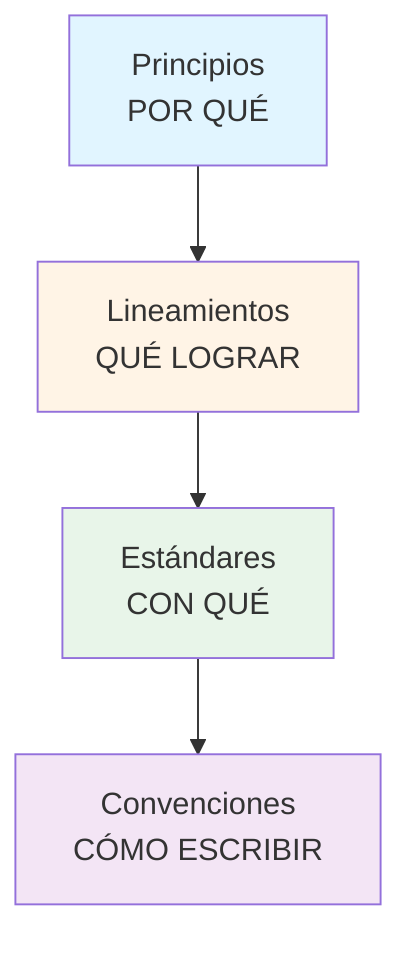
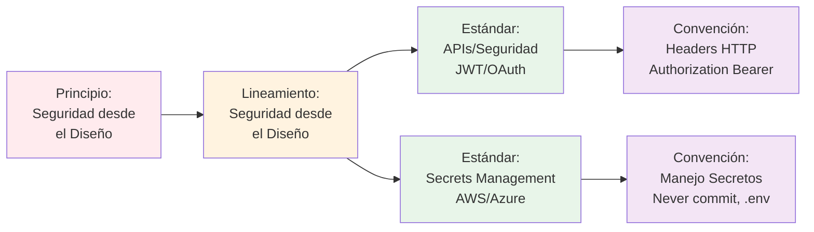
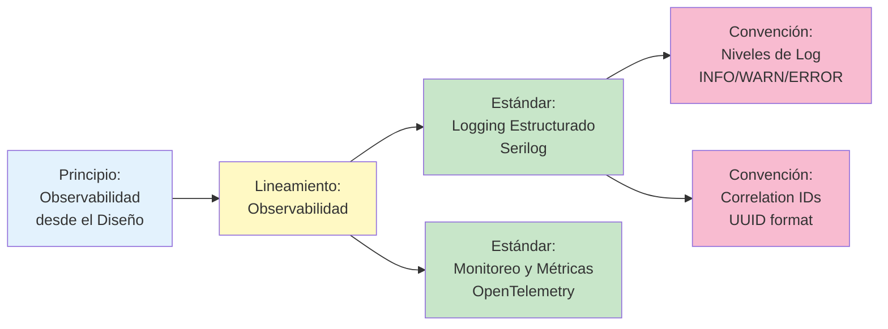
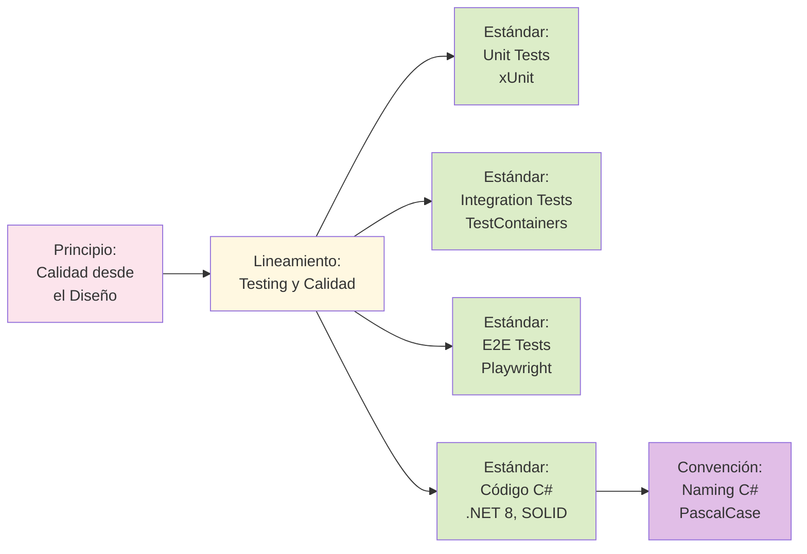
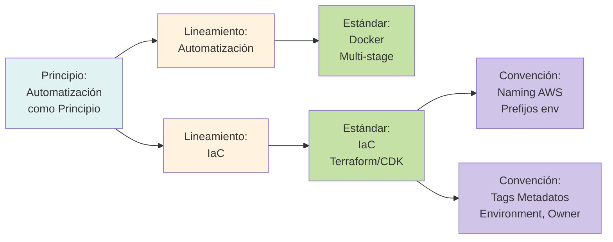
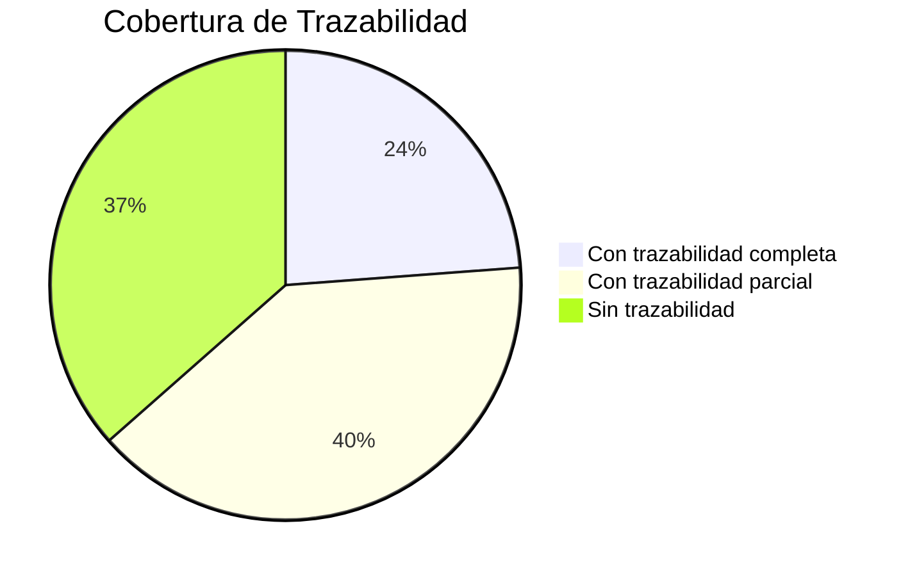

# Matriz de Trazabilidad: Fundamentos Corporativos

**Propósito:** Visualizar la trazabilidad completa desde Principios hasta Convenciones.

---

## 📊 Estructura General



---

## 🔐 Seguridad desde el Diseño

### Trazabilidad Completa



### Referencias

| Nivel           | Documento                 | Ubicación                                                                                                          |
| --------------- | ------------------------- | ------------------------------------------------------------------------------------------------------------------ |
| **Principio**   | Seguridad desde el Diseño | [principios/seguridad/01-seguridad-desde-el-diseno.md](principios/seguridad/01-seguridad-desde-el-diseno.md)       |
| **Lineamiento** | Seguridad desde el Diseño | [lineamientos/seguridad/01-seguridad-desde-el-diseno.md](lineamientos/seguridad/01-seguridad-desde-el-diseno.md)   |
| **Estándar**    | APIs - Seguridad          | [estandares/apis/02-seguridad-apis.md](estandares/apis/02-seguridad-apis.md)                                       |
| **Estándar**    | Secrets Management        | [estandares/infraestructura/03-secrets-management.md](estandares/infraestructura/03-secrets-management.md)         |
| **Estándar**    | APIs REST                 | [estandares/apis/api-rest.md](estandares/apis/api-rest.md) (incluye headers HTTP)                                  |
| **Estándar**    | Secrets Management        | [estandares/seguridad/secrets-management.md](estandares/seguridad/secrets-management.md) (incluye manejo secretos) |

---

## 👁️ Observabilidad desde el Diseño

### Trazabilidad Completa



### Referencias

| Nivel           | Documento                      | Ubicación                                                                                                                    |
| --------------- | ------------------------------ | ---------------------------------------------------------------------------------------------------------------------------- |
| **Principio**   | Observabilidad desde el Diseño | [principios/arquitectura/05-observabilidad-desde-el-diseno.md](principios/arquitectura/05-observabilidad-desde-el-diseno.md) |
| **Lineamiento** | Observabilidad                 | [lineamientos/arquitectura/05-observabilidad.md](lineamientos/arquitectura/05-observabilidad.md)                             |
| **Estándar**    | Logging Estructurado           | [estandares/observabilidad/01-logging.md](estandares/observabilidad/01-logging.md)                                           |
| **Estándar**    | Monitoreo y Métricas           | [estandares/observabilidad/02-monitoreo-metricas.md](estandares/observabilidad/02-monitoreo-metricas.md)                     |
| **Estándar**    | Logging Estructurado           | [estandares/operabilidad/logging.md](estandares/operabilidad/logging.md) (incluye niveles y correlation IDs)                 |

---

## 🧪 Calidad desde el Diseño

### Trazabilidad Completa



### Referencias

| Nivel           | Documento               | Ubicación                                                                                                               |
| --------------- | ----------------------- | ----------------------------------------------------------------------------------------------------------------------- |
| **Principio**   | Calidad desde el Diseño | [principios/operabilidad/03-calidad-desde-el-diseno.md](principios/operabilidad/03-calidad-desde-el-diseno.md)          |
| **Lineamiento** | Testing y Calidad       | [lineamientos/operabilidad/04-testing-y-calidad.md](lineamientos/operabilidad/04-testing-y-calidad.md)                  |
| **Estándar**    | Testing Unitario        | [estandares/testing/01-unit-tests.md](estandares/testing/01-unit-tests.md)                                              |
| **Estándar**    | Testing Integración     | [estandares/testing/02-integration-tests.md](estandares/testing/02-integration-tests.md)                                |
| **Estándar**    | Testing E2E             | [estandares/testing/03-e2e-tests.md](estandares/testing/03-e2e-tests.md)                                                |
| **Estándar**    | C# y .NET               | [estandares/desarrollo/csharp-dotnet.md](estandares/desarrollo/csharp-dotnet.md)                                        |
| **Estándar**    | C# y .NET               | [estandares/desarrollo/csharp-dotnet.md](estandares/desarrollo/csharp-dotnet.md) (incluye convenciones de nomenclatura) |

---

## 🤖 Automatización como Principio

### Trazabilidad Completa



### Referencias

| Nivel           | Documento                     | Ubicación                                                                                                                                |
| --------------- | ----------------------------- | ---------------------------------------------------------------------------------------------------------------------------------------- |
| **Principio**   | Automatización como Principio | [principios/operabilidad/01-automatizacion-como-principio.md](principios/operabilidad/01-automatizacion-como-principio.md)               |
| **Lineamiento** | Automatización                | [lineamientos/operabilidad/01-automatizacion.md](lineamientos/operabilidad/01-automatizacion.md)                                         |
| **Lineamiento** | Infraestructura como Código   | [lineamientos/operabilidad/02-infraestructura-como-codigo.md](lineamientos/operabilidad/02-infraestructura-como-codigo.md)               |
| **Estándar**    | Docker                        | [estandares/infraestructura/01-docker.md](estandares/infraestructura/01-docker.md)                                                       |
| **Estándar**    | IaC                           | [estandares/infraestructura/02-infraestructura-como-codigo.md](estandares/infraestructura/02-infraestructura-como-codigo.md)             |
| **Estándar**    | Infraestructura como Código   | [estandares/infraestructura/infrastructure-as-code.md](estandares/infraestructura/infrastructure-as-code.md) (incluye naming AWS y tags) |

---

## 🌐 Contratos de Integración

### Trazabilidad Completa

```mermaid
graph LR
    P5[Principio:<br/>Contratos de<br/>Comunicación] --> L6[Lineamiento:<br/>Diseño de APIs]
    L6 --> E11[Estándar:<br/>Diseño REST<br/>ASP.NET Core]
    L6 --> E12[Estándar:<br/>Versionado APIs<br/>Semantic Versioning]
    L6 --> E13[Estándar:<br/>OpenAPI/Swagger<br/>Documentación]
    E11 --> C8[Convención:<br/>Naming Endpoints<br/>kebab-case]
    E11 --> C9[Convención:<br/>Formato Respuestas<br/>RFC 7807]

    style P5 fill=#e8eaf6
    style L6 fill:#fffde7
    style E11 fill=#b2dfdb
    style E12 fill=#b2dfdb
    style E13 fill=#b2dfdb
    style C8 fill=#ce93d8
    style C9 fill=#ce93d8
```

### Referencias

| Nivel           | Documento                 | Ubicación                                                                                                          |
| --------------- | ------------------------- | ------------------------------------------------------------------------------------------------------------------ |
| **Principio**   | Contratos de Comunicación | [principios/arquitectura/06-contratos-de-comunicacion.md](principios/arquitectura/06-contratos-de-comunicacion.md) |
| **Lineamiento** | Diseño de APIs            | [lineamientos/arquitectura/06-diseno-de-apis.md](lineamientos/arquitectura/06-diseno-de-apis.md)                   |
| **Estándar**    | Diseño REST               | [estandares/apis/01-diseno-rest.md](estandares/apis/01-diseno-rest.md)                                             |
| **Estándar**    | Versionado APIs           | [estandares/apis/04-versionado.md](estandares/apis/04-versionado.md)                                               |
| **Estándar**    | OpenAPI/Swagger           | [estandares/documentacion/03-openapi-swagger.md](estandares/documentacion/03-openapi-swagger.md)                   |
| **Estándar**    | APIs REST                 | [estandares/apis/api-rest.md](estandares/apis/api-rest.md) (incluye naming endpoints y formato respuestas)         |

---

## 📊 Resumen de Cobertura

### Estadísticas

| Categoría           | Principios | Lineamientos | Estándares | Convenciones |
| ------------------- | ---------- | ------------ | ---------- | ------------ |
| **Seguridad**       | 6          | 4            | 1          | 1            |
| **Arquitectura**    | 8          | 8            | -          | -            |
| **Operabilidad**    | 3          | 4            | -          | -            |
| **Datos**           | 3          | 3            | -          | -            |
| **APIs**            | -          | 1            | 5          | 4            |
| **Código**          | -          | -            | 3          | 4            |
| **Infraestructura** | -          | 1            | 4          | 3            |
| **Testing**         | -          | 1            | 3          | -            |
| **Observabilidad**  | -          | 1            | 2          | 2            |
| **Mensajería**      | -          | 1            | 2          | -            |
| **Documentación**   | -          | 1            | 3          | -            |
| **Git**             | -          | -            | -          | 5            |
| **Base de Datos**   | -          | -            | -          | 2            |
| **TOTAL**           | **19**     | **21**       | **22**     | **21**       |

### Cobertura de Trazabilidad



**Meta:** 100% con trazabilidad completa

---

## 🎯 Validación

### Verificar Trazabilidad

Para cada estándar, verificar:

1. ✅ Tiene referencia a al menos 1 Lineamiento
2. ✅ Tiene referencia a al menos 1 Principio
3. ✅ Tiene referencia bidireccional con Convenciones (si aplica)

### Script de Validación

```bash
# Validar trazabilidad
./scripts/validate-traceability.sh

# Generar diagrama de trazabilidad
./scripts/generate-traceability-diagram.sh
```

---

## 📝 Mantenimiento

**Actualizar cuando:**

- Se crea un nuevo documento
- Se modifica trazabilidad
- Se reorganiza estructura

**Responsable:**

- Equipo de Arquitectura

**Frecuencia:**

- Cada sprint
- Antes de releases mayores

---

_Esta matriz asegura que todos los documentos están correctamente trazados desde principios hasta implementación._
