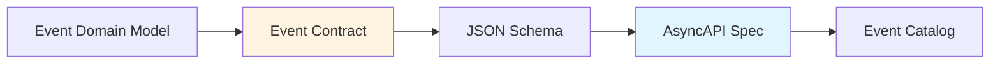

# Contratos de Eventos

## Contexto

Este estándar define cómo documentar y versionar contratos de eventos para comunicación asíncrona mediante mensajería. Complementa el lineamiento [Comunicación Asíncrona y Eventos](../../lineamientos/arquitectura/08-comunicacion-asincrona-y-eventos.md).

**Conceptos incluidos:**

- **Event Contracts** — Definición estructurada de eventos de dominio
- **AsyncAPI Specification** — Documentación de APIs asíncronas



**Cuándo usar:**

- **Event Contracts**: Siempre para comunicación asíncrona
- **AsyncAPI**: Para documentar todos los canales y eventos del sistema

---

## Stack Tecnológico

| Componente        | Tecnología       | Versión | Uso                         |
| ----------------- | ---------------- | ------- | --------------------------- |
| **Mensajería**    | Apache Kafka     | 3.6+    | Event streaming             |
| **Serialización** | System.Text.Json | 8.0+    | JSON serialization          |
| **Esquemas**      | JSON Schema      | 2020-12 | Validación de eventos       |
| **Documentación** | AsyncAPI         | 3.0+    | Especificación de contratos |
| **Validación**    | NJsonSchema      | 11.0+   | Validación runtime          |
| **Observability** | OpenTelemetry    | 1.7+    | Trazas distribuidas         |

---

## Event Contracts

### ¿Qué es un Contrato de Evento?

Especificación formal de la estructura, semántica y versionamiento de un evento de dominio.

**Componentes:**

- **Event Metadata**: ID, tipo, timestamp, correlationId
- **Event Payload**: Datos del evento específico del dominio
- **Event Envelope**: Wrapper estándar con metadata común
- **JSON Schema**: Validación estructural

**Propósito:** Comunicación desacoplada, contrato explícito, evolución controlada.

**Beneficios:**
✅ Contrato explícito
✅ Validación automática
✅ Documentación viva
✅ Evolución sin romper consumidores

### Anatomía de un Evento

```csharp
// Evento base (envelope)
public abstract record DomainEvent
{
    /// <summary>
    /// ID único del evento (UUID v7 para ordenamiento)
    /// </summary>
    public required string EventId { get; init; }

    /// <summary>
    /// Tipo de evento (formato: domain.entity.action.version)
    /// </summary>
    /// <example>customers.customer.created.v1</example>
    public required string EventType { get; init; }

    /// <summary>
    /// Timestamp UTC del evento (ISO 8601)
    /// </summary>
    public required DateTimeOffset Timestamp { get; init; }

    /// <summary>
    /// ID de correlación para trazabilidad
    /// </summary>
    public required string CorrelationId { get; init; }

    /// <summary>
    /// ID de causalidad (eventId del evento que causó este)
    /// </summary>
    public string? CausationId { get; init; }

    /// <summary>
    /// Versión del esquema del evento
    /// </summary>
    public required string SchemaVersion { get; init; }

    /// <summary>
    /// Información del emisor
    /// </summary>
    public required EventSource Source { get; init; }

    /// <summary>
    /// Información del sujeto del evento
    /// </summary>
    public required EventSubject Subject { get; init; }
}

public record EventSource
{
    /// <summary>
    /// Servicio que emitió el evento
    /// </summary>
    /// <example>customer-service</example>
    public required string Service { get; init; }

    /// <summary>
    /// Versión del servicio
    /// </summary>
    /// <example>1.5.2</example>
    public required string Version { get; init; }

    /// <summary>
    /// Instancia del servicio (hostname, pod, etc.)
    /// </summary>
    public string? Instance { get; init; }
}

public record EventSubject
{
    /// <summary>
    /// Tipo de entidad del evento
    /// </summary>
    /// <example>Customer</example>
    public required string Type { get; init; }

    /// <summary>
    /// ID de la entidad
    /// </summary>
    public required string Id { get; init; }

    /// <summary>
    /// Tenant/organización (para multi-tenancy)
    /// </summary>
    public string? TenantId { get; init; }
}
```

### Evento de Dominio Específico

```csharp
/// <summary>
/// Evento emitido cuando un cliente es creado
/// </summary>
public record CustomerCreatedEvent : DomainEvent
{
    /// <summary>
    /// Datos del cliente creado
    /// </summary>
    public required CustomerCreatedData Data { get; init; }
}

public record CustomerCreatedData
{
    /// <summary>
    /// ID del cliente
    /// </summary>
    public required Guid CustomerId { get; init; }

    /// <summary>
    /// Nombre del cliente
    /// </summary>
    public required string Name { get; init; }

    /// <summary>
    /// Email del cliente
    /// </summary>
    public required string Email { get; init; }

    /// <summary>
    /// Teléfono (opcional)
    /// </summary>
    public string? Phone { get; init; }

    /// <summary>
    /// Documento de identidad
    /// </summary>
    public required DocumentData Document { get; init; }

    /// <summary>
    /// Fecha de creación
    /// </summary>
    public required DateTimeOffset CreatedAt { get; init; }
}

public record DocumentData
{
    public required DocumentType Type { get; init; }
    public required string Number { get; init; }
}

public enum DocumentType
{
    DNI,
    RUC,
    CE
}
```

### Publicación de Eventos

```csharp
public interface IEventPublisher
{
    Task PublishAsync<T>(T @event, CancellationToken cancellationToken = default)
        where T : DomainEvent;
}

public class KafkaEventPublisher : IEventPublisher
{
    private readonly IProducer<string, string> _producer;
    private readonly ILogger<KafkaEventPublisher> _logger;
    private readonly JsonSerializerOptions _jsonOptions;

    public KafkaEventPublisher(
        IProducer<string, string> producer,
        ILogger<KafkaEventPublisher> logger)
    {
        _producer = producer;
        _logger = logger;

        _jsonOptions = new JsonSerializerOptions
        {
            PropertyNamingPolicy = JsonNamingPolicy.CamelCase,
            DefaultIgnoreCondition = JsonIgnoreCondition.WhenWritingNull,
            Converters = { new JsonStringEnumConverter() }
        };
    }

    public async Task PublishAsync<T>(T @event, CancellationToken cancellationToken = default)
        where T : DomainEvent
    {
        try
        {
            // Enriquecer metadata
            var enrichedEvent = EnrichEvent(@event);

            // Serializar
            var json = JsonSerializer.Serialize(enrichedEvent, _jsonOptions);

            // Topic basado en tipo de evento: customers.customer.created.v1
            var topic = GetTopicName(@event.EventType);

            // Key es el subject.id para particionamiento
            var message = new Message<string, string>
            {
                Key = @event.Subject.Id,
                Value = json,
                Headers = new Headers
                {
                    { "event-type", Encoding.UTF8.GetBytes(@event.EventType) },
                    { "schema-version", Encoding.UTF8.GetBytes(@event.SchemaVersion) },
                    { "correlation-id", Encoding.UTF8.GetBytes(@event.CorrelationId) },
                    { "content-type", Encoding.UTF8.GetBytes("application/json") }
                }
            };

            var result = await _producer.ProduceAsync(topic, message, cancellationToken);

            _logger.LogInformation(
                "Evento publicado: {EventType} - Partition: {Partition}, Offset: {Offset}",
                @event.EventType, result.Partition.Value, result.Offset.Value);

            // Métrica
            _eventMetrics.RecordEventPublished(@event.EventType, topic);
        }
        catch (ProduceException<string, string> ex)
        {
            _logger.LogError(ex,
                "Error al publicar evento {EventType}: {Error}",
                @event.EventType, ex.Error.Reason);

            _eventMetrics.RecordEventPublishError(@event.EventType);
            throw;
        }
    }

    private T EnrichEvent<T>(T @event) where T : DomainEvent
    {
        // Asegurar valores por defecto
        return @event with
        {
            EventId = string.IsNullOrEmpty(@event.EventId)
                ? Ulid.NewUlid().ToString()
                : @event.EventId,
            Timestamp = @event.Timestamp == default
                ? DateTimeOffset.UtcNow
                : @event.Timestamp
        };
    }

    private string GetTopicName(string eventType)
    {
        // Formato: domain.entity.action.version → topic
        // customers.customer.created.v1 → customers-events
        var parts = eventType.Split('.');
        return $"{parts[0]}-events";
    }
}
```

### Consumo de Eventos

```csharp
public interface IEventConsumer
{
    Task StartAsync(CancellationToken cancellationToken = default);
    Task StopAsync(CancellationToken cancellationToken = default);
}

public class CustomerEventConsumer : IEventConsumer
{
    private readonly IConsumer<string, string> _consumer;
    private readonly IServiceProvider _serviceProvider;
    private readonly ILogger<CustomerEventConsumer> _logger;
    private CancellationTokenSource? _cts;

    public CustomerEventConsumer(
        IConsumer<string, string> consumer,
        IServiceProvider serviceProvider,
        ILogger<CustomerEventConsumer> logger)
    {
        _consumer = consumer;
        _serviceProvider = serviceProvider;
        _logger = logger;
    }

    public Task StartAsync(CancellationToken cancellationToken = default)
    {
        _cts = CancellationTokenSource.CreateLinkedTokenSource(cancellationToken);

        // Suscribirse a topics
        _consumer.Subscribe(new[] { "customers-events" });

        // Procesar mensajes en background
        _ = Task.Run(() => ProcessMessages(_cts.Token), _cts.Token);

        _logger.LogInformation("Consumer iniciado");
        return Task.CompletedTask;
    }

    public Task StopAsync(CancellationToken cancellationToken = default)
    {
        _cts?.Cancel();
        _consumer.Close();
        _logger.LogInformation("Consumer detenido");
        return Task.CompletedTask;
    }

    private async Task ProcessMessages(CancellationToken cancellationToken)
    {
        while (!cancellationToken.IsCancellationRequested)
        {
            try
            {
                var consumeResult = _consumer.Consume(cancellationToken);

                if (consumeResult?.Message == null)
                    continue;

                await ProcessMessage(consumeResult, cancellationToken);

                // Commit después de procesamiento exitoso
                _consumer.Commit(consumeResult);
            }
            catch (ConsumeException ex)
            {
                _logger.LogError(ex, "Error al consumir mensaje: {Error}", ex.Error.Reason);
            }
            catch (OperationCanceledException)
            {
                break;
            }
        }
    }

    private async Task ProcessMessage(
        ConsumeResult<string, string> consumeResult,
        CancellationToken cancellationToken)
    {
        var message = consumeResult.Message;
        var eventTypeHeader = message.Headers
            .FirstOrDefault(h => h.Key == "event-type");

        if (eventTypeHeader == null)
        {
            _logger.LogWarning("Mensaje sin header event-type");
            return;
        }

        var eventType = Encoding.UTF8.GetString(eventTypeHeader.GetValueBytes());

        _logger.LogInformation(
            "Procesando evento: {EventType} - Partition: {Partition}, Offset: {Offset}",
            eventType, consumeResult.Partition.Value, consumeResult.Offset.Value);

        try
        {
            // Deserializar basado en event-type
            var @event = DeserializeEvent(eventType, message.Value);

            if (@event == null)
            {
                _logger.LogWarning("No se pudo deserializar evento: {EventType}", eventType);
                return;
            }

            // Validar esquema
            await ValidateEventSchema(@event, cancellationToken);

            // Despachar a handler
            await DispatchEvent(@event, cancellationToken);

            _eventMetrics.RecordEventProcessed(eventType);
        }
        catch (Exception ex)
        {
            _logger.LogError(ex,
                "Error al procesar evento {EventType}: {Error}",
                eventType, ex.Message);

            _eventMetrics.RecordEventProcessingError(eventType);

            // Estrategia de retry o dead letter queue
            await HandleProcessingError(consumeResult, ex, cancellationToken);
        }
    }

    private DomainEvent? DeserializeEvent(string eventType, string json)
    {
        // Mapeo de event-type a tipo .NET
        return eventType switch
        {
            "customers.customer.created.v1" =>
                JsonSerializer.Deserialize<CustomerCreatedEvent>(json),
            "customers.customer.updated.v1" =>
                JsonSerializer.Deserialize<CustomerUpdatedEvent>(json),
            "customers.customer.deleted.v1" =>
                JsonSerializer.Deserialize<CustomerDeletedEvent>(json),
            _ => null
        };
    }

    private async Task DispatchEvent(DomainEvent @event, CancellationToken cancellationToken)
    {
        using var scope = _serviceProvider.CreateScope();

        // Usar MediatR o handler manual
        var handlerType = typeof(IEventHandler<>).MakeGenericType(@event.GetType());
        var handler = scope.ServiceProvider.GetService(handlerType);

        if (handler == null)
        {
            _logger.LogWarning("No handler encontrado para evento: {EventType}", @event.EventType);
            return;
        }

        var handleMethod = handlerType.GetMethod("HandleAsync");
        await (Task)handleMethod!.Invoke(handler, new object[] { @event, cancellationToken })!;
    }
}

// Handler para evento específico
public interface IEventHandler<in T> where T : DomainEvent
{
    Task HandleAsync(T @event, CancellationToken cancellationToken = default);
}

public class CustomerCreatedEventHandler : IEventHandler<CustomerCreatedEvent>
{
    private readonly ILogger<CustomerCreatedEventHandler> _logger;
    private readonly ICustomerSyncService _syncService;

    public CustomerCreatedEventHandler(
        ILogger<CustomerCreatedEventHandler> logger,
        ICustomerSyncService syncService)
    {
        _logger = logger;
        _syncService = syncService;
    }

    public async Task HandleAsync(CustomerCreatedEvent @event, CancellationToken cancellationToken = default)
    {
        _logger.LogInformation(
            "Manejando CustomerCreated: {CustomerId} - {Name}",
            @event.Data.CustomerId, @event.Data.Name);

        // Lógica de negocio
        await _syncService.SyncCustomerAsync(@event.Data, cancellationToken);
    }
}
```

### Versionamiento de Eventos

```csharp
// v1: Evento original
public record CustomerCreatedEventV1 : DomainEvent
{
    public required CustomerCreatedDataV1 Data { get; init; }
}

public record CustomerCreatedDataV1
{
    public required Guid CustomerId { get; init; }
    public required string Name { get; init; }
    public required string Email { get; init; }
}

// v2: Agregado campo Phone (compatible)
public record CustomerCreatedEventV2 : DomainEvent
{
    public required CustomerCreatedDataV2 Data { get; init; }
}

public record CustomerCreatedDataV2
{
    public required Guid CustomerId { get; init; }
    public required string Name { get; init; }
    public required string Email { get; init; }

    // ✅ Campo opcional agregado (compatible)
    public string? Phone { get; init; }
}

// Upcasting: convertir v1 → v2
public class EventUpcaster
{
    public DomainEvent Upcast(DomainEvent @event)
    {
        return @event switch
        {
            CustomerCreatedEventV1 v1 => UpcastToV2(v1),
            _ => @event
        };
    }

    private CustomerCreatedEventV2 UpcastToV2(CustomerCreatedEventV1 v1)
    {
        return new CustomerCreatedEventV2
        {
            EventId = v1.EventId,
            EventType = "customers.customer.created.v2",
            Timestamp = v1.Timestamp,
            CorrelationId = v1.CorrelationId,
            CausationId = v1.CausationId,
            SchemaVersion = "2.0",
            Source = v1.Source,
            Subject = v1.Subject,
            Data = new CustomerCreatedDataV2
            {
                CustomerId = v1.Data.CustomerId,
                Name = v1.Data.Name,
                Email = v1.Data.Email,
                Phone = null // Campo nuevo, valor por defecto
            }
        };
    }
}
```

---

## AsyncAPI Specification

### ¿Qué es AsyncAPI?

Especificación para documentar APIs asíncronas, similar a OpenAPI pero para mensajería/eventos.

**Componentes:**

- **Info**: Metadata de la API
- **Servers**: Brokers/servidores de mensajería
- **Channels**: Topics/colas
- **Operations**: Publicación/suscripción
- **Messages**: Estructura de mensajes
- **Schemas**: Esquemas JSON Schema

**Propósito:** Documentar arquitectura event-driven, generar código, validar contratos.

**Beneficios:**
✅ Documentación estándar
✅ Generación de código
✅ Validación de contratos
✅ Catálogo de eventos centralizado

### Especificación AsyncAPI 3.0

```yaml
asyncapi: 3.0.0

info:
  title: Customer Service API
  version: 1.0.0
  description: |
    APIs asíncronas del servicio de clientes.
    Publica eventos de creación, actualización y eliminación de clientes.
  contact:
    name: Equipo de Clientes
    email: team-customers@talma.com
  license:
    name: Proprietary

servers:
  production:
    host: kafka-prod.talma.com:9092
    protocol: kafka
    description: Cluster de Kafka en producción
    tags:
      - name: env:production
  staging:
    host: kafka-staging.talma.com:9092
    protocol: kafka
    description: Cluster de Kafka en staging
    tags:
      - name: env:staging

defaultContentType: application/json

channels:
  customersEvents:
    address: customers-events
    description: Canal de eventos de clientes
    messages:
      customerCreated:
        $ref: "#/components/messages/CustomerCreated"
      customerUpdated:
        $ref: "#/components/messages/CustomerUpdated"
      customerDeleted:
        $ref: "#/components/messages/CustomerDeleted"

operations:
  publishCustomerCreated:
    action: send
    channel:
      $ref: "#/channels/customersEvents"
    messages:
      - $ref: "#/channels/customersEvents/messages/customerCreated"
    summary: Publica evento cuando cliente es creado
    description: Este evento es emitido inmediatamente después de que un nuevo cliente es creado en el sistema

  subscribeCustomerCreated:
    action: receive
    channel:
      $ref: "#/channels/customersEvents"
    messages:
      - $ref: "#/channels/customersEvents/messages/customerCreated"
    summary: Suscribirse a eventos de clientes creados

components:
  messages:
    CustomerCreated:
      name: CustomerCreated
      title: Cliente Creado
      summary: Evento emitido cuando un cliente es creado
      contentType: application/json
      headers:
        $ref: "#/components/schemas/EventHeaders"
      payload:
        $ref: "#/components/schemas/CustomerCreatedEvent"
      examples:
        - name: customerCreatedExample
          summary: Ejemplo de cliente creado
          payload:
            eventId: "01HN1JQFQ3K7QK"
            eventType: "customers.customer.created.v1"
            timestamp: "2026-02-18T10:30:00Z"
            correlationId: "01HN1JQFQ3K7QK"
            schemaVersion: "1.0"
            source:
              service: "customer-service"
              version: "1.5.2"
              instance: "customer-service-pod-abc123"
            subject:
              type: "Customer"
              id: "f7c8e3a1-2b4d-4e6f-9a8b-1c2d3e4f5a6b"
              tenantId: "tenant-001"
            data:
              customerId: "f7c8e3a1-2b4d-4e6f-9a8b-1c2d3e4f5a6b"
              name: "Acme Corporation"
              email: "contact@acme.com"
              phone: "+51987654321"
              document:
                type: "RUC"
                number: "20123456789"
              createdAt: "2026-02-18T10:30:00Z"

    CustomerUpdated:
      name: CustomerUpdated
      title: Cliente Actualizado
      summary: Evento emitido cuando un cliente es actualizado
      contentType: application/json
      payload:
        $ref: "#/components/schemas/CustomerUpdatedEvent"

    CustomerDeleted:
      name: CustomerDeleted
      title: Cliente Eliminado
      summary: Evento emitido cuando un cliente es eliminado (soft delete)
      contentType: application/json
      payload:
        $ref: "#/components/schemas/CustomerDeletedEvent"

  schemas:
    EventHeaders:
      type: object
      properties:
        event-type:
          type: string
          description: Tipo de evento
          example: customers.customer.created.v1
        schema-version:
          type: string
          description: Versión del esquema
          example: "1.0"
        correlation-id:
          type: string
          description: ID de correlación
        content-type:
          type: string
          description: Tipo de contenido
          example: application/json

    CustomerCreatedEvent:
      type: object
      required:
        - eventId
        - eventType
        - timestamp
        - correlationId
        - schemaVersion
        - source
        - subject
        - data
      properties:
        eventId:
          type: string
          description: ID único del evento (ULID)
          example: "01HN1JQFQ3K7QK"
        eventType:
          type: string
          const: customers.customer.created.v1
          description: Tipo de evento
        timestamp:
          type: string
          format: date-time
          description: Timestamp UTC del evento
        correlationId:
          type: string
          description: ID de correlación para trazabilidad
        causationId:
          type: string
          description: ID del evento que causó este evento
        schemaVersion:
          type: string
          description: Versión del esquema
          example: "1.0"
        source:
          $ref: "#/components/schemas/EventSource"
        subject:
          $ref: "#/components/schemas/EventSubject"
        data:
          $ref: "#/components/schemas/CustomerCreatedData"

    EventSource:
      type: object
      required:
        - service
        - version
      properties:
        service:
          type: string
          description: Servicio que emitió el evento
          example: customer-service
        version:
          type: string
          description: Versión del servicio
          example: "1.5.2"
        instance:
          type: string
          description: Instancia del servicio
          example: customer-service-pod-abc123

    EventSubject:
      type: object
      required:
        - type
        - id
      properties:
        type:
          type: string
          description: Tipo de entidad
          example: Customer
        id:
          type: string
          format: uuid
          description: ID de la entidad
        tenantId:
          type: string
          description: ID del tenant (multi-tenancy)

    CustomerCreatedData:
      type: object
      required:
        - customerId
        - name
        - email
        - document
        - createdAt
      properties:
        customerId:
          type: string
          format: uuid
          description: ID del cliente
        name:
          type: string
          minLength: 2
          maxLength: 100
          description: Nombre del cliente
        email:
          type: string
          format: email
          description: Email del cliente
        phone:
          type: string
          pattern: '^\+\d{10,15}$'
          description: Teléfono en formato E.164
        document:
          $ref: "#/components/schemas/DocumentData"
        createdAt:
          type: string
          format: date-time
          description: Fecha de creación

    DocumentData:
      type: object
      required:
        - type
        - number
      properties:
        type:
          type: string
          enum: [DNI, RUC, CE]
          description: Tipo de documento
        number:
          type: string
          description: Número de documento

    CustomerUpdatedEvent:
      type: object
      required:
        - eventId
        - eventType
        - timestamp
        - correlationId
        - schemaVersion
        - source
        - subject
        - data
      properties:
        eventId:
          type: string
        eventType:
          type: string
          const: customers.customer.updated.v1
        timestamp:
          type: string
          format: date-time
        correlationId:
          type: string
        schemaVersion:
          type: string
        source:
          $ref: "#/components/schemas/EventSource"
        subject:
          $ref: "#/components/schemas/EventSubject"
        data:
          $ref: "#/components/schemas/CustomerUpdatedData"

    CustomerUpdatedData:
      type: object
      required:
        - customerId
        - updatedAt
      properties:
        customerId:
          type: string
          format: uuid
        name:
          type: string
        email:
          type: string
          format: email
        phone:
          type: string
        updatedAt:
          type: string
          format: date-time

    CustomerDeletedEvent:
      type: object
      required:
        - eventId
        - eventType
        - timestamp
        - correlationId
        - schemaVersion
        - source
        - subject
        - data
      properties:
        eventId:
          type: string
        eventType:
          type: string
          const: customers.customer.deleted.v1
        timestamp:
          type: string
          format: date-time
        correlationId:
          type: string
        schemaVersion:
          type: string
        source:
          $ref: "#/components/schemas/EventSource"
        subject:
          $ref: "#/components/schemas/EventSubject"
        data:
          $ref: "#/components/schemas/CustomerDeletedData"

    CustomerDeletedData:
      type: object
      required:
        - customerId
        - deletedAt
      properties:
        customerId:
          type: string
          format: uuid
        reason:
          type: string
          description: Motivo de eliminación
        deletedAt:
          type: string
          format: date-time
```

### Validación de Esquemas en Runtime

```csharp
public class EventSchemaValidator
{
    private readonly Dictionary<string, JsonSchema> _schemas = new();
    private readonly ILogger<EventSchemaValidator> _logger;

    public EventSchemaValidator(ILogger<EventSchemaValidator> logger)
    {
        _logger = logger;
        LoadSchemas();
    }

    private void LoadSchemas()
    {
        // Cargar esquemas desde AsyncAPI spec o archivos JSON Schema
        var customerCreatedSchema = JsonSchema.FromJsonAsync("""
        {
          "$schema": "https://json-schema.org/draft/2020-12/schema",
          "type": "object",
          "required": ["eventId", "eventType", "timestamp", "data"],
          "properties": {
            "eventId": { "type": "string" },
            "eventType": { "type": "string", "const": "customers.customer.created.v1" },
            "timestamp": { "type": "string", "format": "date-time" },
            "data": {
              "type": "object",
              "required": ["customerId", "name", "email"],
              "properties": {
                "customerId": { "type": "string", "format": "uuid" },
                "name": { "type": "string", "minLength": 2, "maxLength": 100 },
                "email": { "type": "string", "format": "email" }
              }
            }
          }
        }
        """).Result;

        _schemas["customers.customer.created.v1"] = customerCreatedSchema;
    }

    public async Task<ValidationResult> ValidateAsync(DomainEvent @event)
    {
        if (!_schemas.TryGetValue(@event.EventType, out var schema))
        {
            _logger.LogWarning("No hay esquema definido para evento: {EventType}", @event.EventType);
            return ValidationResult.Success();
        }

        var json = JsonSerializer.Serialize(@event);
        var errors = schema.Validate(json);

        if (errors.Count > 0)
        {
            _logger.LogError(
                "Evento {EventType} falló validación: {Errors}",
                @event.EventType,
                string.Join(", ", errors.Select(e => e.ToString())));

            return ValidationResult.Failure(errors.Select(e => e.ToString()).ToArray());
        }

        return ValidationResult.Success();
    }
}

public record ValidationResult
{
    public bool IsValid { get; init; }
    public string[] Errors { get; init; } = Array.Empty<string>();

    public static ValidationResult Success() => new() { IsValid = true };
    public static ValidationResult Failure(string[] errors) => new() { IsValid = false, Errors = errors };
}
```

---

## Catálogo de Eventos

Cada evento publicado debe registrarse en el catálogo del dominio con la siguiente plantilla:

```markdown
### {domain}.{entity}.{action}.{version}

**Descripción**: Evento emitido cuando ...

**Topic**: {domain}-events

**Schema**: [schema-v1.json](schemas/schema-v1.json)

**Publicadores**:

- {service-name}

**Consumidores**:

- {consumer-service} ({propósito})

**Versionamiento**:

- v1.0: Versión inicial (YYYY-MM-DD)

**Breaking Changes**: Ninguno
```

:::tip Catálogo centralizado
El catálogo de eventos de cada dominio vive en la documentación del servicio propietario, no en este estándar. Usar una herramienta como [AsyncAPI Studio](https://studio.asyncapi.com/) o Backstage para mantener el catálogo actualizado.
:::

---

## Beneficios en Práctica

| Sin contratos de eventos                               | Con contratos AsyncAPI + JSON Schema                           |
| ------------------------------------------------------ | -------------------------------------------------------------- |
| Consumidores acoplan a implementación interna          | Contrato explícito e independiente del código                  |
| Cambios rompen consumidores sin aviso                  | Versionamiento semántico y upcasting controlado                |
| Depuración difícil en producción                       | `correlationId` + `causationId` permiten trazabilidad completa |
| Sin validación: eventos malógrados llegan a producción | JSON Schema valida en publicación y consumo                    |

---

## Requisitos Técnicos

### MUST (Obligatorio)

**Event Contracts:**

- **MUST** usar envelope estándar con metadata (eventId, eventType, timestamp, correlationId)
- **MUST** incluir schemaVersion en todos los eventos
- **MUST** usar ULID o UUID v7 para eventId (ordenamiento temporal)
- **MUST** usar formato ISO 8601 para timestamps
- **MUST** incluir source (servicio emisor) y subject (entidad)
- **MUST** versionar eventos al hacer cambios (customers.customer.created.v1)

**AsyncAPI:**

- **MUST** documentar todas las APIs asíncronas con AsyncAPI 3.0
- **MUST** usar JSON Schema para validación de payloads
- **MUST** definir ejemplos para cada tipo de evento
- **MUST** mantener AsyncAPI spec en sync con código

**Versionamiento:**

- **MUST** mantener compatibilidad hacia atrás en versiones MINOR
- **MUST** soportar al menos 2 versiones mayores simultáneamente
- **MUST** comunicar breaking changes con 6 meses de anticipación

### SHOULD (Fuertemente recomendado)

- **SHOULD** validar eventos contra JSON Schema antes de publicar
- **SHOULD** usar CloudEvents 1.0 como base para envelope
- **SHOULD** implementar dead letter queue para eventos fallidos
- **SHOULD** incluir causationId para rastreo de causalidad
- **SHOULD** particionar topics por subject.id para ordenamiento
- **SHOULD** implementar idempotencia en consumidores
- **SHOULD** mantener catálogo de eventos centralizado
- **SHOULD** generar código de clientes desde AsyncAPI

### MAY (Opcional)

- **MAY** usar Schema Registry (Confluent Schema Registry) para versionamiento
- **MAY** implementar event sourcing para entidades críticas
- **MAY** usar diferentes retention policies por tipo de evento
- **MAY** implementar event replay para recover

### MUST NOT (Prohibido)

- **MUST NOT** incluir información sensible sin encriptar en eventos
- **MUST NOT** hacer cambios incompatibles sin versionar (breaking changes en MINOR)
- **MUST NOT** usar eventos para comunicación síncrona (usar APIs REST)
- **MUST NOT** depender de orden de llegada entre particiones
- **MUST NOT** publicar eventos con payload > 1MB (usar claim check pattern)

---

## Referencias

- [AsyncAPI 3.0 Specification](https://www.asyncapi.com/docs/reference/specification/v3.0.0) — Especificación AsyncAPI
- [JSON Schema 2020-12](https://json-schema.org/draft/2020-12/json-schema-core.html) — Esquemas JSON
- [CloudEvents 1.0](https://cloudevents.io/) — Envelope estándar de eventos
- [Apache Kafka](https://kafka.apache.org/documentation/) — Event streaming
- [NJsonSchema](https://github.com/RicoSuter/NJsonSchema) — Validación runtime de JSON Schema
- [AsyncAPI Code Generation](https://www.asyncapi.com/tools/generator) — Generación de código desde AsyncAPI
- [Comunicación Asíncrona y Eventos](../../lineamientos/arquitectura/08-comunicacion-asincrona-y-eventos.md) — Lineamiento relacionado
- [Estándares REST](./rest-standards.md) — Estándar relacionado
