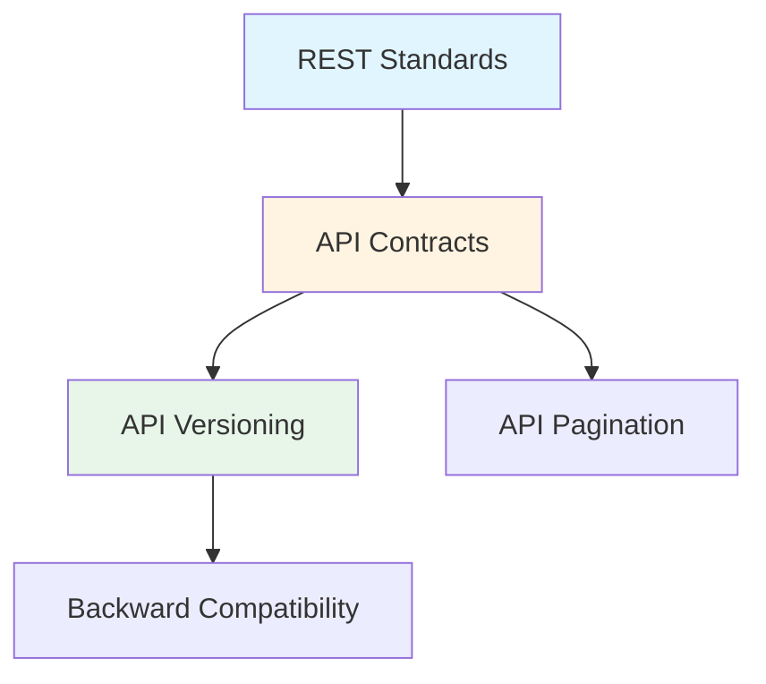

# Diseño de APIs REST

## Contexto

Este estándar consolida las prácticas fundamentales para diseñar APIs REST consistentes, mantenibles y escalables. Complementa el lineamiento [APIs y Contratos](../../lineamientos/arquitectura/07-apis-y-contratos.md) asegurando uniformidad en toda la organización.

**Conceptos incluidos:**

- **REST Standards** → Principios REST y convenciones HTTP
- **API Contracts** → Definición y documentación de contratos
- **API Versioning** → Estrategias de versionamiento
- **API Pagination** → Paginación eficiente de colecciones
- **Backward Compatibility** → Evolución sin romper clientes

---

## Stack Tecnológico

| Componente          | Tecnología             | Versión | Uso                      |
| ------------------- | ---------------------- | ------- | ------------------------ |
| **Framework**       | ASP.NET Core           | 8.0+    | Construcción de APIs     |
| **Documentación**   | Swashbuckle.AspNetCore | 6.5+    | OpenAPI/Swagger          |
| **Validación**      | FluentValidation       | 11.0+   | Validación de contratos  |
| **Versionamiento**  | Asp.Versioning.Mvc     | 8.0+    | Versionamiento de APIs   |
| **Serialización**   | System.Text.Json       | 8.0+    | JSON serialization       |
| **Problem Details** | Hellang.Middleware     | 6.5+    | RFC 7807 Problem Details |

---

## Conceptos Fundamentales

Este estándar cubre 5 aspectos críticos del diseño de APIs REST:

### Índice de Conceptos

1. **REST Standards**: Principios REST, verbos HTTP, códigos de estado
2. **API Contracts**: Definición estructurada con OpenAPI
3. **API Versioning**: Estrategias para evolucionar APIs
4. **API Pagination**: Manejo eficiente de colecciones grandes
5. **Backward Compatibility**: Cambios seguros sin romper clientes

### Relación entre Conceptos



**Cuándo usar cada uno:**

- **REST Standards**: Siempre, base de toda API
- **API Contracts**: Obligatorio para toda API pública/externa
- **API Versioning**: Cuando API ya está en producción
- **API Pagination**: Cualquier endpoint que retorne colecciones
- **Backward Compatibility**: Al evolucionar APIs existentes

---

## 1. REST Standards

### ¿Qué son los Estándares REST?

Conjunto de convenciones basadas en HTTP para diseñar APIs predecibles y consistentes.

**Principios REST:**

- **Recursos**: Sustantivos (no verbos) en URIs
- **Stateless**: Sin estado de sesión en servidor
- **Cacheable**: Uso de headers HTTP de caché
- **Uniform Interface**: Consistencia en operaciones

**Verbos HTTP:**

| Verbo  | Uso                   | Idempotente | Safe |
| ------ | --------------------- | ----------- | ---- |
| GET    | Leer recursos         | ✅          | ✅   |
| POST   | Crear recursos        | ❌          | ❌   |
| PUT    | Reemplazar recurso    | ✅          | ❌   |
| PATCH  | Actualización parcial | ❌          | ❌   |
| DELETE | Eliminar recurso      | ✅          | ❌   |

**Códigos de Estado:**

| Código | Significado           | Uso                                   |
| ------ | --------------------- | ------------------------------------- |
| 200    | OK                    | GET/PUT exitoso                       |
| 201    | Created               | POST exitoso, recurso creado          |
| 204    | No Content            | DELETE exitoso, no hay body           |
| 400    | Bad Request           | Datos inválidos                       |
| 401    | Unauthorized          | Falta autenticación                   |
| 403    | Forbidden             | Sin permisos                          |
| 404    | Not Found             | Recurso no existe                     |
| 409    | Conflict              | Conflicto de estado (duplicado, etc.) |
| 422    | Unprocessable Entity  | Validación de negocio falló           |
| 429    | Too Many Requests     | Rate limit excedido                   |
| 500    | Internal Server Error | Error no controlado                   |
| 503    | Service Unavailable   | Servicio no disponible temporalmente  |

**Beneficios:**
✅ APIs predecibles
✅ Cacheable por defecto
✅ Uso eficiente de infraestructura HTTP

### Estructura de URIs

```csharp
// ✅ BUENO: Sustantivos en plural, jerarquía clara
GET    /api/v1/customers
GET    /api/v1/customers/{id}
POST   /api/v1/customers
PUT    /api/v1/customers/{id}
DELETE /api/v1/customers/{id}
PATCH  /api/v1/customers/{id}

// Recursos anidados (máximo 2 niveles)
GET    /api/v1/customers/{customerId}/orders
GET    /api/v1/customers/{customerId}/orders/{orderId}

// Acciones no-CRUD (verbos cuando sea inevitable)
POST   /api/v1/orders/{id}/cancel
POST   /api/v1/orders/{id}/ship
POST   /api/v1/invoices/{id}/send

// ❌ MALO: Verbos en URI
POST   /api/v1/createCustomer
GET    /api/v1/getCustomers
DELETE /api/v1/deleteCustomer/{id}

// ❌ MALO: Singular inconsistente
GET    /api/v1/customer
GET    /api/v1/customers

// ❌ MALO: Anidamiento excesivo
GET    /api/v1/customers/{id}/orders/{orderId}/items/{itemId}/details
```

### Implementación

```csharp
// Controllers con RESTful routing
[ApiController]
[Route("api/v{version:apiVersion}/[controller]")]
[Produces("application/json")]
public class CustomersController : ControllerBase
{
    private readonly ICustomerService _customerService;
    private readonly ILogger<CustomersController> _logger;

    public CustomersController(
        ICustomerService customerService,
        ILogger<CustomersController> logger)
    {
        _customerService = customerService;
        _logger = logger;
    }

    /// <summary>
    /// Obtiene todos los clientes (paginado)
    /// </summary>
    [HttpGet]
    [ProducesResponseType(typeof(PagedResult<CustomerDto>), StatusCodes.Status200OK)]
    public async Task<ActionResult<PagedResult<CustomerDto>>> GetAll(
        [FromQuery] int page = 1,
        [FromQuery] int pageSize = 20)
    {
        var result = await _customerService.GetPagedAsync(page, pageSize);
        return Ok(result);
    }

    /// <summary>
    /// Obtiene un cliente por ID
    /// </summary>
    [HttpGet("{id}")]
    [ProducesResponseType(typeof(CustomerDto), StatusCodes.Status200OK)]
    [ProducesResponseType(StatusCodes.Status404NotFound)]
    public async Task<ActionResult<CustomerDto>> GetById(Guid id)
    {
        var customer = await _customerService.GetByIdAsync(id);

        if (customer == null)
            return NotFound();

        return Ok(customer);
    }

    /// <summary>
    /// Crea un nuevo cliente
    /// </summary>
    [HttpPost]
    [ProducesResponseType(typeof(CustomerDto), StatusCodes.Status201Created)]
    [ProducesResponseType(typeof(ValidationProblemDetails), StatusCodes.Status400BadRequest)]
    public async Task<ActionResult<CustomerDto>> Create(
        [FromBody] CreateCustomerRequest request)
    {
        var customer = await _customerService.CreateAsync(request);

        return CreatedAtAction(
            nameof(GetById),
            new { id = customer.Id },
            customer);
    }

    /// <summary>
    /// Actualiza completamente un cliente
    /// </summary>
    [HttpPut("{id}")]
    [ProducesResponseType(typeof(CustomerDto), StatusCodes.Status200OK)]
    [ProducesResponseType(StatusCodes.Status404NotFound)]
    public async Task<ActionResult<CustomerDto>> Update(
        Guid id,
        [FromBody] UpdateCustomerRequest request)
    {
        var customer = await _customerService.UpdateAsync(id, request);

        if (customer == null)
            return NotFound();

        return Ok(customer);
    }

    /// <summary>
    /// Actualiza parcialmente un cliente
    /// </summary>
    [HttpPatch("{id}")]
    [ProducesResponseType(typeof(CustomerDto), StatusCodes.Status200OK)]
    [ProducesResponseType(StatusCodes.Status404NotFound)]
    public async Task<ActionResult<CustomerDto>> Patch(
        Guid id,
        [FromBody] JsonPatchDocument<UpdateCustomerRequest> patchDoc)
    {
        var customer = await _customerService.GetByIdAsync(id);

        if (customer == null)
            return NotFound();

        var updateRequest = _mapper.Map<UpdateCustomerRequest>(customer);
        patchDoc.ApplyTo(updateRequest, ModelState);

        if (!ModelState.IsValid)
            return BadRequest(ModelState);

        var updated = await _customerService.UpdateAsync(id, updateRequest);
        return Ok(updated);
    }

    /// <summary>
    /// Elimina un cliente
    /// </summary>
    [HttpDelete("{id}")]
    [ProducesResponseType(StatusCodes.Status204NoContent)]
    [ProducesResponseType(StatusCodes.Status404NotFound)]
    public async Task<IActionResult> Delete(Guid id)
    {
        var deleted = await _customerService.DeleteAsync(id);

        if (!deleted)
            return NotFound();

        return NoContent();
    }
}
```

### Configuración Global

```csharp
// Program.cs - Configuración de API behavior
var builder = WebApplication.CreateBuilder(args);

builder.Services.AddControllers(options =>
{
    // Retornar 406 si Accept header no es soportado
    options.ReturnHttpNotAcceptable = true;

    // Usar PascalCase para JSON (estándar .NET)
    options.OutputFormatters.RemoveType<StringOutputFormatter>();
})
.AddJsonOptions(options =>
{
    // Configuración JSON estándar
    options.JsonSerializerOptions.PropertyNamingPolicy = JsonNamingPolicy.CamelCase;
    options.JsonSerializerOptions.DefaultIgnoreCondition = JsonIgnoreCondition.WhenWritingNull;
    options.JsonSerializerOptions.Converters.Add(new JsonStringEnumConverter());
});

// Problem Details para errores consistentes
builder.Services.AddProblemDetails(options =>
{
    options.CustomizeProblemDetails = context =>
    {
        context.ProblemDetails.Instance = context.HttpContext.Request.Path;
        context.ProblemDetails.Extensions["traceId"] = context.HttpContext.TraceIdentifier;
    };
});
```

---

## 2. API Contracts

### ¿Qué son los Contratos de API?

Especificación formal de endpoints, requests y responses usando OpenAPI (Swagger).

**Componentes:**

- **DTOs**: Data Transfer Objects
- **Validación**: FluentValidation
- **Documentación**: OpenAPI 3.0

**Propósito:** Contrato claro entre cliente y servidor, documentación automática, generación de clientes.

**Beneficios:**
✅ Contrato explícito
✅ Validación automática
✅ Documentación interactiva
✅ Cliente code generation

### Implementación

```csharp
// DTOs con anotaciones
public record CreateCustomerRequest
{
    /// <summary>
    /// Nombre del cliente (requerido, 2-100 caracteres)
    /// </summary>
    /// <example>Acme Corporation</example>
    public required string Name { get; init; }

    /// <summary>
    /// Email del cliente (formato válido)
    /// </summary>
    /// <example>contact@acme.com</example>
    public required string Email { get; init; }

    /// <summary>
    /// Teléfono (opcional, formato E.164)
    /// </summary>
    /// <example>+51987654321</example>
    public string? Phone { get; init; }

    /// <summary>
    /// Documento de identidad
    /// </summary>
    public required DocumentDto Document { get; init; }
}

public record DocumentDto
{
    /// <summary>
    /// Tipo de documento (DNI, RUC, CE)
    /// </summary>
    public required DocumentType Type { get; init; }

    /// <summary>
    /// Número de documento
    /// </summary>
    /// <example>20123456789</example>
    public required string Number { get; init; }
}

public enum DocumentType
{
    /// <summary>DNI - Documento Nacional de Identidad</summary>
    DNI,

    /// <summary>RUC - Registro Único de Contribuyentes</summary>
    RUC,

    /// <summary>CE - Carnet de Extranjería</summary>
    CE
}

public record CustomerDto
{
    public Guid Id { get; init; }
    public string Name { get; init; } = default!;
    public string Email { get; init; } = default!;
    public string? Phone { get; init; }
    public DocumentDto Document { get; init; } = default!;
    public DateTime CreatedAt { get; init; }
    public DateTime? UpdatedAt { get; init; }
}
```

### Validación con FluentValidation

```csharp
// Validador para CreateCustomerRequest
public class CreateCustomerRequestValidator : AbstractValidator<CreateCustomerRequest>
{
    public CreateCustomerRequestValidator()
    {
        RuleFor(x => x.Name)
            .NotEmpty().WithMessage("El nombre es requerido")
            .Length(2, 100).WithMessage("El nombre debe tener entre 2 y 100 caracteres")
            .Matches(@"^[a-zA-Z0-9\s\.,-]+$").WithMessage("El nombre contiene caracteres inválidos");

        RuleFor(x => x.Email)
            .NotEmpty().WithMessage("El email es requerido")
            .EmailAddress().WithMessage("Formato de email inválido")
            .MaximumLength(254);

        RuleFor(x => x.Phone)
            .Matches(@"^\+\d{10,15}$")
            .When(x => !string.IsNullOrEmpty(x.Phone))
            .WithMessage("Teléfono debe estar en formato E.164 (+51987654321)");

        RuleFor(x => x.Document)
            .NotNull().WithMessage("El documento es requerido")
            .SetValidator(new DocumentDtoValidator());
    }
}

public class DocumentDtoValidator : AbstractValidator<DocumentDto>
{
    public DocumentDtoValidator()
    {
        RuleFor(x => x.Type)
            .IsInEnum().WithMessage("Tipo de documento inválido");

        RuleFor(x => x.Number)
            .NotEmpty().WithMessage("Número de documento requerido")
            .Must((doc, number) => ValidateDocumentNumber(doc.Type, number))
            .WithMessage("Número de documento inválido para el tipo especificado");
    }

    private bool ValidateDocumentNumber(DocumentType type, string number)
    {
        return type switch
        {
            DocumentType.DNI => number.Length == 8 && number.All(char.IsDigit),
            DocumentType.RUC => number.Length == 11 && number.All(char.IsDigit),
            DocumentType.CE => number.Length is >= 9 and <= 12,
            _ => false
        };
    }
}

// Registro en Program.cs
builder.Services.AddValidatorsFromAssemblyContaining<CreateCustomerRequestValidator>();
builder.Services.AddFluentValidationAutoValidation();
```

### Configuración OpenAPI/Swagger

```csharp
// Program.cs - Configuración Swagger
builder.Services.AddEndpointsApiExplorer();
builder.Services.AddSwaggerGen(options =>
{
    options.SwaggerDoc("v1", new OpenApiInfo
    {
        Title = "Customer API",
        Version = "v1",
        Description = "API para gestión de clientes",
        Contact = new OpenApiContact
        {
            Name = "Equipo de Arquitectura",
            Email = "arquitectura@talma.com"
        }
    });

    // Incluir comentarios XML
    var xmlFile = $"{Assembly.GetExecutingAssembly().GetName().Name}.xml";
    var xmlPath = Path.Combine(AppContext.BaseDirectory, xmlFile);
    options.IncludeXmlComments(xmlPath);

    // Configurar seguridad (JWT)
    options.AddSecurityDefinition("Bearer", new OpenApiSecurityScheme
    {
        Description = "JWT Authorization header usando esquema Bearer. Ejemplo: 'Bearer {token}'",
        Name = "Authorization",
        In = ParameterLocation.Header,
        Type = SecuritySchemeType.ApiKey,
        Scheme = "Bearer"
    });

    options.AddSecurityRequirement(new OpenApiSecurityRequirement
    {
        {
            new OpenApiSecurityScheme
            {
                Reference = new OpenApiReference
                {
                    Type = ReferenceType.SecurityScheme,
                    Id = "Bearer"
                }
            },
            Array.Empty<string>()
        }
    });

    // Usar ejemplos de anotaciones
    options.EnableAnnotations();
});

var app = builder.Build();

// Habilitar Swagger en todos los ambientes (con seguridad apropiada)
app.UseSwagger();
app.UseSwaggerUI(options =>
{
    options.SwaggerEndpoint("/swagger/v1/swagger.json", "Customer API v1");
    options.RoutePrefix = "api-docs";
    options.DisplayRequestDuration();
});
```

---

## 3. API Versioning

### ¿Qué es el Versionamiento de APIs?

Estrategia para evolucionar APIs sin romper clientes existentes.

**Estrategias:**

| Estrategia       | Ejemplo                                 | Pros                 | Contras                 |
| ---------------- | --------------------------------------- | -------------------- | ----------------------- |
| **URI Path**     | `/api/v1/customers`                     | Explícito, cacheable | URIs cambian            |
| **Query String** | `/api/customers?api-version=1.0`        | URI estable          | Menos explícito         |
| **Header**       | `X-API-Version: 1.0`                    | URI limpia           | No cacheable fácilmente |
| **Media Type**   | `Accept: application/vnd.talma.v1+json` | RESTful puro         | Complejo                |

**Propósito:** Múltiples versiones coexisten, migración gradual de clientes.

**Beneficios:**
✅ Clientes existentes no se rompen
✅ Adopción gradual
✅ Deprecación controlada

### Implementación

```csharp
// Program.cs - Configurar versionamiento
builder.Services.AddApiVersioning(options =>
{
    // Versión por defecto si cliente no especifica
    options.DefaultApiVersion = new ApiVersion(1, 0);
    options.AssumeDefaultVersionWhenUnspecified = true;
    options.ReportApiVersions = true; // Header: api-supported-versions

    // Estrategias soportadas
    options.ApiVersionReader = ApiVersionReader.Combine(
        new UrlSegmentApiVersionReader(),              // /api/v{version}/
        new HeaderApiVersionReader("X-API-Version"),   // Header
        new QueryStringApiVersionReader("api-version") // Query string
    );
})
.AddApiExplorer(options =>
{
    options.GroupNameFormat = "'v'VVV";
    options.SubstituteApiVersionInUrl = true;
});

// Controllers con múltiples versiones
[ApiController]
[Route("api/v{version:apiVersion}/[controller]")]
[ApiVersion("1.0")]
[ApiVersion("2.0")]
public class CustomersController : ControllerBase
{
    // Endpoint en v1 y v2
    [HttpGet]
    [MapToApiVersion("1.0")]
    [MapToApiVersion("2.0")]
    public async Task<ActionResult<PagedResult<CustomerDto>>> GetAll(
        [FromQuery] int page = 1,
        [FromQuery] int pageSize = 20)
    {
        var version = HttpContext.GetRequestedApiVersion();

        // Lógica diferente por versión si es necesario
        if (version?.MajorVersion == 1)
        {
            return await _customerService.GetPagedAsync(page, pageSize);
        }

        // v2 podría incluir campos adicionales
        return await _customerService.GetPagedV2Async(page, pageSize);
    }

    // Endpoint solo en v2
    [HttpGet("search")]
    [MapToApiVersion("2.0")]
    public async Task<ActionResult<CustomerDto[]>> Search(
        [FromQuery] string query)
    {
        return Ok(await _customerService.SearchAsync(query));
    }
}

// Deprecación de versión
[ApiController]
[Route("api/v{version:apiVersion}/[controller]")]
[ApiVersion("1.0", Deprecated = true)] // Marcada como deprecated
[ApiVersion("2.0")]
public class OrdersController : ControllerBase
{
    // Headers de respuesta incluirán: api-deprecated-versions: 1.0
}
```

### Swagger con Múltiples Versiones

```csharp
// Configurar Swagger para múltiples versiones
builder.Services.ConfigureOptions<ConfigureSwaggerOptions>();

public class ConfigureSwaggerOptions : IConfigureOptions<SwaggerGenOptions>
{
    private readonly IApiVersionDescriptionProvider _provider;

    public ConfigureSwaggerOptions(IApiVersionDescriptionProvider provider)
    {
        _provider = provider;
    }

    public void Configure(SwaggerGenOptions options)
    {
        foreach (var description in _provider.ApiVersionDescriptions)
        {
            options.SwaggerDoc(
                description.GroupName,
                new OpenApiInfo
                {
                    Title = $"Customer API {description.ApiVersion}",
                    Version = description.ApiVersion.ToString(),
                    Description = description.IsDeprecated
                        ? "⚠️ Esta versión está deprecada y será removida en el futuro"
                        : null
                });
        }
    }
}

// UI
app.UseSwaggerUI(options =>
{
    var descriptions = app.DescribeApiVersions();

    foreach (var description in descriptions)
    {
        var url = $"/swagger/{description.GroupName}/swagger.json";
        var name = description.GroupName.ToUpperInvariant();
        options.SwaggerEndpoint(url, name);
    }
});
```

---

## 4. API Pagination

### ¿Qué es la Paginación?

Dividir colecciones grandes en páginas para mejorar performance y experiencia de usuario.

**Estrategias:**

| Estrategia       | Uso                          | Pros                  | Contras                    |
| ---------------- | ---------------------------- | --------------------- | -------------------------- |
| **Offset/Limit** | Páginas tradicionales        | Simple, navegable     | Performance O(n) en offset |
| **Cursor-based** | Feeds infinitos              | Performance constante | No saltar páginas          |
| **Keyset**       | Ordenamiento por campo único | Performance O(1)      | Requiere índice            |

**Propósito:** Mejorar performance, reducir payload, mejor UX.

**Beneficios:**
✅ Menor latencia
✅ Menor uso de memoria
✅ Mejor experiencia de usuario

### Implementación: Offset-based

```csharp
// DTO para resultado paginado
public record PagedResult<T>
{
    public T[] Items { get; init; } = Array.Empty<T>();
    public int Page { get; init; }
    public int PageSize { get; init; }
    public int TotalCount { get; init; }
    public int TotalPages => (int)Math.Ceiling((double)TotalCount / PageSize);
    public bool HasPreviousPage => Page > 1;
    public bool HasNextPage => Page < TotalPages;

    // Links de navegación (HATEOAS)
    public PaginationLinks? Links { get; init; }
}

public record PaginationLinks
{
    public string? First { get; init; }
    public string? Previous { get; init; }
    public string? Next { get; init; }
    public string? Last { get; init; }
}

// Controller
[HttpGet]
[ProducesResponseType(typeof(PagedResult<CustomerDto>), StatusCodes.Status200OK)]
public async Task<ActionResult<PagedResult<CustomerDto>>> GetAll(
    [FromQuery] int page = 1,
    [FromQuery] int pageSize = 20,
    [FromQuery] string? sortBy = null,
    [FromQuery] string? sortOrder = "asc")
{
    // Validar parámetros
    if (page < 1)
        page = 1;

    if (pageSize < 1 || pageSize > 100)
        pageSize = 20;

    var result = await _customerService.GetPagedAsync(
        page, pageSize, sortBy, sortOrder);

    // Agregar links HATEOAS
    result = result with
    {
        Links = new PaginationLinks
        {
            First = Url.Action(nameof(GetAll), new { page = 1, pageSize }),
            Previous = result.HasPreviousPage
                ? Url.Action(nameof(GetAll), new { page = page - 1, pageSize })
                : null,
            Next = result.HasNextPage
                ? Url.Action(nameof(GetAll), new { page = page + 1, pageSize })
                : null,
            Last = Url.Action(nameof(GetAll), new { page = result.TotalPages, pageSize })
        }
    };

    // Headers adicionales
    Response.Headers.Append("X-Total-Count", result.TotalCount.ToString());
    Response.Headers.Append("X-Page", result.Page.ToString());
    Response.Headers.Append("X-Page-Size", result.PageSize.ToString());

    return Ok(result);
}

// Servicio con Entity Framework
public async Task<PagedResult<CustomerDto>> GetPagedAsync(
    int page, int pageSize, string? sortBy, string? sortOrder)
{
    var query = _context.Customers.AsQueryable();

    // Ordenamiento dinámico
    query = sortBy?.ToLower() switch
    {
        "name" => sortOrder == "desc"
            ? query.OrderByDescending(c => c.Name)
            : query.OrderBy(c => c.Name),
        "createdat" => sortOrder == "desc"
            ? query.OrderByDescending(c => c.CreatedAt)
            : query.OrderBy(c => c.CreatedAt),
        _ => query.OrderBy(c => c.Id) // Default
    };

    var totalCount = await query.CountAsync();

    var items = await query
        .Skip((page - 1) * pageSize)
        .Take(pageSize)
        .ProjectTo<CustomerDto>(_mapper.ConfigurationProvider)
        .ToArrayAsync();

    return new PagedResult<CustomerDto>
    {
        Items = items,
        Page = page,
        PageSize = pageSize,
        TotalCount = totalCount
    };
}
```

### Implementación: Cursor-based

```csharp
// Para feeds infinitos (ej: timeline de eventos)
public record CursorPagedResult<T>
{
    public T[] Items { get; init; } = Array.Empty<T>();
    public string? NextCursor { get; init; }
    public string? PreviousCursor { get; init; }
    public bool HasMore { get; init; }
}

[HttpGet("feed")]
public async Task<ActionResult<CursorPagedResult<EventDto>>> GetFeed(
    [FromQuery] string? cursor = null,
    [FromQuery] int limit = 20)
{
    // Decodificar cursor (Base64 del último ID + timestamp)
    DateTime? afterTimestamp = null;
    Guid? afterId = null;

    if (!string.IsNullOrEmpty(cursor))
    {
        try
        {
            var decoded = Encoding.UTF8.GetString(Convert.FromBase64String(cursor));
            var parts = decoded.Split('|');
            afterTimestamp = DateTime.Parse(parts[0]);
            afterId = Guid.Parse(parts[1]);
        }
        catch
        {
            return BadRequest("Cursor inválido");
        }
    }

    var query = _context.Events.AsQueryable();

    if (afterTimestamp.HasValue && afterId.HasValue)
    {
        query = query.Where(e =>
            e.CreatedAt < afterTimestamp.Value ||
            (e.CreatedAt == afterTimestamp.Value && e.Id.CompareTo(afterId.Value) < 0));
    }

    var items = await query
        .OrderByDescending(e => e.CreatedAt)
        .ThenByDescending(e => e.Id)
        .Take(limit + 1) // +1 para saber si hay más
        .ProjectTo<EventDto>(_mapper.ConfigurationProvider)
        .ToArrayAsync();

    var hasMore = items.Length > limit;
    var resultItems = hasMore ? items[..limit] : items;

    string? nextCursor = null;
    if (hasMore && resultItems.Length > 0)
    {
        var last = resultItems[^1];
        var cursorData = $"{last.CreatedAt:O}|{last.Id}";
        nextCursor = Convert.ToBase64String(Encoding.UTF8.GetBytes(cursorData));
    }

    return Ok(new CursorPagedResult<EventDto>
    {
        Items = resultItems,
        NextCursor = nextCursor,
        HasMore = hasMore
    });
}
```

---

## 5. Backward Compatibility

### ¿Qué es la Compatibilidad Hacia Atrás?

Capacidad de evolucionar una API sin romper clientes existentes.

**Cambios seguros (compatibles):**

✅ Agregar endpoint nuevo
✅ Agregar campo opcional a request
✅ Agregar campo a response
✅ Agregar valor a enum (con manejo de unknown)
✅ Deprecar endpoint (con aviso previo)

**Cambios peligrosos (incompatibles):**

❌ Remover endpoint
❌ Remover campo de response
❌ Cambiar tipo de campo
❌ Hacer campo opcional en request requerido
❌ Cambiar semántica de endpoint

**Propósito:** Evolución sin fricción, cero downtime para clientes.

**Beneficios:**
✅ Clientes no se rompen
✅ Despliegues independientes
✅ Migración gradual

### Estrategias de Evolución

```csharp
// 1. Agregar campos opcionales (safe)
public record CreateCustomerRequest
{
    public required string Name { get; init; }
    public required string Email { get; init; }

    // ✅ Campo opcional agregado en v1.1 (safe)
    public string? Phone { get; init; }

    // ✅ Campo opcional agregado en v1.2 (safe)
    public AddressDto? Address { get; init; }
}

// 2. Agregar campos a response (safe)
public record CustomerDto
{
    public Guid Id { get; init; }
    public string Name { get; init; } = default!;
    public string Email { get; init; } = default!;

    // ✅ Clientes viejos ignoran campos nuevos
    public string? Phone { get; init; }
    public AddressDto? Address { get; init; }
    public DateTime CreatedAt { get; init; }
}

// 3. Expand-Contract para cambios incompatibles
// Fase 1 EXPAND: Soportar ambos formatos
public record CreateOrderRequest
{
    // ⚠️ Deprecado: usar CustomerId en su lugar
    [Obsolete("Use CustomerId instead")]
    [JsonIgnore(Condition = JsonIgnoreCondition.WhenWritingDefault)]
    public string? Customer { get; init; }

    // ✅ Nuevo campo
    public Guid? CustomerId { get; init; }

    public OrderItemDto[] Items { get; init; } = Array.Empty<OrderItemDto>();
}

// Controller maneja ambos durante transición
[HttpPost]
public async Task<ActionResult<OrderDto>> Create(CreateOrderRequest request)
{
    // Soportar ambos campos durante período de transición
    Guid customerId;

    if (request.CustomerId.HasValue)
    {
        customerId = request.CustomerId.Value;
    }
    else if (!string.IsNullOrEmpty(request.Customer))
    {
        // Convertir Customer string to Guid (mantener compatibilidad)
        customerId = await _customerService.GetIdByLegacyCustomerCodeAsync(request.Customer);
    }
    else
    {
        return BadRequest("CustomerId o Customer es requerido");
    }

    var order = await _orderService.CreateAsync(customerId, request.Items);
    return CreatedAtAction(nameof(GetById), new { id = order.Id }, order);
}

// Fase 2 CONTRACT: Después de migración de clientes, remover campo deprecado en v2.0

// 4. Enum extensible con manejo de unknown
[JsonConverter(typeof(JsonStringEnumConverter))]
public enum OrderStatus
{
    Unknown = 0,  // ✅ Valor por defecto para valores no reconocidos
    Pending = 1,
    Processing = 2,
    Shipped = 3,
    Delivered = 4,
    Cancelled = 5,

    // ✅ Safe: agregar nuevo valor
    Refunded = 6  // Agregado en v1.2
}

// Configuración para manejar valores desconocidos
builder.Services.AddControllers().AddJsonOptions(options =>
{
    options.JsonSerializerOptions.Converters.Add(
        new JsonStringEnumConverter(allowIntegerValues: false));

    // Cliente viejo que recibe "Refunded" lo mapea a Unknown
    options.JsonSerializerOptions.UnmappedMemberHandling = JsonUnmappedMemberHandling.Skip;
});
```

### Deprecación de Endpoints

```csharp
[ApiController]
[Route("api/v{version:apiVersion}/[controller]")]
public class CustomersController : ControllerBase
{
    // Marcar endpoint como obsoleto
    [HttpGet("legacy")]
    [Obsolete("Este endpoint está deprecado. Usar GET /api/v1/customers en su lugar")]
    [ApiExplorerSettings(IgnoreApi = false)] // Seguir mostrando en Swagger
    public async Task<ActionResult<CustomerDto[]>> GetAllLegacy()
    {
        // Agregar warning header
        Response.Headers.Append("Warning",
            "299 - \"Este endpoint está deprecado y será removido en v2.0. " +
            "Usar GET /api/v1/customers\"");

        Response.Headers.Append("Sunset",
            "Sat, 31 Dec 2026 23:59:59 GMT"); // RFC 8594

        return Ok(await _customerService.GetAllAsync());
    }
}
```

### Versionamiento Semántico

```text
API Version: MAJOR.MINOR.PATCH

MAJOR: Cambios incompatibles (breaking changes)
  - Remover endpoints
  - Remover campos de response
  - Cambiar tipos de datos
  - Cambiar semántica

MINOR: Nuevas funcionalidades compatibles
  - Agregar endpoints
  - Agregar campos opcionales a request
  - Agregar campos a response
  - Agregar valores a enum

PATCH: Bug fixes compatibles
  - Correcciones de errores
  - Mejoras de performance
  - Documentación

Ejemplos:
  v1.0.0 → v1.1.0: Agregar campo Address (compatible)
  v1.1.0 → v1.1.1: Fix validación email (compatible)
  v1.1.1 → v2.0.0: Remover campo legacy (BREAKING)
```

---

## Implementación Integrada

### Ejemplo: API Completa con Todos los Conceptos

```csharp
// Startup configuración completa
var builder = WebApplication.CreateBuilder(args);

// 1. REST Standards + API Contracts
builder.Services.AddControllers()
    .AddJsonOptions(options =>
    {
        options.JsonSerializerOptions.PropertyNamingPolicy = JsonNamingPolicy.CamelCase;
        options.JsonSerializerOptions.DefaultIgnoreCondition = JsonIgnoreCondition.WhenWritingNull;
        options.JsonSerializerOptions.Converters.Add(new JsonStringEnumConverter());
    });

builder.Services.AddValidatorsFromAssemblyContaining<Program>();
builder.Services.AddFluentValidationAutoValidation();

// 2. API Versioning
builder.Services.AddApiVersioning(options =>
{
    options.DefaultApiVersion = new ApiVersion(1, 0);
    options.AssumeDefaultVersionWhenUnspecified = true;
    options.ReportApiVersions = true;
    options.ApiVersionReader = ApiVersionReader.Combine(
        new UrlSegmentApiVersionReader(),
        new HeaderApiVersionReader("X-API-Version"));
}).AddApiExplorer(options =>
{
    options.GroupNameFormat = "'v'VVV";
    options.SubstituteApiVersionInUrl = true;
});

// 3. OpenAPI/Swagger
builder.Services.AddEndpointsApiExplorer();
builder.Services.AddSwaggerGen(options =>
{
    options.SwaggerDoc("v1", new OpenApiInfo
    {
        Title = "Customers API",
        Version = "v1.0",
        Description = "API RESTful para gestión de clientes"
    });

    var xmlFile = $"{Assembly.GetExecutingAssembly().GetName().Name}.xml";
    var xmlPath = Path.Combine(AppContext.BaseDirectory, xmlFile);
    options.IncludeXmlComments(xmlPath);
});

var app = builder.Build();

app.UseSwagger();
app.UseSwaggerUI();

app.MapControllers();

app.Run();
```

---

## Matriz de Decisión

| Escenario                | REST Std | Contracts | Versioning | Pagination | BackCompat |
| ------------------------ | -------- | --------- | ---------- | ---------- | ---------- |
| API nueva interna        | ✅       | ✅        | -          | ✅         | -          |
| API pública/externa      | ✅       | ✅        | ✅         | ✅         | ✅         |
| Microservicio síncrono   | ✅       | ✅        | ✅         | ✅         | ✅         |
| API con clientes móviles | ✅       | ✅        | ✅         | ✅         | ✅         |
| API legacy (refactor)    | ✅       | ✅        | ✅         | ✅         | ✅         |

---

## Requisitos Técnicos

### MUST (Obligatorio)

**REST Standards:**

- **MUST** usar verbos HTTP correctamente (GET=read, POST=create, PUT=replace, PATCH=update, DELETE=delete)
- **MUST** usar códigos de estado HTTP apropiados (200, 201, 204, 400, 404, 500, etc.)
- **MUST** usar sustantivos en plural para URIs de colecciones (`/customers`, no `/customer`)
- **MUST** retornar JSON como formato por defecto
- **MUST** implementar idempotencia para PUT y DELETE

**API Contracts:**

- **MUST** documentar toda API con OpenAPI 3.0
- **MUST** validar requests con FluentValidation o DataAnnotations
- **MUST** usar DTOs separados para requests y responses
- **MUST** versionar contratos OpenAPI al hacer cambios

**API Versioning:**

- **MUST** versionar toda API expuesta externamente o a otros equipos
- **MUST** usar versionamiento semántico (MAJOR.MINOR.PATCH)
- **MUST** soportar al menos 2 versiones mayores simultáneamente

**API Pagination:**

- **MUST** paginar endpoints que retornen colecciones (límite: 100 items por página)
- **MUST** incluir metadata de paginación (total, página, tamaño)
- **MUST** implementar límite máximo de pageSize

**Backward Compatibility:**

- **MUST** mantener compatibilidad hacia atrás en versiones MINOR y PATCH
- **MUST** deprecar endpoints 6 meses antes de remover
- **MUST** usar estrategia Expand-Contract para cambios incompatibles

### SHOULD (Fuertemente recomendado)

- **SHOULD** usar HATEOAS para navegación entre recursos relacionados
- **SHOULD** incluir links de paginación (first, previous, next, last)
- **SHOULD** implementar ETags para caching
- **SHOULD** soportar compresión (gzip, brotli)
- **SHOULD** implementar rate limiting
- **SHOULD** incluir CORS para APIs públicas
- **SHOULD** incluir headers de trazabilidad (X-Request-ID, X-Correlation-ID)
- **SHOULD** usar cursor-based pagination para feeds infinitos
- **SHOULD** comunicar deprecaciones via headers (Warning, Sunset)

### MAY (Opcional)

- **MAY** soportar múltiples formatos de respuesta (JSON, XML) via content negotiation
- **MAY** implementar GraphQL para casos de uso específicos
- **MAY** incluir API health checks (`/health`, `/ready`)
- **MAY** soportar filtrado, ordenamiento y búsqueda en colecciones

### MUST NOT (Prohibido)

- **MUST NOT** exponer detalles de implementación interna en URIs o responses
- **MUST NOT** usar verbos en URIs (`/getCustomers`, `/createOrder`)
- **MUST NOT** romper clientes existentes en versiones MINOR/PATCH
- **MUST NOT** retornar stack traces o información sensible en errores
- **MUST NOT** usar códigos de estado genéricos (evitar siempre 200 con error en body)

---

## Monitoreo y Observabilidad

### Métricas Recomendadas

```csharp
// Métricas para APIs
public class ApiMetrics
{
    private readonly Meter _meter;
    private readonly Counter<long> _requestCounter;
    private readonly Histogram<double> _requestDuration;
    private readonly Counter<long> _validationErrors;

    public ApiMetrics(IMeterFactory meterFactory)
    {
        _meter = meterFactory.Create("CustomerApi");

        _requestCounter = _meter.CreateCounter<long>(
            "api.requests",
            description: "Total de requests");

        _requestDuration = _meter.CreateHistogram<double>(
            "api.request.duration_ms",
            description: "Duración de requests en ms");

        _validationErrors = _meter.CreateCounter<long>(
            "api.validation_errors",
            description: "Errores de validación");
    }

    public void RecordRequest(string endpoint, string method, int statusCode, double durationMs)
    {
        _requestCounter.Add(1,
            new KeyValuePair<string, object?>("endpoint", endpoint),
            new KeyValuePair<string, object?>("method", method),
            new KeyValuePair<string, object?>("status_code", statusCode));

        _requestDuration.Record(durationMs,
            new KeyValuePair<string, object?>("endpoint", endpoint),
            new KeyValuePair<string, object?>("method", method));
    }

    public void RecordValidationError(string endpoint)
    {
        _validationErrors.Add(1,
            new KeyValuePair<string, object?>("endpoint", endpoint));
    }
}

// Middleware para métricas
public class ApiMetricsMiddleware
{
    private readonly RequestDelegate _next;
    private readonly ApiMetrics _metrics;

    public ApiMetricsMiddleware(RequestDelegate next, ApiMetrics metrics)
    {
        _next = next;
        _metrics = metrics;
    }

    public async Task InvokeAsync(HttpContext context)
    {
        var sw = Stopwatch.StartNew();

        try
        {
            await _next(context);
        }
        finally
        {
            sw.Stop();

            _metrics.RecordRequest(
                context.Request.Path,
                context.Request.Method,
                context.Response.StatusCode,
                sw.Elapsed.TotalMilliseconds);
        }
    }
}
```

### Logs Estructurados

```csharp
// Logging de requests/responses
public class ApiLoggingMiddleware
{
    private readonly RequestDelegate _next;
    private readonly ILogger<ApiLoggingMiddleware> _logger;

    public async Task InvokeAsync(HttpContext context)
    {
        // Log request
        _logger.LogInformation(
            "API Request: {Method} {Path} - User: {User}",
            context.Request.Method,
            context.Request.Path,
            context.User.Identity?.Name ?? "anonymous");

        var sw = Stopwatch.StartNew();

        try
        {
            await _next(context);
        }
        finally
        {
            sw.Stop();

            // Log response
            var logLevel = context.Response.StatusCode >= 500
                ? LogLevel.Error
                : context.Response.StatusCode >= 400
                    ? LogLevel.Warning
                    : LogLevel.Information;

            _logger.Log(logLevel,
                "API Response: {Method} {Path} - Status: {StatusCode} - Duration: {Duration}ms",
                context.Request.Method,
                context.Request.Path,
                context.Response.StatusCode,
                sw.Elapsed.TotalMilliseconds);
        }
    }
}
```

---

## Referencias

**Documentación oficial:**

- [ASP.NET Core Web APIs](https://learn.microsoft.com/aspnet/core/web-api/)
- [OpenAPI Specification](https://swagger.io/specification/)
- [FluentValidation](https://docs.fluentvalidation.net/)
- [ASP.NET Core API Versioning](https://github.com/dotnet/aspnet-api-versioning)

**Estándares REST:**

- [RFC 9110 - HTTP Semantics](https://www.rfc-editor.org/rfc/rfc9110.html)
- [RFC 7807 - Problem Details](https://www.rfc-editor.org/rfc/rfc7807.html)
- [RFC 8594 - Sunset Header](https://www.rfc-editor.org/rfc/rfc8594.html)

**Patrones:**

- [REST API Design Rulebook (O'Reilly)](https://www.oreilly.com/library/view/rest-api-design/9781449317904/)
- [API Evolution Patterns](https://www.martinfowler.com/articles/enterpriseREST.html)

**Relacionados:**

- [Manejo de Errores en APIs](./api-error-handling.md)
- [Contratos de Eventos](./event-api-contracts.md)
- [Resiliencia en Servicios](../arquitectura/resilience-patterns.md)

---

**Última actualización**: 18 de febrero de 2026
**Responsable**: Equipo de Arquitectura
