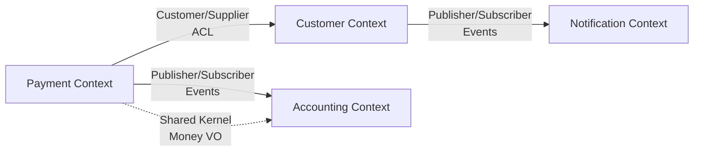

# Estándar Técnico — Bounded Contexts

---

## 1. Propósito

Definir bounded contexts por capacidades de negocio (no por tecnología), donde cada contexto tiene modelo de dominio independiente, lenguaje ubicuo, base de datos propia y equipo responsable, evitando acoplamiento global.

---

## 2. Alcance

**Aplica a:**

- Diseño de microservicios
- Separación de dominios de negocio
- Definición de equipos autónomos
- Context mapping entre servicios
- Estrategia de bases de datos

**No aplica a:**

- Servicios de infraestructura compartida (logging, monitoring)
- Componentes técnicos transversales

---

## 3. Tecnologías Aprobadas

| Componente        | Tecnología         | Versión mínima | Observaciones            |
| ----------------- | ------------------ | -------------- | ------------------------ |
| **Modeling**      | C4 Model + DDD     | -              | Context diagrams         |
| **Database**      | PostgreSQL         | 14+            | DB per context           |
| **Messaging**     | Apache Kafka       | 3.5+           | Event-driven integration |
| **API**           | REST + Kong        | -              | Open Host Service        |
| **Documentation** | ADRs + Context Map | -              | Strategic design         |

> El uso de tecnologías no listadas requiere aprobación de Arquitectura.

---

## 4. Requisitos Obligatorios 🔴

### Identificación de Contextos

- [ ] **Por capacidad de negocio**: No por tecnología
- [ ] **Lenguaje ubicuo**: Términos específicos por contexto
- [ ] **Autonomía**: Despliegue independiente
- [ ] **Team ownership**: Equipo responsable por contexto

### Database per Context

- [ ] **BD independiente**: Cada contexto su PostgreSQL
- [ ] **NO shared schema**: No compartir tablas
- [ ] **NO foreign keys**: Entre contextos
- [ ] **Integration via events**: Kafka para comunicación

### Context Mapping

- [ ] **Documentar relaciones**: Context map actualizado
- [ ] **Anticorruption Layer**: Para integración upstream
- [ ] **Published Language**: Eventos con CloudEvents
- [ ] **Open Host Service**: APIs REST documentadas

### Evitar

- [ ] **NO por capas**: No separar por presentation/business/data
- [ ] **NO por tecnología**: No frontend/backend contexts
- [ ] **NO shared database**: No compartir BD entre contextos

---

## 5. Identificación de Bounded Contexts

### Criterios de Delimitación

````text
### Ejemplo: Talma Contexts

```text
┌─────────────────────────────────────────────────────────────────┐
│  PAYMENT CONTEXT                                                │
│  - Lenguaje: Transaction, Charge, Settlement, Gateway           │
│  - Modelo: Payment, PaymentMethod, Transaction                  │
│  - BD: payment_db (PostgreSQL)                                  │
│  - Team: Team Payments                                          │
└─────────────────────────────────────────────────────────────────┘

┌─────────────────────────────────────────────────────────────────┐
│  CUSTOMER CONTEXT                                               │
│  - Lenguaje: Account, Profile, Preferences, Subscription        │
│  - Modelo: Customer, Address, ContactInfo                       │
│  - BD: customer_db (PostgreSQL)                                 │
│  - Team: Team Customer Experience                               │
└─────────────────────────────────────────────────────────────────┘

┌─────────────────────────────────────────────────────────────────┐
│  NOTIFICATION CONTEXT                                           │
│  - Lenguaje: Channel, Template, Delivery, Campaign              │
│  - Modelo: Notification, Template, DeliveryStatus               │
│  - BD: notification_db (PostgreSQL)                             │
│  - Team: Team Communications                                    │
└─────────────────────────────────────────────────────────────────┘
````

---

## 6. Context Mapping

### Patrones de Relación

```text
PAYMENT CONTEXT ──────► CUSTOMER CONTEXT
  (Customer/Supplier)
  - Payment consulta customer via API
  - Customer publica eventos CustomerCreated
  - Payment usa Anticorruption Layer

CUSTOMER CONTEXT ──────► NOTIFICATION CONTEXT
  (Publisher/Subscriber)
  - Customer publica CustomerRegistered event
  - Notification consume vía Kafka
  - Published Language: CloudEvents

PAYMENT CONTEXT ──────► ACCOUNTING CONTEXT
  (Shared Kernel - pequeño)
  - Modelo compartido: Money value object
  - SOLO para tipos inmutables
  - Sin lógica de negocio compartida
```

### Anticorruption Layer

```csharp
// Payment Context - Protegerse de cambios en Customer Context

// Services/CustomerAdapter.cs (Anticorruption Layer)
public class CustomerAdapter : ICustomerService
{
    private readonly IHttpClientFactory _httpClientFactory;

    // Payment Context model (interno)
    public async Task<PaymentCustomer> GetCustomerAsync(Guid customerId)
    {
        var client = _httpClientFactory.CreateClient("CustomerAPI");

        // Llamar API de Customer Context
        var response = await client.GetAsync($"/api/customers/{customerId}");
        var externalCustomer = await response.Content.ReadFromJsonAsync<ExternalCustomerDto>();

        // Traducir a modelo de Payment Context
        return new PaymentCustomer
        {
            Id = externalCustomer.CustomerId,
            FullName = externalCustomer.Name, // Traducción de campos
            Email = externalCustomer.ContactEmail,
            TenantId = externalCustomer.Country
        };
    }
}

// Modelo externo (Customer Context)
public record ExternalCustomerDto(
    Guid CustomerId,
    string Name,
    string ContactEmail,
    string Country
);

// Modelo interno (Payment Context)
public class PaymentCustomer
{
    public Guid Id { get; set; }
    public string FullName { get; set; } = null!;
    public string Email { get; set; } = null!;
    public string TenantId { get; set; } = null!;
}
```

---

## 7. Database per Context

### PostgreSQL - Schemas Separados

```hcl
# terraform/databases.tf

# Payment Context Database
resource "aws_db_instance" "payment_db" {
  identifier = "${var.environment}-payment-db"
  engine     = "postgres"

  db_name  = "payment_db"
  username = "payment_user"

  # Aislado de otros contextos
  vpc_security_group_ids = [aws_security_group.payment_db.id]

  tags = {
    Context = "Payment"
  }
}

# Customer Context Database
resource "aws_db_instance" "customer_db" {
  identifier = "${var.environment}-customer-db"
  engine     = "postgres"

  db_name  = "customer_db"
  username = "customer_user"

  # Aislado de otros contextos
  vpc_security_group_ids = [aws_security_group.customer_db.id]

  tags = {
    Context = "Customer"
  }
}

# Security Groups - NO permitir acceso cross-context
resource "aws_security_group" "payment_db" {
  # Solo payment-service puede acceder
  ingress {
    from_port       = 5432
    to_port         = 5432
    security_groups = [aws_security_group.payment_service.id]
  }
}
```

### ❌ Anti-Pattern: Shared Database

```sql
-- ❌ MAL: Shared schema entre contextos
CREATE SCHEMA shared;

CREATE TABLE shared.customers (  -- ❌ NO compartir
    id UUID PRIMARY KEY,
    name VARCHAR(255)
);

-- Payment context usa tabla de Customer context
SELECT * FROM shared.customers WHERE id = '...';  -- ❌ Acoplamiento
```

### ✅ Pattern: Event-Driven Integration

```csharp
// Customer Context - Publicar evento
public async Task RegisterCustomerAsync(RegisterCustomerCommand command)
{
    var customer = new Customer
    {
        Id = Guid.NewGuid(),
        Name = command.Name,
        Email = command.Email
    };

    await _dbContext.Customers.AddAsync(customer);
    await _dbContext.SaveChangesAsync();

    // Publicar evento para otros contextos
    await _eventBus.PublishAsync(new CustomerRegistered
    {
        CustomerId = customer.Id,
        Email = customer.Email,
        RegisteredAt = DateTime.UtcNow
    });
}

// Payment Context - Consumir evento
public async Task HandleCustomerRegisteredAsync(CustomerRegistered @event)
{
    // Crear copia local de datos necesarios
    var paymentCustomer = new PaymentCustomer
    {
        CustomerId = @event.CustomerId,
        Email = @event.Email
    };

    await _dbContext.PaymentCustomers.AddAsync(paymentCustomer);
    await _dbContext.SaveChangesAsync();
}
```

---

## 8. Context Map - Documentación

### Mermaid Diagram



### Context Map Document

```markdown
# Context Map - Talma Platform

## Payment Context ↔ Customer Context

**Relationship:** Customer/Supplier
**Integration:** Anticorruption Layer
**Direction:** Payment (downstream) → Customer (upstream)

**Details:**

- Payment consulta customer data via REST API
- Payment mantiene copia local de customer ID y email
- Anticorruption Layer traduce ExternalCustomerDto → PaymentCustomer
- Customer publica CustomerUpdated events

**Risks:**

- Breaking changes en Customer API afectan Payment
- Mitigación: Versionado de API, contract tests

---

## Customer Context → Notification Context

**Relationship:** Publisher/Subscriber
**Integration:** Event-Driven (Kafka)
**Direction:** Customer (upstream) → Notification (downstream)

**Published Events:**

- customer.registered
- customer.profile.updated
- customer.deleted

**Format:** CloudEvents + JSON Schema

---

## Payment Context ↔ Accounting Context

**Relationship:** Shared Kernel (limitado)
**Shared Model:** Money value object

**Details:**

- SOLO compartir value objects inmutables
- NO compartir entidades o lógica de negocio
- Mantener kernel pequeño
```

---

## 9. Lenguaje Ubicuo por Contexto

### Glossary - Payment Context

```markdown
# Payment Context - Ubiquitous Language

**Transaction**: Operación de pago completa (authorization + capture)
**Settlement**: Proceso de liquidación de fondos al merchant
**Gateway**: Proveedor externo de procesamiento (Stripe, PayPal)
**Chargeback**: Reversión de pago por disputa de cliente

# ❌ NO usar en Payment Context:

- "Invoice" (pertenece a Billing Context)
- "Account" (pertenece a Customer Context)
```

### Glossary - Customer Context

```markdown
# Customer Context - Ubiquitous Language

**Account**: Cuenta de usuario registrado
**Profile**: Datos personales y preferencias
**Subscription**: Plan activo del cliente
**Tier**: Nivel de cliente (Bronze, Silver, Gold)

# ❌ NO usar en Customer Context:

- "Transaction" (pertenece a Payment Context)
- "Stock" (pertenece a Inventory Context)
```

---

## 10. Team Ownership

### RACI Matrix

| Context          | Responsible         | Accountable        | Consulted                     | Informed  |
| ---------------- | ------------------- | ------------------ | ----------------------------- | --------- |
| **Payment**      | Team Payments       | Tech Lead Payments | Team Customer, Security       | All teams |
| **Customer**     | Team Customer       | Tech Lead Customer | Team Payments, Team Marketing | All teams |
| **Notification** | Team Communications | Tech Lead Comms    | Team Customer, Legal          | All teams |

### Team Autonomy

```yaml
team_payments:
  context: Payment
  ownership:
    - payment-api (microservice)
    - payment_db (PostgreSQL)
    - payment.* Kafka topics
  responsibilities:
    - Feature development
    - Bug fixes
    - Performance optimization
    - Database schema evolution
  autonomy:
    deploy: Independent (no coordination needed)
    database: Full control (migrations, schema)
    api_contract: Versioned evolution
```

---

## 11. Validación de Cumplimiento

```bash
# Verificar cada contexto tiene BD independiente
aws rds describe-db-instances \
  --query 'DBInstances[*].[DBInstanceIdentifier,TagList]' \
  --output table | grep Context

# Listar servicios por contexto
kubectl get deployments -n production -l context=payment

# Verificar NO hay foreign keys cross-context
psql -h payment-db -U payment_user -d payment_db <<EOF
SELECT
  tc.table_name,
  kcu.column_name,
  ccu.table_name AS foreign_table
FROM information_schema.table_constraints AS tc
JOIN information_schema.key_column_usage AS kcu
  ON tc.constraint_name = kcu.constraint_name
JOIN information_schema.constraint_column_usage AS ccu
  ON ccu.constraint_name = tc.constraint_name
WHERE tc.constraint_type = 'FOREIGN KEY';
EOF
# Esperado: Solo FKs dentro del mismo contexto

# Verificar Context Map existe
test -f docs/architecture/context-map.md && echo "✅ Context Map documented" || echo "❌ Missing Context Map"
```

---

## 12. Diseño Stateless

Los servicios dentro de cada bounded context deben ser **stateless**: externalizar sesiones en Redis, archivos en S3, no usar static mutable state, implementar idempotencia con idempotency keys. Esto permite escalado horizontal sin sticky sessions.

**Referencia:** [12-Factor App - Processes](https://12factor.net/processes)

---

## 13. Referencias

**DDD:**

- [Domain-Driven Design, Eric Evans](https://www.domainlanguage.com/ddd/)
- [Bounded Context, Martin Fowler](https://martinfowler.com/bliki/BoundedContext.html)
- [Implementing DDD, Vaughn Vernon](https://vaughnvernon.com/)

**Patterns:**

- [Strategic Design with Context Mapping](https://www.infoq.com/articles/ddd-contextmapping/)
- [Database per Service Pattern](https://microservices.io/patterns/data/database-per-service.html)
