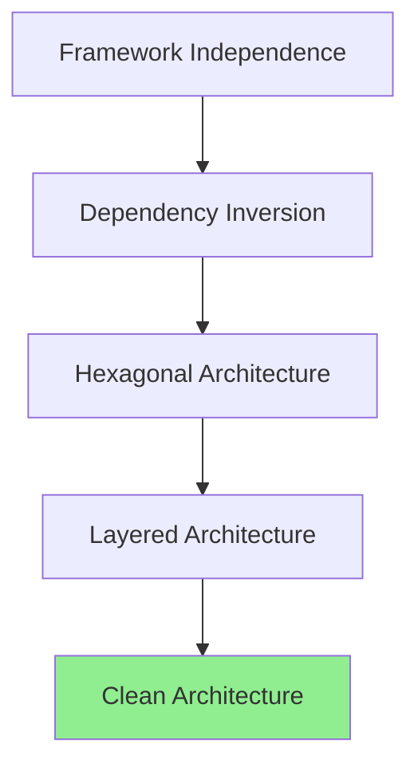

# Clean Architecture (Arquitectura Limpia)

## Contexto

Este estándar consolida los principios fundamentales de Clean Architecture aplicados a servicios .NET. Complementa el lineamiento [Arquitectura Limpia](../../lineamientos/arquitectura/11-arquitectura-limpia.md) asegurando que la lógica de negocio permanezca independiente de frameworks e infraestructura.

**Conceptos incluidos:**
- **Hexagonal Architecture (Ports & Adapters)** → Aislamiento mediante puertos y adaptadores
- **Dependency Inversion Principle** → Dependencias apuntan hacia abstracciones
- **Layered Architecture** → Separación en capas Domain, Application, Infrastructure
- **Framework Independence** → Dominio sin dependencias externas

---

## Stack Tecnológico

| Componente        | Tecnología            | Versión | Uso                                    |
| ----------------- | --------------------- | ------- | -------------------------------------- |
| **Framework**     | ASP.NET Core          | 8.0+    | Framework base para APIs               |
| **ORM**           | Entity Framework Core | 8.0+    | Adaptador de persistencia              |
| **Validación**    | FluentValidation      | 11.0+   | Validación en capa de aplicación       |
| **Mapeo**         | Mapster               | 7.4+    | Conversión entre capas                 |
| **Testing**       | xUnit + Moq           | 2.6+    | Testing aislado de dominio             |

---

## Conceptos Fundamentales

Este estándar cubre 4 principios arquitectónicos interrelacionados:

### Índice de Conceptos

1. **Hexagonal Architecture**: Patrón de puertos y adaptadores para aislar dominio
2. **Dependency Inversion**: Invertir dependencias hacia abstracciones
3. **Layered Architecture**: Organización en 4 capas (Domain, Application, Infrastructure, Presentation)
4. **Framework Independence**: Dominio libre de dependencias técnicas

### Relación entre Conceptos



---

## 1. Hexagonal Architecture (Ports & Adapters)

### ¿Qué es Hexagonal Architecture?

Patrón arquitectónico que organiza el código en capas concéntricas donde el dominio está en el centro, completamente aislado de detalles técnicos mediante **puertos** (interfaces) y **adaptadores** (implementaciones).

**Componentes:**
- **Dominio (Core)**: Lógica de negocio pura, sin dependencias externas
- **Puertos (Ports)**: Interfaces que definen contratos
  - **Primarios (Driving)**: Controllers, Event Handlers
  - **Secundarios (Driven)**: Repositories, External APIs
- **Adaptadores (Adapters)**: Implementaciones concretas de los puertos

**Beneficios:**
✅ Lógica de negocio testeable aisladamente
✅ Flexibilidad para cambiar tecnologías
✅ Facilita arquitectura multi-tenancy

### Ejemplo Comparativo

```csharp
// ❌ MALO: Lógica de negocio acoplada a EF Core

public class OrderService
{
    private readonly ApplicationDbContext _db;

    public async Task<IActionResult> CreateOrder(OrderDto dto)
    {
        var order = new Order { CustomerId = dto.CustomerId };
        _db.Orders.Add(order);
        await _db.SaveChangesAsync();
        return new OkResult(); // Retorna IActionResult (ASP.NET)
    }
}

// ✅ BUENO: Hexagonal con puertos y adaptadores

// Domain (sin dependencias)
public class Order
{
    public Guid Id { get; private set; }
    public CustomerId CustomerId { get; private set; }

    public static Result<Order> Create(CustomerId customerId)
    {
        if (customerId == null)
            return Result.Failure<Order>("CustomerId requerido");

        return Result.Success(new Order
        {
            Id = Guid.NewGuid(),
            CustomerId = customerId
        });
    }
}

// Application - Puerto de salida
public interface IOrderRepository
{
    Task SaveAsync(Order order);
}

// Application - Caso de uso
public class CreateOrderUseCase
{
    private readonly IOrderRepository _repository;

    public async Task<Result<Guid>> ExecuteAsync(CreateOrderCommand command)
    {
        var orderResult = Order.Create(new CustomerId(command.CustomerId));
        if (orderResult.IsFailure) return Result.Failure<Guid>(orderResult.Error);

        await _repository.SaveAsync(orderResult.Value);
        return Result.Success(orderResult.Value.Id);
    }
}

// Infrastructure - Adaptador
public class OrderRepository : IOrderRepository
{
    private readonly ApplicationDbContext _db;

    public async Task SaveAsync(Order order)
    {
        _db.Orders.Add(order);
        await _db.SaveChangesAsync();
    }
}
```

---

## 2. Dependency Inversion Principle (DIP)

### ¿Qué es Dependency Inversion?

Principio que establece que **las dependencias deben apuntar hacia abstracciones, no hacia implementaciones concretas**. Los módulos de alto nivel no deben depender de módulos de bajo nivel.

**Regla clave:**
`Domain → Application → Infrastructure` (flujo de control)
`Domain ← Application ← Infrastructure` (dirección de dependencias)

**Beneficios:**
✅ Facilita testing con mocks
✅ Permite cambiar implementaciones sin afectar lógica
✅ Reduce acoplamiento

### Ejemplo Comparativo

```csharp
// ❌ MALO: Dependencia concreta en dominio

public class Order
{
    private readonly EmailService _emailService; // Dependencia concreta

    public void Confirm()
    {
        Status = OrderStatus.Confirmed;
        _emailService.Send("order@mail.com", "Order confirmed"); // Acoplado
    }
}

// ✅ BUENO: Dependency Inversion

// Domain - Define el contrato (puerto)
public interface INotificationService
{
    Task SendAsync(string to, string message);
}

public class Order
{
    // Sin dependencias
    public void Confirm()
    {
        Status = OrderStatus.Confirmed;
        AddDomainEvent(new OrderConfirmedEvent(Id)); // Evento de dominio
    }
}

// Application - Usa el puerto
public class OrderConfirmedEventHandler
{
    private readonly INotificationService _notifications;

    public async Task Handle(OrderConfirmedEvent @event)
    {
        await _notifications.SendAsync(
            @event.CustomerEmail,
            "Su orden ha sido confirmada"
        );
    }
}

// Infrastructure - Implementa el puerto
public class EmailNotificationService : INotificationService
{
    private readonly SmtpClient _smtp;

    public async Task SendAsync(string to, string message)
    {
        await _smtp.SendMailAsync(to, message);
    }
}
```

---

## 3. Layered Architecture

### ¿Qué es Layered Architecture?

Organización del código en capas con responsabilidades claramente definidas y reglas de dependencia estrictas.

**Capas:**

```
┌─────────────────────────────────┐
│   Presentation (WebApi)         │ ← Adaptadores primarios
├─────────────────────────────────┤
│   Application                   │ ← Casos de uso, Commands/Queries
├─────────────────────────────────┤
│   Domain                        │ ← Lógica de negocio (Core)
├─────────────────────────────────┤
│   Infrastructure                │ ← Adaptadores secundarios
└─────────────────────────────────┘
```

**Reglas:**
- Domain no depende de nadie
- Application solo depende de Domain
- Infrastructure depende de Application y Domain
- Presentation depende de Application

**Beneficios:**
✅ Separación clara de responsabilidades
✅ Testabilidad por capas
✅ Evolución independiente

### Estructura de Proyecto

```
src/
├── ServiceName.Domain/                 # Sin dependencias externas
│   ├── Entities/
│   │   └── Order.cs
│   ├── ValueObjects/
│   │   └── Money.cs
│   └── Repositories/                   # Interfaces (puertos)
│       └── IOrderRepository.cs
│
├── ServiceName.Application/            # Depende solo de Domain
│   ├── UseCases/
│   │   └── CreateOrderUseCase.cs
│   ├── Commands/
│   │   └── CreateOrderCommand.cs
│   └── Validators/
│       └── CreateOrderCommandValidator.cs
│
├── ServiceName.Infrastructure/         # Implementa puertos
│   ├── Persistence/
│   │   ├── ApplicationDbContext.cs
│   │   └── Repositories/
│   │       └── OrderRepository.cs      # Implementa IOrderRepository
│   └── ExternalServices/
│       └── EmailService.cs
│
└── ServiceName.WebApi/                 # Punto de entrada
    ├── Controllers/
    │   └── OrdersController.cs
    ├── Program.cs
    └── appsettings.json
```

### Implementación

```csharp
// Domain/Entities/Order.cs
namespace ServiceName.Domain.Entities;

public class Order // Sin dependencias
{
    public Guid Id { get; private set; }
    public Money Total { get; private set; }

    public static Result<Order> Create()
    {
        return Result.Success(new Order { Id = Guid.NewGuid() });
    }
}

// Domain/Repositories/IOrderRepository.cs
public interface IOrderRepository
{
    Task SaveAsync(Order order);
}

// Application/UseCases/CreateOrderUseCase.cs
namespace ServiceName.Application.UseCases;

public class CreateOrderUseCase
{
    private readonly IOrderRepository _repository; // Depende de interfaz

    public async Task<Result<Guid>> ExecuteAsync(CreateOrderCommand command)
    {
        var order = Order.Create();
        await _repository.SaveAsync(order.Value);
        return Result.Success(order.Value.Id);
    }
}

// Infrastructure/Persistence/OrderRepository.cs
namespace ServiceName.Infrastructure.Persistence;

public class OrderRepository : IOrderRepository
{
    private readonly ApplicationDbContext _context;

    public async Task SaveAsync(Order order)
    {
        _context.Orders.Add(order);
        await _context.SaveChangesAsync();
    }
}

// WebApi/Program.cs
var builder = WebApplication.CreateBuilder(args);

// Registro de dependencias por capa
builder.Services.AddApplication();      // UseCases, Validators
builder.Services.AddInfrastructure();   // Repositories, DbContext
builder.Services.AddPresentation();     // Controllers

var app = builder.Build();
app.Run();
```

---

## 4. Framework Independence

### ¿Qué es Framework Independence?

Principio que establece que **el dominio debe estar libre de dependencias a frameworks específicos** (EF Core, ASP.NET, etc.), permitiendo que la lógica de negocio evolucione independientemente de decisiones tecnológicas.

**Reglas:**
- Domain NO referencia EF Core, ASP.NET, Dapper, etc.
- Domain usa POCOs (Plain Old CLR Objects)
- Atributos de frameworks solo en Infrastructure

**Beneficios:**
✅ Lógica de negocio portable
✅ Testing sin frameworks
✅ Cambio de tecnología sin reescribir dominio

### Ejemplo Comparativo

```csharp
// ❌ MALO: Dominio acoplado a EF Core

using Microsoft.EntityFrameworkCore; // ❌ Dependencia en Domain

[Table("orders")] // ❌ Atributo de EF Core
public class Order
{
    [Key] // ❌ Atributo de EF Core
    public Guid Id { get; set; }

    [Required] // ❌ Data Annotations
    [MaxLength(100)]
    public string CustomerName { get; set; }

    [InverseProperty("Order")] // ❌ Configuración EF
    public virtual ICollection<OrderLine> Lines { get; set; }
}

// ✅ BUENO: Dominio independiente

// Domain/Entities/Order.cs (sin using de frameworks)
namespace ServiceName.Domain.Entities;

public class Order // POCO puro
{
    public Guid Id { get; private set; }
    public CustomerName CustomerName { get; private set; } // Value Object
    private readonly List<OrderLine> _lines = new();
    public IReadOnlyCollection<OrderLine> Lines => _lines.AsReadOnly();

    private Order() { } // EF Core constructor sin atributos

    public static Result<Order> Create(CustomerName customerName)
    {
        if (customerName == null)
            return Result.Failure<Order>("CustomerName requerido");

        return Result.Success(new Order
        {
            Id = Guid.NewGuid(),
            CustomerName = customerName
        });
    }
}

// Infrastructure/Persistence/Configurations/OrderConfiguration.cs
using Microsoft.EntityFrameworkCore; // ✅ Dependencia solo en Infrastructure

public class OrderConfiguration : IEntityTypeConfiguration<Order>
{
    public void Configure(EntityTypeBuilder<Order> builder)
    {
        builder.ToTable("orders");
        builder.HasKey(o => o.Id);

        builder.OwnsOne(o => o.CustomerName, name =>
        {
            name.Property(n => n.Value).HasColumnName("customer_name").HasMaxLength(100);
        });

        builder.HasMany(typeof(OrderLine))
            .WithOne()
            .HasForeignKey("OrderId");
    }
}
```

---

## Implementación Integrada

### Proyecto Completo con Clean Architecture

```csharp
// ===== DOMAIN LAYER =====

// Domain/ValueObjects/CustomerId.cs
public record CustomerId(Guid Value)
{
    public static CustomerId New() => new(Guid.NewGuid());
}

// Domain/Entities/Order.cs
public class Order : AggregateRoot<Guid>
{
    public CustomerId CustomerId { get; private set; }
    public Money Total { get; private set; }
    public OrderStatus Status { get; private set; }

    private readonly List<OrderLine> _lines = new();
    public IReadOnlyCollection<OrderLine> Lines => _lines.AsReadOnly();

    private Order() { }

    public static Result<Order> Create(CustomerId customerId)
    {
        if (customerId == null)
            return Result.Failure<Order>("CustomerId requerido");

        var order = new Order
        {
            Id = Guid.NewGuid(),
            CustomerId = customerId,
            Status = OrderStatus.Draft,
            Total = Money.Zero()
        };

        order.AddDomainEvent(new OrderCreatedEvent(order.Id));

        return Result.Success(order);
    }

    public Result AddLine(ProductId productId, Quantity quantity, Money unitPrice)
    {
        if (Status != OrderStatus.Draft)
            return Result.Failure("Solo se pueden agregar líneas en borrador");

        var line = OrderLine.Create(productId, quantity, unitPrice);
        _lines.Add(line.Value);
        RecalculateTotal();

        return Result.Success();
    }

    private void RecalculateTotal()
    {
        Total = _lines.Aggregate(Money.Zero(), (sum, l) => sum.Add(l.LineTotal));
    }
}

// Domain/Repositories/IOrderRepository.cs (Puerto)
public interface IOrderRepository
{
    Task<Order?> GetByIdAsync(Guid id);
    Task SaveAsync(Order order);
}

// ===== APPLICATION LAYER =====

// Application/Commands/CreateOrderCommand.cs
public record CreateOrderCommand(
    Guid CustomerId,
    List<OrderLineDto> Lines
);

// Application/UseCases/CreateOrderUseCase.cs
public class CreateOrderUseCase
{
    private readonly IOrderRepository _repository;
    private readonly IValidator<CreateOrderCommand> _validator;

    public CreateOrderUseCase(
        IOrderRepository repository,
        IValidator<CreateOrderCommand> validator)
    {
        _repository = repository;
        _validator = validator;
    }

    public async Task<Result<Guid>> ExecuteAsync(
        CreateOrderCommand command,
        CancellationToken ct = default)
    {
        var validation = await _validator.ValidateAsync(command, ct);
        if (!validation.IsValid)
            return Result.Failure<Guid>(validation.ToString());

        var orderResult = Order.Create(new CustomerId(command.CustomerId));
        if (orderResult.IsFailure)
            return Result.Failure<Guid>(orderResult.Error);

        var order = orderResult.Value;

        foreach (var line in command.Lines)
        {
            var addResult = order.AddLine(
                new ProductId(line.ProductId),
                new Quantity(line.Quantity),
                new Money(line.UnitPrice, Currency.USD)
            );

            if (addResult.IsFailure)
                return Result.Failure<Guid>(addResult.Error);
        }

        await _repository.SaveAsync(order, ct);

        return Result.Success(order.Id);
    }
}

// ===== INFRASTRUCTURE LAYER =====

// Infrastructure/Persistence/ApplicationDbContext.cs
public class ApplicationDbContext : DbContext
{
    public DbSet<Order> Orders => Set<Order>();

    protected override void OnModelCreating(ModelBuilder modelBuilder)
    {
        modelBuilder.ApplyConfigurationsFromAssembly(typeof(ApplicationDbContext).Assembly);
    }
}

// Infrastructure/Persistence/Repositories/OrderRepository.cs (Adaptador)
public class OrderRepository : IOrderRepository
{
    private readonly ApplicationDbContext _context;

    public OrderRepository(ApplicationDbContext context)
    {
        _context = context;
    }

    public async Task<Order?> GetByIdAsync(Guid id)
    {
        return await _context.Orders
            .Include(o => o.Lines)
            .FirstOrDefaultAsync(o => o.Id == id);
    }

    public async Task SaveAsync(Order order)
    {
        _context.Orders.Add(order);
        await _context.SaveChangesAsync();
    }
}

// Infrastructure/DependencyInjection.cs
public static class DependencyInjection
{
    public static IServiceCollection AddInfrastructure(
        this IServiceCollection services,
        IConfiguration configuration)
    {
        services.AddDbContext<ApplicationDbContext>(options =>
            options.UseNpgsql(configuration.GetConnectionString("DefaultConnection"))
        );

        services.AddScoped<IOrderRepository, OrderRepository>();

        return services;
    }
}

// ===== PRESENTATION LAYER =====

// WebApi/Controllers/OrdersController.cs
[ApiController]
[Route("api/v1/orders")]
public class OrdersController : ControllerBase
{
    private readonly CreateOrderUseCase _useCase;

    [HttpPost]
    public async Task<IActionResult> CreateOrder(
        [FromBody] CreateOrderRequest request,
        CancellationToken ct)
    {
        var command = request.ToCommand();
        var result = await _useCase.ExecuteAsync(command, ct);

        return result.IsSuccess
            ? CreatedAtAction(nameof(GetOrder), new { id = result.Value },
                new { OrderId = result.Value })
            : BadRequest(new { Error = result.Error });
    }

    [HttpGet("{id:guid}")]
    public async Task<IActionResult> GetOrder(Guid id)
    {
        // Implementación...
        return Ok();
    }
}

// WebApi/Program.cs
var builder = WebApplication.CreateBuilder(args);

builder.Services.AddControllers();
builder.Services.AddApplication();
builder.Services.AddInfrastructure(builder.Configuration);

var app = builder.Build();
app.MapControllers();
app.Run();
```

---

## Matriz de Decisión

| Escenario | Hexagonal Arch | Dependency Inversion | Layered Arch | Framework Independence |
|-----------|----------------|---------------------|--------------|----------------------|
| **Microservicio nuevo** | ✅✅✅ | ✅✅✅ | ✅✅✅ | ✅✅✅ |
| **Dominio complejo** | ✅✅✅ | ✅✅ | ✅✅✅ | ✅✅✅ |
| **CRUD simple** | ✅ | ✅✅ | ✅✅ | ✅ |
| **Prototipo/PoC** | - | ✅ | ✅ | - |
| **Sistema legacy a refactorizar** | ✅✅✅ | ✅✅✅ | ✅✅ | ✅✅ |
| **Alto cambio de requisitos** | ✅✅✅ | ✅✅✅ | ✅✅ | ✅✅✅ |

---

## Requisitos Técnicos

### MUST (Obligatorio)

**Hexagonal Architecture:**
- **MUST** definir puertos como interfaces en Domain o Application
- **MUST** implementar adaptadores en Infrastructure y Presentation

**Dependency Inversion:**
- **MUST** hacer que dependencias apunten hacia abstracciones
- **MUST** usar inyección de dependencias para conectar puertos con adaptadores

**Layered Architecture:**
- **MUST** organizar código en 4 capas: Domain, Application, Infrastructure, Presentation
- **MUST** respetar reglas de dependencia entre capas

**Framework Independence:**
- **MUST** mantener Domain sin dependencias a frameworks
- **MUST** configurar EF Core mediante Fluent API en Infrastructure

### SHOULD (Fuertemente recomendado)

- **SHOULD** usar Result<T> para manejar errores en lugar de excepciones
- **SHOULD** usar Value Objects para conceptos de dominio
- **SHOULD** aplicar Domain Events para comunicación entre agregados
- **SHOULD** validar con FluentValidation en Application layer

### MAY (Opcional)

- **MAY** implementar CQRS para separar commands y queries
- **MAY** usar MediatR para desacoplar casos de uso

### MUST NOT (Prohibido)

- **MUST NOT** referenciar Infrastructure desde Domain o Application
- **MUST NOT** referenciar Presentation desde Application o Domain
- **MUST NOT** colocar lógica de negocio en controllers o repositories
- **MUST NOT** usar atributos de frameworks en entidades de Domain

---

## Referencias

- [Clean Architecture (Robert C. Martin)](https://blog.cleancoder.com/uncle-bob/2012/08/13/the-clean-architecture.html)
- [Hexagonal Architecture (Alistair Cockburn)](https://alistair.cockburn.us/hexagonal-architecture/)
- [Dependency Inversion Principle](https://en.wikipedia.org/wiki/Dependency_inversion_principle)
- [Entity Framework Core - Fluent API](https://learn.microsoft.com/en-us/ef/core/modeling/)
