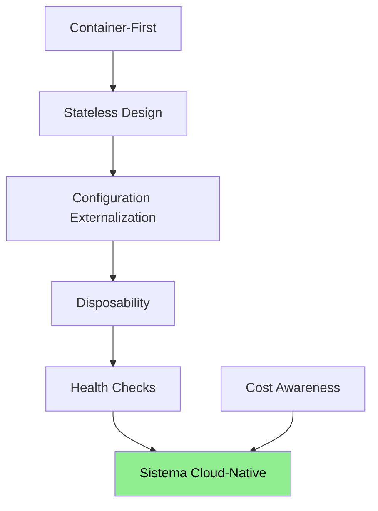

# Cloud Native

## Contexto

Este estándar consolida las prácticas fundamentales para construir sistemas que aprovechen plena­mente la elasticidad, resiliencia y dinamismo de entornos cloud. Complementa el lineamiento [Cloud Native](../../lineamientos/arquitectura/cloud-native.md).

**Conceptos incluidos:**

- **Stateless Design** → Servicios sin estado local; estado externalizado
- **Configuration Externalization** → Configuración en variables de entorno / Secrets Manager
- **Disposability** → Arranque rápido y shutdown graceful
- **Container-First** → Imagen reproducible, sin dependencias implícitas
- **Health Checks** → Señales de vida para orquestadores
- **Cost Awareness** → Diseño que evita costos innecesarios en cloud

---

## Stack Tecnológico

| Componente        | Tecnología                  | Versión | Uso                           |
| ----------------- | --------------------------- | ------- | ----------------------------- |
| **Runtime**       | AWS ECS Fargate             | —       | Orquestación de contenedores  |
| **Imágenes**      | Docker + multi-stage        | 24+     | Imágenes reproducibles        |
| **Configuración** | AWS AppConfig / Env vars    | —       | Configuración externalizada   |
| **Secretos**      | AWS Secrets Manager         | —       | Credenciales y tokens         |
| **Health**        | ASP.NET Core Health Checks  | 8.0+    | Endpoints `/health`, `/ready` |
| **Costos**        | AWS Cost Explorer + tagging | —       | Visibilidad de costos         |

---

## Relación entre Conceptos



---

## Diseño sin Estado

### ¿Qué es el Diseño sin Estado?

Un servicio es stateless cuando no retiene estado entre peticiones: cualquier instancia puede atender cualquier request con el mismo resultado. El estado (sesiones, caché compartida) se externaliza a Redis, base de datos o el cliente.

**Reglas:**

- Prohibir variables de instancia mutables que acumulen estado de sesión
- Usar Redis ElastiCache para estado compartido entre instancias (ver [Caching](./caching.md))
- Tokens JWT deben ser validados en cada request; no almacenar en memoria de la instancia
- Operaciones de larga duración persistir en base de datos, no en memoria

**Verificación:**

```csharp
// ❌ MALO — estado de sesión en instancia
public class OrderService
{
    private List<Order> _pendingOrders = new(); // estado local
}

// ✅ CORRECTO — estado en repositorio
public class OrderService
{
    private readonly IOrderRepository _repo;
    public OrderService(IOrderRepository repo) => _repo = repo;
}
```

---

## Externalización de Configuración

### ¿Qué es la Externalización de Configuración?

Toda configuración que varía entre entornos (dev/qa/prod) debe provenir del entorno, nunca estar embebida en el artefacto de despliegue.

**Jerarquía en Talma:**

| Tipo                    | Fuente                                  | Ejemplo                     |
| ----------------------- | --------------------------------------- | --------------------------- |
| General no sensible     | Variables de entorno / AppConfig        | `LOG_LEVEL`, `PAGE_SIZE`    |
| Conexiones no sensibles | Variables de entorno en task definition | `DB_HOST`, `REDIS_ENDPOINT` |
| Secretos                | AWS Secrets Manager → env vars          | `DB_PASSWORD`, `JWT_SECRET` |
| Feature flags           | AWS AppConfig                           | `FEATURE_NUEVA_UI`          |

```json
// ❌ MALO — configuración hardcodeada
{
  "ConnectionString": "Server=prod-db.talma.com;Password=s3cr3t"
}

// ✅ CORRECTO — variables de entorno
{
  "ConnectionString": "${DB_CONNECTION_STRING}"  // inyectado por ECS task definition
}
```

**Regla:** Ningún secreto ni URL de entorno específico en repositorio Git.

---

## Desechabilidad

### Arranque rápido y Graceful Shutdown

Los contenedores deben arrancar en menos de 10 segundos y apagarse limpiamente al recibir `SIGTERM`.

**Graceful Shutdown en ASP.NET Core:**

```csharp
// Program.cs
builder.Services.AddHostedService<GracefulShutdownService>();

// Tiempo máximo para apagado limpio
builder.WebHost.UseShutdownTimeout(TimeSpan.FromSeconds(30));
```

**Checklist de disposability:**

- [ ] El servicio arranca en < 10 s en condiciones normales
- [ ] Maneja `SIGTERM`: deja de aceptar requests, completa en vuelo, cierra conexiones
- [ ] No deja transacciones abiertas al apagarse
- [ ] ECS `stopTimeout` configurado en 30 s mínimo

---

## Container-First

### Imagen reproducible

Las imágenes Docker deben ser reproducibles, mínimas y seguras.

```dockerfile
# ✅ CORRECTO — multi-stage build
FROM mcr.microsoft.com/dotnet/sdk:8.0 AS build
WORKDIR /src
COPY . .
RUN dotnet publish -c Release -o /app

FROM mcr.microsoft.com/dotnet/aspnet:8.0 AS runtime
WORKDIR /app
COPY --from=build /app .
USER app                          # nunca root
ENTRYPOINT ["dotnet", "Service.dll"]
```

**Reglas de imagen:**

- Usar imagen base oficial de Microsoft (`mcr.microsoft.com/dotnet/aspnet:8.0`)
- Etiquetar con SHA o versión semántica — prohibido usar `latest` en producción
- Ejecutar como usuario no-root
- Hacer `docker scan` en pipeline CI (ver [Security Scanning](../seguridad/security-scanning.md))
- Tamaño de imagen final < 300 MB (usar `.dockerignore`)

---

## Gestión del Costo en Cloud

### Diseño consciente del costo

El costo de infraestructura es un atributo de calidad. Las decisiones técnicas de un servicio tienen impacto directo en facturación.

**Reglas:**

- Etiquetar todos los recursos AWS con `Service`, `Environment`, `Team`, `CostCenter`
- Revisar mensualmente Cost Explorer por servicio
- Configurar alertas de presupuesto en AWS Budgets
- Escalar a cero en entornos no-prod durante horas no laborables (Fargate scheduled scaling)
- Dimensionar correctamente CPU/memoria; no sobre-aprovisionar de forma permanente

**Etiquetado obligatorio en Terraform:**

```hcl
tags = {
  Service     = "api-gateway"
  Environment = "prod"
  Team        = "arquitectura"
  CostCenter  = "TI-PLATAFORMA"
}
```

---

## Lista de Verificación Cloud-Native

| Aspecto           | Verificación                                               |
| ----------------- | ---------------------------------------------------------- |
| Stateless         | No hay estado en memoria entre requests                    |
| Config            | Sin secretos en código o imagen                            |
| Secrets           | Provenientes de AWS Secrets Manager                        |
| Imagen            | Multi-stage, sin `latest`, sin root                        |
| Health checks     | `/health/live` + `/health/ready` configurados en ECS       |
| Graceful shutdown | `SIGTERM` manejado, timeout 30 s                           |
| Etiquetas         | `Service`, `Environment`, `Team`, `CostCenter` en recursos |

---

## Referencias

- [Lineamiento Cloud Native](../../lineamientos/arquitectura/cloud-native.md)
- [Containerización](./containerization.md)
- [Configuration Management](./configuration-management.md)
- [Gestión de Secretos](../seguridad/secrets-key-management.md)
- [Security Scanning](../seguridad/security-scanning.md)
- [Escalado Horizontal](./horizontal-scaling.md)
