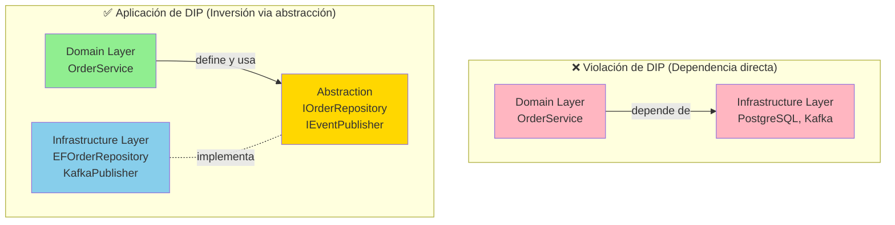

# Dependency Inversion Principle (DIP)

## Contexto

Este estándar define el **Dependency Inversion Principle (DIP)**: las capas de alto nivel (dominio, aplicación) NO deben depender de capas de bajo nivel (infraestructura), ambas deben depender de abstracciones. Complementa el [lineamiento de Arquitectura Limpia](../../lineamientos/arquitectura/11-arquitectura-limpia.md) asegurando **desacoplamiento** y **testeabilidad**.

---

## Conceptos Fundamentales

### ¿Qué es Dependency Inversion?

```yaml
# ✅ Dependency Inversion = High-Level modules definen abstracciones, Low-Level implementan

Definición (Robert Martin):
  A. High-level modules should not depend on low-level modules.
  Both should depend on abstractions.
  B. Abstractions should not depend on details.
  Details should depend on abstractions.

Traducción práctica:
  ❌ ANTES: Domain → Infrastructure (dependencia directa)
  ✅ DESPUÉS: Domain → IRepository (abstracción) ← Infrastructure

Capas:
  High-Level (Policy):
    - Domain: Reglas de negocio
    - Application: Casos de uso
    - Definen QUÉ necesitan (interfaces)

  Low-Level (Mechanism):
    - Infrastructure: Detalles técnicos (DB, HTTP, Kafka)
    - Implementan CÓMO se hace (concrete classes)

Regla de Dependencia: ✅ Infrastructure → Application (implementa interfaces)
  ✅ Application → Domain (usa entidades)
  ❌ Domain → Infrastructure (NUNCA)
  ❌ Application → Infrastructure (NUNCA directamente, solo via interfaces)

Beneficios:
  ✅ Testeable: Mock interfaces en unit tests
  ✅ Flexible: Cambiar implementación sin tocar dominio
  ✅ Desacoplado: Capas pueden evolucionar independientemente
  ✅ Reusable: Mismo dominio, múltiples infrastructure adapters
```

### Violación vs Aplicación de DIP



## Implementación: Definir Abstracciones en Domain/Application

```csharp
// ✅ Domain/Application Layer: Define abstracciones (interfaces)

namespace Talma.Sales.Application.Ports
{
    // ✅ High-level module define QUÉ necesita (no CÓMO)
    public interface IOrderRepository
    {
        Task<Order?> GetByIdAsync(Guid orderId);
        Task<List<Order>> GetPendingOrdersAsync();
        Task SaveAsync(Order order);
        Task DeleteAsync(Order order);
    }

    // ✅ Abstracción para eventos
    public interface IEventPublisher
    {
        Task PublishAsync<T>(T domainEvent) where T : DomainEvent;
    }

    // ✅ Abstracción para integración externa
    public interface IPaymentServiceClient
    {
        Task<PaymentResult> ProcessPaymentAsync(Guid orderId, Money amount);
        Task<bool> RefundAsync(Guid paymentId);
    }

    // ✅ Abstracción para notificaciones
    public interface INotificationService
    {
        Task SendEmailAsync(string to, string subject, string body);
        Task SendSmsAsync(string phoneNumber, string message);
    }
}

// ❌ Ejemplo de VIOLACIÓN de DIP (NO hacer esto)
namespace BadExample
{
    public class OrderService
    {
        // ❌ Dependencia directa en Infrastructure (EF DbContext)
        private readonly SalesDbContext _dbContext;

        // ❌ Dependencia directa en librería externa (Kafka)
        private readonly IProducer<string, string> _kafkaProducer;

        public OrderService(SalesDbContext dbContext, IProducer<string, string> producer)
        {
            _dbContext = dbContext;          // ❌ Tight coupling
            _kafkaProducer = producer;       // ❌ Tight coupling
        }

        public async Task CreateOrderAsync(Order order)
        {
            // ❌ Usa detalles de EF directamente
            _dbContext.Orders.Add(order);
            await _dbContext.SaveChangesAsync();

            // ❌ Usa detalles de Kafka directamente
            var message = JsonSerializer.Serialize(order);
            await _kafkaProducer.ProduceAsync("orders", new Message<string, string>
            {
                Key = order.OrderId.ToString(),
                Value = message
            });
        }
    }

    // Problemas:
    // 1. No se puede testear sin DB real ni Kafka real
    // 2. Cambiar de PostgreSQL a MongoDB requiere cambiar OrderService
    // 3. OrderService depende de detalles técnicos (EF, Kafka)
    // 4. No puede reusar OrderService con otra infraestructura
}

// ✅ Ejemplo CORRECTO con DIP
namespace GoodExample
{
    public class CreateOrderHandler
    {
        // ✅ Dependencia en abstracción (no implementación)
        private readonly IOrderRepository _orderRepo;
        private readonly IEventPublisher _eventPublisher;

        public CreateOrderHandler(IOrderRepository orderRepo, IEventPublisher eventPublisher)
        {
            _orderRepo = orderRepo;           // ✅ Loose coupling
            _eventPublisher = eventPublisher; // ✅ Loose coupling
        }

        public async Task<Guid> ExecuteAsync(CreateOrderCommand command)
        {
            // ✅ Usa abstracción (no sabe si es EF, Dapper, MongoDB)
            var order = Order.Create(command.CustomerId);
            foreach (var item in command.Items)
            {
                order.AddLine(item.ProductId, item.Quantity, item.UnitPrice);
            }

            await _orderRepo.SaveAsync(order);

            // ✅ Usa abstracción (no sabe si es Kafka, RabbitMQ, SNS)
            foreach (var evt in order.GetDomainEvents())
            {
                await _eventPublisher.PublishAsync(evt);
            }

            return order.OrderId;
        }
    }

    // Beneficios:
    // 1. ✅ Testeable con mocks (no requiere DB ni Kafka real)
    // 2. ✅ Cambiar DB solo requiere nuevo adapter (CreateOrderHandler sin cambios)
    // 3. ✅ Independiente de detalles técnicos
    // 4. ✅ Reusable con múltiples infraestructuras
}
```

## Implementación: Adapters en Infrastructure

```csharp
// ✅ Infrastructure Layer: Implementa abstracciones (adapters)

namespace Talma.Sales.Infrastructure.Persistence
{
    // ✅ Low-level module implementa abstracción del High-level
    public class EFOrderRepository : IOrderRepository
    {
        private readonly SalesDbContext _context;

        public EFOrderRepository(SalesDbContext context)
        {
            _context = context;  // ✅ Detalles técnicos SOLO aquí
        }

        public async Task<Order?> GetByIdAsync(Guid orderId)
        {
            return await _context.Orders
                .Include(o => o.Lines)          // EF specific
                .AsSplitQuery()                  // EF specific
                .FirstOrDefaultAsync(o => o.OrderId == orderId);
        }

        public async Task<List<Order>> GetPendingOrdersAsync()
        {
            return await _context.Orders
                .Include(o => o.Lines)
                .Where(o => o.Status == OrderStatus.Pending)
                .ToListAsync();
        }

        public async Task SaveAsync(Order order)
        {
            if (_context.Entry(order).State == EntityState.Detached)
            {
                _context.Orders.Add(order);
            }

            await _context.SaveChangesAsync();
        }

        public async Task DeleteAsync(Order order)
        {
            _context.Orders.Remove(order);
            await _context.SaveChangesAsync();
        }
    }
}

namespace Talma.Sales.Infrastructure.Messaging
{
    // ✅ Implementación con Kafka
    public class KafkaEventPublisher : IEventPublisher
    {
        private readonly IProducer<string, string> _producer;
        private readonly ILogger<KafkaEventPublisher> _logger;

        public KafkaEventPublisher(IProducer<string, string> producer, ILogger<KafkaEventPublisher> logger)
        {
            _producer = producer;  // ✅ Kafka details SOLO aquí
            _logger = logger;
        }

        public async Task PublishAsync<T>(T domainEvent) where T : DomainEvent
        {
            var topic = $"sales.{typeof(T).Name.ToLowerInvariant()}";
            var message = JsonSerializer.Serialize(domainEvent);

            var result = await _producer.ProduceAsync(topic, new Message<string, string>
            {
                Key = domainEvent.AggregateId.ToString(),
                Value = message,
                Headers = new Headers
                {
                    { "event-type", Encoding.UTF8.GetBytes(typeof(T).AssemblyQualifiedName) },
                    { "correlation-id", Encoding.UTF8.GetBytes(domainEvent.CorrelationId.ToString()) }
                }
            });

            _logger.LogInformation("Published {EventType} to {Topic} at offset {Offset}",
                typeof(T).Name, topic, result.Offset);
        }
    }

    // ✅ Implementación alternativa con AWS SNS (misma abstracción)
    public class SnsEventPublisher : IEventPublisher
    {
        private readonly IAmazonSimpleNotificationService _sns;
        private readonly IConfiguration _config;

        public SnsEventPublisher(IAmazonSimpleNotificationService sns, IConfiguration config)
        {
            _sns = sns;
            _config = config;
        }

        public async Task PublishAsync<T>(T domainEvent) where T : DomainEvent
        {
            var topicArn = _config[$"Sns:Topics:{typeof(T).Name}"];
            var message = JsonSerializer.Serialize(domainEvent);

            await _sns.PublishAsync(new PublishRequest
            {
                TopicArn = topicArn,
                Message = message,
                MessageAttributes = new Dictionary<string, MessageAttributeValue>
                {
                    ["event-type"] = new MessageAttributeValue { DataType = "String", StringValue = typeof(T).Name }
                }
            });
        }
    }
}

namespace Talma.Sales.Infrastructure.ExternalServices
{
    // ✅ Adapter para integración externa
    public class PaymentServiceClient : IPaymentServiceClient
    {
        private readonly HttpClient _httpClient;

        public PaymentServiceClient(HttpClient httpClient)
        {
            _httpClient = httpClient;  // ✅ HTTP details SOLO aquí
        }

        public async Task<PaymentResult> ProcessPaymentAsync(Guid orderId, Money amount)
        {
            var request = new
            {
                orderId = orderId.ToString(),
                amount = amount.Amount,
                currency = amount.Currency
            };

            var response = await _httpClient.PostAsJsonAsync("/api/v1/payments", request);
            response.EnsureSuccessStatusCode();

            var result = await response.Content.ReadFromJsonAsync<PaymentResponseDto>();
            return new PaymentResult(result.PaymentId, result.Status);
        }

        public async Task<bool> RefundAsync(Guid paymentId)
        {
            var response = await _httpClient.PostAsync($"/api/v1/payments/{paymentId}/refund", null);
            return response.IsSuccessStatusCode;
        }
    }
}
```

## Dependency Injection (Wiring)

```csharp
// ✅ Program.cs: Composition Root (conecta abstracciones con implementaciones)

var builder = WebApplication.CreateBuilder(args);

// ✅ Wire IOrderRepository → EFOrderRepository
builder.Services.AddScoped<IOrderRepository, EFOrderRepository>();

// ✅ Wire IEventPublisher → KafkaEventPublisher (o SnsEventPublisher)
if (builder.Environment.IsProduction())
{
    builder.Services.AddScoped<IEventPublisher, KafkaEventPublisher>();

    builder.Services.AddSingleton<IProducer<string, string>>(sp =>
    {
        var config = new ProducerConfig
        {
            BootstrapServers = builder.Configuration["Kafka:BootstrapServers"],
            Acks = Acks.All,
            EnableIdempotence = true
        };
        return new ProducerBuilder<string, string>(config).Build();
    });
}
else
{
    // ✅ Development: Use in-memory fake
    builder.Services.AddScoped<IEventPublisher, InMemoryEventPublisher>();
}

// ✅ Wire IPaymentServiceClient → PaymentServiceClient
builder.Services.AddHttpClient<IPaymentServiceClient, PaymentServiceClient>(client =>
{
    client.BaseAddress = new Uri(builder.Configuration["Services:PaymentApi"]);
    client.Timeout = TimeSpan.FromSeconds(30);
});

// ✅ Wire use cases
builder.Services.AddScoped<ICreateOrderUseCase, CreateOrderHandler>();
builder.Services.AddScoped<IApproveOrderUseCase, ApproveOrderHandler>();

var app = builder.Build();
app.MapControllers();
app.Run();
```

## Testing con DIP

```csharp
// ✅ Unit Test: Mock abstracciones (no requiere DB real)

public class CreateOrderHandlerTests
{
    [Fact]
    public async Task Should_Save_Order_And_Publish_Event()
    {
        // Arrange: Mock abstracciones
        var orderRepo = new Mock<IOrderRepository>();
        var eventPublisher = new Mock<IEventPublisher>();

        var handler = new CreateOrderHandler(orderRepo.Object, eventPublisher.Object);

        var command = new CreateOrderCommand(
            Guid.NewGuid(),
            new List<OrderItemDto>
            {
                new(Guid.NewGuid(), 5, Money.Dollars(100))
            }
        );

        // Act
        var orderId = await handler.ExecuteAsync(command);

        // Assert
        Assert.NotEqual(Guid.Empty, orderId);

        // ✅ Verify llamadas a abstracciones (no a detalles)
        orderRepo.Verify(x => x.SaveAsync(It.Is<Order>(o => o.OrderId == orderId)), Times.Once);
        eventPublisher.Verify(x => x.PublishAsync(It.IsAny<OrderCreated>()), Times.Once);
    }

    [Fact]
    public async Task Should_Throw_If_Save_Fails()
    {
        // Arrange: Simulamos fallo en Repository
        var orderRepo = new Mock<IOrderRepository>();
        orderRepo.Setup(x => x.SaveAsync(It.IsAny<Order>()))
            .ThrowsAsync(new InvalidOperationException("Database unavailable"));

        var eventPublisher = new Mock<IEventPublisher>();
        var handler = new CreateOrderHandler(orderRepo.Object, eventPublisher.Object);

        // Act & Assert
        await Assert.ThrowsAsync<InvalidOperationException>(() =>
            handler.ExecuteAsync(new CreateOrderCommand(Guid.NewGuid(), new List<OrderItemDto>())));
    }
}

// ✅ Integration Test: Con implementación real (EF in-memory)
public class OrderRepositoryIntegrationTests
{
    [Fact]
    public async Task Should_Save_And_Retrieve_Order()
    {
        // Arrange: EF in-memory database
        var options = new DbContextOptionsBuilder<SalesDbContext>()
            .UseInMemoryDatabase(databaseName: Guid.NewGuid().ToString())
            .Options;

        await using var context = new SalesDbContext(options);
        var repository = new EFOrderRepository(context);  // ✅ Implementación real

        var order = Order.Create(Guid.NewGuid());
        order.AddLine(Guid.NewGuid(), 5, Money.Dollars(100));

        // Act
        await repository.SaveAsync(order);
        var retrieved = await repository.GetByIdAsync(order.OrderId);

        // Assert
        Assert.NotNull(retrieved);
        Assert.Equal(order.OrderId, retrieved.OrderId);
        Assert.Single(retrieved.Lines);
    }
}
```

## Patrón: Abstracciones Estables

```csharp
// ✅ Estrategia para diseñar abstracciones estables

namespace Talma.Sales.Application.Ports
{
    // ✅ Abstracción ESTABLE: Define operaciones del dominio (no de la tecnología)
    public interface IOrderRepository
    {
        // ✅ Operaciones en términos del dominio (Order)
        Task<Order?> GetByIdAsync(Guid orderId);
        Task<List<Order>> GetByCustomerAsync(Guid customerId);
        Task<List<Order>> GetPendingOrdersAsync();
        Task SaveAsync(Order order);

        // ✅ NO exponer detalles de tecnología
        // ❌ BAD: IQueryable<Order> Query() // Expone LINQ/EF
        // ❌ BAD: Task<DataTable> ExecuteSqlAsync(string sql) // Expone SQL
    }

    // ✅ Abstracción con SPECIFICATION pattern (queries complejas)
    public interface IOrderRepository
    {
        Task<List<Order>> FindAsync(ISpecification<Order> spec);
    }

    public interface ISpecification<T>
    {
        Expression<Func<T, bool>> Criteria { get; }
        List<Expression<Func<T, object>>> Includes { get; }
    }

    // ✅ Uso: Application define spec sin conocer implementación
    public class OrdersByCustomerAndStatusSpec : ISpecification<Order>
    {
        public Expression<Func<Order, bool>> Criteria => o =>
            o.CustomerId == _customerId && o.Status == _status;

        public List<Expression<Func<Order, object>>> Includes =>
            new() { o => o.Lines };

        private readonly Guid _customerId;
        private readonly OrderStatus _status;

        public OrdersByCustomerAndStatusSpec(Guid customerId, OrderStatus status)
        {
            _customerId = customerId;
            _status = status;
        }
    }

    // Infrastructure implementa con EF
    public async Task<List<Order>> FindAsync(ISpecification<Order> spec)
    {
        IQueryable<Order> query = _context.Orders;

        // Apply includes
        query = spec.Includes.Aggregate(query, (current, include) => current.Include(include));

        // Apply criteria
        return await query.Where(spec.Criteria).ToListAsync();
    }
}
```

## Casos de Uso Reales

```yaml
# ✅ Aplicación de DIP en Talma Sales Service

Caso 1: Cambio de PostgreSQL a MongoDB
  Abstracción: IOrderRepository (definida en Application)
  Implementaciones:
    - EFOrderRepository (PostgreSQL con Entity Framework)
    - MongoOrderRepository (MongoDB con Driver oficial)

  Cambio necesario:
    - Crear MongoOrderRepository implementando IOrderRepository
    - Cambiar DI: services.AddScoped<IOrderRepository, MongoOrderRepository>()

  Cambios NO necesarios:
    ✅ Application layer (CreateOrderHandler) - Sin cambios
    ✅ Domain layer (Order) - Sin cambios
    ✅ API layer (Controllers) - Sin cambios

  Tiempo: 1-2 días (solo nuevo adapter)

Caso 2: Migrar de Kafka a AWS SNS/SQS
  Abstracción: IEventPublisher (definida en Application)
  Implementaciones:
    - KafkaEventPublisher (Kafka con Confluent library)
    - SnsEventPublisher (SNS con AWS SDK)

  Cambio necesario:
    - Crear SnsEventPublisher implementando IEventPublisher
    - Cambiar DI: services.AddScoped<IEventPublisher, SnsEventPublisher>()

  Cambios NO necesarios:
    ✅ Application (CreateOrderHandler) - Sin cambios
    ✅ Todos los use cases - Sin cambios

  Tiempo: 1 día

Caso 3: Unit Testing sin dependencias externas
  ✅ CreateOrderHandlerTests usa Mocks de IOrderRepository y IEventPublisher
  ✅ No requiere DB real (0ms por test)
  ✅ No requiere Kafka real (0ms por test)
  ✅ 500+ tests ejecutan en <5 segundos
  ✅ Coverage: 92% en Application layer

Caso 4: Development con Fakes (no requiere infrastructure)
  Desarrollo: IEventPublisher → InMemoryEventPublisher (lista en memoria)
  Staging: IEventPublisher → KafkaEventPublisher (Kafka local)
  Production: IEventPublisher → KafkaEventPublisher (Kafka cluster AWS)

  Beneficio: Desarrolladores trabajan sin Kafka local instalado
```

---

## Requisitos Técnicos

### MUST (Obligatorio)

- **MUST** definir abstracciones (interfaces) en Domain/Application layer
- **MUST** implementar abstracciones en Infrastructure layer
- **MUST** hacer que Infrastructure dependa de Application (no al revés)
- **MUST** usar dependency injection para conectar abstracciones con implementaciones
- **MUST** testear Application layer con mocks de abstracciones
- **MUST** mantener abstracciones estables (operaciones del dominio, no tecnología)
- **MUST** evitar que Domain/Application dependan directamente de frameworks (EF, Kafka, HTTP)

### SHOULD (Fuertemente recomendado)

- **SHOULD** usar nombres de interfaces que reflejen comportamiento (`IOrderRepository`, no `IOrderDao`)
- **SHOULD** mantener abstracciones enfocadas (ISP: Interface Segregation)
- **SHOULD** configurar DI en composition root (Program.cs)
- **SHOULD** usar diferentes implementaciones por ambiente (dev/staging/prod)
- **SHOULD** diseñar abstracciones como contratos duraderos (cambios rompen implementaciones)

### MAY (Opcional)

- **MAY** usar Specification pattern para queries complejas
- **MAY** crear abstracciones genéricas (`IRepository<T>`)
- **MAY** usar factory pattern para crear implementaciones dinámicamente

### MUST NOT (Prohibido)

- **MUST NOT** referenciar Infrastructure desde Application o Domain
- **MUST NOT** exponer detalles de tecnología en interfaces (`IQueryable`, `DbSet`, `HttpClient`)
- **MUST NOT** hacer que abstracciones dependan de implementaciones
- **MUST NOT** poner lógica de negocio en adapters (Infrastructure)
- **MUST NOT** usar concrete classes directamente en Application (siempre via abstracciones)

---

## Referencias

- [Lineamiento: Arquitectura Limpia](../../lineamientos/arquitectura/11-arquitectura-limpia.md)
- Estándares relacionados:
  - [Hexagonal Architecture](./hexagonal-architecture.md)
  - [Layered Architecture](./layered-architecture.md)
  - [Framework Independence](./framework-independence.md)
  - [Unit Testing](../../testing/unit-testing.md)
- Especificaciones:
  - [SOLID Principles](https://en.wikipedia.org/wiki/SOLID)
  - [Dependency Inversion Principle (Robert Martin)](https://web.archive.org/web/20110714224327/http://www.objectmentor.com/resources/articles/dip.pdf)
  - [.NET Dependency Injection](https://docs.microsoft.com/en-us/dotnet/core/extensions/dependency-injection)
