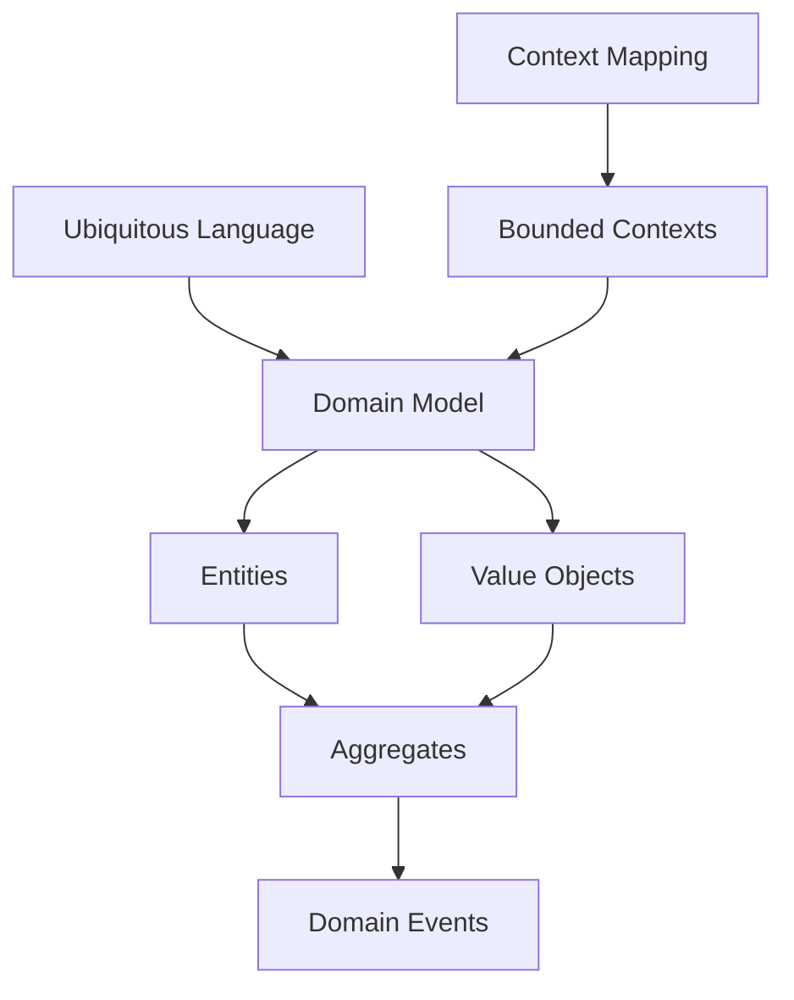

# Modelado de Dominio (Domain-Driven Design)

## Contexto

Este estándar consolida las prácticas de Domain-Driven Design para modelar la lógica de negocio de forma rica y expresiva. Complementa el lineamiento [Modelado de Dominio](../../lineamientos/arquitectura/12-modelado-de-dominio.md) estableciendo cómo estructurar el dominio usando patrones tácticos y estratégicos de DDD.

**Conceptos incluidos:**

- **Domain Model** → Modelo rico que refleja el negocio
- **Aggregates** → Clusters de entidades con consistencia transaccional
- **Entities & Value Objects** → Objetos con/sin identidad
- **Bounded Contexts** → Límites de modelos y equipos
- **Context Mapping** → Relaciones entre bounded contexts
- **Ubiquitous Language** → Lenguaje compartido equipo-negocio
- **Domain Events** → Eventos que representan hechos del dominio

---

## Stack Tecnológico

| Componente        | Tecnología                     | Versión | Uso                                   |
| ----------------- | ------------------------------ | ------- | ------------------------------------- |
| **Framework**     | ASP.NET Core                   | 8.0+    | Base para implementación DDD          |
| **ORM**           | Entity Framework Core          | 8.0+    | Mapeo de agregados con owned entities |
| **Validación**    | FluentValidation               | 11.0+   | Validación de reglas de negocio       |
| **Eventos**       | MediatR                        | 12.0+   | Publicación de domain events          |
| **Value Objects** | ValueObject (CSharpFunctional) | 2.0+    | Implementación de VOs                 |

---

## Conceptos Fundamentales

Este estándar cubre 7 patrones de DDD para modelado rico de dominio:

### Índice de Conceptos

1. **Domain Model**: Modelo que refleja el lenguaje y reglas del negocio
2. **Aggregates**: Límites de consistencia transaccional
3. **Entities & Value Objects**: Objetos con identidad vs objetos inmutables por valor
4. **Bounded Contexts**: Límites explícitos de modelos
5. **Context Mapping**: Patrones de integración entre contexts
6. **Ubiquitous Language**: Lenguaje compartido
7. **Domain Events**: Eventos del dominio para comunicación

### Relación entre Conceptos



---

## 1. Domain Model

### ¿Qué es Domain Model?

Modelo rico que encapsula la lógica de negocio usando objetos con comportamiento, no anémicos con solo getters/setters.

**Propósito:** Centralizar lógica de negocio en el dominio, no en servicios.

**Características:**

- Comportamiento + datos
- Invariantes protegidas
- Lenguaje del negocio

**Beneficios:**
✅ Lógica centralizada y testeable
✅ Modelo expresivo
✅ Reduce bugs de lógica duplicada

### Ejemplo Comparativo

```csharp
// ❌ MALO: Anemic Domain Model
public class Order
{
    public Guid Id { get; set; }
    public List<OrderLine> Lines { get; set; }
    public decimal Total { get; set; }
    public OrderStatus Status { get; set; }
}

public class OrderService
{
    public void AddLine(Order order, Product product, int quantity)
    {
        // Lógica en servicio, no en dominio
        order.Lines.Add(new OrderLine { Product = product, Quantity = quantity });
        order.Total = order.Lines.Sum(l => l.Product.Price * l.Quantity);
    }
}

// ✅ BUENO: Rich Domain Model
public class Order
{
    private readonly List<OrderLine> _lines = new();
    public IReadOnlyList<OrderLine> Lines => _lines.AsReadOnly();

    public Guid Id { get; private set; }
    public Money Total { get; private set; }
    public OrderStatus Status { get; private set; }

    private Order() { } // EF Core

    public static Order Create(CustomerId customerId)
    {
        return new Order
        {
            Id = Guid.NewGuid(),
            Status = OrderStatus.Draft,
            Total = Money.Zero
        };
    }

    public void AddLine(Product product, Quantity quantity)
    {
        if (Status != OrderStatus.Draft)
            throw new DomainException("Cannot modify confirmed order");

        var line = new OrderLine(product, quantity);
        _lines.Add(line);
        RecalculateTotal();
    }

    private void RecalculateTotal()
    {
        Total = _lines.Aggregate(Money.Zero, (acc, line) => acc + line.Subtotal);
    }

    public void Confirm()
    {
        if (!_lines.Any())
            throw new DomainException("Cannot confirm empty order");

        Status = OrderStatus.Confirmed;
        AddDomainEvent(new OrderConfirmedEvent(Id));
    }
}
```

---

## 2. Aggregates

### ¿Qué son Aggregates?

Cluster de entidades y value objects con un límite de consistencia transaccional. Una entidad raíz (Aggregate Root) controla el acceso.

**Propósito:** Definir límites de consistencia y transaccionalidad.

**Reglas:**

- Solo el root es accesible desde fuera
- Referencias entre aggregates por ID
- Un aggregate = una transacción

**Beneficios:**
✅ Consistencia garantizada
✅ Límites claros
✅ Facilita escalamiento

### Ejemplo Comparativo

```csharp
// ❌ MALO: Sin aggregate boundaries
public class Order
{
    public List<OrderLine> Lines { get; set; }
}

public class OrderLine
{
    public Guid Id { get; set; }
    public decimal Price { get; set; }
}

// Código cliente puede modificar líneas directamente
order.Lines[0].Price = 999; // Rompe invariantes

// ✅ BUENO: Aggregate bien definido
public class Order // Aggregate Root
{
    private readonly List<OrderLine> _lines = new();
    public IReadOnlyList<OrderLine> Lines => _lines.AsReadOnly();

    // Solo el root expone métodos que mantienen invariantes
    public void AddLine(ProductId productId, Quantity quantity, Money unitPrice)
    {
        var line = new OrderLine(productId, quantity, unitPrice);
        _lines.Add(line);
        RecalculateTotal();
    }

    public void RemoveLine(int index)
    {
        if (index < 0 || index >= _lines.Count)
            throw new DomainException("Invalid line index");

        _lines.RemoveAt(index);
        RecalculateTotal();
    }

    private void RecalculateTotal()
    {
        Total = _lines.Sum(l => l.Subtotal);
    }
}

// OrderLine es una entidad interna, no accesible directamente
internal class OrderLine
{
    public ProductId ProductId { get; private set; }
    public Quantity Quantity { get; private set; }
    public Money UnitPrice { get; private set; }
    public Money Subtotal => UnitPrice * Quantity.Value;

    internal OrderLine(ProductId productId, Quantity quantity, Money unitPrice)
    {
        ProductId = productId;
        Quantity = quantity;
        UnitPrice = unitPrice;
    }
}
```

---

## 3. Entities & Value Objects

### ¿Qué son?

**Entity**: Objeto con identidad única que persiste en el tiempo.
**Value Object**: Objeto inmutable definido por sus atributos, sin identidad.

**Propósito:** Modelar correctamente conceptos con/sin identidad.

**Cuándo usar cada uno:**

- **Entity**: Cliente, Pedido, Producto (tienen ID)
- **Value Object**: Dinero, Dirección, Rango de fechas (sin ID, comparables por valor)

**Beneficios:**
✅ Modelo más expresivo
✅ Inmutabilidad donde corresponde
✅ Validación encapsulada

### Ejemplo Comparativo

```csharp
// ❌ MALO: Todo son entidades con IDs
public class Address
{
    public Guid Id { get; set; } // ¿Por qué necesita ID?
    public string Street { get; set; }
    public string City { get; set; }
    public string PostalCode { get; set; }
}

// ✅ BUENO: Value Object inmutable
public class Address : ValueObject
{
    public string Street { get; private set; }
    public string City { get; private set; }
    public string PostalCode { get; private set; }

    private Address() { }

    public static Address Create(string street, string city, string postalCode)
    {
        if (string.IsNullOrWhiteSpace(street))
            throw new ArgumentException("Street is required", nameof(street));

        return new Address
        {
            Street = street,
            City = city,
            PostalCode = postalCode
        };
    }

    protected override IEnumerable<object> GetEqualityComponents()
    {
        yield return Street;
        yield return City;
        yield return PostalCode;
    }
}

// Value Object: Money
public class Money : ValueObject
{
    public decimal Amount { get; private set; }
    public string Currency { get; private set; }

    public static Money Zero => new Money { Amount = 0, Currency = "USD" };

    public static Money Create(decimal amount, string currency = "USD")
    {
        if (amount < 0)
            throw new ArgumentException("Amount cannot be negative");

        return new Money { Amount = amount, Currency = currency };
    }

    public static Money operator +(Money a, Money b)
    {
        if (a.Currency != b.Currency)
            throw new InvalidOperationException("Cannot add money with different currencies");

        return Create(a.Amount + b.Amount, a.Currency);
    }

    protected override IEnumerable<object> GetEqualityComponents()
    {
        yield return Amount;
        yield return Currency;
    }
}
```

---

## 4. Bounded Contexts

### ¿Qué son Bounded Contexts?

Límites explícitos donde un modelo de dominio es válido. Dentro del contexto, el lenguaje es consistente.

**Propósito:** Dividir sistemas grandes en partes manejables con modelos independientes.

**Características:**

- Un modelo por contexto
- Ubiquitous language específico
- Límites organizacionales (equipos)

**Beneficios:**
✅ Modelos simples y enfocados
✅ Equipos autónomos
✅ Evolución independiente

### Ejemplo

```yaml
# Bounded Contexts de una plataforma e-commerce

OrderManagement Context:
  Entidades: Order, OrderLine, Customer
  Lenguaje: "Order", "Confirm", "Ship"
  Equipo: Orders Team

Catalog Context:
  Entidades: Product, Category, Inventory
  Lenguaje: "Product", "SKU", "Stock"
  Equipo: Catalog Team

Billing Context:
  Entidades: Invoice, Payment, Receipt
  Lenguaje: "Invoice", "Charge", "Refund"
  Equipo: Billing Team

# "Customer" puede existir en múltiples contexts con diferentes modelos
# En OrderManagement: Customer tiene dirección de envío
# En Billing: Customer tiene método de pago
# Son modelos distintos, no uno compartido
```

```csharp
// OrderManagement Context
namespace OrderManagement.Domain
{
    public class Customer
    {
        public CustomerId Id { get; private set; }
        public string FullName { get; private set; }
        public Address ShippingAddress { get; private set; }
        public List<Order> OrderHistory { get; private set; }
    }
}

// Billing Context - Modelo diferente del mismo concepto
namespace Billing.Domain
{
    public class Customer
    {
        public CustomerId Id { get; private set; }
        public string BillingName { get; private set; }
        public PaymentMethod PreferredPayment { get; private set; }
        public CreditLimit CreditLimit { get; private set; }
    }
}
```

---

## 5. Context Mapping

### ¿Qué es Context Mapping?

Patrones para definir cómo se relacionan bounded contexts entre sí.

**Propósito:** Gestionar integraciones entre contexts manteniendo autonomía.

**Patrones principales:**

- **Shared Kernel**: Subset compartido (usar con precaución)
- **Customer-Supplier**: Upstream/downstream, acuerdos explícitos
- **Conformist**: Downstream se conforma al upstream
- **Anti-Corruption Layer (ACL)**: Capa que traduce modelos externos
- **Published Language**: Modelo público bien documentado

**Beneficios:**
✅ Integración explícita
✅ Autonomía preservada
✅ Evolución independiente

### Ejemplo

```csharp
// Anti-Corruption Layer: Billing no depende del modelo de Orders
namespace Billing.Infrastructure.Integration
{
    // ACL traduce eventos de Orders al modelo de Billing
    public class OrderIntegrationService
    {
        private readonly IBillingService _billingService;

        public async Task Handle(OrderConfirmedEvent orderEvent)
        {
            // Traducir del modelo de Orders al modelo de Billing
            var billingCustomer = await TranslateCustomer(orderEvent.CustomerId);
            var billingItems = TranslateItems(orderEvent.Items);

            // Usar modelo propio de Billing
            var invoice = Invoice.Create(
                billingCustomer.Id,
                billingItems,
                orderEvent.OrderId);

            await _billingService.CreateInvoiceAsync(invoice);
        }

        private async Task<BillingCustomer> TranslateCustomer(Guid orderCustomerId)
        {
            // Traducir CustomerId de Orders a modelo de Billing
            var billingCustomer = await _customerRepository.GetByExternalIdAsync(orderCustomerId);
            return billingCustomer ?? throw new InvalidOperationException("Customer not found");
        }

        private List<InvoiceLine> TranslateItems(List<OrderItem> orderItems)
        {
            // Traducir OrderItems a InvoiceLines
            return orderItems.Select(item => new InvoiceLine(
                description: item.ProductName,
                quantity: item.Quantity,
                unitPrice: new Money(item.UnitPrice, "USD")
            )).ToList();
        }
    }
}
```

---

## 6. Ubiquitous Language

### ¿Qué es Ubiquitous Language?

Lenguaje compartido entre equipo técnico y negocio, usado consistentemente en código, documentación y conversaciones.

**Propósito:** Eliminar ambigüedad, alinear código con negocio.

**Prácticas:**

- Usar términos del negocio en código
- Glosario compartido
- Refactorizar cuando el lenguaje evoluciona

**Beneficios:**
✅ Menos malentendidos
✅ Código autodocumentado
✅ Alineación negocio-técnica

### Ejemplo Comparativo

```csharp
// ❌ MALO: Lenguaje técnico genérico
public class DataProcessor
{
    public void Process(List<Item> items)
    {
        foreach (var item in items)
        {
            item.Status = 1; // ¿Qué es 1?
            item.Flag = true;
            SaveItem(item);
        }
    }
}

// ✅ BUENO: Ubiquitous Language
public class OrderFulfillment
{
    public void ConfirmOrders(List<Order> pendingOrders)
    {
        foreach (var order in pendingOrders)
        {
            order.Confirm(); // Lenguaje del negocio
            order.AssignToWarehouse();
            _orderRepository.Save(order);
        }
    }
}

// Glosario compartido en código
namespace OrderManagement.Domain
{
    public enum OrderStatus
    {
        Draft,          // Pedido en construcción
        Confirmed,      // Confirmado por cliente
        Assigned,       // Asignado a almacén
        Shipped,        // Enviado
        Delivered,      // Entregado
        Cancelled       // Cancelado
    }

    // Métodos con nombres del negocio
    public class Order
    {
        public void Confirm() { ... }
        public void AssignToWarehouse() { ... }
        public void MarkAsShipped(TrackingNumber tracking) { ... }
        public void Cancel(CancellationReason reason) { ... }
    }
}
```

---

## 7. Domain Events

### ¿Qué son Domain Events?

Eventos que representan hechos significativos del dominio que ya ocurrieron.

**Propósito:** Comunicar cambios entre aggregates y contexts manteniendo bajo acoplamiento.

**Características:**

- Nombrados en pasado (`OrderConfirmed`, no `ConfirmOrder`)
- Inmutables
- Contienen datos necesarios para reaccionar

**Beneficios:**
✅ Desacoplamiento entre aggregates
✅ Auditoría implícita
✅ Integración asíncrona

### Ejemplo

```csharp
// Domain Event
public record OrderConfirmedEvent(
    Guid OrderId,
    Guid CustomerId,
    Money Total,
    DateTime ConfirmedAt) : IDomainEvent;

// Aggregate publica eventos
public class Order
{
    private readonly List<IDomainEvent> _domainEvents = new();
    public IReadOnlyList<IDomainEvent> DomainEvents => _domainEvents.AsReadOnly();

    public void Confirm()
    {
        if (Status != OrderStatus.Draft)
            throw new DomainException("Only draft orders can be confirmed");

        Status = OrderStatus.Confirmed;

        // Publicar evento
        _domainEvents.Add(new OrderConfirmedEvent(
            OrderId: Id,
            CustomerId: CustomerId,
            Total: Total,
            ConfirmedAt: DateTime.UtcNow));
    }

    public void ClearDomainEvents() => _domainEvents.Clear();
}

// Handlers reaccionan a eventos
public class OrderConfirmedEventHandler : INotificationHandler<OrderConfirmedEvent>
{
    private readonly IEmailService _emailService;
    private readonly IInventoryService _inventoryService;

    public async Task Handle(OrderConfirmedEvent notification, CancellationToken ct)
    {
        // Enviar email al cliente
        await _emailService.SendOrderConfirmationAsync(
            notification.CustomerId,
            notification.OrderId);

        // Reservar inventario
        await _inventoryService.ReserveStockAsync(notification.OrderId);
    }
}

// Publicación en EF Core SaveChanges
public class ApplicationDbContext : DbContext
{
    private readonly IMediator _mediator;

    public override async Task<int> SaveChangesAsync(CancellationToken ct = default)
    {
        var events = ChangeTracker.Entries<Entity>()
            .SelectMany(e => e.Entity.DomainEvents)
            .ToList();

        var result = await base.SaveChangesAsync(ct);

        // Publicar eventos después de guardar
        foreach (var domainEvent in events)
        {
            await _mediator.Publish(domainEvent, ct);
        }

        return result;
    }
}
```

---

## Matriz de Decisión

| Escenario            | Domain Model | Aggregates | Value Objects | Bounded Contexts | Domain Events |
| -------------------- | ------------ | ---------- | ------------- | ---------------- | ------------- |
| **Dominio complejo** | ✅✅✅       | ✅✅✅     | ✅✅✅        | ✅✅✅           | ✅✅✅        |
| **CRUD simple**      | ✅           | ⚠️         | ✅            | ⚠️               | ⚠️            |
| **Microservicios**   | ✅✅         | ✅✅       | ✅✅          | ✅✅✅           | ✅✅✅        |
| **Sistema grande**   | ✅✅✅       | ✅✅✅     | ✅✅          | ✅✅✅           | ✅✅          |

---

## Requisitos Técnicos

### MUST (Obligatorio)

**Domain Model:**

- **MUST** encapsular lógica de negocio en entidades, no en servicios
- **MUST** proteger invariantes con setters privados

**Aggregates:**

- **MUST** definir aggregate roots como únicos puntos de acceso
- **MUST** mantener agregados pequeños (idealmente una entidad root + VOs)

**Entities & Value Objects:**

- **MUST** usar value objects para conceptos sin identidad
- **MUST** hacer value objects inmutables

**Bounded Contexts:**

- **MUST** definir contexts explícitos para dominios mayores a 5 agregados

**Domain Events:**

- **MUST** nombrar eventos en pasado
- **MUST** hacer eventos inmutables

### SHOULD (Fuertemente recomendado)

- **SHOULD** usar ubiquitous language en nombres de clases y métodos
- **SHOULD** implementar context mapping con ACL para integraciones externas
- **SHOULD** publicar domain events para comunicación entre aggregates

### MAY (Opcional)

- **MAY** usar Event Sourcing para aggregates con historial importante

### MUST NOT (Prohibido)

- **MUST NOT** exponer colecciones mutables desde aggregates
- **MUST NOT** compartir entidades entre aggregates (solo por ID)
- **MUST NOT** hacer agregados gigantes (>10 entidades)

---

## Referencias

- [Domain-Driven Design (Eric Evans)](https://www.domainlanguage.com/ddd/)
- [Implementing DDD (Vaughn Vernon)](https://vaughnvernon.co/)
- [Microsoft DDD Guide](https://learn.microsoft.com/en-us/dotnet/architecture/microservices/microservice-ddd-cqrs-patterns/)
- [Context Mapping](https://github.com/ddd-crew/context-mapping)
