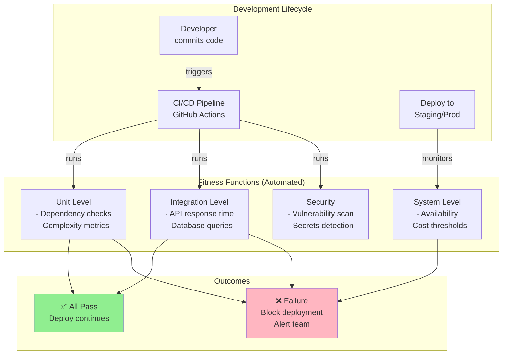

# Fitness Functions

## Contexto

Este estándar define **fitness functions**: verificaciones **automatizadas** que validan que la arquitectura cumple con **objetivos arquitectónicos** (performance, seguridad, modularidad) de forma continua. Complementa el [lineamiento de Arquitectura Evolutiva](../../lineamientos/arquitectura/12-arquitectura-evolutiva.md) asegurando **protección** de características arquitectónicas durante la evolución.

---

## Conceptos Fundamentales

### ¿Qué son Fitness Functions?

```yaml
# ✅ Fitness Functions = Automated tests para objetivos arquitectónicos

Definición (Ford, Parsons, Kua):
  "Función objetivo que provee evaluación automatizada de qué tan cerca
   está el sistema de alcanzar un objetivo arquitectónico específico."

Traducción práctica:
  Test automatizado que falla si arquitectura viola una característica deseada.

Ejemplos:
  ✅ Performance: "API endpoints < 200ms p95"
  ✅ Modularidad: "Servicios NO deben tener dependencias cíclicas"
  ✅ Seguridad: "Secrets NO deben estar en código"
  ✅ Escalabilidad: "Base de datos < 80% capacity"
  ✅ Acoplamiento: "Domain layer NO debe referenciar Infrastructure"

Características:
  ✅ Automated: Ejecuta en CI/CD sin intervención humana
  ✅ Objective: Medida cuantificable (no opinión subjetiva)
  ✅ Continuous: Validación en cada commit/deploy
  ✅ Granular: Valida UNA característica arquitectónica
  ✅ Actionable: Falla clara indica qué arreglar

Tipos:
  - Atomic: Valida una dimensión (ej: response time)
  - Holistic: Valida múltiples dimensiones (ej: response time + error rate)
  - Triggered: Ejecuta en evento (commit, deploy, scheduled)
  - Continuous: Ejecuta permanentemente (monitoring)
```

### Arquitectura con Fitness Functions



## Implementación: Fitness Function de Dependencias

```csharp
// ✅ Fitness Function: Domain NO debe depender de Infrastructure

namespace Talma.Sales.Architecture.Tests
{
    public class DependencyFitnessTests
    {
        [Fact]
        public void Domain_Should_Not_Reference_Infrastructure()
        {
            // Arrange: Get Domain assembly
            var domainAssembly = typeof(Order).Assembly;
            var infrastructureAssemblyName = "Talma.Sales.Infrastructure";

            // Act: Check referenced assemblies
            var references = domainAssembly.GetReferencedAssemblies()
                .Select(a => a.Name)
                .ToList();

            // Assert: ✅ Fitness function validates architectural rule
            Assert.DoesNotContain(infrastructureAssemblyName, references);
        }

        [Fact]
        public void Domain_Should_Not_Reference_EntityFramework()
        {
            // Arrange
            var domainAssembly = typeof(Order).Assembly;

            // Act
            var efReferences = domainAssembly.GetReferencedAssemblies()
                .Where(a => a.Name.Contains("EntityFramework"))
                .ToList();

            // Assert: ✅ Framework independence
            Assert.Empty(efReferences);
        }

        [Fact]
        public void Services_Should_Not_Have_Circular_Dependencies()
        {
            // Arrange: Analyze all service projects
            var services = new[]
            {
                "Talma.Sales",
                "Talma.Catalog",
                "Talma.Fulfillment",
                "Talma.Billing"
            };

            // Act: Check project references
            var circularDeps = DetectCircularDependencies(services);

            // Assert: ✅ No circular dependencies
            Assert.Empty(circularDeps);
        }

        private List<string> DetectCircularDependencies(string[] services)
        {
            var graph = BuildDependencyGraph(services);
            return FindCycles(graph);
        }
    }
}
```

## Implementación: Fitness Function de Performance

```csharp
// ✅ Fitness Function: API response time < 200ms (p95)

namespace Talma.Sales.Performance.Tests
{
    public class PerformanceFitnessTests
    {
        private readonly WebApplicationFactory<Program> _factory;

        public PerformanceFitnessTests()
        {
            _factory = new WebApplicationFactory<Program>()
                .WithWebHostBuilder(builder =>
                {
                    builder.ConfigureServices(services =>
                    {
                        // Use in-memory DB for consistent performance
                        services.AddDbContext<SalesDbContext>(options =>
                            options.UseInMemoryDatabase("PerformanceTest"));
                    });
                });
        }

        [Fact]
        public async Task GetOrder_Should_Respond_Under_200ms_P95()
        {
            // Arrange
            var client = _factory.CreateClient();
            var orderId = await SeedTestOrder(client);

            var responseTimes = new List<long>();
            const int iterations = 100;

            // Act: Measure 100 requests
            for (int i = 0; i < iterations; i++)
            {
                var stopwatch = Stopwatch.StartNew();
                var response = await client.GetAsync($"/api/v1/orders/{orderId}");
                stopwatch.Stop();

                response.EnsureSuccessStatusCode();
                responseTimes.Add(stopwatch.ElapsedMilliseconds);
            }

            // Calculate p95
            responseTimes.Sort();
            var p95Index = (int)(iterations * 0.95);
            var p95ResponseTime = responseTimes[p95Index];

            // Assert: ✅ Fitness function validates SLO
            Assert.True(p95ResponseTime < 200,
                $"P95 response time {p95ResponseTime}ms exceeds 200ms threshold");
        }

        [Fact]
        public async Task CreateOrder_Should_Complete_Under_500ms()
        {
            // Arrange
            var client = _factory.CreateClient();
            var request = new CreateOrderRequest(
                Guid.NewGuid(),
                new List<CreateOrderItemRequest>
                {
                    new(Guid.NewGuid(), 5)
                }
            );

            // Act
            var stopwatch = Stopwatch.StartNew();
            var response = await client.PostAsJsonAsync("/api/v1/orders", request);
            stopwatch.Stop();

            // Assert: ✅ Critical path performance
            response.EnsureSuccessStatusCode();
            Assert.True(stopwatch.ElapsedMilliseconds < 500,
                $"CreateOrder took {stopwatch.ElapsedMilliseconds}ms, exceeds 500ms SLO");
        }
    }
}
```

## Implementación: Fitness Function de Complejidad

```csharp
// ✅ Fitness Function: Cyclomatic complexity < 10 per method

using Microsoft.CodeAnalysis;
using Microsoft.CodeAnalysis.CSharp;
using Microsoft.CodeAnalysis.CSharp.Syntax;

namespace Talma.Sales.Quality.Tests
{
    public class ComplexityFitnessTests
    {
        [Fact]
        public void No_Method_Should_Exceed_Cyclomatic_Complexity_Of_10()
        {
            // Arrange: Analyze all source files in Domain and Application
            var sourceFiles = Directory.GetFiles(
                "../../../Talma.Sales.Domain",
                "*.cs",
                SearchOption.AllDirectories
            );

            var violations = new List<string>();

            // Act: Calculate complexity for each method
            foreach (var file in sourceFiles)
            {
                var code = File.ReadAllText(file);
                var tree = CSharpSyntaxTree.ParseText(code);
                var root = tree.GetRoot();

                var methods = root.DescendantNodes()
                    .OfType<MethodDeclarationSyntax>();

                foreach (var method in methods)
                {
                    var complexity = CalculateCyclomaticComplexity(method);

                    if (complexity > 10)
                    {
                        violations.Add($"{file}: {method.Identifier} has complexity {complexity}");
                    }
                }
            }

            // Assert: ✅ Enforce complexity threshold
            Assert.Empty(violations);
        }

        private int CalculateCyclomaticComplexity(MethodDeclarationSyntax method)
        {
            // Start with 1 (single path)
            int complexity = 1;

            // Count decision points
            var ifStatements = method.DescendantNodes().OfType<IfStatementSyntax>().Count();
            var whileLoops = method.DescendantNodes().OfType<WhileStatementSyntax>().Count();
            var forLoops = method.DescendantNodes().OfType<ForStatementSyntax>().Count();
            var caseLabels = method.DescendantNodes().OfType<SwitchSectionSyntax>().Count();
            var catches = method.DescendantNodes().OfType<CatchClauseSyntax>().Count();
            var ternary = method.DescendantNodes().OfType<ConditionalExpressionSyntax>().Count();
            var logicalAnd = method.DescendantNodes()
                .OfType<BinaryExpressionSyntax>()
                .Count(b => b.IsKind(SyntaxKind.LogicalAndExpression));
            var logicalOr = method.DescendantNodes()
                .OfType<BinaryExpressionSyntax>()
                .Count(b => b.IsKind(SyntaxKind.LogicalOrExpression));

            complexity += ifStatements + whileLoops + forLoops + caseLabels +
                         catches + ternary + logicalAnd + logicalOr;

            return complexity;
        }
    }
}
```

## Implementación: Fitness Function de Seguridad

```csharp
// ✅ Fitness Function: No secrets in code

namespace Talma.Sales.Security.Tests
{
    public class SecurityFitnessTests
    {
        [Fact]
        public void Code_Should_Not_Contain_Hardcoded_Secrets()
        {
            // Arrange: Secret patterns
            var secretPatterns = new[]
            {
                @"password\s*=\s*[""'][^""']+[""']",  // password="something"
                @"apikey\s*=\s*[""'][^""']+[""']",    // apikey="something"
                @"connectionstring\s*=\s*[""'].*password=[^""']+[""']",  // connection string with password
                @"AKIA[0-9A-Z]{16}",  // AWS Access Key
                @"sk-[a-zA-Z0-9]{32,}",  // OpenAI API key pattern
            };

            var sourceFiles = Directory.GetFiles(
                "../../../",
                "*.cs",
                SearchOption.AllDirectories
            );

            var violations = new List<string>();

            // Act: Scan for secrets
            foreach (var file in sourceFiles)
            {
                var content = File.ReadAllText(file);

                foreach (var pattern in secretPatterns)
                {
                    var matches = Regex.Matches(content, pattern, RegexOptions.IgnoreCase);
                    if (matches.Any())
                    {
                        violations.Add($"{Path.GetFileName(file)}: Found potential secret matching pattern {pattern}");
                    }
                }
            }

            // Assert: ✅ No secrets in code
            Assert.Empty(violations);
        }

        [Fact]
        public void All_HTTP_Clients_Should_Use_HTTPS()
        {
            // Arrange
            var configFiles = Directory.GetFiles(
                "../../../",
                "appsettings*.json",
                SearchOption.AllDirectories
            );

            var violations = new List<string>();

            // Act: Check HTTP URLs
            foreach (var file in configFiles)
            {
                var json = File.ReadAllText(file);
                var httpMatches = Regex.Matches(json, @"""http://[^""]+""");

                foreach (Match match in httpMatches)
                {
                    // Allow localhost for development
                    if (!match.Value.Contains("localhost") && !match.Value.Contains("127.0.0.1"))
                    {
                        violations.Add($"{Path.GetFileName(file)}: Found non-HTTPS URL: {match.Value}");
                    }
                }
            }

            // Assert: ✅ Only HTTPS (except localhost)
            Assert.Empty(violations);
        }

        [Fact]
        public async Task API_Should_Reject_Requests_Without_Authentication()
        {
            // Arrange
            var factory = new WebApplicationFactory<Program>();
            var client = factory.CreateClient();

            // Act: Request without Authorization header
            var response = await client.GetAsync("/api/v1/orders");

            // Assert: ✅ Require authentication
            Assert.Equal(HttpStatusCode.Unauthorized, response.StatusCode);
        }
    }
}
```

## Implementación: Fitness Function de Costos (AWS)

```csharp
// ✅ Fitness Function: AWS monthly cost < budget threshold

using Amazon.CostExplorer;
using Amazon.CostExplorer.Model;

namespace Talma.Sales.Operations.Tests
{
    public class CostFitnessTests
    {
        private readonly IAmazonCostExplorer _costExplorer;

        public CostFitnessTests()
        {
            _costExplorer = new AmazonCostExplorerClient();
        }

        [Fact(Skip = "Run only in CI/CD with AWS credentials")]
        public async Task Sales_Service_AWS_Cost_Should_Be_Under_Budget()
        {
            // Arrange: Budget threshold
            const decimal monthlyBudget = 2000m; // $2000/month

            // Act: Get current month cost
            var request = new GetCostAndUsageRequest
            {
                TimePeriod = new DateInterval
                {
                    Start = new DateTime(DateTime.Now.Year, DateTime.Now.Month, 1).ToString("yyyy-MM-dd"),
                    End = DateTime.Now.ToString("yyyy-MM-dd")
                },
                Granularity = Granularity.MONTHLY,
                Metrics = new List<string> { "UnblendedCost" },
                Filter = new Expression
                {
                    Tags = new TagValues
                    {
                        Key = "Service",
                        Values = new List<string> { "Sales" }
                    }
                }
            };

            var response = await _costExplorer.GetCostAndUsageAsync(request);
            var currentCost = decimal.Parse(
                response.ResultsByTime.First().Total["UnblendedCost"].Amount
            );

            // Assert: ✅ Cost within budget
            Assert.True(currentCost < monthlyBudget,
                $"Sales Service cost ${currentCost:F2} exceeds budget ${monthlyBudget:F2}");
        }

        [Fact]
        public async Task RDS_Database_Should_Be_Under_80_Percent_Capacity()
        {
            // Arrange
            var cloudWatch = new AmazonCloudWatchClient();

            // Act: Get database storage metrics
            var request = new GetMetricStatisticsRequest
            {
                Namespace = "AWS/RDS",
                MetricName = "FreeStorageSpace",
                Dimensions = new List<Dimension>
                {
                    new Dimension { Name = "DBInstanceIdentifier", Value = "sales-db" }
                },
                StartTimeUtc = DateTime.UtcNow.AddHours(-1),
                EndTimeUtc = DateTime.UtcNow,
                Period = 3600,
                Statistics = new List<string> { "Average" }
            };

            var response = await cloudWatch.GetMetricStatisticsAsync(request);
            var freeSpaceGB = response.Datapoints.First().Average / (1024 * 1024 * 1024);
            var totalSpaceGB = 100; // From RDS configuration
            var usedPercent = ((totalSpaceGB - freeSpaceGB) / totalSpaceGB) * 100;

            // Assert: ✅ Capacity threshold
            Assert.True(usedPercent < 80,
                $"RDS database at {usedPercent:F1}% capacity, exceeds 80% threshold");
        }
    }
}
```

## Fitness Functions en CI/CD (GitHub Actions)

```yaml
# ✅ .github/workflows/fitness-functions.yml

name: Fitness Functions

on:
  push:
    branches: [main, develop]
  pull_request:
    branches: [main]

jobs:
  architecture-fitness:
    runs-on: ubuntu-latest
    steps:
      - uses: actions/checkout@v3

      - name: Setup .NET
        uses: actions/setup-dotnet@v3
        with:
          dotnet-version: 8.0.x

      # ✅ Run dependency fitness tests
      - name: Run Dependency Fitness Tests
        run: dotnet test tests/Talma.Sales.Architecture.Tests --filter "Category=Dependency"

      # ✅ Run complexity fitness tests
      - name: Run Complexity Fitness Tests
        run: dotnet test tests/Talma.Sales.Quality.Tests --filter "Category=Complexity"

      # ✅ Run security fitness tests
      - name: Run Security Fitness Tests
        run: dotnet test tests/Talma.Sales.Security.Tests

      # ✅ Fail pipeline if any fitness function fails
      - name: Check Fitness Results
        if: failure()
        run: |
          echo "❌ Fitness function failed - blocking deployment"
          exit 1

  performance-fitness:
    runs-on: ubuntu-latest
    steps:
      - uses: actions/checkout@v3

      - name: Run Performance Fitness Tests
        run: dotnet test tests/Talma.Sales.Performance.Tests

      - name: Upload Performance Results
        uses: actions/upload-artifact@v3
        with:
          name: performance-results
          path: test-results/performance.json

  cost-fitness:
    runs-on: ubuntu-latest
    # ✅ Run only on main branch (requires AWS credentials)
    if: github.ref == 'refs/heads/main'
    steps:
      - uses: actions/checkout@v3

      - name: Configure AWS Credentials
        uses: aws-actions/configure-aws-credentials@v2
        with:
          aws-access-key-id: ${{ secrets.AWS_ACCESS_KEY_ID }}
          aws-secret-access-key: ${{ secrets.AWS_SECRET_ACCESS_KEY }}
          aws-region: us-east-1

      - name: Run Cost Fitness Tests
        run: dotnet test tests/Talma.Sales.Operations.Tests --filter "Category=Cost"
```

## Monitoreo Continuo (Fitness Functions en Producción)

```csharp
// ✅ Fitness Function: Availability > 99.9% (run every 5 minutes)

namespace Talma.Sales.Monitoring
{
    public class AvailabilityFitnessFunction
    {
        private readonly ILogger<AvailabilityFitnessFunction> _logger;
        private readonly IAmazonCloudWatch _cloudWatch;

        [Function("AvailabilityFitness")]
        public async Task Run([TimerTrigger("0 */5 * * * *")] TimerInfo timer)
        {
            // Act: Get availability from CloudWatch
            var request = new GetMetricStatisticsRequest
            {
                Namespace = "AWS/ApplicationELB",
                MetricName = "TargetResponseTime",
                Dimensions = new List<Dimension>
                {
                    new Dimension { Name = "LoadBalancer", Value = "app/sales-api/..." }
                },
                StartTimeUtc = DateTime.UtcNow.AddMinutes(-5),
                EndTimeUtc = DateTime.UtcNow,
                Period = 300,
                Statistics = new List<string> { "Average", "SampleCount" }
            };

            var response = await _cloudWatch.GetMetricStatisticsAsync(request);
            var successCount = response.Datapoints.Sum(d => d.SampleCount);

            // Get error count
            var errorRequest = new GetMetricStatisticsRequest
            {
                Namespace = "AWS/ApplicationELB",
                MetricName = "HTTPCode_Target_5XX_Count",
                Dimensions = request.Dimensions,
                StartTimeUtc = request.StartTimeUtc,
                EndTimeUtc = request.EndTimeUtc,
                Period = 300,
                Statistics = new List<string> { "Sum" }
            };

            var errorResponse = await _cloudWatch.GetMetricStatisticsAsync(errorRequest);
            var errorCount = errorResponse.Datapoints.Sum(d => d.Sum);

            var totalRequests = successCount + errorCount;
            var availability = (successCount / totalRequests) * 100;

            // Assert: ✅ SLO validation
            if (availability < 99.9)
            {
                _logger.LogError("❌ Availability fitness failed: {Availability}% < 99.9%", availability);
                await AlertTeam($"Sales Service availability {availability:F2}% below SLO");
            }
            else
            {
                _logger.LogInformation("✅ Availability fitness passed: {Availability}%", availability);
            }
        }

        private async Task AlertTeam(string message)
        {
            // Send to Slack, PagerDuty, etc.
        }
    }
}
```

## Catálogo de Fitness Functions en Talma

```yaml
# ✅ Fitness Functions implementados en Sales Service

Arquitectura:
  - Domain NO depende de Infrastructure
  - Application NO depende de frameworks
  - Servicios NO tienen dependencias cíclicas
  - Each bounded context has clear boundaries

Performance:
  - API p95 response time < 200ms
  - Database queries < 100ms p95
  - CreateOrder completes < 500ms

Seguridad:
  - No secrets hardcoded en código
  - Todas las URLs usan HTTPS (no HTTP)
  - APIs requieren autenticación
  - Dependencias sin vulnerabilidades críticas (Snyk scan)

Calidad:
  - Cyclomatic complexity < 10 per method
  - Code coverage > 80% (Domain + Application)
  - No code smells críticos (SonarQube)

Escalabilidad:
  - Database < 80% capacity
  - ECS CPU < 70% average
  - Memory < 80% average

Costos:
  - AWS monthly cost < budget ($2000)
  - Individual resource costs documented

Disponibilidad:
  - Service availability > 99.9%
  - Error rate < 1%
  - All critical endpoints healthy

Frecuencia:
  - On commit: Arquitectura, Seguridad, Calidad
  - On deploy: Performance, Disponibilidad
  - Continuous: Escalabilidad, Costos, Disponibilidad (cada 5 min)
```

---

## Requisitos Técnicos

### MUST (Obligatorio)

- **MUST** implementar fitness functions para características arquitectónicas críticas
- **MUST** ejecutar fitness functions automáticamente en CI/CD
- **MUST** bloquear deployment si fitness functions críticos fallan
- **MUST** documentar cada fitness function (qué valida, threshold, frecuencia)
- **MUST** validar dependencias arquitectónicas (no circular, no forbidden)
- **MUST** monitorear fitness functions en producción (availability, performance)

### SHOULD (Fuertemente recomendado)

- **SHOULD** implementar fitness functions para: performance, seguridad, costos, complejidad
- **SHOULD** usar thresholds basados en SLOs documentados
- **SHOULD** ejecutar diferentes fitness functions en diferentes frecuencias
- **SHOULD** alertar equipo cuando fitness function falla en producción
- **SHOULD** revisar y ajustar fitness functions periódicamente

### MAY (Opcional)

- **MAY** usar herramientas como ArchUnit, NDepend para análisis arquitectónico
- **MAY** crear dashboards para visualizar resultados de fitness functions
- **MAY** implementar fitness functions para métricas de negocio

### MUST NOT (Prohibido)

- **MUST NOT** ignorar fallos de fitness functions (fix or adjust threshold)
- **MUST NOT** deshabilitar fitness functions sin documentar razón
- **MUST NOT** usar thresholds arbitrarios (deben basarse en requisitos)
- **MUST NOT** ejecutar fitness functions costosos en cada commit (usar scheduled)

---

## Referencias

- [Lineamiento: Arquitectura Evolutiva](../../lineamientos/arquitectura/12-arquitectura-evolutiva.md)
- Estándares relacionados:
  - [Architecture Decision Records](../../documentacion/architecture-decision-records.md)
  - [Architecture Review](../../gobierno/architecture-review.md)
  - [Unit Testing](../../testing/unit-testing.md)
- Especificaciones:
  - [Building Evolutionary Architectures (Ford, Parsons, Kua)](https://evolutionaryarchitecture.com/)
  - [Fitness Functions for Evolutionary Architecture](https://www.thoughtworks.com/insights/blog/fitness-function-driven-development)
