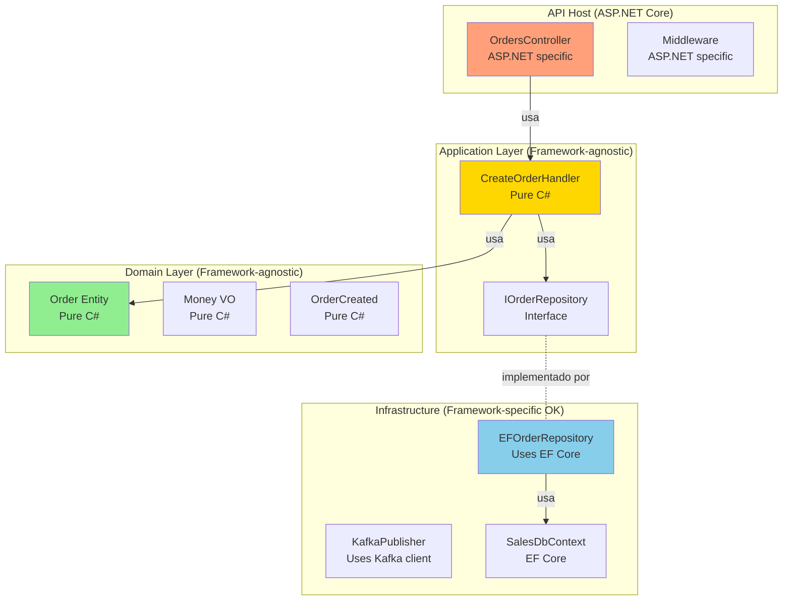

# Framework Independence

## Contexto

Este estándar define **independencia de frameworks**: la lógica de negocio NO debe depender de frameworks específicos (Entity Framework, ASP.NET, MediatR). Complementa el [lineamiento de Arquitectura Limpia](../../lineamientos/arquitectura/11-arquitectura-limpia.md) asegurando **flexibilidad** y **longevidad** del código.

---

## Conceptos Fundamentales

### ¿Qué es Framework Independence?

```yaml
# ✅ Framework Independence = Dominio libre de frameworks externos

Definición: La lógica de negocio no debe acoplarse a frameworks o librerías.
  Los frameworks son DETALLES, la lógica de negocio es POLICY.

Principio (Robert Martin):
  "A good architecture allows major decisions to be deferred.
  The database is a detail. The web is a detail. The framework is a detail."

Impacto:
  ✅ Domain layer: Sin referencias a EF Core, ASP.NET, Kafka, etc.
  ✅ Application layer: Sin referencias directas a frameworks técnicos
  ❌ Infrastructure layer: Puede usar frameworks (está permitido)

Beneficios:
  ✅ Migratable: Cambiar de EF Core a Dapper sin tocar dominio
  ✅ Testeable: Unit tests sin frameworks (0ms por test)
  ✅ Evolutivo: Frameworks cambian, lógica de negocio permanece
  ✅ Portable: Mismo dominio en ASP.NET, Azure Functions, Console App

Frameworks que NO deben estar en Domain:
  ❌ Entity Framework Core (Microsoft.EntityFrameworkCore)
  ❌ ASP.NET Core (Microsoft.AspNetCore.*)
  ❌ MediatR (MediatR)
  ❌ FluentValidation (FluentValidation)
  ❌ AutoMapper (AutoMapper)
  ❌ Kafka (Confluent.Kafka)
  ❌ AWS SDK (AWSSDK.*)
  ✅ Solo .NET BCL (System.*, sin dependencias externas)
```

### Arquitectura con Framework Independence



## Anti-Pattern: Domain Dependiendo de EF Core

```csharp
// ❌ ANTI-PATTERN: Entity con atributos de EF Core

using Microsoft.EntityFrameworkCore;  // ❌ Framework dependency en Domain
using System.ComponentModel.DataAnnotations;  // ❌ Framework dependency

namespace Talma.Sales.Domain.Model
{
    [Table("orders", Schema = "sales")]  // ❌ EF attribute
    public class Order
    {
        [Key]  // ❌ Data Annotations attribute
        [Column("order_id")]  // ❌ EF attribute
        public Guid OrderId { get; set; }

        [Required]  // ❌ Validation attribute
        [StringLength(20)]  // ❌ Data Annotations attribute
        public string Status { get; set; }

        // ❌ Navigation property con atributo EF
        [ForeignKey("CustomerId")]
        public virtual Customer Customer { get; set; }  // ❌ virtual para lazy loading

        // ❌ Collection expuesta directamente (EF modifica)
        public virtual ICollection<OrderLine> Lines { get; set; }  // ❌ virtual
    }
}

// Problemas:
// 1. Order depende de EF Core (no se puede usar sin EF)
// 2. Cambiar a Dapper/MongoDB requiere modificar Order
// 3. Unit tests requieren referenciar EF Core
// 4. No se puede validar invariantes (setters públicos)
// 5. Difícil testear sin base de datos
```

## Pattern Correcto: Domain Limpio

```csharp
// ✅ CORRECTO: Domain sin dependencias de frameworks

namespace Talma.Sales.Domain.Model
{
    // ✅ Entity pura (solo lógica de negocio)
    public class Order : AggregateRoot
    {
        // ✅ Private setters (encapsulación)
        public Guid OrderId { get; private set; }
        public Guid CustomerId { get; private set; }
        public OrderStatus Status { get; private set; }  // ✅ Enum (no string)
        public DateTime OrderDate { get; private set; }

        // ✅ Collection privada (EF no puede modificar)
        private readonly List<OrderLine> _lines = new();
        public IReadOnlyCollection<OrderLine> Lines => _lines.AsReadOnly();

        // ✅ Calculated property (sin columna DB)
        public Money Total => _lines.Aggregate(Money.Zero("USD"), (s, l) => s + l.Subtotal);

        // ✅ Constructor privado (factory pattern)
        private Order() { }

        // ✅ Factory method con validaciones
        public static Order Create(Guid customerId)
        {
            if (customerId == Guid.Empty)
                throw new DomainException("Customer ID is required");

            var order = new Order
            {
                OrderId = Guid.NewGuid(),
                CustomerId = customerId,
                Status = OrderStatus.Draft,
                OrderDate = DateTime.UtcNow
            };

            order.AddDomainEvent(new OrderCreated(order.OrderId, customerId));
            return order;
        }

        // ✅ Behavior con reglas de negocio
        public void Submit()
        {
            // Validaciones de negocio (sin framework)
            if (Status != OrderStatus.Draft)
                throw new InvalidOperationException("Only draft orders can be submitted");

            if (!_lines.Any())
                throw new DomainException("Cannot submit order without lines");

            Status = OrderStatus.Pending;
            AddDomainEvent(new OrderSubmitted(OrderId, Total));
        }

        public void AddLine(Guid productId, int quantity, Money unitPrice)
        {
            if (Status != OrderStatus.Draft)
                throw new InvalidOperationException("Cannot modify non-draft order");

            if (quantity <= 0)
                throw new DomainException("Quantity must be positive");

            var line = OrderLine.Create(Guid.NewGuid(), OrderId, productId, quantity, unitPrice);
            _lines.Add(line);
        }
    }

    // ✅ Enum puro (no strings mágicos)
    public enum OrderStatus
    {
        Draft,
        Pending,
        Approved,
        Rejected,
        Shipped,
        Delivered
    }

    // ✅ Value Object puro (sin framework)
    public record Money(decimal Amount, string Currency)
    {
        public static Money Zero(string currency) => new(0, currency);
        public static Money Dollars(decimal amount) => new(amount, "USD");

        public static Money operator +(Money left, Money right)
        {
            if (left.Currency != right.Currency)
                throw new InvalidOperationException($"Cannot add {left.Currency} and {right.Currency}");
            return new Money(left.Amount + right.Amount, left.Currency);
        }
    }
}

// ✅ Dependencies: SOLO .NET BCL (System.*)
// ✅ Sin referencias a: EF Core, ASP.NET, Kafka, AWS SDK, etc.
```

## Configuración EF en Infrastructure (Separado)

```csharp
// ✅ Configuración EF SOLO en Infrastructure (no en Domain)

using Microsoft.EntityFrameworkCore;  // ✅ Permitido en Infrastructure
using Microsoft.EntityFrameworkCore.Metadata.Builders;

namespace Talma.Sales.Infrastructure.Persistence.Configurations
{
    // ✅ Configuración separada (Fluent API, no attributes)
    public class OrderConfiguration : IEntityTypeConfiguration<Order>
    {
        public void Configure(EntityTypeBuilder<Order> builder)
        {
            // ✅ Table mapping
            builder.ToTable("orders", "sales");
            builder.HasKey(o => o.OrderId);

            // ✅ Property mapping
            builder.Property(o => o.OrderId)
                .HasColumnName("order_id")
                .IsRequired();

            builder.Property(o => o.CustomerId)
                .HasColumnName("customer_id")
                .IsRequired();

            // ✅ Enum mapping (store as string)
            builder.Property(o => o.Status)
                .HasColumnName("status")
                .HasConversion<string>()
                .HasMaxLength(20);

            builder.Property(o => o.OrderDate)
                .HasColumnName("order_date")
                .IsRequired();

            // ✅ Collection mapping (private field)
            builder.OwnsMany(o => o.Lines, lines =>
            {
                lines.ToTable("order_lines", "sales");
                lines.WithOwner().HasForeignKey("OrderId");
                lines.HasKey("LineId");

                lines.Property<Guid>("LineId").HasColumnName("line_id");
                lines.Property<Guid>("ProductId").HasColumnName("product_id");
                lines.Property<int>("Quantity").HasColumnName("quantity");

                // ✅ Money as Owned Type
                lines.OwnsOne<Money>("UnitPrice", price =>
                {
                    price.Property(p => p.Amount)
                        .HasColumnName("unit_price_amount")
                        .HasPrecision(18, 2);
                    price.Property(p => p.Currency)
                        .HasColumnName("unit_price_currency")
                        .HasMaxLength(3);
                });
            });

            // ✅ Ignore calculated property
            builder.Ignore(o => o.Total);

            // ✅ Ignore domain events collection
            builder.Ignore(o => o.DomainEvents);
        }
    }
}

// ✅ DbContext en Infrastructure
namespace Talma.Sales.Infrastructure.Persistence
{
    public class SalesDbContext : DbContext
    {
        public SalesDbContext(DbContextOptions<SalesDbContext> options) : base(options) { }

        public DbSet<Order> Orders => Set<Order>();

        protected override void OnModelCreating(ModelBuilder modelBuilder)
        {
            // ✅ Apply configurations
            modelBuilder.ApplyConfiguration(new OrderConfiguration());
            modelBuilder.ApplyConfiguration(new CustomerConfiguration());
        }
    }
}
```

## Application Layer sin Framework Dependencies

```csharp
// ✅ Application Layer: Sin dependencias de frameworks técnicos

namespace Talma.Sales.Application.UseCases.CreateOrder
{
    // ✅ Use case puro (sin MediatR, sin ASP.NET)
    public class CreateOrderHandler : ICreateOrderUseCase
    {
        // ✅ Solo interfaces (no concrete frameworks)
        private readonly IOrderRepository _orderRepo;
        private readonly IProductServiceClient _productClient;
        private readonly IEventPublisher _eventPublisher;

        public CreateOrderHandler(
            IOrderRepository orderRepo,
            IProductServiceClient productClient,
            IEventPublisher eventPublisher)
        {
            _orderRepo = orderRepo;
            _productClient = productClient;
            _eventPublisher = eventPublisher;
        }

        // ✅ Método simple (no IRequest<T> de MediatR)
        public async Task<Guid> ExecuteAsync(CreateOrderCommand command)
        {
            // Validar productos (via abstracción)
            foreach (var item in command.Items)
            {
                var product = await _productClient.GetProductAsync(item.ProductId);
                if (product == null)
                    throw new DomainException($"Product {item.ProductId} not found");
            }

            // Crear agregado (domain puro)
            var order = Order.Create(command.CustomerId);

            foreach (var item in command.Items)
            {
                var product = await _productClient.GetProductAsync(item.ProductId);
                order.AddLine(item.ProductId, item.Quantity, Money.Dollars(product.Price));
            }

            // Persistir (via abstracción)
            await _orderRepo.SaveAsync(order);

            // Publicar eventos (via abstracción)
            foreach (var evt in order.GetDomainEvents())
            {
                await _eventPublisher.PublishAsync(evt);
            }

            return order.OrderId;
        }
    }

    // ✅ Command DTO puro (sin framework attributes)
    public record CreateOrderCommand(
        Guid CustomerId,
        List<OrderItemDto> Items
    );

    public record OrderItemDto(Guid ProductId, int Quantity);
}

// ❌ Anti-pattern: Con MediatR (crea dependencia innecesaria)
namespace BadExample
{
    // ❌ Command debe heredar de IRequest<T> (MediatR dependency)
    public class CreateOrderCommand : IRequest<Guid>  // ❌ MediatR
    {
        public Guid CustomerId { get; init; }
        public List<OrderItemDto> Items { get; init; }
    }

    // ❌ Handler debe heredar de IRequestHandler<T> (MediatR dependency)
    public class CreateOrderHandler : IRequestHandler<CreateOrderCommand, Guid>  // ❌ MediatR
    {
        public async Task<Guid> Handle(CreateOrderCommand request, CancellationToken cancellationToken)
        {
            // Lógica...
        }
    }

    // Problema: Si migramos de MediatR a otro framework, hay que cambiar Application
}
```

## Testing: Sin Frameworks

```csharp
// ✅ Unit test: Dominio puro sin frameworks

namespace Talma.Sales.Domain.Tests
{
    public class OrderTests
    {
        [Fact]
        public void Create_Should_Generate_OrderId()
        {
            // Arrange
            var customerId = Guid.NewGuid();

            // Act
            var order = Order.Create(customerId);

            // Assert
            Assert.NotEqual(Guid.Empty, order.OrderId);
            Assert.Equal(OrderStatus.Draft, order.Status);
        }

        [Fact]
        public void Submit_Should_Change_Status_To_Pending()
        {
            // Arrange
            var order = Order.Create(Guid.NewGuid());
            order.AddLine(Guid.NewGuid(), 5, Money.Dollars(100));

            // Act
            order.Submit();

            // Assert
            Assert.Equal(OrderStatus.Pending, order.Status);
        }

        [Fact]
        public void Submit_Should_Throw_If_No_Lines()
        {
            // Arrange
            var order = Order.Create(Guid.NewGuid());

            // Act & Assert
            var ex = Assert.Throws<DomainException>(() => order.Submit());
            Assert.Contains("without lines", ex.Message);
        }

        [Fact]
        public void Total_Should_Sum_All_Lines()
        {
            // Arrange
            var order = Order.Create(Guid.NewGuid());
            order.AddLine(Guid.NewGuid(), 5, Money.Dollars(100));   // 500
            order.AddLine(Guid.NewGuid(), 2, Money.Dollars(250));   // 500

            // Act
            var total = order.Total;

            // Assert
            Assert.Equal(Money.Dollars(1000), total);
        }
    }
}

// ✅ Execution: <1ms per test (no DB, no HTTP, no Kafka)
// ✅ Dependencies: Solo xUnit (test framework)
```

## Migración de Frameworks (Ejemplo Real)

```yaml
# ✅ Caso real: Migrar de Entity Framework Core a Dapper

Escenario:
  Sales Service usa EF Core para persistencia.
  Decisión: Migrar a Dapper para mejor performance en queries.

Cambios necesarios:
  1. Crear DapperOrderRepository implementando IOrderRepository
  2. Cambiar DI en Program.cs:
     - ANTES: services.AddScoped<IOrderRepository, EFOrderRepository>()
     - DESPUÉS: services.AddScoped<IOrderRepository, DapperOrderRepository>()
  3. Eliminar SalesDbContext y migraciones EF

Cambios NO necesarios:
  ✅ Domain (Order, OrderLine, Money) - Sin cambios
  ✅ Application (CreateOrderHandler, etc) - Sin cambios
  ✅ API (Controllers) - Sin cambios
  ✅ Tests (OrderTests) - Sin cambios

Tiempo: 2-3 días (solo nuevo adapter)
Riesgo: Bajo (domain y application no tocan)

# ✅ Caso 2: Migrar de ASP.NET Core a Azure Functions

Escenario:
  Sales Service expuesto como REST API (ASP.NET Core).
  Decisión: Migrar a Azure Functions (serverless).

Cambios necesarios:
  1. Crear OrdersFunction con HTTP trigger
  2. Cambiar Program.cs por función FunctionsStartup
  3. Adaptar DI para Azure Functions

Cambios NO necesarios:
  ✅ Domain - Sin cambios
  ✅ Application - Sin cambios (reusar todos los use cases)
  ✅ Infrastructure - Sin cambios (reusar repositories, publishers)

Código reutilizado: ~95% (solo cambió presentation layer)
Tiempo: 1-2 días

# ✅ Caso 3: Agregar gRPC sin tocar REST API

Escenario:
  Sales Service tiene REST API.
  Requisito: Agregar gRPC para comunicación interna (mejor performance).

Cambios necesarios:
  1. Crear OrdersGrpcService (nuevo input adapter)
  2. Configurar gRPC en Program.cs

Cambios NO necesarios:
  ✅ Domain - Sin cambios
  ✅ Application - Sin cambios (reusar mismos use cases)
  ✅ Infrastructure - Sin cambios
  ✅ REST API - Sin cambios (convive con gRPC)

Tiempo: 1 día
Beneficio: Ambos protocols comparten mismo Application layer
```

## Estrategia: Detectar Dependencias Incorrectas

```bash
# ✅ Script para validar que Domain NO depende de frameworks

#!/bin/bash

# Check Domain project dependencies
echo "Checking Domain layer dependencies..."

# Domain should only reference .NET BCL (no external packages)
dotnet list Talma.Sales.Domain/Talma.Sales.Domain.csproj package

# Expected output: (no packages)
# ✅ PASS: No package references found

# ❌ FAIL examples:
# - Microsoft.EntityFrameworkCore (EF Core)
# - Microsoft.AspNetCore.* (ASP.NET)
# - MediatR (MediatR)
# - Confluent.Kafka (Kafka client)

# Check for forbidden using statements in Domain code
echo "Checking for forbidden namespaces in Domain..."

FORBIDDEN_NAMESPACES=(
    "Microsoft.EntityFrameworkCore"
    "Microsoft.AspNetCore"
    "MediatR"
    "Confluent.Kafka"
    "AWSSDK"
    "AutoMapper"
    "FluentValidation"
)

for ns in "${FORBIDDEN_NAMESPACES[@]}"; do
    results=$(grep -r "using $ns" Talma.Sales.Domain/ 2>/dev/null)
    if [ -n "$results" ]; then
        echo "❌ FAIL: Found forbidden namespace '$ns' in Domain layer:"
        echo "$results"
        exit 1
    fi
done

echo "✅ PASS: Domain layer is framework-independent"
```

```csharp
// ✅ Unit test para validar framework independence

public class FrameworkIndependenceTests
{
    [Fact]
    public void Domain_Should_Not_Reference_EntityFramework()
    {
        // Arrange
        var domainAssembly = typeof(Order).Assembly;

        // Act
        var efReferences = domainAssembly.GetReferencedAssemblies()
            .Where(a => a.Name.Contains("EntityFramework"))
            .ToList();

        // Assert
        Assert.Empty(efReferences);
    }

    [Fact]
    public void Domain_Should_Not_Reference_AspNetCore()
    {
        // Arrange
        var domainAssembly = typeof(Order).Assembly;

        // Act
        var aspNetReferences = domainAssembly.GetReferencedAssemblies()
            .Where(a => a.Name.Contains("AspNetCore"))
            .ToList();

        // Assert
        Assert.Empty(aspNetReferences);
    }

    [Fact]
    public void Domain_Should_Only_Reference_Net_Bcl()
    {
        // Arrange
        var domainAssembly = typeof(Order).Assembly;
        var allowedPrefixes = new[] { "System", "netstandard", "mscorlib" };

        // Act
        var externalReferences = domainAssembly.GetReferencedAssemblies()
            .Where(a => !allowedPrefixes.Any(p => a.Name.StartsWith(p)))
            .ToList();

        // Assert
        Assert.Empty(externalReferences);
    }
}
```

---

## Requisitos Técnicos

### MUST (Obligatorio)

- **MUST** mantener Domain layer sin dependencias de frameworks externos
- **MUST** aislar configuración de frameworks en Infrastructure layer
- **MUST** usar Fluent API (no attributes) para configuración de EF
- **MUST** definir abstracciones framework-agnostic en Application
- **MUST** permitir testing de Domain sin frameworks
- **MUST** validar periódicamente que Domain no referencia frameworks

### SHOULD (Fuertemente recomendado)

- **SHOULD** usar interfaces simples en Application (no heredar de frameworks)
- **SHOULD** mantener Application layer con mínimas dependencias técnicas
- **SHOULD** automatizar validación de dependencias en CI/CD
- **SHOULD** documentar frameworks usados por capa

### MAY (Opcional)

- **MAY** usar MediatR en Presentation layer (no en Application)
- **MAY** usar FluentValidation en Presentation (no en Domain)
- **MAY** crear wrappers para frameworks en Infrastructure

### MUST NOT (Prohibido)

- **MUST NOT** usar atributos de EF Core en entidades de Domain
- **MUST NOT** heredar de clases base de frameworks en Domain
- **MUST NOT** exponer tipos de frameworks (DbContext, HttpClient) en Application
- **MUST NOT** referenciar frameworks en Domain project (.csproj)
- **MUST NOT** usar `virtual` para lazy loading en entidades

---

## Referencias

- [Lineamiento: Arquitectura Limpia](../../lineamientos/arquitectura/11-arquitectura-limpia.md)
- Estándares relacionados:
  - [Hexagonal Architecture](./hexagonal-architecture.md)
  - [Dependency Inversion](./dependency-inversion.md)
  - [Layered Architecture](./layered-architecture.md)
  - [Domain Model](./domain-model.md)
- Especificaciones:
  - [Clean Architecture (Robert C. Martin)](https://blog.cleancoder.com/uncle-bob/2012/08/13/the-clean-architecture.html)
  - [The Dependency Rule](https://blog.cleancoder.com/uncle-bob/2012/08/13/the-clean-architecture.html#the-dependency-rule)
  - [EF Core Fluent API](https://docs.microsoft.com/en-us/ef/core/modeling/)
