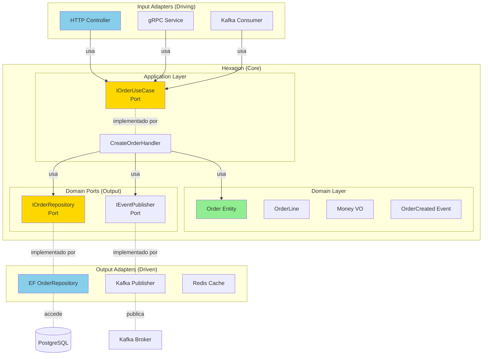

# Hexagonal Architecture (Ports & Adapters)

## Contexto

Este estándar define la **arquitectura hexagonal** (también conocida como Ports & Adapters): un patrón que aísla la lógica de negocio de detalles técnicos mediante interfaces (ports) y implementaciones intercambiables (adapters). Complementa el [lineamiento de Arquitectura Limpia](../../lineamientos/arquitectura/11-arquitectura-limpia.md) asegurando **independencia del dominio**.

---

## Conceptos Fundamentales

### ¿Qué es Arquitectura Hexagonal?

```yaml
# ✅ Hexagonal Architecture = Dominio aislado con Ports & Adapters

Concepto Central:
  La lógica de negocio (dominio) NO depende de detalles técnicos.
  Los detalles técnicos (DB, HTTP, UI) dependen del dominio.

Componentes:
  1. Hexágono (Core): Lógica de negocio pura
     - Entidades, Value Objects, Aggregates
     - Domain Services
     - Domain Events
     - Sin dependencias técnicas (no EF, no ASP.NET)

  2. Ports (Interfaces): Contratos definidos por el dominio
     - Input Ports: Use cases (commands, queries)
     - Output Ports: Abstracciones de infraestructura (repos, clients)

  3. Adapters: Implementaciones técnicas de los ports
     - Input Adapters: HTTP controllers, gRPC services, message consumers
     - Output Adapters: Entity Framework repos, HTTP clients, Kafka producers

Regla de Dependencia:
  ✅ Adapters → Ports (adapters implementan/usan ports)
  ✅ Ports → Domain (ports definen contratos del dominio)
  ❌ Domain → Adapters (NUNCA)
  ❌ Domain → Frameworks (NUNCA)

Beneficios:
  ✅ Testeable: Dominio se prueba sin DB, sin HTTP
  ✅ Flexible: Cambiar de PostgreSQL a MongoDB (solo cambiar adapter)
  ✅ Evolutivo: Agregar REST sin tocar dominio
  ✅ Framework-agnostic: Independiente de ASP.NET, EF, etc
```

### Diagrama Conceptual



## Estructura de Proyecto

```yaml
# ✅ Estructura de proyecto en .NET con Hexagonal Architecture

Talma.Sales/
│
├── Talma.Sales.Domain/              # ✅ Hexágono (Core) - Sin dependencias externas
│   ├── Model/
│   │   ├── Order.cs                 # Aggregate root
│   │   ├── OrderLine.cs             # Entity
│   │   ├── OrderStatus.cs           # Enum
│   │   └── Money.cs                 # Value object
│   ├── Events/
│   │   ├── OrderCreated.cs
│   │   └── OrderApproved.cs
│   ├── Services/
│   │   └── IOrderPricingService.cs  # Domain service interface
│   └── Exceptions/
│       └── DomainException.cs
│
│   # ✅ Sin dependencias: Solo .NET BCL
│
├── Talma.Sales.Application/         # ✅ Application Layer - Ports (Input)
│   ├── UseCases/
│   │   ├── CreateOrder/
│   │   │   ├── ICreateOrderUseCase.cs      # Port (interface)
│   │   │   ├── CreateOrderCommand.cs       # Input DTO
│   │   │   └── CreateOrderHandler.cs       # Use case implementation
│   │   ├── ApproveOrder/
│   │   │   ├── IApproveOrderUseCase.cs
│   │   │   └── ApproveOrderHandler.cs
│   │   └── GetOrder/
│   │       ├── IGetOrderQuery.cs
│   │       └── GetOrderQueryHandler.cs
│   │
│   ├── Ports/                        # ✅ Output Ports (interfaces)
│   │   ├── IOrderRepository.cs      # Port para persistencia
│   │   ├── IEventPublisher.cs       # Port para eventos
│   │   └── IProductServiceClient.cs # Port para integration
│   │
│   └── DTOs/
│       ├── OrderDto.cs
│       └── OrderLineDto.cs
│
│   # Dependencias: Talma.Sales.Domain únicamente
│
├── Talma.Sales.Infrastructure/       # ✅ Output Adapters (Driven)
│   ├── Persistence/
│   │   ├── SalesDbContext.cs        # EF DbContext
│   │   ├── OrderRepository.cs       # Implementa IOrderRepository
│   │   └── Configurations/
│   │       └── OrderConfiguration.cs
│   │
│   ├── Messaging/
│   │   └── KafkaEventPublisher.cs   # Implementa IEventPublisher
│   │
│   ├── ExternalServices/
│   │   └── ProductServiceClient.cs  # Implementa IProductServiceClient
│   │
│   └── Caching/
│       └── RedisCacheAdapter.cs
│
│   # Dependencias: Domain, Application, EF Core, Kafka, HttpClient
│
└── Talma.Sales.Api/                  # ✅ Input Adapter (Driving)
    ├── Controllers/
    │   └── OrdersController.cs      # HTTP adapter
    ├── Consumers/
    │   └── OrderApprovedConsumer.cs # Kafka consumer adapter
    ├── Program.cs                   # Composition root (DI)
    └── appsettings.json

    # Dependencias: Application, Infrastructure, ASP.NET Core
```

## Implementación: Domain Layer

```csharp
// ✅ Domain Layer: Sin dependencias externas

namespace Talma.Sales.Domain.Model
{
    // ✅ Aggregate root puro (sin atributos de EF, sin HTTP)
    public class Order : AggregateRoot
    {
        public Guid OrderId { get; private set; }
        public Guid CustomerId { get; private set; }
        public OrderStatus Status { get; private set; }
        public DateTime OrderDate { get; private set; }

        private readonly List<OrderLine> _lines = new();
        public IReadOnlyCollection<OrderLine> Lines => _lines.AsReadOnly();

        // ✅ Lógica de negocio pura (sin dependencias técnicas)
        public Money Total => _lines.Aggregate(
            Money.Zero("USD"),
            (sum, line) => sum + line.Subtotal);

        private Order() { }

        public static Order Create(Guid customerId)
        {
            var order = new Order
            {
                OrderId = Guid.NewGuid(),
                CustomerId = customerId,
                Status = OrderStatus.Draft,
                OrderDate = DateTime.UtcNow
            };

            order.AddDomainEvent(new OrderCreated(order.OrderId, customerId));
            return order;
        }

        public void Submit()
        {
            if (Status != OrderStatus.Draft)
                throw new InvalidOperationException("Only draft orders can be submitted");

            if (!_lines.Any())
                throw new DomainException("Cannot submit order without lines");

            Status = OrderStatus.Pending;
            AddDomainEvent(new OrderSubmitted(OrderId, CustomerId, Total));
        }

        public void AddLine(Guid productId, int quantity, Money unitPrice)
        {
            if (Status != OrderStatus.Draft)
                throw new InvalidOperationException("Cannot modify submitted order");

            var line = OrderLine.Create(Guid.NewGuid(), OrderId, productId, quantity, unitPrice);
            _lines.Add(line);
        }
    }

    // ✅ Value object puro
    public record Money(decimal Amount, string Currency)
    {
        public static Money Zero(string currency) => new(0, currency);

        public static Money operator +(Money left, Money right)
        {
            if (left.Currency != right.Currency)
                throw new InvalidOperationException("Cannot add different currencies");
            return new Money(left.Amount + right.Amount, left.Currency);
        }

        public static Money operator *(Money money, decimal multiplier) =>
            new Money(money.Amount * multiplier, money.Currency);
    }
}

// ✅ Domain event puro
namespace Talma.Sales.Domain.Events
{
    public record OrderCreated(Guid OrderId, Guid CustomerId) : DomainEvent;
    public record OrderSubmitted(Guid OrderId, Guid CustomerId, Money Total) : DomainEvent;
}
```

## Implementación: Application Layer (Ports)

```csharp
// ✅ Application Layer: Define ports (interfaces)

namespace Talma.Sales.Application.Ports
{
    // ✅ Output Port: Repository (definido por Application, implementado por Infrastructure)
    public interface IOrderRepository
    {
        Task<Order?> GetByIdAsync(Guid orderId);
        Task<IEnumerable<Order>> GetByCustomerAsync(Guid customerId);
        Task SaveAsync(Order order);
    }

    // ✅ Output Port: Event publisher
    public interface IEventPublisher
    {
        Task PublishAsync<T>(T domainEvent) where T : DomainEvent;
        Task PublishBatchAsync(IEnumerable<DomainEvent> events);
    }

    // ✅ Output Port: External service integration
    public interface IProductServiceClient
    {
        Task<ProductDto?> GetProductAsync(Guid productId);
        Task<bool> IsAvailableAsync(Guid productId, int quantity);
    }
}

namespace Talma.Sales.Application.UseCases.CreateOrder
{
    // ✅ Input Port (use case interface)
    public interface ICreateOrderUseCase
    {
        Task<Guid> ExecuteAsync(CreateOrderCommand command);
    }

    // ✅ Input DTO (command)
    public record CreateOrderCommand(
        Guid CustomerId,
        List<OrderItemDto> Items
    );

    public record OrderItemDto(Guid ProductId, int Quantity);

    // ✅ Use case implementation (orquesta dominio usando ports)
    public class CreateOrderHandler : ICreateOrderUseCase
    {
        private readonly IOrderRepository _orderRepo;          // ✅ Output port
        private readonly IProductServiceClient _productClient; // ✅ Output port
        private readonly IEventPublisher _eventPublisher;      // ✅ Output port

        public CreateOrderHandler(
            IOrderRepository orderRepo,
            IProductServiceClient productClient,
            IEventPublisher eventPublisher)
        {
            _orderRepo = orderRepo;
            _productClient = productClient;
            _eventPublisher = eventPublisher;
        }

        public async Task<Guid> ExecuteAsync(CreateOrderCommand command)
        {
            // ✅ 1. Validar con external service (via port)
            foreach (var item in command.Items)
            {
                var product = await _productClient.GetProductAsync(item.ProductId);
                if (product == null)
                    throw new DomainException($"Product {item.ProductId} not found");

                var available = await _productClient.IsAvailableAsync(item.ProductId, item.Quantity);
                if (!available)
                    throw new DomainException($"Product {product.Name} not available");
            }

            // ✅ 2. Crear agregado de dominio (lógica pura)
            var order = Order.Create(command.CustomerId);

            foreach (var item in command.Items)
            {
                var product = await _productClient.GetProductAsync(item.ProductId);
                order.AddLine(item.ProductId, item.Quantity, Money.Dollars(product.Price));
            }

            // ✅ 3. Persistir (via port)
            await _orderRepo.SaveAsync(order);

            // ✅ 4. Publicar eventos (via port)
            var events = order.GetDomainEvents();
            await _eventPublisher.PublishBatchAsync(events);

            return order.OrderId;
        }
    }
}
```

## Implementación: Infrastructure Layer (Adapters)

```csharp
// ✅ Infrastructure: Output adapters (implementan ports)

namespace Talma.Sales.Infrastructure.Persistence
{
    // ✅ Adapter: Implementa IOrderRepository usando Entity Framework
    public class OrderRepository : IOrderRepository
    {
        private readonly SalesDbContext _context;

        public OrderRepository(SalesDbContext context)
        {
            _context = context;
        }

        public async Task<Order?> GetByIdAsync(Guid orderId)
        {
            return await _context.Orders
                .Include(o => o.Lines)  // EF specific
                .FirstOrDefaultAsync(o => o.OrderId == orderId);
        }

        public async Task<IEnumerable<Order>> GetByCustomerAsync(Guid customerId)
        {
            return await _context.Orders
                .Include(o => o.Lines)
                .Where(o => o.CustomerId == customerId)
                .ToListAsync();
        }

        public async Task SaveAsync(Order order)
        {
            if (_context.Entry(order).State == EntityState.Detached)
            {
                _context.Orders.Add(order);
            }

            await _context.SaveChangesAsync();
        }
    }

    // ✅ Configuración EF (detalles técnicos aislados)
    public class OrderConfiguration : IEntityTypeConfiguration<Order>
    {
        public void Configure(EntityTypeBuilder<Order> builder)
        {
            builder.ToTable("orders", "sales");
            builder.HasKey(o => o.OrderId);

            builder.OwnsMany(o => o.Lines, lines =>
            {
                lines.ToTable("order_lines", "sales");
                lines.HasKey(l => l.LineId);
            });

            builder.Ignore(o => o.Total); // Calculado, no persistido
        }
    }
}

namespace Talma.Sales.Infrastructure.Messaging
{
    // ✅ Adapter: Implementa IEventPublisher usando Kafka
    public class KafkaEventPublisher : IEventPublisher
    {
        private readonly IProducer<string, string> _producer;
        private readonly ILogger<KafkaEventPublisher> _logger;

        public KafkaEventPublisher(IProducer<string, string> producer, ILogger<KafkaEventPublisher> logger)
        {
            _producer = producer;
            _logger = logger;
        }

        public async Task PublishAsync<T>(T domainEvent) where T : DomainEvent
        {
            var topic = $"sales.{typeof(T).Name.ToLowerInvariant()}";
            var message = JsonSerializer.Serialize(domainEvent);

            var result = await _producer.ProduceAsync(topic, new Message<string, string>
            {
                Key = domainEvent.AggregateId.ToString(),
                Value = message
            });

            _logger.LogInformation("Published {EventType} to {Topic}", typeof(T).Name, topic);
        }

        public async Task PublishBatchAsync(IEnumerable<DomainEvent> events)
        {
            foreach (var evt in events)
            {
                await PublishAsync(evt);
            }
        }
    }
}

namespace Talma.Sales.Infrastructure.ExternalServices
{
    // ✅ Adapter: Implementa IProductServiceClient usando HTTP
    public class ProductServiceClient : IProductServiceClient
    {
        private readonly HttpClient _httpClient;

        public ProductServiceClient(HttpClient httpClient)
        {
            _httpClient = httpClient;
        }

        public async Task<ProductDto?> GetProductAsync(Guid productId)
        {
            var response = await _httpClient.GetAsync($"/api/v1/products/{productId}");
            if (!response.IsSuccessStatusCode) return null;

            return await response.Content.ReadFromJsonAsync<ProductDto>();
        }

        public async Task<bool> IsAvailableAsync(Guid productId, int quantity)
        {
            var response = await _httpClient.GetAsync($"/api/v1/products/{productId}/availability?quantity={quantity}");
            return response.IsSuccessStatusCode;
        }
    }
}
```

## Implementación: API Layer (Input Adapter)

```csharp
// ✅ API: Input adapter (HTTP controller)

namespace Talma.Sales.Api.Controllers
{
    [ApiController]
    [Route("api/v1/orders")]
    public class OrdersController : ControllerBase
    {
        private readonly ICreateOrderUseCase _createOrderUseCase;  // ✅ Usa port
        private readonly IGetOrderQuery _getOrderQuery;            // ✅ Usa port

        public OrdersController(
            ICreateOrderUseCase createOrderUseCase,
            IGetOrderQuery getOrderQuery)
        {
            _createOrderUseCase = createOrderUseCase;
            _getOrderQuery = getOrderQuery;
        }

        // ✅ Controller solo traduce HTTP → Use Case
        [HttpPost]
        public async Task<IActionResult> CreateOrder(CreateOrderRequest request)
        {
            try
            {
                var command = new CreateOrderCommand(
                    request.CustomerId,
                    request.Items.Select(i => new OrderItemDto(i.ProductId, i.Quantity)).ToList()
                );

                var orderId = await _createOrderUseCase.ExecuteAsync(command);

                return CreatedAtAction(nameof(GetOrder), new { id = orderId }, new { orderId });
            }
            catch (DomainException ex)
            {
                return BadRequest(new { error = ex.Message });
            }
        }

        [HttpGet("{id}")]
        public async Task<IActionResult> GetOrder(Guid id)
        {
            var order = await _getOrderQuery.ExecuteAsync(id);
            if (order == null) return NotFound();

            return Ok(order);
        }
    }

    // ✅ HTTP-specific DTOs (no contamina Application layer)
    public record CreateOrderRequest(
        Guid CustomerId,
        List<CreateOrderItemRequest> Items
    );

    public record CreateOrderItemRequest(Guid ProductId, int Quantity);
}
```

## Dependency Injection (Composition Root)

```csharp
// ✅ Program.cs: Wire adapters to ports

var builder = WebApplication.CreateBuilder(args);

// ✅ Register Application layer (use cases)
builder.Services.AddScoped<ICreateOrderUseCase, CreateOrderHandler>();
builder.Services.AddScoped<IApproveOrderUseCase, ApproveOrderHandler>();
builder.Services.AddScoped<IGetOrderQuery, GetOrderQueryHandler>();

// ✅ Register Output Adapters (implementations of ports)
builder.Services.AddScoped<IOrderRepository, OrderRepository>();
builder.Services.AddScoped<IEventPublisher, KafkaEventPublisher>();
builder.Services.AddHttpClient<IProductServiceClient, ProductServiceClient>(client =>
{
    client.BaseAddress = new Uri(builder.Configuration["Services:CatalogApi"]);
});

// ✅ Register Infrastructure services
builder.Services.AddDbContext<SalesDbContext>(options =>
    options.UseNpgsql(builder.Configuration.GetConnectionString("SalesDb")));

builder.Services.AddSingleton<IProducer<string, string>>(sp =>
{
    var config = new ProducerConfig
    {
        BootstrapServers = builder.Configuration["Kafka:BootstrapServers"]
    };
    return new ProducerBuilder<string, string>(config).Build();
});

var app = builder.Build();
app.MapControllers();
app.Run();
```

## Testing: Dominio Aislado

```csharp
// ✅ Unit tests: Dominio sin dependencias externas

public class OrderTests
{
    [Fact]
    public void Create_Should_Set_Draft_Status()
    {
        // Arrange
        var customerId = Guid.NewGuid();

        // Act
        var order = Order.Create(customerId);

        // Assert
        Assert.Equal(OrderStatus.Draft, order.Status);
        Assert.Equal(customerId, order.CustomerId);
    }

    [Fact]
    public void Submit_Should_Fail_If_No_Lines()
    {
        // Arrange
        var order = Order.Create(Guid.NewGuid());

        // Act & Assert
        var ex = Assert.Throws<DomainException>(() => order.Submit());
        Assert.Contains("without lines", ex.Message);
    }

    [Fact]
    public void AddLine_Should_Increase_Total()
    {
        // Arrange
        var order = Order.Create(Guid.NewGuid());

        // Act
        order.AddLine(Guid.NewGuid(), 5, Money.Dollars(100));
        order.AddLine(Guid.NewGuid(), 2, Money.Dollars(50));

        // Assert
        Assert.Equal(Money.Dollars(600), order.Total); // 5*100 + 2*50
    }
}

// ✅ Integration test: Use case con mocks de ports

public class CreateOrderHandlerTests
{
    [Fact]
    public async Task Should_Create_Order_And_Publish_Event()
    {
        // Arrange: Mock output ports
        var orderRepo = new Mock<IOrderRepository>();
        var productClient = new Mock<IProductServiceClient>();
        var eventPublisher = new Mock<IEventPublisher>();

        productClient.Setup(x => x.GetProductAsync(It.IsAny<Guid>()))
            .ReturnsAsync(new ProductDto { ProductId = Guid.NewGuid(), Name = "Product", Price = 100 });
        productClient.Setup(x => x.IsAvailableAsync(It.IsAny<Guid>(), It.IsAny<int>()))
            .ReturnsAsync(true);

        var handler = new CreateOrderHandler(orderRepo.Object, productClient.Object, eventPublisher.Object);
        var command = new CreateOrderCommand(Guid.NewGuid(), new List<OrderItemDto>
        {
            new(Guid.NewGuid(), 5)
        });

        // Act
        var orderId = await handler.ExecuteAsync(command);

        // Assert
        Assert.NotEqual(Guid.Empty, orderId);
        orderRepo.Verify(x => x.SaveAsync(It.IsAny<Order>()), Times.Once);
        eventPublisher.Verify(x => x.PublishBatchAsync(It.IsAny<IEnumerable<DomainEvent>>()), Times.Once);
    }
}
```

## Beneficios en Práctica

```yaml
# ✅ Casos de uso reales en Talma

Caso 1: Migrar de PostgreSQL a MongoDB
  Cambio necesario: Solo OrderRepository adapter
  Cambios NO necesarios:
    ✅ Domain (Order, OrderLine) - Sin cambios
    ✅ Application (CreateOrderHandler) - Sin cambios
    ✅ API (OrdersController) - Sin cambios

  Tiempo: 1-2 días (solo adapter nuevo)

Caso 2: Agregar gRPC además de REST
  Cambio necesario: Nuevo input adapter (gRPC service)
  Cambios NO necesarios:
    ✅ Domain - Sin cambios
    ✅ Application - Sin cambios (reusa mismos use cases)
    ✅ Infrastructure - Sin cambios

  Tiempo: 1 día (solo adapter gRPC)

Caso 3: Cambiar de Kafka a AWS SNS/SQS
  Cambio necesario: Solo KafkaEventPublisher → SnsEventPublisher
  Cambios NO necesarios:
    ✅ Domain - Sin cambios
    ✅ Application - Sin cambios (usa IEventPublisher)
    ✅ Resto de Infrastructure - Sin cambios

  Tiempo: 1 día (solo adapter SNS)

Caso 4: Unit testing de reglas de negocio
  ✅ Test Order.Submit() SIN base de datos
  ✅ Test Order.AddLine() SIN HTTP
  ✅ Test Money calculations SIN infraestructura
  ✅ Fast tests (<1ms cada uno)

  Coverage: 90%+ en Domain layer

Caso 5: Migrar de ASP.NET Core a Azure Functions
  Cambio necesario: Nuevo input adapter (Function trigger)
  Cambios NO necesarios:
    ✅ Domain, Application, Infrastructure - Reusar completo

  Tiempo: 2-3 días
```

---

## Requisitos Técnicos

### MUST (Obligatorio)

- **MUST** aislar dominio en proyecto separado sin dependencias externas
- **MUST** definir ports (interfaces) en Application layer
- **MUST** implementar adapters en Infrastructure layer
- **MUST** usar dependency injection para conectar ports y adapters
- **MUST** hacer que adapters dependan de ports (no al revés)
- **MUST** testear dominio sin infraestructura (unit tests puros)
- **MUST** mantener lógica de negocio en Domain, no en adapters

### SHOULD (Fuertemente recomendado)

- **SHOULD** organizar proyecto en 4 capas: Domain, Application, Infrastructure, API
- **SHOULD** usar DTOs diferentes en cada boundary (HTTP, Application, Domain)
- **SHOULD** implementar use cases en Application layer
- **SHOULD** configurar DI en composition root (Program.cs)
- **SHOULD** usar mocks de ports en integration tests

### MAY (Opcional)

- **MAY** usar CQRS (separar commands y queries)
- **MAY** usar MediatR para dispatching de use cases
- **MAY** crear multiple input adapters (REST, gRPC, Kafka consumer)

### MUST NOT (Prohibido)

- **MUST NOT** referenciar Infrastructure desde Domain
- **MUST NOT** referenciar API desde Domain o Application
- **MUST NOT** poner lógica de negocio en controllers o adapters
- **MUST NOT** usar Entity Framework attributes en entidades de dominio
- **MUST NOT** exponer detalles técnicos (DbContext, HttpClient) en Application layer
- **MUST NOT** hacer que Domain dependa de frameworks (EF, ASP.NET)

---

## Referencias

- [Lineamiento: Arquitectura Limpia](../../lineamientos/arquitectura/11-arquitectura-limpia.md)
- Estándares relacionados:
  - [Dependency Inversion Principle](./dependency-inversion.md)
  - [Layered Architecture](./layered-architecture.md)
  - [Framework Independence](./framework-independence.md)
  - [Domain Model](./domain-model.md)
- Especificaciones:
  - [Hexagonal Architecture (Alistair Cockburn)](https://alistair.cockburn.us/hexagonal-architecture/)
  - [Clean Architecture (Robert C. Martin)](https://blog.cleancoder.com/uncle-bob/2012/08/13/the-clean-architecture.html)
  - [.NET Microservices Architecture Guidance](https://docs.microsoft.com/en-us/dotnet/architecture/microservices/)
