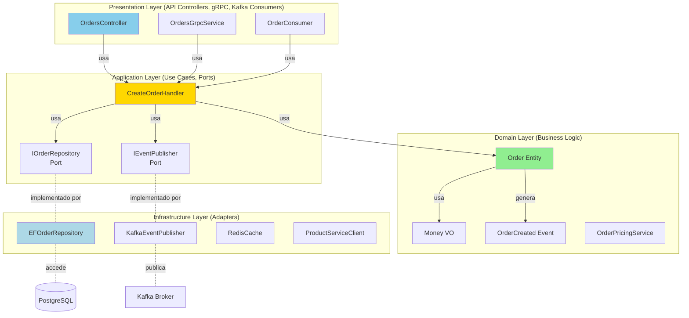

# Layered Architecture

## Contexto

Este estándar define **arquitectura en capas**: organizar código en capas lógicas con responsabilidades claras y dependencias unidireccionales. Complementa el [lineamiento de Arquitectura Limpia](../../lineamientos/arquitectura/11-arquitectura-limpia.md) asegurando **separación de concerns** y **mantenibilidad**.

---

## Conceptos Fundamentales

### ¿Qué es Layered Architecture?

```yaml
# ✅ Layered Architecture = Separación de responsabilidades en capas horizontales

Definición: Organizar código en capas con responsabilidades específicas.
  Cada capa solo depende de capas inferiores (dependencia unidireccional).

Capas Clásicas (4 layers):
  1. Presentation Layer (UI):
    - Controllers, Views, DTOs de API
    - Valida input, formatea output

  2. Application Layer (Use Cases):
    - Orquestación de casos de uso
    - Coordina dominio y servicios externos
    - Transaction boundaries

  3. Domain Layer (Business Logic):
    - Entidades, Value Objects, Aggregates
    - Reglas de negocio
    - Domain Services
    - Sin dependencias técnicas

  4. Infrastructure Layer (Technical Details):
    - Persistencia (EF, Dapper, MongoDB)
    - Messaging (Kafka, RabbitMQ)
    - External services (HTTP clients)
    - Frameworks y librerías

Regla de Dependencia: Presentation → Application → Domain
  ↑ implements
  Infrastructure

  ✅ Application puede usar Domain
  ✅ Infrastructure implementa interfaces de Application
  ❌ Domain NO puede usar Application o Infrastructure
  ❌ Application NO puede referenciar Infrastructure directamente

Variante: Clean Architecture (Robert Martin)
  - Domain en el centro (sin dependencias)
  - Application alrededor de Domain
  - Infrastructure en el borde (implementa Application abstractions)
  - Presentación en el borde (usa Application)
```

### Diagrama de Capas



## Estructura de Proyecto en .NET

```yaml
# ✅ Estructura de carpetas por capas

Talma.Sales/
│
├── Talma.Sales.Domain/                    # ✅ CAPA 1: Domain Layer
│   ├── Model/                             # Entidades y Value Objects
│   │   ├── Order.cs                       # Aggregate root
│   │   ├── OrderLine.cs                   # Entity
│   │   ├── Money.cs                       # Value object
│   │   └── OrderStatus.cs                 # Enum
│   │
│   ├── Events/                            # Domain events
│   │   ├── OrderCreated.cs
│   │   ├── OrderSubmitted.cs
│   │   └── OrderApproved.cs
│   │
│   ├── Services/                          # Domain services
│   │   ├── IOrderPricingService.cs
│   │   └── OrderPricingService.cs
│   │
│   ├── Specifications/                    # Business rules
│   │   └── OrderRequiresApprovalSpec.cs
│   │
│   └── Exceptions/
│       └── DomainException.cs
│
│   # Dependencies: NONE (solo .NET BCL)
│   # Responsabilidad: Reglas de negocio puras
│
├── Talma.Sales.Application/               # ✅ CAPA 2: Application Layer
│   ├── UseCases/                          # Casos de uso
│   │   ├── CreateOrder/
│   │   │   ├── ICreateOrderUseCase.cs
│   │   │   ├── CreateOrderCommand.cs
│   │   │   └── CreateOrderHandler.cs
│   │   ├── ApproveOrder/
│   │   │   ├── IApproveOrderUseCase.cs
│   │   │   ├── ApproveOrderCommand.cs
│   │   │   └── ApproveOrderHandler.cs
│   │   └── GetOrder/
│   │       ├── IGetOrderQuery.cs
│   │       └── GetOrderQueryHandler.cs
│   │
│   ├── Ports/                             # Abstracciones (Output Ports)
│   │   ├── IOrderRepository.cs
│   │   ├── IEventPublisher.cs
│   │   └── IProductServiceClient.cs
│   │
│   ├── DTOs/                              # Data Transfer Objects
│   │   ├── OrderDto.cs
│   │   └── OrderLineDto.cs
│   │
│   └── Behaviors/                         # Cross-cutting (MediatR)
│       ├── LoggingBehavior.cs
│       └── ValidationBehavior.cs
│
│   # Dependencies: Talma.Sales.Domain
│   # Responsabilidad: Orquestación de casos de uso
│
├── Talma.Sales.Infrastructure/            # ✅ CAPA 3: Infrastructure Layer
│   ├── Persistence/                       # Database adapters
│   │   ├── SalesDbContext.cs
│   │   ├── OrderRepository.cs             # Implementa IOrderRepository
│   │   └── Configurations/
│   │       ├── OrderConfiguration.cs
│   │       └── OrderLineConfiguration.cs
│   │
│   ├── Messaging/                         # Event adapters
│   │   ├── KafkaEventPublisher.cs         # Implementa IEventPublisher
│   │   └── OrderEventConsumer.cs
│   │
│   ├── ExternalServices/                  # HTTP client adapters
│   │   └── ProductServiceClient.cs        # Implementa IProductServiceClient
│   │
│   ├── Caching/                           # Cache adapters
│   │   └── RedisCacheService.cs
│   │
│   └── Migrations/                        # EF migrations
│       └── 20240101_InitialCreate.cs
│
│   # Dependencies: Domain, Application, EF Core, Kafka, Redis, AWS SDK
│   # Responsabilidad: Detalles técnicos (DB, HTTP, Kafka)
│
└── Talma.Sales.Api/                       # ✅ CAPA 4: Presentation Layer
    ├── Controllers/                       # HTTP endpoints
    │   └── OrdersController.cs
    │
    ├── Consumers/                         # Kafka consumers
    │   └── OrderApprovedConsumer.cs
    │
    ├── Middleware/                        # HTTP middleware
    │   ├── ExceptionMiddleware.cs
    │   └── CorrelationIdMiddleware.cs
    │
    ├── Validators/                        # Input validation (FluentValidation)
    │   └── CreateOrderRequestValidator.cs
    │
    ├── Models/                            # HTTP-specific DTOs
    │   ├── CreateOrderRequest.cs
    │   └── OrderResponse.cs
    │
    ├── Program.cs                         # Composition root (DI)
    └── appsettings.json

    # Dependencies: Application, Infrastructure, ASP.NET Core
    # Responsabilidad: Exponer APIs (HTTP, gRPC, Kafka consumer)
```

## Implementación: Domain Layer (Capa más interna)

```csharp
// ✅ DOMAIN LAYER: Sin dependencias externas

namespace Talma.Sales.Domain.Model
{
    // ✅ Aggregate root con lógica de negocio pura
    public class Order : AggregateRoot
    {
        public Guid OrderId { get; private set; }
        public Guid CustomerId { get; private set; }
        public OrderStatus Status { get; private set; }
        public DateTime OrderDate { get; private set; }

        private readonly List<OrderLine> _lines = new();
        public IReadOnlyCollection<OrderLine> Lines => _lines.AsReadOnly();

        // ✅ Lógica de negocio: Calculated property
        public Money Total => _lines.Aggregate(
            Money.Zero("USD"),
            (sum, line) => sum + line.Subtotal);

        private Order() { }

        // ✅ Factory method con validaciones
        public static Order Create(Guid customerId)
        {
            if (customerId == Guid.Empty)
                throw new DomainException("Customer ID is required");

            var order = new Order
            {
                OrderId = Guid.NewGuid(),
                CustomerId = customerId,
                Status = OrderStatus.Draft,
                OrderDate = DateTime.UtcNow
            };

            order.AddDomainEvent(new OrderCreated(order.OrderId, customerId));
            return order;
        }

        // ✅ Behavior con reglas de negocio
        public void Submit()
        {
            if (Status != OrderStatus.Draft)
                throw new InvalidOperationException("Only draft orders can be submitted");

            if (!_lines.Any())
                throw new DomainException("Cannot submit order without lines");

            if (Total.Amount <= 0)
                throw new DomainException("Order total must be greater than zero");

            Status = OrderStatus.Pending;
            AddDomainEvent(new OrderSubmitted(OrderId, CustomerId, Total));
        }

        public void Approve(string approvedBy)
        {
            if (Status != OrderStatus.Pending)
                throw new InvalidOperationException("Only pending orders can be approved");

            Status = OrderStatus.Approved;
            AddDomainEvent(new OrderApproved(OrderId, approvedBy, DateTime.UtcNow));
        }

        public void AddLine(Guid productId, int quantity, Money unitPrice)
        {
            if (Status != OrderStatus.Draft)
                throw new InvalidOperationException("Cannot modify non-draft order");

            if (quantity <= 0)
                throw new DomainException("Quantity must be positive");

            if (unitPrice.Amount <= 0)
                throw new DomainException("Unit price must be positive");

            var line = OrderLine.Create(Guid.NewGuid(), OrderId, productId, quantity, unitPrice);
            _lines.Add(line);
        }
    }

    // ✅ Value object puro
    public record Money(decimal Amount, string Currency)
    {
        public static Money Zero(string currency) => new(0, currency);
        public static Money Dollars(decimal amount) => new(amount, "USD");

        public static Money operator +(Money left, Money right)
        {
            if (left.Currency != right.Currency)
                throw new InvalidOperationException($"Cannot add {left.Currency} and {right.Currency}");
            return new Money(left.Amount + right.Amount, left.Currency);
        }
    }
}

// ✅ Domain Service (lógica que involucra múltiples entidades)
namespace Talma.Sales.Domain.Services
{
    public class OrderPricingService : IOrderPricingService
    {
        public Money CalculateDiscount(Order order, Customer customer)
        {
            // ✅ Lógica de negocio pura (sin dependencias técnicas)
            if (customer.IsVip && order.Total.Amount > 1000)
            {
                return Money.Dollars(order.Total.Amount * 0.10m); // 10% descuento VIP
            }

            if (order.Lines.Count >= 10)
            {
                return Money.Dollars(order.Total.Amount * 0.05m); // 5% bulk discount
            }

            return Money.Zero("USD");
        }
    }
}
```

## Implementación: Application Layer (Casos de Uso)

```csharp
// ✅ APPLICATION LAYER: Orquesta dominio usando ports

namespace Talma.Sales.Application.UseCases.CreateOrder
{
    // ✅ Use case handler (orquestación)
    public class CreateOrderHandler : ICreateOrderUseCase
    {
        private readonly IOrderRepository _orderRepo;           // Port
        private readonly IProductServiceClient _productClient;  // Port
        private readonly IEventPublisher _eventPublisher;       // Port
        private readonly ILogger<CreateOrderHandler> _logger;

        public CreateOrderHandler(
            IOrderRepository orderRepo,
            IProductServiceClient productClient,
            IEventPublisher eventPublisher,
            ILogger<CreateOrderHandler> logger)
        {
            _orderRepo = orderRepo;
            _productClient = productClient;
            _eventPublisher = eventPublisher;
            _logger = logger;
        }

        public async Task<Guid> ExecuteAsync(CreateOrderCommand command)
        {
            _logger.LogInformation("Creating order for customer {CustomerId}", command.CustomerId);

            // ✅ 1. Validar con servicio externo (via port)
            foreach (var item in command.Items)
            {
                var product = await _productClient.GetProductAsync(item.ProductId);
                if (product == null)
                    throw new DomainException($"Product {item.ProductId} not found");

                var available = await _productClient.IsAvailableAsync(item.ProductId, item.Quantity);
                if (!available)
                    throw new DomainException($"Insufficient stock for {product.Name}");
            }

            // ✅ 2. Crear agregado (lógica de dominio)
            var order = Order.Create(command.CustomerId);

            foreach (var item in command.Items)
            {
                var product = await _productClient.GetProductAsync(item.ProductId);
                order.AddLine(item.ProductId, item.Quantity, Money.Dollars(product.Price));
            }

            // ✅ 3. Persistir (via port)
            await _orderRepo.SaveAsync(order);

            _logger.LogInformation("Order {OrderId} created successfully", order.OrderId);

            // ✅ 4. Publicar eventos (via port)
            var events = order.GetDomainEvents();
            foreach (var evt in events)
            {
                await _eventPublisher.PublishAsync(evt);
            }

            return order.OrderId;
        }
    }

    // ✅ Command (Input DTO)
    public record CreateOrderCommand(
        Guid CustomerId,
        List<OrderItemDto> Items
    );

    public record OrderItemDto(Guid ProductId, int Quantity);
}

// ✅ Port (abstracción definida por Application)
namespace Talma.Sales.Application.Ports
{
    public interface IOrderRepository
    {
        Task<Order?> GetByIdAsync(Guid orderId);
        Task<List<Order>> GetByCustomerAsync(Guid customerId);
        Task SaveAsync(Order order);
    }

    public interface IEventPublisher
    {
        Task PublishAsync<T>(T domainEvent) where T : DomainEvent;
    }

    public interface IProductServiceClient
    {
        Task<ProductDto?> GetProductAsync(Guid productId);
        Task<bool> IsAvailableAsync(Guid productId, int quantity);
    }
}
```

## Implementación: Infrastructure Layer (Adapters)

```csharp
// ✅ INFRASTRUCTURE LAYER: Implementa abstracciones de Application

namespace Talma.Sales.Infrastructure.Persistence
{
    // ✅ Adapter: EF Repository (implementa IOrderRepository)
    public class OrderRepository : IOrderRepository
    {
        private readonly SalesDbContext _context;

        public OrderRepository(SalesDbContext context)
        {
            _context = context;
        }

        public async Task<Order?> GetByIdAsync(Guid orderId)
        {
            return await _context.Orders
                .Include(o => o.Lines)          // EF specific
                .AsSplitQuery()                  // EF optimization
                .FirstOrDefaultAsync(o => o.OrderId == orderId);
        }

        public async Task<List<Order>> GetByCustomerAsync(Guid customerId)
        {
            return await _context.Orders
                .Include(o => o.Lines)
                .Where(o => o.CustomerId == customerId)
                .OrderByDescending(o => o.OrderDate)
                .ToListAsync();
        }

        public async Task SaveAsync(Order order)
        {
            if (_context.Entry(order).State == EntityState.Detached)
            {
                _context.Orders.Add(order);
            }
            else
            {
                _context.Orders.Update(order);
            }

            await _context.SaveChangesAsync();
        }
    }

    // ✅ Configuración EF (detalles técnicos)
    public class OrderConfiguration : IEntityTypeConfiguration<Order>
    {
        public void Configure(EntityTypeBuilder<Order> builder)
        {
            builder.ToTable("orders", "sales");
            builder.HasKey(o => o.OrderId);

            builder.Property(o => o.Status)
                .HasConversion<string>()
                .HasMaxLength(20);

            builder.OwnsMany(o => o.Lines, lines =>
            {
                lines.ToTable("order_lines", "sales");
                lines.HasKey(l => l.LineId);
                lines.Property(l => l.Quantity).IsRequired();

                // Money as Owned Type
                lines.OwnsOne(l => l.UnitPrice, price =>
                {
                    price.Property(p => p.Amount).HasColumnName("unit_price_amount").HasPrecision(18, 2);
                    price.Property(p => p.Currency).HasColumnName("unit_price_currency").HasMaxLength(3);
                });
            });

            builder.Ignore(o => o.Total); // Calculated, not persisted
        }
    }
}

namespace Talma.Sales.Infrastructure.Messaging
{
    // ✅ Adapter: Kafka Publisher (implementa IEventPublisher)
    public class KafkaEventPublisher : IEventPublisher
    {
        private readonly IProducer<string, string> _producer;
        private readonly ILogger<KafkaEventPublisher> _logger;

        public KafkaEventPublisher(IProducer<string, string> producer, ILogger<KafkaEventPublisher> logger)
        {
            _producer = producer;
            _logger = logger;
        }

        public async Task PublishAsync<T>(T domainEvent) where T : DomainEvent
        {
            var topic = $"sales.{typeof(T).Name.ToLowerInvariant()}";
            var message = JsonSerializer.Serialize(domainEvent);

            var result = await _producer.ProduceAsync(topic, new Message<string, string>
            {
                Key = domainEvent.AggregateId.ToString(),
                Value = message
            });

            _logger.LogInformation("Published {EventType} to {Topic} at offset {Offset}",
                typeof(T).Name, topic, result.Offset);
        }
    }
}

namespace Talma.Sales.Infrastructure.ExternalServices
{
    // ✅ Adapter: HTTP Client (implementa IProductServiceClient)
    public class ProductServiceClient : IProductServiceClient
    {
        private readonly HttpClient _httpClient;
        private readonly ILogger<ProductServiceClient> _logger;

        public ProductServiceClient(HttpClient httpClient, ILogger<ProductServiceClient> logger)
        {
            _httpClient = httpClient;
            _logger = logger;
        }

        public async Task<ProductDto?> GetProductAsync(Guid productId)
        {
            try
            {
                var response = await _httpClient.GetAsync($"/api/v1/products/{productId}");
                if (!response.IsSuccessStatusCode)
                {
                    _logger.LogWarning("Product {ProductId} not found", productId);
                    return null;
                }

                return await response.Content.ReadFromJsonAsync<ProductDto>();
            }
            catch (HttpRequestException ex)
            {
                _logger.LogError(ex, "Error calling Product Service for {ProductId}", productId);
                throw;
            }
        }

        public async Task<bool> IsAvailableAsync(Guid productId, int quantity)
        {
            var response = await _httpClient.GetAsync($"/api/v1/products/{productId}/availability?quantity={quantity}");
            return response.IsSuccessStatusCode;
        }
    }
}
```

## Implementación: Presentation Layer (API)

```csharp
// ✅ PRESENTATION LAYER: HTTP endpoints (usa Application)

namespace Talma.Sales.Api.Controllers
{
    [ApiController]
    [Route("api/v1/orders")]
    public class OrdersController : ControllerBase
    {
        private readonly ICreateOrderUseCase _createOrderUseCase;  // Application port
        private readonly IGetOrderQuery _getOrderQuery;            // Application port
        private readonly ILogger<OrdersController> _logger;

        public OrdersController(
            ICreateOrderUseCase createOrderUseCase,
            IGetOrderQuery getOrderQuery,
            ILogger<OrdersController> logger)
        {
            _createOrderUseCase = createOrderUseCase;
            _getOrderQuery = getOrderQuery;
            _logger = logger;
        }

        // ✅ Controller solo traduce HTTP → Application
        [HttpPost]
        [ProducesResponseType(StatusCodes.Status201Created)]
        [ProducesResponseType(StatusCodes.Status400BadRequest)]
        public async Task<IActionResult> CreateOrder([FromBody] CreateOrderRequest request)
        {
            try
            {
                // ✅ Traducir HTTP DTO → Application Command
                var command = new CreateOrderCommand(
                    request.CustomerId,
                    request.Items.Select(i => new OrderItemDto(i.ProductId, i.Quantity)).ToList()
                );

                var orderId = await _createOrderUseCase.ExecuteAsync(command);

                _logger.LogInformation("Order {OrderId} created via API", orderId);

                return CreatedAtAction(nameof(GetOrder), new { id = orderId }, new { orderId });
            }
            catch (DomainException ex)
            {
                _logger.LogWarning(ex, "Domain validation error creating order");
                return BadRequest(new { error = ex.Message });
            }
        }

        [HttpGet("{id}")]
        [ProducesResponseType(StatusCodes.Status200OK)]
        [ProducesResponseType(StatusCodes.Status404NotFound)]
        public async Task<IActionResult> GetOrder(Guid id)
        {
            var order = await _getOrderQuery.ExecuteAsync(id);
            if (order == null)
            {
                return NotFound();
            }

            // ✅ Traducir Application DTO → HTTP Response
            var response = new OrderResponse(
                order.OrderId,
                order.CustomerId,
                order.Status.ToString(),
                order.Total,
                order.Lines.Select(l => new OrderLineResponse(l.ProductId, l.Quantity, l.Subtotal)).ToList()
            );

            return Ok(response);
        }
    }

    // ✅ HTTP-specific DTOs (no contamina Application)
    public record CreateOrderRequest(
        Guid CustomerId,
        List<CreateOrderItemRequest> Items
    );

    public record CreateOrderItemRequest(Guid ProductId, int Quantity);

    public record OrderResponse(
        Guid OrderId,
        Guid CustomerId,
        string Status,
        decimal Total,
        List<OrderLineResponse> Lines
    );

    public record OrderLineResponse(Guid ProductId, int Quantity, decimal Subtotal);
}
```

## Dependency Injection (Composition Root)

```csharp
// ✅ Program.cs: Wire layers

var builder = WebApplication.CreateBuilder(args);

// ✅ Register Application layer (use cases)
builder.Services.AddScoped<ICreateOrderUseCase, CreateOrderHandler>();
builder.Services.AddScoped<IApproveOrderUseCase, ApproveOrderHandler>();
builder.Services.AddScoped<IGetOrderQuery, GetOrderQueryHandler>();

// ✅ Register Domain services
builder.Services.AddScoped<IOrderPricingService, OrderPricingService>();

// ✅ Register Infrastructure adapters
builder.Services.AddScoped<IOrderRepository, OrderRepository>();
builder.Services.AddScoped<IEventPublisher, KafkaEventPublisher>();
builder.Services.AddHttpClient<IProductServiceClient, ProductServiceClient>(client =>
{
    client.BaseAddress = new Uri(builder.Configuration["Services:CatalogApi"]);
    client.Timeout = TimeSpan.FromSeconds(10);
});

// ✅ Register Infrastructure services
builder.Services.AddDbContext<SalesDbContext>(options =>
    options.UseNpgsql(builder.Configuration.GetConnectionString("SalesDb")));

builder.Services.AddSingleton<IProducer<string, string>>(sp =>
{
    var config = new ProducerConfig
    {
        BootstrapServers = builder.Configuration["Kafka:BootstrapServers"]
    };
    return new ProducerBuilder<string, string>(config).Build();
});

// ✅ Register Presentation
builder.Services.AddControllers();

var app = builder.Build();
app.UseExceptionHandler("/error");
app.MapControllers();
app.Run();
```

---

## Requisitos Técnicos

### MUST (Obligatorio)

- **MUST** organizar código en capas lógicas (Domain, Application, Infrastructure, Presentation)
- **MUST** hacer que dependencias fluyan hacia dentro (Presentation → Application → Domain)
- **MUST** aislar Domain de detalles técnicos (sin EF, sin HTTP, sin Kafka)
- **MUST** definir abstracciones en Application, implementar en Infrastructure
- **MUST** mantener responsabilidades claras por capa
- **MUST** usar dependency injection para conectar capas

### SHOULD (Fuertemente recomendado)

- **SHOULD** crear proyectos separados por capa en solución .NET
- **SHOULD** poner lógica de negocio en Domain, orquestación en Application
- **SHOULD** usar DTOs diferentes por capa (HTTP DTOs, Application DTOs, Domain entities)
- **SHOULD** configurar DI en composition root (Program.cs)
- **SHOULD** testear cada capa independientemente

### MAY (Opcional)

- **MAY** agregar capa de Shared Kernel para código común entre bounded contexts
- **MAY** usar MediatR para dispatching de use cases en Application
- **MAY** subdividir Infrastructure en múltiples proyectos (Persistence, Messaging)

### MUST NOT (Prohibido)

- **MUST NOT** referenciar Infrastructure desde Domain
- **MUST NOT** referenciar Presentation desde Application o Domain
- **MUST NOT** poner lógica de negocio en Presentation o Infrastructure
- **MUST NOT** hacer que una capa dependa de capas superiores
- **MUST NOT** exponer detalles técnicos (DbContext, HttpClient) fuera de Infrastructure

---

## Referencias

- [Lineamiento: Arquitectura Limpia](../../lineamientos/arquitectura/11-arquitectura-limpia.md)
- Estándares relacionados:
  - [Hexagonal Architecture](./hexagonal-architecture.md)
  - [Dependency Inversion](./dependency-inversion.md)
  - [Framework Independence](./framework-independence.md)
  - [Domain Model](./domain-model.md)
- Especificaciones:
  - [Clean Architecture (Robert C. Martin)](https://blog.cleancoder.com/uncle-bob/2012/08/13/the-clean-architecture.html)
  - [Domain-Driven Design Layered Architecture](https://domainlanguage.com/ddd/reference/)
  - [.NET Microservices: Architecture for Containerized .NET Applications](https://docs.microsoft.com/en-us/dotnet/architecture/microservices/)
