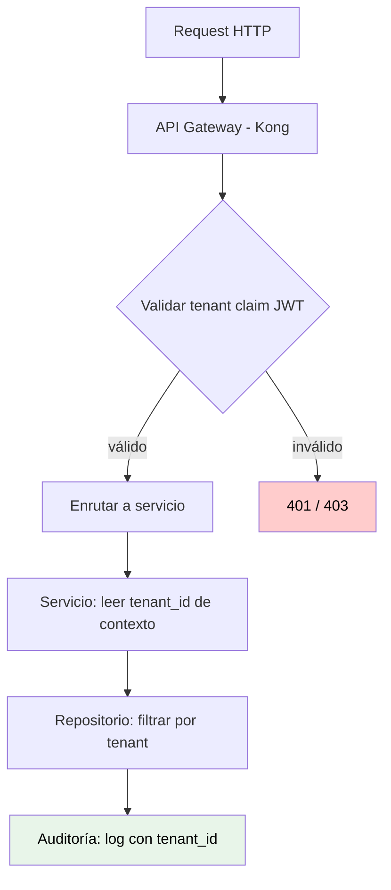

# Multi-tenancy

## Contexto

Este estándar define cómo implementar arquitecturas multi-tenant de forma segura y mantenible en el contexto de Talma, que opera en cuatro países (pe, ec, co, mx). Complementa el lineamiento [Multi-tenancy](../../lineamientos/arquitectura/11-multi-tenancy.md).

**Conceptos incluidos:**

- **Modelos de aislamiento** → Realm / Schema / Database / Instance
- **Tenant Context Propagation** → Cómo fluye la identidad del tenant
- **Per-Tenant Configuration** → Configuración versionada por país/cliente
- **Tenant Validation en API Gateway** → Validación antes de enrutar
- **Auditoría por Tenant** → Trazabilidad de operaciones por tenant

---

## Stack Tecnológico en Talma

| Componente        | Tecnología         | Modelo de aislamiento                   |
| ----------------- | ------------------ | --------------------------------------- |
| **Autenticación** | Keycloak 23+       | Realm por país (`pe`, `ec`, `co`, `mx`) |
| **API Gateway**   | Kong OSS 3.6       | Workspace por tenant (route-level)      |
| **Base de datos** | PostgreSQL 15+     | Schema por tenant o DB por tenant       |
| **IaC**           | Terraform          | Módulo por tenant, workspace por env    |
| **Auditoría**     | Structured logging | Campo `tenant_id` indexado en Loki      |

---

## Relación entre Conceptos



---

## Modelos de Aislamiento

### Selección del modelo

Cada servicio debe declarar explícitamente su modelo de aislamiento de datos:

| Modelo               | Aislamiento                                           | Cuándo usarlo                            |
| -------------------- | ----------------------------------------------------- | ---------------------------------------- |
| **Realm** (Keycloak) | Alto — tokens y usuarios aislados por realm           | Servicio de identidad y autenticación    |
| **Database**         | Máximo — DB separada por tenant                       | Datos altamente regulados o gran volumen |
| **Schema**           | Alto — misma instancia, esquemas separados            | Mayoría de servicios en Talma            |
| **Row-level**        | Bajo — datos en mismas tablas con columna `tenant_id` | Solo para datos de baja sensibilidad     |

**Regla:** El modelo `row-level` sin RLS (Row Level Security) está prohibido en tablas con datos personales o financieros.

**Documentar la decisión:** El modelo de aislamiento elegido debe registrarse en el ADR del servicio.

---

## Tenant Context Propagation

### Header estándar

El tenant se propaga en todas las capas mediante:

| Nivel             | Mecanismo                                    | Valor                          |
| ----------------- | -------------------------------------------- | ------------------------------ |
| **HTTP externo**  | JWT claim `tenant_id`                        | `"pe"`, `"ec"`, `"co"`, `"mx"` |
| **HTTP interno**  | Header `X-Tenant-Id`                         | Mismo valor extraído del JWT   |
| **Base de datos** | `SET app.current_tenant = 'pe'` (PostgreSQL) | Variable de sesión para RLS    |
| **Logs**          | Campo `tenant_id` en JSON estructurado       | Indexado en Loki               |

```csharp
// Middleware que extrae tenant_id del JWT y lo pone en HttpContext
public class TenantContextMiddleware
{
    public async Task InvokeAsync(HttpContext ctx, RequestDelegate next)
    {
        var tenantId = ctx.User.FindFirst("tenant_id")?.Value
            ?? ctx.Request.Headers["X-Tenant-Id"].ToString();

        if (string.IsNullOrWhiteSpace(tenantId))
        {
            ctx.Response.StatusCode = 400;
            await ctx.Response.WriteAsync("Tenant context required");
            return;
        }

        ctx.Items["TenantId"] = tenantId;
        await next(ctx);
    }
}
```

**Regla:** Ningún servicio puede aceptar requests sin tenant_id en rutas multi-tenant. El rechazo debe devolver HTTP 400 o 401 según corresponda.

---

## Per-Tenant Configuration

### Configuración versionada en IaC

Cada tenant tiene su propia configuración declarada en Terraform:

```hcl
# modules/tenant/main.tf
module "tenant_pe" {
  source      = "./modules/tenant"
  tenant_id   = "pe"
  region      = "us-east-1"
  db_schema   = "pe_schema"
  keycloak_realm = "pe"
  feature_flags = {
    nueva_ui = true
    beta_api = false
  }
}
```

**Reglas:**

- Cada tenant tiene su propio `terraform.tfvars` en el repositorio
- Cambios de configuración de un tenant no deben afectar otros tenants
- Feature flags por tenant se gestionan en AWS AppConfig con clave `/{env}/{tenant_id}/flags`

---

## Validación en API Gateway

### Kong: validación de tenant antes de enrutar

El API Gateway valida que el claim `tenant_id` del JWT sea coherente con la ruta solicitada antes de enrutar:

```lua
-- Plugin Kong: tenant-validator
local function validate_tenant(conf)
    local token = kong.request.get_header("Authorization")
    local tenant_claim = decode_jwt(token).tenant_id
    local route_tenant = kong.router.get_route().tags["tenant"]

    if tenant_claim ~= route_tenant then
        return kong.response.exit(403, { message = "Tenant mismatch" })
    end
end
```

**Configuración de ruta en deck:**

```yaml
routes:
  - name: orders-pe
    paths: ["/pe/api/orders"]
    tags: ["tenant:pe"]
    plugins:
      - name: tenant-validator
```

---

## Auditoría por Tenant

### Log estructurado con tenant_id

Todo log de operación debe incluir `tenant_id` como campo de primer nivel:

```csharp
_logger.LogInformation(
    "Order {OrderId} created for tenant {TenantId} by user {UserId}",
    orderId, tenantId, userId);
```

**Salida estructura JSON esperada:**

```json
{
  "timestamp": "2026-03-11T10:00:00Z",
  "level": "Information",
  "message": "Order 123 created",
  "tenant_id": "pe",
  "user_id": "usr_abc",
  "order_id": "123",
  "service": "orders-api"
}
```

**Consulta de auditoría en Loki:**

```logql
{service="orders-api"} | json | tenant_id="pe" | line_format "{{.timestamp}} {{.message}}"
```

**Reglas:**

- `tenant_id` es campo obligatorio en todos los logs de operaciones de negocio
- Los índices de auditoría deben retener datos 90 días mínimo
- El acceso a logs entre tenants requiere autorización explícita en Grafana

---

## Checklist Multi-tenancy

| Aspecto                 | Verificación                                    |
| ----------------------- | ----------------------------------------------- |
| Modelo de aislamiento   | Declarado en ADR del servicio                   |
| Propagación de contexto | `tenant_id` en JWT claim + header `X-Tenant-Id` |
| Rechazo sin tenant      | HTTP 400/401 si falta tenant_id                 |
| Validación en gateway   | Kong valida tenant claim antes de enrutar       |
| Config por tenant       | `terraform.tfvars` por tenant en repositorio    |
| Auditoría               | `tenant_id` en todos los logs de operaciones    |
| Pruebas de aislamiento  | Tests que verifican no filtración entre tenants |

---

## Referencias

- [Lineamiento Multi-tenancy](../../lineamientos/arquitectura/11-multi-tenancy.md)
- [IAM Avanzado](../seguridad/iam-advanced.md)
- [SSO, MFA y RBAC](../seguridad/sso-mfa-rbac.md)
- [IaC Standards](../infraestructura/iac-standards.md)
- [Security Governance](../seguridad/security-governance.md)
- [Segmentación y Aislamiento](../../lineamientos/seguridad/06-segmentacion-y-aislamiento.md)
