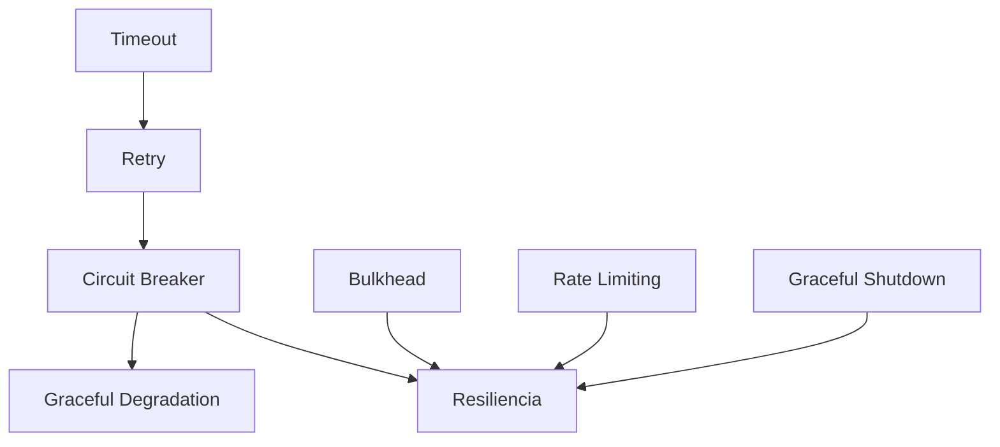

# Patrones de Resiliencia

## Contexto

Este estándar consolida los patrones fundamentales para construir sistemas resilientes que manejan fallos gracefully. Complementa el lineamiento [Resiliencia y Disponibilidad](../../lineamientos/arquitectura/resiliencia-y-disponibilidad.md).

**Conceptos incluidos:**

- **Circuit Breaker** → Detener llamadas a servicios fallidos
- **Retry** → Reintentar operaciones fallidas
- **Timeout** → Límites de tiempo de espera
- **Bulkhead** → Aislamiento de recursos
- **Rate Limiting** → Control de tasa de requests
- **Graceful Degradation** → Degradación funcional controlada
- **Graceful Shutdown** → Apagado ordenado

---

## Stack Tecnológico

| Componente        | Tecnología                                    | Versión | Uso                                       |
| ----------------- | --------------------------------------------- | ------- | ----------------------------------------- |
| **Resilience**    | Polly                                         | 8.0+    | Circuit breaker, retry, timeout, bulkhead |
| **Rate Limiting** | ASP.NET Core Rate Limiting                    | 8.0+    | Control de tasa built-in                  |
| **Health Checks** | Microsoft.Extensions.Diagnostics.HealthChecks | 8.0+    | Monitoreo de dependencias                 |
| **Observability** | OpenTelemetry                                 | 1.7+    | Métricas de resiliencia                   |

---

## Relación entre Patrones



---

## Circuit Breaker

### ¿Qué es Circuit Breaker?

Patrón que detiene llamadas a un servicio que está fallando, evitando cascada de fallos y dando tiempo de recuperación.

**Estados:**

- **Closed**: Normal, pasan requests
- **Open**: Servicio fallando, rechaza requests inmediatamente
- **Half-Open**: Prueba si servicio se recuperó

**Propósito:** Fail fast, evitar cascada de timeouts, dar tiempo de recuperación.

**Beneficios:**
✅ Evita sobrecarga en servicios fallidos
✅ Respuesta rápida al usuario
✅ Auto-recuperación

### Implementación

```csharp
// Circuit Breaker con Polly
var circuitBreakerPolicy = Policy
    .Handle<HttpRequestException>()
    .Or<TimeoutException>()
    .CircuitBreakerAsync(
        handledEventsAllowedBeforeBreaking: 5, // Abrir después de 5 fallos
        durationOfBreak: TimeSpan.FromSeconds(30), // Mantener abierto 30s
        onBreak: (exception, duration) =>
        {
            _logger.LogWarning(
                "Circuit breaker opened for {Duration}s due to {Exception}",
                duration.TotalSeconds, exception.GetType().Name);
        },
        onReset: () =>
        {
            _logger.LogInformation("Circuit breaker reset");
        },
        onHalfOpen: () =>
        {
            _logger.LogInformation("Circuit breaker half-open, testing service");
        });

// Uso
try
{
    var response = await circuitBreakerPolicy.ExecuteAsync(async () =>
        await _httpClient.GetAsync("https://api.example.com/data"));
}
catch (BrokenCircuitException)
{
    _logger.LogWarning("Circuit breaker is open, using fallback");
    return GetCachedData();
}
```

---

## Retry

### ¿Qué es Retry?

Patrón que reintenta operaciones fallidas con estrategia de backoff.

**Estrategias:**

- **Immediate**: Sin espera (solo para fallos transitorios rápidos)
- **Linear**: Espera fija entre intentos
- **Exponential Backoff**: Espera creciente (2^n)
- **Jitter**: Aleatorización para evitar thundering herd

**Propósito:** Manejar fallos transitorios sin intervención manual.

**Beneficios:**
✅ Maneja blips de red
✅ Absorbe fallos transitorios
✅ Mejora confiabilidad

### Implementación

```csharp
// Retry con Exponential Backoff + Jitter
var retryPolicy = Policy
    .Handle<HttpRequestException>()
    .Or<TimeoutException>()
    .WaitAndRetryAsync(
        retryCount: 3,
        sleepDurationProvider: retryAttempt =>
        {
            // Exponential backoff: 2^retryAttempt segundos
            var exponentialDelay = TimeSpan.FromSeconds(Math.Pow(2, retryAttempt));

            // Jitter: ±25% aleatorio
            var jitter = TimeSpan.FromMilliseconds(
                Random.Shared.Next(
                    (int)(exponentialDelay.TotalMilliseconds * 0.75),
                    (int)(exponentialDelay.TotalMilliseconds * 1.25)));

            return jitter;
        },
        onRetry: (exception, timespan, retryCount, context) =>
        {
            _logger.LogWarning(
                "Retry {RetryCount} after {Delay}ms due to {Exception}",
                retryCount, timespan.TotalMilliseconds, exception.GetType().Name);
        });

// Uso
var data = await retryPolicy.ExecuteAsync(async () =>
    await _httpClient.GetFromJsonAsync<Data>("https://api.example.com/data"));
```

---

## Timeout

### ¿Qué es Timeout?

Límite de tiempo máximo para operaciones, evitando esperas indefinidas.

**Tipos:**

- **Timeout Optimista**: Por intento individual
- **Timeout Pesimista**: Para toda la operación (incluyendo retries)

**Propósito:** Evitar bloqueos indefinidos, liberar recursos.

**Beneficios:**
✅ Recursos liberados rápidamente
✅ UX predecible
✅ Evita thread starvation

### Implementación

```csharp
// Timeout por request
var timeoutPolicy = Policy
    .TimeoutAsync<HttpResponseMessage>(
        timeout: TimeSpan.FromSeconds(10),
        onTimeoutAsync: async (context, timespan, task) =>
        {
            _logger.LogWarning("Request timed out after {Timeout}s", timespan.TotalSeconds);
        });

// Combinar Timeout + Retry + Circuit Breaker
var resilientPolicy = Policy.WrapAsync(
    timeoutPolicy,           // Más interno: 10s por request
    retryPolicy,             // Medio: 3 retries
    circuitBreakerPolicy);    // Más externo: circuit breaker

// Configurar HttpClient con timeout global
builder.Services.AddHttpClient("resilient-api")
    .ConfigureHttpClient(client =>
    {
        client.Timeout = TimeSpan.FromSeconds(30); // Timeout total
    })
    .AddPolicyHandler(resilientPolicy);
```

---

## Bulkhead

### ¿Qué es Bulkhead?

Patrón que aísla recursos para diferentes tipos de operaciones, evitando que una operación monopolice todos los recursos.

**Propósito:** Contener fallos, garantizar recursos para operaciones críticas.

**Tipos:**

- **Thread Pool Bulkhead**: Pool de threads dedicado
- **Semaphore Bulkhead**: Límite de concurrencia

**Beneficios:**
✅ Operaciones críticas protegidas
✅ Fallos contenidos
✅ Mejor control de recursos

### Implementación

```csharp
// Bulkhead con Polly - Límite de concurrencia
var bulkheadPolicy = Policy
    .BulkheadAsync<HttpResponseMessage>(
        maxParallelization: 10,  // Máx 10 requests concurrentes
        maxQueuingActions: 20,   // Máx 20 en cola
        onBulkheadRejectedAsync: async context =>
        {
            _logger.LogWarning("Bulkhead limit reached, request rejected");
        });

// Bulkheads separados por criticidad
public class ResilientHttpClientFactory
{
    public IAsyncPolicy<HttpResponseMessage> GetPolicy(CriticalityLevel level)
    {
        return level switch
        {
            CriticalityLevel.Critical => CreateCriticalPolicy(),
            CriticalityLevel.Normal => CreateNormalPolicy(),
            CriticalityLevel.LowPriority => CreateLowPriorityPolicy(),
            _ => throw new ArgumentException()
        };
    }

    private IAsyncPolicy<HttpResponseMessage> CreateCriticalPolicy()
    {
        var bulkhead = Policy.BulkheadAsync<HttpResponseMessage>(
            maxParallelization: 50,  // Más recursos
            maxQueuingActions: 100);

        return Policy.WrapAsync(GetTimeoutPolicy(), GetRetryPolicy(), bulkhead);
    }

    private IAsyncPolicy<HttpResponseMessage> CreateLowPriorityPolicy()
    {
        var bulkhead = Policy.BulkheadAsync<HttpResponseMessage>(
            maxParallelization: 5,   // Menos recursos
            maxQueuingActions: 10);

        return Policy.WrapAsync(GetTimeoutPolicy(), bulkhead);
    }
}
```

---

## Rate Limiting

### ¿Qué es Rate Limiting?

Control de la tasa de requests entrantes para proteger el servicio de sobrecarga.

**Algoritmos:**

- **Fixed Window**: N requests por ventana de tiempo fija
- **Sliding Window**: Ventana que se mueve con el tiempo
- **Token Bucket**: Tokens regenerados a tasa fija
- **Concurrency**: Límite de requests concurrentes

**Propósito:** Proteger de abusos, garantizar equidad, prevenir DoS.

**Beneficios:**
✅ Servicio protegido
✅ Recursos distribuidos equitativamente
✅ Prevención de abusos

### Implementación

```csharp
// Rate Limiting en ASP.NET Core 8+
var builder = WebApplication.CreateBuilder(args);

builder.Services.AddRateLimiter(options =>
{
    // Fixed Window: 100 requests por minuto
    options.AddFixedWindowLimiter("fixed", options =>
    {
        options.PermitLimit = 100;
        options.Window = TimeSpan.FromMinutes(1);
        options.QueueProcessingOrder = QueueProcessingOrder.OldestFirst;
        options.QueueLimit = 20;
    });

    // Sliding Window: más justo
    options.AddSlidingWindowLimiter("sliding", options =>
    {
        options.PermitLimit = 100;
        options.Window = TimeSpan.FromMinutes(1);
        options.SegmentsPerWindow = 6; // 10s por segmento
    });

    // Token Bucket: permite bursts
    options.AddTokenBucketLimiter("token", options =>
    {
        options.TokenLimit = 100;
        options.ReplenishmentPeriod = TimeSpan.FromMinutes(1);
        options.TokensPerPeriod = 100;
        options.AutoReplenishment = true;
    });

    // Concurrency Limiter
    options.AddConcurrencyLimiter("concurrency", options =>
    {
        options.PermitLimit = 50;
        options.QueueProcessingOrder = QueueProcessingOrder.OldestFirst;
        options.QueueLimit = 100;
    });

    options.OnRejected = async (context, token) =>
    {
        context.HttpContext.Response.StatusCode = 429;
        await context.HttpContext.Response.WriteAsync(
            "Too many requests. Please try again later.",
            token);
    };
});

var app = builder.Build();
app.UseRateLimiter();

// Aplicar rate limiting
app.MapGet("/api/products", async (ProductService service) =>
{
    return await service.GetAllAsync();
})
.RequireRateLimiting("fixed");

// Rate limiting por cliente
app.MapGet("/api/orders", async (HttpContext context, OrderService service) =>
{
    return await service.GetOrdersAsync();
})
.RequireRateLimiting(new RateLimiterPolicy
{
    PartitionedRateLimiter = context =>
    {
        var userId = context.User.FindFirst("sub")?.Value;
        return RateLimitPartition.GetFixedWindowLimiter(
            userId ?? "anonymous",
            _ => new FixedWindowRateLimiterOptions
            {
                PermitLimit = 50,
                Window = TimeSpan.FromMinutes(1)
            });
    }
});
```

---

## Graceful Degradation

### ¿Qué es Graceful Degradation?

Estrategia de ofrecer funcionalidad reducida en lugar de fallo total cuando dependencias no están disponibles.

**Propósito:** Mantener sistema operativo parcialmente, mejor UX.

**Estrategias:**

- Fallback a cache
- Funcionalidad reducida
- Respuestas default
- Modo read-only

**Beneficios:**
✅ Sistema parcialmente operativo
✅ Mejor UX
✅ Revenue parcial vs cero

### Implementación

```csharp
public class ProductService
{
    private readonly IHttpClientFactory _httpClientFactory;
    private readonly IDistributedCache _cache;
    private readonly ILogger<ProductService> _logger;

    public async Task<ProductDetails> GetProductAsync(Guid productId)
    {
        try
        {
            // Intento primario: servicio de inventory
            var inventoryData = await GetFromInventoryServiceAsync(productId);
            await _cache.SetAsync($"product:{productId}", inventoryData, TimeSpan.FromMinutes(5));
            return inventoryData;
        }
        catch (Exception ex) when (ex is HttpRequestException or TimeoutException or BrokenCircuitException)
        {
            _logger.LogWarning(ex, "Inventory service unavailable, using fallback");

            // Fallback 1: Cache
            var cached = await _cache.GetAsync<ProductDetails>($"product:{productId}");
            if (cached != null)
            {
                cached.DataSource = "cache";
                cached.IsDegraded = true;
                return cached;
            }

            // Fallback 2: DB local (sin stock real-time)
            var dbProduct = await _localDbContext.Products
                .Where(p => p.Id == productId)
                .FirstOrDefaultAsync();

            if (dbProduct != null)
            {
                return new ProductDetails
                {
                    Id = dbProduct.Id,
                    Name = dbProduct.Name,
                    Price = dbProduct.Price,
                    StockStatus = "Unknown", // Degradado: sin stock
                    IsDegraded = true,
                    DataSource = "local-db"
                };
            }

            // Fallback 3: Respuesta default
            return ProductDetails.Unavailable(productId);
        }
    }
}

public class ProductDetails
{
    public Guid Id { get; set; }
    public string Name { get; set; }
    public decimal Price { get; set; }
    public string StockStatus { get; set; }
    public bool IsDegraded { get; set; }
    public string DataSource { get; set; }

    public static ProductDetails Unavailable(Guid id) => new()
    {
        Id = id,
        Name = "Product information temporarily unavailable",
        Price = 0,
        StockStatus = "Unknown",
        IsDegraded = true,
        DataSource = "fallback"
    };
}
```

---

## Graceful Shutdown

### ¿Qué es Graceful Shutdown?

Apagado ordenado que termina requests en curso antes de cerrar el proceso.

**Propósito:** Evitar pérdida de requests, corrupción de datos.

**Fases:**

1. Dejar de aceptar nuevos requests
2. Terminar requests en curso
3. Cerrar conexiones
4. Apagar proceso

**Beneficios:**
✅ Cero requests perdidos
✅ Datos consistentes
✅ Deploy sin downtime

### Implementación

```csharp
// Program.cs - Graceful Shutdown
var builder = WebApplication.CreateBuilder(args);

builder.Services.Configure<HostOptions>(options =>
{
    options.ShutdownTimeout = TimeSpan.FromSeconds(30); // Esperar hasta 30s
});

var app = builder.Build();

// Health check marca unhealthy durante shutdown
var lifetime = app.Services.GetRequiredService<IHostApplicationLifetime>();
lifetime.ApplicationStopping.Register(() =>
{
    _logger.LogInformation("Application stopping, marking as unhealthy");
    // Load balancer dejará de enviar tráfico
});

// Background service que maneja shutdown gracefully
public class OrderProcessingService : BackgroundService
{
    private readonly ILogger<OrderProcessingService> _logger;
    private readonly IServiceScopeFactory _scopeFactory;

    protected override async Task ExecuteAsync(CancellationToken stoppingToken)
    {
        try
        {
            while (!stoppingToken.IsCancellationRequested)
            {
                using var scope = _scopeFactory.CreateScope();
                var orderService = scope.ServiceProvider.GetRequiredService<IOrderService>();

                await orderService.ProcessPendingOrdersAsync(stoppingToken);
                await Task.Delay(TimeSpan.FromSeconds(5), stoppingToken);
            }
        }
        catch (OperationCanceledException)
        {
            _logger.LogInformation("Shutdown requested, finishing current batch");

            // Teminar batch actual sin aceptar nuevos
            await FinishCurrentBatchAsync();

            _logger.LogInformation("Graceful shutdown completed");
        }
    }

    private async Task FinishCurrentBatchAsync()
    {
        // Terminar operaciones en curso
        using var scope = _scopeFactory.CreateScope();
        var orderService = scope.ServiceProvider.GetRequiredService<IOrderService>();
        await orderService.FlushPendingAsync();
    }
}

// ECS gracefully drena conexiones
// task definition healthcheck + deregistration_delay permiten
// que ALB deje de enviar tráfico y espere 30s antes de kill
```

---

## Matriz de Decisión

| Escenario             | Circuit Breaker | Retry | Timeout | Bulkhead | Rate Limiting | Degradation | Shutdown |
| --------------------- | --------------- | ----- | ------- | -------- | ------------- | ----------- | -------- |
| **HTTP a externos**   | ✅✅            | ✅✅  | ✅✅    | ✅       | -             | ✅          | -        |
| **API pública**       | ✅              | ✅    | ✅      | ✅✅     | ✅✅          | ✅          | ✅✅     |
| **Background worker** | ✅              | ✅✅  | ✅      | ✅       | -             | -           | ✅✅     |
| **Operación crítica** | ✅✅            | ✅✅  | ✅✅    | ✅✅     | -             | ✅✅        | ✅✅     |

---

## Beneficios en Práctica

```yaml
# ✅ Comparativa de impacto

Antes (sin el estándar):
  Problema: Sin circuit breaker ni timeout, un servicio externo lento
    bloquea threads y provoca cascada de fallos
  Consecuencia: Todo el sistema cae en 2-3 minutos por thread starvation

Después (con el estándar):
  Estado: Circuit Breaker abre tras 5 fallos consecutivos,
    Retry con backoff absorbe blips de red,
    Graceful Degradation sirve datos desde cache
  Resultado: Fallo contenido — ~95% de requests exitosos
    durante degradación del servicio externo
```

---

## Requisitos Técnicos

### MUST (Obligatorio)

- **MUST** implementar timeout en todas las llamadas HTTP externas
- **MUST** usar circuit breaker para dependencias externas
- **MUST** implementar graceful shutdown en servicios
- **MUST** configurar rate limiting en APIs públicas
- **MUST** monitorear métricas de resiliencia (circuit state, retry count)

### SHOULD (Fuertemente recomendado)

- **SHOULD** usar retry con exponential backoff + jitter
- **SHOULD** implementar graceful degradation con fallbacks
- **SHOULD** usar bulkhead para aislar operaciones críticas
- **SHOULD** combinar políticas (timeout + retry + circuit breaker)

### MAY (Opcional)

- **MAY** usar rate limiting interno entre servicios

### MUST NOT (Prohibido)

- **MUST NOT** hacer retry infinito
- **MUST NOT** usar timeout > 30s sin justificación
- **MUST NOT** hacer circuit breaker sin logging/métricas

---

## Referencias

- [Polly Documentation](https://www.thepollyproject.org/)
- [Release It! (Michael Nygard)](https://pragprog.com/titles/mnee2/release-it-second-edition/)
- [ASP.NET Core Rate Limiting](https://learn.microsoft.com/en-us/aspnet/core/performance/rate-limit)
- [AWS ECS Graceful Shutdown](https://aws.amazon.com/blogs/containers/graceful-shutdowns-with-ecs/)
