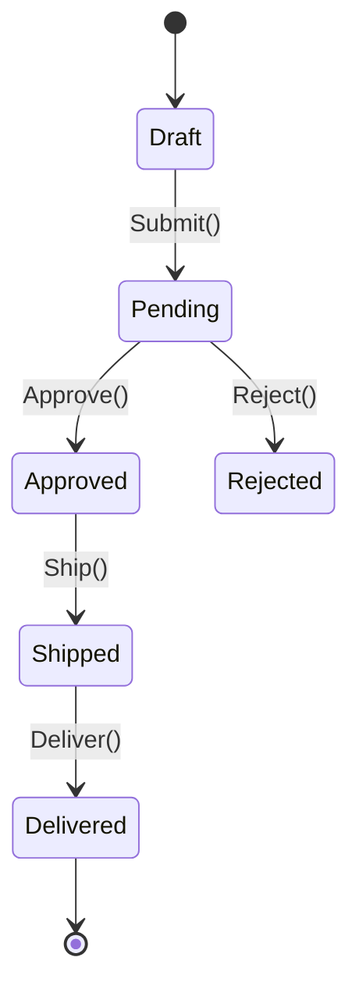

# Ubiquitous Language

## Contexto

Este estándar define cómo establecer y mantener un **lenguaje ubicuo** (ubiquitous language) en cada bounded context, asegurando que **negocio y desarrollo hablen el mismo idioma**. Complementa el [lineamiento de Modelado de Dominio](../../lineamientos/arquitectura/09-modelado-de-dominio.md) eliminando ambigüedad y reduciendo errores de interpretación.

---

## Conceptos Fundamentales

### ¿Qué es Ubiquitous Language?

```yaml
# ✅ Ubiquitous Language = Lenguaje compartido negocio + desarrollo

Definición:
  Vocabulario consistente usado por TODOS (negocio + desarrolladores + QA)
  para hablar del dominio dentro de un bounded context.

Objetivo:
  - Eliminar traducciones mentales entre "lenguaje de negocio" y "lenguaje técnico"
  - Reducir malentendidos en requisitos
  - Hacer código legible para domain experts
  - Mantener modelo de dominio y realidad sincronizados

Características:
  ✅ Preciso: Términos tienen significado único en el contexto
  ✅ Consistente: Mismo término en conversaciones, docs y código
  ✅ Vivo: Evoluciona con el entendimiento del dominio
  ✅ Contextual: Términos válidos solo dentro del bounded context
  ✅ Explícito: Sin jerga técnica innecesaria

Anti-patterns: ❌ "Customer" en código pero "Client" en conversaciones
  ❌ "Pedido" en docs pero "Order" en código
  ❌ "Usuario" (ambiguo) en lugar de "Employee" / "Customer"
  ❌ Términos técnicos en documentación de negocio ("DTO", "Entity")
```

### Por qué es Crítico

```yaml
# ✅ Impacto de NO tener lenguaje ubicuo

Sin Ubiquitous Language:
  Reunión:
    Negocio: "Necesitamos registrar el alta del pedido"
    Dev (piensa): "¿Alta? ¿Crear? ¿Insert? ¿Qué es alta?"

  Código: public class PedidoDTO {  // ¿Es lo mismo que Order?
    public int IdPedido { get; set; }  // ¿Id o OrderId?
    public string Status { get; set; }  // ¿Qué valores tiene?
    }

  DB:
    TABLA: PEDIDOS_MAESTRO  // Diferente nombre
    COLUMNA: EST_PED  // Abreviado, ininteligible

  → Resultado: 3 traducciones, 3 oportunidades de error

Con Ubiquitous Language:
  Reunión:
    Negocio: "Cuando un pedido se aprueba..."
    Dev: "Ok, OrderApproved domain event"
    Código: public record OrderApproved(Guid OrderId, ...)

  → Resultado: Comunicación fluida, menos bugs
```

### Glosario de Términos

```yaml
# ✅ Cada bounded context tiene glosario explícito

Formato:
  Término: [Definición precisa] | Sinónimos | Contexto

Ejemplo: Sales Bounded Context (Talma)

Order (Pedido):
  Definición: Solicitud de compra de productos por un cliente,
             con estado que evoluciona desde Draft hasta Delivered.
  Sinónimos: Pedido (español), Purchase Order (EVITAR, es otro concepto)
  Properties: OrderId, CustomerId, OrderDate, Status, Lines
  Transiciones: Draft → Pending → Approved → Shipped → Delivered
  Invariantes: Total > 0, al menos 1 OrderLine

OrderLine (Línea de Pedido):
  Definición: Item específico dentro de un Order, con producto,
             cantidad y precio unitario.
  Properties: ProductId, Quantity, UnitPrice, Subtotal
  Invariantes: Quantity > 0, UnitPrice >= 0

Customer (Cliente):
  Definición: Entidad jurídica o persona que realiza Orders.
  Properties: CustomerId, Name, TaxId, BillingAddress
  NO confundir con: User (empleado interno)

OrderStatus (Estado del Pedido):
  Valores: Draft | Pending | Approved | Rejected | Shipped | Delivered
  Transiciones permitidas:
    - Draft → Pending (cuando se envía a aprobación)
    - Pending → Approved (cuando se aprueba)
    - Pending → Rejected (cuando se rechaza)
    - Approved → Shipped (cuando se despacha)
    - Shipped → Delivered (cuando se entrega)

Approval (Aprobación):
  Definición: Proceso de validación de un Order por supervisor,
             que resulta en Approved o Rejected.
  Properties: ApprovedBy, ApprovedAt, Reason
  Business Rule: Orders > $10,000 requieren approval de Manager
```

## Aplicación en Código

### Naming Conventions

```csharp
// ✅ BUENO: Código refleja lenguaje ubicuo exacto

namespace Talma.Sales.Domain.Model
{
    // ✅ Usa término del glosario
    public class Order  // No "Pedido", no "SalesOrder", solo "Order"
    {
        public Guid OrderId { get; private set; }  // No "Id", es "OrderId"
        public Guid CustomerId { get; private set; }  // No "ClientId"
        public OrderStatus Status { get; private set; }  // Enum, no string
        public DateTime OrderDate { get; private set; }

        private readonly List<OrderLine> _lines = new();
        public IReadOnlyCollection<OrderLine> Lines => _lines.AsReadOnly();

        // ✅ Métodos usan verbos del dominio (no CRUD genérico)
        public void Submit()  // No "SetStatusToPending()"
        {
            if (Status != OrderStatus.Draft)
                throw new InvalidOperationException("Only draft orders can be submitted");

            if (!_lines.Any())
                throw new DomainException("Cannot submit order without lines");

            Status = OrderStatus.Pending;

            // ✅ Domain event usa lenguaje ubicuo
            AddDomainEvent(new OrderSubmitted(OrderId, CustomerId));
        }

        public void Approve(Guid approvedBy, string? reason = null)  // No "SetApproved()"
        {
            if (Status != OrderStatus.Pending)
                throw new InvalidOperationException("Only pending orders can be approved");

            Status = OrderStatus.Approved;

            AddDomainEvent(new OrderApproved(OrderId, CustomerId, approvedBy, reason));
        }

        public void Reject(Guid rejectedBy, string reason)
        {
            if (Status != OrderStatus.Pending)
                throw new InvalidOperationException("Only pending orders can be rejected");

            if (string.IsNullOrWhiteSpace(reason))
                throw new ArgumentException("Rejection reason is required");

            Status = OrderStatus.Rejected;

            AddDomainEvent(new OrderRejected(OrderId, rejectedBy, reason));
        }

        public void AddLine(Guid productId, int quantity, decimal unitPrice)
        {
            if (Status != OrderStatus.Draft)
                throw new InvalidOperationException("Cannot modify submitted order");

            var line = new OrderLine(Guid.NewGuid(), productId, quantity, unitPrice);
            _lines.Add(line);
        }
    }

    // ✅ Enum refleja estados del glosario (no códigos técnicos)
    public enum OrderStatus
    {
        Draft,      // No "D" o "0"
        Pending,    // No "P" o "1"
        Approved,   // No "A" o "2"
        Rejected,   // No "R" o "3"
        Shipped,    // No "S" o "4"
        Delivered   // No "E" o "5"
    }

    public record OrderLine(
        Guid LineId,
        Guid ProductId,
        int Quantity,       // No "Qty"
        decimal UnitPrice   // No "Price" (ambiguo)
    )
    {
        // ✅ Propiedad calculada usa término del dominio
        public decimal Subtotal => Quantity * UnitPrice;  // No "Total" (confunde con Order.Total)
    }
}
```

```csharp
// ❌ MALO: Código no refleja dominio

namespace Talma.Sales
{
    public class PedidoEntity  // ❌ "Pedido" + "Entity" (jerga técnica)
    {
        public int Id { get; set; }  // ❌ No es "OrderId"
        public int ClienteId { get; set; }  // ❌ "Cliente" vs "Customer" inconsistente
        public string Estado { get; set; }  // ❌ String en lugar de enum
        public decimal Total { get; set; }
        public List<LineaDTO> Lineas { get; set; }  // ❌ DTO en dominio?

        // ❌ Método CRUD genérico, no del dominio
        public void Update(string status)
        {
            Estado = status;  // ❌ Sin validación de transiciones
        }

        // ❌ No hay concepto de "Approve" del dominio
        public void CambiarEstado(string nuevoEstado)
        {
            Estado = nuevoEstado;
        }
    }
}
```

### Domain Events

```csharp
// ✅ BUENO: Events usan lenguaje ubicuo en pasado

namespace Talma.Sales.Domain.Events
{
    // ✅ Nombre describe lo que pasó en términos del negocio
    public record OrderSubmitted(
        Guid OrderId,
        Guid CustomerId,
        DateTime SubmittedAt
    ) : DomainEvent;

    public record OrderApproved(
        Guid OrderId,
        Guid CustomerId,
        Guid ApprovedBy,       // No "UserId"
        string? ApprovalReason,  // No "Reason" (podría ser rechazo)
        DateTime ApprovedAt
    ) : DomainEvent;

    public record OrderRejected(
        Guid OrderId,
        Guid RejectedBy,
        string RejectionReason,  // Explícito
        DateTime RejectedAt
    ) : DomainEvent;

    // ✅ Evento específico del dominio Sales
    public record OrderLineAdded(
        Guid OrderId,
        Guid LineId,
        Guid ProductId,
        int Quantity,
        decimal UnitPrice
    ) : DomainEvent;
}

// ❌ MALO: Events genéricos sin significado de negocio

public record PedidoActualizado(int Id, string Campo, object Valor);  // ❌ Muy genérico
public record StatusChanged(int EntityId, string OldStatus, string NewStatus);  // ❌ No específico
```

### Servicios de Dominio

```csharp
// ✅ BUENO: Servicios usan verbos del dominio

namespace Talma.Sales.Domain.Services
{
    // ✅ Nombre describe comportamiento de negocio
    public interface IOrderApprovalPolicy
    {
        // ✅ Método usa lenguaje de negocio
        bool RequiresManagerApproval(Order order);
        bool CanApprove(Order order, Employee approver);
    }

    public class OrderApprovalPolicy : IOrderApprovalPolicy
    {
        private const decimal ManagerApprovalThreshold = 10000m;

        public bool RequiresManagerApproval(Order order)
        {
            // ✅ Regla de negocio expresada con términos del dominio
            return order.Total > ManagerApprovalThreshold;
        }

        public bool CanApprove(Order order, Employee approver)
        {
            if (!RequiresManagerApproval(order))
                return true;  // Cualquiera puede aprobar

            // ✅ "Manager" es término del dominio
            return approver.Role == EmployeeRole.Manager ||
                   approver.Role == EmployeeRole.Director;
        }
    }
}

// ❌ MALO: Servicios con nombres técnicos

public interface IPedidoService  // ❌ "Service" ambiguo
{
    void ProcessPedido(int id);  // ❌ "Process" no es término del dominio
    bool ValidarReglas(PedidoDTO dto);  // ❌ "Validar" muy genérico
}
```

### Repositorios

```csharp
// ✅ BUENO: Queries usan lenguaje ubicuo

namespace Talma.Sales.Domain.Repositories
{
    public interface IOrderRepository
    {
        Task<Order?> GetByIdAsync(Guid orderId);
        Task<IEnumerable<Order>> GetPendingOrdersAsync();  // ✅ "Pending" del dominio
        Task<IEnumerable<Order>> GetOrdersByCustomerAsync(Guid customerId);
        Task<IEnumerable<Order>> GetOrdersRequiringApprovalAsync();  // ✅ Concepto de negocio
        Task SaveAsync(Order order);
    }
}

// ❌ MALO: Queries genéricas sin significado de negocio

public interface IOrderRepository
{
    Task<Order> FindById(int id);  // ❌ "Find" técnico
    Task<List<Order>> GetAll();  // ❌ Muy genérico
    Task<List<Order>> GetByStatus(string status);  // ❌ No específico
    void Save(Order order);  // ❌ Sin async
}
```

## Aplicación en Base de Datos

```sql
-- ✅ BUENO: Schema refleja lenguaje ubicuo (donde sea posible)

CREATE TABLE sales.orders (  -- ✅ "orders" no "pedidos_maestro"
    order_id UUID PRIMARY KEY,  -- ✅ "order_id" no "id_pedido"
    customer_id UUID NOT NULL,  -- ✅ "customer_id" no "cliente_id"
    order_date TIMESTAMP NOT NULL,
    status VARCHAR(20) NOT NULL,  -- ✅ "Approved" no "A"
    total_amount DECIMAL(18,2) NOT NULL,

    CONSTRAINT ck_order_status CHECK (
        status IN ('Draft', 'Pending', 'Approved', 'Rejected', 'Shipped', 'Delivered')
        -- ✅ Valores explícitos del enum
    ),
    CONSTRAINT ck_order_total_positive CHECK (total_amount > 0)
);

CREATE TABLE sales.order_lines (  -- ✅ "order_lines" no "lineas_detalle"
    line_id UUID PRIMARY KEY,
    order_id UUID NOT NULL REFERENCES sales.orders(order_id),
    product_id UUID NOT NULL,
    quantity INT NOT NULL,  -- ✅ "quantity" no "cant"
    unit_price DECIMAL(18,2) NOT NULL,
    subtotal DECIMAL(18,2) NOT NULL,

    CONSTRAINT ck_quantity_positive CHECK (quantity > 0),
    CONSTRAINT ck_unit_price_non_negative CHECK (unit_price >= 0)
);

-- ✅ BUENO: Vista usa lenguaje ubicuo
CREATE VIEW sales.orders_pending_approval AS
SELECT
    o.order_id,
    o.customer_id,
    o.order_date,
    o.total_amount
FROM sales.orders o
WHERE o.status = 'Pending'
  AND o.total_amount > 10000;  -- Manager approval threshold

-- ❌ MALO: Schema legacy sin lenguaje ubicuo

CREATE TABLE PED_MAESTRO (  -- ❌ Abreviado, sin contexto
    ID_PED INT PRIMARY KEY,  -- ❌ Abreviado
    ID_CLI INT,  -- ❌ "Cliente" vs "Customer"
    FEC_PED DATE,  -- ❌ Abreviado
    EST VARCHAR(1),  -- ❌ Código críptico ("A", "P", "R")
    TOT DECIMAL
);
```

## Glosario: Context Boundaries

```yaml
# ✅ Términos pueden significar cosas diferentes en distintos contextos

"Address" en diferentes contextos:

Sales Context:
  Address = Dirección de envío del Order
  Properties: Street, City, State, ZipCode, Country
  Validaciones: Debe ser dirección válida para shipping

Billing Context:
  Address = Dirección de facturación del Customer
  Properties: Street, City, State, ZipCode, Country, TaxRegion
  Validaciones: Debe coincidir con registro tributario

Fulfillment Context:
  Address = Coordenadas GPS para delivery
  Properties: Latitude, Longitude, DeliveryInstructions
  Validaciones: Debe estar en zona de cobertura

→ Solución: 3 value objects distintos, NO reutilizar

"Customer" en diferentes contextos:

Sales Context:
  Customer = Entidad que realiza Orders

Support Context:
  Customer = Entidad con casos de soporte abiertos

Marketing Context:
  Customer = Lead en campañas de marketing

→ Cada contexto tiene su propio modelo de Customer
```

## Mantenimiento del Lenguaje

```yaml
# ✅ Prácticas para mantener lenguaje ubicuo vivo

1. Event Storming Sessions:
   Frecuencia: Cada nuevo feature mayor
   Participantes: Negocio + Devs + QA
   Output: Nuevos términos → Actualizar glosario

2. Glosario Versionado:
   Location: docs/glossary/sales-context.md
   Format: Markdown con términos, definiciones, ejemplos
   Review: En cada PR que toca dominio

3. Code Reviews:
   Checklist:
     □ ¿Nombres de clases coinciden con glosario?
     □ ¿Métodos usan verbos del dominio?
     □ ¿Domain events están en pasado?
     □ ¿No hay términos técnicos innecesarios?

4. Refinamiento Continuo:
   Trigger: "No entiendo este término" en daily/refinement
   Action: Discutir con negocio → Actualizar glosario → Refactor código

5. Onboarding:
   Nuevo dev: Leer glosario del bounded context ANTES de tocar código
   Incluir: Términos, sinónimos a evitar, ejemplos
```

## Ejemplo Completo: Sales Context

````markdown
# Glosario - Sales Bounded Context

**Última actualización:** 2024-01-15
**Owners:** Sales Team + Architecture

---

## Términos del Dominio

### Order (Pedido)

**Definición:** Solicitud formal de compra de productos por un Customer, con estado que evoluciona desde creación hasta entrega.

**Propiedades:**

- `OrderId` (Guid): Identificador único
- `CustomerId` (Guid): Referencia al Customer
- `OrderDate` (DateTime): Fecha de creación
- `Status` (OrderStatus): Estado actual
- `Lines` (List<OrderLine>): Líneas del pedido
- `Total` (Money): Monto total calculado

**Estados Posibles:** Draft, Pending, Approved, Rejected, Shipped, Delivered

**Invariantes:**

- Total > 0
- Al menos 1 OrderLine
- OrderDate <= DateTime.UtcNow

**Transiciones Permitidas:**


````

**Sinónimos a EVITAR:**

- ❌ "Pedido" (usar Order en código)
- ❌ "Purchase Order" (es otro concepto en Procurement)
- ❌ "Sales Order" (redundante, ya estamos en Sales context)

**Ejemplos:**

```csharp
var order = Order.Create(customerId);
order.AddLine(productId, quantity: 5, unitPrice: Money.Dollars(100));
order.Submit();  // Draft → Pending
order.Approve(approvedBy: managerId);  // Pending → Approved
```

---

### OrderLine (Línea de Pedido)

**Definición:** Item específico dentro de un Order, representando producto, cantidad y precio.

**Propiedades:**

- `LineId` (Guid): Identificador único
- `ProductId` (Guid): Referencia al producto
- `Quantity` (int): Cantidad solicitada
- `UnitPrice` (Money): Precio unitario al momento del Order
- `Subtotal` (Money): Cantidad × UnitPrice (calculado)

**Invariantes:**

- Quantity > 0
- UnitPrice >= 0

**Sinónimos a EVITAR:**

- ❌ "OrderItem" (usamos "Line")
- ❌ "OrderDetail" (legacy, evitar)

---

### Customer (Cliente)

**Definición:** Entidad jurídica o persona natural que realiza Orders en el sistema.

**NO confundir con:**

- ❌ User (empleado interno del sistema)
- ❌ Contact (persona de contacto en empresa)

**Propiedades:**

- `CustomerId` (Guid)
- `Name` (string)
- `TaxId` (string): RUC o DNI
- `BillingAddress` (Address value object)

---

### Approval (Aprobación)

**Definición:** Proceso de validación de un Order por un supervisor autorizado.

**Business Rules:**

- Orders con Total > $10,000 requieren Manager approval
- Orders con Total <= $10,000 pueden ser aprobados por cualquier Employee

**Evento resultante:**

- `OrderApproved` (si se aprueba)
- `OrderRejected` (si se rechaza)

---

## Verbos del Dominio

| Verbo          | Significado                 | Evento resultante  |
| -------------- | --------------------------- | ------------------ |
| `Submit()`     | Enviar Order a aprobación   | `OrderSubmitted`   |
| `Approve()`    | Aprobar Order pendiente     | `OrderApproved`    |
| `Reject()`     | Rechazar Order pendiente    | `OrderRejected`    |
| `Ship()`       | Marcar Order como enviado   | `OrderShipped`     |
| `Deliver()`    | Marcar Order como entregado | `OrderDelivered`   |
| `AddLine()`    | Agregar OrderLine           | `OrderLineAdded`   |
| `RemoveLine()` | Quitar OrderLine            | `OrderLineRemoved` |

**Verbos a EVITAR (demasiado genéricos):**

- ❌ `Update()` → Usar verbo específico del dominio
- ❌ `Process()` → Muy ambiguo
- ❌ `Handle()` → Lenguaje técnico
- ❌ `Execute()` → Sin significado de negocio

---

## Referencias

- [Bounded Contexts](../bounded-contexts.md)
- [Domain Model](../domain-model.md)
- Event Storming Session: Miro Board (2024-01-10)

```

---

## Requisitos Técnicos

### MUST (Obligatorio)

- **MUST** definir glosario de términos por bounded context
- **MUST** usar términos del glosario en nombres de clases, métodos y propiedades
- **MUST** mantener consistencia entre código, docs y conversaciones
- **MUST** revisar glosario en event storming sessions
- **MUST** usar enums con nombres explícitos (no códigos numéricos)
- **MUST** nombrar domain events en pasado con términos del dominio
- **MUST** documentar sinónimos a evitar para reducir confusión
- **MUST** incluir glosario en onboarding de nuevos devs

### SHOULD (Fuertemente recomendado)

- **SHOULD** versionar glosario en Git junto con código
- **SHOULD** validar naming conventions en code reviews
- **SHOULD** refactorizar código cuando lenguaje ubicuo evoluciona
- **SHOULD** evitar abreviaciones que no son del dominio (qty → quantity)
- **SHOULD** usar inglés en código (español en glosario si negocio lo prefiere)
- **SHOULD** documentar transiciones de estados en diagramas
- **SHOULD** crear ejemplos de uso en glosario

### MAY (Opcional)

- **MAY** automatizar validación de naming con analyzers
- **MAY** generar glosario desde atributos en código
- **MAY** incluir pronunciación de términos complejos
- **MAY** traducir glosario a múltiples idiomas si hay equipos distribuidos

### MUST NOT (Prohibido)

- **MUST NOT** mezclar términos técnicos con términos de negocio sin justificación
- **MUST NOT** usar códigos crípticos en lugar de nombres explícitos (E, P, A → Draft, Pending, Approved)
- **MUST NOT** ignorar feedback de negocio sobre términos incorrectos
- **MUST NOT** usar mismo término con significados diferentes en un contexto
- **MUST NOT** traducir código y docs a idiomas diferentes (elegir uno)
- **MUST NOT** usar jerga técnica en documentación de negocio (DTO, Entity, Repository)

---

## Referencias

- [Lineamiento: Modelado de Dominio](../../lineamientos/arquitectura/09-modelado-de-dominio.md)
- Estándares relacionados:
  - [Bounded Contexts](./bounded-contexts.md)
  - [Domain Model](./domain-model.md)
  - [Domain Events](./domain-events.md)
- Especificaciones:
  - [Domain-Driven Design (Eric Evans)](https://www.domainlanguage.com/ddd/)
  - [Implementing Domain-Driven Design (Vaughn Vernon)](https://vaughnvernon.com/)
```
