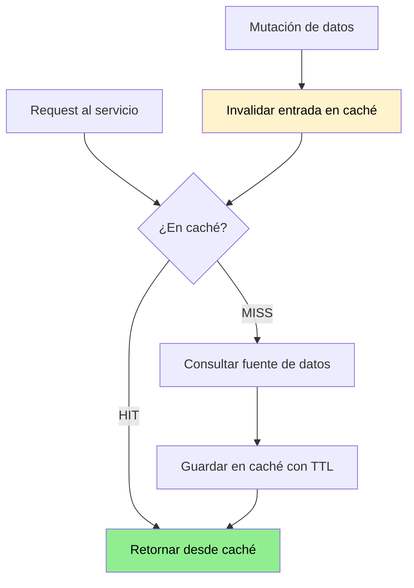

# Caching

## Contexto

Este estándar define cómo implementar caché de forma correcta y segura en servicios Talma. Complementa el lineamiento [Caching](../../lineamientos/datos/04-caching.md).

**Conceptos incluidos:**

- **Cache-Aside Pattern** → Patrón principal de lectura con caché
- **TTL Management** → Control de expiración de entradas
- **Distributed Cache** → Redis ElastiCache para estado compartido
- **Cache Invalidation** → Estrategias de invalidación al mutar datos
- **Cache Security** → Protección de datos sensibles en caché
- **Observabilidad de Caché** → Métricas de efectividad

---

## Stack Tecnológico

| Componente            | Tecnología               | Versión | Uso                                    |
| --------------------- | ------------------------ | ------- | -------------------------------------- |
| **Caché distribuida** | Redis ElastiCache        | 7.2+    | Caché compartida entre instancias      |
| **Caché local**       | `IMemoryCache` .NET      | 8.0+    | Caché en proceso, datos no compartidos |
| **Cliente Redis**     | StackExchange.Redis      | 2.7+    | Cliente .NET para Redis                |
| **Abstracción**       | `IDistributedCache` .NET | 8.0+    | Interfaz unificada caché/redis         |
| **Serialización**     | System.Text.Json         | 8.0+    | Serialización de valores en caché      |

---

## Relación entre Conceptos



---

## Cache-Aside Pattern

### Patrón principal de lectura

Cache-Aside (Lazy Loading) es el patrón predeterminado: la aplicación gestiona la caché explícitamente. El caché no se rellena en batch, sino bajo demanda.

```csharp
public class TenantConfigService
{
    private readonly IDistributedCache _cache;
    private readonly ITenantRepository _repo;

    public async Task<TenantConfig> GetConfigAsync(string tenantId)
    {
        var cacheKey = $"tenant:config:{tenantId}";

        // 1. Intentar caché
        var cached = await _cache.GetStringAsync(cacheKey);
        if (cached is not null)
            return JsonSerializer.Deserialize<TenantConfig>(cached)!;

        // 2. Consultar fuente de datos
        var config = await _repo.GetByTenantAsync(tenantId);

        // 3. Guardar con TTL explícito
        await _cache.SetStringAsync(cacheKey,
            JsonSerializer.Serialize(config),
            new DistributedCacheEntryOptions
            {
                AbsoluteExpirationRelativeToNow = TimeSpan.FromMinutes(10)
            });

        return config;
    }
}
```

**Regla:** Prohibido `SetStringAsync` sin `AbsoluteExpirationRelativeToNow` o `SlidingExpiration`.

---

## TTL Management

### TTL por tipo de dato

El TTL debe elegirse según la frecuencia de cambio del dato y el impacto de datos desactualizados:

| Tipo de dato                     | TTL recomendado        | Justificación                                   |
| -------------------------------- | ---------------------- | ----------------------------------------------- |
| Configuración de tenant          | 10 min                 | Cambia raramente; 10 min de lag aceptable       |
| JWKS (claves públicas Keycloak)  | 5 min                  | Rotaciones infrecuentes, impacto alto si stale  |
| Respuestas de servicios externos | 1–5 min                | Depende del SLA del servicio externo            |
| Resultados de búsqueda paginados | 30 s                   | Alta frecuencia de cambio                       |
| Tokens de sesión de usuario      | Igual al TTL del token | No extender más allá de la expiración del token |

**Reglas:**

- Nunca usar `AbsoluteExpiration` con fecha fija hardcodeada; usar siempre `RelativeToNow`
- Los TTLs deben configurarse como constantes nombradas, no valores mágicos inline
- Documentar el TTL elegido con su justificación en comentario o ADR si es no obvio

```csharp
// ✅ CORRECTO — constante nombrada
private static readonly TimeSpan TenantConfigTtl = TimeSpan.FromMinutes(10);
```

---

## Distributed Cache (Redis ElastiCache)

### Cuándo usar Redis vs IMemoryCache

| Criterio                           | `IMemoryCache`            | Redis ElastiCache |
| ---------------------------------- | ------------------------- | ----------------- |
| Datos compartidos entre instancias | ❌ No aplica              | ✅ Obligatorio    |
| Alta disponibilidad requerida      | ❌ Se pierde al reiniciar | ✅ Persistente    |
| Instancia única o dev local        | ✅ Suficiente             | Opcional          |
| Datos por sesión/usuario           | ❌ No compartido          | ✅ Obligatorio    |

**Configuración en DI:**

```csharp
// Program.cs
builder.Services.AddStackExchangeRedisCache(opts =>
{
    opts.Configuration = builder.Configuration["REDIS_CONNECTION_STRING"];
    opts.InstanceName = "talma:";  // prefijo para namespacing
});
```

**Convención de clave:**

```
{servicio}:{entidad}:{id}[:{tenant_id}]

Ejemplos:
  gateway:jwks:pe
  orders:config:ec
  catalog:product:12345:co
```

**Estado actual (2026-03-11):** Redis ElastiCache está pendiente de implementación (DT-06 en api-gateway). Para servicios que aún no tienen Redis disponible, usar `IMemoryCache` como fallback documentando la deuda técnica.

---

## Cache Invalidation

### Estrategias de invalidación

| Estrategia                 | Cuándo usarla                             | Implementación                            |
| -------------------------- | ----------------------------------------- | ----------------------------------------- |
| **Invalidación explícita** | Al mutar el dato directamente             | `_cache.RemoveAsync(cacheKey)`            |
| **Versioning de clave**    | Invalidación batch de un recurso          | `product:v2:{id}` → cambiar prefijo       |
| **TTL pasivo**             | Datos donde lag es aceptable              | Solo TTL, sin invalidación activa         |
| **Pub/Sub**                | Invalidación entre servicios distribuidos | Redis Pub/Sub en canal `cache:invalidate` |

```csharp
// ✅ CORRECTO — invalidación explícita en comando de mutación
public async Task UpdateTenantConfigAsync(string tenantId, TenantConfig config)
{
    await _repo.UpdateAsync(tenantId, config);

    // Invalidar caché inmediatamente
    var cacheKey = $"tenant:config:{tenantId}";
    await _cache.RemoveAsync(cacheKey);
}
```

**Regla:** Mutaciones en handlers de Commands (CQRS) deben buscar y eliminar las entradas de caché afectadas antes de retornar.

---

## Cache Security

### Datos prohibidos sin protección adicional

| Dato                       | Prohibición                          | Alternativa                            |
| -------------------------- | ------------------------------------ | -------------------------------------- |
| Contraseñas en texto plano | ❌ Nunca cachear                     | No aplica                              |
| Access tokens completos    | ❌ Nunca cachear en caché compartida | Solo validar JWKS, no el token         |
| PII (nombre, email, DNI)   | ❌ No cachear sin cifrado            | Cifrar con AES-256 antes de serializar |
| Datos financieros          | ❌ No cachear sin cifrado            | Cifrar + TTL máximo 1 min              |

```csharp
// ✅ CORRECTO — cifrar dato sensible antes de cachear
var encrypted = _encryptionService.Encrypt(JsonSerializer.Serialize(sensitiveData));
await _cache.SetStringAsync(key, encrypted, options);
```

---

## Observabilidad de Caché

### Métricas obligatorias

Exponer las siguientes métricas via Prometheus:

| Métrica              | Tipo      | Descripción                          |
| -------------------- | --------- | ------------------------------------ |
| `cache_hits_total`   | Counter   | Entradas encontradas en caché        |
| `cache_misses_total` | Counter   | Entradas no encontradas              |
| `cache_hit_ratio`    | Gauge     | `hits / (hits + misses)` por ventana |
| `cache_latency_ms`   | Histogram | Latencia de operaciones get/set      |

**Alerta:** Si `cache_hit_ratio` cae por debajo de 0.5 durante más de 5 minutos, generar alerta en Grafana — puede indicar problema de invalidación o TTL demasiado corto.

---

## Checklist Caching

| Aspecto       | Verificación                                                           |
| ------------- | ---------------------------------------------------------------------- |
| TTL           | Toda entrada tiene TTL explícito definido como constante               |
| Tipo de caché | Redis para datos compartidos, `IMemoryCache` solo para instancia única |
| Clave         | Sigue convención `{servicio}:{entidad}:{id}[:{tenant_id}]`             |
| Invalidación  | Mutaciones invalidan las entradas afectadas                            |
| Seguridad     | Sin PII ni tokens en caché sin cifrado                                 |
| Métricas      | Hit rate, miss rate y latencia expuestos vía Prometheus                |

---

## Referencias

- [Lineamiento Caching](../../lineamientos/datos/04-caching.md)
- [Consistencia y Sincronización](../../lineamientos/datos/02-consistencia-y-sincronizacion.md)
- [Data Architecture](./data-architecture.md)
- [Data Consistency](./data-consistency.md)
- [Data Protection](../seguridad/data-protection.md)
- [Métricas](../observabilidad/metrics.md)
