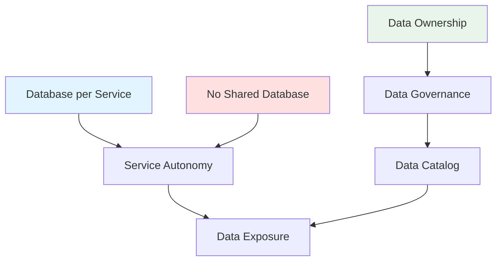

# Arquitectura de Datos

## Contexto

Este estándar consolida las prácticas fundamentales para diseñar una arquitectura de datos descentralizada en microservicios, asegurando autonomía, ownership claro y governanza efectiva. Complementa el lineamiento [Datos por Dominio](../../lineamientos/datos/01-datos-por-dominio.md).

**Conceptos incluidos:**

- **Database per Service** → Cada servicio posee su base de datos
- **No Shared Database** → Prohibir acceso directo entre servicios
- **Data Ownership** → Definir propietarios de dominios de datos
- **Data Governance** → Políticas, calidad y cumplimiento
- **Data Catalog** → Catálogo centralizado de assets de datos
- **Data Exposure** → Estrategias para exponer datos de forma controlada

---

## Stack Tecnológico

| Componente         | Tecnología            | Versión | Uso                     |
| ------------------ | --------------------- | ------- | ----------------------- |
| **Bases de Datos** | PostgreSQL            | 15+     | Base de datos principal |
| **Bases de Datos** | Oracle                | 19c     | Sistemas legacy         |
| **Bases de Datos** | SQL Server            | 2022    | Sistemas legacy         |
| **ORM**            | Entity Framework Core | 8.0+    | Data access layer       |
| **Migraciones**    | EF Core Migrations    | 8.0+    | Schema migrations       |
| **Cache**          | Redis                 | 7.2+    | Cache distribuido       |
| **Event Store**    | PostgreSQL            | 15+     | Event sourcing          |
| **Data Catalog**   | Custom / OpenMetadata | -       | Catálogo de metadatos   |

---

## Conceptos Fundamentales

Este estándar cubre 6 aspectos de arquitectura de datos:

### Índice de Conceptos

1. **Database per Service**: Autonomía de datos por servicio
2. **No Shared Database**: Aislamiento y desacoplamiento
3. **Data Ownership**: Ownership y responsabilidad clara
4. **Data Governance**: Políticas y cumplimiento
5. **Data Catalog**: Descubrimiento y documentación
6. **Data Exposure**: Estrategias de exposición controlada

### Relación entre Conceptos



**Cuándo aplicar:**

- **Database per Service**: Siempre en microservicios
- **No Shared Database**: Obligatorio para desacoplamiento
- **Data Ownership**: Desde diseño inicial
- **Data Governance**: Para cumplimiento y calidad
- **Data Catalog**: En organizaciones con múltiples equipos
- **Data Exposure**: Para compartir datos entre servicios

---

## 1. Database per Service

### ¿Qué es Database per Service?

Patrón arquitectónico donde cada microservicio posee y gestiona su propia base de datos, sin compartir esquemas con otros servicios.

**Principios:**

- **Autonomía**: Servicio controla su esquema y datos
- **Desacoplamiento**: Cambios de esquema no afectan otros servicios
- **Tecnología apropiada**: Cada servicio elige su DB óptima
- **Escalabilidad independiente**: Escalar DB sin afectar otros

**Propósito:** Maximizar autonomía, minimizar acoplamiento, permitir evolución independiente.

**Beneficios:**
✅ Autonomía de equipos
✅ Evolución independiente del esquema
✅ Escalabilidad por servicio
✅ Tolerancia a fallos aislada
✅ Optimización tecnológica por caso de uso

**Desafíos:**
⚠️ Transacciones distribuidas
⚠️ Consistencia eventual
⚠️ Joins entre servicios
⚠️ Reportería compleja

### Ejemplo Comparativo

```csharp
// ❌ MALO: Base de datos compartida
// CustomerService y OrderService acceden a misma DB

// CustomerService
public class CustomerRepository
{
    private readonly SharedDbContext _context; // ❌ DB compartida

    public async Task<Customer> GetByIdAsync(Guid id)
    {
        return await _context.Customers.FindAsync(id);
    }
}

// OrderService
public class OrderService
{
    private readonly SharedDbContext _context; // ❌ Acceso directo a Customers

    public async Task<Order> CreateOrderAsync(CreateOrderRequest request)
    {
        // ❌ MALO: Join directo entre servicios
        var customer = await _context.Customers.FindAsync(request.CustomerId);
        var order = new Order { Customer = customer }; // ❌ Acoplamiento fuerte
        return order;
    }
}

// ✅ BUENO: Database per service

// CustomerService - CustomerDbContext
public class CustomerDbContext : DbContext
{
    public DbSet<Customer> Customers { get; set; }

    protected override void OnConfiguring(DbContextOptionsBuilder options)
    {
        options.UseNpgsql("Host=customer-db;Database=customers");
    }
}

public class CustomerRepository
{
    private readonly CustomerDbContext _context; // ✅ DB propia

    public async Task<Customer> GetByIdAsync(Guid id)
    {
        return await _context.Customers.FindAsync(id);
    }
}

// OrderService - OrderDbContext (separado)
public class OrderDbContext : DbContext
{
    public DbSet<Order> Orders { get; set; }

    protected override void OnConfiguring(DbContextOptionsBuilder options)
    {
        options.UseNpgsql("Host=order-db;Database=orders");
    }
}

public class OrderService
{
    private readonly OrderDbContext _orderContext; // ✅ DB propia
    private readonly ICustomerApiClient _customerClient; // ✅ API call, no DB directa

    public async Task<Order> CreateOrderAsync(CreateOrderRequest request)
    {
        // ✅ BUENO: Validar vía API
        var customer = await _customerClient.GetByIdAsync(request.CustomerId);

        // ✅ Guardar solo ID, no toda la entidad
        var order = new Order
        {
            CustomerId = request.CustomerId,
            CustomerName = customer.Name // ✅ Snapshot de datos necesarios
        };

        _orderContext.Orders.Add(order);
        await _orderContext.SaveChangesAsync();

        return order;
    }
}
```

### Implementación

```csharp
// Program.cs - Configuración por servicio

// CustomerService
var builder = WebApplication.CreateBuilder(args);

builder.Services.AddDbContext<CustomerDbContext>(options =>
{
    options.UseNpgsql(
        builder.Configuration.GetConnectionString("CustomerDatabase"),
        npgsqlOptions =>
        {
            npgsqlOptions.EnableRetryOnFailure(
                maxRetryCount: 3,
                maxRetryDelay: TimeSpan.FromSeconds(5),
                errorCodesToAdd: null);

            npgsqlOptions.CommandTimeout(30);
        });

    options.EnableSensitiveDataLogging(builder.Environment.IsDevelopment());
    options.EnableDetailedErrors(builder.Environment.IsDevelopment());
});

// Connection string en appsettings.json
{
  "ConnectionStrings": {
    "CustomerDatabase": "Host=customer-db.internal;Port=5432;Database=customers;Username=customer_user;Password=***"
  }
}

// Entidades propias del servicio
public class Customer
{
    public Guid Id { get; set; }
    public string Name { get; set; } = default!;
    public string Email { get; set; } = default!;
    public string? Phone { get; set; }
    public DateTime CreatedAt { get; set; }
    public DateTime? UpdatedAt { get; set; }
}

public class CustomerDbContext : DbContext
{
    public CustomerDbContext(DbContextOptions<CustomerDbContext> options)
        : base(options)
    {
    }

    public DbSet<Customer> Customers => Set<Customer>();

    protected override void OnModelCreating(ModelBuilder modelBuilder)
    {
        modelBuilder.HasDefaultSchema("customer");

        modelBuilder.Entity<Customer>(entity =>
        {
            entity.ToTable("customers");
            entity.HasKey(e => e.Id);

            entity.Property(e => e.Name)
                .IsRequired()
                .HasMaxLength(100);

            entity.Property(e => e.Email)
                .IsRequired()
                .HasMaxLength(254);

            entity.HasIndex(e => e.Email)
                .IsUnique();

            entity.Property(e => e.CreatedAt)
                .HasDefaultValueSql("CURRENT_TIMESTAMP");
        });
    }
}
```

### Migraciones Independientes

```bash
# Cada servicio gestiona sus propias migraciones

# CustomerService
cd src/CustomerService
dotnet ef migrations add InitialCreate --context CustomerDbContext
dotnet ef database update --context CustomerDbContext

# OrderService (independiente)
cd src/OrderService
dotnet ef migrations add InitialCreate --context OrderDbContext
dotnet ef database update --context OrderDbContext
```

---

## 2. No Shared Database

### ¿Qué es No Shared Database?

Principio arquitectónico que prohíbe el acceso directo a las bases de datos de otros servicios.

**Reglas:**

- **Prohibido**: Acceso directo a DB de otro servicio
- **Prohibido**: Schemas compartidos entre servicios
- **Prohibido**: Joins cross-database
- **Permitido**: Comunicación vía APIs
- **Permitido**: Eventos asincrónicos
- **Permitido**: Read replicas (solo lectura, mismo servicio)

**Propósito:** Garantizar desacoplamiento, autonomía y evolvability.

**Beneficios:**
✅ Desacoplamiento total entre servicios
✅ Cambios de esquema sin breaking changes
✅ Seguridad mejorada (acceso controlado)
✅ Escalabilidad independiente

### Antipatrones Comunes

```csharp
// ❌ ANTIPATRÓN 1: Shared Database Connection
public class OrderService
{
    // ❌ MALO: Connection string de otro servicio
    private const string CustomerDbConnection = "Host=customer-db;Database=customers;...";

    public async Task<Order> CreateOrder(Guid customerId)
    {
        using var customerConnection = new NpgsqlConnection(CustomerDbConnection);
        await customerConnection.OpenAsync();

        // ❌ Query directa a tabla de otro servicio
        var customer = await customerConnection.QueryFirstAsync<Customer>(
            "SELECT * FROM customers WHERE id = @Id",
            new { Id = customerId });

        // Crear orden...
    }
}

// ❌ ANTIPATRÓN 2: Shared Schema
public class SharedDbContext : DbContext
{
    public DbSet<Customer> Customers { get; set; } // ❌ Entidad de otro dominio
    public DbSet<Order> Orders { get; set; }
}

// ❌ ANTIPATRÓN 3: Foreign Key entre servicios
public class Order
{
    public Guid Id { get; set; }

    // ❌ MALO: FK a tabla de otro servicio
    [ForeignKey("Customer")]
    public Guid CustomerId { get; set; }
    public Customer Customer { get; set; } // ❌ Navigation property cross-service
}

// ✅ BUENO: Comunicación vía API

public interface ICustomerApiClient
{
    Task<CustomerDto?> GetByIdAsync(Guid id);
    Task<bool> ExistsAsync(Guid id);
}

public class CustomerApiClient : ICustomerApiClient
{
    private readonly HttpClient _httpClient;
    private readonly ILogger<CustomerApiClient> _logger;

    public CustomerApiClient(HttpClient httpClient, ILogger<CustomerApiClient> logger)
    {
        _httpClient = httpClient;
        _logger = logger;
    }

    public async Task<CustomerDto?> GetByIdAsync(Guid id)
    {
        try
        {
            var response = await _httpClient.GetAsync($"/api/v1/customers/{id}");

            if (!response.IsSuccessStatusCode)
            {
                if (response.StatusCode == System.Net.HttpStatusCode.NotFound)
                    return null;

                response.EnsureSuccessStatusCode();
            }

            return await response.Content.ReadFromJsonAsync<CustomerDto>();
        }
        catch (Exception ex)
        {
            _logger.LogError(ex, "Error al obtener cliente {CustomerId}", id);
            throw;
        }
    }

    public async Task<bool> ExistsAsync(Guid id)
    {
        var response = await _httpClient.SendAsync(
            new HttpRequestMessage(HttpMethod.Head, $"/api/v1/customers/{id}"));

        return response.IsSuccessStatusCode;
    }
}

// Entidad de Order solo con referencia, no navegación
public class Order
{
    public Guid Id { get; set; }

    // ✅ BUENO: Solo ID de referencia
    public Guid CustomerId { get; set; }

    // ✅ Snapshot de datos para desnormalización
    public string CustomerName { get; set; } = default!;
    public string CustomerEmail { get; set; } = default!;

    public List<OrderItem> Items { get; set; } = new();
    public decimal TotalAmount { get; set; }
    public DateTime CreatedAt { get; set; }
}

// Uso en servicio
public class OrderService
{
    private readonly OrderDbContext _context;
    private readonly ICustomerApiClient _customerClient;

    public async Task<Order> CreateOrderAsync(CreateOrderRequest request)
    {
        // ✅ Validar vía API
        var customer = await _customerClient.GetByIdAsync(request.CustomerId);

        if (customer == null)
            throw new NotFoundException("Customer", request.CustomerId);

        // ✅ Crear con snapshot de datos
        var order = new Order
        {
            Id = Guid.NewGuid(),
            CustomerId = request.CustomerId,
            CustomerName = customer.Name,
            CustomerEmail = customer.Email,
            Items = request.Items,
            CreatedAt = DateTime.UtcNow
        };

        _context.Orders.Add(order);
        await _context.SaveChangesAsync();

        return order;
    }
}
```

### Configuración de API Clients

```csharp
// Program.cs - Configurar HTTP clients

builder.Services.AddHttpClient<ICustomerApiClient, CustomerApiClient>(client =>
{
    client.BaseAddress = new Uri(builder.Configuration["Services:CustomerApi"]!);
    client.DefaultRequestHeaders.Add("Accept", "application/json");
    client.Timeout = TimeSpan.FromSeconds(10);
})
.AddPolicyHandler(GetRetryPolicy())
.AddPolicyHandler(GetCircuitBreakerPolicy());

// appsettings.json
{
  "Services": {
    "CustomerApi": "https://customer-service.internal/api"
  }
}

// Políticas de resiliencia
static IAsyncPolicy<HttpResponseMessage> GetRetryPolicy()
{
    return HttpPolicyExtensions
        .HandleTransientHttpError()
        .WaitAndRetryAsync(3, retryAttempt =>
            TimeSpan.FromSeconds(Math.Pow(2, retryAttempt)));
}

static IAsyncPolicy<HttpResponseMessage> GetCircuitBreakerPolicy()
{
    return HttpPolicyExtensions
        .HandleTransientHttpError()
        .CircuitBreakerAsync(5, TimeSpan.FromSeconds(30));
}
```

---

## 3. Data Ownership

### ¿Qué es Data Ownership?

Definición clara de qué equipo/servicio es el propietario (owner) y autoridad sobre un dominio de datos específico.

**Responsabilidades del Owner:**

- **Esquema**: Diseño y evolución del modelo de datos
- **Calidad**: Garantizar integridad y precisión
- **Acceso**: Definir APIs y contratos de exposición
- **Lifecycle**: Retención, archivado y eliminación
- **Documentación**: Mantener catálogo actualizado
- **SLAs**: Garantizar disponibilidad y performance

**Propósito:** Claridad en responsabilidades, accountability, evitar datos huérfanos.

**Beneficios:**
✅ Responsabilidad clara
✅ Calidad de datos mejorada
✅ Evolución coordinada
✅ Soporte y troubleshooting eficiente

### Matriz de Ownership

```markdown
## Data Ownership Matrix

| Dominio de Datos | Owner (Equipo) | Owner (Servicio)  | Tipo de Datos         | Exposición        |
| ---------------- | -------------- | ----------------- | --------------------- | ----------------- |
| Customers        | Team Apollo    | customer-service  | Master data           | API REST + Events |
| Orders           | Team Commerce  | order-service     | Transactional data    | API REST + Events |
| Products         | Team Catalog   | product-service   | Master data           | API REST          |
| Inventory        | Team Warehouse | inventory-service | Real-time operational | API REST + Events |
| Invoices         | Team Billing   | billing-service   | Financial records     | API REST          |
| Analytics        | Team Data      | analytics-service | Aggregated/derived    | API REST          |
| Audit Logs       | Team Platform  | audit-service     | Compliance logs       | Query API         |

## Responsabilidades por Equipo

### Team Apollo (Customers)

**Datos que posee:**

- Customer profiles
- Contact information
- KYC documents
- Customer preferences

**APIs expuestas:**

- `GET /api/v1/customers/{id}`
- `POST /api/v1/customers`
- `PUT /api/v1/customers/{id}`
- `DELETE /api/v1/customers/{id}`

**Eventos publicados:**

- `customers.customer.created.v1`
- `customers.customer.updated.v1`
- `customers.customer.deleted.v1`

**SLAs:**

- Availability: 99.9%
- Latency P95: < 200ms
- Latency P99: < 500ms

**Punto de contacto:**

- Email: team-apollo@talma.com
- Slack: #team-apollo
```

### Implementación: Ownership Metadata

```csharp
// Documentar ownership en código
[DataOwnership(
    Owner = "Team Apollo",
    Service = "customer-service",
    Domain = "Customers",
    DataClassification = "PII",
    RetentionPolicy = "7 years",
    BackupFrequency = "Daily"
)]
public class Customer
{
    public Guid Id { get; set; }

    [PII(Type = "Email")]
    public string Email { get; set; } = default!;

    [PII(Type = "Phone")]
    public string? Phone { get; set; }

    public DateTime CreatedAt { get; set; }
}

// Atributo personalizado para documentar
[AttributeUsage(AttributeTargets.Class)]
public class DataOwnershipAttribute : Attribute
{
    public string Owner { get; set; } = default!;
    public string Service { get; set; } = default!;
    public string Domain { get; set; } = default!;
    public string DataClassification { get; set; } = "Internal";
    public string RetentionPolicy { get; set; } = "Indefinite";
    public string BackupFrequency { get; set; } = "Daily";
}

[AttributeUsage(AttributeTargets.Property)]
public class PIIAttribute : Attribute
{
    public string Type { get; set; } = default!;
}
```

---

## 4. Data Governance

### ¿Qué es Data Governance?

Conjunto de políticas, procesos y estándares para gestionar datos como activos corporativos.

**Pilares:**

- **Data Quality**: Precisión, consistencia, completitud
- **Data Security**: Clasificación, encriptación, acceso
- **Data Privacy**: GDPR, CCPA, protección PII
- **Data Lineage**: Trazabilidad origen → transformación → destino
- **Data Lifecycle**: Creación, uso, archivado, eliminación
- **Compliance**: Auditoría, regulaciones, estándares

**Propósito:** Datos confiables, seguros, conformes con regulaciones.

**Beneficios:**
✅ Cumplimiento regulatorio
✅ Calidad de datos mejorada
✅ Reducción de riesgos
✅ Confianza en decisiones basadas en datos

### Clasificación de Datos

```csharp
public enum DataClassification
{
    /// <summary>
    /// Público - Puede ser compartido abiertamente
    /// </summary>
    Public = 0,

    /// <summary>
    /// Interno - Solo para uso interno de la organización
    /// </summary>
    Internal = 1,

    /// <summary>
    /// Confidencial - Datos sensibles del negocio
    /// </summary>
    Confidential = 2,

    /// <summary>
    /// PII - Información Personal Identificable
    /// Requiere protección especial (GDPR, etc.)
    /// </summary>
    PII = 3,

    /// <summary>
    /// Restricted - Altamente confidencial (financiero, legal)
    /// </summary>
    Restricted = 4
}

// Aplicar clasificación
[DataClassification(DataClassification.PII)]
public class Customer
{
    public Guid Id { get; set; }

    [Encrypted]
    [PII]
    public string Email { get; set; } = default!;

    [Encrypted]
    [PII]
    public string? Phone { get; set; }

    [Sensitive]
    public string? TaxId { get; set; }
}

// Políticas por clasificación
public class DataGovernancePolicy
{
    public static Dictionary<DataClassification, PolicyRules> Policies = new()
    {
        {
            DataClassification.Public,
            new PolicyRules
            {
                EncryptionRequired = false,
                MaskingRequired = false,
                AuditLoggingRequired = false,
                RetentionDays = null, // Indefinido
                BackupRequired = true
            }
        },
        {
            DataClassification.PII,
            new PolicyRules
            {
                EncryptionRequired = true,
                MaskingRequired = true,
                AuditLoggingRequired = true,
                RetentionDays = 2555, // 7 años
                BackupRequired = true,
                RightToErasure = true, // GDPR
                ConsentRequired = true
            }
        },
        {
            DataClassification.Restricted,
            new PolicyRules
            {
                EncryptionRequired = true,
                MaskingRequired = true,
                AuditLoggingRequired = true,
                RetentionDays = 3650, // 10 años
                BackupRequired = true,
                AccessRestricted = true
            }
        }
    };
}

public class PolicyRules
{
    public bool EncryptionRequired { get; set; }
    public bool MaskingRequired { get; set; }
    public bool AuditLoggingRequired { get; set; }
    public int? RetentionDays { get; set; }
    public bool BackupRequired { get; set; }
    public bool RightToErasure { get; set; }
    public bool ConsentRequired { get; set; }
    public bool AccessRestricted { get; set; }
}
```

### Data Quality Checks

```csharp
public interface IDataQualityValidator
{
    Task<ValidationResult> ValidateAsync<T>(T entity) where T : class;
}

public class CustomerDataQualityValidator : IDataQualityValidator
{
    public async Task<ValidationResult> ValidateAsync<T>(T entity) where T : class
    {
        if (entity is not Customer customer)
            return ValidationResult.Success();

        var errors = new List<string>();

        // Completitud: campos requeridos
        if (string.IsNullOrWhiteSpace(customer.Name))
            errors.Add("Name is required");

        if (string.IsNullOrWhiteSpace(customer.Email))
            errors.Add("Email is required");

        // Precisión: formato correcto
        if (!IsValidEmail(customer.Email))
            errors.Add("Email format is invalid");

        if (customer.Phone != null && !IsValidPhone(customer.Phone))
            errors.Add("Phone format is invalid");

        // Consistencia: reglas de negocio
        if (customer.CreatedAt > DateTime.UtcNow)
            errors.Add("CreatedAt cannot be in the future");

        // Unicidad: no duplicados (check en BD)
        if (await IsDuplicateEmail(customer.Email, customer.Id))
            errors.Add($"Email {customer.Email} already exists");

        return errors.Any()
            ? ValidationResult.Failure(errors.ToArray())
            : ValidationResult.Success();
    }

    private bool IsValidEmail(string email)
    {
        return Regex.IsMatch(email, @"^[^@\s]+@[^@\s]+\.[^@\s]+$");
    }

    private bool IsValidPhone(string phone)
    {
        return Regex.IsMatch(phone, @"^\+\d{10,15}$");
    }

    private async Task<bool> IsDuplicateEmail(string email, Guid currentId)
    {
        // Check en base de datos
        return false; // Simplificado
    }
}
```

---

## 5. Data Catalog

### ¿Qué es un Data Catalog?

Inventario centralizado de todos los assets de datos en la organización con sus metadatos, ownership y lineage.

**Componentes:**

- **Metadata**: Descripción, esquema, tipo de datos
- **Ownership**: Equipo responsable, contacto
- **Lineage**: Origen, transformaciones, destinos
- **Quality Metrics**: Completitud, precisión, frescura
- **Access Control**: Quién puede acceder
- **Sample Data**: Ejemplos para desarrolladores

**Propósito:** Descubrimiento de datos, documentación viva, gobierno centralizado.

**Beneficios:**
✅ Descubrimiento fácil de datos
✅ Documentación centralizada
✅ Trazabilidad completa
✅ Reducción de datos duplicados
✅ Compliance mejorado

### Estructura del Catálogo

```yaml
# data-catalog.yaml - Catálogo de datos corporativo

datasets:
  - id: customers
    name: Customers
    domain: Customer Management
    owner:
      team: Team Apollo
      contact: team-apollo@talma.com
    service: customer-service
    database:
      type: postgresql
      host: customer-db.internal
      database: customers
      schema: customer

    tables:
      - name: customers
        description: Master data de clientes
        classification: PII
        columns:
          - name: id
            type: uuid
            primary_key: true
            description: Identificador único del cliente

          - name: name
            type: varchar(100)
            nullable: false
            description: Nombre completo del cliente

          - name: email
            type: varchar(254)
            nullable: false
            unique: true
            pii: true
            description: Email del cliente (PII)

          - name: phone
            type: varchar(20)
            nullable: true
            pii: true
            description: Teléfono en formato E.164 (PII)

          - name: created_at
            type: timestamp
            nullable: false
            default: CURRENT_TIMESTAMP
            description: Fecha de creación del registro

        indexes:
          - name: idx_customers_email
            columns: [email]
            unique: true

          - name: idx_customers_created_at
            columns: [created_at]

        sample_data:
          - id: "f7c8e3a1-2b4d-4e6f-9a8b-1c2d3e4f5a6b"
            name: "Acme Corporation"
            email: "contact@acme.com"
            phone: "+51987654321"
            created_at: "2026-01-15T10:30:00Z"

    apis:
      - endpoint: GET /api/v1/customers/{id}
        description: Obtiene un cliente por ID
        authentication: Bearer token
        rate_limit: 100 req/min

      - endpoint: POST /api/v1/customers
        description: Crea un nuevo cliente
        authentication: Bearer token

    events:
      - type: customers.customer.created.v1
        description: Cliente creado
        topic: customers-events
        schema_url: https://docs.talma.com/schemas/customer-created-v1.json

    quality_metrics:
      completeness: 99.8%
      accuracy: 99.5%
      freshness: Real-time
      uniqueness: 100%

    retention_policy:
      duration: 7 years
      archive_after: 2 years
      deletion_strategy: Soft delete

    access_control:
      - role: customer-service
        permissions: [read, write, delete]
      - role: order-service
        permissions: [read]
      - role: analytics-service
        permissions: [read]

  - id: orders
    name: Orders
    domain: Order Management
    owner:
      team: Team Commerce
      contact: team-commerce@talma.com
    # ... similar structure
```

### API para Data Catalog

```csharp
// Data Catalog Service

public interface IDataCatalogService
{
    Task<DatasetMetadata?> GetDatasetAsync(string datasetId);
    Task<IEnumerable<DatasetMetadata>> SearchDatasetsAsync(string query);
    Task<DataLineage> GetDataLineageAsync(string datasetId);
}

public record DatasetMetadata
{
    public string Id { get; init; } = default!;
    public string Name { get; init; } = default!;
    public string Domain { get; init; } = default!;
    public OwnerInfo Owner { get; init; } = default!;
    public string Service { get; init; } = default!;
    public DatabaseInfo Database { get; init; } = default!;
    public TableMetadata[] Tables { get; init; } = Array.Empty<TableMetadata>();
    public ApiEndpoint[] Apis { get; init; } = Array.Empty<ApiEndpoint>();
    public EventMetadata[] Events { get; init; } = Array.Empty<EventMetadata>();
    public QualityMetrics QualityMetrics { get; init; } = default!;
}

public record TableMetadata
{
    public string Name { get; init; } = default!;
    public string Description { get; init; } = default!;
    public DataClassification Classification { get; init; }
    public ColumnMetadata[] Columns { get; init; } = Array.Empty<ColumnMetadata>();
}

public record ColumnMetadata
{
    public string Name { get; init; } = default!;
    public string Type { get; init; } = default!;
    public bool Nullable { get; init; }
    public bool PrimaryKey { get; init; }
    public bool Unique { get; init; }
    public bool Pii { get; init; }
    public string Description { get; init; } = default!;
}

// Controller para consultar catálogo
[ApiController]
[Route("api/v1/data-catalog")]
public class DataCatalogController : ControllerBase
{
    private readonly IDataCatalogService _catalogService;

    [HttpGet("datasets/{id}")]
    public async Task<ActionResult<DatasetMetadata>> GetDataset(string id)
    {
        var dataset = await _catalogService.GetDatasetAsync(id);
        return dataset != null ? Ok(dataset) : NotFound();
    }

    [HttpGet("datasets/search")]
    public async Task<ActionResult<IEnumerable<DatasetMetadata>>> SearchDatasets(
        [FromQuery] string query)
    {
        var datasets = await _catalogService.SearchDatasetsAsync(query);
        return Ok(datasets);
    }

    [HttpGet("datasets/{id}/lineage")]
    public async Task<ActionResult<DataLineage>> GetLineage(string id)
    {
        var lineage = await _catalogService.GetDataLineageAsync(id);
        return Ok(lineage);
    }
}
```

---

## 6. Data Exposure

### ¿Qué es Data Exposure?

Estrategias y patrones para exponer datos de un servicio a otros servicios de forma controlada y segura.

**Estrategias:**

| Estrategia           | Cuándo usar                  | Pros                   | Contras                 |
| -------------------- | ---------------------------- | ---------------------- | ----------------------- |
| **REST API**         | Queries simples, CRUD        | Simple, estándar       | Overhead HTTP           |
| **GraphQL**          | Queries flexibles, múltiples | Flexible, eficiente    | Complejidad             |
| **Events (Async)**   | Notificaciones, eventual     | Desacoplado, escalable | Consistencia eventual   |
| **Data Replication** | Analytics, reporting         | Performance queries    | Duplicación, sync       |
| **Read Replicas**    | Alto volumen lectura         | Escalabilidad lectura  | Lag replicación         |
| **API Gateway**      | Aggregation, composition     | Fachada unificada      | Single point of failure |

**Propósito:** Balance entre autonomía y necesidad de datos compartidos.

**Beneficios:**
✅ Acceso controlado
✅ Versionamiento explícito
✅ Monitoreo y throttling
✅ Seguridad centralizada

### Patrón 1: REST API Exposure

```csharp
// Exponer datos vía API REST

[ApiController]
[Route("api/v{version:apiVersion}/customers")]
[Authorize]
public class CustomersController : ControllerBase
{
    private readonly ICustomerService _customerService;

    // Query individual
    [HttpGet("{id}")]
    [ProducesResponseType(typeof(CustomerDto), 200)]
    [ProducesResponseType(404)]
    public async Task<ActionResult<CustomerDto>> GetById(Guid id)
    {
        var customer = await _customerService.GetByIdAsync(id);
        return customer != null ? Ok(customer) : NotFound();
    }

    // Query por IDs (batch)
    [HttpGet("batch")]
    [ProducesResponseType(typeof(CustomerDto[]), 200)]
    public async Task<ActionResult<CustomerDto[]>> GetByIds(
        [FromQuery] Guid[] ids)
    {
        var customers = await _customerService.GetByIdsAsync(ids);
        return Ok(customers);
    }

    // Query con filtros
    [HttpGet("search")]
    [ProducesResponseType(typeof(PagedResult<CustomerDto>), 200)]
    public async Task<ActionResult<PagedResult<CustomerDto>>> Search(
        [FromQuery] string? email = null,
        [FromQuery] string? name = null,
        [FromQuery] int page = 1,
        [FromQuery] int pageSize = 20)
    {
        var result = await _customerService.SearchAsync(email, name, page, pageSize);
        return Ok(result);
    }

    // Validación de existencia (HEAD)
    [HttpHead("{id}")]
    [ProducesResponseType(200)]
    [ProducesResponseType(404)]
    public async Task<IActionResult> Exists(Guid id)
    {
        var exists = await _customerService.ExistsAsync(id);
        return exists ? Ok() : NotFound();
    }
}
```

### Patrón 2: Event-Driven Exposure

```csharp
// Exponer cambios vía eventos

public class CustomerService : ICustomerService
{
    private readonly CustomerDbContext _context;
    private readonly IEventPublisher _eventPublisher;

    public async Task<Customer> CreateAsync(CreateCustomerRequest request)
    {
        var customer = new Customer
        {
            Id = Guid.NewGuid(),
            Name = request.Name,
            Email = request.Email,
            CreatedAt = DateTime.UtcNow
        };

        _context.Customers.Add(customer);
        await _context.SaveChangesAsync();

        // ✅ Publicar evento para consumidores
        await _eventPublisher.PublishAsync(new CustomerCreatedEvent
        {
            EventId = Ulid.NewUlid().ToString(),
            EventType = "customers.customer.created.v1",
            Timestamp = DateTimeOffset.UtcNow,
            CorrelationId = Activity.Current?.Id ?? Guid.NewGuid().ToString(),
            SchemaVersion = "1.0",
            Source = new EventSource
            {
                Service = "customer-service",
                Version = "1.0.0"
            },
            Subject = new EventSubject
            {
                Type = "Customer",
                Id = customer.Id.ToString()
            },
            Data = new CustomerCreatedData
            {
                CustomerId = customer.Id,
                Name = customer.Name,
                Email = customer.Email,
                CreatedAt = customer.CreatedAt
            }
        });

        return customer;
    }
}

// Otros servicios consumen eventos
public class OrderCustomerSyncHandler : IEventHandler<CustomerCreatedEvent>
{
    private readonly OrderDbContext _context;

    public async Task HandleAsync(CustomerCreatedEvent @event, CancellationToken ct)
    {
        // ✅ Mantener snapshot local de datos necesarios
        var customerSnapshot = new CustomerSnapshot
        {
            CustomerId = @event.Data.CustomerId,
            Name = @event.Data.Name,
            Email = @event.Data.Email,
            LastUpdated = @event.Timestamp.UtcDateTime
        };

        _context.CustomerSnapshots.Add(customerSnapshot);
        await _context.SaveChangesAsync(ct);
    }
}
```

### Patrón 3: Data Replication (Analytics)

```csharp
// Replicación para analytics/reporting

// Servicio Analytics tiene réplica read-only
public class AnalyticsDbContext : DbContext
{
    // ✅ Connection string a read replica
    protected override void OnConfiguring(DbContextOptionsBuilder options)
    {
        options.UseNpgsql("Host=analytics-replica.internal;Database=analytics_replica;...");
    }

    // Vistas materializadas sincronizadas
    public DbSet<CustomerAnalyticsView> CustomerAnalytics { get; set; }
    public DbSet<OrderAnalyticsView> OrderAnalytics { get; set; }
}

public class CustomerAnalyticsView
{
    public Guid CustomerId { get; set; }
    public string Name { get; set; } = default!;
    public string Email { get; set; } = default!;
    public int TotalOrders { get; set; }
    public decimal TotalSpent { get; set; }
    public DateTime LastOrderDate { get; set; }
    public DateTime SyncedAt { get; set; }
}

// Proceso de sincronización
public class AnalyticsReplicationService
{
    public async Task SyncCustomerAnalyticsAsync()
    {
        // Leer desde fuentes primarias vía API
        var customers = await _customerApiClient.GetAllAsync();
        var orders = await _orderApiClient.GetAllAsync();

        // Construir vista agregada
        var analytics = customers.Select(c => new CustomerAnalyticsView
        {
            CustomerId = c.Id,
            Name = c.Name,
            Email = c.Email,
            TotalOrders = orders.Count(o => o.CustomerId == c.Id),
            TotalSpent = orders.Where(o => o.CustomerId == c.Id).Sum(o => o.TotalAmount),
            LastOrderDate = orders.Where(o => o.CustomerId == c.Id).Max(o => o.CreatedAt),
            SyncedAt = DateTime.UtcNow
        });

        // Guardar en réplica
        await _analyticsContext.CustomerAnalytics.UpsertRange(analytics).RunAsync();
    }
}
```

---

## Implementación Integrada

### Ejemplo: Sistema Multi-DB con Ownership Claro

```csharp
// docker-compose.yml - Bases de datos separadas

version: '3.8'

services:
  customer-db:
    image: postgres:15
    environment:
      POSTGRES_DB: customers
      POSTGRES_USER: customer_user
      POSTGRES_PASSWORD: customer_pass
    volumes:
      - customer-data:/var/lib/postgresql/data
    networks:
      - backend

  order-db:
    image: postgres:15
    environment:
      POSTGRES_DB: orders
      POSTGRES_USER: order_user
      POSTGRES_PASSWORD: order_pass
    volumes:
      - order-data:/var/lib/postgresql/data
    networks:
      - backend

  product-db:
    image: postgres:15
    environment:
      POSTGRES_DB: products
      POSTGRES_USER: product_user
      POSTGRES_PASSWORD: product_pass
    volumes:
      - product-data:/var/lib/postgresql/data
    networks:
      - backend

volumes:
  customer-data:
  order-data:
  product-data:

networks:
  backend:
```

---

## Requisitos Técnicos

### MUST (Obligatorio)

**Database per Service:**

- **MUST** cada microservicio tener su propia base de datos
- **MUST** usar esquemas separados incluso si comparten servidor físico
- **MUST** gestionar migraciones independientemente por servicio

**No Shared Database:**

- **MUST NOT** acceder directamente a base de datos de otro servicio
- **MUST NOT** compartir esquemas entre servicios
- **MUST NOT** usar foreign keys entre bases de datos de servicios diferentes
- **MUST** comunicarse vía APIs o eventos para obtener datos de otros servicios

**Data Ownership:**

- **MUST** definir ownership claro para cada dominio de datos
- **MUST** documentar owner en catálogo de datos
- **MUST** owner aprobar cambios en esquema/APIs

**Data Governance:**

- **MUST** clasificar todos los datos (Public, Internal, Confidential, PII, Restricted)
- **MUST** encriptar datos PII en reposo
- **MUST** enmascarar datos PII en logs
- **MUST** implementar políticas de retención según clasificación

**Data Catalog:**

- **MUST** registrar todos los datasets en catálogo centralizado
- **MUST** mantener catálogo actualizado con cambios de esquema
- **MUST** documentar APIs y eventos para exposición de datos

**Data Exposure:**

- **MUST** exponer datos vía APIs versionadas
- **MUST** implementar autenticación/autorización en APIs
- **MUST** publicar eventos para cambios en datos maestros

### SHOULD (Fuertemente recomendado)

- **SHOULD** usar diferentes tecnologías de DB según caso de uso (PostgreSQL, Redis, etc.)
- **SHOULD** implementar read replicas para alta carga de lectura
- **SHOULD** usar connection pooling
- **SHOULD** implementar health checks para bases de datos
- **SHOULD** monitorear métricas de DB (latency, connections, errors)
- **SHOULD** implementar data quality checks
- **SHOULD** documentar data lineage
- **SHOULD** automatizar backups con retención apropiada

### MAY (Opcional)

- **MAY** usar Event Sourcing para dominios complejos
- **MAY** implementar CQRS para separar lecturas/escrituras
- **MAY** usar GraphQL para queries flexibles
- **MAY** implementar API Gateway para composición
- **MAY** usar Schema Registry para versionamiento de eventos

### MUST NOT (Prohibido)

- **MUST NOT** compartir connection strings entre servicios
- **MUST NOT** hacer joins cross-database
- **MUST NOT** usar transacciones distribuidas (2PC) sin justificación clara
- **MUST NOT** exponer datos sin control de acceso
- **MUST NOT** almacenar PII sin encriptación

---

## Referencias

**Patrones:**

- [Database per Service Pattern](https://microservices.io/patterns/data/database-per-service.html)
- [Shared Database Anti-Pattern](https://microservices.io/patterns/data/shared-database.html)
- [Event-driven Architecture](https://martinfowler.com/articles/201701-event-driven.html)

**Documentación:**

- [Entity Framework Core](https://learn.microsoft.com/ef/core/)
- [PostgreSQL](https://www.postgresql.org/docs/)
- [Data Governance Framework](https://www.dama.org/cpages/body-of-knowledge)

**Relacionados:**

- [Consistencia de Datos](./data-consistency.md)
- [Estándares de Base de Datos](./database-standards.md)
- [Comunicación Asíncrona y Eventos](../../lineamientos/arquitectura/08-comunicacion-asincrona-y-eventos.md)
- [Contratos de Eventos](../../mensajeria/event-contracts.md)

---

**Última actualización**: 18 de febrero de 2026
**Responsable**: Equipo de Arquitectura
