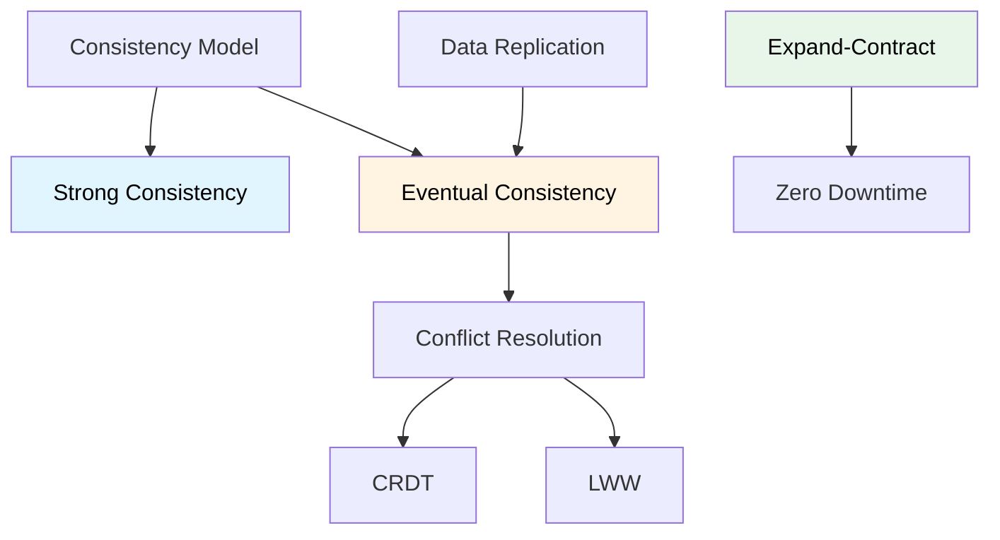

# Consistencia de Datos

## Contexto

Este estándar define cómo manejar consistencia en sistemas distribuidos con múltiples bases de datos, incluyendo modelos de consistencia, estrategias de replicación, resolución de conflictos y evolución de esquemas sin downtime. Complementa el lineamiento [Consistencia y Sincronización](../../lineamientos/datos/02-consistencia-y-sincronizacion.md).

**Conceptos incluidos:**

- **Consistency Models** → Fuerte, eventual, causal
- **Conflict Resolution** → Estrategias para resolver conflictos
- **Data Replication** → Replicación síncrona y asíncrona
- **Expand-Contract Pattern** → Evolución de esquemas sin breaking changes

---

## Stack Tecnológico

| Componente        | Tecnología            | Versión | Uso                        |
| ----------------- | --------------------- | ------- | -------------------------- |
| **Base de Datos** | PostgreSQL            | 15+     | Transacciones ACID         |
| **Mensajería**    | Apache Kafka          | 3.6+    | Garantías de entrega       |
| **ORM**           | Entity Framework Core | 8.0+    | Transacciones, migraciones |
| **Cache**         | Redis                 | 7.2+    | Consistencia eventual      |
| **Saga**          | MassTransit / Manual  | 8.0+    | Sagas distribuidas         |

---

## Relación entre Conceptos



---

## Consistency Models

### ¿Qué son los Modelos de Consistencia?

Definición del nivel de garantías sobre el estado de los datos en un sistema distribuido.

**Modelos:**

| Modelo                   | Garantía                               | Cuándo usar               | Trade-offs               |
| ------------------------ | -------------------------------------- | ------------------------- | ------------------------ |
| **Strong Consistency**   | Todos ven mismos datos inmediatamente  | Transacciones financieras | Latencia, disponibilidad |
| **Eventual Consistency** | Todos verán mismos datos eventualmente | Redes sociales, catálogos | Conflictos temporales    |
| **Causal Consistency**   | Operaciones causales en orden          | Chat, colaboración        | Complejidad              |
| **Read-after-Write**     | Usuario ve sus propios cambios         | UX mejorada               | Complejidad routing      |

**Propósito:** Balance entre consistencia, disponibilidad y performance según CAP theorem.

**Beneficios (Eventual):**
✅ Alta disponibilidad
✅ Baja latencia
✅ Tolerancia a particiones
✅ Escalabilidad horizontal

### Strong Consistency: Transacciones ACID

```csharp
// Usar para operaciones críticas dentro de un servicio

public class OrderService
{
    private readonly OrderDbContext _context;

    public async Task<Order> CreateOrderAsync(CreateOrderRequest request)
    {
        // ✅ Usar transaction para consistencia fuerte
        using var transaction = await _context.Database.BeginTransactionAsync();

        try
        {
            // Crear orden
            var order = new Order
            {
                Id = Guid.NewGuid(),
                CustomerId = request.CustomerId,
                CreatedAt = DateTime.UtcNow
            };

            _context.Orders.Add(order);

            // Crear items
            foreach (var item in request.Items)
            {
                var orderItem = new OrderItem
                {
                    Id = Guid.NewGuid(),
                    OrderId = order.Id,
                    ProductId = item.ProductId,
                    Quantity = item.Quantity,
                    UnitPrice = item.UnitPrice
                };

                _context.OrderItems.Add(orderItem);

                // ✅ Reservar en tabla local del servicio (NO es la DB de InventoryService)
                // OrderService mantiene un ledger propio de reservas dentro de su misma DB
                var reservation = await _context.InventoryReservations
                    .FirstOrDefaultAsync(r => r.ProductId == item.ProductId);

                if (reservation == null || reservation.Available < item.Quantity)
                    throw new InsufficientInventoryException(item.ProductId);

                reservation.Available -= item.Quantity;
                reservation.Reserved += item.Quantity;
            }

            await _context.SaveChangesAsync();

            // ✅ Commit: todo o nada (ACID)
            await transaction.CommitAsync();

            return order;
        }
        catch
        {
            // ✅ Rollback automático
            await transaction.RollbackAsync();
            throw;
        }
    }
}

// Configuración de isolation level
public class OrderDbContext : DbContext
{
    protected override void OnConfiguring(DbContextOptionsBuilder options)
    {
        options.UseNpgsql(
            connectionString,
            npgsqlOptions =>
            {
                // Serializable: máxima consistencia
                npgsqlOptions.ExecutionStrategy(
                    c => new NpgsqlRetryingExecutionStrategy(c, maxRetryCount: 3));
            });
    }

    protected override void OnModelCreating(ModelBuilder modelBuilder)
    {
        // Configurar isolation level por defecto
        modelBuilder.HasDefaultSchema("orders");
    }
}
```

### Eventual Consistency: Event-Driven

```csharp
// Usar eventos para consistencia eventual entre servicios

// Servicio Order publica evento
public class OrderService
{
    private readonly OrderDbContext _context;
    private readonly IEventPublisher _eventPublisher;

    public async Task<Order> CreateOrderAsync(CreateOrderRequest request)
    {
        // 1. Validar customer vía API (puede ser stale, pero ok)
        var customer = await _customerClient.GetByIdAsync(request.CustomerId);
        if (customer == null)
            throw new NotFoundException("Customer", request.CustomerId);

        // 2. Crear orden en base de datos local
        var order = new Order
        {
            Id = Guid.NewGuid(),
            CustomerId = request.CustomerId,
            CustomerName = customer.Name, // Snapshot
            Items = request.Items,
            Status = OrderStatus.Pending,
            CreatedAt = DateTime.UtcNow
        };

        _context.Orders.Add(order);
        await _context.SaveChangesAsync();

        // 3. ✅ Publicar evento (asíncrono)
        await _eventPublisher.PublishAsync(new OrderCreatedEvent
        {
            EventId = Ulid.NewUlid().ToString(),
            EventType = "orders.order.created.v1",
            Timestamp = DateTimeOffset.UtcNow,
            Data = new OrderCreatedData
            {
                OrderId = order.Id,
                CustomerId = order.CustomerId,
                Items = order.Items,
                TotalAmount = order.TotalAmount
            }
        });

        // ✅ Retornar inmediatamente, otros servicios actualizarán eventualmente
        return order;
    }
}

// Servicio Inventory consume evento
public class InventoryOrderHandler : IEventHandler<OrderCreatedEvent>
{
    private readonly InventoryDbContext _context;

    public async Task HandleAsync(OrderCreatedEvent @event, CancellationToken ct)
    {
        // ✅ Procesar asincrónicamente
        foreach (var item in @event.Data.Items)
        {
            var inventory = await _context.Inventory
                .FirstOrDefaultAsync(i => i.ProductId == item.ProductId, ct);

            if (inventory != null)
            {
                // Reservar inventario
                inventory.Available -= item.Quantity;
                inventory.Reserved += item.Quantity;
            }
            else
            {
                // ⚠️ Problema: inventario insuficiente
                // Publicar evento de compensación
                await _eventPublisher.PublishAsync(new OrderReservationFailedEvent
                {
                    OrderId = @event.Data.OrderId,
                    ProductId = item.ProductId,
                    Reason = "Insufficient inventory"
                });
            }
        }

        await _context.SaveChangesAsync(ct);
    }
}

// Order service compensa si falló reserva
public class OrderReservationFailedHandler : IEventHandler<OrderReservationFailedEvent>
{
    private readonly OrderDbContext _context;

    public async Task HandleAsync(OrderReservationFailedEvent @event, CancellationToken ct)
    {
        var order = await _context.Orders.FindAsync(@event.OrderId);

        if (order != null)
        {
            // ✅ Compensar: cancelar orden
            order.Status = OrderStatus.Cancelled;
            order.CancellationReason = @event.Reason;
            await _context.SaveChangesAsync(ct);
        }
    }
}
```

### Read-after-Write Consistency

```csharp
// Garantizar que usuario ve sus propios cambios inmediatamente

public class CustomerService
{
    private readonly CustomerDbContext _context;
    private readonly IDistributedCache _cache;
    private readonly IEventPublisher _eventPublisher;

    public async Task<Customer> UpdateAsync(Guid id, UpdateCustomerRequest request)
    {
        var customer = await _context.Customers.FindAsync(id);

        if (customer == null)
            throw new NotFoundException("Customer", id);

        // Actualizar
        customer.Name = request.Name;
        customer.Email = request.Email;
        customer.UpdatedAt = DateTime.UtcNow;

        await _context.SaveChangesAsync();

        // ✅ Actualizar cache inmediatamente para read-after-write
        var cacheKey = $"customer:{id}";
        await _cache.SetAsync(
            cacheKey,
            customer,
            new DistributedCacheEntryOptions
            {
                AbsoluteExpirationRelativeToNow = TimeSpan.FromMinutes(5)
            });

        // ✅ Publicar evento para otros consumidores (eventual)
        await _eventPublisher.PublishAsync(new CustomerUpdatedEvent
        {
            Data = new CustomerUpdatedData
            {
                CustomerId = id,
                Name = customer.Name,
                Email = customer.Email,
                UpdatedAt = customer.UpdatedAt
            }
        });

        return customer;
    }

    public async Task<Customer?> GetByIdAsync(Guid id)
    {
        var cacheKey = $"customer:{id}";

        // ✅ Intentar leer de cache primero (read-after-write)
        var cached = await _cache.GetAsync<Customer>(cacheKey);
        if (cached != null)
            return cached;

        // Cache miss: leer de DB
        var customer = await _context.Customers.FindAsync(id);

        if (customer != null)
        {
            await _cache.SetAsync(cacheKey, customer,
                new DistributedCacheEntryOptions
                {
                    AbsoluteExpirationRelativeToNow = TimeSpan.FromMinutes(5)
                });
        }

        return customer;
    }
}
```

---

## Conflict Resolution

### ¿Qué es la Resolución de Conflictos?

Estrategias para manejar escrituras concurrentes que resultan en estados inconsistentes.

**Escenarios de conflicto:**

- Múltiples usuarios editando mismo registro
- Réplicas actualizadas independientemente
- Operaciones offline sincronizadas después
- Network partition con escrituras en ambos lados

**Estrategias:**

| Estrategia           | Cómo funciona                 | Cuándo usar              | Pros/Contras              |
| -------------------- | ----------------------------- | ------------------------ | ------------------------- |
| **Last-Write-Wins**  | Timestamp más reciente gana   | Datos no críticos        | Simple / Pérdida de datos |
| **First-Write-Wins** | Primera escritura persiste    | Reservas, tickets        | Previene double-booking   |
| **Merge**            | Combinar cambios manualmente  | Documentos colaborativos | Lógica compleja           |
| **CRDT**             | Data structures conflict-free | Contadores, sets         | Matemáticamente correcto  |
| **Versioning**       | Mantener todas las versiones  | Auditoría, history       | Almacenamiento            |
| **Manual**           | Usuario decide                | Conflictos críticos      | UX compleja               |

**Propósito:** Converger a estado consistente después de escrituras concurrentes.

### Last-Write-Wins (LWW)

```csharp
// Usar timestamp para resolver conflictos

public class Customer
{
    public Guid Id { get; set; }
    public string Name { get; set; } = default!;
    public string Email { get; set; } = default!;

    // ✅ Timestamp para LWW
    public DateTime LastModified { get; set; }

    // ✅ Version para optimistic concurrency
    [Timestamp]
    public byte[] RowVersion { get; set; } = default!;
}

public class CustomerService
{
    private readonly CustomerDbContext _context;

    public async Task<Customer> UpdateAsync(Guid id, UpdateCustomerRequest request)
    {
        var customer = await _context.Customers.FindAsync(id);

        if (customer == null)
            throw new NotFoundException("Customer", id);

        try
        {
            // Actualizar
            customer.Name = request.Name;
            customer.Email = request.Email;
            customer.LastModified = DateTime.UtcNow;

            await _context.SaveChangesAsync();

            return customer;
        }
        catch (DbUpdateConcurrencyException ex)
        {
            // ✅ Conflicto detectado por RowVersion
            var databaseValues = await ex.Entries.Single().GetDatabaseValuesAsync();

            if (databaseValues == null)
            {
                // Registro eliminado
                throw new NotFoundException("Customer", id);
            }

            var databaseCustomer = (Customer)databaseValues.ToObject();

            // ✅ Aplicar Last-Write-Wins
            if (request.LastModified > databaseCustomer.LastModified)
            {
                // Request más reciente, forzar actualización
                customer.RowVersion = databaseCustomer.RowVersion;
                await _context.SaveChangesAsync();
                return customer;
            }
            else
            {
                // DB más reciente, rechazar actualización
                throw new ConcurrencyException(
                    "Customer was updated by another user. Please refresh and try again.",
                    databaseCustomer);
            }
        }
    }
}
```

### Optimistic Concurrency con Version

```csharp
// Prevenir lost updates con versioning

public class Product
{
    public Guid Id { get; set; }
    public string Name { get; set; } = default!;
    public decimal Price { get; set; }

    // ✅ Version incrementa en cada actualización
    public int Version { get; set; }
}

public class ProductService
{
    private readonly ProductDbContext _context;

    public async Task<Product> UpdatePriceAsync(
        Guid id,
        decimal newPrice,
        int expectedVersion)
    {
        var product = await _context.Products.FindAsync(id);

        if (product == null)
            throw new NotFoundException("Product", id);

        // ✅ Verificar version
        if (product.Version != expectedVersion)
        {
            throw new ConcurrencyException(
                $"Product version mismatch. Expected {expectedVersion}, found {product.Version}");
        }

        // Actualizar
        product.Price = newPrice;
        product.Version++; // Incrementar version

        await _context.SaveChangesAsync();

        return product;
    }
}

// Cliente debe proveer version
// PUT /api/products/{id}
// {
//   "price": 99.99,
//   "version": 5
// }
```

### CRDT: Conflict-Free Replicated Data Types

```csharp
// Para contadores distribuidos

public class DistributedCounter
{
    private readonly Dictionary<string, long> _increments = new();
    private readonly Dictionary<string, long> _decrements = new();
    private readonly string _nodeId;

    public DistributedCounter(string nodeId)
    {
        _nodeId = nodeId;
    }

    // ✅ Increment es siempre seguro
    public void Increment(long value = 1)
    {
        if (!_increments.ContainsKey(_nodeId))
            _increments[_nodeId] = 0;

        _increments[_nodeId] += value;
    }

    public void Decrement(long value = 1)
    {
        if (!_decrements.ContainsKey(_nodeId))
            _decrements[_nodeId] = 0;

        _decrements[_nodeId] += value;
    }

    // ✅ Value es suma de todos los nodos
    public long Value =>
        _increments.Values.Sum() - _decrements.Values.Sum();

    // ✅ Merge es commutative, associative, idempotent
    public void Merge(DistributedCounter other)
    {
        foreach (var (nodeId, value) in other._increments)
        {
            if (!_increments.ContainsKey(nodeId))
                _increments[nodeId] = 0;

            _increments[nodeId] = Math.Max(_increments[nodeId], value);
        }

        foreach (var (nodeId, value) in other._decrements)
        {
            if (!_decrements.ContainsKey(nodeId))
                _decrements[nodeId] = 0;

            _decrements[nodeId] = Math.Max(_decrements[nodeId], value);
        }
    }
}

// Uso en inventario distribuido
public class InventoryService
{
    private readonly Dictionary<Guid, DistributedCounter> _inventory = new();

    public void ReserveStock(Guid productId, int quantity)
    {
        if (!_inventory.ContainsKey(productId))
            _inventory[productId] = new DistributedCounter(Environment.MachineName);

        _inventory[productId].Decrement(quantity);
    }

    public long GetAvailable(Guid productId)
    {
        return _inventory.TryGetValue(productId, out var counter)
            ? counter.Value
            : 0;
    }

    // Sincronizar con otros nodos
    public void SyncWith(InventoryService other)
    {
        foreach (var (productId, counter) in other._inventory)
        {
            if (!_inventory.ContainsKey(productId))
                _inventory[productId] = new DistributedCounter(Environment.MachineName);

            _inventory[productId].Merge(counter);
        }
    }
}
```

---

## Data Replication

### ¿Qué es la Replicación de Datos?

Mantener copias de datos en múltiples ubicaciones para disponibilidad, performance y tolerancia a fallos.

**Tipos:**

| Tipo                | Sincronización | Latencia | Consistencia   | Uso                    |
| ------------------- | -------------- | -------- | -------------- | ---------------------- |
| **Síncrona**        | Inmediata      | Alta     | Fuerte         | Transacciones críticas |
| **Asíncrona**       | Diferida       | Baja     | Eventual       | Lectura escalable      |
| **Streaming (CDC)** | Continua       | Baja     | Near real-time | Analytics              |

**Propósito:** Alta disponibilidad, escalabilidad de lectura, disaster recovery.

**Beneficios:**
✅ Tolerancia a fallos
✅ Escalabilidad de lectura
✅ Latencia reducida (geo-distributed)
✅ Disaster recovery

### Replicación Asíncrona: Read Replicas

```csharp
// Configurar read replica para queries

public class CustomerDbContext : DbContext
{
    private readonly bool _isReadOnly;

    public CustomerDbContext(DbContextOptions<CustomerDbContext> options, bool isReadOnly = false)
        : base(options)
    {
        _isReadOnly = isReadOnly;
    }

    protected override void OnConfiguring(DbContextOptionsBuilder options)
    {
        if (_isReadOnly)
        {
            // ✅ Usar read replica para queries
            options.UseNpgsql("Host=customer-db-replica.internal;Database=customers;...");
            options.UseQueryTrackingBehavior(QueryTrackingBehavior.NoTracking);
        }
        else
        {
            // Usar master para escrituras
            options.UseNpgsql("Host=customer-db-master.internal;Database=customers;...");
        }
    }
}

// ✅ .NET 8: usar IDbContextFactory<T> para crear contextos con DI correctamente
// Program.cs
builder.Services.AddDbContextFactory<CustomerDbContext>(options =>
    options.UseNpgsql(builder.Configuration.GetConnectionString("CustomerDatabase")));

builder.Services.AddDbContextFactory<CustomerReadDbContext>(options =>
    options.UseNpgsql(builder.Configuration.GetConnectionString("CustomerDatabaseReplica"))
           .UseQueryTrackingBehavior(QueryTrackingBehavior.NoTracking));

// Service usa replica para lecturas
public class CustomerQueryService
{
    private readonly IDbContextFactory<CustomerReadDbContext> _readFactory;

    public CustomerQueryService(IDbContextFactory<CustomerReadDbContext> readFactory)
    {
        _readFactory = readFactory;
    }

    public async Task<Customer?> GetByIdAsync(Guid id)
    {
        // ✅ Usar read replica (eventual consistency ok)
        await using var context = await _readFactory.CreateDbContextAsync();

        return await context.Customers
            .AsNoTracking()
            .FirstOrDefaultAsync(c => c.Id == id);
    }

    public async Task<PagedResult<Customer>> SearchAsync(string query, int page, int pageSize)
    {
        // ✅ Queries pesados en replica
        await using var context = await _readFactory.CreateDbContextAsync();

        var results = await context.Customers
            .Where(c => c.Name.Contains(query) || c.Email.Contains(query))
            .OrderBy(c => c.Name)
            .Skip((page - 1) * pageSize)
            .Take(pageSize)
            .ToArrayAsync();

        return new PagedResult<Customer> { Items = results };
    }
}

public class CustomerCommandService
{
    private readonly IDbContextFactory<CustomerDbContext> _writeFactory;

    public CustomerCommandService(IDbContextFactory<CustomerDbContext> writeFactory)
    {
        _writeFactory = writeFactory;
    }

    public async Task<Customer> CreateAsync(CreateCustomerRequest request)
    {
        // ✅ Escrituras siempre en master
        await using var context = await _writeFactory.CreateDbContextAsync();

        var customer = new Customer
        {
            Id = Guid.NewGuid(),
            Name = request.Name,
            Email = request.Email
        };

        context.Customers.Add(customer);
        await context.SaveChangesAsync();

        return customer;
    }
}
```

### Event-Driven Replication

Patrón complementario a las read replicas: los servicios mantienen snapshots locales de datos de otros dominios consumiendo eventos.

:::note
El patrón de publicar eventos y mantener snapshots locales está detallado con ejemplo completo en la sección **Eventual Consistency** de este mismo estándar y en [Event-Driven Architecture](../mensajeria/event-driven-architecture.md).
:::

---

## Expand-Contract Pattern

### ¿Qué es Expand-Contract?

Patrón para evolucionar esquemas de base de datos sin downtime ni breaking changes.

**Fases:**

1. **Expand**: Agregar nuevos elementos (columnas, tablas) sin remover existentes
2. **Migrate**: Código soporta ambas versiones (vieja y nueva)
3. **Contract**: Remover elementos viejos después de migración completa

**Propósito:** Zero-downtime deployments, backward compatibility.

**Beneficios:**
✅ Zero downtime
✅ Rollback seguro
✅ Migración gradual
✅ Sin breaking changes

### Ejemplo: Renombrar Columna

```csharp
// Escenario: Renombrar "Email" → "EmailAddress"

// FASE 1: EXPAND - Agregar nueva columna
public class AddEmailAddressColumnMigration : Migration
{
    protected override void Up(MigrationBuilder migrationBuilder)
    {
        // ✅ Agregar nueva columna (nullable inicialmente)
        migrationBuilder.AddColumn<string>(
            name: "email_address",
            table: "customers",
            type: "varchar(254)",
            nullable: true);

        // ✅ Copiar datos existentes
        migrationBuilder.Sql(@"
            UPDATE customers
            SET email_address = email
            WHERE email_address IS NULL;
        ");

        // ✅ Crear índice en nueva columna
        migrationBuilder.CreateIndex(
            name: "ix_customers_email_address",
            table: "customers",
            column: "email_address",
            unique: true);
    }

    protected override void Down(MigrationBuilder migrationBuilder)
    {
        migrationBuilder.DropIndex("ix_customers_email_address", "customers");
        migrationBuilder.DropColumn("email_address", "customers");
    }
}

// FASE 2: MIGRATE - Código soporta ambas columnas
public class Customer
{
    public Guid Id { get; set; }
    public string Name { get; set; } = default!;

    // ✅ Ambas columnas presentes temporalmente
    [Column("email")]
    [Obsolete("Use EmailAddress instead")]
    public string? Email { get; set; }

    [Column("email_address")]
    public string EmailAddress { get; set; } = default!;
}

public class CustomerService
{
    public async Task<Customer> CreateAsync(CreateCustomerRequest request)
    {
        var customer = new Customer
        {
            Id = Guid.NewGuid(),
            Name = request.Name,

            // ✅ Escribir en AMBAS columnas durante migración
            Email = request.Email,
            EmailAddress = request.Email
        };

        _context.Customers.Add(customer);
        await _context.SaveChangesAsync();

        return customer;
    }

    public async Task<Customer?> GetByEmailAsync(string email)
    {
        // ✅ Leer de NUEVA columna (fallback a vieja si es null)
        return await _context.Customers
            .FirstOrDefaultAsync(c =>
                c.EmailAddress == email || c.Email == email);
    }
}

// FASE 3: DEPLOY nueva versión que escribe en ambas
// Esperar que todos los pods estén actualizados

// FASE 4: Ejecutar migración de datos restantes
migrationBuilder.Sql(@"
    UPDATE customers
    SET email_address = email
    WHERE email_address IS NULL OR email_address = '';
");

// FASE 5: Hacer nueva columna NOT NULL
public class MakeEmailAddressNotNullMigration : Migration
{
    protected override void Up(MigrationBuilder migrationBuilder)
    {
        migrationBuilder.AlterColumn<string>(
            name: "email_address",
            table: "customers",
            type: "varchar(254)",
            nullable: false); // ✅ Ahora NOT NULL
    }
}

// FASE 6: DEPLOY versión que solo usa EmailAddress
public class Customer
{
    public Guid Id { get; set; }
    public string Name { get; set; } = default!;

    // ✅ Solo nueva columna
    [Column("email_address")]
    public string EmailAddress { get; set; } = default!;
}

// FASE 7: CONTRACT - Remover columna vieja
public class RemoveOldEmailColumnMigration : Migration
{
    protected override void Up(MigrationBuilder migrationBuilder)
    {
        // Primero remover índice
        migrationBuilder.DropIndex("ix_customers_email", "customers");

        // ✅ Finalmente remover columna vieja
        migrationBuilder.DropColumn("email", "customers");
    }

    protected override void Down(MigrationBuilder migrationBuilder)
    {
        migrationBuilder.AddColumn<string>(
            name: "email",
            table: "customers",
            type: "varchar(254)",
            nullable: true);
    }
}
```

### Ejemplo: Cambiar Tipo de Columna

```csharp
// Escenario: Changed customer_code de string → Guid

// FASE 1: EXPAND - Agregar nueva columna con tipo correcto
public class AddCustomerIdGuidMigration : Migration
{
    protected override void Up(MigrationBuilder migrationBuilder)
    {
        // Agregar nueva columna UUID
        migrationBuilder.AddColumn<Guid>(
            name: "customer_id_uuid",
            table: "customers",
            type: "uuid",
            nullable: true);

        // Migrar datos existentes (generar UUIDs)
        migrationBuilder.Sql(@"
            UPDATE customers
            SET customer_id_uuid = gen_random_uuid()
            WHERE customer_id_uuid IS NULL;
        ");
    }
}

// FASE 2: MIGRATE - Código soporta ambos tipos
public class Customer
{
    [Obsolete]
    [Column("customer_code")]
    public string? CustomerCode { get; set; }

    [Column("customer_id_uuid")]
    public Guid CustomerId { get; set; }
}

// FASE 3-7: Similar al ejemplo anterior (migrate, deploy, contract)
```

---

## Requisitos Técnicos

### MUST (Obligatorio)

**Consistency Models:**

- **MUST** elegir modelo de consistencia apropiado por caso de uso
- **MUST** documentar nivel de consistencia esperado
- **MUST** usar transacciones ACID para operaciones críticas dentro de un servicio
- **MUST** diseñar para consistencia eventual entre servicios

**Conflict Resolution:**

- **MUST** implementar estrategia de resolución de conflictos explícita
- **MUST** usar optimistic concurrency para prevenir lost updates
- **MUST** incluir versioning o timestamp en entidades actualizables

**Data Replication:**

- **MUST** configurar read replicas para alta carga de lectura
- **MUST** validar lag de replicación no exceda SLAs
- **MUST** usar eventos para replicación entre servicios

**Expand-Contract:**

- **MUST** usar expand-contract para cambios de esquema en producción
- **MUST** mantener backward compatibility durante migración
- **MUST** testear rollback antes de remover elementos viejos

### SHOULD (Fuertemente recomendado)

- **SHOULD** preferir consistencia eventual para alta disponibilidad
- **SHOULD** implementar idempotencia en operaciones
- **SHOULD** usar Saga pattern para transacciones distribuidas
- **SHOULD** monitorear lag de replicación
- **SHOULD** implementar compensating transactions
- **SHOULD** usar CRDTs para contadores distribuidos
- **SHOULD** documentar trade-offs de consistencia

### MAY (Opcional)

- **MAY** usar 2PC (two-phase commit) solo si absolutamente necesario
- **MAY** implementar manual conflict resolution para casos complejos
- **MAY** usar causal consistency para relaciones causa-efecto
- **MAY** implementar versioning completo para auditoría

### MUST NOT (Prohibido)

- **MUST NOT** usar locks distribuidos para coordinación (anti-pattern)
- **MUST NOT** asumir strong consistency entre servicios
- **MUST NOT** hacer cambios de esquema breaking sin expand-contract
- **MUST NOT** ignorar conflictos de concurrencia

---

## Referencias

**Teoría:**

- [CAP Theorem](https://en.wikipedia.org/wiki/CAP_theorem)
- [PACELC Theorem](https://en.wikipedia.org/wiki/PACELC_theorem)
- [Eventual Consistency](https://www.allthingsdistributed.com/2008/12/eventually_consistent.html)

**Patrones:**

- [Saga Pattern](https://microservices.io/patterns/data/saga.html)
- [Event Sourcing](https://martinfowler.com/eaaDev/EventSourcing.html)
- [CQRS](https://martinfowler.com/bliki/CQRS.html)

**Documentación:**

- [PostgreSQL Replication](https://www.postgresql.org/docs/current/high-availability.html)
- [Entity Framework Concurrency](https://learn.microsoft.com/ef/core/saving/concurrency)

**Relacionados:**

- [Arquitectura de Datos](./data-architecture.md)
- [Estándares de Base de Datos](./database-standards.md)
- [Event-Driven Architecture](../mensajeria/event-driven-architecture.md)

---

**Última actualización**: 18 de febrero de 2026
**Responsable**: Equipo de Arquitectura
