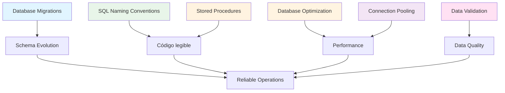

# Estándares de Base de Datos

## Contexto

Este estándar define las prácticas operacionales fundamentales para trabajar con bases de datos relacionales, cubriendo migraciones, performance, configuración y calidad de datos. Complementa el lineamiento [Datos por Dominio](../../lineamientos/datos/01-datos-por-dominio.md).

**Cuándo aplicar:** Todo servicio con PostgreSQL o SQL Server que use EF Core, stored procedures o queries directas.

**Conceptos incluidos:**

- **Database Migrations** — Control de versión de esquemas con EF Core
- **SQL Naming Conventions** — Nombres consistentes para objetos de BD
- **Stored Procedures** — Estructura y mejores prácticas en PL/pgSQL
- **Database Optimization** — Índices, queries eficientes, performance
- **Connection Pooling** — Gestión eficiente de conexiones
- **Data Validation** — Integridad y calidad de datos

---

## Stack Tecnológico

| Componente          | Tecnología              | Versión | Uso                      |
| ------------------- | ----------------------- | ------- | ------------------------ |
| **Base de Datos**   | PostgreSQL              | 15+     | Base de datos principal  |
| **ORM**             | Entity Framework Core   | 8.0+    | Data access layer        |
| **Migraciones**     | EF Core Migrations      | 8.0+    | Schema migrations        |
| **Connection Pool** | Npgsql                  | 8.0+    | PostgreSQL driver        |
| **Validación**      | FluentValidation        | 11.0+   | Reglas de negocio        |
| **Monitoring**      | OpenTelemetry           | 1.7+    | Métricas de DB           |
| **DB**              | SQL Server / PostgreSQL | —       | Motor relacional         |
| **Dialect**         | T-SQL / PL/pgSQL        | —       | Lenguaje de stored procs |

---

## Relación entre Conceptos



---

## Database Migrations

### ¿Qué son las Migraciones de Base de Datos?

Sistema de control de versiones para esquemas de base de datos que permite evolucionar la estructura de forma controlada y reproducible.

**Principios:**

- **Versionadas**: Cada migración tiene número/timestamp único
- **Incrementales**: Cambios aplicados en orden secuencial
- **Reversibles**: Toda migración tiene `Up` y `Down`
- **Idempotentes**: Seguro ejecutar múltiples veces
- **Testeadas**: Validadas en ambientes inferiores primero

**Propósito:** Evolución controlada, reproducible y auditable del esquema.

**Beneficios:**
✅ Control de versión del esquema
✅ Despliegues reproducibles
✅ Rollback seguro
✅ Historial de cambios
✅ CI/CD integration

### Estructura de Migraciones

```csharp
// EF Core Migration generada

public partial class InitialCreate : Migration
{
    protected override void Up(MigrationBuilder migrationBuilder)
    {
        // ✅ Crear schema dedicado
        migrationBuilder.EnsureSchema("customer");

        // ✅ Crear tabla
        migrationBuilder.CreateTable(
            name: "customers",
            schema: "customer",
            columns: table => new
            {
                id = table.Column<Guid>(type: "uuid", nullable: false),
                name = table.Column<string>(type: "varchar(100)", maxLength: 100, nullable: false),
                email = table.Column<string>(type: "varchar(254)", maxLength: 254, nullable: false),
                phone = table.Column<string>(type: "varchar(20)", maxLength: 20, nullable: true),
                document_type = table.Column<string>(type: "varchar(10)", maxLength: 10, nullable: false),
                document_number = table.Column<string>(type: "varchar(20)", maxLength: 20, nullable: false),
                created_at = table.Column<DateTime>(type: "timestamp", nullable: false, defaultValueSql: "CURRENT_TIMESTAMP"),
                updated_at = table.Column<DateTime>(type: "timestamp", nullable: true),
                row_version = table.Column<byte[]>(type: "bytea", rowVersion: true, nullable: false)
            },
            constraints: table =>
            {
                table.PrimaryKey("pk_customers", x => x.id);
            });

        // ✅ Crear índices
        migrationBuilder.CreateIndex(
            name: "ix_customers_email",
            schema: "customer",
            table: "customers",
            column: "email",
            unique: true);

        migrationBuilder.CreateIndex(
            name: "ix_customers_document",
            schema: "customer",
            table: "customers",
            columns: new[] { "document_type", "document_number" },
            unique: true);

        migrationBuilder.CreateIndex(
            name: "ix_customers_created_at",
            schema: "customer",
            table: "customers",
            column: "created_at");
    }

    protected override void Down(MigrationBuilder migrationBuilder)
    {
        // ✅ Rollback: remover en orden inverso
        migrationBuilder.DropTable(
            name: "customers",
            schema: "customer");
    }
}
```

### Convenciones de Naming

```csharp
// DbContext con configuración de naming

public class CustomerDbContext : DbContext
{
    protected override void OnModelCreating(ModelBuilder modelBuilder)
    {
        // ✅ Schema dedicado por servicio
        modelBuilder.HasDefaultSchema("customer");

        modelBuilder.Entity<Customer>(entity =>
        {
            // ✅ Tabla en snake_case (estándar PostgreSQL)
            entity.ToTable("customers");

            // ✅ Columnas en snake_case
            entity.Property(e => e.Id)
                .HasColumnName("id");

            entity.Property(e => e.Name)
                .HasColumnName("name");

            entity.Property(e => e.Email)
                .HasColumnName("email");

            // ✅ Primary key con prefijo
            entity.HasKey(e => e.Id)
                .HasName("pk_customers");

            // ✅ Índices con prefijo descriptivo
            entity.HasIndex(e => e.Email)
                .HasDatabaseName("ix_customers_email")
                .IsUnique();

            // ✅ Foreign keys con prefijo
            entity.HasOne(e => e.Address)
                .WithOne()
                .HasForeignKey<Address>(a => a.CustomerId)
                .HasConstraintName("fk_addresses_customers");
        });
    }
}

// Convenciones:
// - Tables: plural, snake_case (customers, order_items)
// - Columns: singular, snake_case (customer_id, created_at)
// - PKs: pk_{table} (pk_customers)
// - FKs: fk_{table}_{referenced_table} (fk_orders_customers)
// - Indexes: ix_{table}_{column(s)} (ix_customers_email)
// - Unique: uq_{table}_{column(s)} (uq_customers_document)
```

### Workflow de Migraciones

```bash
# 1. Crear migración desde cambios en modelo
dotnet ef migrations add AddPhoneColumnToCustomer \
    --context CustomerDbContext \
    --output-dir Data/Migrations

# 2. Revisar migración generada
code Data/Migrations/20260218_AddPhoneColumnToCustomer.cs

# 3. Aplicar en entorno local
dotnet ef database update --context CustomerDbContext

# 4. Generar SQL script para revisión
dotnet ef migrations script --context CustomerDbContext \
    --from 0 --to AddPhoneColumnToCustomer \
    --output migration.sql

# 5. Aplicar en otros ambientes vía CI/CD
# (ejecutar script SQL o dotnet ef database update)
```

### Mejores Prácticas de Migraciones

```csharp
// ✅ BUENO: Migración con datos seed seguros

public class SeedInitialDataMigration : Migration
{
    protected override void Up(MigrationBuilder migrationBuilder)
    {
        // ✅ Usar SQL parametrizado
        migrationBuilder.Sql(@"
            INSERT INTO customer.customers (id, name, email, document_type, document_number, created_at)
            VALUES
                (gen_random_uuid(), 'System Admin', 'admin@talma.com', 'DNI', '12345678', CURRENT_TIMESTAMP)
            ON CONFLICT (email) DO NOTHING;
        ");
    }

    protected override void Down(MigrationBuilder migrationBuilder)
    {
        migrationBuilder.Sql(@"
            DELETE FROM customer.customers WHERE email = 'admin@talma.com';
        ");
    }
}

// ✅ BUENO: Migración con índice concurrente (sin lock)
public class AddEmailIndexConcurrentlyMigration : Migration
{
    protected override void Up(MigrationBuilder migrationBuilder)
    {
        // ✅ CREATE INDEX CONCURRENTLY para no bloquear tabla
        migrationBuilder.Sql(@"
            CREATE INDEX CONCURRENTLY IF NOT EXISTS ix_customers_email
            ON customer.customers (email);
        ");
    }

    protected override void Down(MigrationBuilder migrationBuilder)
    {
        migrationBuilder.Sql(@"
            DROP INDEX CONCURRENTLY IF EXISTS customer.ix_customers_email;
        ");
    }
}

// ❌ MALO: Migración que bloquea tabla grande
public class BadMigration : Migration
{
    protected override void Up(MigrationBuilder migrationBuilder)
    {
        // ❌ Locks tabla completa durante creación de índice
        migrationBuilder.CreateIndex(
            name: "ix_customers_email",
            table: "customers",
            column: "email");

        // ❌ ALTER TABLE sin default puede bloquear
        migrationBuilder.AddColumn<string>(
            name: "phone",
            table: "customers",
            nullable: false); // ❌ Requiere valor para todos los rows
    }
}

// ✅ BUENO: Migración con default temporal
public class GoodMigration : Migration
{
    protected override void Up(MigrationBuilder migrationBuilder)
    {
        // ✅ Agregar columna nullable primero
        migrationBuilder.AddColumn<string>(
            name: "phone",
            table: "customers",
            nullable: true);

        // ✅ Poblar datos (si aplica)
        migrationBuilder.Sql(@"
            UPDATE customer.customers
            SET phone = '+00000000000'
            WHERE phone IS NULL;
        ");

        // ✅ Hacer NOT NULL después
        migrationBuilder.AlterColumn<string>(
            name: "phone",
            table: "customers",
            nullable: false);
    }
}
```

---

## SQL Naming Conventions

### Propósito

Convenciones para nombrar objetos de base de datos (schemas, tablas, índices, constraints, vistas, funciones y stored procedures) de forma consistente y predecible.

**Beneficios:**
✅ SQL legible y uniforme entre equipos
✅ Trazabilidad clara de relaciones entre objetos
✅ Facilita mantenimiento y auditoría de esquemas

```sql
-- ✅ BUENO: Naming conventions consistentes

-- Schemas: lowercase, singular
CREATE SCHEMA customer;
CREATE SCHEMA order_mgmt;

-- Tables: lowercase, plural, snake_case
CREATE TABLE customer.customers (
    id UUID PRIMARY KEY DEFAULT gen_random_uuid(),
    name VARCHAR(100) NOT NULL,
    email VARCHAR(254) NOT NULL,
    created_at TIMESTAMP NOT NULL DEFAULT CURRENT_TIMESTAMP
);

-- Indexes: ix_{table}_{columns}
CREATE INDEX ix_customers_email ON customer.customers (email);
CREATE INDEX ix_customers_created_at ON customer.customers (created_at);

-- Unique constraints: uq_{table}_{columns}
ALTER TABLE customer.customers
ADD CONSTRAINT uq_customers_email UNIQUE (email);

-- Foreign keys: fk_{table}_{referenced_table}
ALTER TABLE customer.addresses
ADD CONSTRAINT fk_addresses_customers
FOREIGN KEY (customer_id) REFERENCES customer.customers(id);

-- Check constraints: ck_{table}_{condition}
ALTER TABLE customer.customers
ADD CONSTRAINT ck_customers_email_format
CHECK (email ~* '^[A-Za-z0-9._%+-]+@[A-Za-z0-9.-]+\.[A-Za-z]{2,}$');

-- Views: v_{name}
CREATE VIEW customer.v_active_customers AS
SELECT * FROM customer.customers WHERE deleted_at IS NULL;

-- Funciones: fn_{name}
CREATE FUNCTION customer.fn_get_by_email(p_email VARCHAR)
RETURNS TABLE (id UUID, name VARCHAR, email VARCHAR)
AS $$
BEGIN
    RETURN QUERY
    SELECT c.id, c.name, c.email
    FROM customer.customers c
    WHERE c.email = p_email;
END;
$$ LANGUAGE plpgsql;

-- Stored procedures: sp_{accion}_{entidad}
CREATE PROCEDURE customer.sp_archive_customer(p_customer_id UUID)
LANGUAGE plpgsql
AS $$
BEGIN
    UPDATE customer.customers
    SET deleted_at = CURRENT_TIMESTAMP
    WHERE id = p_customer_id;
END;
$$;
```

:::note Naming en EF Core
Para la configuración de naming en C# (DbContext, `HasColumnName`, `HasDatabaseName`), ver la sección `### Convenciones de Naming` dentro de [Database Migrations](#database-migrations).
:::

---

## Stored Procedures

### Propósito

Estándar para escribir stored procedures robustos con validaciones, manejo de errores y parámetros de salida claros.

**Beneficios:**
✅ Lógica de BD encapsulada y reutilizable
✅ Manejo explícito de errores sin excepciones silenciosas
✅ Interfaz clara entre aplicación y BD

```sql
-- ✅ BUENO: Stored procedure con mejores prácticas

CREATE OR REPLACE PROCEDURE customer.sp_create_customer(
    p_name VARCHAR(100),
    p_email VARCHAR(254),
    p_phone VARCHAR(20),
    p_document_type VARCHAR(10),
    p_document_number VARCHAR(20),
    OUT p_customer_id UUID,
    OUT p_error_code VARCHAR(50),
    OUT p_error_message TEXT
)
LANGUAGE plpgsql
AS $$
DECLARE
    v_existing_count INT;
BEGIN
    -- 1. Inicializar outputs
    p_customer_id := NULL;
    p_error_code := NULL;
    p_error_message := NULL;

    -- 2. Validaciones
    IF p_name IS NULL OR LENGTH(TRIM(p_name)) < 2 THEN
        p_error_code := 'INVALID_NAME';
        p_error_message := 'Name must be at least 2 characters';
        RETURN;
    END IF;

    IF p_email IS NULL OR p_email !~* '^[A-Za-z0-9._%+-]+@[A-Za-z0-9.-]+\.[A-Za-z]{2,}$' THEN
        p_error_code := 'INVALID_EMAIL';
        p_error_message := 'Invalid email format';
        RETURN;
    END IF;

    -- 3. Verificar duplicados
    SELECT COUNT(*) INTO v_existing_count
    FROM customer.customers
    WHERE email = p_email;

    IF v_existing_count > 0 THEN
        p_error_code := 'DUPLICATE_EMAIL';
        p_error_message := 'Email already exists';
        RETURN;
    END IF;

    -- 4. Insertar
    INSERT INTO customer.customers (
        name, email, phone, document_type, document_number, created_at
    )
    VALUES (
        TRIM(p_name), LOWER(p_email), p_phone,
        p_document_type, p_document_number, CURRENT_TIMESTAMP
    )
    RETURNING id INTO p_customer_id;

    RAISE NOTICE 'Customer created: %', p_customer_id;

EXCEPTION
    WHEN unique_violation THEN
        p_error_code := 'DUPLICATE_KEY';
        p_error_message := 'Duplicate key violation';
    WHEN OTHERS THEN
        p_error_code := 'INTERNAL_ERROR';
        p_error_message := SQLERRM;
END;
$$;
```

```csharp
// Llamada desde C# con Npgsql
var parameters = new[]
{
    new NpgsqlParameter("p_name", "John Doe"),
    new NpgsqlParameter("p_email", "john@example.com"),
    new NpgsqlParameter("p_phone", "+51987654321"),
    new NpgsqlParameter("p_document_type", "DNI"),
    new NpgsqlParameter("p_document_number", "12345678"),
    new NpgsqlParameter("p_customer_id", DbType.Guid)  { Direction = ParameterDirection.Output },
    new NpgsqlParameter("p_error_code", DbType.String) { Direction = ParameterDirection.Output, Size = 50 },
    new NpgsqlParameter("p_error_message", DbType.String) { Direction = ParameterDirection.Output, Size = -1 }
};

await context.Database.ExecuteSqlRawAsync(
    "CALL customer.sp_create_customer($1, $2, $3, $4, $5, $6, $7, $8)",
    parameters);

var customerId = (Guid?)parameters[5].Value;
var errorCode  = parameters[6].Value as string;
```

---

## Database Optimization

### ¿Qué es la Optimización de Base de Datos?

Conjunto de técnicas para mejorar performance de queries, reducir latencia y uso eficiente de recursos.

**Áreas:**

- **Índices**: Accelerar búsquedas
- **Query Optimization**: Escribir queries eficientes
- **Partitioning**: Dividir tablas grandes
- **Caching**: Reducir hits a DB
- **Connection Management**: Pool de conexiones

**Propósito:** Baja latencia, alto throughput, uso eficiente de recursos.

**Beneficios:**
✅ Queries más rápidos
✅ Menor carga en DB
✅ Mejor experiencia de usuario
✅ Reducción de costos

### Índices Estratégicos

```csharp
// Configurar índices en DbContext

public class CustomerDbContext : DbContext
{
    protected override void OnModelCreating(ModelBuilder modelBuilder)
    {
        modelBuilder.Entity<Customer>(entity =>
        {
            // ✅ Índice único para constraints de negocio
            entity.HasIndex(e => e.Email)
                .HasDatabaseName("ix_customers_email")
                .IsUnique();

            // ✅ Índice compuesto para queries frecuentes
            entity.HasIndex(e => new { e.DocumentType, e.DocumentNumber })
                .HasDatabaseName("ix_customers_document")
                .IsUnique();

            // ✅ Índice para ordenamiento/filtrado temporal
            entity.HasIndex(e => e.CreatedAt)
                .HasDatabaseName("ix_customers_created_at");

            // ✅ Índice parcial (PostgreSQL) para soft deletes
            entity.HasIndex(e => e.DeletedAt)
                .HasDatabaseName("ix_customers_active")
                .HasFilter("deleted_at IS NULL");

            // ✅ Índice full-text search (PostgreSQL)
            entity.HasIndex("search_vector")
                .HasDatabaseName("ix_customers_search")
                .HasMethod("gin"); // Generalized Inverted Index
        });

        modelBuilder.Entity<Order>(entity =>
        {
            // ✅ FK siempre debe tener índice
            entity.HasIndex(e => e.CustomerId)
                .HasDatabaseName("ix_orders_customer_id");

            // ✅ Índice compuesto para query común
            entity.HasIndex(e => new { e.CustomerId, e.Status, e.CreatedAt })
                .HasDatabaseName("ix_orders_customer_status_date");
        });
    }
}

// Crear índice directamente en SQL para opciones avanzadas
migrationBuilder.Sql(@"
    -- Índice parcial para pedidos activos
    CREATE INDEX CONCURRENTLY ix_orders_active
    ON orders.orders (customer_id, created_at)
    WHERE status NOT IN ('cancelled', 'completed');

    -- Índice full-text search
    ALTER TABLE customer.customers
    ADD COLUMN search_vector tsvector
    GENERATED ALWAYS AS (
        to_tsvector('spanish', coalesce(name, '') || ' ' || coalesce(email, ''))
    ) STORED;

    CREATE INDEX CONCURRENTLY ix_customers_search
    ON customer.customers
    USING gin(search_vector);
");
```

### Query Optimization

```csharp
// ❌ MALO: N+1 query problem

public async Task<Order[]> GetOrdersWithCustomersAsync()
{
    var orders = await _context.Orders.ToArrayAsync();

    // ❌ N queries adicionales (uno por orden)
    foreach (var order in orders)
    {
        order.Customer = await _context.Customers.FindAsync(order.CustomerId);
    }

    return orders;
}

// ✅ BUENO: Eager loading

public async Task<Order[]> GetOrdersWithCustomersAsync()
{
    // ✅ 1 query con JOIN
    return await _context.Orders
        .Include(o => o.Customer)
        .ToArrayAsync();
}

// ✅ BUENO: Projection para reducir datos transferidos

public async Task<OrderSummaryDto[]> GetOrderSummariesAsync()
{
    // ✅ Solo columnas necesarias
    return await _context.Orders
        .Select(o => new OrderSummaryDto
        {
            OrderId = o.Id,
            CustomerName = o.Customer.Name,
            TotalAmount = o.TotalAmount,
            CreatedAt = o.CreatedAt
        })
        .ToArrayAsync();
}

// ❌ MALO: Traer todo y filtrar en memoria

public async Task<Customer[]> SearchCustomersAsync(string name)
{
    // ❌ Trae TODOS los registros
    var allCustomers = await _context.Customers.ToArrayAsync();

    // ❌ Filtra en memoria
    return allCustomers
        .Where(c => c.Name.Contains(name))
        .ToArray();
}

// ✅ BUENO: Filtrar en DB

public async Task<Customer[]> SearchCustomersAsync(string name)
{
    // ✅ WHERE en query SQL
    return await _context.Customers
        .Where(c => c.Name.Contains(name))
        .ToArrayAsync();
}

// ✅ BUENO: Paginación para datasets grandes

public async Task<PagedResult<Customer>> GetPagedAsync(int page, int pageSize)
{
    var query = _context.Customers.AsQueryable();

    var total = await query.CountAsync();

    var items = await query
        .OrderBy(c => c.Name)
        .Skip((page - 1) * pageSize)
        .Take(pageSize)
        .AsNoTracking() // ✅ No tracking para read-only
        .ToArrayAsync();

    return new PagedResult<Customer>
    {
        Items = items,
        Page = page,
        PageSize = pageSize,
        TotalCount = total
    };
}

// ✅ BUENO: Compiled queries para queries frecuentes

private static readonly Func<CustomerDbContext, Guid, Task<Customer?>> _getByIdCompiled =
    EF.CompileAsyncQuery((CustomerDbContext context, Guid id) =>
        context.Customers.FirstOrDefault(c => c.Id == id));

public async Task<Customer?> GetByIdAsync(Guid id)
{
    // ✅ Query compilada, más rápida
    return await _getByIdCompiled(_context, id);
}
```

### Análisis de Performance

```csharp
// Habilitar logging de queries en desarrollo

public class CustomerDbContext : DbContext
{
    protected override void OnConfiguring(DbContextOptionsBuilder options)
    {
        options.UseNpgsql(connectionString);

        if (Environment.GetEnvironmentVariable("ASPNETCORE_ENVIRONMENT") == "Development")
        {
            // ✅ Log queries SQL generadas
            options.EnableSensitiveDataLogging();
            options.EnableDetailedErrors();
            options.LogTo(Console.WriteLine, LogLevel.Information);
        }
    }
}

// Analizar query plan en PostgreSQL
migrationBuilder.Sql(@"
    EXPLAIN ANALYZE
    SELECT c.*, o.*
    FROM customer.customers c
    JOIN orders.orders o ON o.customer_id = c.id
    WHERE c.email = 'test@example.com'
    AND o.created_at > '2026-01-01';
");

// Monitoring de queries lentos
public class SlowQueryMiddleware
{
    private readonly RequestDelegate _next;
    private readonly ILogger<SlowQueryMiddleware> _logger;
    private const int SlowQueryThresholdMs = 500;

    public async Task InvokeAsync(HttpContext context, CustomerDbContext dbContext)
    {
        var sw = Stopwatch.StartNew();

        // Interceptor para queries
        dbContext.Database.SetCommandTimeout(TimeSpan.FromSeconds(30));

        await _next(context);

        sw.Stop();

        if (sw.ElapsedMilliseconds > SlowQueryThresholdMs)
        {
            _logger.LogWarning(
                "Slow request detected: {Path} took {Duration}ms",
                context.Request.Path,
                sw.ElapsedMilliseconds);
        }
    }
}
```

---

## Connection Pooling

### ¿Qué es Connection Pooling?

Reutilización de conexiones de base de datos para evitar overhead de crear/destruir conexiones repetidamente.

**Conceptos:**

- **Pool Size**: Número de conexiones activas
- **Min/Max**: Límites de conexiones
- **Timeout**: Tiempo máximo esperando conexión disponible
- **Lifetime**: Tiempo máximo de vida de conexión

**Propósito:** Performance mejorado, uso eficiente de recursos.

**Beneficios:**
✅ Reducción de latencia
✅ Menor overhead de conexión
✅ Control de concurrencia
✅ Límite de recursos

### Configuración de Connection Pool

```csharp
// Connection string con pooling configurado

{
  "ConnectionStrings": {
    "CustomerDatabase": "Host=customer-db.internal;Port=5432;Database=customers;Username=customer_user;Password=***;Pooling=true;Minimum Pool Size=5;Maximum Pool Size=100;Connection Idle Lifetime=300;Connection Pruning Interval=10;Command Timeout=30"
  }
}

// Configuración programática
public class DbConnectionFactory
{
    public NpgsqlDataSource CreateDataSource(string connectionString)
    {
        var builder = new NpgsqlDataSourceBuilder(connectionString);

        // ✅ Configurar pooling
        builder.ConnectionStringBuilder.Pooling = true;
        builder.ConnectionStringBuilder.MinPoolSize = 5;
        builder.ConnectionStringBuilder.MaxPoolSize = 100;
        builder.ConnectionStringBuilder.ConnectionIdleLifetime = 300; // 5 min
        builder.ConnectionStringBuilder.ConnectionPruningInterval = 10; // 10 seg
        builder.ConnectionStringBuilder.CommandTimeout = 30;

        // ✅ Retry logic
        builder.ConnectionStringBuilder.MaxAutoPrepare = 20;
        builder.ConnectionStringBuilder.AutoPrepareMinUsages = 2;

        return builder.Build();
    }
}

// Program.cs - Configurar DbContext con pooling

var builder = WebApplication.CreateBuilder(args);

builder.Services.AddDbContextPool<CustomerDbContext>(
    options =>
    {
        options.UseNpgsql(
            builder.Configuration.GetConnectionString("CustomerDatabase"),
            npgsqlOptions =>
            {
                // ✅ Configuración adicional de Npgsql
                npgsqlOptions.EnableRetryOnFailure(
                    maxRetryCount: 3,
                    maxRetryDelay: TimeSpan.FromSeconds(5),
                    errorCodesToAdd: null);

                npgsqlOptions.CommandTimeout(30);

                // ✅ Connection resiliency
                npgsqlOptions.ExecutionStrategy(
                    c => new NpgsqlRetryingExecutionStrategy(
                        c,
                        maxRetryCount: 3,
                        maxRetryDelay: TimeSpan.FromSeconds(5),
                        errorNumbersToAdd: null));
            });
    },
    poolSize: 128); // ✅ Pool de DbContext instances
```

### Monitoreo de Connection Pool

```csharp
// Métricas de connection pool

public class DatabaseMetrics
{
    private readonly Meter _meter;
    private readonly Histogram<int> _connectionPoolSize;
    private readonly Counter<long> _connectionFailures;

    public DatabaseMetrics(IMeterFactory meterFactory)
    {
        _meter = meterFactory.Create("CustomerApi.Database");

        _connectionPoolSize = _meter.CreateHistogram<int>(
            "db.connection_pool.size",
            description: "Tamaño del pool de conexiones");

        _connectionFailures = _meter.CreateCounter<long>(
            "db.connection.failures",
            description: "Fallos de conexión a DB");
    }

    public void RecordPoolSize(int size)
    {
        _connectionPoolSize.Record(size);
    }

    public void RecordConnectionFailure()
    {
        _connectionFailures.Add(1);
    }
}

// Health check para conexiones

public class DatabaseHealthCheck : IHealthCheck
{
    private readonly CustomerDbContext _context;
    private readonly ILogger<DatabaseHealthCheck> _logger;

    public async Task<HealthCheckResult> CheckHealthAsync(
        HealthCheckContext context,
        CancellationToken cancellationToken = default)
    {
        try
        {
            // ✅ Query simple para verificar conectividad
            await _context.Database.ExecuteSqlRawAsync(
                "SELECT 1",
                cancellationToken);

            return HealthCheckResult.Healthy("Database connection is healthy");
        }
        catch (Exception ex)
        {
            _logger.LogError(ex, "Database health check failed");
            return HealthCheckResult.Unhealthy(
                "Database connection failed",
                ex);
        }
    }
}

// Registrar health check
builder.Services.AddHealthChecks()
    .AddCheck<DatabaseHealthCheck>("database");
```

---

## Data Validation

### ¿Qué es la Validación de Datos?

Conjunto de reglas y controles para garantizar integridad, precisión y calidad de datos.

**Niveles:**

| Nivel        | Dónde          | Qué valida                  | Ejemplo                   |
| ------------ | -------------- | --------------------------- | ------------------------- |
| **Cliente**  | UI/Frontend    | UX: formato, requeridos     | Email válido, campo lleno |
| **API**      | Controller/DTO | Contrato: estructura, tipos | JSON válido, campos types |
| **Business** | Service Layer  | Reglas de negocio           | Saldo suficiente          |
| **Database** | Constraints    | Integridad referencial      | FK exists, unique         |

**Propósito:** Datos válidos, íntegros y confiables.

**Beneficios:**
✅ Calidad de datos mejorada
✅ Integridad referencial
✅ Prevención de bugs
✅ Mensajes de error claros

### Validación en Database

```csharp
// Constraints en nivel de DB

public class CustomerDbContext : DbContext
{
    protected override void OnModelCreating(ModelBuilder modelBuilder)
    {
        modelBuilder.Entity<Customer>(entity =>
        {
            // ✅ NOT NULL constraints
            entity.Property(e => e.Name)
                .IsRequired();

            entity.Property(e => e.Email)
                .IsRequired();

            // ✅ UNIQUE constraints
            entity.HasIndex(e => e.Email)
                .IsUnique();

            entity.HasIndex(e => new { e.DocumentType, e.DocumentNumber })
                .IsUnique();

            // ✅ CHECK constraints
            entity.ToTable(t => t.HasCheckConstraint(
                "ck_customers_email_format",
                "email ~* '^[A-Za-z0-9._%+-]+@[A-Za-z0-9.-]+\\.[A-Za-z]{2,}$'"));

            entity.ToTable(t => t.HasCheckConstraint(
                "ck_customers_phone_format",
                "phone IS NULL OR phone ~* '^\\+\\d{10,15}$'"));

            // ✅ DEFAULT values
            entity.Property(e => e.CreatedAt)
                .HasDefaultValueSql("CURRENT_TIMESTAMP");

            entity.Property(e => e.Status)
                .HasDefaultValue(CustomerStatus.Active);
        });

        modelBuilder.Entity<Order>(entity =>
        {
            // ✅ Foreign key constraint
            entity.HasOne<Customer>()
                .WithMany()
                .HasForeignKey(e => e.CustomerId)
                .OnDelete(DeleteBehavior.Restrict); // Prevenir cascade delete

            // ✅ CHECK para cantidades positivas
            entity.ToTable(t => t.HasCheckConstraint(
                "ck_orders_total_amount_positive",
                "total_amount >= 0"));
        });
    }
}
```

### Validación en Application Layer

```csharp
// FluentValidation para reglas de negocio

public class CreateCustomerRequestValidator : AbstractValidator<CreateCustomerRequest>
{
    private readonly CustomerDbContext _context;

    public CreateCustomerRequestValidator(CustomerDbContext context)
    {
        _context = context;

        // ✅ Validaciones básicas
        RuleFor(x => x.Name)
            .NotEmpty().WithMessage("Name is required")
            .Length(2, 100).WithMessage("Name must be between 2 and 100 characters")
            .Matches(@"^[a-zA-Z0-9\s\.\-,]+$").WithMessage("Name contains invalid characters");

        RuleFor(x => x.Email)
            .NotEmpty().WithMessage("Email is required")
            .EmailAddress().WithMessage("Email format is invalid")
            .MaximumLength(254);

        RuleFor(x => x.Phone)
            .Matches(@"^\+\d{10,15}$")
            .When(x => !string.IsNullOrEmpty(x.Phone))
            .WithMessage("Phone must be in E.164 format (+51987654321)");

        // ✅ Validación asíncrona para unicidad
        RuleFor(x => x.Email)
            .MustAsync(BeUniqueEmail)
            .WithMessage("Email already exists");

        RuleFor(x => x.Document)
            .NotNull().WithMessage("Document is required")
            .SetValidator(new DocumentDtoValidator())
            .MustAsync(BeUniqueDocument)
            .WithMessage("Document already exists");
    }

    private async Task<bool> BeUniqueEmail(string email, CancellationToken ct)
    {
        return !await _context.Customers
            .AnyAsync(c => c.Email == email, ct);
    }

    private async Task<bool> BeUniqueDocument(DocumentDto document, CancellationToken ct)
    {
        return !await _context.Customers
            .AnyAsync(c =>
                c.DocumentType == document.Type &&
                c.DocumentNumber == document.Number, ct);
    }
}

// Validador para nested objects
public class DocumentDtoValidator : AbstractValidator<DocumentDto>
{
    public DocumentDtoValidator()
    {
        RuleFor(x => x.Type)
            .IsInEnum().WithMessage("Invalid document type");

        RuleFor(x => x.Number)
            .NotEmpty().WithMessage("Document number is required")
            .Must((doc, number) => ValidateDocumentNumber(doc.Type, number))
            .WithMessage("Invalid document number for the specified type");
    }

    private bool ValidateDocumentNumber(DocumentType type, string number)
    {
        return type switch
        {
            DocumentType.DNI => number.Length == 8 && number.All(char.IsDigit),
            DocumentType.RUC => number.Length == 11 && number.All(char.IsDigit),
            DocumentType.CE => number.Length is >= 9 and <= 12,
            _ => false
        };
    }
}
```

### Domain Validation

```csharp
// Validación en entidades de dominio

public class Customer
{
    private Customer() { } // ✅ Private constructor for EF Core

    public Guid Id { get; private set; }
    public string Name { get; private set; } = default!;
    public string Email { get; private set; } = default!;
    public string? Phone { get; private set; }
    public DateTime CreatedAt { get; private set; }

    // ✅ Factory method con validación
    public static Customer Create(string name, string email, string? phone = null)
    {
        // Validaciones de dominio
        if (string.IsNullOrWhiteSpace(name))
            throw new DomainException("Name cannot be empty");

        if (name.Length < 2 || name.Length > 100)
            throw new DomainException("Name must be between 2 and 100 characters");

        if (!IsValidEmail(email))
            throw new DomainException("Invalid email format");

        if (phone != null && !IsValidPhone(phone))
            throw new DomainException("Invalid phone format");

        return new Customer
        {
            Id = Guid.NewGuid(),
            Name = name.Trim(),
            Email = email.ToLowerInvariant(),
            Phone = phone,
            CreatedAt = DateTime.UtcNow
        };
    }

    // ✅ Métodos de modificación con validación
    public void UpdateEmail(string newEmail)
    {
        if (!IsValidEmail(newEmail))
            throw new DomainException("Invalid email format");

        Email = newEmail.ToLowerInvariant();
    }

    public void UpdatePhone(string? newPhone)
    {
        if (newPhone != null && !IsValidPhone(newPhone))
            throw new DomainException("Invalid phone format");

        Phone = newPhone;
    }

    private static bool IsValidEmail(string email)
    {
        if (string.IsNullOrWhiteSpace(email))
            return false;

        return Regex.IsMatch(email, @"^[^@\s]+@[^@\s]+\.[^@\s]+$");
    }

    private static bool IsValidPhone(string phone)
    {
        return Regex.IsMatch(phone, @"^\+\d{10,15}$");
    }
}
```

---

## Implementación Integrada

### Setup Completo de Database

```csharp
// Program.cs - Configuración completa

var builder = WebApplication.CreateBuilder(args);

// 1. DbContext con pooling y resiliencia
builder.Services.AddDbContextPool<CustomerDbContext>(
    options =>
    {
        var connectionString = builder.Configuration.GetConnectionString("CustomerDatabase");

        options.UseNpgsql(connectionString, npgsqlOptions =>
        {
            // Migraciones
            npgsqlOptions.MigrationsAssembly("CustomerService");
            npgsqlOptions.MigrationsHistoryTable("__EFMigrationsHistory", "customer");

            // Resiliencia
            npgsqlOptions.EnableRetryOnFailure(3, TimeSpan.FromSeconds(5), null);
            npgsqlOptions.CommandTimeout(30);

            // Performance
            npgsqlOptions.MaxBatchSize(100);
        });

        // Logging en desarrollo
        if (builder.Environment.IsDevelopment())
        {
            options.EnableSensitiveDataLogging();
            options.EnableDetailedErrors();
        }
    },
    poolSize: 128);

// 2. Validadores
builder.Services.AddValidatorsFromAssemblyContaining<Program>();
builder.Services.AddFluentValidationAutoValidation();

// 3. Health checks
builder.Services.AddHealthChecks()
    .AddDbContextCheck<CustomerDbContext>("database");

// 4. Métricas
builder.Services.AddSingleton<DatabaseMetrics>();

var app = builder.Build();

// 5. Aplicar migraciones al inicio (solo en dev)
if (app.Environment.IsDevelopment())
{
    using var scope = app.Services.CreateScope();
    var context = scope.ServiceProvider.GetRequiredService<CustomerDbContext>();
    await context.Database.MigrateAsync();
}

app.MapHealthChecks("/health");

app.Run();
```

---

## Requisitos Técnicos

### MUST (Obligatorio)

**Database Migrations:**

- **MUST** usar migraciones para todo cambio de esquema
- **MUST** versionar migraciones en control de código fuente
- **MUST** testear migraciones en entornos inferiores antes de producción
- **MUST** incluir rollback (Down) en cada migración
- **MUST** usar naming conventions consistentes (snake_case para PostgreSQL)

**SQL Naming Conventions:**

- **MUST** seguir las naming conventions SQL definidas en este estándar
- **MUST** omitir nombres genéricos como `id`, `nombre`, `fecha` sin prefijo de tabla
- **MUST NOT** omitir schema al referenciar objetos de BD

**Stored Procedures:**

- **MUST** incluir manejo de errores explícito en todos los stored procedures
- **MUST** usar parámetros `OUT` para reportar errores sin lanzar excepciones
- **SHOULD** versionar scripts SQL en Git junto con el código de la aplicación
- **MUST NOT** usar lógica de negocio crítica sin validaciones previas de inputs

**Database Optimization:**

- **MUST** crear índices en foreign keys
- **MUST** crear índices en columnas de búsqueda frecuente
- **MUST** usar paginación para colecciones grandes
- **MUST** usar AsNoTracking() para queries read-only
- **MUST** analizar y optimizar queries lentos (> 500ms)

**Connection Pooling:**

- **MUST** habilitar connection pooling
- **MUST** configurar límites apropiados de pool (min/max)
- **MUST** configurar timeouts de conexión
- **MUST** implementar health checks para DB

**Data Validation:**

- **MUST** validar datos en múltiples niveles (API, business, DB)
- **MUST** usar constraints de DB (NOT NULL, UNIQUE, CHECK, FK)
- **MUST** validar reglas de negocio en application layer
- **MUST** proveer mensajes de error claros y específicos

### SHOULD (Fuertemente recomendado)

- **SHOULD** usar CREATE INDEX CONCURRENTLY para no bloquear tablas
- **SHOULD** usar compiled queries para queries frecuentes
- **SHOULD** monitorear métricas de DB (latency, connections, slow queries)
- **SHOULD** usar read replicas para alta carga de lectura
- **SHOULD** implementar caching para redOurcir hits a DB
- **SHOULD** usar batch operations para inserts/updates masivos
- **SHOULD** documentar índices y su propósito

### MAY (Opcional)

- **MAY** usar partitioning para tablas muy grandes
- **MAY** implementar query plan analysis automatizado
- **MAY** usar materialized views para queries complejos frecuentes
- **MAY** implementar change data capture (CDC) para auditoría

### MUST NOT (Prohibido)

- **MUST NOT** ejecutar migraciones manualmente en producción sin revisión
- **MUST NOT** crear índices en todas las columnas (overhead writes)
- **MUST NOT** hacer SELECT \* en queries (especificar columnas)
- **MUST NOT** validar solo en cliente (siempre validar en servidor)
- **MUST NOT** ignorar excepciones de concurrencia

---

## Referencias

**Documentación:**

- [Entity Framework Core](https://learn.microsoft.com/ef/core/)
- [PostgreSQL Documentation](https://www.postgresql.org/docs/)
- [Npgsql Documentation](https://www.npgsql.org/doc/)
- [FluentValidation](https://docs.fluentvalidation.net/)

**Performance:**

- [EF Core Performance](https://learn.microsoft.com/ef/core/performance/)
- [PostgreSQL Performance Tips](https://wiki.postgresql.org/wiki/Performance_Optimization)

**Relacionados:**

- [Lineamiento Datos por Dominio](../../lineamientos/datos/01-datos-por-dominio.md) — lineamiento que origina este estándar
- [Lineamiento Consistencia y Sincronización](../../lineamientos/datos/02-consistencia-y-sincronizacion.md) — complementa SQL standards
- [Arquitectura de Datos](./data-architecture.md)
- [Consistencia de Datos](./data-consistency.md)

**Referencias externas:**

- [PostgreSQL Naming Conventions](https://www.postgresql.org/docs/current/sql-syntax-lexical.html) — convenciones oficiales
- [SQL Server T-SQL Reference](https://learn.microsoft.com/sql/t-sql/language-reference) — referencia T-SQL
- [Entity Framework Core](https://learn.microsoft.com/ef/core/) — documentación oficial
- [Npgsql Documentation](https://www.npgsql.org/doc/) — driver PostgreSQL
- [FluentValidation](https://docs.fluentvalidation.net/) — validación en application layer

---

**Última actualización**: 5 de marzo de 2026
**Responsable**: Equipo de Arquitectura
