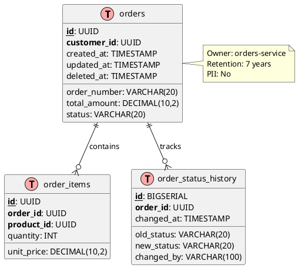

# Estándar Técnico — Schema Documentation

---

## 1. Propósito

Garantizar que los esquemas de base de datos estén completa y claramente documentados, facilitando comprensión, mantenimiento y onboarding mediante comentarios SQL, diagramas ER y catálogos de datos.

---

## 2. Alcance

**Aplica a:**

- Todas las tablas y vistas en PostgreSQL
- Stored procedures y functions
- Índices y constraints
- Foreign keys y relaciones
- Enums y types custom
- Particiones y schemas

**No aplica a:**

- Tablas temporales
- Audit/log tables generadas automáticamente (documentar template)

---

## 3. Tecnologías Aprobadas

| Componente       | Tecnología         | Versión mínima | Observaciones                   |
| ---------------- | ------------------ | -------------- | ------------------------------- |
| **Diagrams**     | dbdiagram.io       | -              | ER diagrams as code             |
| **Diagrams**     | PlantUML           | 1.2023+        | Alternativa text-based          |
| **Schema Docs**  | SchemaSpy          | 6.2+           | Auto-generate HTML docs         |
| **SQL Comments** | COMMENT ON         | PostgreSQL 14+ | Native SQL comments             |
| **Data Catalog** | Backstage          | 1.20+          | Service catalog con DB metadata |
| **Migrations**   | EF Core Migrations | 8.0+           | Schema versioning               |
| **ER Tool**      | DBeaver            | 23.0+          | Visual ER diagrams              |

> El uso de tecnologías no listadas requiere aprobación de Arquitectura.

---

## 4. Requisitos Obligatorios 🔴

### Comentarios SQL

- [ ] **Todas las tablas** deben tener COMMENT con propósito
- [ ] **Todas las columnas críticas** con COMMENT explicativo
- [ ] Foreign keys con COMMENT indicando relación
- [ ] Índices complejos con COMMENT de justificación
- [ ] Constraints con COMMENT de business rule

### Diagramas ER

- [ ] Diagrama ER actualizado por bounded context
- [ ] Relaciones PK/FK claramente marcadas
- [ ] Cardinalidad (1:1, 1:N, N:M) especificada
- [ ] Stored en repositorio (dbdiagram.io, PlantUML)
- [ ] Generado automáticamente cuando sea posible

### Data Dictionary

- [ ] Catálogo de entidades con descripción
- [ ] Tipos de datos y constraints documentados
- [ ] Ownership de tabla especificado
- [ ] Campos PII marcados explícitamente
- [ ] Retention policies documentadas

### Migrations con Descripción

- [ ] Cada migration con comentario de propósito
- [ ] Breaking changes claramente marcados
- [ ] Rollback procedure documentado
- [ ] Deployment notes cuando aplique

### Actualización Continua

- [ ] Documentación actualizada en cada schema change
- [ ] Pull requests incluyen doc updates
- [ ] Automated checks de comments faltantes
- [ ] Quarterly review de doc accuracy

---

## 5. Prohibiciones

- ❌ Tablas sin COMMENT
- ❌ Columnas críticas sin descripción
- ❌ Foreign keys sin documentar relación
- ❌ Diagramas ER desactualizados
- ❌ Nombres de columnas ambiguos sin explicación
- ❌ Schema changes sin update de documentación
- ❌ Documentación solo en wikis externos (debe estar en código)

---

## 6. Configuración Mínima

### SQL Comments en PostgreSQL

```sql
-- Tabla con documentación completa
CREATE TABLE orders (
    id UUID PRIMARY KEY DEFAULT gen_random_uuid(),
    customer_id UUID NOT NULL,
    order_number VARCHAR(20) NOT NULL UNIQUE,
    total_amount DECIMAL(10,2) NOT NULL,
    status VARCHAR(20) NOT NULL,
    created_at TIMESTAMP NOT NULL DEFAULT NOW(),
    updated_at TIMESTAMP NOT NULL DEFAULT NOW(),
    deleted_at TIMESTAMP NULL,
    CONSTRAINT check_total_positive CHECK (total_amount >= 0)
);

-- Comentarios de tabla
COMMENT ON TABLE orders IS
'Órdenes de clientes. Owner: orders-service.
Contiene todas las órdenes del sistema (activas y históricas).
Retention: 7 años para cumplimiento fiscal.
PII: No contiene datos personales directos (solo customer_id).';

-- Comentarios de columnas
COMMENT ON COLUMN orders.id IS
'ID único de la orden (UUID v4).';

COMMENT ON COLUMN orders.customer_id IS
'Referencia al cliente owner de la orden.
FK lógica a customers_service.customers.id (no FK física cross-service).
Usar Customers API para obtener datos del cliente.';

COMMENT ON COLUMN orders.order_number IS
'Número de orden visible al cliente (formato: ORD-YYYYMMDD-XXXXX).
Generado automáticamente, único, inmutable.';

COMMENT ON COLUMN orders.total_amount IS
'Monto total de la orden en USD.
Calculado como SUM(order_items.quantity * order_items.unit_price).
Debe ser >= 0 (validado por constraint).';

COMMENT ON COLUMN orders.status IS
'Estado actual de la orden. Valores válidos:
- PENDING: Creada, pendiente de pago
- PAID: Pago confirmado
- PROCESSING: En preparación
- SHIPPED: Enviada
- DELIVERED: Entregada
- CANCELLED: Cancelada';

COMMENT ON COLUMN orders.deleted_at IS
'Soft delete timestamp. NULL = activo, NOT NULL = eliminado.
Retention: hard delete después de 90 días (ver data lifecycle policy).';

-- Índices con comentarios
CREATE INDEX idx_orders_customer ON orders(customer_id)
WHERE deleted_at IS NULL;

COMMENT ON INDEX idx_orders_customer IS
'Índice para queries por cliente (ej: GET /customers/{id}/orders).
Partial index: excluye deleted records para eficiencia.';

CREATE INDEX idx_orders_status_created ON orders(status, created_at DESC)
WHERE deleted_at IS NULL;

COMMENT ON INDEX idx_orders_status_created IS
'Índice compuesto para dashboard de órdenes por estado.
Soporta ORDER BY created_at DESC eficientemente.';

-- Constraint con comentario
COMMENT ON CONSTRAINT check_total_positive ON orders IS
'Business rule: monto total no puede ser negativo.
Refunds se manejan en payments_service, no como negative orders.';
```

### Flyway Migration con Documentación

```sql
-- V1__create_orders_schema.sql
-- Migration: Initial orders schema
-- Author: Platform Team
-- Date: 2024-01-15
-- Breaking: No
-- Dependencies: None
--
-- Description:
-- Creates core orders schema with tables:
-- - orders: Main order entity
-- - order_items: Line items per order
-- - order_status_history: Audit trail of status changes
--
-- Rollback procedure:
-- DROP TABLE order_status_history;
-- DROP TABLE order_items;
-- DROP TABLE orders;

-- Orders table (main entity)
CREATE TABLE orders (
    id UUID PRIMARY KEY DEFAULT gen_random_uuid(),
    customer_id UUID NOT NULL,
    order_number VARCHAR(20) NOT NULL UNIQUE,
    total_amount DECIMAL(10,2) NOT NULL CHECK (total_amount >= 0),
    status VARCHAR(20) NOT NULL,
    created_at TIMESTAMP NOT NULL DEFAULT NOW(),
    updated_at TIMESTAMP NOT NULL DEFAULT NOW(),
    deleted_at TIMESTAMP NULL
);

COMMENT ON TABLE orders IS 'Customer orders. Owner: orders-service';
COMMENT ON COLUMN orders.customer_id IS 'FK to customers_service.customers.id (logical, not physical)';

-- Order items table (1:N relationship)
CREATE TABLE order_items (
    id UUID PRIMARY KEY DEFAULT gen_random_uuid(),
    order_id UUID NOT NULL REFERENCES orders(id) ON DELETE CASCADE,
    product_id UUID NOT NULL,
    quantity INT NOT NULL CHECK (quantity > 0),
    unit_price DECIMAL(10,2) NOT NULL CHECK (unit_price >= 0),
    created_at TIMESTAMP NOT NULL DEFAULT NOW()
);

COMMENT ON TABLE order_items IS
'Line items for orders. Each order can have multiple items.
Relationship: N order_items belong to 1 order (CASCADE delete).';

COMMENT ON COLUMN order_items.product_id IS
'FK to catalog_service.products.id (logical, not physical).
Use Catalog API to fetch product details.';

-- Indexes
CREATE INDEX idx_orders_customer ON orders(customer_id) WHERE deleted_at IS NULL;
CREATE INDEX idx_orders_status ON orders(status) WHERE deleted_at IS NULL;
CREATE INDEX idx_order_items_order ON order_items(order_id);
CREATE INDEX idx_order_items_product ON order_items(product_id);

-- Audit table for status changes
CREATE TABLE order_status_history (
    id BIGSERIAL PRIMARY KEY,
    order_id UUID NOT NULL REFERENCES orders(id) ON DELETE CASCADE,
    old_status VARCHAR(20),
    new_status VARCHAR(20) NOT NULL,
    changed_by VARCHAR(100) NOT NULL,
    changed_at TIMESTAMP NOT NULL DEFAULT NOW(),
    notes TEXT
);

COMMENT ON TABLE order_status_history IS
'Audit log of order status transitions.
Immutable: never update/delete records, only INSERT.';

CREATE INDEX idx_order_status_history_order ON order_status_history(order_id, changed_at DESC);
```

### dbdiagram.io Schema as Code

```dbml
// orders_service.dbml
// ER Diagram for Orders Service
// Owner: Platform Team
// Last Updated: 2024-01-15

Table orders {
  id uuid [pk, note: 'UUID v4']
  customer_id uuid [not null, note: 'Logical FK to customers_service']
  order_number varchar(20) [unique, not null]
  total_amount decimal(10,2) [not null]
  status varchar(20) [not null, note: 'PENDING|PAID|PROCESSING|SHIPPED|DELIVERED|CANCELLED']
  created_at timestamp [not null, default: `now()`]
  updated_at timestamp [not null, default: `now()`]
  deleted_at timestamp [null, note: 'Soft delete']

  Note: 'Customer orders. Retention: 7 years. PII: No.'
}

Table order_items {
  id uuid [pk]
  order_id uuid [not null, ref: > orders.id]
  product_id uuid [not null, note: 'Logical FK to catalog_service']
  quantity int [not null]
  unit_price decimal(10,2) [not null]
  created_at timestamp [not null, default: `now()`]

  Note: 'Line items for orders. Cascade delete with order.'
}

Table order_status_history {
  id bigserial [pk]
  order_id uuid [not null, ref: > orders.id]
  old_status varchar(20) [null]
  new_status varchar(20) [not null]
  changed_by varchar(100) [not null]
  changed_at timestamp [not null, default: `now()`]
  notes text [null]

  Note: 'Audit log for status changes. Immutable.'
}

// Relationships
Ref: order_items.order_id > orders.id [delete: cascade]
Ref: order_status_history.order_id > orders.id [delete: cascade]

// Indexes
Indexes orders {
  (customer_id) [name: 'idx_orders_customer', where: 'deleted_at IS NULL']
  (status, created_at) [name: 'idx_orders_status_created']
}

Indexes order_items {
  (order_id) [name: 'idx_order_items_order']
  (product_id) [name: 'idx_order_items_product']
}
```

### Data Dictionary (Markdown)

```markdown
# Orders Service - Data Dictionary

## Entities

### orders

**Owner:** orders-service
**Bounded Context:** Sales
**PII:** No
**Retention:** 7 years (fiscal compliance)

| Column       | Type          | Nullable | Default  | Description                       |
| ------------ | ------------- | -------- | -------- | --------------------------------- |
| id           | UUID          | No       | gen_uuid | Primary key                       |
| customer_id  | UUID          | No       | -        | FK to customers_service (logical) |
| order_number | VARCHAR(20)   | No       | -        | Unique order number (ORD-...)     |
| total_amount | DECIMAL(10,2) | No       | -        | Total in USD (>= 0)               |
| status       | VARCHAR(20)   | No       | -        | Order status (see enum below)     |
| created_at   | TIMESTAMP     | No       | NOW()    | Creation timestamp (UTC)          |
| updated_at   | TIMESTAMP     | No       | NOW()    | Last update timestamp (UTC)       |
| deleted_at   | TIMESTAMP     | Yes      | NULL     | Soft delete timestamp             |

**Status Enum:**

- PENDING: Created, awaiting payment
- PAID: Payment confirmed
- PROCESSING: Being prepared
- SHIPPED: In transit
- DELIVERED: Completed
- CANCELLED: Cancelled by user or system

**Relationships:**

- 1 order HAS MANY order_items (1:N, cascade delete)
- 1 order HAS MANY order_status_history (1:N, cascade delete)
- 1 order BELONGS TO 1 customer (logical FK, access via Customers API)

**Indexes:**

- `idx_orders_customer`: (customer_id) WHERE deleted_at IS NULL
- `idx_orders_status_created`: (status, created_at DESC)

**Business Rules:**

- total_amount must be >= 0
- order_number is immutable after creation
- status transitions logged in order_status_history
- Soft delete with 90-day grace period before hard delete
```

---

## 7. Ejemplos

### Automated Documentation Check

```sql
-- Script para detectar tablas/columnas sin comentarios
SELECT
    t.table_name,
    c.column_name,
    CASE
        WHEN col_description((t.table_schema||'.'||t.table_name)::regclass::oid, c.ordinal_position) IS NULL
        THEN 'MISSING'
        ELSE 'OK'
    END as documentation_status
FROM information_schema.tables t
JOIN information_schema.columns c ON c.table_name = t.table_name
WHERE t.table_schema = 'public'
  AND t.table_type = 'BASE TABLE'
  AND col_description((t.table_schema||'.'||t.table_name)::regclass::oid, c.ordinal_position) IS NULL
ORDER BY t.table_name, c.ordinal_position;
```

### PlantUML ER Diagram



---

## 8. Validación y Auditoría

### Checklist

- [ ] Todas las tablas tienen COMMENT
- [ ] Columnas críticas documentadas
- [ ] Diagrama ER actualizado
- [ ] Data dictionary publicado
- [ ] Migrations con descripción
- [ ] Script de validación en CI/CD
- [ ] Quarterly doc review agendado

### CI/CD Check

```bash
#!/bin/bash
# validate-schema-docs.sh
# Falla el build si hay tablas sin comentarios

UNDOCUMENTED=$(psql -t -c "
SELECT COUNT(*)
FROM information_schema.tables t
WHERE t.table_schema = 'public'
  AND t.table_type = 'BASE TABLE'
  AND obj_description((t.table_schema||'.'||t.table_name)::regclass::oid) IS NULL
")

if [ "$UNDOCUMENTED" -gt 0 ]; then
  echo "ERROR: $UNDOCUMENTED tables without COMMENT. Documentation required."
  exit 1
fi

echo "✓ All tables documented"
```

---

## 9. Referencias

**Herramientas:**

- [dbdiagram.io](https://dbdiagram.io/home)
- [SchemaSpy](http://schemaspy.org/)
- [PlantUML](https://plantuml.com/)

**Documentación:**

- [PostgreSQL COMMENT](https://www.postgresql.org/docs/current/sql-comment.html)
- [DBeaver ER Diagrams](https://dbeaver.com/docs/wiki/ER-Diagrams/)

**Buenas prácticas:**

- "Database Design for Mere Mortals" - Michael J. Hernandez
- "SQL Antipatterns" - Bill Karwin
