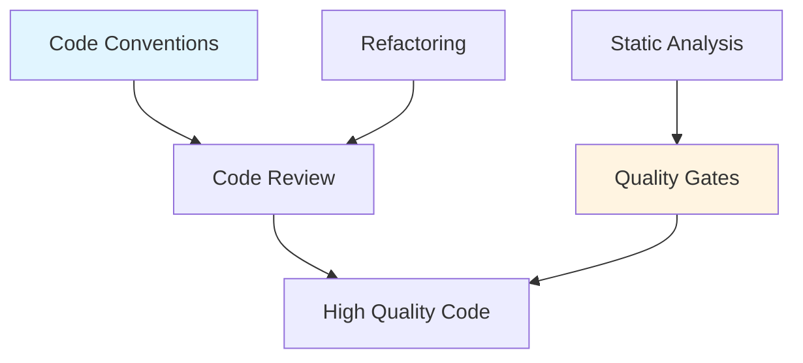

# Calidad de Código

## Contexto

Este estándar define las prácticas para mantener código de alta calidad, legible, mantenible y seguro. Complementa el lineamiento [Calidad de Código](../../lineamientos/desarrollo/01-calidad-codigo.md).

**Conceptos incluidos:**

- **Code Conventions** — Estilo y convenciones de código
- **Code Review** — Revisión de código sistemática
- **Refactoring Practices** — Mejora continua del código
- **Static Analysis** — Análisis de calidad y complejidad
- **Quality Gates** — Criterios de aceptación automatizados

---

## Stack Tecnológico

| Componente          | Tecnología       | Versión | Uso                    |
| ------------------- | ---------------- | ------- | ---------------------- |
| **Linter**          | Roslyn Analyzers | 4.9+    | Análisis estático .NET |
| **Code Style**      | EditorConfig     | -       | Convenciones de código |
| **Code Coverage**   | Coverlet         | 6.0+    | Cobertura de tests     |
| **Quality Metrics** | SonarQube        | 10.0+   | Métricas de calidad    |

---

## Relación entre Conceptos



---

## Code Conventions

### ¿Qué son las Code Conventions?

Conjunto de reglas de estilo y estructura de código para mantener consistencia entre desarrolladores y proyectos.

**Aspectos cubiertos:**

- **Naming**: Variables, métodos, clases, namespaces
- **Formatting**: Indentación, espacios, líneas en blanco
- **Structure**: Organización de archivos y carpetas
- **Comments**: Cuándo y cómo comentar
- **Patterns**: Patrones de código preferidos

**Propósito:** Código consistente, legible y mantenible.

**Beneficios:**
✅ Legibilidad mejorada
✅ Onboarding más rápido
✅ Reducción de errores
✅ Code reviews más eficientes

### EditorConfig para .NET

```ini
# .editorconfig - Raíz del proyecto

root = true

# All files
[*]
charset = utf-8
indent_style = space
indent_size = 4
insert_final_newline = true
trim_trailing_whitespace = true
end_of_line = lf

# Code files
[*.{cs,csx,vb,vbx}]
indent_size = 4
insert_final_newline = true

# JSON files
[*.json]
indent_size = 2

# YAML files
[*.{yml,yaml}]
indent_size = 2

# Markdown
[*.md]
trim_trailing_whitespace = false

# C# files
[*.cs]

#### Naming conventions ####

# PascalCase for types, methods, properties
dotnet_naming_rule.types_should_be_pascal_case.severity = warning
dotnet_naming_rule.types_should_be_pascal_case.symbols = types
dotnet_naming_rule.types_should_be_pascal_case.style = pascal_case

dotnet_naming_symbols.types.applicable_kinds = class, struct, interface, enum
dotnet_naming_style.pascal_case.capitalization = pascal_case

# Interfaces start with I
dotnet_naming_rule.interface_should_be_begins_with_i.severity = warning
dotnet_naming_rule.interface_should_be_begins_with_i.symbols = interface
dotnet_naming_rule.interface_should_be_begins_with_i.style = begins_with_i

dotnet_naming_symbols.interface.applicable_kinds = interface
dotnet_naming_style.begins_with_i.required_prefix = I
dotnet_naming_style.begins_with_i.capitalization = pascal_case

# Private fields start with _
dotnet_naming_rule.private_fields_should_be_begins_with_underscore.severity = warning
dotnet_naming_rule.private_fields_should_be_begins_with_underscore.symbols = private_fields
dotnet_naming_rule.private_fields_should_be_begins_with_underscore.style = begins_with_underscore

dotnet_naming_symbols.private_fields.applicable_kinds = field
dotnet_naming_symbols.private_fields.applicable_accessibilities = private
dotnet_naming_style.begins_with_underscore.required_prefix = _
dotnet_naming_style.begins_with_underscore.capitalization = camel_case

# Async methods end with Async
dotnet_naming_rule.async_methods_should_end_with_async.severity = warning
dotnet_naming_rule.async_methods_should_end_with_async.symbols = async_methods
dotnet_naming_rule.async_methods_should_end_with_async.style = ends_with_async

dotnet_naming_symbols.async_methods.applicable_kinds = method
dotnet_naming_symbols.async_methods.required_modifiers = async
dotnet_naming_style.ends_with_async.required_suffix = Async
dotnet_naming_style.ends_with_async.capitalization = pascal_case

#### Code Style ####

# Prefer 'var' when type is obvious
csharp_style_var_for_built_in_types = true:suggestion
csharp_style_var_when_type_is_apparent = true:suggestion
csharp_style_var_elsewhere = true:suggestion

# Expression-bodied members
csharp_style_expression_bodied_methods = when_on_single_line:suggestion
csharp_style_expression_bodied_properties = true:suggestion
csharp_style_expression_bodied_accessors = true:suggestion

# Pattern matching
csharp_style_pattern_matching_over_is_with_cast_check = true:suggestion
csharp_style_pattern_matching_over_as_with_null_check = true:suggestion

# Null checking
csharp_style_conditional_delegate_call = true:suggestion
csharp_style_prefer_null_check_over_type_check = true:suggestion

# Code block preferences
csharp_prefer_braces = true:warning
csharp_prefer_simple_using_statement = true:suggestion

# Modifier preferences
csharp_preferred_modifier_order = public,private,protected,internal,static,extern,new,virtual,abstract,sealed,override,readonly,unsafe,volatile,async:suggestion
dotnet_style_require_accessibility_modifiers = always:warning
dotnet_style_readonly_field = true:suggestion

#### Quality rules ####

# CA1062: Validate arguments of public methods
dotnet_diagnostic.CA1062.severity = warning

# CA1031: Do not catch general exception types
dotnet_diagnostic.CA1031.severity = warning

# CA1303: Do not pass literals as localized parameters
dotnet_diagnostic.CA1303.severity = none

# CA2007: Do not directly await a Task (use ConfigureAwait)
dotnet_diagnostic.CA2007.severity = warning
```

### Naming Conventions

```csharp
// ✅ BUENO: Naming conventions consistentes

// Namespaces: PascalCase, estructura de carpetas
namespace CustomerService.Application.UseCases;

// Interfaces: I + PascalCase
public interface ICustomerRepository { }

// Classes: PascalCase
public class CustomerRepository : ICustomerRepository { }

// Methods: PascalCase, async → Async suffix
public async Task<Customer> GetByIdAsync(Guid id) { }

// Properties: PascalCase
public string Name { get; set; }

// Private fields: _camelCase
private readonly ILogger<CustomerRepository> _logger;
private readonly CustomerDbContext _context;

// Constants: PascalCase
private const int MaxRetries = 3;

// Local variables: camelCase
var customerId = Guid.NewGuid();

// Parameters: camelCase
public Customer Create(string name, string email) { }

// ❌ MALO: Inconsistente
public class customerRepository { } // Debe ser PascalCase
public async Task<Customer> GetById(Guid id) { } // Async method sin Async suffix
private ILogger logger; // Field sin _
private const int MAX_RETRIES = 3; // Constante en UPPER_CASE (no .NET style)
```

### File Organization

```csharp
// ✅ BUENO: Organización estándar

// 1. Usings (ordenados alfabéticamente, System primero)
using System;
using System.Collections.Generic;
using System.Linq;
using System.Threading.Tasks;
using CustomerService.Domain.Entities;
using CustomerService.Domain.Repositories;
using Microsoft.Extensions.Logging;

// 2. Namespace (file-scoped en C# 10+)
namespace CustomerService.Application.UseCases;

// 3. Clase (1 clase pública por archivo, nombre = nombre archivo)
public class CreateCustomerUseCase
{
    // 3.1. Private fields
    private readonly ICustomerRepository _repository;
    private readonly ILogger<CreateCustomerUseCase> _logger;

    // 3.2. Constructor
    public CreateCustomerUseCase(
        ICustomerRepository repository,
        ILogger<CreateCustomerUseCase> logger)
    {
        _repository = repository;
        _logger = logger;
    }

    // 3.3. Public methods
    public async Task<Customer> ExecuteAsync(CreateCustomerRequest request)
    {
        // Implementation
    }

    // 3.4. Private methods
    private void ValidateRequest(CreateCustomerRequest request)
    {
        // Validation logic
    }
}
```

---

## Code Review

### ¿Qué es Code Review?

Proceso sistemático de inspección de código por pares antes de integrar cambios, asegurando calidad, correctitud y alineación con estándares.

**Objetivos:**

- **Encontrar bugs**: Detectar errores antes de producción
- **Verificar estándares**: Asegurar adherencia a convenciones
- **Compartir conocimiento**: Aprendizaje entre equipo
- **Mejorar diseño**: Sugerencias de arquitectura/patrones
- **Validar seguridad**: Identificar vulnerabilidades

**Propósito:** Calidad, conocimiento compartido, prevención de errores.

**Beneficios:**
✅ Menos bugs en producción
✅ Código más mantenible
✅ Equipo más capacitado
✅ Mejor diseño de soluciones

### Checklist de Code Review

```markdown
# Code Review Checklist

## ✅ Funcionalidad

- [ ] El código hace lo que dice hacer
- [ ] Los casos edge están cubiertos
- [ ] No hay lógica duplicada
- [ ] Los errores se manejan apropiadamente
- [ ] Los tests pasan

## ✅ Código

- [ ] Sigue convenciones de naming
- [ ] Métodos < 30 líneas (idealmente)
- [ ] Clases < 300 líneas (idealmente)
- [ ] No hay código comentado
- [ ] No hay TODOs sin ticket

## ✅ Testing

- [ ] Tiene unit tests (cobertura > 80%)
- [ ] Tests son comprensibles
- [ ] Tests no son frágiles
- [ ] Integration tests si aplica

## ✅ Seguridad

- [ ] No hay secretos hardcoded
- [ ] Input validation presente
- [ ] No hay SQL injection risk
- [ ] Dependencias sin vulnerabilidades conocidas

## ✅ Performance

- [ ] No hay N+1 queries
- [ ] Paginación para datasets grandes
- [ ] Conexiones se cierran apropiadamente
- [ ] No hay memory leaks evidentes

## ✅ Documentación

- [ ] README actualizado si aplica
- [ ] XML comments en APIs públicas
- [ ] ADR si hay decisión arquitectónica
- [ ] CHANGELOG actualizado
```

### Proceso de Code Review

```yaml
# Pull Request Template
# .github/PULL_REQUEST_TEMPLATE.md

## Descripción
<!-- Descripción clara de los cambios -->

## Tipo de cambio
- [ ] Bug fix
- [ ] New feature
- [ ] Breaking change
- [ ] Documentation update

## ¿Cómo se ha testeado?
<!-- Describe los tests que ejecutaste -->

## Checklist
- [ ] Mi código sigue las convenciones del proyecto
- [ ] He realizado self-review
- [ ] He comentado código complejo si es necesario
- [ ] He actualizado la documentación
- [ ] Mis cambios no generan warnings
- [ ] He agregado tests que prueban mi fix/feature
- [ ] Tests nuevos y existentes pasan localmente
- [ ] He verificado que no hay secretos expuestos

## Referencias
<!-- Links a tickets, documentos, etc. -->
- Fixes: JIRA-123
- Related: JIRA-456

## Screenshots (si aplica)
<!-- Para cambios de UI -->
```

### Mejores Prácticas de Review

```csharp
// ✅ BUENO: Comentarios constructivos en PR

// 💡 Sugerencia: Podría simplificarse con pattern matching
// Actual:
if (customer == null)
{
    throw new NotFoundException("Customer not found");
}

// Sugerido:
ArgumentNullException.ThrowIfNull(customer, nameof(customer));

// ⚠️ Potencial problema: Este query podría ser N+1
// Considera usar Include() para eager loading
var orders = await _context.Orders
    .Where(o => o.CustomerId == customerId)
    .ToListAsync();

// ❌ MALO: Comentarios no constructivos

// "Este código está mal"
// "No me gusta esto"
// "Reescribe todo"
```

---

## Refactoring Practices

### ¿Qué es Refactoring?

Proceso de reestructurar código existente sin cambiar su comportamiento externo, mejorando legibilidad, mantenibilidad y diseño.

**Cuándo refactorizar:**

- **Code smells**: Duplicación, métodos largos, clases grandes
- **Nueva feature**: Preparar código para nueva funcionalidad
- **Bug fix**: Simplificar antes de corregir
- **Code review**: Mejoras sugeridas por pares

**Propósito:** Código más limpio, simple y mantenible.

**Beneficios:**
✅ Más fácil de entender
✅ Más fácil de modificar
✅ Menos bugs
✅ Mejor diseño

### Common Refactorings

```csharp
// ❌ Code Smell: Long Method (> 30 líneas)
public async Task<OrderDto> CreateOrder(CreateOrderRequest request)
{
    // Validar request (10 líneas)
    if (string.IsNullOrEmpty(request.CustomerId))
        throw new ValidationException("Customer ID required");
    // ... más validaciones

    // Obtener customer (5 líneas)
    var customer = await _context.Customers.FindAsync(request.CustomerId);
    if (customer == null)
        throw new NotFoundException("Customer not found");

    // Calcular total (10 líneas)
    decimal total = 0;
    foreach (var item in request.Items)
    {
        var product = await _context.Products.FindAsync(item.ProductId);
        total += product.Price * item.Quantity;
    }

    // Crear orden (15 líneas)
    var order = new Order
    {
        CustomerId = customer.Id,
        Total = total,
        // ... más propiedades
    };
    // ... más lógica
}

// ✅ REFACTORING: Extract Method
public async Task<OrderDto> CreateOrder(CreateOrderRequest request)
{
    ValidateRequest(request);
    var customer = await GetCustomerAsync(request.CustomerId);
    var total = await CalculateTotalAsync(request.Items);
    var order = await CreateOrderEntityAsync(customer, request.Items, total);
    return MapToDto(order);
}

private void ValidateRequest(CreateOrderRequest request)
{
    if (string.IsNullOrEmpty(request.CustomerId))
        throw new ValidationException("Customer ID required");
    // Más validaciones
}

private async Task<Customer> GetCustomerAsync(Guid customerId)
{
    var customer = await _context.Customers.FindAsync(customerId);
    if (customer == null)
        throw new NotFoundException("Customer not found");
    return customer;
}

// ❌ Code Smell: Duplicated Code
public class OrderService
{
    public async Task<Order> GetOrder(Guid id)
    {
        _logger.LogInformation("Getting order {OrderId}", id);
        var order = await _repository.GetByIdAsync(id);
        if (order == null)
        {
            _logger.LogWarning("Order {OrderId} not found", id);
            throw new NotFoundException($"Order {id} not found");
        }
        return order;
    }

    public async Task<Customer> GetCustomer(Guid id)
    {
        _logger.LogInformation("Getting customer {CustomerId}", id);
        var customer = await _repository.GetByIdAsync(id);
        if (customer == null)
        {
            _logger.LogWarning("Customer {CustomerId} not found", id);
            throw new NotFoundException($"Customer {id} not found");
        }
        return customer;
    }
}

// ✅ REFACTORING: Extract Common Logic
public class OrderService
{
    public async Task<Order> GetOrder(Guid id) =>
        await GetEntityAsync<Order>(id, "order");

    public async Task<Customer> GetCustomer(Guid id) =>
        await GetEntityAsync<Customer>(id, "customer");

    private async Task<T> GetEntityAsync<T>(Guid id, string entityName) where T : class
    {
        _logger.LogInformation("Getting {EntityName} {Id}", entityName, id);
        var entity = await _repository.GetByIdAsync<T>(id);
        if (entity == null)
        {
            _logger.LogWarning("{EntityName} {Id} not found", entityName, id);
            throw new NotFoundException($"{entityName} {id} not found");
        }
        return entity;
    }
}

// ❌ Code Smell: Large Class (> 300 líneas)
public class CustomerService
{
    // CRUD operations (100 líneas)
    // Validation logic (50 líneas)
    // Business rules (80 líneas)
    // Reporting (70 líneas)
    // Total: 300+ líneas
}

// ✅ REFACTORING: Split Responsibilities
public class CustomerService
{
    private readonly ICustomerRepository _repository;
    private readonly CustomerValidator _validator;
    private readonly CustomerBusinessRules _businessRules;

    // Solo CRUD operations (~50 líneas)
}

public class CustomerValidator
{
    // Solo validation (~50 líneas)
}

public class CustomerBusinessRules
{
    // Solo business logic (~80 líneas)
}

public class CustomerReportService
{
    // Solo reporting (~70 líneas)
}
```

### Refactoring Safely

```bash
# 1. Asegurar tests existentes pasan
dotnet test

# 2. Hacer refactoring incremental
# (1 refactoring a la vez, no múltiples simultáneos)

# 3. Ejecutar tests después de cada refactoring
dotnet test

# 4. Commit después de cada refactoring successful
git add .
git commit -m "refactor(customer): extract validation logic to separate class"

# 5. Si tests fallan, revertir y analizar
git reset --hard HEAD~1
```

---

:::note Seguridad en el pipeline
Para análisis estático de seguridad (SAST) — CodeQL, Semgrep, dotnet-security-scan — ver [SAST](../seguridad/sast.md).
:::

## Static Analysis

### ¿Qué es Static Analysis?

Análisis automático de código para detectar code smells, complejidad excesiva, duplicación y problemas de mantenibilidad.

**Métricas:**

- **Complexity**: Complejidad ciclomática
- **Duplication**: Código duplicado
- **Maintainability**: Índice de mantenibilidad
- **Code Smells**: Long methods, large classes, etc.
- **Technical Debt**: Tiempo estimado para remediar issues

**Propósito:** Código mantenible, baja complejidad, alta calidad.

**Beneficios:**
✅ Detección automática de problemas
✅ Métricas objetivas de calidad
✅ Identificación de áreas que requieren refactoring
✅ Prevención de deterioro de código

### Roslyn Analyzers

```xml
<!-- Directory.Build.props - Configuración global de analyzers -->

<Project>
  <PropertyGroup>
    <LangVersion>latest</LangVersion>
    <Nullable>enable</Nullable>
    <TreatWarningsAsErrors>true</TreatWarningsAsErrors>
    <EnforceCodeStyleInBuild>true</EnforceCodeStyleInBuild>
    <EnableNETAnalyzers>true</EnableNETAnalyzers>
    <AnalysisLevel>latest</AnalysisLevel>
  </PropertyGroup>

  <ItemGroup>
    <!-- Microsoft Code Analysis -->
    <PackageReference Include="Microsoft.CodeAnalysis.NetAnalyzers" Version="8.0.0">
      <PrivateAssets>all</PrivateAssets>
      <IncludeAssets>runtime; build; native; contentfiles; analyzers</IncludeAssets>
    </PackageReference>

    <!-- StyleCop Analyzers -->
    <PackageReference Include="StyleCop.Analyzers" Version="1.2.0-beta.507">
      <PrivateAssets>all</PrivateAssets>
      <IncludeAssets>runtime; build; native; contentfiles; analyzers</IncludeAssets>
    </PackageReference>

    <!-- Security Code Scan -->
    <PackageReference Include="SecurityCodeScan.VS2019" Version="5.6.7">
      <PrivateAssets>all</PrivateAssets>
      <IncludeAssets>runtime; build; native; contentfiles; analyzers</IncludeAssets>
    </PackageReference>

    <!-- SonarAnalyzer -->
    <PackageReference Include="SonarAnalyzer.CSharp" Version="9.16.0.82469">
      <PrivateAssets>all</PrivateAssets>
      <IncludeAssets>runtime; build; native; contentfiles; analyzers</IncludeAssets>
    </PackageReference>
  </ItemGroup>
</Project>
```

```xml
<!-- stylecop.json - Configuración de StyleCop -->

{
  "$schema": "https://raw.githubusercontent.com/DotNetAnalyzers/StyleCopAnalyzers/master/StyleCop.Analyzers/StyleCop.Analyzers/Settings/stylecop.schema.json",
  "settings": {
    "documentationRules": {
      "companyName": "Talma",
      "copyrightText": "Copyright (c) Talma. All rights reserved.",
      "xmlHeader": false,
      "documentInternalElements": false
    },
    "namingRules": {
      "allowCommonHungarianPrefixes": false,
      "allowedHungarianPrefixes": []
    },
    "orderingRules": {
      "systemUsingDirectivesFirst": true,
      "usingDirectivesPlacement": "outsideNamespace"
    }
  }
}
```

---

## Quality Gates

### ¿Qué son Quality Gates?

Criterios automatizados que el código debe cumplir antes de ser integrado, actuando como checkpoint de calidad.

**Criterios típicos:**

- **Tests**: Todos los tests pasan
- **Coverage**: Cobertura > 80%
- **SAST**: Sin vulnerabilidades High/Critical
- **Complexity**: Complejidad ciclomática < 15
- **Duplication**: < 3% código duplicado
- **Code Smells**: 0 blockers, < 5 critical

**Propósito:** Asegurar calidad mínima antes de integración.

**Beneficios:**
✅ Prevención automática de código de baja calidad
✅ Estándares consistentes
✅ Reducción de deuda técnica
✅ Confianza en calidad del código

### Quality Gate en SonarQube

```yaml
# sonar-quality-gate.json
# Configuración de Quality Gate personalizado

{
  "name": "Talma Quality Gate",
  "conditions":
    [
      { "metric": "new_coverage", "operator": "LESS_THAN", "error": "80" },
      {
        "metric": "new_duplicated_lines_density",
        "operator": "GREATER_THAN",
        "error": "3",
      },
      {
        "metric": "new_maintainability_rating",
        "operator": "WORSE_THAN",
        "error": "A",
      },
      {
        "metric": "new_reliability_rating",
        "operator": "WORSE_THAN",
        "error": "A",
      },
      {
        "metric": "new_security_rating",
        "operator": "WORSE_THAN",
        "error": "A",
      },
      {
        "metric": "new_security_hotspots_reviewed",
        "operator": "LESS_THAN",
        "error": "100",
      },
    ],
}
```

### CI/CD Quality Gate

```yaml
# .github/workflows/quality-gate.yml
# Quality gate completo en pipeline

name: Quality Gate

on:
  pull_request:
    types: [opened, synchronize, reopened]

jobs:
  quality-gate:
    name: Quality Gate
    runs-on: ubuntu-latest
    steps:
      - uses: actions/checkout@v4

      - uses: actions/setup-dotnet@v4
        with:
          dotnet-version: "8.0.x"

      # 1. Build
      - name: Build
        run: dotnet build --configuration Release

      # 2. Tests
      - name: Run tests
        run: |
          dotnet test --no-build --configuration Release \
            --logger "trx;LogFileName=test-results.trx" \
            /p:CollectCoverage=true \
            /p:CoverletOutputFormat=opencover \
            /p:CoverletOutput=./coverage/

      # 3. Coverage Gate (> 80%)
      - name: Check coverage
        run: |
          COVERAGE=$(grep -oP 'line-rate="\K[^"]+' coverage/coverage.opencover.xml | head -1)
          COVERAGE_PCT=$(echo "$COVERAGE * 100" | bc)

          if (( $(echo "$COVERAGE_PCT < 80" | bc -l) )); then
            echo "❌ Coverage is $COVERAGE_PCT%, minimum is 80%"
            exit 1
          fi

          echo "✅ Coverage is $COVERAGE_PCT%"

      # 4. SonarQube Quality Gate
      - name: SonarQube Scan
        env:
          SONAR_TOKEN: ${{ secrets.SONAR_TOKEN }}
        run: |
          dotnet sonarscanner begin /k:"customer-service" \
            /d:sonar.host.url="${{ secrets.SONAR_HOST_URL }}" \
            /d:sonar.login="${{ secrets.SONAR_TOKEN }}" \
            /d:sonar.qualitygate.wait=true

          dotnet build

          dotnet sonarscanner end /d:sonar.login="${{ secrets.SONAR_TOKEN }}"
```

---

## Implementación Integrada

### Setup Completo de Quality

```bash
# 1. Crear estructura de proyecto
dotnet new sln -n CustomerService
dotnet new webapi -n CustomerService.Api
dotnet new classlib -n CustomerService.Domain
dotnet new classlib -n CustomerService.Application
dotnet new xunit -n CustomerService.Tests

# 2. Agregar proyectos a solución
dotnet sln add **/*.csproj

# 3. Agregar analyzers a todos los proyectos
# (usando Directory.Build.props mostrado arriba)

# 4. Configurar EditorConfig
# (crear .editorconfig en raíz)

# 5. Configurar StyleCop
# (crear stylecop.json en cada proyecto)

# 6. Configurar SonarQube
# (crear sonar-project.properties)

# 7. Ejecutar análisis local
dotnet build /p:TreatWarningsAsErrors=true
dotnet test /p:CollectCoverage=true
dotnet sonarscanner begin /k:"customer-service"
dotnet build
dotnet sonarscanner end

# 8. Configurar Git hooks
cat > .git/hooks/pre-commit << 'EOF'
#!/bin/bash
echo "Running quality checks..."

# Format check
dotnet format --verify-no-changes
if [ $? -ne 0 ]; then
  echo "❌ Code formatting issues found. Run 'dotnet format'"
  exit 1
fi

# Build
dotnet build
if [ $? -ne 0 ]; then
  echo "❌ Build failed"
  exit 1
fi

# Tests
dotnet test --no-build
if [ $? -ne 0 ]; then
  echo "❌ Tests failed"
  exit 1
fi

echo "✅ Quality checks passed"
EOF

chmod +x .git/hooks/pre-commit
```

---

## Requisitos Técnicos

### MUST (Obligatorio)

**Code Conventions:**

- **MUST** usar EditorConfig para enforcing estilo
- **MUST** seguir naming conventions .NET (PascalCase, camelCase, \_privateFields)
- **MUST** mantener TreatWarningsAsErrors=true en Release
- **MUST** usar nullable reference types (C# 8+)

**Code Review:**

- **MUST** obtener al menos 1 aprobación antes de merge
- **MUST** resolver todas las conversaciones antes de merge
- **MUST** self-review antes de solicitar review
- **MUST** incluir descripción clara en PR

**Refactoring:**

- **MUST** mantener tests passing durante refactoring
- **MUST** hacer commits atómicos por refactoring
- **MUST** refactorizar antes de agregar nueva funcionalidad si código no está limpio

**Static Analysis:**

- **MUST** usar Roslyn Analyzers
- **MUST** resolver todos los errores de analyzer
- **MUST** configurar AnalysisLevel=latest

**Quality Gates:**

- **MUST** pasar todos los tests (100%)
- **MUST** tener cobertura > 80% en código nuevo
- **MUST** pasar Quality Gate de SonarQube
- **MUST** no tener vulnerabilidades Critical/High sin resolver

### SHOULD (Fuertemente recomendado)

- **SHOULD** mantener complejidad ciclomática < 10
- **SHOULD** mantener métodos < 30 líneas
- **SHOULD** mantener clases < 300 líneas
- **SHOULD** usar StyleCop Analyzers
- **SHOULD** configurar pre-commit hooks
- **SHOULD** hacer refactoring incremental continuo
- **SHOULD** revisar PRs dentro de 24 horas

### MAY (Opcional)

- **MAY** usar herramientas adicionales de análisis (NDepend, ReSharper)
- **MAY** configurar quality gates más estrictos
- **MAY** implementar pair programming para código complejo
- **MAY** usar mutation testing para validar calidad de tests

### MUST NOT (Prohibido)

- **MUST NOT** deshabilitar analyzers sin justificación documentada
- **MUST NOT** hacer merge sin pasar quality gate
- **MUST NOT** ignorar warnings sin resolución
- **MUST NOT** deshabilitar TreatWarningsAsErrors en proyectos principales
- **MUST NOT** hacer commits con TODOs sin ticket asociado

---

## Referencias

**Documentación oficial:**

- [.NET Code Quality](https://learn.microsoft.com/dotnet/fundamentals/code-analysis/overview)
- [EditorConfig](https://editorconfig.org/)
- [StyleCop](https://github.com/DotNetAnalyzers/StyleCopAnalyzers)
- [SonarQube](https://docs.sonarqube.org/)

**Herramientas:**

- [Roslyn Analyzers](https://github.com/dotnet/roslyn-analyzers)

**Relacionados:**

- [Git Workflow](./git-workflow.md)
- [Testing Strategy](../testing/testing-strategy.md)

---

**Última actualización**: 18 de febrero de 2026
**Responsable**: Equipo de Arquitectura
