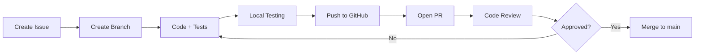

# Contributing Guide

## Contexto

Este estándar define **Contributing Guide**: documentación obligatoria en cada repositorio explicando **cómo contribuir** código. Establece proceso claro de Pull Requests, code reviews, branching strategy, y convenciones reduciendo fricción para nuevos desarrolladores. Complementa [Git Workflow](./git-workflow.md) y [Code Conventions](./code-conventions.md).

---

## Estructura Obligatoria

````markdown
# Contributing to Sales Service

## 📋 Table of Contents

1. [Getting Started](#getting-started)
2. [Development Workflow](#development-workflow)
3. [Branching Strategy](#branching-strategy)
4. [Commit Guidelines](#commit-guidelines)
5. [Pull Request Process](#pull-request-process)
6. [Code Review Guidelines](#code-review-guidelines)
7. [Testing Requirements](#testing-requirements)
8. [Documentation Standards](#documentation-standards)

---

## Getting Started

### Prerequisites

- .NET 8 SDK
- Docker Desktop
- AWS CLI v2
- Make

### First-Time Setup

```bash
# Clone repository
git clone https://github.com/talma/sales-service.git
cd sales-service

# Install dependencies
make setup

# Run local environment
make dev

# Verify setup
make test
```
````

### Development Environment

Service runs on http://localhost:5000
Swagger UI: http://localhost:5000/swagger
PostgreSQL: localhost:5432 (user: postgres, pass: postgres)

---

## Development Workflow



### Step-by-Step

1. **Create Issue**: Describe feature/bug in GitHub Issues
2. **Create Branch**: From latest `main` branch
3. **Code**: Implement changes following [Code Conventions](./code-conventions.md)
4. **Test**: Write unit tests (>80% coverage)
5. **Push**: Push branch to GitHub
6. **PR**: Open Pull Request with template
7. **Review**: Address reviewer comments
8. **Merge**: Squash and merge to `main`

---

## Branching Strategy

```yaml
# ✅ Branch Naming Convention

feature/<issue-number>-<short-description>
  Example: feature/123-add-order-discount
  Use: New features

bugfix/<issue-number>-<short-description>
  Example: bugfix/456-fix-null-pointer
  Use: Bug fixes

hotfix/<issue-number>-<short-description>
  Example: hotfix/789-fix-payment-critical
  Use: Production bugs (branch from main)

chore/<short-description>
  Example: chore/update-dependencies
  Use: Maintenance (no functional changes)

refactor/<short-description>
  Example: refactor/extract-order-validation
  Use: Code refactoring (no behavior change)
```

### Protected Branches

```yaml
main:
  - ✅ Protected (no direct push)
  - ✅ Require PR with 1+ approval
  - ✅ Require status checks (build, tests, SonarQube)
  - ✅ Require linear history (squash merge only)
  - ✅ Delete branch after merge

develop:
  - ❌ Not used (trunk-based development)
```

---

## Commit Guidelines

### Format

```bash
<type>(<scope>): <subject>

<body>

<footer>
```

### Types

```yaml
feat: New feature
  Example: feat(orders): add discount calculation

fix: Bug fix
  Example: fix(payment): handle null customer

docs: Documentation only
  Example: docs(readme): update setup instructions

style: Formatting (no code change)
  Example: style(orders): fix indentation

refactor: Code refactoring
  Example: refactor(orders): extract validation logic

test: Add missing tests
  Example: test(orders): add discount edge cases

chore: Maintenance
  Example: chore(deps): update NuGet packages
```

### Examples

```bash
# ✅ Good commit
feat(orders): add order discount calculation

Implement discount calculation based on:
- Customer loyalty tier (Bronze/Silver/Gold)
- Order total amount (>$100 gets 10% off)
- Promo codes

Closes #123

# ✅ Good commit (breaking change)
feat(api)!: change order response format

BREAKING CHANGE: Order API now returns ISO 8601 dates
instead of Unix timestamps.

Migration: Update client code to parse ISO dates.

Closes #456

# ❌ Bad commit (vague)
fix: bug

# ❌ Bad commit (too long subject)
feat(orders): add order discount calculation based on customer loyalty tier and order amount
```

### Rules

- **MUST** use present tense ("add" not "added")
- **MUST** keep subject line ≤ 50 characters
- **MUST** capitalize subject line ("Add" not "add")
- **MUST** not end subject with period
- **SHOULD** include issue number ("Closes #123")
- **SHOULD** explain "what" and "why" in body, not "how"

---

## Pull Request Process

### PR Template

```markdown
## Description

Brief description of changes.

## Type of Change

- [ ] Bug fix (non-breaking)
- [ ] New feature (non-breaking)
- [ ] Breaking change (fix or feature that causes existing functionality to change)
- [ ] Documentation update

## Related Issue

Closes #123

## Changes Made

- Added discount calculation logic
- Updated Order model with discount field
- Added unit tests for discount scenarios

## Testing

- [x] Unit tests pass (>80% coverage)
- [x] Integration tests pass
- [x] Manual testing completed

## Checklist

- [x] Code follows [Code Conventions](./code-conventions.md)
- [x] Self-review completed
- [x] Comments added (complex logic)
- [x] Documentation updated (README, API docs)
- [x] No new warnings
- [x] Tests added (cover changes)
- [x] All tests pass locally

## Screenshots (if applicable)


## Deployment Notes

None (backward compatible).
```

### PR Title Format

```bash
<type>(<scope>): <subject>

# Same as commit message convention

Examples:
  feat(orders): add discount calculation
  fix(payment): handle null customer
  docs(readme): update contributing guide
```

### Size Guidelines

```yaml
Small PR (preferred):
  - Lines changed: < 200
  - Files changed: < 5
  - Review time: ~15 minutes
  - ✅ Easy to review

Medium PR:
  - Lines changed: 200-500
  - Files changed: 5-10
  - Review time: ~30 minutes
  - ⚠️ Consider splitting

Large PR (avoid):
  - Lines changed: > 500
  - Files changed: > 10
  - Review time: > 1 hour
  - ❌ Hard to review, risky

  Action: Split into multiple PRs (feature flags help)
```

### Required Checks

```yaml
# All must pass before merge

Build:
  Status: ✅ Passing
  Job: dotnet build

Unit Tests:
  Status: ✅ Passing
  Coverage: ≥ 80%
  Job: dotnet test

Integration Tests:
  Status: ✅ Passing
  Job: docker-compose up && dotnet test --filter Integration

SonarQube:
  Status: ✅ Passing
  Quality Gate: Passed
  Criteria:
    - Bugs: 0
    - Vulnerabilities: 0
    - Code Smells: < 10
    - Coverage: ≥ 80%
    - Duplications: < 3%

Dependency Check:
  Status: ✅ Passing
  Vulnerabilities: 0 Critical/High
  Tool: Dependabot, Snyk

Code Review:
  Status: ✅ Approved
  Reviewers: ≥ 1 approval required
```

---

## Code Review Guidelines

### For Authors

```yaml
# ✅ Before Requesting Review

1. Self-Review:
   - Read your own code (fresh perspective)
   - Check for commented-out code (remove)
   - Check for console.log, debug prints (remove)
   - Check for hardcoded values (use config)

2. Run Quality Checks:
   make lint      # Fix linting issues
   make test      # All tests pass
   make coverage  # Coverage ≥ 80%

3. Update Documentation:
   - Update README if public API changed
   - Add inline comments (complex logic)
   - Update API docs (Swagger/OpenAPI)

4. Small PRs:
   - Keep changes focused (single concern)
   - Split large PRs (multiple commits or feature flags)

5. Provide Context:
   - Good PR description (what, why)
   - Link to issue/ticket
   - Add screenshots (UI changes)
   - Note deployment considerations
```

### For Reviewers

```yaml
# ✅ Review Checklist

Functionality:
  - [ ] Code does what PR describes
  - [ ] Edge cases handled
  - [ ] Error handling appropriate
  - [ ] No obvious bugs

Code Quality:
  - [ ] Follows [Code Conventions](./code-conventions.md)
  - [ ] DRY (no duplication)
  - [ ] SOLID principles
  - [ ] Clear naming (self-documenting)
  - [ ] Appropriate abstractions (not over-engineered)

Testing:
  - [ ] New code covered by tests
  - [ ] Tests meaningful (not just for coverage)
  - [ ] Edge cases tested
  - [ ] Integration tests if needed

Security:
  - [ ] No secrets in code
  - [ ] Input validation present
  - [ ] SQL injection prevented (parameterized queries)
  - [ ] XSS prevented (output encoding)
  - [ ] Authentication/authorization correct

Performance:
  - [ ] No obvious performance issues
  - [ ] No N+1 queries
  - [ ] Appropriate caching
  - [ ] Database indexes (large tables)

Documentation:
  - [ ] Complex logic commented
  - [ ] Public API documented
  - [ ] README updated if needed
```

### Review Comments

```csharp
# ✅ Good Review Comment (constructive)

// ❓ Question
What happens if customer is null here?
Consider adding null check:

if (customer == null)
    throw new NotFoundException("Customer not found");

// 💡 Suggestion
This could be simplified using LINQ:

var activeOrders = orders.Where(o => o.Status == "Active").ToList();

// ⚠️ Issue (must fix)
This SQL query is vulnerable to injection.
Use parameterized query:

var sql = "SELECT * FROM orders WHERE customer_id = @customerId";
var result = await _db.QueryAsync<Order>(sql, new { customerId });

// ✅ Praise (positive feedback)
Nice refactoring! This is much more readable now.


# ❌ Bad Review Comment (not helpful)

This is wrong.
Rewrite this.
Why did you do it this way?
```

### Response Time

```yaml
# SLA for Code Reviews

Small PR (< 200 lines):
  First review: Within 4 hours
  Follow-up: Within 2 hours

Medium PR (200-500 lines):
  First review: Within 8 hours (same day)
  Follow-up: Within 4 hours

Large PR (> 500 lines):
  First review: Within 1 business day
  Follow-up: Within 8 hours

Critical Hotfix:
  First review: Within 30 minutes
  Follow-up: Within 15 minutes
```

### Approval Process

```yaml
# ✅ Approval Criteria

1 Approval Required (minimum):
  - From team member with write access
  - All status checks passing
  - All conversations resolved

For Critical Changes:
  - 2 Approvals required (tech lead + peer)
  - Examples: Database migration, Breaking API change, Security fix

For Hotfixes:
  - 1 Approval + Tech Lead notification
  - Can merge with reduced review (emergencies)
  - Post-fix review required (within 24 hours)
```

---

## Testing Requirements

```yaml
# ✅ Test Coverage Requirements

Unit Tests:
  Coverage: ≥ 80%
  Scope: Business logic, domain models

  Example:
    public class OrderDiscountCalculatorTests
    {
        [Fact]
        public void Calculate_BronzeTier_Returns5PercentDiscount()
        {
            var calculator = new OrderDiscountCalculator();
            var order = new Order { Total = 100, Customer = Bronze };

            var discount = calculator.Calculate(order);

            Assert.Equal(5, discount);
        }
    }

Integration Tests:
  Coverage: API endpoints, database interactions

  Example:
    public class OrdersControllerTests : IntegrationTestBase
    {
        [Fact]
        public async Task CreateOrder_ValidRequest_Returns201Created()
        {
            var request = new CreateOrderRequest { ... };

            var response = await _client.PostAsJsonAsync("/api/orders", request);

            response.StatusCode.Should().Be(HttpStatusCode.Created);
        }
    }

E2E Tests (Optional):
  Tool: Playwright, Selenium
  Scope: Critical user journeys

  Example: Place order flow (add to cart → checkout → payment → confirmation)

Performance Tests (Required for critical APIs):
  Tool: k6, Artillery
  Criteria: P99 latency < 500ms, Throughput > 100 RPS
```

---

## Documentation Standards

```yaml
# ✅ When to Update Documentation

README.md:
  - New prerequisites added (e.g., new tool required)
  - Setup steps changed
  - Public API changed (endpoints, contracts)
  - Architecture changed (new services, databases)

API Documentation (Swagger):
  - New endpoint added
  - Request/response format changed
  - Status codes changed
  - Authentication requirements changed

Inline Comments:
  - Complex algorithm (explain logic)
  - Non-obvious business rule (explain why)
  - Workaround for library bug (explain context)
  - Performance optimization (explain trade-off)

ADR (Architecture Decision Record):
  - Major technology choice (e.g., switch from REST to gRPC)
  - Significant pattern change (e.g., adopt CQRS)
  - Security decision (e.g., implement mTLS)
```

---

## Example Workflow

```bash
# ✅ Complete Example: Add Discount Feature

# 1. Create Issue
# Issue #123: Add order discount calculation

# 2. Create Branch
git checkout main
git pull origin main
git checkout -b feature/123-add-order-discount

# 3. Implement Changes
# (Code here)

# 4. Add Tests
# (Tests here)

# 5. Verify Locally
make test
make lint
make coverage

# 6. Commit (conventional commits)
git add .
git commit -m "feat(orders): add discount calculation

Implement discount calculation based on:
- Customer loyalty tier (Bronze/Silver/Gold)
- Order total amount (>$100 gets 10% off)

Closes #123"

# 7. Push Branch
git push origin feature/123-add-order-discount

# 8. Open PR
# Go to GitHub, click "Compare & pull request"
# Fill out PR template (description, checklist)

# 9. Wait for CI
# GitHub Actions runs: build, tests, SonarQube

# 10. Request Review
# Tag reviewer: @john-doe

# 11. Address Feedback
# Reviewer asks: "What if customer is null?"
# Add null check, push new commit

git add .
git commit -m "fix(orders): add null check for customer"
git push origin feature/123-add-order-discount

# 12. Get Approval
# Reviewer approves ✅

# 13. Merge
# Squash and merge to main
# Branch auto-deleted

# 14. Deploy
# CI/CD pipeline triggers automatically
# Deployment to dev → qa → prod
```

---

## Requisitos Técnicos

### MUST (Obligatorio)

- **MUST** tener CONTRIBUTING.md en root del repositorio
- **MUST** incluir secciones: Setup, Workflow, Branching, PR Process, Code Review
- **MUST** usar conventional commits (feat, fix, docs, etc.)
- **MUST** requerir PR con 1+ approval para merge a main
- **MUST** pasar todos los checks (build, tests, SonarQube) antes de merge
- **MUST** mantener coverage ≥ 80%

### SHOULD (Fuertemente recomendado)

- **SHOULD** usar PR template (estandariza información)
- **SHOULD** limitar PR size (< 200 lines preferred)
- **SHOULD** responder code reviews dentro de 4 hours (small PR)
- **SHOULD** usar squash merge (linear history)

### MUST NOT (Prohibido)

- **MUST NOT** push directamente a main (siempre usar PR)
- **MUST NOT** merge sin approval (bypass protection)
- **MUST NOT** merge con failing checks (build, tests, SonarQube)
- **MUST NOT** commit secrets (API keys, passwords, tokens)

---

## Referencias

- [Git Workflow](./git-workflow.md)
- [Code Conventions](./code-conventions.md)
- [Testing Strategy](./testing-strategy.md)
- [README Standards](../operabilidad/readme-standards.md)
