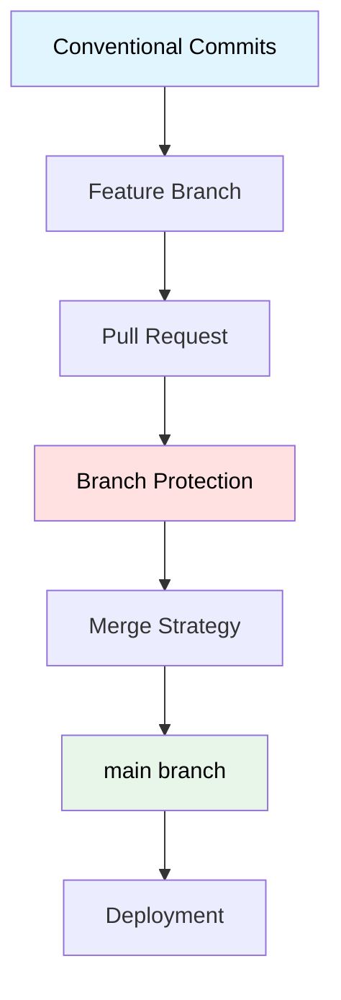
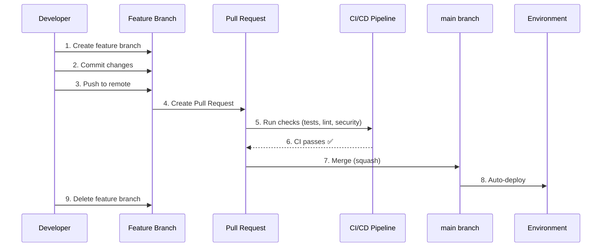

# Git Workflow y Estrategia de Ramas

## Contexto

Este estándar define el flujo de trabajo con Git para desarrollo colaborativo, asegurando trazabilidad, calidad y despliegues controlados. Complementa el lineamiento [Control de Versiones](../../lineamientos/desarrollo/04-control-versiones.md).

**Conceptos incluidos:**

- **Git Workflow** — Flujo de trabajo colaborativo
- **Branching Strategy** — Estrategia de ramas
- **Merge Strategies** — Estrategias de merge
- **Branch Protection** — Protección de ramas críticas
- **Conventional Commits** — Commits estructurados

---

## Stack Tecnológico

| Componente            | Tecnología      | Versión | Uso                         |
| --------------------- | --------------- | ------- | --------------------------- |
| **Control Versiones** | Git             | 2.40+   | Control de versiones        |
| **Hosting**           | GitHub          | -       | Repositorio remoto          |
| **CI/CD**             | GitHub Actions  | -       | Automatización de workflows |
| **Branch Protection** | GitHub Rulesets | -       | Reglas de protección        |

---

## Relación entre Conceptos



---

## Git Workflow

### ¿Qué es Git Workflow?

Flujo de trabajo estandarizado para desarrollo colaborativo usando Git. Adoptamos **GitHub Flow** (simplificado) para microservicios.

**Principios:**

- **main siempre deployable**: main está en estado deployable en todo momento
- **Feature branches**: Todo desarrollo en ramas feature
- **Pull Requests**: Revisión de código obligatoria
- **Deploy frecuente**: Integración continua y despliegues frecuentes
- **Rollback rápido**: Capacidad de revertir rápidamente

**Propósito:** Desarrollo colaborativo, calidad y trazabilidad.

**Beneficios:**
✅ Flujo simple y predecible
✅ Integraciones frecuentes
✅ Revisión de código sistemática
✅ Historial limpio y auditable

### Flujo de Trabajo Completo

```bash
# 1. Crear feature branch desde main
git checkout main
git pull origin main
git checkout -b feature/JIRA-123-add-customer-validation

# 2. Desarrollo con commits atómicos
git add src/CustomerService/Validators/
git commit -m "feat(customer): add document validation

- Add DNI validation (8 digits)
- Add RUC validation (11 digits)
- Add CE validation (9-12 chars)

Refs: JIRA-123"

# 3. Mantener sincronizado con main
git fetch origin main
git rebase origin/main

# 4. Push a remote
git push origin feature/JIRA-123-add-customer-validation

# 5. Crear Pull Request en GitHub
# (manual en UI o con gh CLI)
gh pr create \
  --title "feat(customer): add document validation" \
  --body "## Descripción\n\nAgrega validación de documentos...\n\n## Referencias\nJIRA-123" \
  --base main \
  --head feature/JIRA-123-add-customer-validation

# 6. Code Review + CI/CD pasa
# 7. Merge a main (squash and merge)
# 8. Delete feature branch
git checkout main
git pull origin main
git branch -d feature/JIRA-123-add-customer-validation
```

### GitHub Flow Diagram



---

## Branching Strategy

### ¿Qué es Branching Strategy?

Convención para nombrar y usar ramas según su propósito.

**Tipos de ramas:**

| Tipo         | Prefijo    | Propósito                 | Base | Merge a | Lifetime   |
| ------------ | ---------- | ------------------------- | ---- | ------- | ---------- |
| **main**     | -          | Rama principal deployable | -    | -       | Permanente |
| **feature/** | `feature/` | Nueva funcionalidad       | main | main    | Temporal   |
| **bugfix/**  | `bugfix/`  | Corrección de bugs        | main | main    | Temporal   |
| **hotfix/**  | `hotfix/`  | Fix urgente en producción | main | main    | Temporal   |
| **chore/**   | `chore/`   | Tareas de mantenimiento   | main | main    | Temporal   |

**Propósito:** Organización clara, automatización de CI/CD por tipo de rama.

**Beneficios:**
✅ Convención clara
✅ Automatización por prefijo
✅ Búsqueda y filtrado fácil

### Naming Conventions

```bash
# ✅ BUENO: Descriptivo, incluye ticket, kebab-case
feature/JIRA-123-add-customer-validation
feature/JIRA-456-implement-saga-pattern
bugfix/JIRA-789-fix-null-reference-error
hotfix/JIRA-999-fix-critical-security-vulnerability
chore/JIRA-111-update-dependencies

# ❌ MALO: Genérico, sin contexto
feature/new-feature
bugfix/fix
feature/test

# ❌ MALO: Mixto case, espacios
feature/Add Customer Validation
Feature/JIRA-123_add_validation
```

### Reglas de Branching

```yaml
# .github/workflows/branch-naming.yml
# Validar naming de branches en PR

name: Validate Branch Name

on:
  pull_request:
    types: [opened, synchronize, reopened]

jobs:
  validate-branch:
    runs-on: ubuntu-latest
    steps:
      - name: Check branch name
        run: |
          BRANCH_NAME="${{ github.head_ref }}"

          if [[ $BRANCH_NAME =~ ^(feature|bugfix|hotfix|chore)/[A-Z]+-[0-9]+-[a-z0-9-]+$ ]]; then
            echo "✅ Branch name is valid: $BRANCH_NAME"
          else
            echo "❌ Invalid branch name: $BRANCH_NAME"
            echo "Expected format: feature|bugfix|hotfix|chore/JIRA-123-descriptive-name"
            exit 1
          fi
```

---

## Merge Strategies

### ¿Qué son Merge Strategies?

Estrategias para integrar cambios de una rama a otra, afectando el historial de Git.

**Opciones:**

| Estrategia       | Comando               | Historial      | Cuándo usar                       |
| ---------------- | --------------------- | -------------- | --------------------------------- |
| **Merge Commit** | `git merge --no-ff`   | Preserva todos | Ramas largas, múltiples autores   |
| **Squash Merge** | `git merge --squash`  | 1 commit       | Feature pequeño, limpiar historia |
| **Rebase Merge** | `git rebase`          | Lineal         | Mantener historia limpia          |
| **Fast-Forward** | `git merge --ff-only` | Lineal         | Solo si no hay divergencia        |

**Propósito:** Historial limpio y auditable, trazabilidad de cambios.

**Beneficios:**
✅ Historial claro
✅ Revertir cambios fácilmente
✅ Auditoría simplificada

### Recomendación por Escenario

```bash
# ✅ Squash and Merge (RECOMENDADO para PRs)
# - Features pequeños/medianos
# - Historial de PR no relevante para main
# - Quieres 1 commit por feature en main

# GitHub UI: Usar "Squash and merge" button
# O manualmente:
git checkout main
git merge --squash feature/JIRA-123-add-validation
git commit -m "feat(customer): add document validation

* Add DNI, RUC, CE validation
* Add unit tests
* Update documentation

Refs: JIRA-123"

# ✅ Merge Commit (para ramas largas)
# - Ramas con múltiples desarrolladores
# - Quieres preservar historial completo

git checkout main
git merge --no-ff feature/JIRA-456-implement-saga
# Crea merge commit automático

# ✅ Rebase (para mantener historia lineal)
# - Feature pequeño, commits limpios
# - Quieres historia lineal sin merge commits

git checkout feature/JIRA-789-fix-bug
git rebase main
git checkout main
git merge --ff-only feature/JIRA-789-fix-bug

# ❌ EVITAR: Merge directo sin estrategia clara
git merge feature/xyz  # ¿Qué estrategia usa? No explícito
```

### Configuración en GitHub

```yaml
# Configurar en GitHub Repository Settings > Pull Requests

Merge options:
  ✅ Allow squash merging (RECOMENDADO como default)
    - Default commit message: Pull request title and description
  ✅ Allow merge commits (para casos especiales)
  ❌ Allow rebase merging (deshabilitado, hacer manualmente si necesario)

Automatically delete head branches: ✅ Enabled
```

---

## Branch Protection

### ¿Qué es Branch Protection?

Reglas que protegen ramas críticas (main, release) de cambios no autorizados o de baja calidad.

**Controles:**

- **Require PR**: No commits directos
- **Require reviews**: N aprobaciones antes de merge
- **Require status checks**: CI/CD debe pasar
- **Require signed commits**: Commits firmados con GPG
- **Restrict force push**: No reescribir historial
- **Restrict deletion**: No borrar rama

**Propósito:** Calidad de código, revisión obligatoria, prevenir errores.

**Beneficios:**
✅ Prevenir commits directos
✅ Garantizar revisión
✅ Asegurar CI pasa
✅ Proteger historial

### Configuración de Branch Protection

```yaml
# GitHub Repository Settings > Branches > Branch protection rules

Branch name pattern: main

Protection rules:
  ✅ Require a pull request before merging
    Required approvals: 1
    ✅ Dismiss stale pull request approvals when new commits are pushed
    ✅ Require review from Code Owners (si existe CODEOWNERS)

  ✅ Require status checks to pass before merging
    ✅ Require branches to be up to date before merging
    Status checks required:
      - build
      - test
      - lint
      - security-scan
      - sonarqube-analysis

  ✅ Require conversation resolution before merging

  ✅ Require signed commits

  ✅ Require linear history (squash or rebase only)

  ✅ Do not allow bypassing the above settings (excepto admins en emergencias)

  ✅ Restrict pushes that create matching branches
    - Only allow specific roles/users
```

### CODEOWNERS File

```bash
# .github/CODEOWNERS
# Define ownership para code review automático

# Arquitectura y DevOps
/terraform/                     @talma/devops-team
/.github/workflows/             @talma/devops-team
/docs/arquitectura/             @talma/architecture-team

# Services
/src/CustomerService/           @talma/customer-team
/src/OrderService/              @talma/order-team
/src/PaymentService/            @talma/payment-team

# Shared libraries
/src/SharedKernel/              @talma/architecture-team
/src/Common/                    @talma/architecture-team

# Security
/**/*Security*/                 @talma/security-team
/**/*Auth*/                     @talma/security-team

# Database migrations
**/Migrations/                  @talma/dba-team @talma/service-team
```

---

## Conventional Commits

### ¿Qué son Conventional Commits?

Especificación para dar estructura a mensajes de commit, facilitando generación de changelogs, versionamiento semántico y comprensión del historial.

**Formato:**

```
<type>(<scope>): <subject>

<body>

<footer>
```

**Tipos comunes:**

- **feat**: Nueva funcionalidad
- **fix**: Corrección de bug
- **docs**: Cambios solo en documentación
- **style**: Formato (espacios, puntos y coma, etc.)
- **refactor**: Refactorización sin cambio funcional
- **perf**: Mejora de performance
- **test**: Agregar/modificar tests
- **chore**: Tareas de mantenimiento (deps, build, etc.)
- **ci**: Cambios en CI/CD

**Propósito:** Historial estructurado, automatización, changelog automático.

**Beneficios:**
✅ Historial comprensible
✅ Generación automática de changelogs
✅ Versionamiento semántico automático
✅ Mejor auditoría

### Ejemplos de Conventional Commits

```bash
# ✅ Feature simple
git commit -m "feat(customer): add document validation"

# ✅ Feature con body detallado
git commit -m "feat(customer): add document validation

- Add DNI validation (8 digits)
- Add RUC validation (11 digits)
- Add CE validation (9-12 chars)

Refs: JIRA-123"

# ✅ Bug fix con breaking change
git commit -m "fix(customer): change email validation regex

BREAKING CHANGE: Email validation now requires TLD of at least 2 chars.
Previous regex allowed single-char TLDs which are invalid.

Fixes: JIRA-456"

# ✅ Multiple scopes
git commit -m "refactor(customer,order): extract common validation logic"

# ✅ Chore (no impacto funcional)
git commit -m "chore(deps): update Entity Framework to 8.0.2"

# ✅ CI/CD change
git commit -m "ci(github): add security scanning to PR workflow"

# ❌ MALO: No sigue convención
git commit -m "fixed bug"
git commit -m "WIP"
git commit -m "update"
```

### Validación de Commits

```yaml
# .github/workflows/commit-lint.yml
# Validar conventional commits en PR

name: Commit Lint

on:
  pull_request:
    types: [opened, synchronize, reopened]

jobs:
  commit-lint:
    runs-on: ubuntu-latest
    steps:
      - uses: actions/checkout@v4
        with:
          fetch-depth: 0

      - name: Validate commit messages
        run: |
          # Obtener commits del PR
          COMMITS=$(git log --format=%s origin/${{ github.base_ref }}..${{ github.head_ref }})

          # Regex para conventional commits
          PATTERN="^(feat|fix|docs|style|refactor|perf|test|chore|ci)(\([a-z0-9-]+\))?: .+"

          echo "$COMMITS" | while read -r commit; do
            if [[ ! $commit =~ $PATTERN ]]; then
              echo "❌ Invalid commit message: $commit"
              echo "Expected format: type(scope): subject"
              echo "Example: feat(customer): add document validation"
              exit 1
            else
              echo "✅ Valid commit: $commit"
            fi
          done
```

### Git Hooks para Conventional Commits

```bash
# .git/hooks/commit-msg
# Validar mensaje de commit localmente

#!/bin/bash

commit_msg_file=$1
commit_msg=$(cat "$commit_msg_file")

# Pattern para conventional commits
pattern="^(feat|fix|docs|style|refactor|perf|test|chore|ci)(\([a-z0-9-]+\))?: .{1,100}"

if ! echo "$commit_msg" | grep -qE "$pattern"; then
  echo "❌ ERROR: Commit message no sigue Conventional Commits"
  echo ""
  echo "Formato esperado:"
  echo "  type(scope): subject"
  echo ""
  echo "Tipos válidos:"
  echo "  feat, fix, docs, style, refactor, perf, test, chore, ci"
  echo ""
  echo "Ejemplo:"
  echo "  feat(customer): add document validation"
  echo ""
  exit 1
fi

echo "✅ Commit message válido"
```

---

## Implementación Integrada

### Setup Completo de Repositorio

```bash
# 1. Crear repositorio con estructura estándar
mkdir customer-service
cd customer-service
git init

# 2. Crear .gitignore
cat > .gitignore << 'EOF'
# .NET
bin/
obj/
*.user
*.suo
.vs/

# IDEs
.idea/
.vscode/

# Build outputs
dist/
publish/

# Secrets
*.pfx
*.key
appsettings.*.json
!appsettings.Development.json

# OS
.DS_Store
Thumbs.db
EOF

# 3. Crear README.md
cat > README.md << 'EOF'
# Customer Service

## Descripción
Servicio de gestión de clientes.

## Tecnologías
- .NET 8
- PostgreSQL 15
- Redis 7.2

## Getting Started
Ver [CONTRIBUTING.md](CONTRIBUTING.md)
EOF

# 4. Crear CONTRIBUTING.md con workflow
cat > CONTRIBUTING.md << 'EOF'
# Contributing

## Git Workflow

1. Create feature branch: `git checkout -b feature/JIRA-123-description`
2. Commit with conventional format: `git commit -m "feat(scope): description"`
3. Push: `git push origin feature/JIRA-123-description`
4. Create Pull Request
5. Wait for review + CI
6. Merge (squash and merge)

## Branch Naming
- `feature/JIRA-123-add-validation`
- `bugfix/JIRA-456-fix-null-error`
- `hotfix/JIRA-789-security-fix`

## Commit Convention
```

type(scope): subject

body (optional)

footer (optional)

```
EOF

# 5. Crear CODEOWNERS
mkdir -p .github
cat > .github/CODEOWNERS << 'EOF'
* @talma/customer-team
/terraform/ @talma/devops-team
/.github/ @talma/devops-team
EOF

# 6. Configurar Git hooks
cat > .git/hooks/commit-msg << 'EOF'
#!/bin/bash
commit_msg=$(cat "$1")
pattern="^(feat|fix|docs|style|refactor|perf|test|chore|ci)(\([a-z0-9-]+\))?: .+"

if ! echo "$commit_msg" | grep -qE "$pattern"; then
  echo "❌ Commit message debe seguir Conventional Commits"
  exit 1
fi
EOF

chmod +x .git/hooks/commit-msg

# 7. Primer commit
git add .
git commit -m "chore: initial repository setup"

# 8. Configurar remote y push
git remote add origin git@github.com:talma/customer-service.git
git branch -M main
git push -u origin main
```

### Configuración de GitHub Actions

```yaml
# .github/workflows/pr-validation.yml
# Validación completa de Pull Requests

name: PR Validation

on:
  pull_request:
    types: [opened, synchronize, reopened]

jobs:
  validate-branch:
    name: Validate Branch Name
    runs-on: ubuntu-latest
    steps:
      - name: Check branch naming
        run: |
          BRANCH="${{ github.head_ref }}"
          if [[ ! $BRANCH =~ ^(feature|bugfix|hotfix|chore)/[A-Z]+-[0-9]+-[a-z0-9-]+$ ]]; then
            echo "❌ Branch name invalid: $BRANCH"
            exit 1
          fi

  validate-commits:
    name: Validate Commit Messages
    runs-on: ubuntu-latest
    steps:
      - uses: actions/checkout@v4
        with:
          fetch-depth: 0

      - name: Check conventional commits
        run: |
          PATTERN="^(feat|fix|docs|style|refactor|perf|test|chore|ci)(\([a-z0-9-]+\))?: .+"
          git log --format=%s origin/${{ github.base_ref }}..${{ github.head_ref }} | while read msg; do
            if [[ ! $msg =~ $PATTERN ]]; then
              echo "❌ Invalid commit: $msg"
              exit 1
            fi
          done

  build:
    name: Build
    runs-on: ubuntu-latest
    steps:
      - uses: actions/checkout@v4
      - uses: actions/setup-dotnet@v4
        with:
          dotnet-version: "8.0.x"

      - name: Restore dependencies
        run: dotnet restore

      - name: Build
        run: dotnet build --no-restore --configuration Release

  test:
    name: Test
    runs-on: ubuntu-latest
    needs: build
    steps:
      - uses: actions/checkout@v4
      - uses: actions/setup-dotnet@v4
        with:
          dotnet-version: "8.0.x"

      - name: Run tests
        run: dotnet test --configuration Release --logger "trx"

      - name: Upload test results
        if: always()
        uses: actions/upload-artifact@v4
        with:
          name: test-results
          path: "**/*.trx"

  security:
    name: Security Scan
    runs-on: ubuntu-latest
    steps:
      - uses: actions/checkout@v4

      - name: Run Trivy scan
        uses: aquasecurity/trivy-action@master
        with:
          scan-type: "fs"
          scan-ref: "."
          format: "sarif"
          output: "trivy-results.sarif"

      - name: Upload results
        uses: github/codeql-action/upload-sarif@v2
        with:
          sarif_file: "trivy-results.sarif"
```

---

## Requisitos Técnicos

### MUST (Obligatorio)

**Git Workflow:**

- **MUST** usar GitHub Flow (feature branches + PRs)
- **MUST** mantener main siempre deployable
- **MUST** crear Pull Request para todo cambio
- **MUST** obtener al menos 1 aprobación antes de merge
- **MUST** pasar CI/CD antes de merge

**Branching:**

- **MUST** usar prefijos estándar (feature/, bugfix/, hotfix/, chore/)
- **MUST** incluir ticket ID en nombre de rama (JIRA-123)
- **MUST** usar kebab-case para nombres de rama
- **MUST** crear branches desde main actualizado

**Merge:**

- **MUST** usar "Squash and Merge" como estrategia default para PRs
- **MUST** eliminar feature branch después de merge
- **MUST** sincronizar con main antes de merge (rebase o merge)

**Branch Protection:**

- **MUST** proteger main con branch protection rules
- **MUST** requerir PR para todo cambio en main
- **MUST** requerir status checks passed
- **MUST** prevenir force push en main

**Conventional Commits:**

- **MUST** seguir formato Conventional Commits
- **MUST** usar tipos válidos (feat, fix, docs, style, refactor, perf, test, chore, ci)
- **MUST** incluir scope cuando sea aplicable
- **MUST** incluir referencia a ticket en body o footer

### SHOULD (Fuertemente recomendado)

- **SHOULD** usar signed commits (GPG)
- **SHOULD** definir CODEOWNERS para code review automático
- **SHOULD** configurar git hooks para validar commits localmente
- **SHOULD** mantener PRs pequeños (< 400 líneas)
- **SHOULD** escribir descripción clara en PRs
- **SHOULD** resolver conversaciones antes de merge
- **SHOULD** rebasar feature branch con main antes de crear PR

### MAY (Opcional)

- **MAY** usar merge commits para ramas largas con múltiples colaboradores
- **MAY** usar rebase merge para mantener historia lineal
- **MAY** configurar auto-merge cuando CI pasa
- **MAY** usar draft PRs para trabajo en progreso

### MUST NOT (Prohibido)

- **MUST NOT** hacer commit directo a main
- **MUST NOT** usar force push en main
- **MUST NOT** eliminar main
- **MUST NOT** hacer merge sin revisión
- **MUST NOT** hacer merge con CI fallando
- **MUST NOT** usar mensajes de commit genéricos ("fix", "update", "WIP")

---

## Referencias

**Documentación oficial:**

- [GitHub Flow](https://docs.github.com/en/get-started/quickstart/github-flow)
- [Conventional Commits](https://www.conventionalcommits.org/)
- [Branch Protection](https://docs.github.com/en/repositories/configuring-branches-and-merges-in-your-repository/managing-protected-branches)
- [CODEOWNERS](https://docs.github.com/en/repositories/managing-your-repositorys-settings-and-features/customizing-your-repository/about-code-owners)

**Herramientas:**

- [GitHub CLI](https://cli.github.com/)
- [Commitizen](https://github.com/commitizen/cz-cli) - CLI para conventional commits

**Relacionados:**

- [CI/CD y Deployment](../operabilidad/cicd-deployment.md)
- [Code Quality](./code-quality.md)

---

**Última actualización**: 18 de febrero de 2026
**Responsable**: Equipo de Arquitectura
