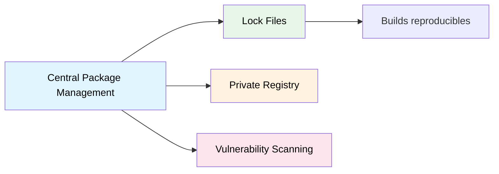

# Gestión de Paquetes NuGet

## Contexto

Este estándar define las prácticas para la gestión centralizada de dependencias NuGet. Complementa el lineamiento [Autonomía de Servicios](../../lineamientos/arquitectura/10-autonomia-de-servicios.md).

**Conceptos incluidos:**

- **Package Management** — Gestión de paquetes NuGet

---

## Stack Tecnológico

| Componente          | Tecnología      | Versión | Uso                          |
| ------------------- | --------------- | ------- | ---------------------------- |
| **Package Manager** | NuGet           | 6.8+    | Gestión de dependencias .NET |
| **Registry**        | GitHub Packages | -       | Registro privado de paquetes |

---

## Relación entre Conceptos



---

## Package Management

### ¿Qué es Package Management?

Gestión centralizada de dependencias externas (NuGet packages) asegurando versiones consistentes, seguridad y actualización controlada.

**Aspectos clave:**

- **Central Package Management**: Versiones en un solo lugar
- **Lock files**: Reproducibilidad de builds
- **Private registry**: Paquetes internos seguros
- **Vulnerability scanning**: Detección de CVEs
- **Dependency updates**: Actualización controlada

**Propósito:** Dependencias consistentes, seguras y actualizadas.

**Beneficios:**
✅ Versiones consistentes entre servicios
✅ Detección temprana de vulnerabilidades
✅ Builds reproducibles
✅ Gestión centralizada

### Central Package Management (CPM)

```xml
<!-- Directory.Packages.props - Raíz del repositorio -->
<!-- Habilitar Central Package Management en .NET 7+ -->

<Project>
  <PropertyGroup>
    <ManagePackageVersionsCentrally>true</ManagePackageVersionsCentrally>
    <CentralPackageTransitivePinningEnabled>true</CentralPackageTransitivePinningEnabled>
  </PropertyGroup>

  <ItemGroup Label="Microsoft Packages">
    <PackageVersion Include="Microsoft.AspNetCore.Authentication.JwtBearer" Version="8.0.2" />
    <PackageVersion Include="Microsoft.EntityFrameworkCore" Version="8.0.2" />
    <PackageVersion Include="Microsoft.EntityFrameworkCore.Design" Version="8.0.2" />
    <PackageVersion Include="Microsoft.Extensions.Configuration.EnvironmentVariables" Version="8.0.0" />
    <PackageVersion Include="Microsoft.Extensions.Diagnostics.HealthChecks" Version="8.0.2" />
    <PackageVersion Include="Microsoft.Extensions.Logging.Console" Version="8.0.0" />
  </ItemGroup>

  <ItemGroup Label="Database Drivers">
    <PackageVersion Include="Npgsql.EntityFrameworkCore.PostgreSQL" Version="8.0.2" />
    <PackageVersion Include="Oracle.EntityFrameworkCore" Version="8.23.4" />
    <PackageVersion Include="Microsoft.EntityFrameworkCore.SqlServer" Version="8.0.2" />
  </ItemGroup>

  <ItemGroup Label="Observability">
    <PackageVersion Include="Serilog.AspNetCore" Version="8.0.1" />
    <PackageVersion Include="Serilog.Sinks.Console" Version="5.0.1" />
    <PackageVersion Include="OpenTelemetry" Version="1.7.0" />
    <PackageVersion Include="OpenTelemetry.Exporter.OpenTelemetryProtocol" Version="1.7.0" />
    <PackageVersion Include="OpenTelemetry.Instrumentation.AspNetCore" Version="1.7.1" />
  </ItemGroup>

  <ItemGroup Label="Resilience">
    <PackageVersion Include="Polly" Version="8.2.1" />
    <PackageVersion Include="Polly.Extensions.Http" Version="3.0.0" />
  </ItemGroup>

  <ItemGroup Label="Validation">
    <PackageVersion Include="FluentValidation" Version="11.9.0" />
    <PackageVersion Include="FluentValidation.AspNetCore" Version="11.3.0" />
  </ItemGroup>

  <ItemGroup Label="Messaging">
    <PackageVersion Include="Confluent.Kafka" Version="2.3.0" />
  </ItemGroup>

  <ItemGroup Label="Cache">
    <PackageVersion Include="StackExchange.Redis" Version="2.7.17" />
  </ItemGroup>

  <ItemGroup Label="AWS">
    <PackageVersion Include="AWSSDK.Core" Version="3.7.304.14" />
    <PackageVersion Include="AWSSDK.SecretsManager" Version="3.7.303" />
    <PackageVersion Include="AWSSDK.SimpleSystemsManagement" Version="3.7.305.1" />
    <PackageVersion Include="AWSSDK.S3" Version="3.7.307.17" />
  </ItemGroup>

  <ItemGroup Label="Testing">
    <PackageVersion Include="xunit" Version="2.6.6" />
    <PackageVersion Include="xunit.runner.visualstudio" Version="2.5.6" />
    <PackageVersion Include="Moq" Version="4.20.70" />
    <PackageVersion Include="FluentAssertions" Version="6.12.0" />
    <PackageVersion Include="Microsoft.NET.Test.Sdk" Version="17.9.0" />
    <PackageVersion Include="Testcontainers" Version="3.7.0" />
    <PackageVersion Include="Testcontainers.PostgreSql" Version="3.7.0" />
  </ItemGroup>

  <ItemGroup Label="Code Analysis">
    <PackageVersion Include="Microsoft.CodeAnalysis.NetAnalyzers" Version="8.0.0" />
    <PackageVersion Include="StyleCop.Analyzers" Version="1.2.0-beta.507" />
    <PackageVersion Include="SonarAnalyzer.CSharp" Version="9.16.0.82469" />
  </ItemGroup>
</Project>
```

```xml
<!-- CustomerService.Api.csproj - Proyecto individual -->
<!-- Solo referencias SIN versiones (versión viene de Directory.Packages.props) -->

<Project Sdk="Microsoft.NET.Sdk.Web">
  <PropertyGroup>
    <TargetFramework>net8.0</TargetFramework>
    <Nullable>enable</Nullable>
  </PropertyGroup>

  <ItemGroup>
    <PackageReference Include="Microsoft.AspNetCore.Authentication.JwtBearer" />
    <PackageReference Include="Microsoft.EntityFrameworkCore" />
    <PackageReference Include="Npgsql.EntityFrameworkCore.PostgreSQL" />
    <PackageReference Include="Serilog.AspNetCore" />
    <PackageReference Include="OpenTelemetry.Instrumentation.AspNetCore" />
    <PackageReference Include="Polly" />
    <PackageReference Include="FluentValidation.AspNetCore" />
    <PackageReference Include="AWSSDK.SecretsManager" />
    <PackageReference Include="StackExchange.Redis" />
  </ItemGroup>

  <ItemGroup>
    <ProjectReference Include="..\CustomerService.Application\CustomerService.Application.csproj" />
    <ProjectReference Include="..\CustomerService.Infrastructure\CustomerService.Infrastructure.csproj" />
  </ItemGroup>
</Project>
```

### Package Lock Files

```xml
<!-- packages.lock.json - Generado automáticamente -->
<!-- Asegura builds reproducibles con versiones exactas -->

<!-- Habilitar lock files en Directory.Build.props -->
<Project>
  <PropertyGroup>
    <RestorePackagesWithLockFile>true</RestorePackagesWithLockFile>
    <RestoreLockedMode Condition="'$(CI)' == 'true'">true</RestoreLockedMode>
  </PropertyGroup>
</Project>
```

```bash
# Generar/actualizar lock file
dotnet restore

# Restaurar en modo locked (CI/CD)
dotnet restore --locked-mode

# Si lock file está desactualizado, el build fallará
# Forzar actualización:
dotnet restore --force-evaluate
```

### Private NuGet Registry

```xml
<!-- nuget.config - Configuración de fuentes de paquetes -->

<?xml version="1.0" encoding="utf-8"?>
<configuration>
  <packageSources>
    <clear />
    <!-- NuGet oficial -->
    <add key="nuget.org" value="https://api.nuget.org/v3/index.json" protocolVersion="3" />

    <!-- GitHub Packages (paquetes privados Talma) -->
    <add key="talma-github" value="https://nuget.pkg.github.com/talma/index.json" />
  </packageSources>

  <packageSourceCredentials>
    <talma-github>
      <add key="Username" value="%GITHUB_USERNAME%" />
      <add key="ClearTextPassword" value="%GITHUB_TOKEN%" />
    </talma-github>
  </packageSourceCredentials>

  <disabledPackageSources>
    <!-- Deshabilitar fuentes no confiables -->
  </disabledPackageSources>
</configuration>
```

```yaml
# .github/workflows/publish-package.yml
# Publicar paquete NuGet interno

name: Publish NuGet Package

on:
  push:
    tags:
      - "v*"

jobs:
  publish:
    runs-on: ubuntu-latest
    permissions:
      packages: write
      contents: read
    steps:
      - uses: actions/checkout@v4

      - uses: actions/setup-dotnet@v4
        with:
          dotnet-version: "8.0.x"
          source-url: https://nuget.pkg.github.com/talma/index.json
        env:
          NUGET_AUTH_TOKEN: ${{ secrets.GITHUB_TOKEN }}

      - name: Pack
        run: dotnet pack --configuration Release -p:Version=${GITHUB_REF#refs/tags/v}

      - name: Publish to GitHub Packages
        run: dotnet nuget push "**/*.nupkg" --source "https://nuget.pkg.github.com/talma/index.json" --api-key ${{ secrets.GITHUB_TOKEN }}
```

### Análisis de Vulnerabilidades

```yaml
# .github/workflows/dependency-audit.yml
# Escaneo de vulnerabilidades en dependencias

name: Dependency Audit

on:
  push:
    branches: [main]
  pull_request:
  schedule:
    - cron: "0 2 * * 1" # Semanal

jobs:
  audit:
    runs-on: ubuntu-latest
    steps:
      - uses: actions/checkout@v4

      - uses: actions/setup-dotnet@v4
        with:
          dotnet-version: "8.0.x"

      - name: Restore dependencies
        run: dotnet restore

      - name: List vulnerable packages
        run: |
          dotnet list package --vulnerable --include-transitive 2>&1 | tee vulnerable.txt

          if grep -q "Critical\|High" vulnerable.txt; then
            echo "❌ Critical or High vulnerabilities found:"
            grep "Critical\|High" vulnerable.txt
            exit 1
          else
            echo "✅ No critical vulnerabilities found"
          fi

      - name: Check for deprecated packages
        run: |
          dotnet list package --deprecated 2>&1 | tee deprecated.txt

          if grep -q "deprecated" deprecated.txt; then
            echo "⚠️ Deprecated packages found:"
            grep "deprecated" deprecated.txt
          fi
```

:::note Versionamiento semántico
Para el versionamiento de servicios, paquetes y APIs ver [Versionamiento Semántico](./versioning.md).
:::

---

## Requisitos Técnicos

### MUST (Obligatorio)

- **MUST** usar Central Package Management (`Directory.Packages.props`) en todos los repositorios .NET
- **MUST** habilitar lock files (`RestorePackagesWithLockFile=true`) para builds reproducibles
- **MUST** usar modo locked en CI/CD (`RestoreLockedMode=true`)
- **MUST** auditar dependencias por vulnerabilidades en cada PR

### SHOULD (Fuertemente recomendado)

- **SHOULD** revisar y actualizar dependencias semanalmente
- **SHOULD** configurar alertas de vulnerabilidades en GitHub Dependabot
- **SHOULD** publicar paquetes internos en GitHub Packages con autenticación por token

### MUST NOT (Prohibido)

- **MUST NOT** incluir versiones en `.csproj` individuales cuando CPM está activo
- **MUST NOT** ignorar vulnerabilidades Critical/High en dependencias
- **MUST NOT** commitear `nuget.config` con credenciales hardcodeadas

---

## Referencias

**Documentación oficial:**

- [NuGet Central Package Management](https://learn.microsoft.com/nuget/consume-packages/central-package-management)
- [NuGet Lock Files](https://learn.microsoft.com/nuget/consume-packages/package-references-in-project-files#locking-dependencies)
- [GitHub Packages NuGet](https://docs.github.com/packages/working-with-a-github-packages-registry/working-with-the-nuget-registry)

**Relacionados:**

- [Versionamiento Semántico](./versioning.md)
- [Git Workflow](./git-workflow.md)

---

**Última actualización**: 18 de febrero de 2026
**Responsable**: Equipo de Arquitectura
