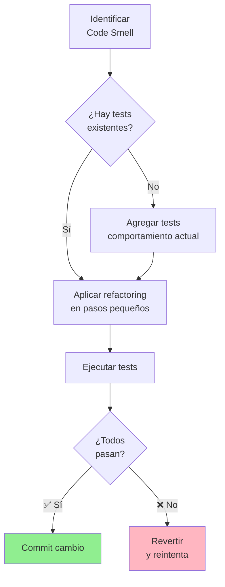

# Refactoring Practices

## Contexto

Este estándar define **refactoring continuo**: mejorar estructura interna del código sin cambiar comportamiento externo de forma **incremental** y **disciplinada**. Complementa el [lineamiento de Arquitectura Evolutiva](../../lineamientos/arquitectura/12-arquitectura-evolutiva.md) asegurando **mejora constante** del diseño.

---

## Conceptos Fundamentales

### ¿Qué es Refactoring?

```yaml
# ✅ Refactoring = Mejora de diseño sin cambiar comportamiento

Definición (Martin Fowler):
  "Cambio realizado a la estructura interna del software para hacerlo
   más fácil de entender y económico de modificar, sin cambiar su
   comportamiento observable."

Características:
  ✅ Incremental: Pasos pequeños y seguros (no reescritura completa)
  ✅ Disciplinado: Seguir técnicas probadas (no "limpieza" ad-hoc)
  ✅ Seguro: Tests validan que comportamiento no cambia
  ✅ Continuo: Parte del desarrollo diario (no "fase de refactoring")
  ✅ Oportunista: Se hace cuando tocas código (Boy Scout Rule)

Boy Scout Rule:
  "Dejar el código un poco mejor de como lo encontraste."
  - Mejorar nombres
  - Extraer métodos largos
  - Reducir complejidad
  - Eliminar duplicación

Cuándo refactorizar:
  ✅ Antes de agregar feature (limpiar área)
  ✅ Durante code review (pequenos ajustes)
  ✅ Al encontrar code smell (duplicación, complejidad)
  ❌ NO: Como proyecto separado "vamos a refactorizar todo"
  ❌ NO: Sin tests (inseguro, alto riesgo de bugs)

Beneficios:
  ✅ Reduce deuda técnica
  ✅ Facilita agregar features
  ✅ Mejora legibilidad
  ✅ Reduce bugs (código más simple = menos errores)
```

### Flujo de Refactoring Seguro



## Code Smells Comunes y Refactorings

```csharp
// ❌ CODE SMELL 1: Método largo (>20 líneas)

public class OrderService
{
    public async Task<Guid> CreateOrderAsync(CreateOrderRequest request)
    {
        // Validar customer
        var customer = await _customerRepo.GetByIdAsync(request.CustomerId);
        if (customer == null)
            throw new NotFoundException($"Customer {request.CustomerId} not found");

        if (!customer.IsActive)
            throw new BusinessException("Customer is inactive");

        // Validar productos
        var products = new List<Product>();
        foreach (var item in request.Items)
        {
            var product = await _productRepo.GetByIdAsync(item.ProductId);
            if (product == null)
                throw new NotFoundException($"Product {item.ProductId} not found");

            if (product.Stock < item.Quantity)
                throw new BusinessException($"Insufficient stock for {product.Name}");

            products.Add(product);
        }

        // Crear order
        var order = new Order
        {
            OrderId = Guid.NewGuid(),
            CustomerId = request.CustomerId,
            OrderDate = DateTime.UtcNow,
            Status = "Draft"
        };

        // Agregar lines
        decimal total = 0;
        foreach (var item in request.Items)
        {
            var product = products.First(p => p.ProductId == item.ProductId);
            var subtotal = product.Price * item.Quantity;
            total += subtotal;

            order.Lines.Add(new OrderLine
            {
                LineId = Guid.NewGuid(),
                ProductId = item.ProductId,
                Quantity = item.Quantity,
                UnitPrice = product.Price,
                Subtotal = subtotal
            });
        }

        order.Total = total;

        // Aplicar descuento
        if (customer.IsVip && total > 1000)
        {
            order.Discount = total * 0.10m;
            order.Total = total - order.Discount;
        }

        // Guardar
        await _orderRepo.SaveAsync(order);

        // Publicar evento
        await _eventPublisher.PublishAsync(new OrderCreated
        {
            OrderId = order.OrderId,
            CustomerId = order.CustomerId,
            Total = order.Total
        });

        return order.OrderId;
    }
}

// ✅ REFACTORING: Extract Method

public class OrderService
{
    public async Task<Guid> CreateOrderAsync(CreateOrderRequest request)
    {
        var customer = await ValidateCustomerAsync(request.CustomerId);
        var products = await ValidateProductsAsync(request.Items);

        var order = CreateOrderFromRequest(request, products);
        ApplyDiscountIfEligible(order, customer);

        await _orderRepo.SaveAsync(order);
        await PublishOrderCreatedEventAsync(order);

        return order.OrderId;
    }

    private async Task<Customer> ValidateCustomerAsync(Guid customerId)
    {
        var customer = await _customerRepo.GetByIdAsync(customerId);
        if (customer == null)
            throw new NotFoundException($"Customer {customerId} not found");

        if (!customer.IsActive)
            throw new BusinessException("Customer is inactive");

        return customer;
    }

    private async Task<List<Product>> ValidateProductsAsync(List<OrderItemRequest> items)
    {
        var products = new List<Product>();

        foreach (var item in items)
        {
            var product = await _productRepo.GetByIdAsync(item.ProductId);
            if (product == null)
                throw new NotFoundException($"Product {item.ProductId} not found");

            if (product.Stock < item.Quantity)
                throw new BusinessException($"Insufficient stock for {product.Name}");

            products.Add(product);
        }

        return products;
    }

    private Order CreateOrderFromRequest(CreateOrderRequest request, List<Product> products)
    {
        var order = new Order
        {
            OrderId = Guid.NewGuid(),
            CustomerId = request.CustomerId,
            OrderDate = DateTime.UtcNow,
            Status = "Draft"
        };

        foreach (var item in request.Items)
        {
            var product = products.First(p => p.ProductId == item.ProductId);
            order.AddLine(item.ProductId, item.Quantity, product.Price);
        }

        return order;
    }

    private void ApplyDiscountIfEligible(Order order, Customer customer)
    {
        if (customer.IsVip && order.Total > 1000)
        {
            var discount = order.Total * 0.10m;
            order.ApplyDiscount(discount);
        }
    }

    private async Task PublishOrderCreatedEventAsync(Order order)
    {
        await _eventPublisher.PublishAsync(new OrderCreated
        {
            OrderId = order.OrderId,
            CustomerId = order.CustomerId,
            Total = order.Total
        });
    }
}

// Resultado: Método principal legible, lógica organizada, fácil de testear
```

```csharp
// ❌ CODE SMELL 2: Duplicación

public class OrderCalculator
{
    public decimal CalculateOrderTotal(Order order)
    {
        decimal total = 0;
        foreach (var line in order.Lines)
        {
            total += line.Quantity * line.UnitPrice;
        }
        return total;
    }

    public decimal CalculateInvoiceTotal(Invoice invoice)
    {
        decimal total = 0;
        foreach (var line in invoice.Lines)
        {
            total += line.Quantity * line.UnitPrice;  // ❌ Duplicación
        }
        return total;
    }

    public decimal CalculateQuoteTotal(Quote quote)
    {
        decimal total = 0;
        foreach (var item in quote.Items)
        {
            total += item.Quantity * item.Price;  // ❌ Duplicación
        }
        return total;
    }
}

// ✅ REFACTORING: Extract Method + Introduce Interface

public interface ILineItem
{
    int Quantity { get; }
    decimal UnitPrice { get; }
}

public class OrderLine : ILineItem
{
    public int Quantity { get; set; }
    public decimal UnitPrice { get; set; }
}

public class InvoiceLine : ILineItem
{
    public int Quantity { get; set; }
    public decimal UnitPrice { get; set; }
}

public class Calculator
{
    public decimal CalculateTotal<T>(IEnumerable<T> items) where T : ILineItem
    {
        return items.Sum(line => line.Quantity * line.UnitPrice);  // ✅ Una sola implementación
    }
}

// Uso:
var orderTotal = _calculator.CalculateTotal(order.Lines);
var invoiceTotal = _calculator.CalculateTotal(invoice.Lines);
var quoteTotal = _calculator.CalculateTotal(quote.Items);
```

```csharp
// ❌ CODE SMELL 3: Clase Dios (demasiadas responsabilidades)

public class OrderManager
{
    // ❌ Hace DEMASIADO
    public void CreateOrder() { }
    public void ApproveOrder() { }
    public void CancelOrder() { }
    public void CalculateTotal() { }
    public void ApplyDiscount() { }
    public void SendConfirmationEmail() { }
    public void GenerateInvoice() { }
    public void ProcessPayment() { }
    public void UpdateInventory() { }
    public void NotifyShipping() { }
    public void CalculateTaxes() { }
    public void ValidateAddress() { }
    // ... 50+ métodos
}

// ✅ REFACTORING: Extract Class (Single Responsibility Principle)

public class OrderService
{
    public void CreateOrder() { }
    public void ApproveOrder() { }
    public void CancelOrder() { }
}

public class OrderPricingService
{
    public decimal CalculateTotal(Order order) { }
    public decimal ApplyDiscount(Order order, Customer customer) { }
    public decimal CalculateTaxes(Order order) { }
}

public class OrderNotificationService
{
    public Task SendConfirmationEmailAsync(Order order) { }
    public Task NotifyShippingAsync(Order order) { }
}

public class OrderFulfillmentService
{
    public Task UpdateInventoryAsync(Order order) { }
    public Task GenerateInvoiceAsync(Order order) { }
}

public class PaymentService
{
    public Task ProcessPaymentAsync(Order order) { }
}
```

```csharp
// ❌ CODE SMELL 4: Parámetros primitivos repetitivos

public class OrderService
{
    public void CreateOrder(
        string customerId,
        string productId,
        int quantity,
        decimal price,
        string currency,
        string shippingStreet,
        string shippingCity,
        string shippingState,
        string shippingZip,
        string shippingCountry,
        string billingStreet,
        string billingCity,
        string billingState,
        string billingZip,
        string billingCountry)  // ❌ 15 parámetros!
    {
        // ...
    }
}

// ✅ REFACTORING: Introduce Parameter Object

public record CreateOrderCommand(
    Guid CustomerId,
    List<OrderItemDto> Items,
    Address ShippingAddress,
    Address BillingAddress
);

public record OrderItemDto(Guid ProductId, int Quantity);

public record Address(
    string Street,
    string City,
    string State,
    string ZipCode,
    string Country
);

public class OrderService
{
    public void CreateOrder(CreateOrderCommand command)  // ✅ 1 parámetro
    {
        // Acceso claro: command.ShippingAddress.City
    }
}
```

```csharp
// ❌ CODE SMELL 5: Switch statements sobre tipos

public class NotificationService
{
    public async Task SendNotificationAsync(Notification notification)
    {
        switch (notification.Type)  // ❌ Switch sobre tipo
        {
            case "Email":
                await _emailClient.SendAsync(notification.To, notification.Subject, notification.Body);
                break;
            case "SMS":
                await _smsClient.SendAsync(notification.PhoneNumber, notification.Message);
                break;
            case "Push":
                await _pushClient.SendAsync(notification.DeviceToken, notification.Title, notification.Body);
                break;
            case "Slack":
                await _slackClient.SendAsync(notification.Channel, notification.Message);
                break;
            default:
                throw new NotSupportedException($"Notification type {notification.Type} not supported");
        }
    }
}

// ✅ REFACTORING: Replace Conditional with Polymorphism

public interface INotificationStrategy
{
    Task SendAsync(Notification notification);
}

public class EmailNotificationStrategy : INotificationStrategy
{
    private readonly IEmailClient _emailClient;

    public async Task SendAsync(Notification notification)
    {
        await _emailClient.SendAsync(notification.To, notification.Subject, notification.Body);
    }
}

public class SmsNotificationStrategy : INotificationStrategy
{
    private readonly ISmsClient _smsClient;

    public async Task SendAsync(Notification notification)
    {
        await _smsClient.SendAsync(notification.PhoneNumber, notification.Message);
    }
}

public class PushNotificationStrategy : INotificationStrategy
{
    private readonly IPushClient _pushClient;

    public async Task SendAsync(Notification notification)
    {
        await _pushClient.SendAsync(notification.DeviceToken, notification.Title, notification.Body);
    }
}

public class NotificationService
{
    private readonly Dictionary<string, INotificationStrategy> _strategies;

    public NotificationService(IEnumerable<INotificationStrategy> strategies)
    {
        _strategies = strategies.ToDictionary(
            s => s.GetType().Name.Replace("NotificationStrategy", ""),
            s => s
        );
    }

    public async Task SendNotificationAsync(Notification notification)
    {
        if (!_strategies.TryGetValue(notification.Type, out var strategy))
            throw new NotSupportedException($"Notification type {notification.Type} not supported");

        await strategy.SendAsync(notification);  // ✅ Polimorfismo
    }
}
```

## Técnicas de Refactoring Arquitectónico

```csharp
// ✅ REFACTORING: Strangler Fig Pattern (migrar código legacy gradualmente)

// Estado inicial: Monolito con OrderManager
public class LegacyOrderManager
{
    public void CreateOrder() { /* 500 líneas de código legacy */ }
    public void ApproveOrder() { /* ... */ }
    public void ProcessPayment() { /* ... */ }
    // ... 50+ métodos
}

// Paso 1: Introducir facade con routing
public class OrderFacade
{
    private readonly LegacyOrderManager _legacy;
    private readonly ModernOrderService _modern;
    private readonly IFeatureFlags _featureFlags;

    public async Task CreateOrderAsync(CreateOrderCommand command)
    {
        // ✅ Gradualmente migrar tráfico a nueva implementación
        if (await _featureFlags.IsEnabledAsync("UseModernOrderService", command.CustomerId))
        {
            await _modern.CreateOrderAsync(command);  // ✅ Nueva implementación
        }
        else
        {
            _legacy.CreateOrder();  // ❌ Legacy (gradualmente eliminar)
        }
    }
}

// Paso 2: Nueva implementación limpia
public class ModernOrderService
{
    public async Task CreateOrderAsync(CreateOrderCommand command)
    {
        // ✅ Clean code: hexagonal, DDD, testeable
        var order = Order.Create(command.CustomerId);
        foreach (var item in command.Items)
        {
            order.AddLine(item.ProductId, item.Quantity, item.UnitPrice);
        }

        await _orderRepo.SaveAsync(order);
        await _eventPublisher.PublishAsync(new OrderCreated(order.OrderId));
    }
}

// Paso 3: Incrementar % gradualmente (10% → 50% → 100%)
// Paso 4: Eliminar legacy cuando 100% migrado
```

```csharp
// ✅ REFACTORING: Branch by Abstraction (cambiar dependency gradualmente)

// Estado inicial: Código acoplado a EF Core
public class OrderService
{
    private readonly SalesDbContext _dbContext;  // ❌ Acoplamiento directo

    public async Task<Order> GetOrderAsync(Guid orderId)
    {
        return await _dbContext.Orders
            .Include(o => o.Lines)
            .FirstOrDefaultAsync(o => o.OrderId == orderId);
    }
}

// Paso 1: Introducir abstracción
public interface IOrderRepository
{
    Task<Order?> GetByIdAsync(Guid orderId);
}

// Paso 2: Adaptar código existente para usar abstracción
public class OrderService
{
    private readonly IOrderRepository _orderRepo;  // ✅ Abstracción

    public async Task<Order> GetOrderAsync(Guid orderId)
    {
        return await _orderRepo.GetByIdAsync(orderId);
    }
}

// Paso 3: Implementación temporal que usa EF
public class EFOrderRepository : IOrderRepository
{
    private readonly SalesDbContext _dbContext;

    public async Task<Order?> GetByIdAsync(Guid orderId)
    {
        return await _dbContext.Orders
            .Include(o => o.Lines)
            .FirstOrDefaultAsync(o => o.OrderId == orderId);
    }
}

// Paso 4: Nueva implementación (Dapper, por ejemplo)
public class DapperOrderRepository : IOrderRepository
{
    private readonly IDbConnection _connection;

    public async Task<Order?> GetByIdAsync(Guid orderId)
    {
        const string sql = @"
            SELECT * FROM sales.orders WHERE order_id = @OrderId;
            SELECT * FROM sales.order_lines WHERE order_id = @OrderId;
        ";
        // ... Dapper implementation
    }
}

// Paso 5: Cambiar DI (gradual con feature flag o directo)
builder.Services.AddScoped<IOrderRepository, DapperOrderRepository>();

// Paso 6: Una vez validado, eliminar EFOrderRepository
```

## Herramientas y Automatización

```yaml
# ✅ Herramientas para refactoring en .NET

IDE Built-in (Visual Studio / Rider):
  - Extract Method (Ctrl+R, M)
  - Extract Interface (Ctrl+R, I)
  - Rename (F2)
  - Inline Variable (Ctrl+R, Ctrl+I)
  - Change Signature
  - Move Type to File

Analyzers:
  - Roslyn Analyzers: Detectan code smells en tiempo real
  - SonarLint: Code quality y security
  - CodeMaid: Limpieza y formatting

Static Analysis:
  - SonarQube: Code smells, bugs, vulnerabilities
  - NDepend: Arquitectura, dependencies, complexity
  - ReSharper: Refactorings avanzados

Metrics:
  - Code Coverage (dotnet-coverage, Coverlet)
  - Cyclomatic Complexity
  - Maintainability Index
  - Coupling metrics

# ✅ Configuración en proyecto

# .editorconfig (enforce code style)
[*.cs]
dotnet_diagnostic.CA1062.severity = warning  # Validate parameters
dotnet_diagnostic.IDE0058.severity = warning # Remove unnecessary expression value
csharp_style_expression_bodied_methods = true:suggestion

# SonarQube Quality Gate
sonar.coverage.exclusions=**Tests.cs,**/Program.cs
sonar.cpd.exclusions=**/*Dto.cs,**/*Request.cs
sonar.issue.ignore.multicriteria=e1,e2
sonar.issue.ignore.multicriteria.e1.ruleKey=csharpsquid:S3358
sonar.issue.ignore.multicriteria.e1.resourceKey=**/*.cs
```

## Disciplina de Refactoring

```yaml
# ✅ Prácticas diarias de refactoring en Talma

Boy Scout Rule:
  Cada vez que tocas un archivo:
    1. Leer código circundante (contexto)
    2. Identificar 1-2 mejoras pequeñas
    3. Aplicar refactoring (< 5 min)
    4. Ejecutar tests
    5. Commit separado: "chore: refactor OrderService.CreateOrder"

Durante Feature Development:
  Antes de agregar feature:
    - Refactor área donde trabajarás (preparar terreno)
    - Hacer código más extensible

  Después de agregar feature:
    - Refactor duplicación introducida
    - Mejorar nombres basado en nueva comprensión

Durante Code Review:
  Sugerencias de refactoring:
    - "Considera extraer este método"
    - "Este bloque está duplicado en línea X"
    - "Podríamos usar estrategia pattern aquí"

  Acción:
    - Fix inmediato si < 10 min
    - Crear issue para refactoring mayor

Refactoring Dedicado:
  Cuándo: Al acumular deuda técnica significativa
  Tamaño: Máximo 1-2 días
  Enfoque: Área específica (no "refactorizar todo")
  Validación: Tests + code review + metrics

Métricas de Seguimiento:
  - Code smells (SonarQube): < 50 por servicio
  - Cyclomatic complexity: < 10 promedio
  - Code coverage: > 80%
  - Duplication: < 3%
  - Maintainability index: > 70
```

---

## Requisitos Técnicos

### MUST (Obligatorio)

- **MUST** aplicar Boy Scout Rule (dejar código mejor de como lo encontraste)
- **MUST** tener tests antes de refactorizar código crítico
- **MUST** hacer refactorings en pasos pequeños e incrementales
- **MUST** ejecutar tests después de cada refactoring
- **MUST** hacer commits separados para refactoring (no mezclar con features)
- **MUST** validar que comportamiento no cambia (tests pasan, funcionalidad igual)

### SHOULD (Fuertemente recomendado)

- **SHOULD** usar herramientas de IDE para refactorings automáticos
- **SHOULD** refactorizar antes de agregar nuevas features
- **SHOULD** revisar code smells en SonarQube periódicamente
- **SHOULD** hacer peer review de refactorings grandes
- **SHOULD** documentar refactorings arquitectónicos significativos

### MAY (Opcional)

- **MAY** usar Strangler Fig para migrar código legacy
- **MAY** usar Branch by Abstraction para cambiar dependencies
- **MAY** dedicar tiempo específico a refactoring (tech debt sprints)

### MUST NOT (Prohibido)

- **MUST NOT** refactorizar sin tests (alto riesgo de bugs)
- **MUST NOT** hacer refactoring "big bang" (reescritura completa)
- **MUST NOT** mezclar refactoring con cambios de comportamiento
- **MUST NOT** refactorizar "porque sí" (debe haber objetivo claro)
- **MUST NOT** ignorar tests fallidos después de refactoring

---

## Referencias

- [Lineamiento: Arquitectura Evolutiva](../../lineamientos/arquitectura/12-arquitectura-evolutiva.md)
- Estándares relacionados:
  - [Unit Testing](../../testing/unit-testing.md)
  - [Code Review](../../desarrollo/code-review.md)
  - [Fitness Functions](../arquitectura/fitness-functions.md)
- Especificaciones:
  - [Refactoring (Martin Fowler)](https://refactoring.com/)
  - [Refactoring Catalog](https://refactoring.guru/refactoring/catalog)
  - [Working Effectively with Legacy Code (Michael Feathers)](https://www.oreilly.com/library/view/working-effectively-with/0131177052/)
