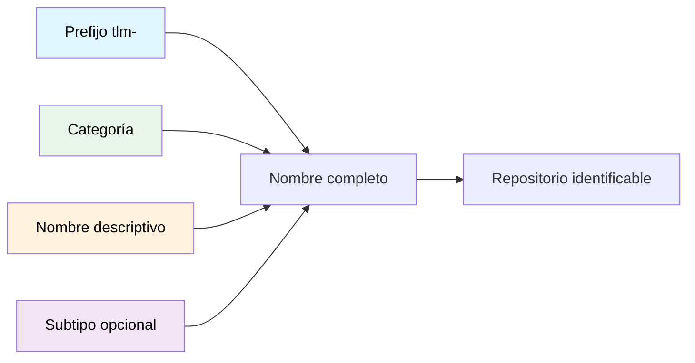

# Nomenclatura de Repositorios

## Contexto

Este estándar define las reglas corporativas para nombrar repositorios en GitHub. Una nomenclatura consistente facilita la identificación, clasificación y mantenimiento de proyectos en toda la organización. Aplica a todos los equipos: desarrollo, arquitectura, operaciones e infraestructura.

**Cuándo aplicar:** Al crear cualquier repositorio nuevo en la organización GitHub de Talma.

**Conceptos incluidos:**

- **Prefijo corporativo** — `tlm-` obligatorio al inicio de todo repositorio
- **Categoría** — clasificación del propósito principal del repositorio
- **Formato de nombre** — estructura estándar `tlm-<categoria>-<nombre>[-<subtipo>]`

---

## Relación entre Conceptos



---

## Formato de Nombres

Todo repositorio sigue la estructura:

```
tlm-<categoria>-<nombre>[-<subtipo>]
```

- **`tlm-`** — prefijo corporativo obligatorio, siempre al inicio
- **`<categoria>`** — indica el propósito principal (ver tabla de categorías)
- **`<nombre>`** — nombre corto y descriptivo en inglés, con guiones como separador
- **`[-<subtipo>]`** — opcional, para precisar el tipo concreto (ej: `api`, `worker`, `docs`)

**Reglas de estilo:**

- Solo minúsculas y guiones (`-`) — sin espacios, tildes ni caracteres especiales
- Longitud ideal: menos de 40 caracteres
- Si se usa una sigla, definirla en el README del repositorio

---

## Tabla de Categorías

| Categoría | Uso                                                 | Ejemplo                   |
| --------- | --------------------------------------------------- | ------------------------- |
| `doc`     | Documentación y portales (Docusaurus)               | `tlm-doc-architecture`    |
| `svc`     | Microservicio o servicio backend                    | `tlm-svc-orders`          |
| `app`     | Aplicación monolítica o portal                      | `tlm-app-erp`             |
| `int`     | Capa de integración / conectores / CDC / middleware | `tlm-int-cdc-kafka`       |
| `corp`    | Servicios corporativos (agrupan funciones internas) | `tlm-corp-notifications`  |
| `arc`     | Arquetipos / plantillas para iniciar proyectos      | `tlm-arc-api-rest`        |
| `lib`     | Librerías internas / SDKs                           | `tlm-lib-logging`         |
| `infra`   | IaC, Terraform, playbooks                           | `tlm-infra-kafka`         |
| `ops`     | Herramientas operativas / scripts                   | `tlm-ops-ci-tools`        |
| `tpl`     | Boilerplates, plantillas no code                    | `tlm-tpl-service-dotnet`  |
| `api`     | Solo definición de contratos (OpenAPI, schemas)     | `tlm-api-orders`          |
| `web`     | Frontend web                                        | `tlm-web-portal-clientes` |

:::tip Un repo, una categoría
Si un repositorio cumple varios propósitos, elegir la categoría de su función principal. Nunca combinar dos categorías en el mismo nombre.
:::

---

## Ejemplos: Correcto vs. Incorrecto

| ✅ Correcto            | ❌ Incorrecto         | Problema                                      |
| ---------------------- | --------------------- | --------------------------------------------- |
| `tlm-svc-orders`       | `orders-tlm`          | Prefijo corporativo debe ir al inicio         |
| `tlm-api-users`        | `tlm_users`           | Guiones (`-`), nunca guion bajo (`_`)         |
| `tlm-doc-architecture` | `docs-tlm-arch`       | Prefijo y categoría primero, luego el nombre  |
| `tlm-infra-pipelines`  | `infra-tlm`           | Prefijo y categoría siempre al inicio         |
| `tlm-svc-payments`     | `svc-payments-tlm`    | El prefijo corporativo no va al final         |
| `tlm-svc-user-profile` | `tlm-svc-userprofile` | Palabras separadas por guión, no concatenadas |

---

## Requisitos Técnicos

### MUST (Obligatorio)

- **MUST** comenzar todo repositorio con el prefijo `tlm-`
- **MUST** incluir una categoría válida de la tabla como segundo segmento
- **MUST** usar solo minúsculas y guiones — cero mayúsculas, guiones bajos ni espacios
- **MUST** elegir una única categoría por repositorio basada en su propósito principal

### SHOULD (Fuertemente recomendado)

- **SHOULD** mantener el nombre total por debajo de 40 caracteres
- **SHOULD** usar nombres en inglés, descriptivos y sin ambigüedad
- **SHOULD** definir en el README cualquier sigla usada en el nombre del repositorio

### MUST NOT (Prohibido)

- **MUST NOT** usar guiones bajos (`_`), puntos (`.`) ni mayúsculas en el nombre
- **MUST NOT** colocar el prefijo `tlm-` en una posición distinta al inicio
- **MUST NOT** combinar dos categorías ni usar nombres genéricos que no comuniquen el propósito (ej: `tlm-svc-api-orders`, `tlm-svc-service1`)

---

## Referencias

- [Git Workflow](./git-workflow.md) — convenciones de branching y commits dentro del repositorio
- [README](../documentacion/readme-standards.md) — estructura mínima de README y documentación de servicios
- [GitHub: Acerca de los repositorios](https://docs.github.com/es/repositories/creating-and-managing-repositories/about-repositories) — referencia oficial

---

**Última actualización**: 5 de marzo de 2026
**Responsable**: Equipo de Arquitectura
