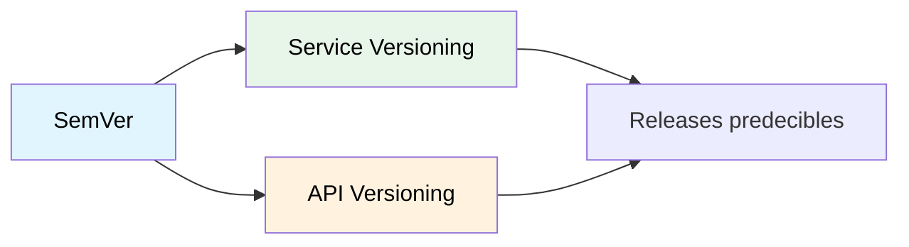

# Versionamiento Semántico

## Contexto

Este estándar define las prácticas para versionar servicios, paquetes internos y APIs de forma predecible usando SemVer. Complementa el lineamiento [Autonomía de Servicios](../../lineamientos/arquitectura/10-autonomia-de-servicios.md).

**Conceptos incluidos:**

- **SemVer** — Formato MAJOR.MINOR.PATCH
- **Service Versioning** — Versionamiento de builds .NET
- **API Versioning** — Versionamiento de endpoints REST

---

## Stack Tecnológico

| Componente             | Tecnología            | Versión | Uso                              |
| ---------------------- | --------------------- | ------- | -------------------------------- |
| **Spec**               | Semantic Versioning   | 2.0.0   | Estándar de versionamiento       |
| **Build props**        | Directory.Build.props | .NET 8+ | Versionamiento centralizado .NET |
| **API Versioning**     | Asp.Versioning.Http   | 8.1+    | Versionamiento de endpoints      |
| **Release automation** | GitHub Actions        | -       | Automatización de releases       |

---

## Relación entre Conceptos



---

## SemVer

### ¿Qué es Semantic Versioning?

Sistema de versionamiento usando formato **MAJOR.MINOR.PATCH** para comunicar el tipo de cambios de forma inequívoca.

**Formato: X.Y.Z**

- **MAJOR (X)**: Cambios incompatibles (breaking changes)
- **MINOR (Y)**: Nueva funcionalidad compatible hacia atrás
- **PATCH (Z)**: Bug fixes compatibles

**Ejemplos:**

- `1.0.0` → `1.0.1`: Bug fix
- `1.0.1` → `1.1.0`: Nueva feature
- `1.1.0` → `2.0.0`: Breaking change

**Propósito:** Comunicar impacto de cambios, habilitar actualizaciones seguras y automatizar releases.

**Beneficios:**
✅ Expectativas claras de compatibilidad
✅ Actualizaciones seguras y predecibles
✅ Mejor comunicación entre equipos
✅ Automatización de releases

---

## Service Versioning

### Versionamiento de Servicios .NET

```xml
<!-- Directory.Build.props - Versionamiento centralizado -->

<Project>
  <PropertyGroup>
    <!-- Versión aplicada a todos los proyectos del repositorio -->
    <Version>1.2.3</Version>

    <!-- Metadata adicional -->
    <AssemblyVersion>1.2.3.0</AssemblyVersion>
    <FileVersion>1.2.3.0</FileVersion>
    <InformationalVersion>1.2.3+$(GitCommitHash)</InformationalVersion>

    <!-- Copyright -->
    <Copyright>Copyright © Talma 2026</Copyright>
    <Company>Talma</Company>
  </PropertyGroup>
</Project>
```

### Automatización de Releases con GitHub Actions

```yaml
# .github/workflows/release.yml
# Publicar release al pushear un tag v*.*.*

name: Release

on:
  push:
    tags:
      - "v*.*.*"

jobs:
  release:
    runs-on: ubuntu-latest
    steps:
      - uses: actions/checkout@v4

      - name: Extract version from tag
        id: version
        run: |
          VERSION=${GITHUB_REF#refs/tags/v}
          echo "version=$VERSION" >> $GITHUB_OUTPUT

          IFS='.' read -r MAJOR MINOR PATCH <<< "$VERSION"
          echo "major=$MAJOR" >> $GITHUB_OUTPUT
          echo "minor=$MINOR" >> $GITHUB_OUTPUT
          echo "patch=$PATCH" >> $GITHUB_OUTPUT

      - uses: actions/setup-dotnet@v4
        with:
          dotnet-version: "8.0.x"

      - name: Build with version
        run: |
          dotnet build --configuration Release \
            -p:Version=${{ steps.version.outputs.version }} \
            -p:AssemblyVersion=${{ steps.version.outputs.version }}.0

      - name: Create GitHub Release
        uses: softprops/action-gh-release@v1
        with:
          name: Release v${{ steps.version.outputs.version }}
          generate_release_notes: true
          draft: false
          prerelease: false
```

---

## API Versioning

### Versionamiento de Endpoints REST

```csharp
// Program.cs - Configuración de API versioning

var builder = WebApplication.CreateBuilder(args);

builder.Services.AddApiVersioning(options =>
{
    options.DefaultApiVersion = new ApiVersion(1, 0);
    options.AssumeDefaultVersionWhenUnspecified = true;
    options.ReportApiVersions = true;
    options.ApiVersionReader = ApiVersionReader.Combine(
        new UrlSegmentApiVersionReader(),
        new HeaderApiVersionReader("X-Api-Version"));
}).AddApiExplorer(options =>
{
    options.GroupNameFormat = "'v'VVV";
    options.SubstituteApiVersionInUrl = true;
});

var app = builder.Build();

// Endpoints versionados
app.MapGet("/api/v1/customers", () => "Version 1.0")
    .WithApiVersionSet()
    .HasApiVersion(new ApiVersion(1, 0));

app.MapGet("/api/v2/customers", () => "Version 2.0")
    .WithApiVersionSet()
    .HasApiVersion(new ApiVersion(2, 0));

app.Run();
```

---

## Requisitos Técnicos

### MUST (Obligatorio)

- **MUST** usar SemVer 2.0.0 para versionar servicios y paquetes internos
- **MUST** gestionar la versión en `Directory.Build.props` (no en cada `.csproj`)
- **MUST** versionar APIs con prefijo `/v{major}` en la URL
- **MUST** crear tag `v{X.Y.Z}` en git para cada release

### SHOULD (Fuertemente recomendado)

- **SHOULD** incrementar MAJOR solo para breaking changes documentados en CHANGELOG
- **SHOULD** generar release notes automáticas con GitHub Actions
- **SHOULD** publicar versiones prelanzamiento con sufijo (`-beta.1`, `-rc.1`)

### MUST NOT (Prohibido)

- **MUST NOT** hacer breaking changes en versiones MINOR o PATCH
- **MUST NOT** reutilizar un número de versión ya publicado

---

## Referencias

**Documentación oficial:**

- [Semantic Versioning 2.0.0](https://semver.org/)
- [Asp.Versioning.Http](https://github.com/dotnet/aspnet-api-versioning)
- [GitHub Releases](https://docs.github.com/repositories/releasing-projects-on-github)

**Relacionados:**

- [Package Management](./package-management.md)
- [Git Workflow](./git-workflow.md)

---

**Última actualización**: 5 de marzo de 2026
**Responsable**: Equipo de Arquitectura
