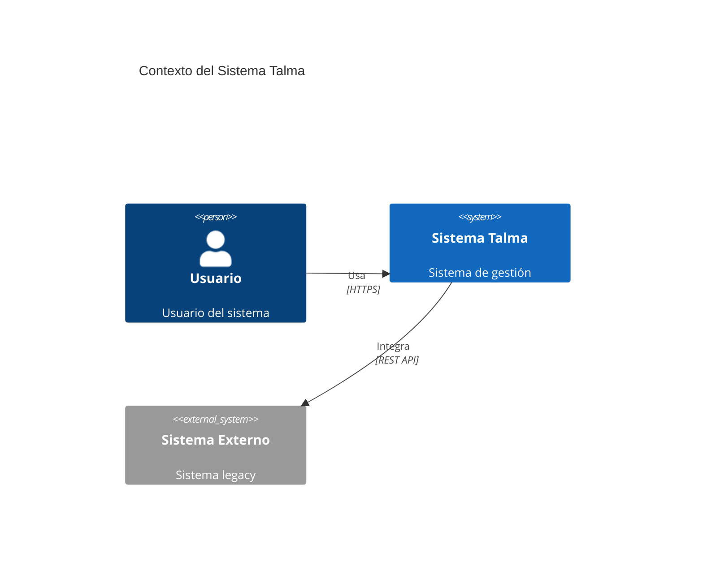
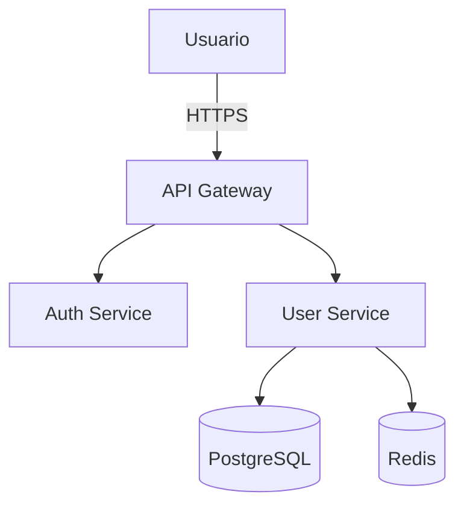

## 1. Principios

- **Consistencia**: Usar mismas herramientas y notaciones en toda la organización.
- **Niveles de abstracción**: Crear diagramas para diferentes audiencias (ejecutivos, arquitectos, desarrolladores).
- **Versionado**: Diagramas deben estar en repositorios Git junto al código.
- **Actualización**: Mantener diagramas sincronizados con la realidad del sistema.
- **Documentation as Code**: Preferir diagramas como código sobre herramientas visuales.

## 2. Modelo C4

El modelo C4 define 4 niveles de diagramas arquitectónicos:

### Nivel 1: Contexto del Sistema

**Audiencia**: Todos (técnicos y no técnicos)
**Propósito**: Mostrar cómo el sistema encaja en el entorno empresarial

```
┌─────────────┐
│   Usuario   │──────┐
└─────────────┘      │
                     │
┌─────────────┐      ▼      ┌──────────────┐
│  Sistema    │────────────▶│   Sistema    │
│  Externo    │              │    Talma     │
└─────────────┘              └──────────────┘
                                    │
                                    ▼
                             ┌──────────────┐
                             │  Base Datos  │
                             └──────────────┘
```

### Nivel 2: Contenedores

**Audiencia**: Arquitectos, DevOps
**Propósito**: Mostrar contenedores (aplicaciones, servicios, bases de datos)

```
┌────────────────────────────────────────────┐
│         Sistema Talma                      │
│                                            │
│  ┌──────────────┐      ┌──────────────┐   │
│  │   Web API    │─────▶│   Database   │   │
│  │  (ASP.NET)   │      │ (PostgreSQL) │   │
│  └──────────────┘      └──────────────┘   │
│         │                                  │
│         ▼                                  │
│  ┌──────────────┐                         │
│  │  Redis Cache │                         │
│  └──────────────┘                         │
└────────────────────────────────────────────┘
```

### Nivel 3: Componentes

**Audiencia**: Arquitectos, desarrolladores
**Propósito**: Mostrar componentes dentro de un contenedor

### Nivel 4: Código

**Audiencia**: Desarrolladores
**Propósito**: Diagramas de clases, secuencia (UML)

## 3. Herramientas Recomendadas

### Structurizr DSL (Recomendado)

**Ventajas**: Diagrams as code, versionable, genera C4 automáticamente

```dsl
workspace "Sistema Talma" {
    model {
        user = person "Usuario" "Usuario del sistema"

        talmaSystem = softwareSystem "Sistema Talma" "Sistema de gestión" {
            webApi = container "Web API" "API REST" "ASP.NET Core 8" {
                userController = component "User Controller" "Expone endpoints de usuarios" "ASP.NET Core MVC"
                userService = component "User Service" "Lógica de negocio de usuarios" "C#"
                userRepository = component "User Repository" "Acceso a datos" "Entity Framework Core"

                userController -> userService "Usa"
                userService -> userRepository "Usa"
            }

            database = container "Database" "Almacena datos" "PostgreSQL" "Database"
            cache = container "Cache" "Cache distribuido" "Redis" "Database"

            webApi -> database "Lee/Escribe" "TCP/5432"
            webApi -> cache "Lee/Escribe" "TCP/6379"
        }

        user -> talmaSystem "Usa"
    }

    views {
        systemContext talmaSystem "SystemContext" {
            include *
            autolayout lr
        }

        container talmaSystem "Containers" {
            include *
            autolayout lr
        }

        component webApi "Components" {
            include *
            autolayout lr
        }

        theme default
    }
}
```

### PlantUML

**Ventajas**: Ampliamente soportado, múltiples tipos de diagramas

```plantuml
@startuml
!include https://raw.githubusercontent.com/plantuml-stdlib/C4-PlantUML/master/C4_Container.puml

Person(user, "Usuario", "Usuario del sistema")

System_Boundary(talma, "Sistema Talma") {
    Container(api, "Web API", "ASP.NET Core", "API REST")
    ContainerDb(db, "Database", "PostgreSQL", "Datos persistentes")
    ContainerDb(cache, "Cache", "Redis", "Cache distribuido")
}

Rel(user, api, "Usa", "HTTPS")
Rel(api, db, "Lee/Escribe", "TCP/5432")
Rel(api, cache, "Lee/Escribe", "TCP/6379")

@enduml
```

### Mermaid

**Ventajas**: Integrado en Markdown (GitHub, Docusaurus), simple





## 4. arc42 - Plantilla de Documentación

### Secciones principales

1. **Introducción y Objetivos**: Propósito del sistema, stakeholders
2. **Restricciones**: Limitaciones técnicas y de negocio
3. **Contexto y Alcance**: Diagrama de contexto (C4 Nivel 1)
4. **Estrategia de Solución**: Decisiones arquitectónicas clave
5. **Vista de Bloques**: Diagramas de contenedores y componentes (C4 Nivel 2-3)
6. **Vista de Runtime**: Diagramas de secuencia, flujos
7. **Vista de Despliegue**: Infraestructura, ambientes
8. **Conceptos Transversales**: Seguridad, persistencia, UI
9. **Decisiones de Arquitectura**: ADRs
10. **Requisitos de Calidad**: Performance, seguridad, disponibilidad
11. **Riesgos y Deuda Técnica**: Issues conocidos
12. **Glosario**: Términos del dominio

### Ejemplo: Vista de Bloques (arc42 sección 5)

```markdown
## Vista de Bloques - Nivel 1

[Diagrama C4 Containers aquí]

### Web API (ASP.NET Core)

**Responsabilidad**: Exponer endpoints REST para operaciones de negocio

**Interfaces**:

- REST API (HTTPS:443)
- Health check endpoint (/health)

**Componentes principales**:

- Controllers
- Services
- Repositories
- Middleware

**Tecnologías**:

- ASP.NET Core 8
- Entity Framework Core
- Serilog

**Referencias**:

- [Código fuente](https://github.com/talma/api)
- [ADR-002: Estándar para APIs REST](...)
```

## 5. Convenciones de Diagramas

### Colores

```
┌────────────────────────────┐
│ Sistema Interno: #1168BD   │
│ Sistema Externo: #999999   │
│ Base de Datos: #438DD5     │
│ Cache: #FF6B6B             │
│ Mensaje Queue: #FFA500     │
└────────────────────────────┘
```

### Estilos de Líneas

```
────▶  Llamada sincrónica (HTTP, gRPC)
····▶  Llamada asíncrona (mensajes, eventos)
═══▶   Flujo de datos principal
```

## 6. Organización de Archivos

```
docs/
├── arquitectura/
│   ├── 01-contexto.md            # arc42 sección 3
│   ├── 02-contenedores.md        # arc42 sección 5.1
│   ├── 03-componentes-api.md     # arc42 sección 5.2
│   ├── 04-vista-runtime.md       # arc42 sección 6
│   └── 05-vista-despliegue.md    # arc42 sección 7
├── diagramas/
│   ├── c4/
│   │   ├── workspace.dsl         # Structurizr
│   │   └── README.md
│   ├── plantuml/
│   │   ├── contexto.puml
│   │   ├── contenedores.puml
│   │   └── componentes-api.puml
│   └── mermaid/
│       └── flujos.md
└── decisiones/
    └── ADR-XXX-*.md
```

## 7. Checklist de Diagramas

- [ ] **Nivel C4 claro**: Especificar si es contexto/contenedor/componente
- [ ] **Audiencia definida**: ¿Para quién es este diagrama?
- [ ] **Leyenda incluida**: Explicar colores, símbolos, líneas
- [ ] **Versionado**: Diagrama en Git con historial
- [ ] **Actualizado**: Refleja estado actual (no futuro)
- [ ] **Código fuente**: Preferir DSL sobre imágenes
- [ ] **Referencias**: Links a ADRs, código, documentación

## 📖 Referencias

### Lineamientos relacionados

- [Decisiones Arquitectónicas](/docs/fundamentos-corporativos/lineamientos/gobierno/decisiones-arquitectonicas)

### Recursos externos

- [C4 Model](https://c4model.com/)
- [Structurizr](https://structurizr.com/)
- [arc42 Template](https://arc42.org/)
- [PlantUML](https://plantuml.com/)
- [Mermaid](https://mermaid.js.org/)
