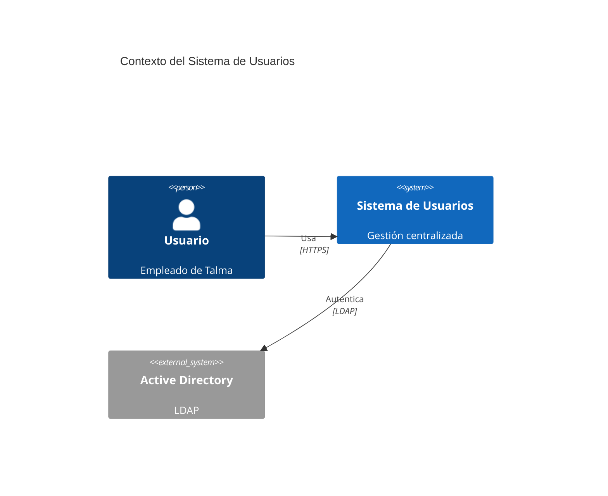

# Estándar: C4 Model - Diagramas Arquitectónicos

## 1. Propósito

Establecer el **Modelo C4** como estándar corporativo para crear diagramas arquitectónicos en Talma, asegurando visualizaciones consistentes y comprensibles en 4 niveles de abstracción que faciliten la comunicación técnica entre todos los stakeholders.

:::tip Complementariedad
Usa C4 Model para los **diagramas arquitectónicos** y [arc42](./01-arc42.md) para la **estructura de documentación**. Los diagramas C4 se integran en las secciones 3, 5, 6 y 7 de arc42.
:::

## 2. Alcance

### 2.1 Aplicaciones Objetivo

- ✅ Diagramas de arquitectura para documentación técnica
- ✅ Presentaciones a stakeholders (técnicos y no técnicos)
- ✅ Onboarding de equipos de desarrollo
- ✅ Revisiones de diseño arquitectónico
- ✅ Integración con plantilla [arc42](./01-arc42.md)
- ✅ Comunicación de decisiones arquitectónicas (ADRs)

### 2.2 Uso Obligatorio

- Documentación de arquitectura de sistemas nuevos
- Actualización de diagramas existentes en migraciones
- Revisiones de diseño (design reviews)
- Documentación de microservicios y sistemas distribuidos

### 2.3 Uso Recomendado

- Diagramas para presentaciones ejecutivas (Level 1)
- Documentación de POCs que puedan evolucionar a producción
- Onboarding de desarrolladores junior

## 3. Tecnologías Obligatorias

### 3.1 Herramientas de Diagramación

| Herramienta | Versión | Formato | Uso | Exportación |
|-------------|---------|---------|-----|-------------|
| **Structurizr DSL** | 2.0+ | `.dsl` | Obligatorio (preferido) | PNG, SVG, PlantUML |
| **C4-PlantUML** | Latest | `.puml` | Alternativa | PNG, SVG |
| **Mermaid** | 10.0+ | Markdown | Alternativa (diagramas simples) | PNG, SVG |
| **Draw.io** | - | `.drawio` | ❌ No permitido | - |
| **Lucidchart** | - | Propietario | ❌ No permitido | - |

### 3.2 Instalación Structurizr CLI

```bash
# Instalación de Structurizr CLI
brew install structurizr-cli  # macOS

# O descargar binario
wget https://github.com/structurizr/cli/releases/download/v2.0.0/structurizr-cli.zip
unzip structurizr-cli.zip -d /usr/local/bin/

# Exportar diagramas
structurizr-cli export -workspace workspace.dsl -format plantuml
structurizr-cli export -workspace workspace.dsl -format png
```

### 3.3 Integración con Docusaurus

```markdown
# docs/arquitectura/03-contexto-alcance.md

## Diagrama de Contexto


**Código fuente**: [diagrams/users-context.dsl](../../static/diagrams/users-context.dsl)

<!-- Opción alternativa con Mermaid embebido -->

```

## 4. Especificaciones Técnicas

### 4.1 Los 4 Niveles del Modelo C4

| Nivel | Nombre | Audiencia | Elementos Clave | Zoom |
|-------|--------|-----------|-----------------|------|
| **1** | **Context** | Todos (técnicos y no técnicos) | Person, Software System | Sistema completo en su entorno |
| **2** | **Container** | Arquitectos, DevOps, Líderes Técnicos | Container (App, DB, Queue) | Aplicaciones, servicios, BD |
| **3** | **Component** | Arquitectos, Desarrolladores | Component (Controller, Service) | Componentes internos |
| **4** | **Code** | Desarrolladores | Class, Interface (UML) | Clases e interfaces |

### 4.2 Nivel 1: Diagrama de Contexto (Context)

#### Propósito

Mostrar **cómo el sistema encaja en el mundo** que lo rodea:
- Usuarios del sistema (personas y sistemas externos)
- Fronteras del sistema (scope)
- Relaciones de alto nivel

#### Elementos

- **Person**: Usuario humano (empleado, cliente, administrador)
- **Software System**: Sistema (el tuyo o externo)
- **Relationship**: Interacciones entre elementos

#### Ejemplo: Structurizr DSL

```dsl
workspace "Sistema de Usuarios Talma" "Gestión centralizada de identidades" {
    model {
        # Personas
        employee = person "Empleado" {
            description "Empleado de Talma que usa aplicaciones corporativas"
        }
        admin = person "Administrador IT" {
            description "Gestiona usuarios, roles y permisos"
        }

        # Sistema principal
        userSystem = softwareSystem "Sistema de Usuarios" {
            description "Gestión centralizada de usuarios, autenticación y autorización"
            tags "Main System"
        }

        # Sistemas externos
        activeDirectory = softwareSystem "Active Directory" {
            description "Directorio corporativo de Windows"
            tags "External"
        }
        sapHR = softwareSystem "SAP HR" {
            description "Sistema de recursos humanos"
            tags "External"
        }
        emailService = softwareSystem "SendGrid" {
            description "Servicio de envío de emails"
            tags "External"
        }

        # Relaciones
        employee -> userSystem "Inicia sesión en aplicaciones" "HTTPS"
        admin -> userSystem "Gestiona usuarios y roles" "HTTPS"

        userSystem -> activeDirectory "Autentica usuarios contra" "LDAP/636"
        userSystem -> sapHR "Sincroniza datos de empleados desde" "REST API/HTTPS"
        userSystem -> emailService "Envía notificaciones vía" "REST API/HTTPS"
    }

    views {
        systemContext userSystem "SystemContext" {
            include *
            autolayout lr
        }

        styles {
            element "Person" {
                shape person
                background #08427B
                color #ffffff
            }
            element "Software System" {
                background #1168BD
                color #ffffff
            }
            element "Main System" {
                background #2E7D32
                color #ffffff
            }
            element "External" {
                background #999999
                color #ffffff
            }
        }
    }
}
```

#### Ejemplo: PlantUML

```plantuml
@startuml
!include https://raw.githubusercontent.com/plantuml-stdlib/C4-PlantUML/master/C4_Context.puml

LAYOUT_WITH_LEGEND()

title Diagrama de Contexto - Sistema de Usuarios Talma

Person(employee, "Empleado", "Empleado de Talma")
Person(admin, "Administrador IT", "Gestiona usuarios y permisos")

System(userSystem, "Sistema de Usuarios", "Gestión centralizada de identidades")

System_Ext(ad, "Active Directory", "Directorio corporativo")
System_Ext(sap, "SAP HR", "Sistema de RRHH")
System_Ext(email, "SendGrid", "Servicio de email")

Rel(employee, userSystem, "Inicia sesión", "HTTPS")
Rel(admin, userSystem, "Gestiona usuarios", "HTTPS")

Rel(userSystem, ad, "Autentica usuarios", "LDAP/636")
Rel(userSystem, sap, "Sincroniza datos", "REST/HTTPS")
Rel(userSystem, email, "Envía notificaciones", "REST/HTTPS")

@enduml
```

### 4.3 Nivel 2: Diagrama de Contenedores (Container)

#### Propósito

Mostrar **la arquitectura de alto nivel** del sistema:
- Aplicaciones ejecutables (web apps, APIs, CLIs)
- Servicios (microservicios, workers)
- Bases de datos (PostgreSQL, Redis, MongoDB)
- Tecnologías clave de cada contenedor

**Nota Importante**: "Container" = **unidad deployable** (no necesariamente Docker container)

#### Elementos

- **Web Application**: SPA (React, Angular), MVC app (ASP.NET MVC)
- **API Application**: REST API, GraphQL, gRPC
- **Database**: PostgreSQL, SQL Server, MongoDB, Redis
- **Message Broker**: Kafka, RabbitMQ, AWS SQS
- **File System**: AWS S3, Azure Blob Storage

#### Ejemplo: Structurizr DSL

```dsl
workspace "Sistema de Usuarios" {
    model {
        employee = person "Empleado"
        admin = person "Administrador IT"
        
        activeDirectory = softwareSystem "Active Directory" "LDAP" "External"
        sapHR = softwareSystem "SAP HR" "RRHH" "External"

        userSystem = softwareSystem "Sistema de Usuarios" {
            # Frontend
            spa = container "Single Page App" {
                description "Interfaz de usuario para gestión de usuarios"
                technology "React 18 + TypeScript 5"
                tags "Web Browser"
            }

            # Backend
            api = container "Web API" {
                description "API REST para operaciones CRUD de usuarios"
                technology "ASP.NET Core 8.0"
                tags "API"
            }

            # Datos
            database = container "Database" {
                description "Almacena usuarios, roles, permisos"
                technology "PostgreSQL 16"
                tags "Database"
            }

            cache = container "Cache" {
                description "Cache de sesiones y tokens"
                technology "Redis 7"
                tags "Database"
            }

            # Mensajería
            queue = container "Message Queue" {
                description "Cola de eventos de usuarios"
                technology "RabbitMQ 3.12"
                tags "Queue"
            }

            # Relaciones Frontend-Backend
            employee -> spa "Usa la aplicación web" "HTTPS/443"
            admin -> spa "Gestiona usuarios" "HTTPS/443"
            spa -> api "Hace llamadas API" "JSON/HTTPS"

            # Relaciones Backend-Datos
            api -> database "Lee y escribe datos" "TCP/5432 (Entity Framework Core)"
            api -> cache "Cachea sesiones" "TCP/6379 (StackExchange.Redis)"
            api -> queue "Publica eventos (UserCreated, UserDeleted)" "AMQP/5672"

            # Relaciones Backend-Externos
            api -> activeDirectory "Autentica usuarios" "LDAP/636"
            api -> sapHR "Sincroniza empleados" "HTTPS/REST"
        }
    }

    views {
        container userSystem "Containers" {
            include *
            autolayout lr
        }

        styles {
            element "Web Browser" {
                shape WebBrowser
                background #438DD5
            }
            element "API" {
                shape RoundedBox
                background #85BBF0
            }
            element "Database" {
                shape Cylinder
                background #438DD5
            }
            element "Queue" {
                shape Pipe
                background #FFA500
            }
        }
    }
}
```

#### Ejemplo: PlantUML

```plantuml
@startuml
!include https://raw.githubusercontent.com/plantuml-stdlib/C4-PlantUML/master/C4_Container.puml

LAYOUT_WITH_LEGEND()

title Diagrama de Contenedores - Sistema de Usuarios

Person(user, "Usuario", "Empleado")
Person(admin, "Admin", "Administrador IT")

System_Boundary(c1, "Sistema de Usuarios") {
    Container(spa, "SPA", "React 18 + TypeScript 5", "Interfaz web de usuario")
    Container(api, "Web API", "ASP.NET Core 8.0", "API REST para operaciones de usuarios")
    ContainerDb(db, "Database", "PostgreSQL 16", "Almacena usuarios, roles, permisos")
    ContainerDb(cache, "Cache", "Redis 7", "Sesiones y tokens en memoria")
    ContainerQueue(queue, "Message Queue", "RabbitMQ 3.12", "Eventos de usuarios")
}

System_Ext(ad, "Active Directory", "Directorio LDAP")
System_Ext(sap, "SAP HR", "Sistema RRHH")

Rel(user, spa, "Usa", "HTTPS")
Rel(admin, spa, "Gestiona", "HTTPS")
Rel(spa, api, "Llamadas API", "JSON/HTTPS")
Rel(api, db, "Lee/Escribe", "TCP/5432 (EF Core)")
Rel(api, cache, "Cachea", "TCP/6379 (StackExchange.Redis)")
Rel(api, queue, "Publica eventos", "AMQP/5672")
Rel(api, ad, "Autentica", "LDAP/636")
Rel(api, sap, "Sincroniza", "REST/HTTPS")

@enduml
```

### 4.4 Nivel 3: Diagrama de Componentes (Component)

#### Propósito

Descomponer un **contenedor** en sus componentes internos:
- Controllers, Services, Repositories (patrón arquitectónico)
- Módulos lógicos y capas
- Responsabilidades de cada componente

**Nota**: Crear un diagrama de componentes **por contenedor** (normalmente solo para contenedores complejos como APIs)

#### Elementos

- **Component**: Unidad lógica de código (Controller, Service, Repository)
- **Relaciones**: Dependencias entre componentes

#### Ejemplo: Structurizr DSL

```dsl
workspace "Sistema de Usuarios - Componentes de Web API" {
    model {
        spa = container "SPA" "React"
        database = container "Database" "PostgreSQL"
        cache = container "Cache" "Redis"

        api = container "Web API" "ASP.NET Core 8" {
            # Controllers (Presentation Layer)
            authController = component "Auth Controller" {
                description "Endpoints de autenticación (login, logout, refresh)"
                technology "ASP.NET Core MVC Controllers"
            }
            userController = component "User Controller" {
                description "CRUD de usuarios (GET, POST, PUT, DELETE)"
                technology "ASP.NET Core MVC Controllers"
            }

            # Services (Business Logic Layer)
            authService = component "Auth Service" {
                description "Lógica de autenticación y generación de tokens JWT"
                technology "C# Service Class"
            }
            userService = component "User Service" {
                description "Lógica de negocio de usuarios (validaciones, reglas)"
                technology "C# Service Class"
            }

            # Repositories (Data Access Layer)
            userRepository = component "User Repository" {
                description "Acceso a datos de usuarios (CRUD)"
                technology "Entity Framework Core Repository"
            }

            # Infrastructure
            cacheService = component "Cache Service" {
                description "Abstracción de Redis para caching"
                technology "StackExchange.Redis"
            }

            # Relaciones SPA -> Controllers
            spa -> authController "POST /api/v1/auth/login"
            spa -> userController "GET /api/v1/users"

            # Relaciones Controllers -> Services
            authController -> authService "Valida credenciales"
            userController -> userService "Operaciones CRUD"

            # Relaciones Services -> Repositories
            authService -> userRepository "Busca usuario por email"
            userService -> userRepository "CRUD de usuarios"

            # Relaciones Services -> Infrastructure
            authService -> cacheService "Cachea refresh tokens"

            # Relaciones Repositories/Cache -> Contenedores externos
            userRepository -> database "SQL queries (EF Core)"
            cacheService -> cache "Comandos Redis (SET, GET, DEL)"
        }
    }

    views {
        component api "APIComponents" {
            include *
            autolayout lr
        }

        styles {
            element "Component" {
                background #85BBF0
            }
        }
    }
}
```

#### Ejemplo: PlantUML

```plantuml
@startuml
!include https://raw.githubusercontent.com/plantuml-stdlib/C4-PlantUML/master/C4_Component.puml

LAYOUT_WITH_LEGEND()

title Diagrama de Componentes - Web API

Container(spa, "SPA", "React")
ContainerDb(db, "Database", "PostgreSQL")
ContainerDb(cache, "Cache", "Redis")

Container_Boundary(api, "Web API - ASP.NET Core") {
    ' Presentation Layer
    Component(authCtrl, "Auth Controller", "MVC Controller", "Endpoints de autenticación")
    Component(userCtrl, "User Controller", "MVC Controller", "CRUD de usuarios")

    ' Business Logic Layer
    Component(authSvc, "Auth Service", "C# Service", "Lógica de autenticación JWT")
    Component(userSvc, "User Service", "C# Service", "Lógica de negocio de usuarios")

    ' Data Access Layer
    Component(userRepo, "User Repository", "EF Core", "Acceso a datos de usuarios")
    Component(cacheSvc, "Cache Service", "StackExchange.Redis", "Abstracción de Redis")
}

' Relaciones externas
Rel(spa, authCtrl, "POST /auth/login", "JSON/HTTPS")
Rel(spa, userCtrl, "GET /users", "JSON/HTTPS")

' Relaciones internas
Rel(authCtrl, authSvc, "Valida credenciales")
Rel(userCtrl, userSvc, "Operaciones CRUD")

Rel(authSvc, userRepo, "Busca usuario")
Rel(userSvc, userRepo, "CRUD")

Rel(authSvc, cacheSvc, "Cachea tokens")

Rel(userRepo, db, "SQL", "EF Core")
Rel(cacheSvc, cache, "Redis", "StackExchange.Redis")

@enduml
```

### 4.5 Nivel 4: Diagrama de Código (Code)

#### Propósito

Mostrar **detalles de implementación** a nivel de clases e interfaces (UML).

**Nota**: **No es obligatorio** y generalmente **no se recomienda** porque:
- El código fuente ya tiene esta información
- Difícil de mantener sincronizado
- Solo útil en casos muy específicos (algoritmos complejos, patrones de diseño)

#### Cuándo Usar

- ✅ Documentar patrones de diseño complejos (Factory, Strategy, Observer)
- ✅ Explicar algoritmos críticos de negocio
- ✅ Onboarding en código legacy complejo

#### Cuándo NO Usar

- ❌ Documentación rutinaria (el código es suficiente)
- ❌ Clases CRUD simples (Controllers, Repositories básicos)
- ❌ DTOs y entidades (autogenerados por IDEs)

## 5. Buenas Prácticas

### 5.1 Nombres Descriptivos

```dsl
# ✅ Buenos nombres descriptivos
container "Web API" {
    description "API REST para gestión de usuarios, autenticación y autorización"
    technology "ASP.NET Core 8.0 + Entity Framework Core 8.0"
}

# ❌ Nombres genéricos
container "API" {
    technology ".NET"
}
```

### 5.2 Especificar Tecnologías

```dsl
# ✅ Tecnologías específicas con versiones
database = container "Database" {
    technology "PostgreSQL 16 (RDS Multi-AZ)"
}

# ❌ Tecnologías genéricas
database = container "Database" {
    technology "SQL Database"
}
```

### 5.3 Incluir Protocolos en Relaciones

```dsl
# ✅ Protocolo y puerto especificados
api -> database "Lee/Escribe datos de usuarios" "TCP/5432 (Entity Framework Core)"
api -> cache "Cachea sesiones" "TCP/6379 (StackExchange.Redis)"

# ❌ Sin protocolo
api -> database "Lee/Escribe"
```

### 5.4 Un Diagrama Por Nivel

```markdown
✅ **Sí**: Separar niveles en archivos diferentes
- diagrams/users-context.dsl      (Level 1)
- diagrams/users-containers.dsl   (Level 2)
- diagrams/users-api-components.dsl (Level 3)

❌ **No**: Mezclar niveles en un mismo diagrama
- Context + Components en un mismo .dsl
```

### 5.5 Usar Colores Consistentes

```dsl
# ✅ Paleta corporativa consistente
styles {
    element "Person" {
        background #08427B  # Azul oscuro
        color #ffffff
    }
    element "Internal System" {
        background #2E7D32  # Verde
        color #ffffff
    }
    element "External System" {
        background #999999  # Gris
        color #ffffff
    }
    element "Database" {
        background #438DD5  # Azul medio
        color #ffffff
    }
}
```

## 6. Antipatrones

### 6.1 ❌ Diagramas Demasiado Complejos

**Problema**:
```dsl
# ❌ 30+ elementos en un solo diagrama
systemContext userSystem "Context" {
    include *  # Incluye 30 sistemas externos
}
```

**Solución**:
```dsl
# ✅ Dividir en múltiples vistas
systemContext userSystem "Context-Core" {
    include employee admin userSystem activeDirectory sapHR
    # Solo 5 elementos principales
}

systemContext userSystem "Context-Integraciones" {
    include userSystem emailService smsService paymentGateway
    # Integraciones secundarias separadas
}
```

### 6.2 ❌ Mezclar Niveles

**Problema**:
```dsl
# ❌ Context + Components en un mismo diagrama
systemContext userSystem {
    # Level 1: Systems
    include userSystem sapHR
    
    # Level 3: Components (¡INCORRECTO!)
    include authController userService
}
```

**Solución**:
```dsl
# ✅ Un diagrama por nivel
# context.dsl
systemContext userSystem {
    include userSystem sapHR activeDirectory
}

# components.dsl
component api {
    include authController userService authRepository
}
```

### 6.3 ❌ Diagramas Sin Código Fuente

**Problema**:
```markdown
# ❌ Solo imagen PNG sin código fuente

<!-- ¿Cómo se generó? ¿Cómo actualizar? -->
```

**Solución**:
```markdown
# ✅ Código fuente versionado + imagen exportada


**Código fuente**: [diagrams/users-context.dsl](diagrams/users-context.dsl)

<!-- Regenerar con: structurizr-cli export -workspace users-context.dsl -format png -->
```

### 6.4 ❌ Omitir Tecnologías

**Problema**:
```dsl
# ❌ Sin tecnologías especificadas
container "API" {
    description "Backend API"
}
```

**Solución**:
```dsl
# ✅ Tecnologías con versiones
container "Web API" {
    description "API REST para gestión de usuarios"
    technology "ASP.NET Core 8.0, Entity Framework Core 8.0, Serilog 3.1"
}
```

## 7. Validación y Testing

### 7.1 Checklist de Diagramas C4

```markdown
# Checklist para cada diagrama C4

## Level 1: Context
- [ ] Todos los usuarios (personas) identificados
- [ ] Sistema principal claramente diferenciado
- [ ] Sistemas externos con tag "External"
- [ ] Protocolos especificados en relaciones
- [ ] Descripción de cada elemento
- [ ] Menos de 10 elementos totales
- [ ] Código fuente (.dsl/.puml) versionado

## Level 2: Containers
- [ ] Todos los contenedores deployables incluidos
- [ ] Tecnologías con versiones especificadas
- [ ] Bases de datos con tipo (PostgreSQL, Redis, etc.)
- [ ] Protocolos y puertos especificados
- [ ] Menos de 15 contenedores
- [ ] Código fuente versionado

## Level 3: Components
- [ ] Solo componentes de UN contenedor
- [ ] Capas arquitectónicas diferenciadas (Controller, Service, Repository)
- [ ] Responsabilidades claras de cada componente
- [ ] Tecnologías especificadas
- [ ] Menos de 20 componentes
- [ ] Código fuente versionado

## General
- [ ] Leyenda presente (con LAYOUT_WITH_LEGEND en PlantUML)
- [ ] Colores consistentes con paleta corporativa
- [ ] Autolayout aplicado (o layout manual optimizado)
- [ ] Imagen exportada (PNG/SVG) actualizada
- [ ] Documentado en sección correspondiente de arc42
```

### 7.2 Script de Validación

```bash
#!/bin/bash
# scripts/validate-c4-diagrams.sh

DIAGRAMS_DIR="docs/static/diagrams"

echo "🔍 Validando diagramas C4..."

# Verificar que todos los .dsl compilan
for dsl_file in $DIAGRAMS_DIR/*.dsl; do
    echo "Validando $dsl_file..."
    
    structurizr-cli validate -workspace "$dsl_file"
    
    if [ $? -ne 0 ]; then
        echo "❌ Error en $dsl_file"
        exit 1
    fi
done

# Verificar que existen PNG exportados
for dsl_file in $DIAGRAMS_DIR/*.dsl; do
    base_name=$(basename "$dsl_file" .dsl)
    png_file="$DIAGRAMS_DIR/$base_name.png"
    
    if [ ! -f "$png_file" ]; then
        echo "⚠️ Falta PNG exportado para $dsl_file"
        echo "   Generando..."
        structurizr-cli export -workspace "$dsl_file" -format png
    fi
done

echo "✅ Todos los diagramas C4 válidos"
```

### 7.3 GitHub Action para Validación

```yaml
# .github/workflows/c4-diagrams.yml
name: Validate C4 Diagrams

on:
  pull_request:
    paths:
      - 'docs/static/diagrams/**'

jobs:
  validate:
    runs-on: ubuntu-latest
    steps:
      - uses: actions/checkout@v4
      
      - name: Install Structurizr CLI
        run: |
          wget https://github.com/structurizr/cli/releases/download/v2.0.0/structurizr-cli.zip
          unzip structurizr-cli.zip -d /usr/local/bin/
      
      - name: Validate DSL files
        run: |
          for dsl in docs/static/diagrams/*.dsl; do
            echo "Validating $dsl..."
            structurizr-cli validate -workspace "$dsl"
          done
      
      - name: Export diagrams
        run: |
          for dsl in docs/static/diagrams/*.dsl; do
            structurizr-cli export -workspace "$dsl" -format png
            structurizr-cli export -workspace "$dsl" -format plantuml
          done
      
      - name: Commit exported diagrams
        uses: stefanzweifel/git-auto-commit-action@v4
        with:
          commit_message: "chore: Update C4 diagrams (auto-generated)"
          file_pattern: docs/static/diagrams/*.png
```

## 8. Referencias

### Lineamientos Relacionados
- [Decisiones Arquitectónicas](/docs/fundamentos-corporativos/lineamientos/gobierno/decisiones-arquitectonicas)
- [Documentación de Código](/docs/fundamentos-corporativos/lineamientos/desarrollo/documentacion-codigo)

### Estándares Relacionados
- [arc42](./01-arc42.md) - Plantilla de documentación arquitectónica
- [OpenAPI/Swagger](./03-openapi-swagger.md) - Documentación de APIs

### ADRs Relacionados
- No hay ADRs específicos para C4 Model (es la herramienta para visualizar ADRs)

### Recursos Externos
- [C4 Model Official Site](https://c4model.com/)
- [Structurizr](https://structurizr.com/)
- [Structurizr DSL Language Reference](https://github.com/structurizr/dsl/blob/master/docs/language-reference.md)
- [C4-PlantUML GitHub](https://github.com/plantuml-stdlib/C4-PlantUML)
- [Mermaid C4 Diagrams](https://mermaid.js.org/syntax/c4.html)

## 9. Changelog

| Versión | Fecha | Autor | Cambios |
|---------|-------|-------|---------|
| 2.0 | 2025-08-08 | Equipo de Arquitectura | Reestructuración completa con template de 9 secciones |
| 1.0 | 2024-01-15 | Equipo de Arquitectura | Versión inicial con 4 niveles C4 |
