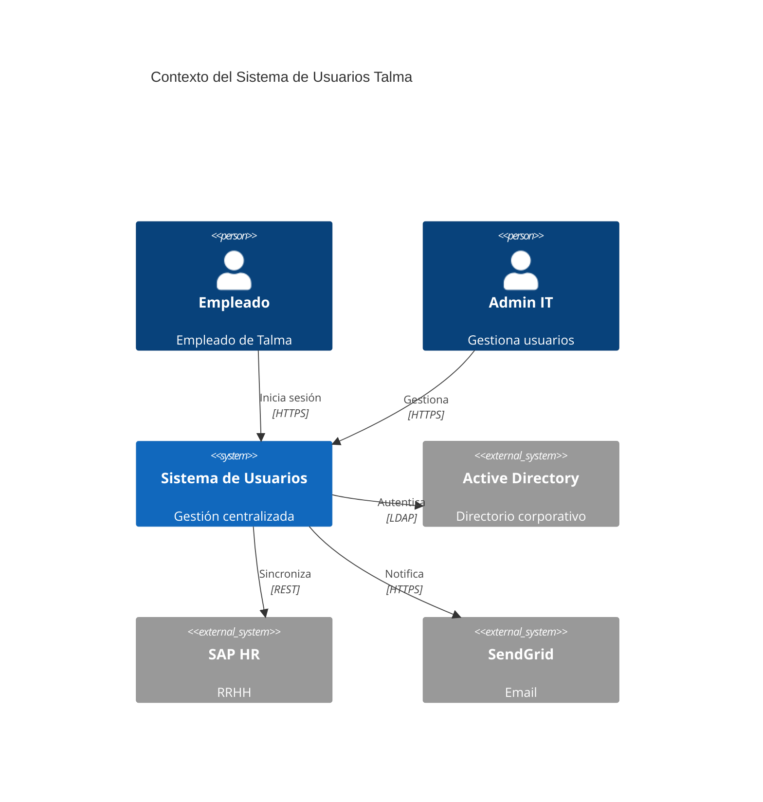
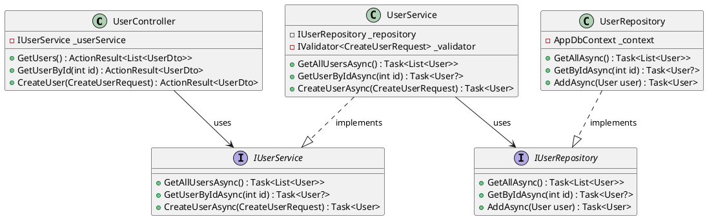

# Estándar: C4 Model - Diagramas Arquitectónicos

## 1. Propósito

Establecer el **Modelo C4** como estándar para crear diagramas arquitectónicos en Talma, asegurando visualizaciones consistentes y comprensibles en 4 niveles de abstracción.

:::tip
Usa C4 Model para los **diagramas arquitectónicos** y [arc42](./01-arc42.md) para la **estructura de documentación**. Los diagramas C4 se integran en las secciones 3, 5, 6 y 7 de arc42.
:::

## 2. Alcance

- Diagramas de arquitectura para documentación técnica
- Presentaciones a stakeholders
- Onboarding de equipos
- Revisiones de diseño
- Integración con plantilla [arc42](./01-arc42.md)

## 3. ¿Qué es C4 Model?

El **C4 Model** define **4 niveles de diagramas arquitectónicos**, cada uno con diferente nivel de detalle y audiencia objetivo:

| Nivel | Nombre    | Audiencia                      | Zoom                                |
| ----- | --------- | ------------------------------ | ----------------------------------- |
| **1** | Context   | Todos (técnicos y no técnicos) | Sistema completo en su entorno      |
| **2** | Container | Arquitectos, DevOps            | Aplicaciones, servicios, BD         |
| **3** | Component | Arquitectos, Desarrolladores   | Componentes dentro de un contenedor |
| **4** | Code      | Desarrolladores                | Clases, interfaces (UML)            |

## 4. Nivel 1: Diagrama de Contexto

### 4.1 Propósito

Mostrar **cómo el sistema encaja en el mundo** que lo rodea:

- Usuarios del sistema (personas y sistemas externos)
- Fronteras del sistema
- Relaciones de alto nivel

### 4.2 Elementos

- **Person**: Usuario humano (empleado, cliente, admin)
- **Software System**: Sistema (el tuyo o externo)
- **Relationships**: Interacciones entre elementos

### 4.3 Ejemplo: Structurizr DSL

```dsl
workspace "Sistema de Usuarios Talma" {
    model {
        # Personas
        employee = person "Empleado" "Empleado de Talma que usa el sistema"
        admin = person "Administrador IT" "Gestiona usuarios y permisos"

        # Sistema principal
        userSystem = softwareSystem "Sistema de Usuarios" "Gestión centralizada de usuarios, autenticación y autorización"

        # Sistemas externos
        activeDirectory = softwareSystem "Active Directory" "Directorio corporativo" "External"
        sapHR = softwareSystem "SAP HR" "Sistema de recursos humanos" "External"
        emailService = softwareSystem "SendGrid" "Servicio de email" "External"

        # Relaciones
        employee -> userSystem "Inicia sesión en aplicaciones"
        admin -> userSystem "Gestiona usuarios y roles"

        userSystem -> activeDirectory "Autentica usuarios" "LDAP"
        userSystem -> sapHR "Sincroniza datos de empleados" "REST API"
        userSystem -> emailService "Envía notificaciones" "HTTPS"
    }

    views {
        systemContext userSystem "SystemContext" {
            include *
            autolayout lr
        }

        styles {
            element "Person" {
                shape person
                background #08427B
                color #ffffff
            }
            element "Software System" {
                background #1168BD
                color #ffffff
            }
            element "External" {
                background #999999
                color #ffffff
            }
        }
    }
}
```

### 4.4 Ejemplo: PlantUML

```plantuml
@startuml
!include https://raw.githubusercontent.com/plantuml-stdlib/C4-PlantUML/master/C4_Context.puml

LAYOUT_WITH_LEGEND()

Person(employee, "Empleado", "Empleado de Talma")
Person(admin, "Administrador IT", "Gestiona usuarios")

System(userSystem, "Sistema de Usuarios", "Gestión centralizada de identidades")

System_Ext(ad, "Active Directory", "Directorio corporativo")
System_Ext(sap, "SAP HR", "Recursos humanos")
System_Ext(email, "SendGrid", "Servicio de email")

Rel(employee, userSystem, "Inicia sesión")
Rel(admin, userSystem, "Gestiona usuarios")

Rel(userSystem, ad, "Autentica", "LDAP")
Rel(userSystem, sap, "Sincroniza datos", "REST")
Rel(userSystem, email, "Envía emails", "HTTPS")

@enduml
```

### 4.5 Ejemplo: Mermaid



## 5. Nivel 2: Diagrama de Contenedores

### 5.1 Propósito

Mostrar **la arquitectura de alto nivel** del sistema:

- Aplicaciones ejecutables
- Servicios
- Bases de datos
- Tecnologías clave

**Nota**: "Container" = unidad deployable (no Docker container)

### 5.2 Elementos

- **Web Application**: SPA, MVC app
- **API Application**: REST API, GraphQL
- **Database**: PostgreSQL, MongoDB, Redis
- **Message Broker**: Kafka, RabbitMQ
- **File System**: S3, almacenamiento

### 5.3 Ejemplo: Structurizr DSL

```dsl
container userSystem "Containers" {
    # Frontend
    spa = container "Single Page App" "Interfaz de usuario" "React + TypeScript" "Web Browser"

    # Backend
    api = container "Web API" "API REST para operaciones" "ASP.NET Core 8" {
        tags "API"
    }

    # Datos
    database = container "Database" "Almacena usuarios, roles" "PostgreSQL 16" "Database"
    cache = container "Cache" "Cache de sesiones" "Redis 7" "Database"

    # Mensajería
    queue = container "Message Queue" "Cola de eventos" "RabbitMQ" "Queue"

    # Relaciones
    employee -> spa "Usa" "HTTPS"
    admin -> spa "Gestiona" "HTTPS"

    spa -> api "Hace llamadas API" "HTTPS/JSON"

    api -> database "Lee/Escribe" "TCP/5432"
    api -> cache "Cachea sesiones" "TCP/6379"
    api -> queue "Publica eventos" "AMQP"
    api -> activeDirectory "Autentica" "LDAP/636"
    api -> sapHR "Sincroniza" "HTTPS/REST"
}
```

### 5.4 Ejemplo: PlantUML

```plantuml
@startuml
!include https://raw.githubusercontent.com/plantuml-stdlib/C4-PlantUML/master/C4_Container.puml

Person(user, "Usuario", "Empleado")

System_Boundary(c1, "Sistema de Usuarios") {
    Container(spa, "SPA", "React", "Interfaz web")
    Container(api, "API", "ASP.NET Core", "API REST")
    ContainerDb(db, "Database", "PostgreSQL", "Datos persistentes")
    ContainerDb(cache, "Cache", "Redis", "Sesiones")
    ContainerQueue(queue, "Queue", "RabbitMQ", "Eventos")
}

System_Ext(ad, "Active Directory", "LDAP")

Rel(user, spa, "Usa", "HTTPS")
Rel(spa, api, "API calls", "JSON/HTTPS")
Rel(api, db, "Lee/Escribe", "TCP/5432")
Rel(api, cache, "Cachea", "TCP/6379")
Rel(api, queue, "Publica", "AMQP")
Rel(api, ad, "Autentica", "LDAP")

@enduml
```

## 6. Nivel 3: Diagrama de Componentes

### 6.1 Propósito

Descomponer un **contenedor** en sus componentes internos:

- Controllers, Services, Repositories
- Módulos lógicos
- Responsabilidades de cada componente

### 6.2 Ejemplo: Structurizr DSL

```dsl
component api "APIComponents" {
    # Controllers
    authController = component "Auth Controller" "Endpoints de autenticación" "ASP.NET MVC"
    userController = component "User Controller" "CRUD de usuarios" "ASP.NET MVC"

    # Services (Business Logic)
    authService = component "Auth Service" "Lógica de autenticación" "C#"
    userService = component "User Service" "Lógica de usuarios" "C#"

    # Repositories (Data Access)
    userRepository = component "User Repository" "Acceso a datos de usuarios" "EF Core"

    # Infrastructure
    cacheService = component "Cache Service" "Abstracción de Redis" "C#"

    # Relaciones
    spa -> authController "POST /auth/login"
    spa -> userController "GET /users"

    authController -> authService "Valida credenciales"
    userController -> userService "Operaciones CRUD"

    authService -> userRepository "Busca usuario"
    userService -> userRepository "CRUD"

    authService -> cacheService "Cachea tokens"
    userRepository -> database "SQL queries"
    cacheService -> cache "Redis commands"
}
```

### 6.3 Ejemplo: PlantUML

```plantuml
@startuml
!include https://raw.githubusercontent.com/plantuml-stdlib/C4-PlantUML/master/C4_Component.puml

Container(spa, "SPA", "React")
ContainerDb(db, "Database", "PostgreSQL")
ContainerDb(cache, "Cache", "Redis")

Container_Boundary(api, "Web API") {
    Component(authCtrl, "Auth Controller", "ASP.NET MVC", "Endpoints auth")
    Component(userCtrl, "User Controller", "ASP.NET MVC", "CRUD users")

    Component(authSvc, "Auth Service", "C#", "Lógica auth")
    Component(userSvc, "User Service", "C#", "Lógica users")

    Component(userRepo, "User Repository", "EF Core", "Data access")
    Component(cacheSvc, "Cache Service", "C#", "Redis abstraction")
}

Rel(spa, authCtrl, "POST /auth/login", "JSON")
Rel(spa, userCtrl, "GET /users", "JSON")

Rel(authCtrl, authSvc, "Valida")
Rel(userCtrl, userSvc, "Opera")

Rel(authSvc, userRepo, "Busca")
Rel(userSvc, userRepo, "CRUD")

Rel(authSvc, cacheSvc, "Cachea")
Rel(userRepo, db, "SQL", "TCP/5432")
Rel(cacheSvc, cache, "Commands", "TCP/6379")

@enduml
```

## 7. Nivel 4: Diagrama de Código

### 7.1 Propósito

Mostrar **detalles de implementación** a nivel de clases (UML):

- Diagramas de clases
- Diagramas de secuencia
- Relaciones entre clases

**Nota**: Usar solo cuando sea necesario (la mayoría de veces el código es suficiente).

### 7.2 Ejemplo: PlantUML Class Diagram



## 8. Herramientas Recomendadas

### 8.1 Structurizr DSL (Recomendado para C4)

**Ventajas**:

- ✅ Diseñado específicamente para C4
- ✅ Diagrams as Code (versionable en Git)
- ✅ Genera los 4 niveles automáticamente
- ✅ Soporta múltiples vistas del mismo modelo
- ✅ Exporta a PlantUML, Mermaid, PNG

**Instalación**:

```bash
# Structurizr CLI
brew install structurizr-cli

# O descargar JAR
wget https://github.com/structurizr/cli/releases/latest/download/structurizr-cli.zip
```

**Uso**:

```bash
# Renderizar workspace.dsl
structurizr-cli export -workspace workspace.dsl -format plantuml

# Publicar a Structurizr cloud
structurizr-cli push -workspace workspace.dsl -id 12345 -key xxx -secret yyy
```

### 8.2 PlantUML

**Ventajas**:

- ✅ Ampliamente soportado (VS Code, IntelliJ, Confluence)
- ✅ C4 plugin disponible
- ✅ Múltiples tipos de diagramas (secuencia, clases, deployment)
- ✅ Integra con CI/CD

**Instalación**:

```bash
brew install plantuml

# VS Code extension
code --install-extension jebbs.plantuml
```

### 8.3 Mermaid

**Ventajas**:

- ✅ Integrado en GitHub, GitLab, Docusaurus
- ✅ Sintaxis simple
- ✅ Renderiza en Markdown sin build
- ✅ Soporte para C4 (desde v9.0)

**Limitación**: Menos features que Structurizr/PlantUML.

### 8.4 draw.io / Excalidraw

**Ventajas**:

- ✅ WYSIWYG (lo que ves es lo que obtienes)
- ✅ Fácil para presentaciones rápidas

**Desventajas**:

- ❌ No es "diagrams as code"
- ❌ Difícil de versionar (binario/XML)
- ❌ No se actualiza automáticamente

**Uso**: Solo para sketches rápidos, no para documentación oficial.

## 9. Convenciones de Estilos

### 9.1 Colores Estándar

```
┌─────────────────────────────────────┐
│ Elemento            │ Color (Hex)   │
├─────────────────────┼───────────────┤
│ Person              │ #08427B       │
│ Sistema Interno     │ #1168BD       │
│ Sistema Externo     │ #999999       │
│ Database            │ #438DD5       │
│ Cache (Redis)       │ #FF6B6B       │
│ Message Queue       │ #FFA500       │
│ File Storage (S3)   │ #569A31       │
│ Web Browser         │ #777777       │
└─────────────────────────────────────┘
```

### 9.2 Tipos de Líneas

```
────▶  Sincrónico (HTTP, gRPC, LDAP)
····▶  Asíncrono (mensajes, eventos)
═══▶   Flujo de datos principal/crítico
```

### 9.3 Tags y Estilos

**Structurizr DSL**:

```dsl
styles {
    element "Person" {
        shape person
        background #08427B
        color #ffffff
    }
    element "Software System" {
        background #1168BD
        color #ffffff
    }
    element "External" {
        background #999999
        color #ffffff
    }
    element "Database" {
        shape cylinder
        background #438DD5
        color #ffffff
    }
    element "Queue" {
        shape pipe
        background #FFA500
        color #000000
    }
}
```

## 10. Integración con arc42

Los diagramas C4 se integran perfectamente con [arc42](./01-arc42.md):

| C4 Level      | arc42 Section                           | Descripción              |
| ------------- | --------------------------------------- | ------------------------ |
| **Context**   | Sección 3: Contexto y Alcance           | Fronteras del sistema    |
| **Container** | Sección 5.1: Vista de Bloques - Nivel 1 | Aplicaciones y servicios |
| **Component** | Sección 5.2: Vista de Bloques - Nivel 2 | Componentes internos     |
| **Code**      | Sección 5.3: Vista de Bloques - Nivel 3 | Clases (opcional)        |

## 11. Organización de Archivos

```
docs/
├── arquitectura/
│   ├── 03-contexto-alcance.md          # arc42 sección 3 + C4 Context
│   ├── 05-vista-bloques.md             # arc42 sección 5 + C4 Container/Component
│   └── 06-vista-runtime.md             # Diagramas de secuencia
├── diagramas/
│   ├── c4/
│   │   ├── workspace.dsl               # Structurizr workspace principal
│   │   ├── 01-context.puml             # Exportado desde Structurizr
│   │   ├── 02-containers.puml          # Exportado
│   │   ├── 03-components-api.puml      # Exportado
│   │   └── README.md                   # Cómo generar diagramas
│   ├── plantuml/
│   │   ├── secuencia-login.puml        # Diagrama de secuencia
│   │   └── deployment.puml             # Diagrama de deployment
│   └── mermaid/
│       └── flujos-negocio.md           # Flujos embebidos en Markdown
└── src/
    └── (código que implementa la arquitectura)
```

## 12. Checklist de Diagramas C4

- [ ] **Nivel especificado**: Indicar si es Context/Container/Component/Code
- [ ] **Título claro**: `"[C4 Container] Sistema de Usuarios - Production"`
- [ ] **Audiencia definida**: ¿Para arquitectos? ¿Devs? ¿Ejecutivos?
- [ ] **Leyenda incluida**: Colores, símbolos, tipos de líneas
- [ ] **Tecnologías visibles**: Indicar stack (ASP.NET, PostgreSQL, Redis)
- [ ] **Relaciones etiquetadas**: Protocolo y propósito ("HTTPS/JSON", "Autentica")
- [ ] **Formato correcto**: Usar shapes apropiados (person, cylinder, pipe)
- [ ] **Código fuente**: Preferir DSL (.dsl, .puml) sobre imágenes (.png)
- [ ] **Versionado**: Archivos en Git junto al código
- [ ] **Actualizado**: Refleja estado actual (no diseño futuro)
- [ ] **Exportado**: Si usa Structurizr, exportar a PlantUML/PNG para visualización

## 13. Mejores Prácticas

### 13.1 Simplicidad

```
✅ BIEN: 5-9 elementos por diagrama (cognitiva load)
❌ MAL: 20+ elementos (sobrecarga visual)
```

### 13.2 Consistencia

- Usar mismos colores en todos los diagramas
- Mismos nombres (no "API", "Web API", "Backend API" inconsistentemente)
- Misma herramienta en todo el proyecto

### 13.3 Documentación Complementaria

```markdown
## [C4 Container] Sistema de Usuarios

### Web API (ASP.NET Core)

**Responsabilidad**: API REST para gestión de usuarios

**Tecnologías**:

- ASP.NET Core 8
- Entity Framework Core 8
- Serilog

**Endpoints principales**:

- `POST /auth/login` - Autenticación
- `GET /users` - Listar usuarios
- `POST /users` - Crear usuario

**Configuración**:

- Puerto: 5000 (dev), 443 (prod)
- Health check: `/health`
- Métricas: `/metrics` (Prometheus)

**Referencias**:

- [Código fuente](https://github.com/talma/users-api)
- [OpenAPI Spec](https://api.talma.com/swagger)
- [ADR-002: Estándar REST](../../decisiones/adr-002.md)
```

## 14. Ejemplos Avanzados

### 14.1 Multi-Región Deployment

```dsl
deploymentEnvironment "Production" {
    deploymentNode "AWS us-east-1" {
        deploymentNode "ECS Cluster" {
            deploymentNode "Fargate Task (API)" {
                containerInstance api
            }
        }
        deploymentNode "RDS Multi-AZ" {
            containerInstance database primary
        }
    }

    deploymentNode "AWS us-west-2" {
        deploymentNode "RDS Read Replica" {
            containerInstance database replica
        }
    }
}
```

### 14.2 Microservicios

```dsl
softwareSystem ecommerce "E-commerce Talma" {
    # API Gateway
    apiGateway = container "API Gateway" "Kong"

    # Microservicios
    usersService = container "Users Service" "ASP.NET Core"
    ordersService = container "Orders Service" "Node.js"
    paymentsService = container "Payments Service" "ASP.NET Core"

    # Event Bus
    eventBus = container "Event Bus" "Kafka"

    # Relaciones
    spa -> apiGateway "HTTPS/JSON"
    apiGateway -> usersService "gRPC"
    apiGateway -> ordersService "REST"
    apiGateway -> paymentsService "REST"

    ordersService -> eventBus "Publica OrderCreated"
    paymentsService -> eventBus "Suscribe OrderCreated"
}
```

## 15. NO Hacer

❌ **NO** usar C4 Level 4 (Code) en la mayoría de casos (redundante con código)
❌ **NO** mezclar niveles en un mismo diagrama (Context + Component)
❌ **NO** crear diagramas con 20+ elementos (dividir en múltiples vistas)
❌ **NO** omitir tecnologías (indicar PostgreSQL, no solo "Database")
❌ **NO** usar colores arbitrarios (seguir paleta estándar)
❌ **NO** crear diagramas sin leyenda
❌ **NO** usar imágenes PNG/JPG sin código fuente (.dsl/.puml)

## 16. Referencias

### Documentación Oficial

- [C4 Model](https://c4model.com/)
- [Structurizr](https://structurizr.com/)
- [Structurizr DSL](https://github.com/structurizr/dsl)
- [C4-PlantUML](https://github.com/plantuml-stdlib/C4-PlantUML)
- [Mermaid C4 Diagrams](https://mermaid.js.org/syntax/c4.html)

### Lineamientos Relacionados

- [Lineamiento Gov. 03: Decisiones Arquitectónicas](../../lineamientos/gobierno/03-decisiones-arquitectonicas.md)
- [Lineamiento Dev. 05: Documentación](../../lineamientos/desarrollo/05-documentacion.md)

### Otros Estándares

- [arc42](./01-arc42.md) - Plantilla de documentación
- [OpenAPI/Swagger](./03-openapi-swagger.md) - Documentación de APIs
