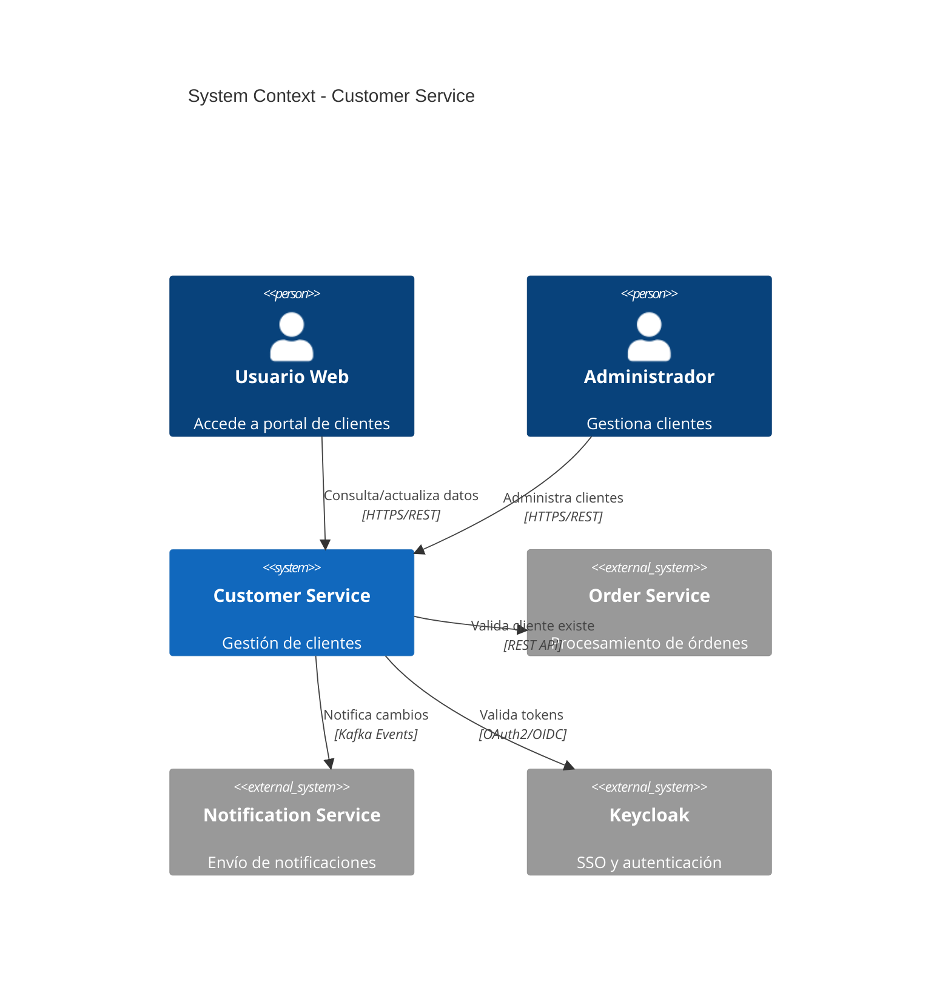
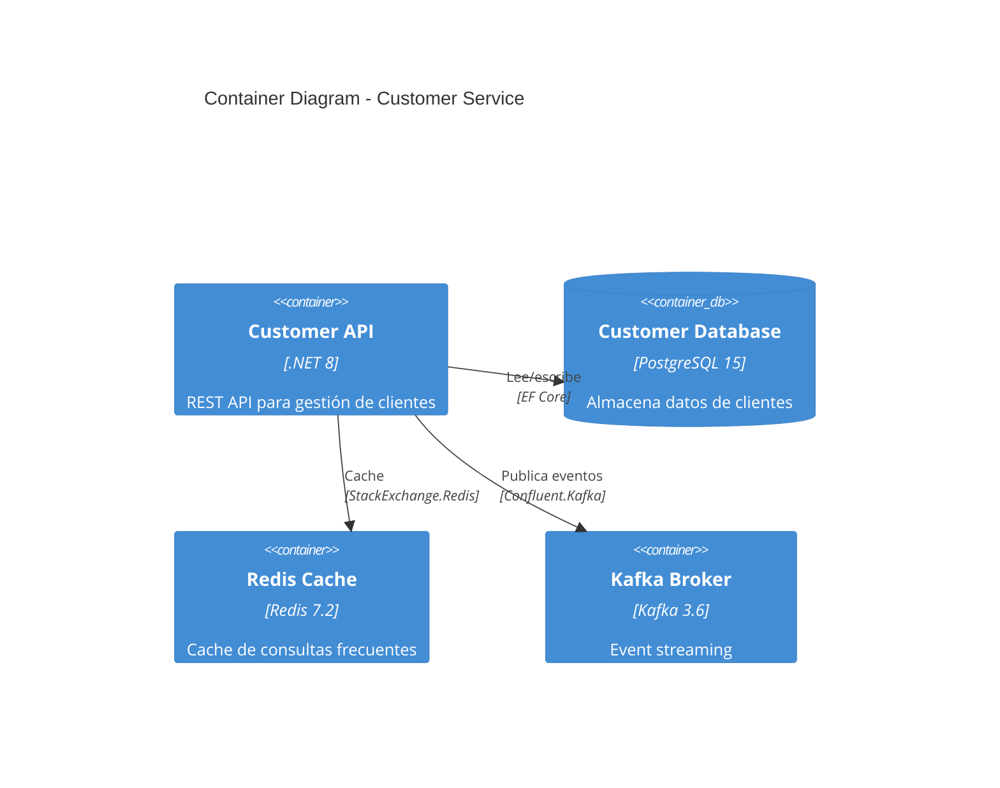
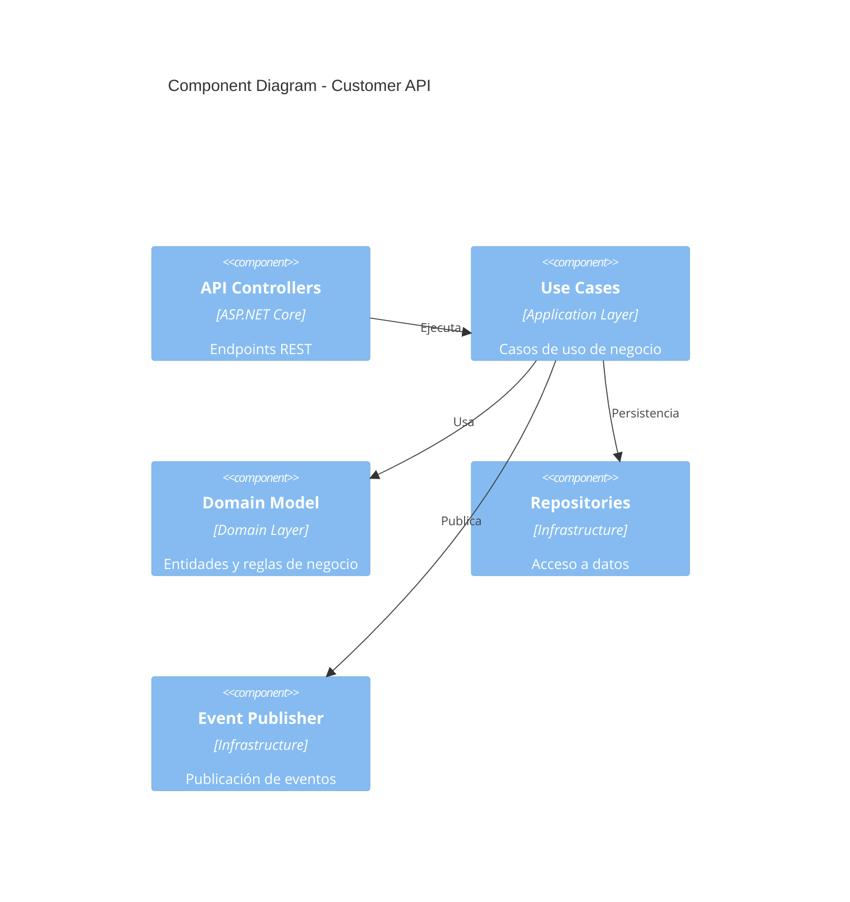
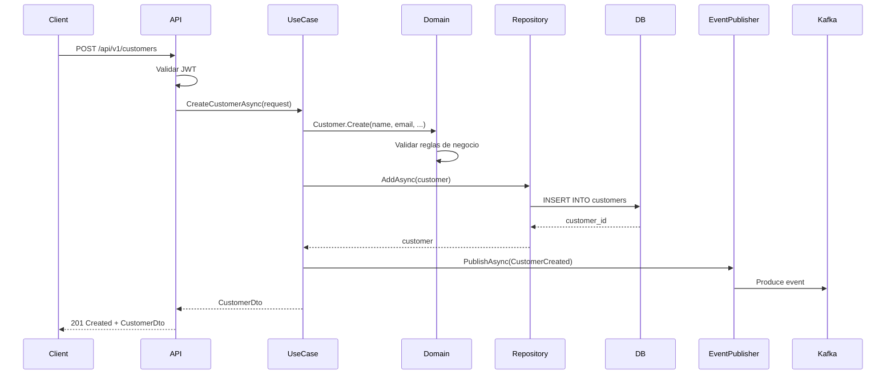
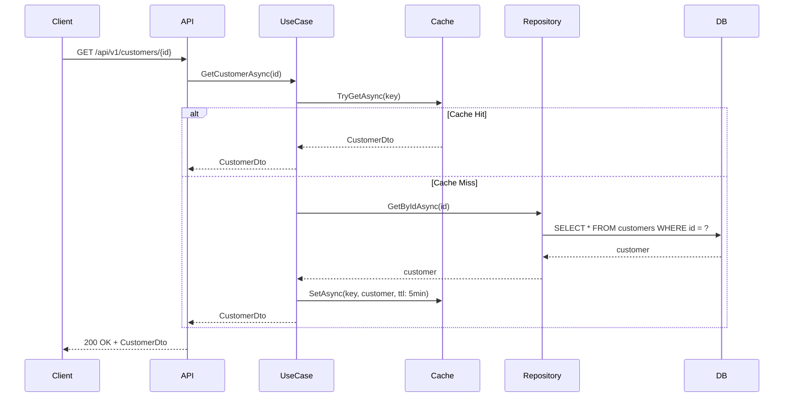
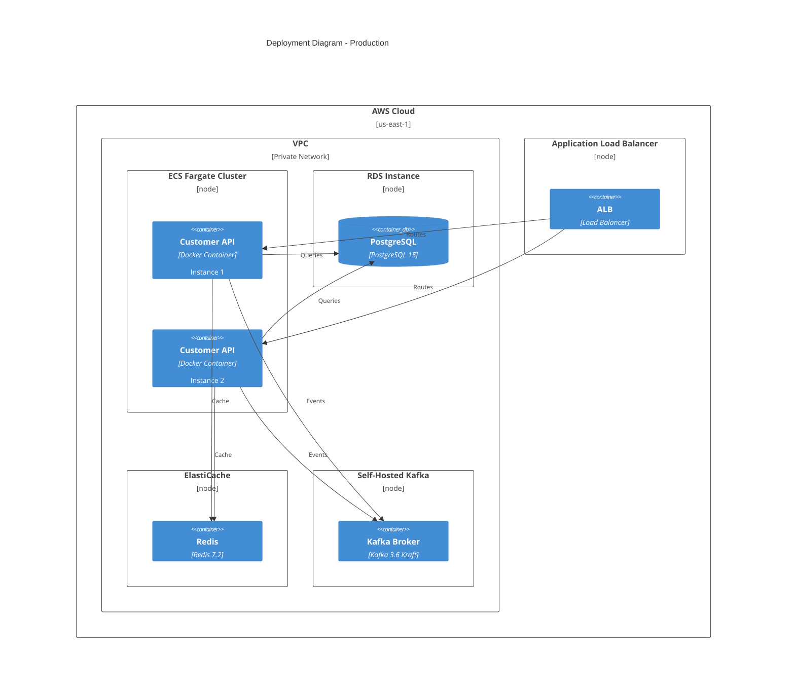

# arc42

## Contexto

Este estándar define cómo documentar arquitecturas de software usando arc42, un template estructurado y agnóstico de tecnología. Complementa el lineamiento [Decisiones Arquitectónicas](../../lineamientos/gobierno/01-decisiones-arquitectonicas.md).

---

## Stack Tecnológico

| Componente            | Tecnología | Versión | Uso                    |
| --------------------- | ---------- | ------- | ---------------------- |
| **Documentación**     | Markdown   | -       | Formato de documentos  |
| **Diagramas**         | Mermaid    | 10.0+   | Diagramas as code      |
| **Generación Sitio**  | Docusaurus | 3.0+    | Documentación web      |
| **Control Versiones** | GitHub     | -       | Versionamiento de docs |

---

## ¿Qué es arc42?

Template estructurado y agnóstico de tecnología para documentar arquitecturas de software, organizado en 12 secciones que cubren todos los aspectos relevantes.

**Secciones principales:**

1. **Introducción y Objetivos**: Requisitos esenciales, stakeholders
2. **Restricciones**: Limitaciones técnicas, organizacionales
3. **Contexto y Alcance**: Fronteras del sistema, interfaces externas
4. **Estrategia de Solución**: Decisiones tecnológicas fundamentales
5. **Vista de Bloques de Construcción**: Estructura estática
6. **Vista de Tiempo de Ejecución**: Comportamiento dinámico
7. **Vista de Despliegue**: Infraestructura y deployment
8. **Conceptos Transversales**: Patrones y soluciones recurrentes
9. **Decisiones de Diseño**: Decisiones arquitectónicas importantes
10. **Requisitos de Calidad**: Escenarios de calidad concretos
11. **Riesgos y Deuda Técnica**: Riesgos conocidos
12. **Glosario**: Términos del dominio

**Propósito:** Documentación completa, estructurada y mantenible de arquitectura.

**Beneficios:**
✅ Estructura estándar reconocible
✅ Cobertura completa de aspectos relevantes
✅ Fácil navegación
✅ Separación clara de preocupaciones

## Estructura arc42 para Microservicios

````markdown
# Arquitectura: Customer Service

## 1. Introducción y Objetivos

### Descripción del Sistema

Customer Service gestiona el ciclo de vida completo de clientes, incluyendo registro, actualización, consulta y eliminación lógica.

### Objetivos de Calidad (Top 3)

1. **Disponibilidad**: 99.9% uptime (SLA)
2. **Performance**: P95 < 200ms para operaciones CRUD
3. **Seguridad**: Protección de PII según GDPR/LGPD

### Stakeholders

| Rol             | Expectativa                           |
| --------------- | ------------------------------------- |
| Product Owner   | Features rápidas, alta disponibilidad |
| Arquitecto      | Arquitectura limpia, patrones claros  |
| Desarrolladores | Código mantenible, documentado        |
| Operaciones     | Observabilidad, deployment simple     |
| Compliance      | Cumplimiento regulatorio              |

---

## 2. Restricciones

### Técnicas

- ✅ Stack: .NET 8, PostgreSQL 15, Apache Kafka 3.6
- ✅ Cloud: AWS (ECS Fargate, S3, Secrets Manager)
- ✅ No usar tecnologías no aprobadas (Node.js, MySQL, RabbitMQ)

### Organizacionales

- ✅ Equipo: 4 desarrolladores, 1 QA
- ✅ Budget: Sin costos adicionales de licencias
- ✅ Tiempo: MVP en 3 meses

### Regulatorias

- ✅ GDPR compliance para datos personales
- ✅ Logs auditables por 7 años

---

## 3. Contexto y Alcance

### Diagrama de Contexto (C4 Level 1)



### Interfaces Externas

| Sistema              | Protocolo    | Dirección | Propósito                    |
| -------------------- | ------------ | --------- | ---------------------------- |
| Keycloak             | OAuth2/OIDC  | IN        | Autenticación y autorización |
| Order Service        | REST API     | IN        | Validación de cliente        |
| Notification Service | Kafka Events | OUT       | Eventos de ciclo de vida     |

---

## 4. Estrategia de Solución

### Decisiones Fundamentales

1. **Clean Architecture**: Separación Domain → Application → Infrastructure → API
2. **Database per Service**: PostgreSQL dedicado con schema `customer`
3. **Event-Driven**: Publicar eventos para cambios de estado
4. **API Versionada**: v1 con backward compatibility
5. **Observabilidad**: Grafana Stack (Loki + Mimir + Tempo)

### Tecnologías Clave

- **Backend**: .NET 8 (ASP.NET Core Web API)
- **ORM**: Entity Framework Core 8.0
- **Validation**: FluentValidation 11.0
- **Resilience**: Polly 8.0
- **Messaging**: Confluent.Kafka 2.3
- **Cache**: StackExchange.Redis 2.7

---

## 5. Vista de Bloques de Construcción

### Nivel 1: Contenedores (C4 Level 2)



### Nivel 2: Componentes (C4 Level 3)



### Estructura de Carpetas

```
CustomerService/
├── src/
│   ├── CustomerService.Api/              # API Layer
│   │   ├── Controllers/
│   │   ├── Middleware/
│   │   ├── Program.cs
│   │   └── appsettings.json
│   │
│   ├── CustomerService.Application/      # Application Layer
│   │   ├── UseCases/
│   │   │   ├── CreateCustomer/
│   │   │   ├── GetCustomer/
│   │   │   ├── UpdateCustomer/
│   │   │   └── DeleteCustomer/
│   │   ├── DTOs/
│   │   └── Validators/
│   │
│   ├── CustomerService.Domain/           # Domain Layer
│   │   ├── Entities/
│   │   │   └── Customer.cs
│   │   ├── ValueObjects/
│   │   │   ├── Email.cs
│   │   │   └── Document.cs
│   │   ├── Events/
│   │   │   ├── CustomerCreated.cs
│   │   │   └── CustomerUpdated.cs
│   │   └── Repositories/
│   │       └── ICustomerRepository.cs
│   │
│   └── CustomerService.Infrastructure/   # Infrastructure Layer
│       ├── Persistence/
│       │   ├── CustomerDbContext.cs
│       │   ├── Repositories/
│       │   └── Migrations/
│       ├── Messaging/
│       │   └── KafkaEventPublisher.cs
│       └── Caching/
│           └── RedisCacheService.cs
│
├── tests/
│   ├── CustomerService.UnitTests/
│   ├── CustomerService.IntegrationTests/
│   └── CustomerService.ArchitectureTests/
│
├── docs/
│   ├── architecture/
│   │   └── arc42.md
│   ├── adrs/
│   │   ├── 0001-use-postgresql.md
│   │   └── 0002-event-driven-architecture.md
│   └── api/
│       └── openapi.yaml
│
└── CustomerService.sln
```

---

## 6. Vista de Tiempo de Ejecución

### Escenario: Crear Cliente



### Escenario: Consultar Cliente (con Cache)



---

## 7. Vista de Despliegue

### Arquitectura de Deployment



### Configuración de Ambientes

| Ambiente   | URL                                  | Réplicas | DB Instance  | Cache       |
| ---------- | ------------------------------------ | -------- | ------------ | ----------- |
| Dev        | <https://customer-api.dev.talma.com> | 1        | db.t3.micro  | redis:6379  |
| Staging    | <https://customer-api.stg.talma.com> | 2        | db.t3.small  | elasticache |
| Production | <https://customer-api.talma.com>     | 3        | db.r6g.large | elasticache |

---

## 8. Conceptos Transversales

### Seguridad

- **Autenticación**: OAuth2 + JWT via Keycloak
- **Autorización**: RBAC (roles: admin, user, read-only)
- **Secrets**: AWS Secrets Manager
- **Encryption**: TLS 1.3 in transit, AES-256 at rest

### Resiliencia

- **Circuit Breaker**: Polly para llamadas externas
- **Retry**: Exponential backoff (3 intentos)
- **Timeout**: 30s para HTTP, 5s para DB queries
- **Rate Limiting**: 100 req/min por cliente

### Observabilidad

- **Logs**: Serilog → Loki (structured JSON)
- **Metrics**: OpenTelemetry → Mimir (Prometheus format)
- **Traces**: OpenTelemetry → Tempo
- **Dashboards**: Grafana

### Validación

- **DTO Validation**: FluentValidation en API layer
- **Domain Validation**: Reglas de negocio en entidades
- **DB Constraints**: CHECK, UNIQUE, FK en PostgreSQL

---

## 9. Decisiones de Diseño

Ver [Architecture Decision Records](/docs/adrs/) para decisiones detalladas:

- [ADR-001: Estrategia Multi-Tenancy](/docs/adrs/adr-001-estrategia-multi-tenancy)
- [ADR-002: AWS ECS Fargate para Contenedores](/docs/adrs/adr-002-aws-ecs-fargate-contenedores)
- ADR-003: PostgreSQL como base de datos principal
- ADR-004: Event sourcing para auditoría

---

## 10. Requisitos de Calidad

### Performance

| Métrica       | Objetivo     | Medición             |
| ------------- | ------------ | -------------------- |
| Latencia P95  | < 200ms      | OpenTelemetry traces |
| Throughput    | > 1000 req/s | Grafana dashboard    |
| DB Query Time | < 50ms       | EF Core query logs   |

### Disponibilidad

| Métrica | Objetivo | Medición                |
| ------- | -------- | ----------------------- |
| Uptime  | 99.9%    | Health check monitoring |
| MTTR    | < 15 min | Incident reports        |
| RTO     | < 1 hour | DR drills               |
| RPO     | < 15 min | Backup frequency        |

### Seguridad

| Métrica             | Objetivo        | Medición             |
| ------------------- | --------------- | -------------------- |
| Vulnerabilities     | 0 Critical/High | Trivy + OWASP scans  |
| Secrets Exposure    | 0               | Git secrets scanning |
| Auth Token Validity | < 1 hour        | Keycloak config      |

---

## 11. Riesgos y Deuda Técnica

### Riesgos

| Riesgo                          | Probabilidad | Impacto | Mitigación                  |
| ------------------------------- | ------------ | ------- | --------------------------- |
| PostgreSQL single point failure | Media        | Alto    | Multi-AZ RDS, read replicas |
| Kafka downtime                  | Baja         | Alto    | Circuit breaker, retry, DLQ |
| Cache invalidation bugs         | Media        | Medio   | TTL conservador, monitoring |

### Deuda Técnica

| Item                                        | Severidad | Plan                       |
| ------------------------------------------- | --------- | -------------------------- |
| Sin integration tests con Testcontainers    | Alta      | Q2 2026 - Agregar tests    |
| Logs no estructurados en componentes legacy | Media     | Q3 2026 - Refactor logging |
| Duplicación de validación en API y Domain   | Baja      | Q4 2026 - Consolidar       |

---

## 12. Glosario

| Término    | Definición                                             |
| ---------- | ------------------------------------------------------ |
| Customer   | Entidad que representa cliente del sistema             |
| PII        | Personally Identifiable Information (datos personales) |
| Event      | Mensaje asíncrono comunicando cambio de estado         |
| Aggregate  | Cluster de objetos del dominio tratados como unidad    |
| Use Case   | Caso de uso de aplicación (application service)        |
| Repository | Abstracción para persistencia de agregados             |
````

---

## Implementación

```bash
# 1. Crear estructura de documentación
mkdir -p docs/architecture

# 2. Crear arc42.md base
cat > docs/architecture/arc42.md << 'EOF'
# Arquitectura: [Nombre del Servicio]

## 1. Introducción y Objetivos
[Completar...]

## 2. Restricciones
[Completar...]

## 3. Contexto y Alcance
[Completar...]

## 4. Estrategia de Solución
[Completar...]

## 5. Vista de Bloques de Construcción
[Completar...]

## 6. Vista de Tiempo de Ejecución
[Completar...]

## 7. Vista de Despliegue
[Completar...]

## 8. Conceptos Transversales
[Completar...]

## 9. Decisiones de Diseño
Ver [ADRs](/docs/adrs/)

## 10. Requisitos de Calidad
[Completar...]

## 11. Riesgos y Deuda Técnica
[Completar...]

## 12. Glosario
[Completar...]
EOF
```

---

## Requisitos Técnicos

### MUST (Obligatorio)

- **MUST** documentar arquitectura de cada servicio con arc42
- **MUST** mantener arc42 actualizado con cambios significativos
- **MUST** incluir al menos secciones 1-9 de arc42
- **MUST** versionar documentación en Git junto con código
- **MUST** incluir diagrama de contexto (sección 3) con Mermaid o PlantUML

### SHOULD (Fuertemente recomendado)

- **SHOULD** incluir las 12 secciones completas si el servicio es complejo
- **SHOULD** incluir referencias a ADRs en la sección 9
- **SHOULD** incluir escenarios de secuencia en la sección 6
- **SHOULD** revisar y actualizar arc42 en cada sprint de arquitectura

### MAY (Opcional)

- **MAY** incluir arc42 sección 12 (Glosario) si el dominio es complejo
- **MAY** generar diagrama de componentes (sección 5) con herramienta automatizada
- **MAY** usar plantillas diferentes por tipo de servicio (CRUD vs event-driven)

### MUST NOT (Prohibido)

- **MUST NOT** crear diagramas binarios (Word, Visio) sin source code equivalente
- **MUST NOT** documentar arquitectura solo en wikis externos sin versionar en Git
- **MUST NOT** omitir secciones 1, 3, 4, 5, 9 (mínimo indispensable)

---

## Referencias

- [arc42 Template](https://arc42.org/overview)
- [arc42 Documentation](https://docs.arc42.org/)
- [arc42 en GitHub](https://github.com/arc42/arc42-template)
- [C4 Model](./c4-model.md)
- [Gestión de ADRs](../gobierno/adr-management.md)

---

**Última actualización**: 18 de febrero de 2026
**Responsable**: Equipo de Arquitectura
