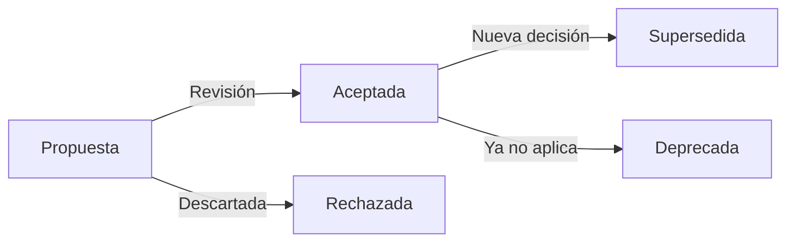

# Estándar Técnico — Architecture Decision Records (ADR)

---

## 1. Propósito

Documentar decisiones arquitectónicas significativas usando **Architecture Decision Records (ADR)** en formato Markdown según ThoughtWorks, garantizando trazabilidad, contexto y justificación técnica para futuras revisiones.

---

## 2. Alcance

**Aplica a:**

- Decisiones tecnológicas (frameworks, lenguajes, BD)
- Patrones arquitectónicos (microservicios, event-driven)
- Infraestructura cloud (servicios AWS, networking)
- Seguridad, compliance, DevOps
- Cambios significativos en sistemas existentes

**No aplica a:**

- Configuraciones menores o tácticas
- Decisiones reversibles sin impacto
- Preferencias de estilo de código (usar Convenciones)

---

## 3. Formato Obligatorio

### Estructura de ADR

```markdown
---
id: adr-NNN-titulo-corto
sidebar_position: NNN
title: ADR-NNN: Título Descriptivo
description: Resumen en una línea de la decisión.
---

# ADR-NNN: Título Descriptivo

**Estado:** [Propuesta | Aceptada | Rechazada | Deprecada | Supersedida por ADR-XXX]
**Fecha:** YYYY-MM-DD
**Autor:** Nombre / Equipo
**Revisores:** Nombre(s)

---

## Contexto

¿Qué problema/necesidad motiva esta decisión? Incluir:

- Situación actual
- Restricciones técnicas/de negocio
- Fuerzas en juego (trade-offs)

## Decisión

Descripción clara y concisa de la decisión tomada.

## Alternativas Consideradas

| Alternativa | Pros | Contras | Razón de descarte |
| ----------- | ---- | ------- | ----------------- |
| Opción A    | ...  | ...     | ...               |
| Opción B    | ...  | ...     | ...               |

## Consecuencias

### Positivas

- Beneficio 1
- Beneficio 2

### Negativas

- Trade-off 1
- Trade-off 2

### Riesgos

- Riesgo 1 (mitigación: ...)
- Riesgo 2 (mitigación: ...)

## Implementación

- [ ] Acción 1
- [ ] Acción 2
- [ ] Validación de cumplimiento

## Referencias

- [Link a documentación técnica]
- [ADRs relacionados]
- [Estándares aplicables]
```

---

## 4. Requisitos Obligatorios 🔴

- [ ] Formato Markdown con estructura estandarizada
- [ ] Numeración secuencial: `ADR-001`, `ADR-002`, etc.
- [ ] Ubicación: `/docs/decisiones-de-arquitectura/adr-NNN-titulo.md`
- [ ] Estado explícito: Propuesta/Aceptada/Rechazada/Deprecada/Supersedida
- [ ] Fecha de decisión (YYYY-MM-DD)
- [ ] Contexto claro: problema/necesidad que motiva la decisión
- [ ] Alternativas consideradas con pros/contras
- [ ] Consecuencias positivas Y negativas documentadas
- [ ] Autor y revisores identificados
- [ ] Referencias a estándares técnicos aplicables
- [ ] ADR revisado en Architecture Review antes de "Aceptada"
- [ ] NO editar ADRs aceptados (crear nuevo ADR que supersede)
- [ ] Linking: ADR deprecado debe referenciar al que lo reemplaza

---

## 5. Ciclo de Vida



| Estado          | Descripción             | Acción permitida            |
| --------------- | ----------------------- | --------------------------- |
| **Propuesta**   | En revisión             | Edición libre               |
| **Aceptada**    | Aprobada y vigente      | NO editar (crear nuevo ADR) |
| **Rechazada**   | Descartada              | Solo agregar notas al final |
| **Deprecada**   | Ya no aplica            | Link a contexto actual      |
| **Supersedida** | Reemplazada por ADR-XXX | Link al nuevo ADR           |

---

## 6. Naming y Ubicación

### Estructura de directorios

```
docs/decisiones-de-arquitectura/
├── README.md
├── adr-001-multi-tenancy-paises.md
├── adr-002-estandard-apis-rest.md
├── adr-003-gestion-secretos.md
└── ...
```

### Naming convention

```
adr-NNN-titulo-descriptivo-kebab-case.md
```

- `NNN`: número secuencial con ceros a la izquierda (001, 002, 010, 123)
- `titulo-descriptivo`: resumen en 3-5 palabras, separadas por guiones
- Ejemplo: `adr-018-arquitectura-microservicios.md`

---

## 7. Ejemplo Completo

```markdown
---
id: adr-008-gateway-apis
sidebar_position: 8
title: ADR-008: API Gateway Centralizado con AWS API Gateway
description: Uso de AWS API Gateway para routing, autenticación y rate limiting de APIs públicas.
---

# ADR-008: API Gateway Centralizado con AWS API Gateway

**Estado:** Aceptada
**Fecha:** 2024-01-15
**Autor:** Equipo de Arquitectura
**Revisores:** CTO, Tech Leads

---

## Contexto

Múltiples microservicios exponen APIs REST sin punto de entrada unificado, generando:

- Autenticación duplicada en cada servicio
- Sin rate limiting ni throttling
- Clientes deben conocer múltiples endpoints
- Dificultad para aplicar políticas de seguridad transversales

## Decisión

Implementar **AWS API Gateway** como punto de entrada único para todas las APIs públicas, con:

- Routing a microservicios backend en ECS/Lambda
- Autenticación JWT centralizada (Cognito)
- Rate limiting: 1000 req/min por API key
- Transformaciones de request/response
- Logging y monitoreo centralizado

## Alternativas Consideradas

| Alternativa               | Pros                    | Contras                              | Razón de descarte           |
| ------------------------- | ----------------------- | ------------------------------------ | --------------------------- |
| Kong (self-hosted)        | Flexibilidad, plugins   | Operación compleja, costos EC2       | Overhead operacional        |
| NGINX Ingress (AWS ECS Fargate)       | Nativo AWS ECS Fargate       | Solo funciona en AWS ECS Fargate                 | Usamos ECS mayoritariamente |
| Application Load Balancer | Integración AWS, simple | Sin autenticación, sin rate limiting | Funcionalidad limitada      |

## Consecuencias

### Positivas

- Autenticación centralizada (reducción 80% código duplicado)
- Rate limiting out-of-the-box
- Monitoreo con CloudWatch integrado
- Costos por uso (sin infraestructura dedicada)

### Negativas

- Latencia adicional: ~5-10ms por request
- Vendor lock-in con AWS
- Límites de payload: 10MB

### Riesgos

- SPOF: mitigado con multi-AZ y failover
- Costos inesperados: mitigado con alarmas CloudWatch

## Implementación

- [x] Crear API Gateway en AWS (REST API type)
- [x] Configurar Cognito User Pool para autenticación
- [x] Definir usage plans y API keys
- [x] Configurar custom domain (api.talma.com)
- [ ] Migrar 15 APIs existentes (Q1 2024)
- [ ] Documentar en Swagger/OpenAPI

## Referencias

- [AWS API Gateway Best Practices](https://docs.aws.amazon.com/apigateway/latest/developerguide/best-practices.html)
- [Estándar: Desarrollo de APIs REST](../../estandares/apis/desarrollo-apis-rest.md)
- [ADR-004: Autenticación SSO](adr-004-autenticacion-sso.md)
```

---

## 8. Validación

**Checklist de cumplimiento:**

- [ ] ADR sigue estructura obligatoria (contexto, decisión, alternativas, consecuencias)
- [ ] Numeración secuencial correcta
- [ ] Estado explícito y actualizado
- [ ] Alternativas documentadas con tabla pros/contras
- [ ] Consecuencias positivas Y negativas listadas
- [ ] Referencias a estándares técnicos aplicables
- [ ] Revisado en Architecture Review (para estado "Aceptada")
- [ ] Linking correcto si supersede/depreca otro ADR

**Métricas de cumplimiento:**

| Métrica                                    | Target | Verificación                      |
| ------------------------------------------ | ------ | --------------------------------- |
| ADRs para decisiones mayores               | 100%   | Audit log de Architecture Reviews |
| ADRs con formato correcto                  | 100%   | Checklist en PR                   |
| ADRs revisados antes de "Aceptada"         | 100%   | Architecture Review Board         |
| ADRs obsoletos marcados como "Supersedida" | 100%   | Quarterly review                  |

Incumplimientos detectados en code review bloquean merge.

---

## 9. Referencias

- [ThoughtWorks Technology Radar — ADR](https://www.thoughtworks.com/radar/techniques/lightweight-architecture-decision-records)
- [ADR GitHub Organization](https://adr.github.io/)
- [Estándar: Architecture Review](../gobierno/architecture-review.md)
- [Template ADR Markdown](https://github.com/joelparkerhenderson/architecture-decision-record)
