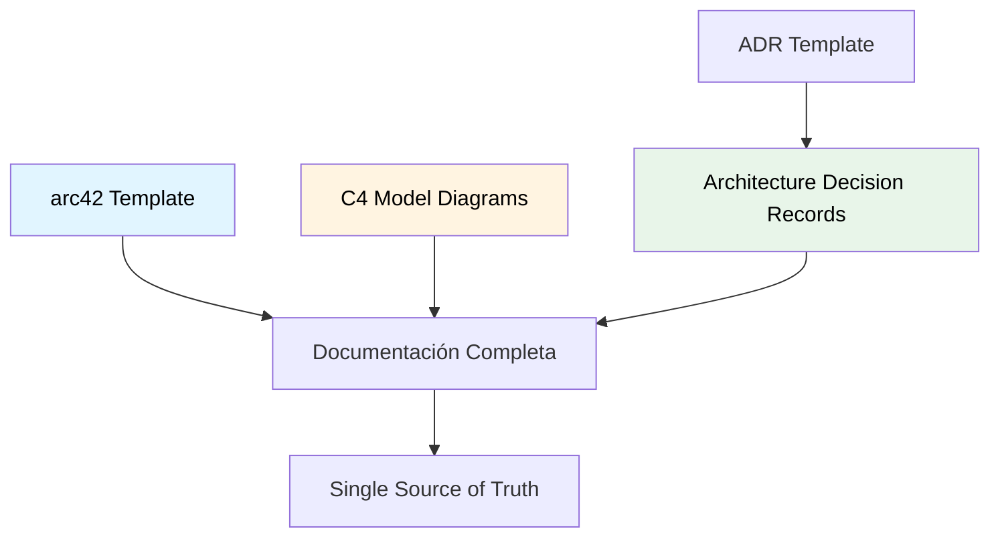
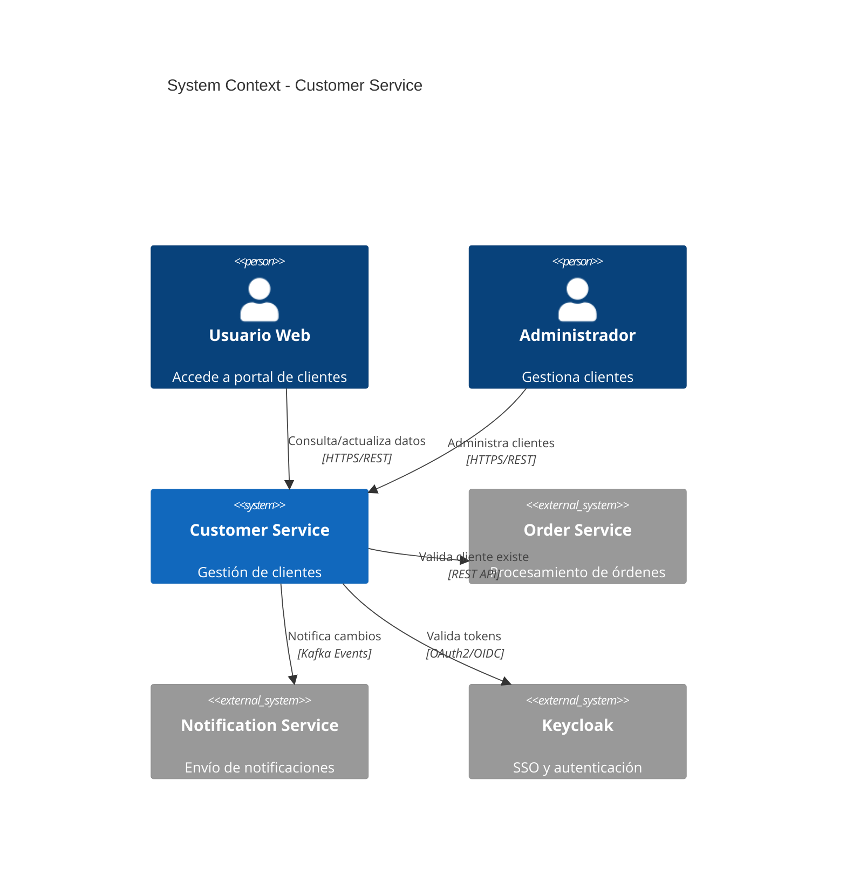
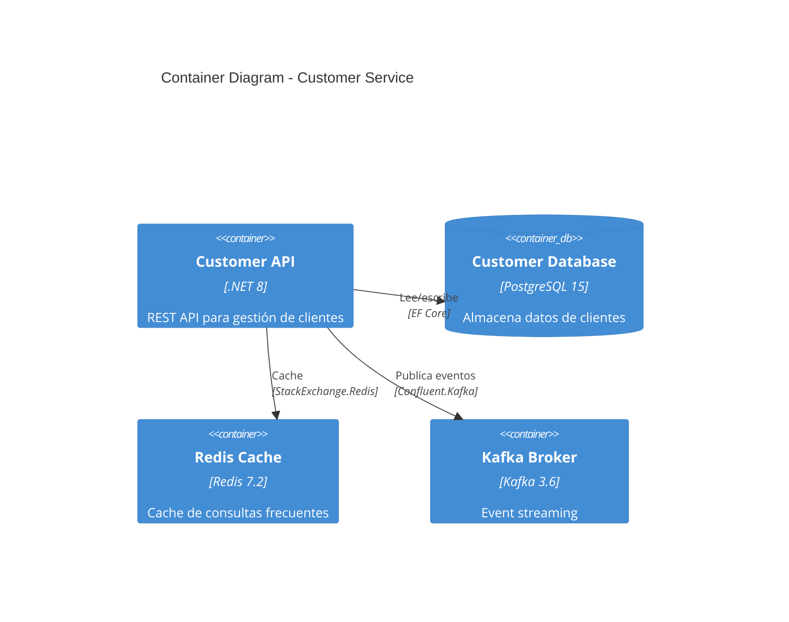
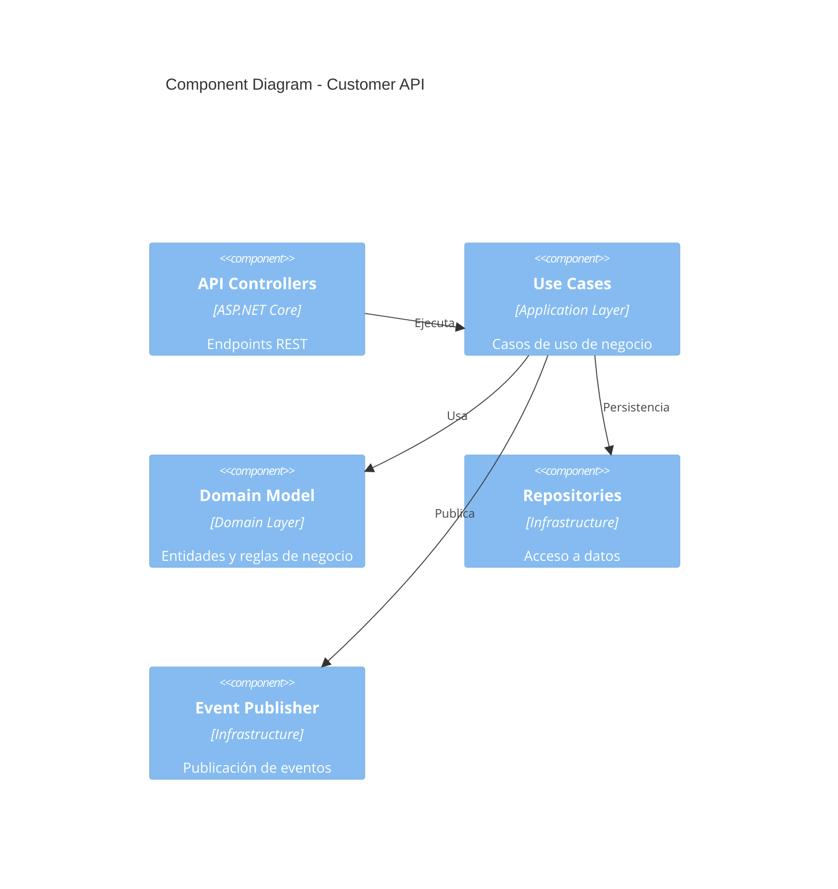
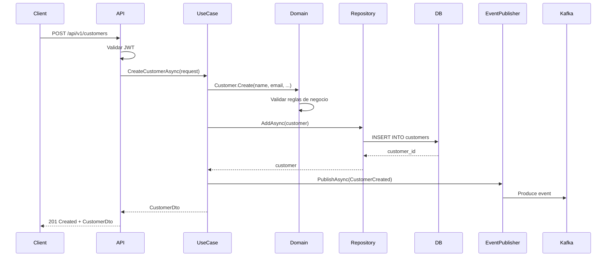
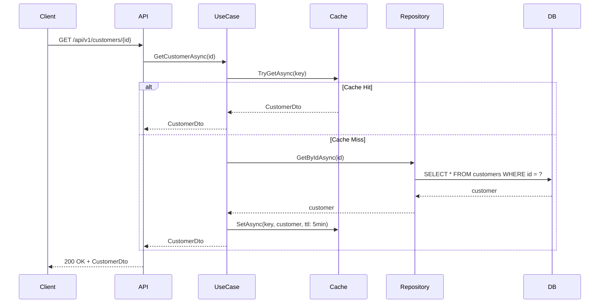
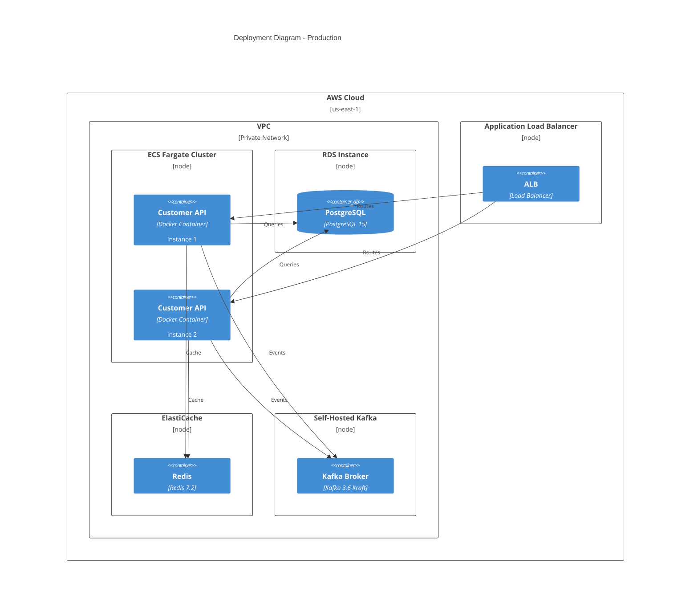
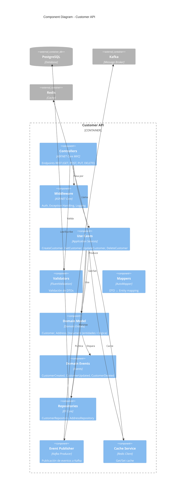
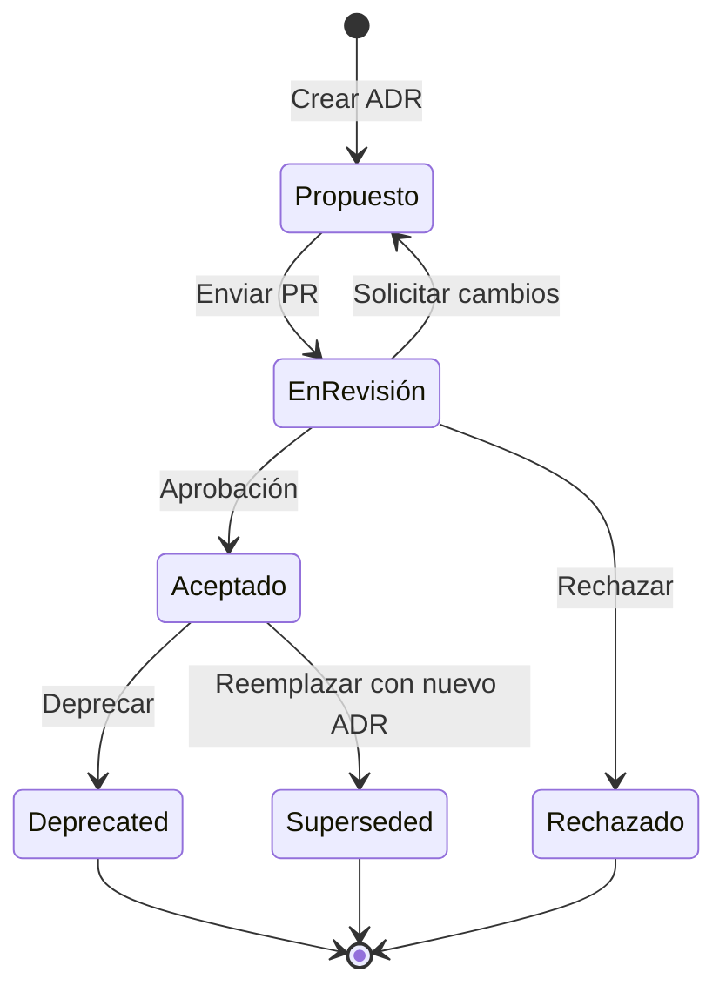

# Documentación de Arquitectura

## Contexto

Este estándar define cómo documentar decisiones y estructuras arquitectónicas de forma consistente, mantenible y útil. Complementa el lineamiento [Decisiones Arquitectónicas](../../lineamientos/gobierno/01-decisiones-arquitectonicas.md).

**Conceptos incluidos:**

- **arc42** → Template estructurado para documentación arquitectónica
- **C4 Model** → Diagramas de arquitectura en 4 niveles
- **Architecture Decision Records (ADRs)** → Registro de decisiones
- **ADR Template** → Formato estándar para ADRs

---

## Stack Tecnológico

| Componente            | Tecnología | Versión | Uso                                |
| --------------------- | ---------- | ------- | ---------------------------------- |
| **Documentación**     | Markdown   | -       | Formato de documentos              |
| **Diagramas**         | Mermaid    | 10.0+   | Diagramas as code                  |
| **Diagramas C4**      | PlantUML   | 1.2024+ | C4 diagrams                        |
| **Generación Sitio**  | Docusaurus | 3.0+    | Documentación web                  |
| **Control Versiones** | GitHub     | -       | Versionamiento de docs             |
| **ADR Tooling**       | adr-tools  | 3.0+    | CLI para gestionar ADRs (opcional) |

---

## Conceptos Fundamentales

Este estándar cubre 4 aspectos de documentación arquitectónica:

### Índice de Conceptos

1. **arc42**: Template estructurado para documentar arquitectura completa
2. **C4 Model**: Visualización jerárquica de arquitectura (Context, Container, Component, Code)
3. **ADRs**: Registro cronológico de decisiones arquitectónicas
4. **ADR Template**: Formato estándar consistente para decisiones

### Relación entre Conceptos



---

## 1. arc42 Template

### ¿Qué es arc42?

Template estructurado y agnóstico de tecnología para documentar arquitecturas de software, organizado en 12 secciones que cubren todos los aspectos relevantes.

**Secciones principales:**

1. **Introducción y Objetivos**: Requisitos esenciales, stakeholders
2. **Restricciones**: Limitaciones técnicas, organizacionales
3. **Contexto y Alcance**: Fronteras del sistema, interfaces externas
4. **Estrategia de Solución**: Decisiones tecnológicas fundamentales
5. **Vista de Bloques de Construcción**: Estructura estática
6. **Vista de Tiempo de Ejecución**: Comportamiento dinámico
7. **Vista de Despliegue**: Infraestructura y deployment
8. **Conceptos Transversales**: Patrones y soluciones recurrentes
9. **Decisiones de Diseño**: Decisiones arquitectónicas importantes
10. **Requisitos de Calidad**: Escenarios de calidad concretos
11. **Riesgos y Deuda Técnica**: Riesgos conocidos
12. **Glosario**: Términos del dominio

**Propósito:** Documentación completa, estructurada y mantenible de arquitectura.

**Beneficios:**
✅ Estructura estándar reconocible
✅ Cobertura completa de aspectos relevantes
✅ Fácil navegación
✅ Separación clara de preocupaciones

### Estructura arc42 para Microservicios

````markdown
# Arquitectura: Customer Service

## 1. Introducción y Objetivos

### Descripción del Sistema

Customer Service gestiona el ciclo de vida completo de clientes, incluyendo registro, actualización, consulta y eliminación lógica.

### Objetivos de Calidad (Top 3)

1. **Disponibilidad**: 99.9% uptime (SLA)
2. **Performance**: P95 < 200ms para operaciones CRUD
3. **Seguridad**: Protección de PII según GDPR/LGPD

### Stakeholders

| Rol             | Expectativa                           |
| --------------- | ------------------------------------- |
| Product Owner   | Features rápidas, alta disponibilidad |
| Arquitecto      | Arquitectura limpia, patrones claros  |
| Desarrolladores | Código mantenible, documentado        |
| Operaciones     | Observabilidad, deployment simple     |
| Compliance      | Cumplimiento regulatorio              |

---

## 2. Restricciones

### Técnicas

- ✅ Stack: .NET 8, PostgreSQL 15, Apache Kafka 3.6
- ✅ Cloud: AWS (ECS Fargate, S3, Secrets Manager)
- ✅ No usar tecnologías no aprobadas (Node.js, MySQL, RabbitMQ)

### Organizacionales

- ✅ Equipo: 4 desarrolladores, 1 QA
- ✅ Budget: Sin costos adicionales de licencias
- ✅ Tiempo: MVP en 3 meses

### Regulatorias

- ✅ GDPR compliance para datos personales
- ✅ Logs auditables por 7 años

---

## 3. Contexto y Alcance

### Diagrama de Contexto (C4 Level 1)


````

### Interfaces Externas

| Sistema              | Protocolo    | Dirección | Propósito                    |
| -------------------- | ------------ | --------- | ---------------------------- |
| Keycloak             | OAuth2/OIDC  | IN        | Autenticación y autorización |
| Order Service        | REST API     | IN        | Validación de cliente        |
| Notification Service | Kafka Events | OUT       | Eventos de ciclo de vida     |

---

## 4. Estrategia de Solución

### Decisiones Fundamentales

1. **Clean Architecture**: Separación Domain → Application → Infrastructure → API
2. **Database per Service**: PostgreSQL dedicado con schema `customer`
3. **Event-Driven**: Publicar eventos para cambios de estado
4. **API Versionada**: v1 con backward compatibility
5. **Observabilidad**: Grafana Stack (Loki + Mimir + Tempo)

### Tecnologías Clave

- **Backend**: .NET 8 (ASP.NET Core Web API)
- **ORM**: Entity Framework Core 8.0
- **Validation**: FluentValidation 11.0
- **Resilience**: Polly 8.0
- **Messaging**: Confluent.Kafka 2.3
- **Cache**: StackExchange.Redis 2.7

---

## 5. Vista de Bloques de Construcción

### Nivel 1: Contenedores (C4 Level 2)



### Nivel 2: Componentes (C4 Level 3)



### Estructura de Carpetas

```
CustomerService/
├── src/
│   ├── CustomerService.Api/              # API Layer
│   │   ├── Controllers/
│   │   ├── Middleware/
│   │   ├── Program.cs
│   │   └── appsettings.json
│   │
│   ├── CustomerService.Application/      # Application Layer
│   │   ├── UseCases/
│   │   │   ├── CreateCustomer/
│   │   │   ├── GetCustomer/
│   │   │   ├── UpdateCustomer/
│   │   │   └── DeleteCustomer/
│   │   ├── DTOs/
│   │   └── Validators/
│   │
│   ├── CustomerService.Domain/           # Domain Layer
│   │   ├── Entities/
│   │   │   └── Customer.cs
│   │   ├── ValueObjects/
│   │   │   ├── Email.cs
│   │   │   └── Document.cs
│   │   ├── Events/
│   │   │   ├── CustomerCreated.cs
│   │   │   └── CustomerUpdated.cs
│   │   └── Repositories/
│   │       └── ICustomerRepository.cs
│   │
│   └── CustomerService.Infrastructure/   # Infrastructure Layer
│       ├── Persistence/
│       │   ├── CustomerDbContext.cs
│       │   ├── Repositories/
│       │   └── Migrations/
│       ├── Messaging/
│       │   └── KafkaEventPublisher.cs
│       └── Caching/
│           └── RedisCacheService.cs
│
├── tests/
│   ├── CustomerService.UnitTests/
│   ├── CustomerService.IntegrationTests/
│   └── CustomerService.ArchitectureTests/
│
├── docs/
│   ├── architecture/
│   │   └── arc42.md
│   ├── adrs/
│   │   ├── 0001-use-postgresql.md
│   │   └── 0002-event-driven-architecture.md
│   └── api/
│       └── openapi.yaml
│
└── CustomerService.sln
```

---

## 6. Vista de Tiempo de Ejecución

### Escenario: Crear Cliente



### Escenario: Consultar Cliente (con Cache)



---

## 7. Vista de Despliegue

### Arquitectura de Deployment



### Configuración de Ambientes

| Ambiente   | URL                                | Réplicas | DB Instance  | Cache       |
| ---------- | ---------------------------------- | -------- | ------------ | ----------- |
| Dev        | https://customer-api.dev.talma.com | 1        | db.t3.micro  | redis:6379  |
| Staging    | https://customer-api.stg.talma.com | 2        | db.t3.small  | elasticache |
| Production | https://customer-api.talma.com     | 3        | db.r6g.large | elasticache |

---

## 8. Conceptos Transversales

### Seguridad

- **Autenticación**: OAuth2 + JWT via Keycloak
- **Autorización**: RBAC (roles: admin, user, read-only)
- **Secrets**: AWS Secrets Manager
- **Encryption**: TLS 1.3 in transit, AES-256 at rest

### Resiliencia

- **Circuit Breaker**: Polly para llamadas externas
- **Retry**: Exponential backoff (3 intentos)
- **Timeout**: 30s para HTTP, 5s para DB queries
- **Rate Limiting**: 100 req/min por cliente

### Observabilidad

- **Logs**: Serilog → Loki (structured JSON)
- **Metrics**: OpenTelemetry → Mimir (Prometheus format)
- **Traces**: OpenTelemetry → Tempo
- **Dashboards**: Grafana

### Validación

- **DTO Validation**: FluentValidation en API layer
- **Domain Validation**: Reglas de negocio en entidades
- **DB Constraints**: CHECK, UNIQUE, FK en PostgreSQL

---

## 9. Decisiones de Diseño

Ver [Architecture Decision Records](/docs/adrs/) para decisiones detalladas:

- [ADR-001: Estrategia Multi-Tenancy](/docs/adrs/adr-001-estrategia-multi-tenancy)
- [ADR-002: AWS ECS Fargate para Contenedores](/docs/adrs/adr-002-aws-ecs-fargate-contenedores)
- ADR-003: PostgreSQL como base de datos principal
- ADR-004: Event sourcing para auditoría

---

## 10. Requisitos de Calidad

### Performance

| Métrica       | Objetivo     | Medición             |
| ------------- | ------------ | -------------------- |
| Latencia P95  | < 200ms      | OpenTelemetry traces |
| Throughput    | > 1000 req/s | Grafana dashboard    |
| DB Query Time | < 50ms       | EF Core query logs   |

### Disponibilidad

| Métrica | Objetivo | Medición                |
| ------- | -------- | ----------------------- |
| Uptime  | 99.9%    | Health check monitoring |
| MTTR    | < 15 min | Incident reports        |
| RTO     | < 1 hour | DR drills               |
| RPO     | < 15 min | Backup frequency        |

### Seguridad

| Métrica             | Objetivo        | Medición             |
| ------------------- | --------------- | -------------------- |
| Vulnerabilities     | 0 Critical/High | Trivy + OWASP scans  |
| Secrets Exposure    | 0               | Git secrets scanning |
| Auth Token Validity | < 1 hour        | Keycloak config      |

---

## 11. Riesgos y Deuda Técnica

### Riesgos

| Riesgo                          | Probabilidad | Impacto | Mitigación                  |
| ------------------------------- | ------------ | ------- | --------------------------- |
| PostgreSQL single point failure | Media        | Alto    | Multi-AZ RDS, read replicas |
| Kafka downtime                  | Baja         | Alto    | Circuit breaker, retry, DLQ |
| Cache invalidation bugs         | Media        | Medio   | TTL conservador, monitoring |

### Deuda Técnica

| Item                                        | Severidad | Plan                       |
| ------------------------------------------- | --------- | -------------------------- |
| Sin integration tests con Testcontainers    | Alta      | Q2 2026 - Agregar tests    |
| Logs no estructurados en componentes legacy | Media     | Q3 2026 - Refactor logging |
| Duplicación de validación en API y Domain   | Baja      | Q4 2026 - Consolidar       |

---

## 12. Glosario

| Término    | Definición                                             |
| ---------- | ------------------------------------------------------ |
| Customer   | Entidad que representa cliente del sistema             |
| PII        | Personally Identifiable Information (datos personales) |
| Event      | Mensaje asíncrono comunicando cambio de estado         |
| Aggregate  | Cluster de objetos del dominio tratados como unidad    |
| Use Case   | Caso de uso de aplicación (application service)        |
| Repository | Abstracción para persistencia de agregados             |

````

---

## 2. C4 Model

### ¿Qué es el Modelo C4?

Enfoque para visualizar arquitectura de software mediante diagramas jerárquicos en 4 niveles de abstracción, similar a "zoom" en mapas.

**Niveles:**

1. **Context (C1)**: Sistema en su entorno, usuarios, sistemas externos
2. **Container (C2)**: Aplicaciones y data stores dentro del sistema
3. **Component (C3)**: Componentes dentro de un contenedor
4. **Code (C4)**: Clases y métodos (opcional, generado por IDE)

**Propósito:** Comunicar arquitectura a diferentes audiencias con nivel apropiado de detalle.

**Beneficios:**
✅ Visualización clara y progresiva
✅ Diferentes niveles para diferentes stakeholders
✅ Complementa documentación textual
✅ Fácil mantenimiento (diagramas as code)

### C4 Level 1: Context Diagram

```mermaid
C4Context
    title System Context Diagram - E-Commerce Platform

    Person(customer, "Customer", "Compra productos online")
    Person(admin, "Administrator", "Gestiona catálogo y órdenes")

    System_Boundary(platform, "E-Commerce Platform") {
        System(customerService, "Customer Service", "Gestión de clientes")
        System(orderService, "Order Service", "Procesamiento de órdenes")
        System(productService, "Product Service", "Catálogo de productos")
        System(paymentService, "Payment Service", "Procesamiento de pagos")
    }

    System_Ext(paymentGateway, "Payment Gateway", "Stripe")
    System_Ext(emailService, "Email Service", "SendGrid")
    System_Ext(identityProvider, "Identity Provider", "Keycloak")

    Rel(customer, customerService, "Administra perfil", "HTTPS")
    Rel(customer, orderService, "Crea órdenes", "HTTPS")
    Rel(customer, productService, "Busca productos", "HTTPS")

    Rel(admin, customerService, "Administra clientes", "HTTPS")
    Rel(admin, orderService, "Gestiona órdenes", "HTTPS")
    Rel(admin, productService, "Gestiona catálogo", "HTTPS")

    Rel(orderService, customerService, "Valida cliente", "REST API")
    Rel(orderService, productService, "Valida stock", "REST API")
    Rel(orderService, paymentService, "Procesa pago", "REST API")

    Rel(paymentService, paymentGateway, "Autoriza pago", "REST API")
    Rel(orderService, emailService, "Envía confirmación", "REST API")

    Rel_Back(identityProvider, customer, "Autentica", "OAuth2")
    Rel_Back(identityProvider, admin, "Autentica", "OAuth2")
````

**Audiencia:** C-level, product managers, todos los stakeholders.

### C4 Level 2: Container Diagram

```mermaid
C4Container
    title Container Diagram - Customer Service

    Person(user, "User", "Usuario del sistema")

    System_Boundary(customerService, "Customer Service") {
        Container(api, "Customer API", ".NET 8 Web API", "Expone endpoints REST para gestión de clientes")
        ContainerDb(db, "Customer Database", "PostgreSQL 15", "Almacena datos de clientes, direcciones, documentos")
        Container(cache, "Cache", "Redis 7.2", "Cache de consultas frecuentes")
    }

    System_Ext(kafka, "Apache Kafka", "Message Broker")
    System_Ext(keycloak, "Keycloak", "Identity Provider")
    System_Ext(grafana, "Grafana Stack", "Observability")

    Rel(user, api, "Usa", "HTTPS/REST")
    Rel(api, keycloak, "Valida tokens", "OAuth2/OIDC")
    Rel(api, db, "Lee/escribe", "EF Core / ADO.NET")
    Rel(api, cache, "Cache reads", "StackExchange.Redis")
    Rel(api, kafka, "Publica eventos", "Confluent.Kafka")
    Rel(api, grafana, "Logs, metrics, traces", "OpenTelemetry")
```

**Audiencia:** Arquitectos, líderes técnicos, devops.

### C4 Level 3: Component Diagram



**Audiencia:** Desarrolladores, arquitectos de software.

### C4 con PlantUML (alternativa)

```plantuml
@startuml C4_Context
!include https://raw.githubusercontent.com/plantuml-stdlib/C4-PlantUML/master/C4_Context.puml

LAYOUT_WITH_LEGEND()

title System Context - Customer Service

Person(customer, "Customer", "Usuario que usa el sistema")
Person(admin, "Administrator", "Administrador del sistema")

System(customerService, "Customer Service", "Gestión de clientes")

System_Ext(orderService, "Order Service", "Gestión de órdenes")
System_Ext(keycloak, "Keycloak", "Identity Provider")

Rel(customer, customerService, "Usa", "HTTPS/REST")
Rel(admin, customerService, "Administra", "HTTPS/REST")
Rel(orderService, customerService, "Valida cliente", "REST API")
Rel(customerService, keycloak, "Autentica", "OAuth2")

@enduml
```

---

## 3. Architecture Decision Records (ADRs)

### ¿Qué son los ADRs?

Documentos cortos que capturan una decisión arquitectónica importante junto con su contexto y consecuencias.

**Características:**

- **Inmutables**: No se editan, se superseden con nuevo ADR
- **Numerados**: Secuencia cronológica (0001, 0002, ...)
- **Versionados**: En Git junto con código
- **Contextuales**: Decisión + razones + consecuencias

**Propósito:** Registro histórico de decisiones, facilitar onboarding, evitar repetir debates.

**Beneficios:**
✅ Historial de decisiones
✅ Justificación documentada
✅ Onboarding más rápido
✅ Evita decisiones inconsistentes

### Estructura Típica de ADR

```markdown
# ADR-003: PostgreSQL como Base de Datos Principal

## Estado

**Aceptado** - 2026-01-15

Supersede: Ninguno
Supersedido por: Ninguno

## Contexto

Necesitamos elegir una base de datos relacional para microservicios que:

- Soporte transacciones ACID
- Tenga buen performance para cargas OLTP
- Sea open source y sin costos de licencia
- Tenga buen soporte en .NET (EF Core)
- Permita JSON para datos semi-estructurados
- Tenga capacidades de full-text search

Opciones evaluadas:

1. PostgreSQL 15
2. MySQL 8
3. SQL Server 2022

## Decisión

Usar **PostgreSQL 15+** como base de datos relacional estándar para todos los microservicios.

## Justificación

### Ventajas de PostgreSQL:

✅ **ACID compliance**: Transacciones robustas
✅ **JSON/JSONB**: Soporte nativo para datos semi-estructurados
✅ **Full-text search**: `tsvector` y `tsquery` built-in
✅ **Extensibilidad**: PostGIS, pgcrypto, etc.
✅ **Performance**: Excelente para OLTP y OLAP
✅ **Open source**: Sin costos de licencia
✅ **EF Core**: Excelente soporte con Npgsql
✅ **Cloud native**: RDS, Aurora PostgreSQL
✅ **Community**: Amplia comunidad y recursos

### Comparación con alternativas:

**vs MySQL:**

- PostgreSQL tiene mejor soporte de JSONB (indexable)
- PostgreSQL tiene mejor manejo de concurrencia (MVCC)
- PostgreSQL tiene full-text search built-in
- Ambos tienen buen performance

**vs SQL Server:**

- PostgreSQL es open source (sin licencias)
- SQL Server tiene mejor integración con .NET (pero EF Core + Npgsql es suficiente)
- PostgreSQL tiene mejor soporte en AWS (RDS, Aurora)

## Consecuencias

### Positivas:

✅ Stack uniforme para todos los servicios
✅ Sin costos de licencia (ahorro estimado: $50k/año vs SQL Server)
✅ Excelente soporte en AWS (RDS Multi-AZ, Aurora, backups automáticos)
✅ Capacidades avanzadas disponibles (JSONB, full-text, arrays)

### Negativas:

❌ Equipo tiene más experiencia con SQL Server (curva de aprendizaje)
❌ Algunas herramientas de BI solo soportan SQL Server nativamente
❌ Menos herramientas GUI comparado con SQL Server

### Neutras:

- Migraciones: Usar EF Core Migrations (funciona igual para PostgreSQL)
- Monitoring: OpenTelemetry + Grafana (agnóstico de DB)
- Connection pooling: Built-in en Npgsql

## Implementación

### Stack técnico:

- **Database**: PostgreSQL 15+
- **Driver**: Npgsql 8.0+
- **ORM**: Entity Framework Core 8.0+
- **Deployment**: AWS RDS (Multi-AZ para producción)

### Convenciones:

- Schema dedicado por servicio: `customer`, `order`, `product`
- Naming: snake_case para tablas y columnas
- Migrations: EF Core Migrations versionadas en Git

### Migration path desde SQL Server (legacy):

1. Evaluar AWS DMS para migración de datos
2. Ajustar tipos de datos (datetime2 → timestamp, nvarchar → varchar)
3. Convertir stored procedures a C# (donde sea posible)

## Referencias

- [PostgreSQL Documentation](https://www.postgresql.org/docs/)
- [Npgsql Documentation](https://www.npgsql.org/)
- [EF Core with PostgreSQL](https://www.npgsql.org/efcore/)
- Spike técnico: `docs/spikes/postgresql-evaluation.md`

## Relacionados

- ADR-004: Event Sourcing con PostgreSQL JSONB
- ADR-010: Database per Service Pattern
```

### Lifecycle de ADRs



### Organización de ADRs

```
docs/
└── adrs/
    ├── README.md                           # Índice de ADRs
    ├── adr-001-estrategia-multi-tenancy.md
    ├── adr-002-aws-ecs-fargate-contenedores.md
    ├── adr-003-postgresql-base-datos.md
    ├── adr-004-event-sourcing.md
    ├── adr-005-api-versioning.md
    ├── adr-006-circuit-breaker-pattern.md
    ├── adr-007-grafana-observability.md
    ├── adr-008-kafka-messaging.md
    ├── adr-009-keycloak-sso.md
    └── adr-010-database-per-service.md
```

---

## 4. ADR Template

### ¿Qué es el ADR Template?

Formato estándar para escribir ADRs, asegurando consistencia y completitud de información.

**Secciones obligatorias:**

1. **Título**: Número + descripción concisa
2. **Estado**: Propuesto, Aceptado, Deprecated, Superseded
3. **Contexto**: Problema, fuerzas, restricciones
4. **Decisión**: Qué decidimos
5. **Consecuencias**: Impactos positivos/negativos

**Propósito:** Consistencia, completitud, facilidad de lectura.

**Beneficios:**
✅ Formato reconocible
✅ No olvidar información clave
✅ Fácil de escribir y revisar

### Template Completo

```markdown
# ADR-XXX: [Título Corto y Descriptivo]

## Estado

**[Propuesto | En Revisión | Aceptado | Deprecated | Superseded]** - YYYY-MM-DD

Supersede: [ADR-NNN si aplica]
Supersedido por: [ADR-NNN si aplica]

---

## Contexto

### Problema

[Descripción clara del problema o necesidad que motiva la decisión]

### Fuerzas en Juego

[Factores que influyen en la decisión - técnicos, organizacionales, de negocio]

- Fuerza 1: [Descripción]
- Fuerza 2: [Descripción]
- Fuerza 3: [Descripción]

### Restricciones

[Limitaciones o restricciones que afectan las opciones]

- Restricción 1: [Descripción]
- Restricción 2: [Descripción]

### Supuestos

[Supuestos que se asumen verdaderos para esta decisión]

- Supuesto 1: [Descripción]
- Supuesto 2: [Descripción]

---

## Decisión

[Declaración clara y concisa de la decisión tomada]

Hemos decidido [DECISIÓN].

---

## Alternativas Consideradas

### Opción 1: [Nombre]

**Descripción:** [Breve descripción de la alternativa]

**Pros:**

- ✅ [Ventaja 1]
- ✅ [Ventaja 2]

**Contras:**

- ❌ [Desventaja 1]
- ❌ [Desventaja 2]

**Razón de rechazo:** [Por qué no se eligió]

### Opción 2: [Nombre]

[Repetir estructura...]

### Opción 3: [Nombre] - **SELECCIONADA**

[Detallar la opción elegida]

---

## Justificación

[Argumentos que soportan la decisión]

1. [Argumento 1 con evidencia]
2. [Argumento 2 con evidencia]
3. [Argumento 3 con evidencia]

---

## Consecuencias

### Positivas

✅ **[Consecuencia 1]**: [Descripción del impacto positivo]
✅ **[Consecuencia 2]**: [Descripción del impacto positivo]
✅ **[Consecuencia 3]**: [Descripción del impacto positivo]

### Negativas

❌ **[Consecuencia 1]**: [Descripción del impacto negativo y cómo mitigarlo]
❌ **[Consecuencia 2]**: [Descripción del impacto negativo y cómo mitigarlo]

### Neutras

- **[Consecuencia 1]**: [Cambios necesarios sin impacto claro positivo/negativo]
- **[Consecuencia 2]**: [Más información sobre efectos]

---

## Implementación

### Plan de Acción

1. [Paso 1]
2. [Paso 2]
3. [Paso 3]

### Criterios de Éxito

- [ ] [Criterio 1]
- [ ] [Criterio 2]
- [ ] [Criterio 3]

### Riesgos y Mitigaciones

| Riesgo     | Probabilidad    | Impacto         | Mitigación     |
| ---------- | --------------- | --------------- | -------------- |
| [Riesgo 1] | Alta/Media/Baja | Alto/Medio/Bajo | [Cómo mitigar] |
| [Riesgo 2] | Alta/Media/Baja | Alto/Medio/Bajo | [Cómo mitigar] |

### Timeline

- **Inicio**: [Fecha]
- **Hitos**: [Lista de hitos]
- **Completado**: [Fecha esperada]

---

## Monitoreo y Métricas

[Cómo validaremos que la decisión es correcta]

### Métricas Clave

- **[Métrica 1]**: [Objetivo]
- **[Métrica 2]**: [Objetivo]

### Revisión

- **Fecha de revisión**: [Cuándo revisaremos la decisión]
- **Criterios para revisar**: [Qué nos haría reconsiderar]

---

## Referencias

- [Documento 1](link)
- [Documento 2](link)
- [Spike técnico](link)
- [Benchmark](link)

---

## Relacionados

- ADR-NNN: [Título]
- ADR-NNN: [Título]

---

## Notas

[Cualquier información adicional relevante]

---

**Autor**: [Nombre]
**Revisores**: [Lista de revisores]
**Fecha creación**: YYYY-MM-DD
**Última actualización**: YYYY-MM-DD
```

### Ejemplo Completo con Template

Ver ejemplo completo en sección 3 (ADR-003: PostgreSQL como Base de Datos Principal).

---

## Implementación Integrada

### Setup de Documentación Arquitectónica

```bash
# 1. Estructura de carpetas
mkdir -p docs/{architecture,adrs,c4-diagrams,runbooks}

# 2. Crear arc42.md base
cat > docs/architecture/arc42.md << 'EOF'
# Arquitectura: [Nombre del Servicio]

## 1. Introducción y Objetivos
[Completar...]

## 2. Restricciones
[Completar...]

## 3. Contexto y Alcance
[Completar...]

## 4. Estrategia de Solución
[Completar...]

## 5. Vista de Bloques de Construcción
[Completar...]

## 6. Vista de Tiempo de Ejecución
[Completar...]

## 7. Vista de Despliegue
[Completar...]

## 8. Conceptos Transversales
[Completar...]

## 9. Decisiones de Diseño
Ver [ADRs](/docs/adrs/)

## 10. Requisitos de Calidad
[Completar...]

## 11. Riesgos y Deuda Técnica
[Completar...]

## 12. Glosario
[Completar...]
EOF

# 3. Crear primer ADR
cat > docs/adrs/0001-record-architecture-decisions.md << 'EOF'
# ADR-001: Record Architecture Decisions

## Estado
**Aceptado** - 2026-02-18

## Contexto
Necesitamos registrar las decisiones arquitectónicas tomadas en este proyecto.

## Decisión
Usar Architecture Decision Records (ADRs) como formato para documentar decisiones arquitectónicas.

## Consecuencias
✅ Decisiones documentadas y versionadas en Git
✅ Contexto histórico disponible para todo el equipo
✅ Nuevo miembros pueden entender el "por qué" de decisiones pasadas
EOF

# 4. Crear README para ADRs
cat > docs/adrs/README.md << 'EOF'
# Architecture Decision Records

## Índice

| ADR | Título | Estado | Fecha |
|-----|--------|--------|-------|
| [001](0001-record-architecture-decisions.md) | Record Architecture Decisions | Aceptado | 2026-02-18 |
| [002](0002-use-postgresql.md) | PostgreSQL como BD Principal | Aceptado | 2026-02-20 |

## Proceso

1. Crear nuevo ADR con próximo número secuencial
2. Usar template de `adr-template.md`
3. Enviar PR para revisión
4. Actualizar este README al aprobar
EOF

# 5. Instalar adr-tools (opcional)
# https://github.com/npryce/adr-tools
```

### GitHub Workflow para Validar Documentación

```yaml
# .github/workflows/docs-validation.yml

name: Documentation Validation

on:
  pull_request:
    paths:
      - "docs/**"
      - "**.md"

jobs:
  validate-adrs:
    name: Validate ADRs
    runs-on: ubuntu-latest
    steps:
      - uses: actions/checkout@v4

      - name: Check ADR numbering
        run: |
          cd docs/adrs

          # Verificar que ADRs estén numerados secuencialmente
          NUMBERS=$(ls adr-*.md | grep -oP 'adr-\K\d+' | sort -n)
          EXPECTED=1

          for num in $NUMBERS; do
            if [ $num -ne $EXPECTED ]; then
              echo "❌ ADR numbering gap: expected $EXPECTED, found $num"
              exit 1
            fi
            EXPECTED=$((EXPECTED + 1))
          done

          echo "✅ ADR numbering is sequential"

      - name: Check ADR has required sections
        run: |
          cd docs/adrs

          for file in adr-*.md; do
            echo "Checking $file..."

            if ! grep -q "## Estado" "$file"; then
              echo "❌ $file missing '## Estado' section"
              exit 1
            fi

            if ! grep -q "## Contexto" "$file"; then
              echo "❌ $file missing '## Contexto' section"
              exit 1
            fi

            if ! grep -q "## Decisión" "$file"; then
              echo "❌ $file missing '## Decisión' section"
              exit 1
            fi

            if ! grep -q "## Consecuencias" "$file"; then
              echo "❌ $file missing '## Consecuencias' section"
              exit 1
            fi
          done

          echo "✅ All ADRs have required sections"

  markdown-lint:
    name: Markdown Lint
    runs-on: ubuntu-latest
    steps:
      - uses: actions/checkout@v4

      - name: Lint markdown files
        uses: DavidAnson/markdownlint-cli2-action@v14
        with:
          globs: |
            docs/**/*.md
            *.md

  broken-links:
    name: Check Broken Links
    runs-on: ubuntu-latest
    steps:
      - uses: actions/checkout@v4

      - name: Check links
        uses: gaurav-nelson/github-action-markdown-link-check@v1
        with:
          use-quiet-mode: "yes"
          config-file: ".markdown-link-check.json"
```

---

## Requisitos Técnicos

### MUST (Obligatorio)

**arc42:**

- **MUST** documentar arquitectura de cada servicio con arc42
- **MUST** mantener arc42 actualizado con cambios significativos
- **MUST** incluir al menos secciones 1-9 de arc42
- **MUST** versionar documentación en Git junto con código

**C4 Model:**

- **MUST** incluir diagrama C4 Level 1 (Context) para cada sistema
- **MUST** incluir diagrama C4 Level 2 (Container) para cada servicio
- **MUST** usar Mermaid o PlantUML (diagramas as code)
- **MUST** mantener diagramas sincronizados con código

**ADRs:**

- **MUST** crear ADR para decisiones arquitectónicas significativas
- **MUST** usar template estándar de ADR
- **MUST** numerar ADRs secuencialmente (0001, 0002, ...)
- **MUST** versionar ADRs en Git (inmutables)
- **MUST** incluir estado, contexto, decisión y consecuencias

**ADR Template:**

- **MUST** usar template consistente para todos los ADRs
- **MUST** incluir secciones obligatorias (Estado, Contexto, Decisión, Consecuencias)
- **MUST** documentar alternativas consideradas
- **MUST** actualizar README con índice de ADRs

### SHOULD (Fuertemente recomendado)

- **SHOULD** incluir diagrama C4 Level 3 (Component) para módulos complejos
- **SHOULD** usar Mermaid para diagramas (mejor integración con Docusaurus)
- **SHOULD** revisar ADRs en Architecture Board antes de aceptar
- **SHOULD** incluir referencias a ADRs en arc42 sección 9
- **SHOULD** agregar métricas de éxito en ADRs
- **SHOULD** revisar ADRs periódicamente (cada 6 meses)

### MAY (Opcional)

- **MAY** incluir arc42 sección 12 (Glosario) si dominio complejo
- **MAY** usar C4 Level 4 (Code) para componentes críticos
- **MAY** usar herramientas como adr-tools CLI
- **MAY** generar índice de ADRs automáticamente
- **MAY** incluir diagramas de secuencia adicionales en arc42 sección 6

### MUST NOT (Prohibido)

- **MUST NOT** editar ADRs aceptados (crear nuevo ADR que supersede)
- **MUST NOT** crear diagramas binarios (Word, Visio) sin source code
- **MUST NOT** documentar arquitectura solo en wikis externos
- **MUST NOT** crear ADRs para decisiones triviales o de implementación
- **MUST NOT** documentar sin versionar en Git

---

## Referencias

**arc42:**

- [arc42 Template](https://arc42.org/overview)
- [arc42 Documentation](https://docs.arc42.org/)

**C4 Model:**

- [C4 Model](https://c4model.com/)
- [Mermaid C4 Diagrams](https://mermaid.js.org/syntax/c4.html)
- [PlantUML C4](https://github.com/plantuml-stdlib/C4-PlantUML)

**ADRs:**

- [ADR GitHub Org](https://adr.github.io/)
- [Documenting Architecture Decisions](https://cognitect.com/blog/2011/11/15/documenting-architecture-decisions)
- [adr-tools](https://github.com/npryce/adr-tools)

**Relacionados:**

- [Technical Documentation](./technical-documentation.md)
- [Architecture Governance](../gobierno/architecture-governance.md)

---

**Última actualización**: 18 de febrero de 2026
**Responsable**: Equipo de Arquitectura
