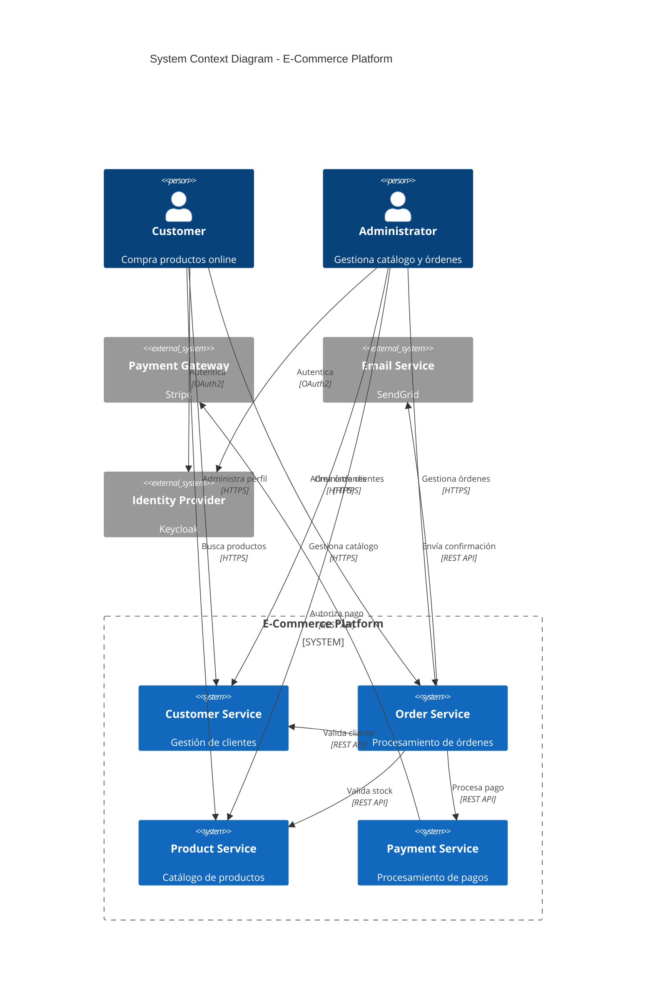
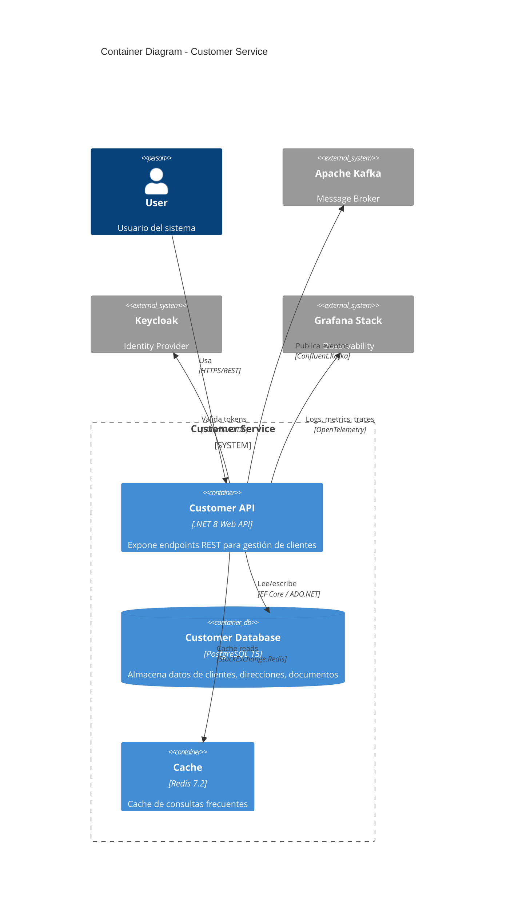
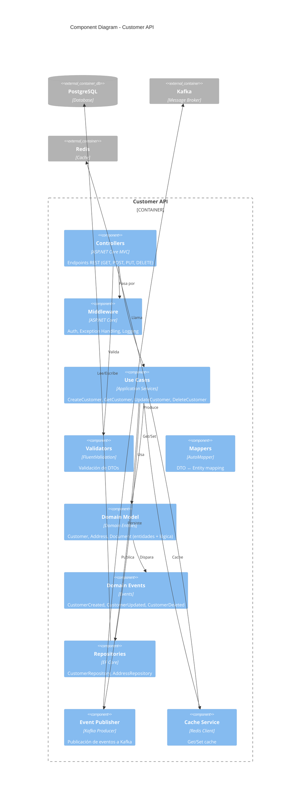

# C4 Model

## Contexto

Este estándar define cómo crear diagramas de arquitectura usando el C4 Model, un enfoque jerárquico con 4 niveles de abstracción. Complementa el estándar [arc42](./arc42.md) para documentación arquitectónica completa.

---

## Stack Tecnológico

| Componente            | Tecnología | Versión | Uso                               |
| --------------------- | ---------- | ------- | --------------------------------- |
| **Diagramas**         | Mermaid    | 10.0+   | C4 diagrams as code (preferido)   |
| **Diagramas**         | PlantUML   | 1.2024+ | C4 diagrams as code (alternativo) |
| **Generación Sitio**  | Docusaurus | 3.0+    | Renderizado de diagramas          |
| **Control Versiones** | GitHub     | -       | Versionamiento as code            |

---

## ¿Qué es el Modelo C4?

Enfoque para visualizar arquitectura de software mediante diagramas jerárquicos en 4 niveles de abstracción, similar a hacer "zoom" en un mapa.

**Niveles:**

1. **Context (C1)**: Sistema en su entorno, usuarios, sistemas externos
2. **Container (C2)**: Aplicaciones y data stores dentro del sistema
3. **Component (C3)**: Componentes dentro de un contenedor
4. **Code (C4)**: Clases y métodos (opcional, generado por IDE)

**Propósito:** Comunicar arquitectura a diferentes audiencias con el nivel apropiado de detalle.

**Beneficios:**
✅ Visualización clara y progresiva
✅ Diferentes niveles para diferentes stakeholders
✅ Complementa documentación textual
✅ Fácil mantenimiento (diagramas as code)

## C4 Level 1: Context Diagram



**Audiencia:** C-level, product managers, todos los stakeholders.

## C4 Level 2: Container Diagram



**Audiencia:** Arquitectos, líderes técnicos, devops.

## C4 Level 3: Component Diagram



**Audiencia:** Desarrolladores, arquitectos de software.

## C4 con PlantUML (alternativa)

```plantuml
@startuml C4_Context
!include https://raw.githubusercontent.com/plantuml-stdlib/C4-PlantUML/master/C4_Context.puml

LAYOUT_WITH_LEGEND()

title System Context - Customer Service

Person(customer, "Customer", "Usuario que usa el sistema")
Person(admin, "Administrator", "Administrador del sistema")

System(customerService, "Customer Service", "Gestión de clientes")

System_Ext(orderService, "Order Service", "Gestión de órdenes")
System_Ext(keycloak, "Keycloak", "Identity Provider")

Rel(customer, customerService, "Usa", "HTTPS/REST")
Rel(admin, customerService, "Administra", "HTTPS/REST")
Rel(orderService, customerService, "Valida cliente", "REST API")
Rel(customerService, keycloak, "Autentica", "OAuth2")

@enduml
```

---

## Implementación

```bash
# Crear carpeta para diagramas C4
mkdir -p docs/c4-diagrams

# Estructura recomendada
docs/c4-diagrams/
├── c1-context.md        # Context diagram del sistema completo
├── c2-containers.md     # Container diagrams por servicio
└── c3-components.md     # Component diagrams para módulos complejos
```

---

## Requisitos Técnicos

### MUST (Obligatorio)

- **MUST** incluir diagrama C4 Level 1 (Context) para cada sistema
- **MUST** incluir diagrama C4 Level 2 (Container) para cada servicio
- **MUST** usar Mermaid o PlantUML (diagramas as code)
- **MUST** mantener diagramas sincronizados con código
- **MUST** versionar diagramas en Git junto con el código

### SHOULD (Fuertemente recomendado)

- **SHOULD** incluir diagrama C4 Level 3 (Component) para módulos complejos
- **SHOULD** usar Mermaid para diagramas (mejor integración con Docusaurus)
- **SHOULD** incluir diagrama C1 en README del repositorio
- **SHOULD** referenciar los diagramas desde el arc42 sección 3 y 5

### MAY (Opcional)

- **MAY** usar C4 Level 4 (Code) para componentes críticos
- **MAY** incluir diagramas de deployment como extensión de C4 Level 2
- **MAY** generar diagramas automáticamente desde código con herramientas como Structurizr

### MUST NOT (Prohibido)

- **MUST NOT** crear diagramas binarios (Word, Visio) sin source code equivalente
- **MUST NOT** documentar diagramas solo en wikis externos sin source code
- **MUST NOT** mezclar niveles de abstracción en un mismo diagrama

---

## Referencias

- [C4 Model](https://c4model.com/)
- [Mermaid C4 Diagrams](https://mermaid.js.org/syntax/c4.html)
- [PlantUML C4](https://github.com/plantuml-stdlib/C4-PlantUML)
- [arc42](./arc42.md)
- [Gestión de ADRs](../gobierno/adr-management.md)

---

**Última actualización**: 18 de febrero de 2026
**Responsable**: Equipo de Arquitectura
