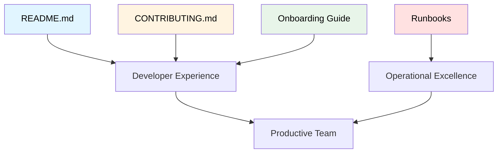

# Documentación Técnica

## Contexto

Este estándar define cómo crear documentación técnica operacional que facilite el uso, contribución y operación de servicios. Complementa el lineamiento [Documentación Técnica](../../lineamientos/desarrollo/03-documentacion-tecnica.md).

**Conceptos incluidos:**

- **README Standards** → Documentación principal del repositorio
- **Contributing Guides** → Guías para contribuir al proyecto
- **Onboarding Guides** → Guías para nuevos desarrolladores
- **Runbooks** → Procedimientos operacionales

---

## Stack Tecnológico

| Componente          | Tecnología | Versión | Uso                              |
| ------------------- | ---------- | ------- | -------------------------------- |
| **Documentación**   | Markdown   | -       | Formato de documentos            |
| **Hosting**         | GitHub     | -       | Repositorio y wikis              |
| **Generación Docs** | Docusaurus | 3.0+    | Documentación web centralizada   |
| **Diagramas**       | Mermaid    | 10.0+   | Diagramas as code                |
| **API Docs**        | Swagger UI | 5.0+    | Documentación interactiva de API |

---

## Conceptos Fundamentales

Este estándar cubre 4 tipos de documentación técnica:

### Índice de Conceptos

1. **README**: Primera impresión y guía rápida del repositorio
2. **CONTRIBUTING**: Cómo contribuir al proyecto
3. **Onboarding Guides**: Guías paso a paso para nuevos desarrolladores
4. **Runbooks**: Procedimientos operacionales para producción

### Relación entre Conceptos



---

## 1. README Standards

### ¿Qué es un README?

Documento principal del repositorio que proporciona overview del proyecto, cómo instalarlo, usarlo y contribuir.

**Secciones obligatorias:**

1. **Título y descripción**: Qué hace el servicio
2. **Badges**: Estado CI/CD, coverage, versión
3. **Prerequisitos**: Qué se necesita instalar
4. **Getting Started**: Cómo ejecutar localmente
5. **Uso**: Ejemplos de uso
6. **Testing**: Cómo ejecutar tests
7. **Deployment**: Cómo desplegar
8. **Tecnologías**: Stack tecnológico
9. **Contribuir**: Link a CONTRIBUTING.md
10. **Licencia**: Tipo de licencia

**Propósito:** Primera impresión, guía rápida para desarrolladores.

**Beneficios:**
✅ Onboarding rápido
✅ Autoservicio para desarrolladores
✅ Documentación actualizada
✅ Profesionalismo

### Template README Completo

````markdown
# Customer Service

[](https://github.com/talma/customer-service/actions)
[](https://codecov.io/gh/talma/customer-service)
[](LICENSE)
[](https://dotnet.microsoft.com/)

Servicio de gestión de clientes para la plataforma de e-commerce, responsable del ciclo de vida completo de clientes incluyendo registro, actualización, consulta y eliminación lógica.

## 📋 Tabla de Contenidos

- [Características](#características)
- [Prerequisitos](#prerequisitos)
- [Getting Started](#getting-started)
- [Uso](#uso)
- [Testing](#testing)
- [Deployment](#deployment)
- [Stack Tecnológico](#stack-tecnológico)
- [Arquitectura](#arquitectura)
- [Contribuir](#contribuir)
- [Licencia](#licencia)

## ✨ Características

- ✅ CRUD completo de clientes
- ✅ Validación de documentos (DNI, RUC, CE)
- ✅ Búsqueda por email, documento, nombre
- ✅ Paginación y filtros
- ✅ Events para sincronización con otros servicios
- ✅ Cache con Redis
- ✅ API versionada (v1)
- ✅ OpenAPI/Swagger documentation
- ✅ Health checks
- ✅ Observabilidad con OpenTelemetry

## 🔧 Prerequisitos

Antes de comenzar, asegúrate de tener instalado:

- [.NET 8 SDK](https://dotnet.microsoft.com/download/dotnet/8.0) - v8.0 o superior
- [Docker Desktop](https://www.docker.com/products/docker-desktop/) - v24.0 o superior
- [Git](https://git-scm.com/) - v2.40 o superior
- (Opcional) [Visual Studio 2022](https://visualstudio.microsoft.com/) o [Rider](https://www.jetbrains.com/rider/)

### Verificar instalación

```bash
dotnet --version  # Debe mostrar 8.0.x
docker --version  # Debe mostrar 24.0.x o superior
git --version     # Debe mostrar 2.40.x o superior
```
````

## 🚀 Getting Started

### 1. Clonar el repositorio

```bash
git clone https://github.com/talma/customer-service.git
cd customer-service
```

### 2. Configurar variables de entorno

```bash
# Copiar template de variables
cp .env.example .env

# Editar .env con tus configuraciones locales
nano .env
```

### 3. Iniciar dependencias con Docker Compose

```bash
# Iniciar PostgreSQL, Redis, Kafka
docker-compose up -d

# Verificar que contenedores estén corriendo
docker-compose ps
```

### 4. Aplicar migraciones de base de datos

```bash
# Desde el directorio del proyecto
dotnet ef database update --project src/CustomerService.Infrastructure
```

### 5. Ejecutar el servicio

```bash
# Opción 1: Con dotnet CLI
dotnet run --project src/CustomerService.Api

# Opción 2: Con docker-compose (incluye servicio)
docker-compose --profile app up

# El servicio estará disponible en:
# - API: http://localhost:8080
# - Swagger UI: http://localhost:8080/swagger
# - Health checks: http://localhost:8080/health
```

### 6. Verificar que funciona

```bash
# Health check
curl http://localhost:8080/health

# Crear un cliente
curl -X POST http://localhost:8080/api/v1/customers \
  -H "Content-Type: application/json" \
  -d '{
    "name": "John Doe",
    "email": "john@example.com",
    "phone": "+51987654321",
    "document": {
      "type": "DNI",
      "number": "12345678"
    }
  }'
```

## 📖 Uso

### Endpoints principales

#### Crear cliente

```bash
POST /api/v1/customers
Content-Type: application/json

{
  "name": "Jane Smith",
  "email": "jane@example.com",
  "phone": "+51987654321",
  "document": {
    "type": "DNI",
    "number": "87654321"
  }
}
```

#### Obtener cliente por ID

```bash
GET /api/v1/customers/{id}
```

#### Buscar clientes

```bash
GET /api/v1/customers?page=1&pageSize=10&searchTerm=jane
```

#### Actualizar cliente

```bash
PUT /api/v1/customers/{id}
Content-Type: application/json

{
  "name": "Jane Doe",
  "email": "jane.doe@example.com",
  "phone": "+51999999999"
}
```

#### Eliminar cliente (soft delete)

```bash
DELETE /api/v1/customers/{id}
```

### Swagger UI

Documentación interactiva disponible en: http://localhost:8080/swagger

## 🧪 Testing

### Unit Tests

```bash
# Ejecutar todos los tests
dotnet test

# Ejecutar tests con coverage
dotnet test /p:CollectCoverage=true /p:CoverletOutputFormat=opencover

# Ver reporte de coverage
dotnet tool install -g dotnet-reportgenerator-globaltool
reportgenerator -reports:coverage.opencover.xml -targetdir:coverage-report
open coverage-report/index.html
```

### Integration Tests

```bash
# Los integration tests usan Testcontainers (arrancan PostgreSQL automáticamente)
dotnet test --filter "Category=Integration"
```

### Contract Tests

```bash
# Verificar que cambios no rompen contratos
dotnet test --filter "Category=Contract"
```

## 🚢 Deployment

### Build Docker Image

```bash
# Build imagen
docker build -t customer-service:latest .

# Tag para registry
docker tag customer-service:latest ghcr.io/talma/customer-service:1.0.0

# Push a GitHub Container Registry
docker push ghcr.io/talma/customer-service:1.0.0
```

### Deploy a AWS ECS

```bash
# Via Terraform
cd terraform/
terraform init
terraform plan -var-file=environments/production.tfvars
terraform apply -var-file=environments/production.tfvars

# Via GitHub Actions (recomendado)
# Push a main → auto-deploy a dev
# Create tag v1.0.0 → auto-deploy a staging/production
git tag -a v1.0.0 -m "Release 1.0.0"
git push origin v1.0.0
```

## 🛠 Stack Tecnológico

### Backend

- **.NET 8** - Framework principal
- **ASP.NET Core** - Web API
- **Entity Framework Core 8.0** - ORM
- **FluentValidation 11.0** - Validaciones
- **Polly 8.0** - Resilience patterns

### Bases de Datos

- **PostgreSQL 15** - Base de datos principal
- **Redis 7.2** - Cache

### Messaging

- **Apache Kafka 3.6** - Event streaming (modo Kraft)

### Observabilidad

- **Serilog** - Structured logging
- **OpenTelemetry** - Traces y metrics
- **Grafana Stack** - Visualización (Loki, Mimir, Tempo)

### DevOps

- **Docker** - Contenedores
- **GitHub Actions** - CI/CD
- **Terraform** - Infrastructure as Code
- **AWS ECS Fargate** - Hosting

## 🏗 Arquitectura

### Clean Architecture Layers

```
┌─────────────────────────────────────┐
│         API Layer (ASP.NET Core)    │
│  Controllers, Middleware, Startup   │
└─────────────────────────────────────┘
              ↓
┌─────────────────────────────────────┐
│      Application Layer              │
│  Use Cases, DTOs, Validators        │
└─────────────────────────────────────┘
              ↓
┌─────────────────────────────────────┐
│       Domain Layer                  │
│  Entities, Value Objects, Events    │
└─────────────────────────────────────┘
              ↑
┌─────────────────────────────────────┐
│    Infrastructure Layer             │
│  EF Core, Kafka, Redis, etc.        │
└─────────────────────────────────────┘
```

### Documentación completa

- [arc42 Architecture](docs/architecture/arc42.md)
- [Architecture Decision Records](docs/adrs/)
- [API Documentation](http://localhost:8080/swagger)

## 🤝 Contribuir

¡Contribuciones son bienvenidas! Por favor lee [CONTRIBUTING.md](CONTRIBUTING.md) para detalles sobre:

- Código de conducta
- Proceso de Pull Requests
- Estándares de código
- Convenciones de commits

## 📄 Licencia

Este proyecto está bajo la Licencia MIT - ver [LICENSE](LICENSE) para detalles.

## 📞 Contacto

- **Equipo**: Customer Team
- **Slack**: #customer-service
- **Email**: customer-team@talma.com

## 🔗 Links Útiles

- [Documentación Completa](https://docs.talma.com/customer-service)
- [Jira Board](https://talma.atlassian.net/browse/CUST)
- [Grafana Dashboard](https://grafana.talma.com/d/customer-service)
- [Runbooks](docs/runbooks/)

---

**Última actualización**: 2026-02-18

````

### Badges Recomendados

```markdown
<!-- Build Status -->
[](https://github.com/{org}/{repo}/actions)

<!-- Test Coverage -->
[](https://codecov.io/gh/{org}/{repo})

<!-- License -->
[](LICENSE)

<!-- Version -->
[](https://github.com/{org}/{repo}/releases)

<!-- Language -->
[](https://dotnet.microsoft.com/)

<!-- Security -->
[](https://sonarcloud.io/dashboard?id={key})
````

---

## 2. Contributing Guides

### ¿Qué es un Contributing Guide?

Documento que explica cómo contribuir al proyecto, incluyendo workflow, estándares y convenciones.

**Secciones típicas:**

1. **Código de Conducta**: Comportamiento esperado
2. **Cómo contribuir**: Proceso general
3. **Reportar bugs**: Template de bug reports
4. **Solicitar features**: Template de feature requests
5. **Pull Requests**: Proceso de PRs
6. **Estándares de código**: Convenciones
7. **Testing**: Requisitos de tests
8. **Commits**: Conventional commits

**Propósito:** Facilitar contribuciones externas e internas consistentes.

**Beneficios:**
✅ Contribuciones consistentes
✅ Menos fricción para contribuir
✅ Calidad mantenida
✅ Proceso claro

### Template CONTRIBUTING.md

````markdown
# Contributing to Customer Service

¡Gracias por considerar contribuir a Customer Service! 🎉

## 📋 Tabla de Contenidos

- [Código de Conducta](#código-de-conducta)
- [Cómo Puedo Contribuir](#cómo-puedo-contribuir)
- [Proceso de Development](#proceso-de-development)
- [Pull Requests](#pull-requests)
- [Estándares de Código](#estándares-de-código)
- [Guía de Testing](#guía-de-testing octocat)
- [Convenciones de Commits](#convenciones-de-commits)

## 📜 Código de Conducta

Este proyecto adhiere al [Contributor Covenant Code of Conduct](CODE_OF_CONDUCT.md). Al participar, se espera que mantengas este código.

### Resumen

- **Sé respetuoso**: Trata a todos con respeto
- **Sé colaborativo**: Trabaja constructivamente con otros
- **Sé inclusivo**: Da la bienvenida a diferentes perspectivas
- **Reporta problemas**: Si ves comportamiento inapropiado, repórtalo

## 🤔 Cómo Puedo Contribuir

### Reportar Bugs

Si encuentras un bug, por favor crea un issue con:

**Template de Bug Report:**

```markdown
**Descripción del Bug**
Descripción clara y concisa del bug.

**Pasos para Reproducir**

1. Ir a '...'
2. Hacer click en '...'
3. Ver error

**Comportamiento Esperado**
Qué esperabas que sucediera.

**Screenshots**
Si aplica, agrega screenshots.

**Ambiente**

- OS: [ej. Windows 11]
- .NET Version: [ej. 8.0.2]
- Version: [ej. 1.2.3]

**Contexto Adicional**
Cualquier otra información relevante.
```
````

### Solicitar Features

Para nuevas features, crea un issue con:

**Template de Feature Request:**

```markdown
**¿Tu feature request está relacionada con un problema?**
Descripción clara del problema. Ej. "Siempre me frustra cuando [...]"

**Describe la solución que te gustaría**
Descripción clara y concisa de lo que quieres que suceda.

**Describe alternativas que consideraste**
Descripción de soluciones o features alternativas.

**Contexto adicional**
Screenshots, mockups, o información adicional.
```

## 🔨 Proceso de Development

### 1. Setup del Ambiente

```bash
# Fork el repositorio (si eres externo)
# Clonar
git clone https://github.com/talma/customer-service.git
cd customer-service

# Instalar dependencias
dotnet restore

# Configurar environment
cp .env.example .env

# Iniciar dependencias
docker-compose up -d

# Aplicar migraciones
dotnet ef database update
```

### 2. Crear Feature Branch

```bash
# Desde main actualizado
git checkout main
git pull origin main

# Crear branch con naming convention
git checkout -b feature/JIRA-123-add-email-validation
```

### 3. Desarrollar

- Escribe código siguiendo [estándares](#estándares-de-código)
- Agrega tests (coverage > 80%)
- Ejecuta tests localmente
- Commit con [conventional commits](#convenciones-de-commits)

### 4. Push y PR

```bash
# Push a tu fork/branch
git push origin feature/JIRA-123-add-email-validation

# Crear Pull Request en GitHub
# Completar template de PR
```

## 🔄 Pull Requests

### Checklist antes de enviar PR

- [ ] Mi código sigue el estilo del proyecto
- [ ] He realizado self-review de mi código
- [ ] He comentado código complejo si es necesario
- [ ] He actualizado la documentación
- [ ] Mis cambios no generan nuevos warnings
- [ ] He agregado tests que validan mi fix/feature
- [ ] Tests nuevos y existentes pasan localmente
- [ ] He verificado que no hay secretos expuestos
- [ ] He seguido conventional commits
- [ ] He actualizado CHANGELOG.md (si aplica)

### Template de Pull Request

```markdown
## Descripción

Descripción clara de los cambios realizados.

## Tipo de cambio

- [ ] Bug fix (cambio que corrige un issue)
- [ ] New feature (cambio que agrega funcionalidad)
- [ ] Breaking change (fix o feature que causa que funcionalidad existente no funcione como esperado)
- [ ] Documentation update

## Referencias

- Fixes: JIRA-123
- Related: JIRA-456

## ¿Cómo se ha testeado?

Descripción de tests ejecutados.

## Screenshots (si aplica)

Para cambios de UI.

## Checklist

- [ ] Tests pass localmente
- [ ] Code coverage > 80%
- [ ] Documentation updated
- [ ] Self-reviewed
```

### Proceso de Review

1. **Automated Checks**: CI/CD ejecuta builds, tests, security scans
2. **Code Review**: Al menos 1 aprobación requerida
3. **Address Comments**: Resolver todos los comentarios
4. **Merge**: Squash and merge (generalmente)

## 💻 Estándares de Código

### Naming Conventions

```csharp
// Clases: PascalCase
public class CustomerService { }

// Interfaces: I + PascalCase
public interface ICustomerRepository { }

// Métodos: PascalCase, async → Async suffix
public async Task<Customer> GetCustomerAsync(Guid id) { }

// Properties: PascalCase
public string Name { get; set; }

// Private fields: _camelCase
private readonly ILogger _logger;

// Constants: PascalCase
private const int MaxRetries = 3;

// Local variables y parameters: camelCase
var customerId = Guid.NewGuid();
public void ProcessCustomer(string customerId) { }
```

### Code Style

- **Indentación**: 4 espacios
- **Llaves**: Estilo C# (nueva línea)
- **Line length**: Max 120 caracteres
- **Using directives**: Fuera de namespace, ordenados alfabéticamente
- **var**: Usar cuando tipo es obvio
- **Nullable**: Habilitar nullable reference types

### EditorConfig

El proyecto incluye `.editorconfig` que enforcea estilo automáticamente.

```bash
# Verificar formato
dotnet format --verify-no-changes

# Auto-formatear
dotnet format
```

## 🧪 Guía de Testing

### Coverage Mínimo

- **Línea coverage**: > 80%
- **Branch coverage**: > 75%
- **Unit tests**: Para toda lógica de negocio
- **Integration tests**: Para repositorios y external calls

### Estructura de Tests

```csharp
// Naming: [Method]_[Scenario]_[ExpectedResult]
[Fact]
public void CreateCustomer_WithValidData_ReturnsCustomer()
{
    // Arrange
    var request = new CreateCustomerRequest
    {
        Name = "John Doe",
        Email = "john@example.com"
    };

    // Act
    var result = _useCase.Execute(request);

    // Assert
    result.Should().NotBeNull();
    result.Name.Should().Be("John Doe");
}
```

### Testing Tools

- **xUnit**: Framework de testing
- **Moq**: Mocking
- **FluentAssertions**: Assertions legibles
- **Testcontainers**: Integration tests con PostgreSQL real

### Ejecutar Tests

```bash
# Todos los tests
dotnet test

# Solo unit tests
dotnet test --filter "Category=Unit"

# Con coverage
dotnet test /p:CollectCoverage=true /p:CoverletOutputFormat=opencover
```

## 📝 Convenciones de Commits

Usamos [Conventional Commits](https://www.conventionalcommits.org/).

### Formato

```
<type>(<scope>): <subject>

<body>

<footer>
```

### Tipos

- **feat**: Nueva funcionalidad
- **fix**: Bug fix
- **docs**: Solo cambios en documentación
- **style**: Formato (espacios, puntos y coma, etc.)
- **refactor**: Refactorización sin cambio funcional
- **perf**: Mejora de performance
- **test**: Agregar o modificar tests
- **chore**: Mantenimiento (dependencies, build, etc.)
- **ci**: Cambios en CI/CD

### Ejemplos

```bash
# Feature simple
git commit -m "feat(customer): add email validation"

# Bug fix con detalles
git commit -m "fix(customer): prevent duplicate email registration

- Add unique constraint on email column
- Add proper error handling
- Add test for duplicate email scenario

Fixes: JIRA-456"

# Breaking change
git commit -m "feat!(api): change customer response format

BREAKING CHANGE: Customer API response now includes nested address object
instead of flat structure. Clients must update to handle new format.

Refs: JIRA-789"
```

## 🎯 Revisión de PRs

### Como Reviewer

- **Se constructivo**: Sugerencias, no órdenes
- **Explica el "por qué"**: No solo qué cambiar, sino por qué
- **Reconoce buen trabajo**: Comenta aspectos positivos
- **Aprueba cuando esté listo**: No busques perfección

### Como Author

- **Responde a comentarios**: Aclara o implementa sugerencias
- **No te lo tomes personal**: Feedback es sobre código, no sobre ti
- **Haz preguntas**: Si no entiendes un comentario, pregunta

## 🆘 ¿Necesitas Ayuda?

- **Slack**: #customer-service
- **Email**: customer-team@talma.com
- **Office Hours**: Martes 3-4pm talk with arquitecto

## 📚 Referencias

- [Clean Architecture](https://blog.cleancoder.com/uncle-bob/2012/08/13/the-clean-architecture.html)
- [.NET Coding Conventions](https://docs.microsoft.com/en-us/dotnet/csharp/fundamentals/coding-style/coding-conventions)
- [Conventional Commits](https://www.conventionalcommits.org/)

---

¡Gracias por contribuir! 🚀

````

---

## 3. Onboarding Guides

### ¿Qué es una Guía de Onboarding?

Documento paso a paso para que nuevos desarrolladores del equipo se pongan productivos rápidamente.

**Secciones típicas:**

1. **Bienvenida**: Introducción al equipo y proyecto
2. **Setup de ambiente**: Paso a paso para configurar máquina
3. **Arquitectura**: Overview técnico
4. **Workflows**: Cómo trabajamos día a día
5. **Herramientas**: Accesos y configuración
6. **Primeras tareas**: Tareas iniciales para aprender

**Propósito:** Acortar tiempo de ramp-up de nuevos miembros.

**Beneficios:**
✅ Onboarding más rápido
✅ Menos preguntas repetitivas
✅ Experiencia consistente
✅ Autonomía desde día 1

### Template Onboarding Guide

```markdown
# Onboarding Guide - Customer Service Team

¡Bienvenido al equipo de Customer Service! 🎉

Esta guía te ayudará a estar productivo en tu primer día/semana.

## 📅 Timeline

### Día 1 (Bienvenida y Setup)
- ✅ Completar setup de ambiente
- ✅ Ejecutar proyecto localmente
- ✅ Reunión con equipo (intro)
- ✅ Configurar herramientas

### Semana 1 (Contexto)
- ✅ Leer documentación arquitectónica
- ✅ Code walkthrough con mentor
- ✅ Resolver primera tarea (bug fix pequeño)
- ✅ Participar en daily standups

### Mes 1 (Autonomía)
- ✅ Implementar feature pequeña
- ✅ Participar en code reviews
- ✅ Presentar demo en sprint review
- ✅ Contribuir a documentación

## 👥 Conoce al Equipo

### Customer Service Team
- **Tech Lead**: Juan Pérez (@juanp) - Arquitectura, decisiones técnicas
- **Senior Dev**: María García (@mariag) - Mentora, code reviews
- **Dev**: Carlos Ruiz (@carlosr) - Features, testing
- **QA**: Ana Torres (@anat) - Testing, quality assurance

### Contactos Clave
- **Product Owner**: Luis Mendoza (@luism)
- **Arquitecto**: Roberto Silva (@robertos)
- **DevOps**: Laura Jiménez (@lauraj)

## 🛠 Setup del Ambiente (Día 1)

### 1. Herramientas Requeridas

#### Instalar Software

```bash
# 1. .NET 8 SDK
# Descargar desde: https://dotnet.microsoft.com/download/dotnet/8.0
dotnet --version  # Verificar instalación

# 2. Git
# Descargar desde: https://git-scm.com/
git --version

# 3. Docker Desktop
# Descargar desde: https://www.docker.com/products/docker-desktop/
docker --version

# 4. IDE (elegir uno)
# - Visual Studio 2022: https://visualstudio.microsoft.com/
# - Rider: https://www.jetbrains.com/rider/
# - VS Code: https://code.visualstudio.com/
````

#### Extensiones Recomendadas (VS Code)

- C# (Microsoft)
- C# Dev Kit
- Docker
- GitLens
- REST Client
- Markdown All in One
- SonarLint

### 2. Accesos y Configuración

#### GitHub

```bash
# 1. Solicitar acceso a organización GitHub
# Contactar: @devops-team en Slack #it-support

# 2. Configurar SSH key
ssh-keygen -t ed25519 -C "tu.email@talma.com"
cat ~/.ssh/id_ed25519.pub  # Copiar y agregar a GitHub

# 3. Verificar acceso
git clone git@github.com:talma/customer-service.git
```

#### AWS

```bash
# 1. Solicitar acceso IAM
# Contactar: @devops-team en Slack #aws-access

# 2. Configurar AWS CLI
aws configure
# AWS Access Key ID: [tu-access-key]
# AWS Secret Access Key: [tu-secret-key]
# Default region: us-east-1
# Default output format: json

# 3. Verificar acceso
aws sts get-caller-identity
```

#### Keycloak

```bash
# 1. Solicitar cuenta en Keycloak
# Contactar: @security-team en Slack #identity-access

# 2. URL: https://keycloak.talma.com
# 3. Configurar MFA
```

#### Herramientas Adicionales

- **Jira**: https://talma.atlassian.net - Solicitar acceso a board CUST
- **Slack**: Canales: #customer-service, #tech-general, #deployments
- **Grafana**: https://grafana.talma.com - Dashboards de observabilidad
- **SonarQube**: https://sonar.talma.com - Quality gates

### 3. Clonar y Ejecutar Proyecto

```bash
# 1. Clonar repositorio
git clone git@github.com:talma/customer-service.git
cd customer-service

# 2. Configurar environment
cp .env.example .env
# Editar .env con valores de desarrollo (ver #customer-service-credentials en Slack)

# 3. Iniciar dependencias
docker-compose up -d

# 4. Aplicar migraciones
dotnet ef database update --project src/CustomerService.Infrastructure

# 5. Restaurar packages
dotnet restore

# 6. Ejecutar proyecto
dotnet run --project src/CustomerService.Api

# 7. Verificar
curl http://localhost:8080/health  # Debe retornar "Healthy"
open http://localhost:8080/swagger  # Swagger UI
```

### 4. Ejecutar Tests

```bash
# Unit tests
dotnet test --filter "Category=Unit"

# Integration tests (usa Testcontainers, puede tardar la primera vez)
dotnet test --filter "Category=Integration"

# Todos los tests con coverage
dotnet test /p:CollectCoverage=true
```

## 🏗 Arquitectura del Proyecto

### Overview

Customer Service es un microservicio que gestiona el ciclo de vida de clientes.

**Responsabilidades:**

- CRUD de clientes
- Validación de documentos
- Búsqueda y filtrado
- Publicación de eventos de ciclo de vida

**NO es responsable de:**

- Procesamiento de órdenes (Order Service)
- Notificaciones (Notification Service)
- Autenticación (Keycloak)

### Clean Architecture Layers

```
CustomerService/
├── CustomerService.Api/           # API Layer (Controllers, Middleware)
├── CustomerService.Application/   # Application Layer (Use Cases, DTOs)
├── CustomerService.Domain/        # Domain Layer (Entities, Business Rules)
└── CustomerService.Infrastructure/ # Infrastructure (DB, Kafka, Redis)
```

### Tecnologías Clave

- **.NET 8**: Framework
- **PostgreSQL 15**: Base de datos principal
- **Redis 7.2**: Cache
- **Apache Kafka 3.6**: Events
- **Entity Framework Core**: ORM
- **FluentValidation**: Validaciones
- **Polly**: Resilience patterns
- **Serilog + OpenTelemetry**: Observabilidad

### Documentación Completa

- [arc42 Architecture](docs/architecture/arc42.md)
- [ADRs](docs/adrs/)
- [C4 Diagrams](docs/c4-diagrams/)

## 🔄 Workflows Diarios

### Daily Standup

- **Cuándo**: Lunes a Viernes 9:00 AM
- **Dónde**: Slack Huddle en #customer-service
- **Duración**: 15 minutos
- **Formato**: ¿Qué hice ayer? ¿Qué haré hoy? ¿Impedimentos?

### Sprint Planning

- **Cuándo**: Lunes cada 2 semanas, 10:00 AM
- **Duración**: 2 horas
- **Artefactos**: Jira board, backlog refinado

### Sprint Review & Retro

- **Cuándo**: Viernes cada 2 semanas, 3:00 PM
- **Review**: Demo de features (30 min)
- **Retro**: Retrospectiva (30 min)

### Code Reviews

- **Todos los PRs requieren 1 aprobación** mínimo
- **SLA de review**: 24 horas
- **Cómo solicitar review**: Tag a @customer-team en PR

### Deployment

- **Dev**: Auto-deploy al hacer merge a main
- **Staging**: Auto-deploy al crear tag `v*-rc*`
- **Production**: Manual approval después de tag `v*`

## 📚 Recursos de Aprendizaje

### Internos (LEER PRIMERO)

- [ ] [README.md](README.md)
- [ ] [CONTRIBUTING.md](CONTRIBUTING.md)
- [ ] [arc42 Architecture](docs/architecture/arc42.md)
- [ ] [ADR-001 a ADR-010](docs/adrs/)
- [ ] [Runbooks](docs/runbooks/)

### Clean Architecture

- [Clean Architecture by Uncle Bob](https://blog.cleancoder.com/uncle-bob/2012/08/13/the-clean-architecture.html)
- [Clean Architecture in .NET](https://www.youtube.com/watch?v=dK4Yb6-LxAk)

### Domain-Driven Design

- [DDD Fundamentals](https://www.pluralsight.com/courses/domain-driven-design-fundamentals)
- [Domain-Driven Design Distilled (Book)](https://www.amazon.com/Domain-Driven-Design-Distilled-Vaughn-Vernon/dp/0134434420)

### .NET y C#

- [.NET Documentation](https://docs.microsoft.com/en-us/dotnet/)
- [C# Language Reference](https://docs.microsoft.com/en-us/dotnet/csharp/)
- [ASP.NET Core Fundamentals](https://docs.microsoft.com/en-us/aspnet/core/fundamentals/)

## ✅ Primeras Tareas

### Semana 1

#### Tarea 1: Bug Fix Pequeño (Día 2-3)

**Objetivo**: Familiarizarte con codebase y workflow.

```bash
# 1. Buscar issue con label "good-first-issue" en Jira
# Ejemplo: CUST-101 "Validación de formato de email no acepta + en email"

# 2. Crear branch
git checkout -b bugfix/CUST-101-fix-email-validation

# 3. Implementar fix
# Archivo: src/CustomerService.Domain/ValueObjects/Email.cs

# 4. Agregar test
# Archivo: tests/CustomerService.UnitTests/Domain/EmailTests.cs

# 5. Commit y PR
git commit -m "fix(domain): accept + character in email validation"
git push origin bugfix/CUST-101-fix-email-validation

# 6. Crear PR y solicitar review a @mentor
```

#### Tarea 2: Mejorar Documentación (Día 4)

**Objetivo**: Contribuir y familiarizarte con docs.

- Encuentra algo confuso en README o onboarding guide
- Propón mejora o agrega clarificación
- Crea PR con cambio

### Semana 2

#### Tarea 3: Feature Pequeña (Día 6-10)

**Objetivo**: Implementar feature end-to-end.

```bash
# Ejemplo: CUST-150 "Agregar campo middle_name a Customer"

# Pasos:
# 1. Agregar propiedad en Domain entity
# 2. Agregar columna en DB (migration)
# 3. Actualizar DTOs
# 4. Actualizar validadores
# 5. Tests (unit + integration)
# 6. Update API documentation
# 7. PR y review este
```

## 🆘 ¿Bloqueado?

### Checklist de Troubleshooting

- [ ] ¿Leíste el README?
- [ ] ¿Buscaste en Slack?
- [ ] ¿Revisaste logs?
- [ ] ¿Consultaste documentación oficial?

### Pedir Ayuda

1. **Slack #customer-service**: Para preguntas generales del proyecto
2. **Tu mentor**: Para preguntas específicas de código
3. **#tech-general**: Para preguntas técnicas generales
4. **#help-desk**: Para problemas de accesos/permisos

### Office Hours

- **Mentor**: Martes y Jueves 2-3pm (disponible para pair programming)
- **Tech Lead**: Miércoles 10-11am (para preguntas arquitectónicas)

## 🎓 Certificaciones Opcionales

Si quieres profundizar:

- **Microsoft Certified: Azure Developer Associate**
- **AWS Certified Developer - Associate**
- **.NET Foundation Courses** (gratis)

## 📝 Feedback

Tu feedback sobre este onboarding es valioso:

- **Después de Semana 1**: Completar [encuesta de onboarding](link)
- **Después de Mes 1**: Reunión 1-on-1 con Tech Lead

---

**¡Bienvenido al equipo! 🚀**

Si tienes alguna pregunta, no dudes en preguntar en #customer-service.

````

---

## 4. Runbooks

### ¿Qué es un Runbook?

Documento operacional con procedimientos paso a paso para diagnosticar y resolver problemas comunes en producción.

**Tipos de runbooks:**

1. **Incident Response**: Qué hacer cuando hay un incidente
2. **Troubleshooting**: Diagnosticar problemas específicos
3. **Maintenance**: Procedimientos de mantenimiento
4. **Deployment**: Procedimientos de despliegue
5. **Disaster Recovery**: Recuperación ante desastres

**Propósito:** Respuesta rápida y consistente a problemas operacionales.

**Beneficios:**
✅ Resolución más rápida de incidentes
✅ Menos dependencia de individuos
✅ Procedimientos documentados y testeados
✅ Onboarding operacional más rápido

### Template Runbook: Incident Response

```markdown
# Runbook: Customer API - High Error Rate

## Metadata

| Campo | Valor |
|-------|-------|
| **Service** | Customer API |
| **Severity** | SEV-2 (Alta) |
| **On-Call** | Customer Team |
| **Last Updated** | 2026-02-18 |
| **Version** | 1.2.0 |

---

## 🚨 Síntomas

### Alertas que Disparan

- `CustomerAPI_ErrorRate > 5%` (últimos 5 minutos)
- `CustomerAPI_P95Latency > 2000ms`
- `CustomerAPI_5xx_Errors > 50` (últimos 5 minutos)

### Impacto en Usuarios

- ❌ Usuarios no pueden crear/actualizar clientes
- ❌ Búsqueda de clientes lenta o fallando
- ⚠️ Otros servicios que dependen de Customer API afectados

### Grafana Dashboard

https://grafana.talma.com/d/customer-api-overview

---

## 🔍 Triage (Primeros 5 minutos)

### 1. Verificar si es incidente real

```bash
# Verificar health del servicio
curl -I https://customer-api.talma.com/health

# Respuesta esperada: 200 OK
# Si 503 Service Unavailable → Servicio caído
````

### 2. Verificar alcance

- **1 instancia o todas?**
  - Ir a AWS ECS Console → customer-service-prod cluster
  - Ver si todas las tasks son unhealthy

- **1 región o múltiples?**
  - Verificar si alertas solo en us-east-1 o también otras regiones

- **Solo Customer API o otros servicios también?**
  - Revisar Grafana dashboard general

### 3. Check Recent Changes

```bash
# Ver últimos deploys
aws ecs describe-services \
  --cluster customer-service-prod \
  --services customer-api \
  --query 'services[0].deployments' \
  --region us-east-1

# Ver últimos commits en main
gh api repos/talma/customer-service/commits \
  --jq '.[0:5] | .[] | {date:.commit.author.date, message:.commit.message}'
```

### 4. Declarar Incidente

Si error rate > 10% o P95 > 3s:

```bash
# Crear incidente en Slack
/incident declare Customer API High Error Rate

# Página on-call si fuera de horario
@pagerduty-customer-team
```

---

## 🔧 Diagnóstico (Siguientes 10-15 minutos)

### Paso 1: Revisar Logs

```bash
# Logs de errores últimos 15 minutos
aws logs filter-log-events \
  --log-group-name /ecs/customer-service-prod \
  --start-time $(date -u -d '15 minutes ago' +%s)000 \
  --filter-pattern '{ $.level = "Error" }' \
  --limit 50 \
  --region us-east-1 | jq '.events[].message' | jq -s '.'

# Alternativamente, en Grafana Loki:
# Query: {service="customer-api", environment="production"} |= "error" | json
```

**Patrones comunes:**

- **"Connection pool exhausted"** → Ver [Paso 2.1](#21-database-connection-issues)
- **"Kafka broker not available"** → Ver [Paso 2.2](#22-kafka-issues)
- **"Redis timeout"** → Ver [Paso 2.3](#23-¿redis-cache-issues)
- **"JWT validation failed"** → Ver [Paso 2.4](#24-authentication-issues)

### Paso 2: Diagnosticar Causa Raíz

#### 2.1. Database Connection Issues

```bash
# Verificar RDS instance
aws rds describe-db-instances \
  --db-instance-identifier customer-db-prod \
  --query 'DBInstances[0].{Status:DBInstanceStatus,CPU:CPUUtilization}' \
  --region us-east-1

# Check connection count
aws cloudwatch get-metric-statistics \
  --namespace AWS/RDS \
  --metric-name DatabaseConnections \
  --start-time $(date -u -d '30 minutes ago' +%Y-%m-%dT%H:%M:%S) \
  --end-time $(date -u +%Y-%m-%dT%H:%M:%S) \
  --period 300 \
  --statistics Maximum \
  --dimensions Name=DBInstanceIdentifier,Value=customer-db-prod \
  --region us-east-1
```

**Si conexiones cerca del máximo (100):**

```bash
# Escalar RDS instance temporalmente
aws rds modify-db-instance \
  --db-instance-identifier customer-db-prod \
  --db-instance-class db.r6g.2xlarge \  # Upgrade from db.r6g.large
  --apply-immediately \
  --region us-east-1

# O reiniciar instancias de ECS para reset connection pool
aws ecs update-service \
  --cluster customer-service-prod \
  --service customer-api \
  --force-new-deployment \
  --region us-east-1
```

#### 2.2. Kafka Issues

```bash
# Check Kafka broker health
# SSH a alguno de los brokers
ssh kafka-broker-1.internal.talma.com

# Ver logs de Kafka
tail -f /var/log/kafka/server.log | grep ERROR

# Ver consumer lag
kafka-consumer-groups.sh \
  --bootstrap-server localhost:9092 \
  --describe \
  --group customer-service-consumer
```

**Si Kafka broker caído:**

- Contactar @platform-team en #kafka-support
- Mientras tanto, deshabilitar publicación de eventos:

```bash
# Setear feature flag para deshabilitar Kafka
aws ssm put-parameter \
  --name "/customer-service/prod/features/enable-event-publishing" \
  --value "false" \
  --type String \
  --overwrite \
  --region us-east-1

# Reiniciar servicio para aplicar cambio
aws ecs update-service \
  --cluster customer-service-prod \
  --service customer-api \
  --force-new-deployment \
  --region us-east-1
```

#### 2.3. Redis Cache Issues

```bash
# Check ElastiCache Redis
aws elasticache describe-cache-clusters \
  --cache-cluster-id customer-redis-prod \
  --show-cache-node-info \
  --region us-east-1

# Ver métricas de Redis
aws cloudwatch get-metric-statistics \
  --namespace AWS/ElastiCache \
  --metric-name CPUUtilization \
  --start-time $(date -u -d '30 minutes ago' +%Y-%m-%dT%H:%M:%S) \
  --end-time $(date -u +%Y-%m-%dT%H:%M:%S) \
  --period 300 \
  --statistics Average \
  --dimensions Name=CacheClusterId,Value=customer-redis-prod \
  --region us-east-1
```

**Si Redis no responde:**

```bash
# Deshabilitar cache temporalmente
aws ssm put-parameter \
  --name "/customer-service/prod/features/enable-cache" \
  --value "false" \
  --type String \
  --overwrite \
  --region us-east-1

# Reiniciar servicio
aws ecs update-service \
  --cluster customer-service-prod \
  --service customer-api \
  --force-new-deployment \
  --region us-east-1

# Nota: Performance degradará pero servicio seguirá funcionando
```

#### 2.4. Authentication Issues

```bash
# Verificar Keycloak
curl -I https://keycloak.talma.com/health

# Si Keycloak caído, verificar con @security-team

# Mientras tanto, logs deberían mostrar:
# "Unable to validate JWT: Authority is unreachable"
```

---

## 🛠 Mitigación (Acción Inmediata)

### Opción 1: Rollback a Versión Anterior (Más Seguro)

```bash
# 1. Identificar última versión estable
aws ecs describe-services \
  --cluster customer-service-prod \
  --services customer-api \
  --query 'services[0].deployments' \
  --region us-east-1

# 2. Rollback manualmente
# Ir a AWS ECS Console → customer-service-prod → customer-api
# → Update Service → Revision: previous stable revision

# O via Terraform:
cd terraform/environments/production
git checkout <previous-stable-commit>
terraform apply -auto-approve

# 3. Monitorear deployment
aws ecs wait services-stable \
  --cluster customer-service-prod \
  --services customer-api \
  --region us-east-1
```

### Opción 2: Escalar Horizontalmente

```bash
# Si issue es de capacidad, escalar temporalmente
aws ecs update-service \
  --cluster customer-service-prod \
  --service customer-api \
  --desired-count 10 \  # De 3 a 10 instances
  --region us-east-1

# Monitorear si error rate baja
```

### Opción 3: Feature Flag para Deshabilitar Funcionalidad Problemática

```bash
# Ejemplo: Si solo endpoint /customers/search falla
aws ssm put-parameter \
  --name "/customer-service/prod/features/enable-advanced-search" \
  --value "false" \
  --type String \
  --overwrite \
  --region us-east-1

# Reiniciar
aws ecs update-service \
  --cluster customer-service-prod \
  --service customer-api \
  --force-new-deployment \
  --region us-east-1
```

---

## ✅ Verificación (Post-Mitigación)

### 1. Verificar Métricas

Esperar 5-10 minutos y verificar en Grafana:

- ✅ Error Rate < 1%
- ✅ P95 Latency < 200ms
- ✅ 5xx Errors < 5/min

### 2. Smoke Tests

```bash
# Test crítico de funcionalidad
curl -X POST https://customer-api.talma.com/api/v1/customers \
  -H "Authorization: Bearer $TOKEN" \
  -H "Content-Type: application/json" \
  -d '{
    "name": "Smoke Test",
    "email": "smoketest@example.com",
    "document": {
      "type": "DNI",
      "number": "99999999"
    }
  }'

# Debe retornar 201 Created
```

### 3. Comunicar Resolución

```bash
# En canal de incidente de Slack
/incident update Mitigated. Rolled back to version 1.2.3.
Error rate back to normal (<1%). Monitoring for 30 minutes before closing.
```

---

## 📊 Post-Mortem

Después de resolver incidente:

### 1. Crear Issue de Post-Mortem

```bash
gh issue create \
  --title "[Post-Mortem] Customer API High Error Rate - 2026-02-18" \
  --label "postmortem" \
  --assignee @tech-lead \
  --body "
## Incident Summary
- **Date**: 2026-02-18 14:30 UTC
- **Duration**: 45 minutes
- **Severity**: SEV-2

## Timeline
- 14:30: Alert triggered
- 14:35: On-call responded
- 14:45: Root cause identified (DB connection exhaustion)
- 15:00: Mitigated (rolled back deployment)
- 15:15: Verified resolution

## Root Cause
[TBD - To be filled after analysis]

## Action Items
- [ ] Increase DB connection pool limits
- [ ] Add circuit breaker for DB connections
- [ ] Improve monitoring alerts
- [ ] Update runbook with learnings
"
```

### 2. Agenda Post-Mortem Meeting

- **Cuándo**: Dentro de 48 horas
- **Quién**: Equipo involucrado + Tech Lead + Arquitecto
- **Duración**: 1 hora
- **Resultado**: Post-mortem document con acción items

---

## 📞 Escalation

### Nivel 1: On-Call Engineer (tú)

- Diagnosticar y mitigar según runbook
- Tiempo máximo:30 minutos antes de escalar

### Nivel 2: Tech Lead

- Si no puedes resolver en 30 min
- Para decisiones que requieren cambios significativos
- Contacto: @tech-lead-customer en Slack (#customer-service), Tel: +51-XXX-XXX-XXX

### Nivel 3: Platform Team

- Para issues de infraestructura (Kafka, RDS, networking)
- Contacto: @platform-team en Slack (#platform-support)

### Nivel 4: Arquitecto

- Para decisiones arquitectónicas críticas
- Contacto: @arquitecto en Slack, Tel: +51-YYY-YYY-YYY

---

## 🔗 Referencias

- **Grafana Dashboard**: https://grafana.talma.com/d/customer-api-overview
- **AWS ECS Console**: https://console.aws.amazon.com/ecs/home?region=us-east-1#/clusters/customer-service-prod
- **Jira Board**: https://talma.atlassian.net/browse/CUST
- **Architecture Docs**: [arc42](../architecture/arc42.md)
- **Otros Runbooks**: [Index](README.md)

---

**Versión**: 1.2.0
**Última Actualización**: 2026-02-18
**Próxima Revisión**: 2026-05-18 (cada 3 meses)

```

### Organización de Runbooks

```

docs/runbooks/
├── README.md # Índice de runbooks
├── incident-response/
│ ├── high-error-rate.md
│ ├── service-down.md
│ ├── high-latency.md
│ └── database-connection-exhaustion.md
├── troubleshooting/
│ ├── kafka-consumer-lag.md
│ ├── redis-cache-misses.md
│ ├── authentication-failures.md
│ └── memory-leaks.md
├── maintenance/
│ ├── database-maintenance-window.md
│ ├── scaling-for-high-traffic.md
│ └── certificate-renewal.md
├── deployment/
│ ├── production-deployment.md
│ ├── rollback-procedure.md
│ └── blue-green-deployment.md
└── disaster-recovery/
├── database-restore.md
├── region-failover.md
└── complete-service-recovery.md

````

---

## Implementación Integrada

### Setup Completo de Documentación Técnica

```bash
# 1. Estructura de documentación
mkdir -p docs/{runbooks/{incident-response,troubleshooting,maintenance,deployment,disaster-recovery},guides}

# 2. Crear README.md principal
# (usar template mostrado anteriormente)

# 3. Crear CONTRIBUTING.md
# (usar template mostrado anteriormente)

# 4. Crear onboarding guide
cat > docs/guides/onboarding.md << 'EOF'
# (usar template mostrado anteriormente)
EOF

# 5. Crear primer runbook
cat > docs/runbooks/incident-response/service-down.md << 'EOF'
# (usar template de runbook adaptado)
EOF

# 6. Crear índice de runbooks
cat > docs/runbooks/README.md << 'EOF'
# Runbooks - Customer Service

## Incident Response
- [High Error Rate](incident-response/high-error-rate.md)
- [Service Down](incident-response/service-down.md)
- [High Latency](incident-response/high-latency.md)

## Troubleshooting
- [Kafka Consumer Lag](troubleshooting/kafka-consumer-lag.md)
- [Redis Cache Issues](troubleshooting/redis-cache-misses.md)

## Maintenance
- [Database Maintenance](maintenance/database-maintenance-window.md)
- [Scaling for High Traffic](maintenance/scaling-for-high-traffic.md)

## Deployment
- [Production Deployment](deployment/production-deployment.md)
- [Rollback Procedure](deployment/rollback-procedure.md)

## Disaster Recovery
- [Database Restore](disaster-recovery/database-restore.md)
- [Region Failover](disaster-recovery/region-failover.md)
EOF

# 7. Agregar badges a README
# (ya incluidos en template)

# 8. Verificar con markdownlint
npm install -g markdownlint-cli
markdownlint '**/*.md'
````

---

## Requisitos Técnicos

### MUST (Obligatorio)

**README:**

- **MUST** incluir README.md en raíz de cada repositorio
- **MUST** incluir secciones: Descripción, Getting Started, Uso, Testing
- **MUST** incluir badges de build status y coverage
- **MUST** mantener README actualizado con cambios significativos

**CONTRIBUTING:**

- **MUST** incluir CONTRIBUTING.md en repositorios open source o con múltiples contribuidores
- **MUST** incluir proceso de PR y code review
- **MUST** incluir convenciones de código y commits
- **MUST** incluir cómo reportar bugs y solicitar features

**Onboarding:**

- **MUST** crear onboarding guide para equipos nuevos
- **MUST** incluir setup paso a paso del ambiente
- **MUST** incluir primeras tareas para nuevos miembros
- **MUST** actualizar basado en feedback de onboarding

**Runbooks:**

- **MUST** crear runbooks para incidentes críticos (SEV-1, SEV-2)
- **MUST** incluir síntomas, diagnóstico, mitigación y verificación
- **MUST** incluir escalation path
- **MUST** revisar runbooks cada 3 meses

### SHOULD (Fuertemente recomendado)

- **SHOULD** incluir video walkthroughs para setup inicial
- **SHOULD** incluir ejemplos de uso en README
- **SHOULD** incluir architecture diagram en README
- **SHOULD** incluir runbooks para todos los procedimientos operacionales frecuentes
- **SHOULD** testear runbooks en DR drills
- **SHOULD** incluir tiempo estimado de resolución en runbooks

### MAY (Opcional)

- **MAY** incluir FAQ section en README
- **MAY** incluir troubleshooting section en README
- **MAY** grabarciones de onboarding sessions
- **MAY** crear chatbot con runbooks automatizados
- **MAY** generar runbooks desde incidentes post-mortem

### MUST NOT (Prohibido)

- **MUST NOT** incluir secretos o credentials en README/docs
- **MUST NOT** documentar sin versionar en Git
- **MUST NOT** crear runbooks con pasos manual sin automatización posible
- **MUST NOT** dejar README desactualizado (actualizar con cada release)

---

## Referencias

**README Standards:**

- [Make a README](https://www.makeareadme.com/)
- [Awesome README](https://github.com/matiassingers/awesome-readme)

**Contributing Guides:**

- [GitHub Docs - Setting guidelines](https://docs.github.com/en/communities/setting-up-your-project-for-healthy-contributions/setting-guidelines-for-repository-contributors)
- [Contributor Covenant](https://www.contributor-covenant.org/)

**Runbooks:**

- [Google SRE Book - Runbooks](https://sre.google/sre-book/practical-alerting/)
- [PagerDuty Runbook Guide](https://www.pagerduty.com/resources/learn/what-is-a-runbook/)

**Relacionados:**

- [Architecture Documentation](./architecture-documentation.md)
- [Disaster Recovery](../operabilidad/disaster-recovery.md)

---

**Última actualización**: 18 de febrero de 2026
**Responsable**: Equipo de Arquitectura
