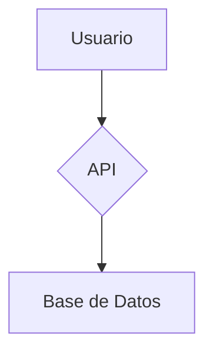

# Lineamientos para diagramas

## Herramientas recomendadas

- [Structurizr](https://structurizr.com/) para diagramas C4 (contexto, contenedores, componentes).
- [Mermaid](https://mermaid-js.github.io/mermaid/#/) para diagramas rápidos y embebidos.

## Recomendaciones

- Mantener diagramas actualizados con la realidad del sistema.
- Usar convenciones de colores y estilos para facilitar lectura.
- Documentar decisiones arquitectónicas relacionadas.
- Versionar diagramas junto al código fuente.

## Ejemplo básico Mermaid

