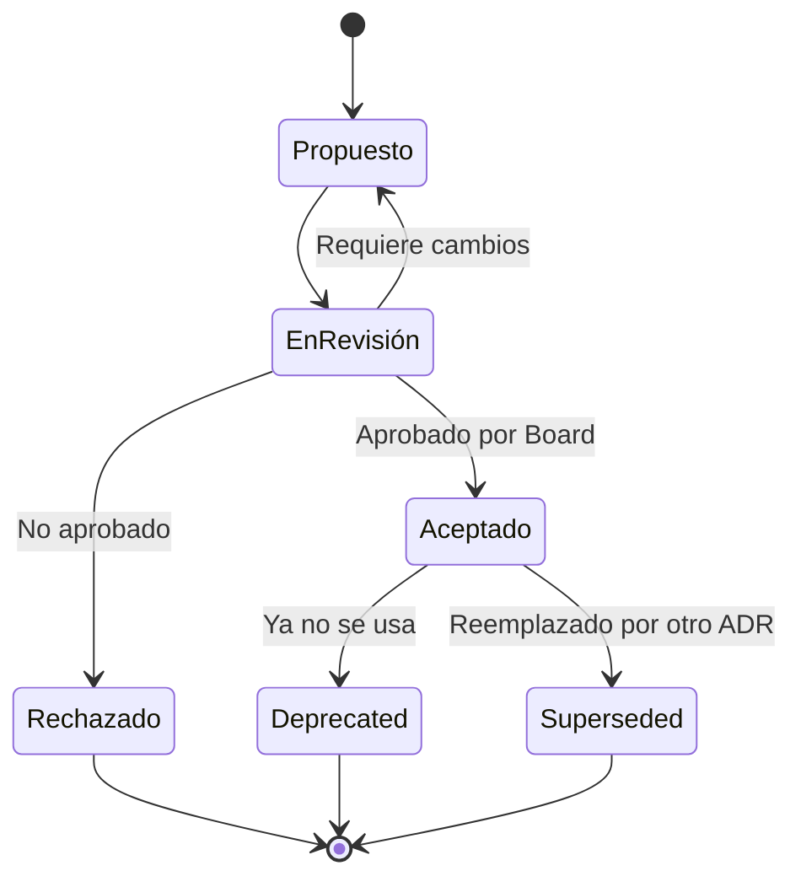

# Gestión de ADRs

## Contexto

Este estándar define cómo registrar, gestionar y versionar las decisiones arquitectónicas de la organización. Complementa el lineamiento [Decisiones Arquitectónicas](../../lineamientos/gobierno/decisiones-arquitectonicas.md).

**Conceptos incluidos:**

- **ADR Registry** → Registro centralizado y único de todas las decisiones arquitectónicas
- **ADR Lifecycle** → Ciclo de vida con estados claros desde draft hasta deprecación
- **ADR Versioning** → Estrategia de trazabilidad e inmutabilidad usando Git

---

## Stack Tecnológico

| Componente         | Tecnología     | Versión | Uso                                           |
| ------------------ | -------------- | ------- | --------------------------------------------- |
| **Versionamiento** | Git / GitHub   | Latest  | Source of truth para ADRs                     |
| **Documentación**  | Docusaurus     | 3.0+    | Portal de ADRs con índices navegables         |
| **CI/CD**          | GitHub Actions | Latest  | Validación automática de formato y numeración |
| **CLI**            | adr-tools      | Latest  | Gestión de ADRs desde terminal (opcional)     |

---

## ADR Registry

### ¿Qué es el ADR Registry?

Registro centralizado que mantiene el **índice completo** de todos los Architecture Decision Records, facilitando descubrimiento, trazabilidad y auditorías.

**Ubicación en el repositorio:**

```
docs/adrs/
├── README.md               # ADR Registry — índice principal
├── adr-0multi-tenancy.md
├── adr-002-aws-ecs-fargate.md
├── ...
└── adr-NNN-titulo.md
```

**Beneficios:**

- ✅ Single source of truth para decisiones arquitectónicas
- ✅ Descubrimiento fácil
- ✅ Evita re-discutir decisiones pasadas
- ✅ Onboarding más rápido

### Estructura del Registry (README.md)

El `README.md` del directorio `docs/adrs/` mantiene tres índices:

#### Índice por Número

```markdown
# Architecture Decision Records (ADRs)

| ADR                                       | Título                                  | Estado    | Fecha      | Equipo       |
| ----------------------------------------- | --------------------------------------- | --------- | ---------- | ------------ |
| [ADR-001](adr-0multi-tenancy.md)       | Estrategia Multi-Tenancy                | Aceptado  | 2024-03-15 | Platform     |
| [ADR-002](adr-002-aws-ecs-fargate.md)     | AWS ECS Fargate para Contenedores       | Aceptado  | 2024-03-20 | DevOps       |
| [ADR-003](adr-003-postgresql-database.md) | PostgreSQL como Base de Datos Principal | Aceptado  | 2024-04-10 | Architecture |
| [ADR-004](adr-004-github-actions.md)      | GitHub Actions para CI/CD               | Aceptado  | 2024-04-15 | DevOps       |
| [ADR-005](adr-005-keycloak-sso.md)        | Keycloak para SSO                       | Aceptado  | 2024-05-01 | Security     |
| [ADR-006](adr-006-apache-kafka.md)        | Apache Kafka para Event Streaming       | Aceptado  | 2024-05-10 | Platform     |
| [ADR-007](adr-007-grafana-stack.md)       | Grafana Stack para Observabilidad       | Aceptado  | 2024-06-01 | DevOps       |
| [ADR-008](adr-008-dotnet-8.md)            | .NET 8 como Framework Principal         | Aceptado  | 2024-06-15 | Architecture |
| [ADR-009](adr-009-terraform-iac.md)       | Terraform para Infrastructure as Code   | Aceptado  | 2024-07-01 | DevOps       |
| [ADR-010](adr-010-contract-testing.md)    | Contract Testing con Pact               | Propuesto | 2024-07-20 | QA           |
| [ADR-011](adr-011-redis-caching.md)       | Redis para Caching                      | Aceptado  | 2024-08-05 | Architecture |
| [ADR-012](adr-012-vault-secrets.md)       | HashiCorp Vault para Secrets            | Rechazado | 2024-08-10 | Security     |
| [ADR-013](adr-013-aws-secrets-manager.md) | AWS Secrets Manager (reemplaza ADR-012) | Aceptado  | 2024-08-25 | Security     |
| [ADR-014](adr-014-kong-api-gateway.md)    | Kong como API Gateway                   | Aceptado  | 2024-09-01 | Platform     |
```

#### Índice por Categoría

```markdown
## Infraestructura y Cloud

- [ADR-002: AWS ECS Fargate](adr-002-aws-ecs-fargate.md)
- [ADR-009: Terraform IaC](adr-009-terraform-iac.md)

## Bases de Datos y Persistencia

- [ADR-003: PostgreSQL](adr-003-postgresql-database.md)
- [ADR-011: Redis Caching](adr-011-redis-caching.md)

## Seguridad e Identidad

- [ADR-005: Keycloak SSO](adr-005-keycloak-sso.md)
- [ADR-013: AWS Secrets Manager](adr-013-aws-secrets-manager.md)

## Mensajería y Eventos

- [ADR-006: Apache Kafka](adr-006-apache-kafka.md)

## Observabilidad

- [ADR-007: Grafana Stack](adr-007-grafana-stack.md)

## Desarrollo y Frameworks

- [ADR-008: .NET 8](adr-008-dotnet-8.md)
```

#### Índice por Estado

```markdown
## Propuestos (En Revisión)

- [ADR-010: Contract Testing](adr-010-contract-testing.md)

## Aceptados (Activos)

- [ADR-001](adr-0multi-tenancy.md), [ADR-002](adr-002-aws-ecs-fargate.md), ...

## Rechazados

- [ADR-012: Vault Secrets](adr-012-vault-secrets.md) → Reemplazado por ADR-013

## Obsoletos / Reemplazados

- _(Ninguno actualmente)_
```

### Herramienta CLI (adr-tools)

```bash
# Instalar
brew install adr-tools  # macOS
npm install -g adr-tools

# Crear nuevo ADR
adr new "Implement GraphQL for Order Service"

# Listar ADRs
adr list

# Generar índice automático
adr generate toc > docs/adrs/README.md
```

---

## ADR Lifecycle

### ¿Qué es el ADR Lifecycle?

Ciclo de vida que define estados y transiciones de los ADRs desde su creación hasta su eventual deprecación o reemplazo.

**Diagrama de estados:**



### Descripción de Estados

| Estado          | Descripción              | Siguiente Acción            |
| --------------- | ------------------------ | --------------------------- |
| **Propuesto**   | Draft, aún no revisado   | Agendar architecture review |
| **En Revisión** | En proceso de review     | Esperar decisión del Board  |
| **Aceptado**    | Aprobado e implementado  | Seguir la decisión          |
| **Rechazado**   | No aprobado por el Board | Cerrado, no se implementa   |
| **Deprecated**  | Ya no se recomienda usar | Migrar a nueva solución     |
| **Superseded**  | Reemplazado por otro ADR | Seguir el nuevo ADR         |

### Estado en Frontmatter del ADR

```yaml
---
id: adr-015-postgres-read-replica
title: PostgreSQL Read Replica para Customer Service
status: Aceptado # Propuesto | EnRevisión | Aceptado | Rechazado | Deprecated | Superseded
date: 2026-02-25
decision-makers: Architecture Board
consulted: Customer Team, DevOps Team
informed: All Engineering
supersedes: "" # Si reemplaza un ADR anterior
superseded-by: "" # Si fue reemplazado por un ADR posterior
---
```

### Ejemplo de Transición

**ADR-012 rechazado → ADR-013 aceptado:**

```markdown
<!-- adr-012-vault-secrets.md -->

status: Rechazado
superseded-by: ADR-013

<!-- Motivo: AWS Secrets Manager preferido por integración nativa con AWS -->
```

```markdown
<!-- adr-013-aws-secrets-manager.md -->

status: Aceptado
supersedes: ADR-012
```

---

## ADR Versioning

### ¿Qué es ADR Versioning?

Estrategia de versionamiento y trazabilidad de ADRs usando Git.

**Principios:**

1. **Inmutabilidad** → ADRs aceptados no se editan; si cambian, se crea nuevo ADR
2. **Git como source of truth** → El historial de Git es la fuente de verdad de cambios
3. **Numeración secuencial** → Los números de ADRs nunca se reutilizan

### Workflow de Git para ADRs

```bash
# 1. Crear branch para el nuevo ADR
git checkout -b feature/adr-015-postgres-read-replica

# 2. Crear el archivo y hacer commit draft
git add docs/adrs/adr-015-postgres-read-replica.md
git commit -m "docs(adr): add ADR-015 PostgreSQL Read Replica (Propuesto)"
git push origin feature/adr-015-postgres-read-replica

# 3. Abrir PR para review del Board
gh pr create --title "ADR-015: PostgreSQL Read Replica" \
  --body "Architecture Decision Record para read replica en Customer Service"

# 4. Tras aprobación del Board → cambiar estado y hacer merge
git commit -m "docs(adr): approve ADR-015 (Aceptado)"
gh pr merge --squash
```

### Estrategia ante Cambios

**Minor update** (clarificación, no cambia la decisión):

```bash
git checkout -b fix/adr-015-clarify-lag-threshold
# Editar: agregar nota de "Última revisión" al pie del ADR
git commit -m "docs(adr): clarify ADR-015 replication lag threshold (5s)"
```

**Major change** (cambia la decisión):

```bash
# Crear NUEVO ADR que supersede el anterior
git checkout -b feature/adr-025-postgres-multi-region

# En adr-025:  supersedes: ADR-015
# En adr-015:  status: Superseded / superseded-by: ADR-025

git commit -m "docs(adr): add ADR-025 multi-region replica (supersedes ADR-015)"
git commit -m "docs(adr): mark ADR-015 as Superseded by ADR-025"
```

### Validación Automática en CI/CD

```yaml
# .github/workflows/validate-adrs.yml
name: Validate ADRs

on:
  pull_request:
    paths:
      - "docs/adrs/adr-*.md"

jobs:
  validate:
    runs-on: ubuntu-latest
    steps:
      - uses: actions/checkout@v4

      - name: Validate ADR Format
        run: |
          for file in docs/adrs/adr-*.md; do
            echo "Validating $file..."
            if ! grep -q "^---$" "$file"; then
              echo "ERROR: Missing frontmatter in $file"; exit 1
            fi
            for section in "## Contexto" "## Decisión" "## Consecuencias"; do
              if ! grep -q "$section" "$file"; then
                echo "ERROR: Missing '$section' in $file"; exit 1
              fi
            done
          done

      - name: Check Sequential Numbering
        run: |
          numbers=$(ls docs/adrs/adr-*.md | \
            sed 's/.*adr-\([0-9]*\)-.*/\1/' | sort -n)
          expected=1
          for num in $numbers; do
            num=$((10#$num))
            if [ $num -ne $expected ]; then
              echo "ERROR: Gap in ADR numbering. Expected $expected, got $num"; exit 1
            fi
            expected=$((expected + 1))
          done
          echo "✅ ADR numbering is sequential"
```

### Template de ADR

```markdown
---
id: adr-NNN-titulo
title: "[Título Descriptivo]"
status: Propuesto
date: YYYY-MM-DD
decision-makers: Architecture Board
consulted: "[Equipos consultados]"
informed: "[Stakeholders informados]"
---

# ADR-NNN: [Título]

## Contexto

[Describir el problema o situación que requiere una decisión]

## Decisión

[La decisión tomada]

## Alternativas Consideradas

### Opción 1: [Nombre]

**Pros**: [Pro 1]
**Contras**: [Contra 1]

### Opción 2: [Nombre]

**Pros**: [Pro 1]
**Contras**: [Contra 1]

## Consecuencias

### Positivas

- [Consecuencia positiva]

### Negativas

- [Consecuencia negativa]

## Implementación

[Plan de implementación]

## Referencias

- [Link 1]
```

---

## Requisitos Técnicos

### MUST (Obligatorio)

- **MUST** mantener ADR registry centralizado en `docs/adrs/README.md` con índices actualizados
- **MUST** numerar ADRs secuencialmente — nunca reutilizar números
- **MUST** versionar ADRs en Git con historial completo
- **MUST** incluir ADRs en el repositorio de documentación
- **MUST** definir estado explícito en cada ADR (Propuesto, Aceptado, Rechazado, etc.)
- **MUST** marcar ADRs obsoletos como `Deprecated` o `Superseded`

### SHOULD (Fuertemente recomendado)

- **SHOULD** automatizar validación de ADRs con GitHub Actions (formato + numeración)
- **SHOULD** usar adr-tools CLI para facilitar la gestión
- **SHOULD** publicar ADRs en portal Docusaurus con índices navegables
- **SHOULD** incluir diagramas C4 en ADRs significativos
- **SHOULD** mantener separados índices por número, categoría y estado

### MUST NOT (Prohibido)

- **MUST NOT** modificar ADRs con estado `Aceptado` — crear nuevo ADR si cambia la decisión
- **MUST NOT** reutilizar números de ADRs
- **MUST NOT** omitir Architecture Review para decisiones arquitectónicamente significativas

---

## Referencias

- [ADR original de Michael Nygard](https://cognitect.com/blog/2011/11/15/documenting-architecture-decisions) — propuesta original de ADRs
- [ADR GitHub Organization](https://adr.github.io/) — recursos y herramientas
- [adr-tools](https://github.com/npryce/adr-tools) — CLI para gestión de ADRs
- [Architecture Review y Checklist](./architecture-review-process.md) — proceso de revisión
- [Architecture Board y Auditorías](./architecture-board-audits.md) — gobierno operativo
- [Lineamiento de Decisiones Arquitectónicas](../../lineamientos/gobierno/decisiones-arquitectonicas.md) — lineamiento base
