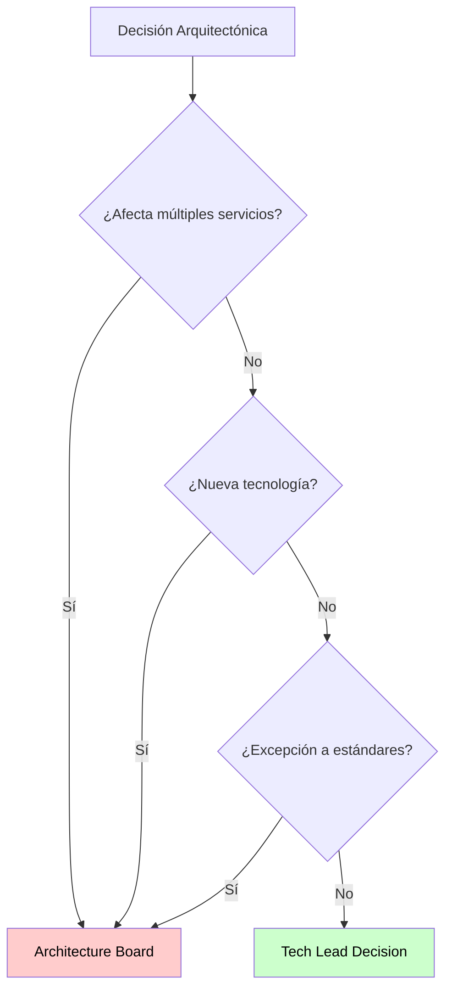
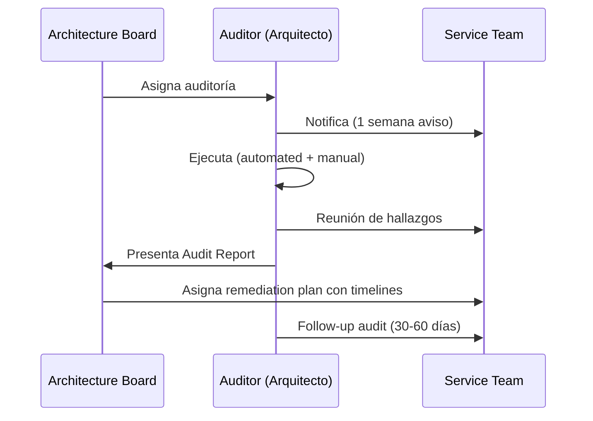

# Architecture Board y Audits

## Contexto

Este estándar define el gobierno operativo de la arquitectura: cómo toma decisiones el Architecture Board, cómo se verifican los servicios mediante auditorías y cómo se mejora continuamente el proceso. Complementa el lineamiento [Decisiones Arquitectónicas](../../lineamientos/gobierno/01-decisiones-arquitectonicas.md).

**Conceptos incluidos:**

- **Architecture Board** → Comité multidisciplinario para decisiones estratégicas de arquitectura
- **Architecture Audits** → Auditorías periódicas para verificar compliance con lineamientos y ADRs
- **Architecture Retrospectives** → Retrospectivas trimestrales para mejora continua del gobierno

---

## Stack Tecnológico

| Componente         | Tecnología     | Versión | Uso                                       |
| ------------------ | -------------- | ------- | ----------------------------------------- |
| **Diagramas**      | Mermaid        | Latest  | Diagramas de proceso y escalation         |
| **Documentación**  | Docusaurus     | 3.0+    | Portal de meeting minutes y audit reports |
| **CI/CD**          | GitHub Actions | Latest  | Automatización de seguimiento de audits   |
| **Observabilidad** | Grafana Stack  | Latest  | Dashboard de governance metrics           |

---

## Architecture Board

### ¿Qué es el Architecture Board?

Comité multidisciplinario que toma decisiones estratégicas sobre arquitectura corporativa, establece lineamientos y resuelve dilemas arquitectónicos complejos.

**Composición típica:**

- **Enterprise Architect** (Chair) — 1 persona
- **Solution Architects** — 2-3 personas (diferentes dominios)
- **Security Architect** — 1 persona
- **DevOps Lead** — 1 persona
- **Tech Leads** (rotativos) — 2 personas
- **Product Owner** (invitado, voz sin voto) — según tema

**Responsabilidades del Board:**

| Tipo            | Acciones                                                                                |
| --------------- | --------------------------------------------------------------------------------------- |
| **Estratégico** | Definir principios, aprobar estándares, evaluar nuevas tecnologías, roadmap tecnológico |
| **Táctico**     | Revisar ADRs SEV-1/SEV-2, resolver conflictos, aprobar excepciones, auditorías          |
| **Operativo**   | Reuniones quincenales, atención a escalations, seguimiento de action items              |

### Criterios de Escalation



**Requiere aprobación del Board (SEV-1):**

- ✅ Adopción de tecnología no estandarizada
- ✅ Cambios que afectan múltiples servicios
- ✅ Decisiones con impacto en seguridad o compliance
- ✅ Excepciones a principios arquitectónicos
- ✅ Inversiones > $50K USD/año

**Puede resolverse a nivel Tech Lead (SEV-2):**

- Decisiones dentro de un solo servicio
- Cambios que siguen lineamientos existentes
- Adopción de tecnologías ya estandarizadas

### Agenda y Formato de Reunión

**Frecuencia**: Quincenal — jueves 15:00-17:00
**Quorum**: Mínimo 60% de miembros para decisiones vinculantes

```markdown
# Architecture Board Meeting - YYYY-MM-DD

**Attendees**: [lista]

---

## Agenda

1. Review de Action Items anteriores (10 min)
2. ADR Reviews (60 min)
   - ADR-NNN: [Título] — [Presenter] — [Decisión: ✅/❌/⏳]
3. Lineamientos y Estándares (20 min)
4. Technology Radar Update (15 min)
5. Auditorías Programadas (10 min)
6. AOB (5 min)

---

## Action Items

| Owner     | Action            | Due Date   |
| --------- | ----------------- | ---------- |
| @[handle] | [acción concreta] | YYYY-MM-DD |
```

**Tipos de votación:**

- **Consensus** (preferido): Todos de acuerdo
- **Majority vote**: 50% + 1
- **Chair decides**: Empate → Enterprise Architect decide

---

## Architecture Audits

### ¿Qué son las Architecture Audits?

Auditorías periódicas que verifican compliance de servicios con lineamientos, estándares y ADRs corporativos.

**Tipos:**

1. **Scheduled** — Trimestrales, calendarizadas
2. **Triggered** — Por eventos (incidentes, cambios significativos)
3. **Random** — Muestreo aleatorio

**Aspectos evaluados:**

- ✅ Seguridad (encryption, secrets, RBAC)
- ✅ APIs (REST standards, versionamiento, error handling)
- ✅ Datos (database per service, migraciones, backups)
- ✅ Observabilidad (logging, metrics, tracing, dashboards)
- ✅ Testing (coverage, tipos, contract testing)
- ✅ CI/CD (pipeline, deployment, rollback)
- ✅ Documentación (arc42, ADRs, runbooks)

### Proceso de Auditoría



### Audit Checklist y Scoring

```markdown
# Architecture Audit - [Service Name]

**Auditor**: [Nombre] | **Fecha**: YYYY-MM-DD | **Team**: [Equipo]

## Scoring por Categoría

| Categoría        | Peso | Score      | Status   |
| ---------------- | ---- | ---------- | -------- |
| Documentación    | 15%  | XX/15      | 🟢/🟡/🔴 |
| API Standards    | 10%  | XX/10      | 🟢/🟡/🔴 |
| Security         | 20%  | XX/20      | 🟢/🟡/🔴 |
| Observability    | 15%  | XX/15      | 🟢/🟡/🔴 |
| Resilience       | 10%  | XX/10      | 🟢/🟡/🔴 |
| Data Management  | 10%  | XX/10      | 🟢/🟡/🔴 |
| Testing          | 10%  | XX/10      | 🟢/🟡/🔴 |
| CI/CD Deployment | 10%  | XX/10      | 🟢/🟡/🔴 |
| **TOTAL**        |      | **XX/100** | 🟢/🟡/🔴 |

## Rating

- 🟢 Excellent: 90-100% | 🟢 Good: 80-89%
- 🟡 Needs Improvement: 70-79% | 🔴 Critical: < 70%

## Findings

### 🔴 HIGH SEVERITY

**FINDING-N: [Título]**

- **Category**: [categoría]
- **Description**: [qué está mal y qué impacto tiene]
- **Recommendation**: [acción concreta]
- **Remediation**: [N] días | **Owner**: @handle

## Remediation Plan

| Finding   | Severity | Owner   | Due Date   | Status     |
| --------- | -------- | ------- | ---------- | ---------- |
| FINDING-1 | High     | @handle | YYYY-MM-DD | ⏳ Planned |

## Follow-up Audit

**Date**: [30-60 días] — Scope: verificar remediaciones High/Medium
```

---

## Architecture Retrospectives

### ¿Qué son las Architecture Retrospectives?

Reuniones trimestrales para reflexionar sobre decisiones pasadas, aprender de aciertos y errores, y mejorar el proceso de gobierno arquitectónico.

**Diferencias con retros ágiles:**

- Enfoque en decisiones arquitectónicas, no proceso de equipo
- Alcance multi-equipo o corporativo
- Frecuencia trimestral

**Cuándo realizar:**

- ✅ Trimestral (scheduled)
- ✅ Post-incident mayor
- ✅ Post-implementación de cambio arquitectónico significativo

### Formato de la Retro

**Duración**: 90 min | **Participantes**: Architecture Board + Tech Leads invitados

| Etapa                 | Tiempo | Objetivo                       |
| --------------------- | ------ | ------------------------------ |
| **Set the stage**     | 10 min | Contexto y objetivos           |
| **Gather data**       | 20 min | ADRs y métricas del trimestre  |
| **Generate insights** | 30 min | Qué funcionó, qué no, por qué  |
| **Decide what to do** | 20 min | Action items concretos y SMART |
| **Close**             | 10 min | Resumen y próximos pasos       |

### Template de Retro

```markdown
# Architecture Retrospective Q[X] [YYYY]

**Facilitator**: [Nombre] | **Participants**: Board + Tech Leads

---

## Gather Data — ADRs del Trimestre

| ADR     | Tema     | Resultado | Equipo   |
| ------- | -------- | --------- | -------- |
| ADR-NNN | [Título] | ✅/❌/⏳  | [Equipo] |

**Métricas:**

- ADRs revisados: N | Aprobados: N (XX%) | Tiempo promedio: N días

---

## Generate Insights

### ✅ Qué funcionó bien

1. [Observación con insight]

### ⚠️ Qué no funcionó

1. [Observación con root cause]

### 🤔 Puzzles y preguntas abiertas

- [Pregunta sin respuesta clara]

---

## Action Items

| Acción               | Owner   | Due Date   | Métrica de éxito          |
| -------------------- | ------- | ---------- | ------------------------- |
| [AI-N: acción SMART] | @handle | YYYY-MM-DD | [cómo mediremos el éxito] |

---

**Next Retrospective**: [fecha Q siguiente]
```

---

## Requisitos Técnicos

### MUST (Obligatorio)

- **MUST** establecer Architecture Board con roles claros y Enterprise Architect como chair
- **MUST** documentar todas las decisiones del Board en meeting minutes
- **MUST** definir criterios claros de escalation (qué va al Board vs. Tech Lead)
- **MUST** realizar auditorías al menos trimestralmente para servicios críticos
- **MUST** generar audit report con findings clasificados por severidad
- **MUST** establecer remediation plan con timelines para findings High/Medium
- **MUST** realizar follow-up audit a los 30-60 días para verificar correcciones

### SHOULD (Fuertemente recomendado)

- **SHOULD** realizar architecture retrospectives trimestrales con Board + Tech Leads
- **SHOULD** mantener Technology Radar actualizado en cada Board meeting
- **SHOULD** crear template de "post-implementation learnings" para ADRs mayores
- **SHOULD** automatizar recordatorios de reviews y audits vía GitHub Actions
- **SHOULD** publicar governance dashboard con métricas (approval rate, avg review time)

### MUST NOT (Prohibido)

- **MUST NOT** tomar decisiones del Board sin quorum (< 60% miembros)
- **MUST NOT** dejar findings High/Medium sin remediation plan asignado
- **MUST NOT** extender audits sin justificación documentada

---

## Referencias

- [Lineamiento de Decisiones Arquitectónicas](../../lineamientos/gobierno/01-decisiones-arquitectonicas.md) — lineamiento base
- [Architecture Review y Checklist](./architecture-review-process.md) — proceso de revisión y checklist
- [ADR Management](./adr-management.md) — registro, lifecycle y versionado de ADRs
- [Compliance y Validación](./compliance-validation.md) — validación automatizada de compliance
- [TOGAF Architecture Governance](https://pubs.opengroup.org/architecture/togaf9-doc/arch/chap50.html) — referencia de gobierno arquitectónico
- [Architecture Review Boards — Thoughtworks](https://www.thoughtworks.com/insights/blog/architecture/architecture-review-boards) — buenas prácticas
