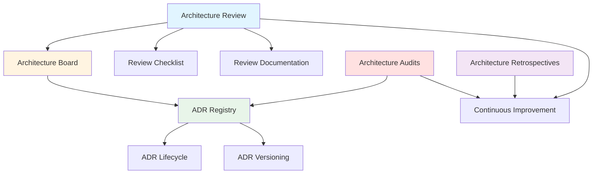
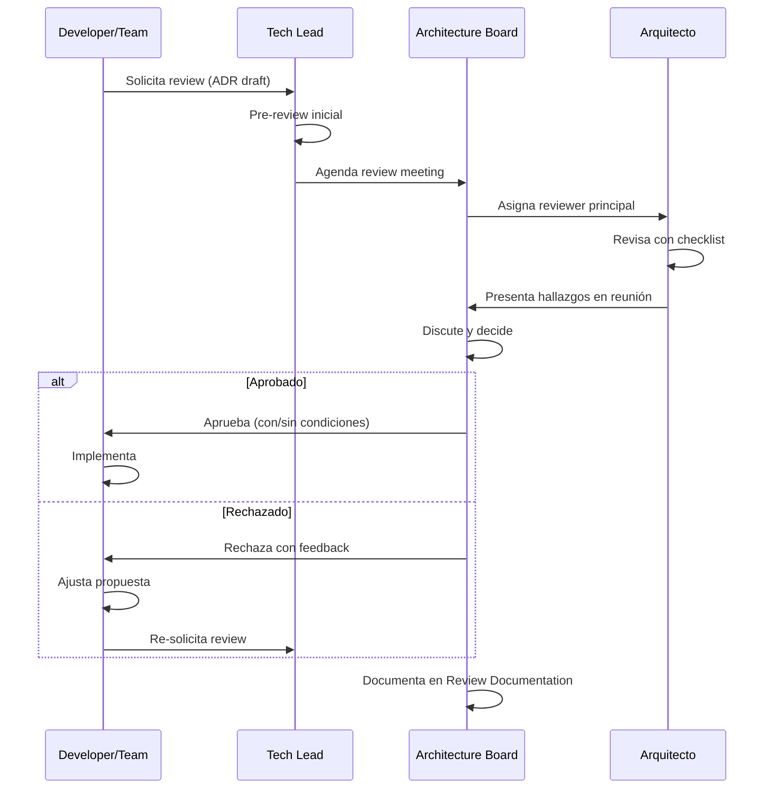
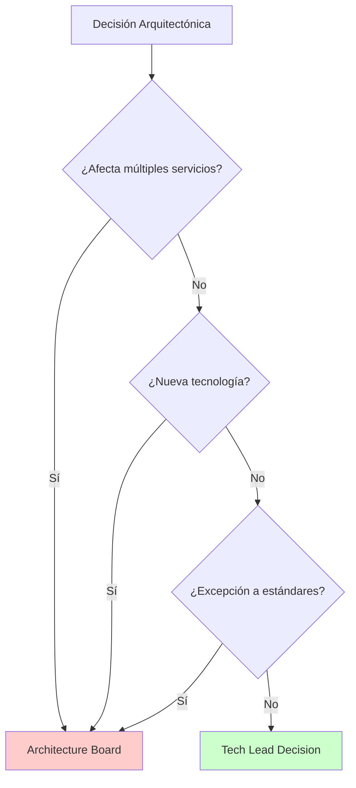
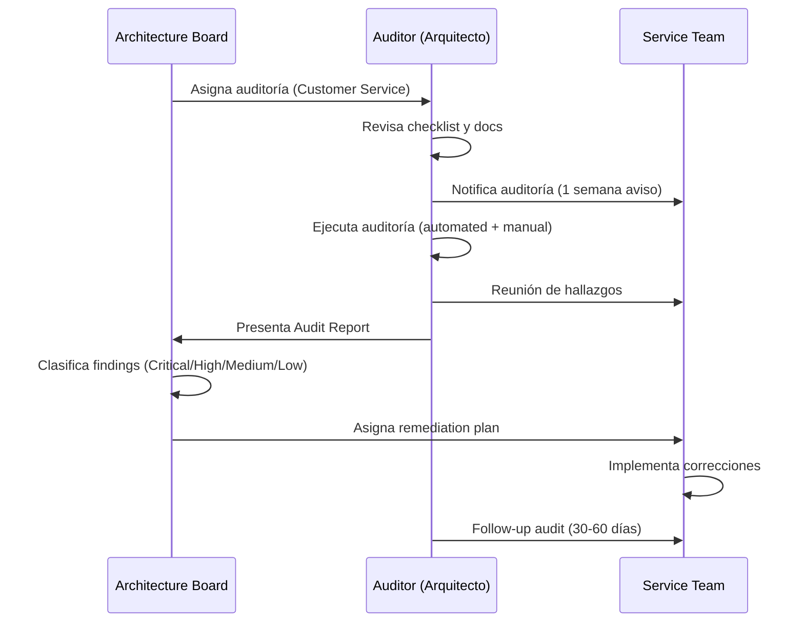

# Gobierno de Arquitectura

## Contexto

Este estándar define el modelo de gobierno para decisiones arquitectónicas, incluyendo procesos de revisión, auditorías periódicas, gestión del Architecture Board y ciclo de vida de ADRs. Complementa el lineamiento [Decisiones Arquitectónicas](../../lineamientos/gobierno/01-decisiones-arquitectonicas.md) asegurando consistencia y calidad en decisiones arquitectónicas.

**Conceptos incluidos:**

- **Architecture Review** → Proceso de revisión de diseños y decisiones
- **Architecture Review Checklist** → Checklist estandarizado para reviews
- **Architecture Board** → Comité de decisiones arquitectónicas
- **Architecture Audits** → Auditorías periódicas de compliance
- **Architecture Retrospectives** → Retrospectivas para mejora continua
- **ADR Registry** → Registro centralizado de ADRs
- **ADR Lifecycle** → Ciclo de vida de Architecture Decision Records
- **ADR Versioning** → Versionamiento y trazabilidad de ADRs
- **Review Documentation** → Documentación de resultados de reviews

---

## Stack Tecnológico

| Componente               | Tecnología     | Versión | Uso                                    |
| ------------------------ | -------------- | ------- | -------------------------------------- |
| **Documentación**        | Markdown       | -       | ADRs, review reports, checklists       |
| **Versionamiento**       | GitHub         | -       | Control de versiones de ADRs           |
| **ADR Tools (Opcional)** | adr-tools      | 3.0+    | CLI para gestionar ADRs                |
| **Site Generator**       | Docusaurus     | 3.0+    | Portal de documentación arquitectónica |
| **Diagramas**            | Mermaid        | 10.0+   | Diagramas de arquitectura              |
| **Automation Workflows** | GitHub Actions | -       | Validaciones automáticas de ADRs       |

---

## Conceptos Fundamentales

Este estándar cubre 9 prácticas relacionadas con el gobierno de arquitectura:

### Índice de Conceptos

1. **Architecture Review**: Proceso de revisión de decisiones y diseños arquitectónicos
2. **Architecture Review Checklist**: Checklist estandarizado para garantizar cobertura completa
3. **Architecture Board**: Comité de arquitectura que toma decisiones estratégicas
4. **Architecture Audits**: Auditorías periódicas para verificar compliance con estándares
5. **Architecture Retrospectives**: Retrospectivas para aprender de decisiones pasadas
6. **ADR Registry**: Registro centralizado de todas las decisiones arquitectónicas
7. **ADR Lifecycle**: Estados y transiciones de los ADRs
8. **ADR Versioning**: Versionamiento en Git y trazabilidad
9. **Review Documentation**: Documentación de resultados y seguimiento de action items

### Relación entre Conceptos



**Flujo de Gobierno:**

1. **Propuesta de cambio** → Architecture Review (con Checklist)
2. **Decisión** → Architecture Board (si es significativa)
3. **Documentación** → ADR creado/actualizado en Registry
4. **Seguimiento** → ADR Lifecycle management
5. **Validación periódica** → Architecture Audits
6. **Mejora continua** → Architecture Retrospectives

---

## 1. Architecture Review

### ¿Qué es un Architecture Review?

Proceso formal de evaluación de decisiones y diseños arquitectónicos antes de su implementación, asegurando alineación con principios, lineamientos y estándares corporativos.

**Propósito:** Identificar riesgos, inconsistencias y oportunidades de mejora antes de implementar cambios arquitectónicos.

**Tipos de Reviews:**

1. **Design Review**: Revisión de diseño detallado de un nuevo componente/servicio
2. **ADR Review**: Revisión de Architecture Decision Records
3. **Pre-Implementation Review**: Revisión antes de comenzar implementación
4. **Post-Implementation Review**: Revisión después de implementar cambios significativos
5. **Incident Review**: Revisión arquitectónica después de incidentes mayores

**Cuándo se requiere:**

- ✅ Nuevos servicios o aplicaciones
- ✅ Cambios arquitectónicos significativos (ej. cambio de base de datos)
- ✅ Adopción de nuevas tecnologías
- ✅ Cambios en patrones de integración
- ✅ Decisiones que afectan seguridad, performance, o compliance
- ✅ Antes de ADRs con estado "Propuesto"

**Beneficios:**
✅ Detección temprana de problemas
✅ Alineación con estándares corporativos
✅ Transferencia de conocimiento
✅ Decisiones documentadas y rastreables

### Proceso de Architecture Review



### Roles y Responsabilidades

**Solicitante (Developer/Tech Lead):**

- Preparar documentación completa (ADR, diagramas C4, justificación)
- Presentar propuesta en reunión
- Implementar feedback y ajustes

**Reviewer Principal (Arquitecto):**

- Revisar documentación con checklist
- Identificar riesgos y gaps
- Presentar hallazgos al Board

**Architecture Board:**

- Tomar decisión final (Aprobar/Rechazar/Posponer)
- Asegurar alineación con estrategia corporativa
- Priorizar backlog de reviews

### Ejemplo: Solicitud de Review

```markdown
# Architecture Review Request

**Fecha**: 2026-02-18
**Solicitante**: Juan Pérez (Tech Lead - Customer Team)
**Tipo**: Design Review
**Urgencia**: Normal (2 semanas para implementar)

## Resumen

Migración de Customer Service de PostgreSQL single instance a PostgreSQL con réplica de lectura para mejorar performance de consultas.

## Documentación

- ADR: [ADR-009: Debezium CDC](../../../adrs/adr-009-debezium-cdc.md)
- C4 Diagrams: [Container Diagram actualizado](../architecture/c4-diagrams/customer-container.md)
- Performance Analysis: [Análisis de carga actual](../performance/customer-load-analysis.md)

## Alcance del Cambio

**Componentes afectados:**

- Customer Service (aplicación .NET)
- Customer Database (PostgreSQL RDS)
- Infrastructure (Terraform IaC)

**Impacto:**

- ✅ Performance: Reducción esperada de 40% en latencia P95 de lecturas
- ⚠️ Costo: +$300 USD/mes (instancia réplica db.r6g.large)
- ⚠️ Complejidad: Necesita routing de queries (lectura vs escritura)

## Alternativas Consideradas

1. **Caching con Redis** (descartada - ya implementada, no suficiente)
2. **PostgreSQL Read Replica** (propuesta actual)
3. **Migrar a DynamoDB** (descartada - muy costoso y riesgoso)

## Riesgos Identificados

- Replication lag (mitigación: monitoreo con alerta < 5s de lag)
- Complejidad en routing queries (mitigación: usar Entity Framework Read/Write contexts)
- Costo adicional (mitigación: justificado por mejora de UX)

## Questions para el Board

1. ¿Es aceptable el costo adicional de $300/mes?
2. ¿Debemos considerar multi-AZ para réplica o single-AZ es suficiente?
3. ¿Este patrón debe convertirse en estándar para servicios de alto tráfico?

## Timeline Propuesto

- Semana 1: Aprobación review
- Semana 2-3: Implementación Terraform + cambios aplicación
- Semana 4: Testing en staging
- Semana 5: Deployment a producción (blue-green)

---

**Solicitante**: @juanp
**Reviewer Sugerido**: @arquitecto
**Board Meeting**: Próximo jueves 15:00
```

---

## 2. Architecture Review Checklist

### ¿Qué es el Review Checklist?

Lista estandarizada de verificación que asegura cobertura completa durante architecture reviews, garantizando que ningún aspecto crítico sea omitido.

**Propósito:** Consistencia y completitud en todos los reviews arquitectónicos.

**Beneficios:**
✅ Uniformidad en reviews
✅ No se omiten aspectos críticos
✅ Facilita onboarding de nuevos reviewers
✅ Auditable y medible

### Checklist Completo

#### 1. Documentación y Contexto

- [ ] **ADR completo** con todas las secciones (Contexto, Decisión, Alternativas, Justificación, Consecuencias)
- [ ] **Diagramas C4** (mínimo Context y Container)
- [ ] **Problema claramente definido** con métricas actuales
- [ ] **Objetivos medibles** (performance, availability, etc.)
- [ ] **Stakeholders identificados** (equipos afectados, dependencias)

#### 2. Alineación con Principios

- [ ] **Simplicidad**: ¿Es la solución más simple que resuelve el problema?
- [ ] **Independencia de deployment**: ¿Mantiene deployments independientes?
- [ ] **Loose coupling**: ¿Minimiza acoplamiento entre servicios?
- [ ] **Database per service**: ¿Respeta ownership de datos?
- [ ] **Zero Trust**: ¿Implementa autenticación/autorización adecuada?

#### 3. Alineación con Lineamientos

- [ ] **APIs**: ¿Sigue estándares REST, versionamiento, error handling?
- [ ] **Datos**: ¿Respeta data ownership, no shared database?
- [ ] **Seguridad**: ¿Encryption, secrets management, least privilege?
- [ ] **Observabilidad**: ¿Logging estructurado, metrics, distributed tracing?
- [ ] **Resiliencia**: ¿Circuit breaker, retry, timeout implementados?

#### 4. Análisis de Alternativas

- [ ] **Mínimo 2 alternativas** consideradas y documentadas
- [ ] **Trade-offs explícitos** de cada alternativa
- [ ] **Why not X**: Justificación clara de alternativas descartadas
- [ ] **Do nothing option**: Opción de no hacer nada evaluada

#### 5. Riesgos y Mitigaciones

- [ ] **Riesgos técnicos** identificados con severidad (High/Medium/Low)
- [ ] **Plan de mitigación** para cada riesgo High/Medium
- [ ] **Rollback strategy** definida
- [ ] **Impacto en otros servicios** evaluado
- [ ] **Single Point of Failure (SPOF)** identificados y mitigados

#### 6. Performance y Escalabilidad

- [ ] **Performance targets** definidos (P95, P99 latency)
- [ ] **Load testing plan** para validar performance
- [ ] **Scalability limits** conocidos (ej. max 10K requests/sec)
- [ ] **Caching strategy** si aplica
- [ ] **Database indexes** necesarios identificados

#### 7. Seguridad

- [ ] **Threat modeling** realizado para cambios significativos
- [ ] **OWASP Top 10** considerado si es API pública
- [ ] **Data classification** (PII, PCI, etc.) identificada
- [ ] **Encryption at rest y in transit** implementado si maneja datos sensibles
- [ ] **Secrets management** (no hardcoded credentials)

#### 8. Operabilidad

- [ ] **Runbooks** creados/actualizados para nuevos escenarios
- [ ] **Monitoring y alerting** definido (qué métricas, qué alertas)
- [ ] **SLOs/SLAs** definidos si es servicio crítico
- [ ] **Disaster Recovery** plan actualizado si aplica
- [ ] **Incident response** procedure documentado

#### 9. Costos

- [ ] **Costo incremental** estimado ($/mes)
- [ ] **ROI o justificación** de costo adicional
- [ ] **Comparación con alternativas** en términos de costo
- [ ] **Cost optimization** considerado (reserved instances, spot, etc.)

#### 10. Testing y Validación

- [ ] **Test strategy** definida (unit, integration, e2e, performance)
- [ ] **Test coverage target** (mínimo 80% para código crítico)
- [ ] **Staging validation** plan antes de producción
- [ ] **Feature flags** para rollout gradual si aplica
- [ ] **Success criteria** medible (cómo sabemos que funciona)

#### 11. Compliance y Governance

- [ ] **Compliance requirements** verificados (SOC2, ISO27001, etc.)
- [ ] **Data residency** considerado si maneja datos de clientes
- [ ] **Audit logging** si maneja datos sensibles
- [ ] **Estándares corporativos** cumplidos (verificar con lista de estándares)

#### 12. Implementación

- [ ] **Timeline realista** con hitos claros
- [ ] **Team capacity** verificada (¿equipo tiene tiempo/skills?)
- [ ] **Dependencies** identificadas (otros equipos, vendors, etc.)
- [ ] **Communication plan** para stakeholders
- [ ] **Rollback plan** probado

### Template de Review Report

```markdown
# Architecture Review Report

**ADR**: ADR-015 PostgreSQL Read Replica
**Reviewer**: Roberto Silva (@arquitecto)
**Fecha**: 2026-02-18
**Solicitante**: Juan Pérez (@juanp)

---

## Resumen Ejecutivo

**Decisión**: ✅ APROBADO con condiciones
**Severidad de Issues**: 2 Medium, 3 Low
**Requerimientos**: Implementar las 2 condiciones antes de deployment a producción

---

## Checklist Results

### ✅ Cumple (9/12 secciones completas)

- ✅ Documentación completa
- ✅ Alineación con principios
- ✅ Análisis de alternativas
- ✅ Performance y escalabilidad
- ✅ Security
- ✅ Operabilidad
- ✅ Costos justificados
- ✅ Testing strategy
- ✅ Implementación plan

### ⚠️ Requiere Mejoras (3 secciones)

- ⚠️ **Riesgos y Mitigaciones**: Falta plan de mitigación para replication lag > 10s
- ⚠️ **Compliance**: Falta verificar data residency (¿réplica en misma región?)
- ⚠️ **Alineación parcial con lineamientos**: Falta configurar circuit breaker para fallback a primary si réplica cae

---

## Issues Identificados

### 🔴 Medium Severity

**ISSUE-1: Replication Lag Mitigation**

- **Descripción**: Plan de mitigación incompleto si replication lag supera 10 segundos
- **Impacto**: Usuarios podrían ver datos desactualizados causando inconsistencias
- **Recomendación**: Implementar circuit breaker que redirija a primary DB si lag > 10s
- **Estado**: ⏳ BLOCKER para producción

**ISSUE-2: Data Residency Compliance**

- **Descripción**: No está documentado si réplica estará en misma región (us-east-1)
- **Impacto**: Posible violación de compliance si datos cruzan regiones
- **Recomendación**: Confirmar réplica en us-east-1 y documentar en ADR
- **Estado**: ⏳ BLOCKER para producción

### 🟡 Low Severity

**ISSUE-3: Monitoring Dashboard**

- **Descripción**: Falta agregar replication lag metric al dashboard de Grafana
- **Recomendación**: Agregar panel con alerta si lag > 5s
- **Estado**: ✅ Nice to have antes de prod

**ISSUE-4: Cost Optimization**

- **Descripción**: Considerar db.t4g.large (Graviton) en vez de db.r6g.large para reducir costo 20%
- **Recomendación**: Evaluar si performance es suficiente con instancia más pequeña
- **Estado**: ✅ Optimización futura

**ISSUE-5: Runbook Incomplete**

- **Descripción**: Runbook no cubre escenario de réplica completamente degradada
- **Recomendación**: Agregar sección "Failover to Primary Only"
- **Estado**: ✅ Mejorar documentación

---

## Conditions for Approval

### Condiciones Bloqueantes (MUST)

1. **Implementar circuit breaker** para replication lag > 10s con fallback a primary
2. **Confirmar data residency** en us-east-1 y actualizar ADR

### Condiciones Recomendadas (SHOULD)

3. Agregar dashboard de monitoreo con replication lag
4. Actualizar runbook con escenario de réplica degradada

---

## Decisión Final

✅ **APROBADO con condiciones**

El diseño es sólido y alineado con arquitectura corporativa. Las dos condiciones bloqueantes deben implementarse antes de deployment a producción.

**Próximos Pasos:**

1. Equipo implementa condiciones 1 y 2
2. Re-review (lightweight) para verificar implementation
3. Proceed to staging deployment
4. Production deployment después de validación en staging

**Aprobador**: Roberto Silva (Arquitecto)
**Board Decision**: Aprobado por mayoría (3/3 votos)
**Fecha de Aprobación**: 2026-02-18

---

## Seguimiento

- [ ] ISSUE-1: Circuit breaker implementado → @juanp → Due: 2026-02-25
- [ ] ISSUE-2: Data residency confirmado → @juanp → Due: 2026-02-20
- [ ] ISSUE-3: Dashboard actualizado → @juanp → Due: 2026-03-01
- [ ] ISSUE-5: Runbook actualizado → @juanp → Due: 2026-03-01

**Re-review Date**: 2026-02-26 (lightweight verification)
```

---

## 3. Architecture Board

### ¿Qué es el Architecture Board?

Comité multidisciplinario que toma decisiones estratégicas sobre arquitectura corporativa, establece lineamientos, y resuelve dilemas arquitectónicos complejos.

**Propósito:** Gobierno centralizado de decisiones arquitectónicas estratégicas con representación de diferentes perspectivas (técnica, negocio, seguridad, operaciones).

**Composición típica:**

- **Enterprise Architect** (Chair) - 1 persona
- **Solution Architects** - 2-3 personas (diferentes dominios)
- **Security Architect** - 1 persona
- **DevOps Lead** - 1 persona
- **Tech Leads** (rotativos) - 2 personas
- **Product Owner** (invitado, voz sin voto) - según tema

**Beneficios:**
✅ Decisiones consistentes y alineadas
✅ Balanceo de trade-offs (técnico, negocio, seguridad)
✅ Accountability compartido
✅ Visión holística

### Responsabilidades del Board

**Estratégicas:**

- Definir y mantener principios arquitectónicos corporativos
- Aprobar estándares y lineamientos
- Evaluar adopción de nuevas tecnologías
- Priorizar iniciativas arquitectónicas
- Definir roadmap tecnológico

**Tácticas:**

- Revisar y aprobar ADRs significativos (SEV-1, SEV-2)
- Resolver conflictos entre equipos
- Aprobar excepciones a estándares
- Review de arquitecturas de nuevos servicios
- Auditorías de compliance

**Operativas:**

- Reuniones quincenales de review
- Atención a escalations urgentes
- Seguimiento de action items
- Comunicación de decisiones

### Criterios de Escalation al Board

**Requiere aprobación del Board (SEV-1):**

- ✅ Adopción de nueva tecnología no estandarizada
- ✅ Cambios arquitectónicos que afectan múltiples servicios
- ✅ Decisiones con impacto en seguridad o compliance
- ✅ Excepciones a principios arquitectónicos
- ✅ Inversiones tecnológicas significativas (> $50K USD/año)

**Puede resolverse a nivel Tech Lead (SEV-2):**

- Decisiones dentro de un solo servicio
- Cambios que siguen lineamientos existentes
- Adopción de tecnologías ya estandarizadas

**Cuándo escalar:**



### Proceso de Reunión

**Frecuencia**: Quincenal, jueves 15:00-17:00

**Agenda tipo:**

```markdown
# Architecture Board Meeting - 2026-02-20

**Attendees**:

- Roberto Silva (Enterprise Architect, Chair)
- María González (Security Architect)
- Carlos Muñoz (Solution Architect - E-commerce)
- Laura Díaz (DevOps Lead)
- Juan Pérez (Tech Lead - Customer Team, guest)

**Absent**: Ana Torres (Solution Architect - Payments)

---

## 1. Review de Action Items Anteriores (10 min)

- [x] ADR-014: Migración Kafka 3.5 → 3.6 completada
- [x] Lineamiento de Testing actualizado con contract testing
- [ ] ⏳ Estándar de IaC pendiente (Laura) → Carried over

---

## 2. ADR Reviews (60 min)

### ADR-015: PostgreSQL Read Replica (Customer Service)

**Presenter**: Juan Pérez
**Time**: 20 min
**Status**: Para aprobación

**Decision**: ✅ APROBADO con 2 condiciones

- Implementar circuit breaker para replication lag
- Confirmar data residency en us-east-1

**Votes**: 3 Yes, 0 No, 0 Abstain

---

### ADR-016: Migrar Payment Service a .NET 8 (de .NET 6)

**Presenter**: Remote (Ana Torres)
**Time**: 15 min
**Status**: FYI (no requiere aprobación, solo informativo)

**Decision**: ℹ️ ACKNOWLEDGED

- Alineado con roadmap de modernización
- Sin objeciones del Board

---

### ADR-017: Implementar GraphQL para Order Service

**Presenter**: Carlos Muñoz
**Time**: 25 min
**Status**: Para aprobación - CONTROVERSIAL

**Decision**: ❌ RECHAZADO

- No hay caso de uso que justifique complejidad adicional
- REST API actual es suficiente
- GraphQL no está en stack corporativo
- Recomendación: Mejorar API REST con filtros avanzados

**Votes**: 1 Yes, 2 No, 1 Abstain
**Rationale**: Complejidad no justificada, prefer simplicidad

---

## 3. Lineamientos y Estándares (20 min)

### Propuesta: Nuevo Lineamiento de API Deprecation

**Presenter**: Roberto Silva
**Status**: Draft review

**Feedback**:

- María: Agregar periodo mínimo de deprecation (6 meses)
- Carlos: Incluir estrategia de comunicación a consumers
- Laura: Automatizar detección de APIs deprecated

**Decision**: ⏳ POSTPONED

- Incorporar feedback y re-presentar próxima reunión

---

## 4. Technology Radar Update (15 min)

**Adopt**:

- OpenTelemetry 1.7+ (ya estandarizado)

**Trial**:

- Testcontainers para integration tests
- PostgreSQL 16 (evaluar features)

**Hold**:

- Event Sourcing (complejidad alta, evaluar caso por caso)

**Retire**:

- .NET 6 (migrar a .NET 8 antes de Nov 2024)

---

## 5. Auditorías Programadas (10 min)

**Q1 2026 Audits**:

- [x] ✅ Customer Service (compliant)
- [ ] ⏳ Payment Service (scheduled Mar 1)
- [ ] ⏳ Order Service (scheduled Mar 15)

---

## 6. AOB (Any Other Business) (5 min)

- **Roberto**: Recordatorio de Architecture Summit en Abril
- **Laura**: Nueva versión de Terraform (1.8) disponible

---

## Action Items

| Owner         | Action                                 | Due Date   |
| ------------- | -------------------------------------- | ---------- |
| Juan Pérez    | Implementar condiciones ADR-015        | 2026-02-25 |
| Roberto Silva | Actualizar API Deprecation lineamiento | 2026-03-01 |
| Laura Díaz    | Completar estándar de IaC              | 2026-02-27 |
| Carlos Muñoz  | Auditoría Payment Service              | 2026-03-01 |

---

**Next Meeting**: 2026-03-06, 15:00-17:00
**Scribe**: Laura Díaz (rotatoria)
```

### Criterios de Votación

**Tipos de decisiones:**

1. **Consensus (preferido)**: Todos están de acuerdo
2. **Majority vote**: 50% + 1 votos a favor
3. **Chair decides**: Si empate, Enterprise Architect decide

**Tipos de votos:**

- **Yes**: A favor
- **No**: En contra (debe justificar razón)
- **Abstain**: Me abstengo (por conflict of interest o falta de contexto)

**Quorum**: Mínimo 60% de miembros presentes para decisiones vinculantes.

---

## 4. Architecture Audits

### ¿Qué son las Architecture Audits?

Auditorías periódicas que verifican compliance de servicios con lineamientos, estándares y decisiones arquitectónicas (ADRs).

**Propósito:** Detección proactiva de drift arquitectónico y garantía de cumplimiento corporativo.

**Tipos de auditorías:**

1. **Scheduled Audits**: Auditorías calendarizadas (trimest rales)
2. **Triggered Audits**: Disparadas por eventos (incidentes, cambios significativos)
3. **Random Audits**: Aleatorias para muestreo

**Alcance:**

- ✅ Compliance con estándares (APIs, seguridad, datos)
- ✅ Implementación correcta de ADRs
- ✅ Adherencia a principios arquitectónicos
- ✅ Calidad de documentación (arc42, ADRs, runbooks)
- ✅ Configuración de seguridad (secrets, encryption, RBAC)
- ✅ Observabilidad (logging, metrics, tracing)

**Beneficios:**
✅ Prevención de technical debt
✅ Detección temprana de problemas
✅ Cultura de accountability
✅ Mejora continua

### Proceso de Auditoría



### Audit Checklist

```markdown
# Architecture Audit Checklist - Customer Service

**Auditor**: Roberto Silva
**Service**: Customer Service
**Date**: 2026-02-18
**Team**: Customer Team (Tech Lead: Juan Pérez)

---

## 1. Documentation (15 puntos)

- [x] ✅ arc42 documentation presente y actualizada (5 pts)
- [x] ✅ ADRs completos y versionados en Git (5 pts)
- [ ] ❌ Runbooks desactualizados (último update 6 meses atrás) (0/3 pts)
- [x] ✅ README con setup instructions (2 pts)

**Score**: 12/15 (80%)

---

## 2. API Standards (10 puntos)

- [x] ✅ REST API siguiendo naming conventions (3 pts)
- [x] ✅ Versionamiento implementado (v1) (2 pts)
- [x] ✅ OpenAPI/Swagger documentation (2 pts)
- [ ] ⚠️ Error handling parcialmente estandarizado (1/3 pts - falta ProblemDetails en algunos endpoints)

**Score**: 8/10 (80%)

---

## 3. Security (20 puntos)

- [x] ✅ Autenticación via Keycloak (JWT) (5 pts)
- [x] ✅ Secrets en AWS Secrets Manager (no hardcoded) (5 pts)
- [x] ✅ Encryption at rest (RDS encrypted) (3 pts)
- [x] ✅ Encryption in transit (TLS 1.2+) (3 pts)
- [ ] ❌ RBAC no implementado (usa solo autenticación, no autorización granular) (0/4 pts)

**Score**: 16/20 (80%)

---

## 4. Observability (15 puntos)

- [x] ✅ Structured logging con Serilog (5 pts)
- [x] ✅ Distributed tracing con OpenTelemetry (5 pts)
- [x] ✅ Metrics expuestas (/metrics endpoint) (3 pts)
- [ ] ⚠️ Dashboard de Grafana incompleto (1/2 pts - falta métricas de negocio)

**Score**: 14/15 (93%)

---

## 5. Resilience (10 puntos)

- [x] ✅ Circuit breaker para llamadas externas (3 pts)
- [x] ✅ Retry pattern con backoff exponencial (3 pts)
- [x] ✅ Timeout configurado (2 pts)
- [ ] ❌ Health checks no incluyen dependencias (Redis, Kafka) (0/2 pts)

**Score**: 8/10 (80%)

---

## 6. Data Management (10 puntos)

- [x] ✅ Database per service (PostgreSQL dedicado) (5 pts)
- [x] ✅ Migraciones versionadas (EF Migrations) (3 pts)
- [ ] ⚠️ Connection pooling configurado pero límites muy altos (1/2 pts)

**Score**: 9/10 (90%)

---

## 7. Testing (10 puntos)

- [x] ✅ Unit tests con coverage > 80% (4 pts)
- [x] ✅ Integration tests con Testcontainers (3 pts)
- [ ] ❌ Contract tests no implementados (0/3 pts)

**Score**: 7/10 (70%)

---

## 8. CI/CD & Deployment (10 puntos)

- [x] ✅ GitHub Actions pipeline (build, test, deploy) (4 pts)
- [x] ✅ Deployment automatizado a dev (2 pts)
- [x] ✅ Artifacts en GitHub Container Registry (2 pts)
- [ ] ⚠️ Rollback automation parcial (1/2 pts - manual trigger)

**Score**: 9/10 (90%)

---

## Overall Score: 83/100 (83%)

**Rating**: 🟢 GOOD (80-89%)

- 🟢 Excellent (90-100%)
- 🟢 Good (80-89%)
- 🟡 Needs Improvement (70-79%)
- 🔴 Critical (< 70%)
```

### Audit Report Template

```markdown
# Architecture Audit Report

**Service**: Customer Service
**Auditor**: Roberto Silva (@arquitecto)
**Date**: 2026-02-18
**Overall Score**: 83/100 (🟢 GOOD)

---

## Executive Summary

Customer Service está generalmente bien arquitectado y cumple mayoría de estándares corporativos. Se identificaron 5 findings (1 High, 2 Medium, 2 Low) que requieren remediation.

**Strengths**:

- ✅ Excelente observabilidad (93%)
- ✅ Sólida gestión de datos (90%)
- ✅ Buena automatización CI/CD (90%)

**Areas of Improvement**:

- ⚠️ RBAC no implementado (High severity)
- ⚠️ Contract testing ausente (Medium severity)
- ⚠️ Runbooks desactualizados (Medium severity)

---

## Findings

### 🔴 HIGH SEVERITY

**FINDING-1: RBAC No Implementado**

- **Category**: Security
- **Description**: Servicio solo valida autenticación (JWT válido) pero no implementa autorización granular basada en roles
- **Impact**: Cualquier usuario autenticado puede ejecutar cualquier operación (crear, actualizar, eliminar clientes)
- **Recommendation**: Implementar RBAC con roles (Admin, CustomerManager, CustomerViewer) usando Keycloak roles
- **Remediation Timeline**: 30 días
- **Owner**: @juanp

### 🟡 MEDIUM SEVERITY

**FINDING-2: Contract Testing Ausente**

- **Category**: Testing
- **Description**: No hay contract tests para validar que cambios en API no rompen consumers
- **Impact**: Riesgo de breaking changes no detectados
- **Recommendation**: Implementar Pact o similar para contract testing con consumers conocidos (Order Service, Notification Service)
- **Remediation Timeline**: 60 días
- **Owner**: @juanp

**FINDING-3: Runbooks Desactualizados**

- **Category**: Documentation
- **Description**: Runbooks no actualizados en 6 meses, no reflejan cambios recientes (ej. migración a ECS Fargate)
- **Impact**: Incidentes podrían tardar más en resolverse
- **Recommendation**: Actualizar runbooks y establecer proceso de review trimestral
- **Remediation Timeline**: 15 días
- **Owner**: @juanp

### 🟢 LOW SEVERITY

**FINDING-4: Health Checks Incompletos**

- **Category**: Resilience
- **Description**: /health endpoint solo verifica que app responde, no valida dependencies (PostgreSQL, Redis, Kafka)
- **Recommendation**: Agregar health checks para dependencies con timeout reasonable
- **Remediation Timeline**: 30 días (nice to have)
- **Owner**: @juanp

**FINDING-5: Connection Pooling Over-configured**

- **Category**: Data Management
- **Description**: Connection pool configurado con 200 connections (excesivo para carga actual de ~50 req/s)
- **Recommendation**: Reducir a 50-100 connections para optimizar recursos
- **Remediation Timeline**: 15 días (quick win)
- **Owner**: @juanp

---

## Remediation Plan

| Finding   | Severity | Owner  | Due Date   | Status     |
| --------- | -------- | ------ | ---------- | ---------- |
| FINDING-1 | High     | @juanp | 2026-03-20 | ⏳ Planned |
| FINDING-2 | Medium   | @juanp | 2026-04-20 | ⏳ Planned |
| FINDING-3 | Medium   | @juanp | 2026-03-05 | ⏳ Planned |
| FINDING-4 | Low      | @juanp | 2026-03-20 | ⏳ Planned |
| FINDING-5 | Low      | @juanp | 2026-03-05 | ⏳ Planned |

---

## Follow-up Audit

**Date**: 2026-04-30 (60 días)
**Scope**: Verificar implementación de remediation para findings High y Medium

---

**Approved by**: Roberto Silva (Enterprise Architect)
**Distributed to**: Customer Team, Architecture Board, CTO
```

---

## 5. Architecture Retrospectives

### ¿Qué son las Architecture Retrospectives?

Reuniones periódicas para reflexionar sobre decisiones arquitectónicas pasadas, aprender de aciertos y errores, y mejorar continuamente el proceso de toma de decisiones.

**Propósito:** Aprendizaje organizacional y mejora continua del gobierno arquitectónico.

**Diferencias con retros ágiles:**

- Enfoque en decisiones arquitectónicas, no en proceso de equipo
- Alcance multi-equipo o corporativo
- Frecuencia trimestral (no por sprint)

**Cuándo realizar:**

- ✅ Trimestral (scheduled)
- ✅ Post-incident mayor (triggered)
- ✅ Post-implementación de cambio arquitectónico significativo
- ✅ Al finalizar iniciativa estratégica

**Beneficios:**
✅ Aprendizaje de decisiones pasadas
✅ Mejora de lineamientos y estándares
✅ Cultura de transparencia
✅ Evolución del architecture governance

### Formato de Retro

**Duración**: 90 minutos
**Participantes**: Architecture Board + Tech Leads invitados

**Estructura:**

1. **Set the stage** (10 min): Contexto y objetivos
2. **Gather data** (20 min): Revisión de decisiones tomadas en el trimestre
3. **Generate insights** (30 min): Qué funcionó bien, qué no, por qué
4. **Decide what to do** (20 min): Action items concretos
5. **Close** (10 min): Resumen y próximos pasos

### Template de Retro

```markdown
# Architecture Retrospective Q1 2026

**Date**: 2026-03-30
**Facilitator**: Roberto Silva
**Participants**: Architecture Board + Tech Leads (Customer, Order, Payment teams)

---

## Set the Stage

**Objetivo**: Reflexionar sobre decisiones arquitectónicas de Q1 2026 y identificar mejoras para Q2.

**Ground Rules**:

- Focus en aprendizaje, no en blame
- Todos contribuyen
- Decisiones basadas en datos

---

## Gather Data: ADRs Aprobados en Q1 2026

| ADR     | Tema                    | Resultado                                 | Equipo   |
| ------- | ----------------------- | ----------------------------------------- | -------- |
| ADR-015 | PostgreSQL Read Replica | ✅ Implementado, performance mejorada 35% | Customer |
| ADR-016 | Migrar a .NET 8         | ✅ Implementado, sin issues               | Payment  |
| ADR-017 | GraphQL para Orders     | ❌ Rechazado por Board                    | Order    |
| ADR-018 | Kafka 3.6 upgrade       | ✅ Implementado, estable                  | Platform |
| ADR-019 | Redis Cluster           | ⏳ En implementación                      | Customer |

**Métricas Q1**:

- 12 ADRs revisados
- 9 aprobados (75%)
- 2 rechazados (17%)
- 1 pospuesto (8%)
- Tiempo promedio de review: 8 días (target: 7 días)

---

## Generate Insights

### ✅ What Went Well?

1. **ADR-015 muy exitoso**: Read replica mejoró performance significativamente, implementación sin bloqueadores
   - _Insight_: Buen análisis previo de riesgos facilitó implementation smooth

2. **Mejor documentación de ADRs**: Calidad de ADRs mejoró comparado con Q4 2025
   - _Insight_: Review checklist está ayudando a uniformidad

3. **Decisión rápida en ADR-017**: GraphQL rechazado claramente con justificación, no perdimos tiempo
   - _Insight_: Cultura de "no" bien fundamentado es saludable

### ⚠️ What Didn't Go Well?

1. **ADR-019 Re do Work**: Redis Cluster tuvo que re-diseñarse después de review inicial
   - _Insight_: Architect no fue involucrado suficientemente temprano
   - _Root Cause_: Equipo intentó "self-service" decisión compleja

2. **Retrasos en follow-up de audits**: 2 de 5 audits Q1 no completaron remediation a tiempo
   - _Insight_: Falta enforcement de action items
   - _Root Cause_: Sin accountability clara post-audit

3. **ADR-016 poca documentación post-impl**: Migración .NET 8 exitosa pero no documentamos learnings
   - _Insight_: Perdimos oportunidad de sharing knowledge
   - _Root Cause_: No hay proceso para post-implementation documentation

### 🤔 Puzzles & Questions

- ¿Por qué algunas reviews toman 3 días y otras 15 días?
- ¿Cómo podemos incentivar reviews más proactivos (no reactivos)?
- ¿Tech Leads tienen suficiente contexto arquitectónico para tomar decisiones autónomas?

---

## Decide What To Do: Action Items Q2 2026

| Action                                                                           | Owner       | Due Date   | Success Metric                                    |
| -------------------------------------------------------------------------------- | ----------- | ---------- | ------------------------------------------------- |
| **AI-1**: Crear "Architecture Office Hours" semanal para consultas tempranas     | @arquitecto | 2026-04-07 | 80% de ADRs con pre-review antes de formal review |
| **AI-2**: Implementar SLA para audit remediation (30 días High, 60 días Medium)  | @board      | 2026-04-15 | 100% compliance con SLA en Q2                     |
| **AI-3**: Template de "post-implementation learnings" para ADRs mayores          | @arquitecto | 2026-04-10 | 5+ learnings documentados en Q2                   |
| **AI-4**: Automatizar recordatorios de review en GitHub (bot)                    | @laura      | 2026-04-30 | Tiempo promedio review < 7 días                   |
| **AI-5**: Training session sobre "cuándo escalar al Board vs decidir localmente" | @arquitecto | 2026-04-20 | 20+ asistentes, survey satisfaction > 4/5         |

---

## Close: Key Takeaways

- ✅ Calidad de ADRs mejorando, seguir con checklist
- ⚠️ Necesitamos involucrar arquitectos más temprano (Architecture Office Hours)
- ⚠️ Enforcement de audit remediation requiere mejora (SLA)
- 🎯 Goal Q2: Tiempo promedio review < 7 días

**Next Retrospective**: 2026-06-30 (Q2 retro)

---

**Facilitator Notes**: Excelente participación, todas las voces escuchadas. Action items SMART y con owners claros.
```

---

## 6. ADR Registry

### ¿Qué es el ADR Registry?

Registro centralizado que mantiene **índice completo** de todos los Architecture Decision Records, facilitando descubrimiento, trazabilidad y auditorías.

**Propósito:** Single source of truth para decisiones arquitectónicas corporativas.

**Ubicación:**

```
docs/adrs/
├── README.md               # ADR Registry (índice principal)
├── adr-001-multi-tenancy.md
├── adr-002-aws-ecs-fargate.md
├── adr-003-postgresql-database.md
├── ...
└── adr-NNN-titulo.md
```

**Beneficios:**
✅ Descubrimiento fácil de decisiones
✅ Trazabilidad completa
✅ Evita re-discutir decisiones pasadas
✅ Onboarding más rápido

### Estructura del Registry (README.md)

```markdown
# Architecture Decision Records (ADRs)

Este directorio contiene todas las decisiones arquitectónicas significativas de la organización.

## ¿Qué es un ADR?

Un ADR documenta una decisión arquitectónica significativa junto con su contexto, alternativas consideradas y consecuencias. Ver [ADR Template](../templates/adr-template.md).

---

## Índice por Número

| ADR                                         | Título                                        | Estado    | Fecha      | Equipo       |
| ------------------------------------------- | --------------------------------------------- | --------- | ---------- | ------------ |
| [ADR-001](adr-001-multi-tenancy.md)         | Estrategia Multi-Tenancy                      | Aceptado  | 2024-03-15 | Platform     |
| [ADR-002](adr-002-aws-ecs-fargate.md)       | AWS ECS Fargate para Contenedores             | Aceptado  | 2024-03-20 | DevOps       |
| [ADR-003](adr-003-postgresql-database.md)   | PostgreSQL como Base de Datos Principal       | Aceptado  | 2024-04-10 | Architecture |
| [ADR-004](adr-004-github-actions.md)        | GitHub Actions para CI/CD                     | Aceptado  | 2024-04-15 | DevOps       |
| [ADR-005](adr-005-keycloak-sso.md)          | Keycloak para SSO                             | Aceptado  | 2024-05-01 | Security     |
| [ADR-006](adr-006-apache-kafka.md)          | Apache Kafka para Event Streaming             | Aceptado  | 2024-05-10 | Platform     |
| [ADR-007](adr-007-grafana-stack.md)         | Grafana Stack para Observabilidad             | Aceptado  | 2024-06-01 | DevOps       |
| [ADR-008](adr-008-dotnet-8.md)              | .NET 8 como Framework Principal               | Aceptado  | 2024-06-15 | Architecture |
| [ADR-009](adr-009-terraform-iac.md)         | Terraform para Infrastructure as Code         | Aceptado  | 2024-07-01 | DevOps       |
| [ADR-010](adr-010-contract-testing.md)      | Contract Testing con Pact                     | Propuesto | 2024-07-20 | QA           |
| [ADR-011](adr-011-redis-caching.md)         | Redis para Caching                            | Aceptado  | 2024-08-05 | Architecture |
| [ADR-012](adr-012-vault-secrets.md)         | Vault para Secrets Management                 | Rechazado | 2024-08-10 | Security     |
| [ADR-013](adr-013-aws-secrets-manager.md)   | AWS Secrets Manager (reemplazo ADR-012)       | Aceptado  | 2024-08-25 | Security     |
| [ADR-014](adr-014-kong-api-gateway.md)      | Kong como API Gateway                         | Aceptado  | 2024-09-01 | Platform     |
| [ADR-015](adr-015-postgres-read-replica.md) | PostgreSQL Read Replica para Customer Service | Aceptado  | 2026-02-25 | Customer     |
| ...                                         | ...                                           | ...       | ...        | ...          |

---

## Índice por Categoría

### Infraestructura y Cloud

- [ADR-002: AWS ECS Fargate](adr-002-aws-ecs-fargate.md)
- [ADR-009: Terraform IaC](adr-009-terraform-iac.md)

### Bases de Datos y Persistencia

- [ADR-003: PostgreSQL](adr-003-postgresql-database.md)
- [ADR-011: Redis Caching](adr-011-redis-caching.md)
- [ADR-015: PostgreSQL Read Replica](adr-015-postgres-read-replica.md)

### Seguridad e Identidad

- [ADR-005: Keycloak SSO](adr-005-keycloak-sso.md)
- [ADR-012: Vault Secrets (Rechazado)](adr-012-vault-secrets.md)
- [ADR-013: AWS Secrets Manager](adr-013-aws-secrets-manager.md)

### Mensajería y Eventos

- [ADR-006: Apache Kafka](adr-006-apache-kafka.md)

### Observabilidad

- [ADR-007: Grafana Stack](adr-007-grafana-stack.md)

### Desarrollo y Frameworks

- [ADR-008: .NET 8](adr-008-dotnet-8.md)

### CI/CD y DevOps

- [ADR-004: GitHub Actions](adr-004-github-actions.md)

### APIs y Gateways

- [ADR-014: Kong API Gateway](adr-014-kong-api-gateway.md)

### Testing

- [ADR-010: Contract Testing (Propuesto)](adr-010-contract-testing.md)

---

## Índice por Estado

### Propuestos (En Revisión)

- [ADR-010: Contract Testing](adr-010-contract-testing.md)

### Aceptados (Activos)

- [ADR-001](adr-001-multi-tenancy.md)
- [ADR-002](adr-002-aws-ecs-fargate.md)
- [ADR-003](adr-003-postgresql-database.md)
- ... (mayoría)

### Rechazados

- [ADR-012: Vault Secrets](adr-012-vault-secrets.md) → Reemplazado por ADR-013

### Deprecados

- _(Ninguno actualmente)_

### Superseded (Reemplazados)

- _(Ninguno actualmente)_

---

## Proceso

### ¿Cuándo crear ADR?

Crea un ADR cuando:

- Adoptamos nueva tecnología
- Cambiamos arquitectura significativamente
- Decisión afecta múltiples equipos
- Impacto en seguridad, performance, o compliance

### Flujo

1. **Crear draft**: Usar [template](../templates/adr-template.md)
2. **Architecture Review**: Presentar al Architecture Board
3. **Aprobar**: Cambiar estado a "Aceptado" y numerar secuencialmente
4. **Implementar**: Ejecutar decisión
5. **Mantener**: Actualizar si contexto cambia (versioned in Git)

### Naming Convention
```

adr-NNN-titulo-descriptivo.md

````

- **NNN**: Número secuencial con ceros (001, 002, ..., 156)
- **titulo-descriptivo**: Kebab-case, descriptivo y conciso

---

## Herramientas

### adr-tools (opcional)

```bash
# Instalar adr-tools
brew install adr-tools  # macOS
npm install -g adr-tools  # npm

# Crear nuevo ADR
adr new "Implement GraphQL for Order Service"

# Listar ADRs
adr list

# Generar table of contents
adr generate toc > README.md
````

### GitHub Actions Validation

Se debe implementar validación automática en CI/CD para:

- Numeración secuencial
- Secciones requeridas presentes
- Links válidos
- Format consistente

---

**Mantenido por**: Architecture Board
**Última actualización**: 2026-02-18

````

---

## 7. ADR Lifecycle

### ¿Qué es el ADR Lifecycle?

Ciclo de vida que define estados y transiciones de los Architecture Decision Records desde su creación hasta su eventual deprecación o reemplazo.

**Propósito:** Governance claro del ciclo de vida de decisiones arquitectónicas.

**Estados posibles:**

```mermaid
stateDiagram-v2
    [*] --> Propuesto
    Propuesto --> EnRevisión
    EnRevisión --> Aceptado: Aprobado por Board
    EnRevisión --> Rechazado: No aprobado
    EnRevisión --> Propuesto: Requiere cambios

    Aceptado --> Deprecated: Ya no se usa
    Aceptado --> Superseded: Reemplazado por otro ADR

    Rejected --> [*]
    Deprecated --> [*]
    Superseded --> [*]
````

**Beneficios:**
✅ Claridad sobre validez de decisiones
✅ Trazabilidad de evolución
✅ Evita usar decisiones obsoletas

### Descripción de Estados

| Estado          | Descripción                    | Siguiente Acción           |
| --------------- | ------------------------------ | -------------------------- |
| **Propuesto**   | ADR draft, aún no revisado     | Agenda architecture review |
| **En Revisión** | En proceso de review por Board | Esperar decisión de Board  |
| **Aceptado**    | Aprobado e implementado        | Seguir decisión            |
| **Rechazado**   | No aprobado por Board          | Cerrado, no se implementa  |
| **Deprecated**  | Ya no se recomienda usar       | Migrar a nueva solución    |
| **Superseded**  | Reemplazado por otro ADR       | Seguir nuevo ADR           |

### Ejemplo de Transición de Estados

**ADR-012: Vault Secrets Management**

```markdown
---
# Estado: Rechazado
# Motivo: AWS Secrets Manager preferido por integración nativa con AWS
# Superseded By: ADR-013
---
```

**ADR-013: AWS Secrets Manager**

```markdown
---
# Estado: Aceptado
# Supersedes: ADR-012
---
```

### Gestión de Estados en Frontmatter

```yaml
---
id: adr-015-postgres-read-replica
title: PostgreSQL Read Replica para Customer Service
status: Aceptado # Propuesto | EnRevisión | Aceptado | Rechazado | Deprecated | Superseded
date: 2026-02-25
decision-makers: Architecture Board
consulted: Customer Team, DevOps Team
informed: All Engineering
---
```

---

## 8. ADR Versioning

### ¿Qué es ADR Versioning?

Estrategia de versionamiento y trazabilidad de ADRs usando Git, asegurando que toda la historia de decisiones arquitectónicas sea auditable.

**Propósito:** Trazabilidad completa de evolución de decisiones arquitectónicas.

**Principios:**

1. **Immutability**: ADRs aceptados no se editan, si cambian se crea nuevo ADR
2. **Git as Source of Truth**: Git history es la fuente de verdad de cambios
3. **Sequential Numbering**: Números de ADRs nunca se reutilizan

**Beneficios:**
✅ Auditoría completa
✅ Entender contexto histórico
✅ Revert decisions si es necesario
✅ Compliance y governance

### Estrategia de Commits

```bash
# Crear nuevo ADR (draft)
git checkout -b feature/adr-015-postgres-read-replica
# Editar adr-015-postgres-read-replica.md
git add docs/adrs/adr-015-postgres-read-replica.md
git commit -m "docs(adr): add ADR-015 PostgreSQL Read Replica (Propuesto)"
git push origin feature/adr-015-postgres-read-replica

# Crear PR para review
gh pr create --title "ADR-015: PostgreSQL Read Replica" \
  --body "Architecture Decision Record for implementing read replica in Customer Service"

# Después de aprobación del Board, cambiar estado
git checkout feature/adr-015-postgres-read-replica
# Editar status: Propuesto → Aceptado
git commit -m "docs(adr): approve ADR-015 (Aceptado)"

# Merge a main
gh pr merge --squash
```

### Versionamiento de Cambios

Si un ADR necesita **actualizarse** (ej. ajustar implementación):

**Opción 1: Minor update (clarificación, no cambia decisión)**

```bash
# Editar ADR directamente para clarificar
git checkout -b fix/adr-015-clarify-lag-threshold
# Editar adr-015, agregar:
# Última actualización: 2026-03-10
# Cambios: Clarificado que lag threshold es 5s (no 10s)
git commit -m "docs(adr): clarify ADR-015 replication lag threshold"
```

**Opción 2: Major change (cambia decisión)**

```bash
# Crear NUEVO ADR que supersedes el anterior
git checkout -b feature/adr-025-postgres-multi-region
# Crear adr-025-postgres-multi-region-replica.md
# En frontmatter:
# Supersedes: ADR-015
git commit -m "docs(adr): add ADR-025 multi-region replica (supersedes ADR-015)"

# Actualizar ADR-015 para marcar como Superseded
# status: Superseded
# superseded-by: ADR-025
git commit -m "docs(adr): mark ADR-015 as Superseded by ADR-025"
```

### Git Workflow para ADRs

```yaml
# .github/workflows/validate-adrs.yml
name: Validate ADRs

on:
  pull_request:
    paths:
      - "docs/adrs/adr-*.md"

jobs:
  validate:
    runs-on: ubuntu-latest
    steps:
      - uses: actions/checkout@v4

      - name: Validate ADR Format
        run: |
          for file in docs/adrs/adr-*.md; do
            echo "Validating $file..."

            # Check frontmatter exists
            if ! grep -q "^---$" "$file"; then
              echo "ERROR: Missing frontmatter in $file"
              exit 1
            fi

            # Check required sections
            required_sections=("## Contexto" "## Decisión" "## Consecuencias")
            for section in "${required_sections[@]}"; do
              if ! grep -q "$section" "$file"; then
                echo "ERROR: Missing section '$section' in $file"
                exit 1
              fi
            done
          done

      - name: Check Sequential Numbering
        run: |
          numbers=$(ls docs/adrs/adr-*.md | \
            sed 's/.*adr-\([0-9]*\)-.*/\1/' | sort -n)

          expected=1
          for num in $numbers; do
            num=$((10#$num))  # Remove leading zeros
            if [ $num -ne $expected ]; then
              echo "ERROR: Gap in ADR numbering. Expected $expected, found $num"
              exit 1
            fi
            expected=$((expected + 1))
          done

          echo "✅ ADR numbering is sequential"
```

---

## 9. Review Documentation

### ¿Qué es Review Documentation?

Documentación formal de resultados de architecture reviews, incluyendo decisiones tomadas, hallazgos, action items y seguimiento.

**Propósito:** Trazabilidad de reviews y accountability de action items.

**Tipos de documentos:**

1. **Review Reports**: Resultado de architecture reviews individuales
2. **Board Meeting Minutes**: Actas de reuniones del Architecture Board
3. **Audit Reports**: Resultados de auditorías
4. **Retrospective Reports**: Resultados de retrospectivas

**Ubicación:**

```
docs/gobierno/
├── reviews/
│   ├── 2026-Q1/
│   │   ├── review-adr-015-postgres-replica.md
│   │   ├── review-adr-016-dotnet8-migration.md
│   │   └── ...
│   └── 2026-Q2/
├── board-meetings/
│   ├── 2026-02-06-minutes.md
│   ├── 2026-02-20-minutes.md
│   └── ...
├── audits/
│   ├── 2026-Q1-customer-service-audit.md
│   ├── 2026-Q1-payment-service-audit.md
│   └── ...
└── retrospectives/
    ├── 2026-Q1-retro.md
    └── ...
```

**Beneficios:**
✅ Transparencia en toma de decisiones
✅ Accountability de action items
✅ Histórico para auditorías
✅ Aprendizaje organizacional

### Dashboard de Seguimiento

```markdown
# Architecture Governance Dashboard - Q1 2026

**Last Updated**: 2026-03-30

---

## Reviews Status

| Review                   | Date       | Status         | Pending Actions |
| ------------------------ | ---------- | -------------- | --------------- |
| ADR-015 Postgres Replica | 2026-02-18 | ✅ Completed   | 0               |
| ADR-016 .NET 8 Migration | 2026-02-20 | ✅ Completed   | 0               |
| ADR-017 GraphQL          | 2026-02-20 | ❌ Rejected    | N/A             |
| ADR-018 Kafka 3.6        | 2026-03-01 | ✅ Completed   | 0               |
| ADR-019 Redis Cluster    | 2026-03-15 | ⏳ In Progress | 2               |

---

## Audits Status

| Service          | Date       | Score      | Pending Remediations |
| ---------------- | ---------- | ---------- | -------------------- |
| Customer Service | 2026-02-18 | 83% (Good) | 3 (1 High, 2 Medium) |
| Payment Service  | Scheduled  | -          | -                    |
| Order Service    | Scheduled  | -          | -                    |

---

## Action Items Tracking

### Overdue (🔴 1)

| Action                       | Owner  | Due Date   | Days Overdue |
| ---------------------------- | ------ | ---------- | ------------ |
| AUDIT-CUST-1: Implement RBAC | @juanp | 2026-03-20 | 10 days      |

### Due This Week (🟡 3)

| Action                            | Owner       | Due Date   |
| --------------------------------- | ----------- | ---------- |
| ADR-019-AI-1: Update Redis config | @carlosr    | 2026-04-02 |
| ADR-019-AI-2: Test failover       | @carlosr    | 2026-04-03 |
| RETRO-Q1-AI-1: Setup Office Hours | @arquitecto | 2026-04-07 |

### On Track (🟢 12)

- 12 action items on track for completion within deadline

---

## Metrics

**Q1 2026:**

- ADRs Reviewed: 12
- Average Review Time: 8 days (target: 7 days) 🟡
- Approval Rate: 75% (9/12)
- Audits Completed: 1/3 (on track)
- Audit Avg Score: 83% (Good)
- Action Items Completion Rate: 78% (target: 90%) 🔴

**Trends**:

- ✅ ADR quality improving (less re-work)
- ⚠️ Audit remediation lagging (need enforcement)
- ✅ Board meetings well-attended (95% attendance)
```

---

## Implementación Integrada

### Setup Completo de Architecture Governance

```bash
#!/bin/bash
# setup-governance.sh

# 1. Crear estructura de directorios
mkdir -p docs/{adrs,gobierno/{reviews/{2026-Q1,2026-Q2},board-meetings,audits,retrospectives},templates}

# 2. Crear ADR Template
cat > docs/templates/adr-template.md << 'EOF'
---
id: adr-NNN-titulo
title: [Título Descriptivo]
status: Propuesto
date: YYYY-MM-DD
decision-makers: Architecture Board
consulted: [Equipos consultados]
informed: [Stakeholders informados]
---

# ADR-NNN: [Título]

## Contexto

[Describir el problema o situación que requiere una decisión]

## Decisión

[La decisión tomada]

## Alternativas Consideradas

### Opción 1: [Nombre]
**Pros**:
- [Pro 1]

**Contras**:
- [Contra 1]

### Opción 2: [Nombre]
**Pros**:
- [Pro 1]

**Contras**:
- [Contra 1]

## Justificación

[Por qué se eligió esta opción]

## Consecuencias

### Positivas
- [Consecuencia positiva 1]

### Negativas
- [Consecuencia negativa 1]

### Neutras
- [Consecuencia neutra 1]

## Implementación

[Plan de implementación]

## Referencias

- [Link 1]
EOF

# 3. Crear Review Checklist Template
cat > docs/templates/review-checklist.md << 'EOF'
# Architecture Review Checklist

- [ ] Documentación completa
- [ ] Alineación con principios
- [ ] Alternativas consideradas
- [ ] Riesgos identificados
- [ ] Performance evaluado
- [ ] Security considerado
- [ ] Operabilidad cubierta
- [ ] Costos justificados
- [ ] Testing definido
- [ ] Compliance verificado
- [ ] Implementación planificada
EOF

# 4. Crear ADR Registry
cat > docs/adrs/README.md << 'EOF'
# Architecture Decision Records

[Ver contenido completo del template mostrado anteriormente]
EOF

# 5. Configurar GitHub Actions
mkdir -p .github/workflows
cat > .github/workflows/validate-adrs.yml << 'EOF'
# [Contenido del workflow YAML mostrado anteriormente]
EOF

# 6. Crear primer ADR de ejemplo (el que documenta este proceso)
cat > docs/adrs/adr-001-architecture-governance-process.md << 'EOF'
---
id: adr-001-architecture-governance-process
title: Architecture Governance Process
status: Aceptado
date: 2026-02-18
decision-makers: Architecture Board
---

# ADR-001: Architecture Governance Process

## Contexto

Necesitamos establecer proceso formal de gobierno arquitectónico...

[Contenido completo]
EOF

echo "✅ Architecture Governance setup completed!"
```

---

## Requisitos Técnicos

### MUST (Obligatorio)

**Architecture Review:**

- **MUST** realizar architecture review para decisiones significativas (nuevos servicios, adopción tecnología, cambios multi-servicio)
- **MUST** usar checklist estandarizado en todos los reviews
- **MUST** documentar resultados en review report

**Architecture Board:**

- **MUST** establecer Architecture Board con roles claros
- **MUST** tener Enterprise Architect como chair
- **MUST** documentar decisiones del Board en meeting minutes
- **MUST** definir criterios claros de escalation

**ADR Registry:**

- **MUST** mantener ADR registry centralizado y actualizado
- **MUST** numerar ADRs secuencialmente
- **MUST** versionar ADRs en Git
- **MUST** incluir ADRs en docs/ del repositorio

**ADR Lifecycle:**

- **MUST** definir estado explícito en cada ADR (Propuesto, Aceptado, Rechazado, etc.)
- **MUST** marcar ADRs obsoletos como Deprecated o Superseded

**Architecture Audits:**

- **MUST** realizar auditorías al menos trimestralmente para servicios críticos
- **MUST** generar audit report con findings clasificados por severidad
- **MUST** establecer remediation plan con timelines para High/Medium findings
- **MUST** realizar follow-up audit para verificar correcciones

### SHOULD (Fuertemente recomendado)

- **SHOULD** realizar architecture retrospectives trimestrales
- **SHOULD** mantener dashboard de governance con métricas
- **SHOULD** automatizar validación de ADRs con GitHub Actions
- **SHOULD** usar adr-tools CLI para facilitar gestión
- **SHOULD** publicar ADRs en portal de documentación (Docusaurus)
- **SHOULD** incluir diagramas C4 en ADRs significativos
- **SHOULD** establecer Architecture Office Hours para consultas

### MAY (Opcional)

- **MAY** usar herramientas como ADR Manager o adr-viewer para navegación
- **MAY** crear ADR para cada cambio (balance entre governance y burocracia)
- **MAY** incluir cost-benefit analysis en ADRs

### MUST NOT (Prohibido)

- **MUST NOT** modificar ADRs Aceptados (crear nuevo ADR si cambia decisión)
- **MUST NOT** reutilizar números de ADRs
- **MUST NOT** omitir Architecture Review para decisiones significativas
- **MUST NOT** implementar antes de ADR aprobado (estado Aceptado)
- **MUST NOT** dejar audit findings High/Medium sin remediation plan

---

## Referencias

**Architecture Decision Records:**

- [ADR de Michael Nygard](https://cognitect.com/blog/2011/11/15/documenting-architecture-decisions)
- [ADR GitHub Organization](https://adr.github.io/)
- [adr-tools](https://github.com/npryce/adr-tools)

**Architecture Governance:**

- [TOGAF Architecture Governance](https://pubs.opengroup.org/architecture/togaf9-doc/arch/chap50.html)
- [Architecture Review Boards - Thoughtworks](https://www.thoughtworks.com/insights/blog/architecture/architecture-review-boards)

**Relacionados:**

- [Architecture Documentation](../documentacion/architecture-documentation.md)
- [Compliance and Exceptions](./compliance-exceptions.md)

---

**Última actualización**: 18 de febrero de 2026
**Responsable**: Architecture Board
