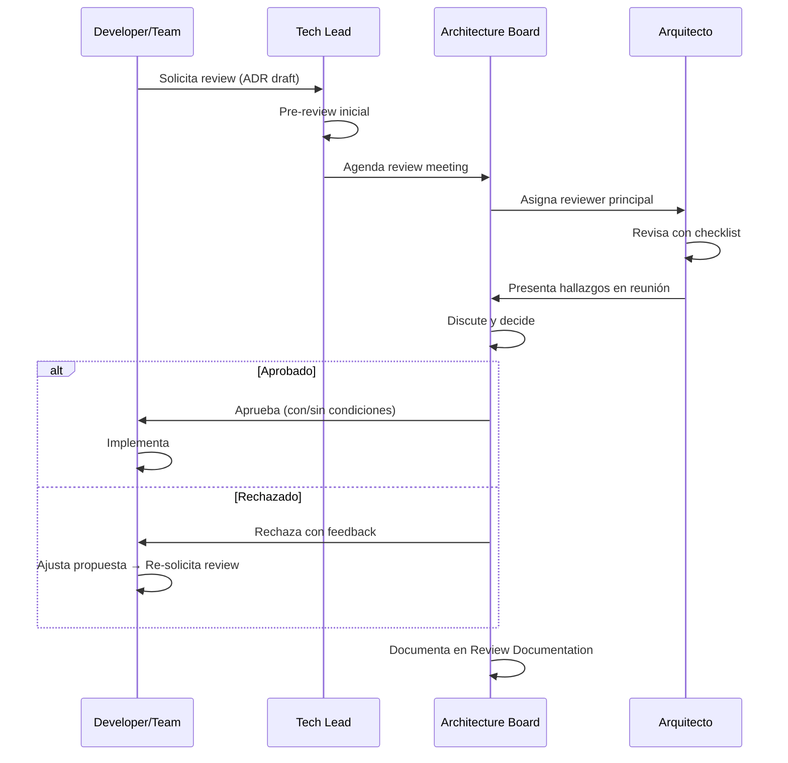

# Architecture Review y Checklist

## Contexto

Este estándar define cómo revisar decisiones arquitectónicas de forma sistemática antes de su implementación, garantizando alineación con principios y lineamientos corporativos. Complementa el lineamiento [Revisiones Arquitectónicas](../../lineamientos/gobierno/revisiones-arquitectonicas.md).

**Conceptos incluidos:**

- **Architecture Review** → Proceso formal de evaluación de diseños y decisiones arquitectónicas
- **Architecture Review Checklist** → Lista estandarizada para garantizar cobertura completa
- **Review Documentation** → Documentación formal de resultados, action items y seguimiento

---

## Stack Tecnológico

| Componente        | Tecnología     | Versión | Uso                                       |
| ----------------- | -------------- | ------- | ----------------------------------------- |
| **Diagramas**     | Mermaid        | Latest  | Diagramas de proceso y secuencia          |
| **Documentación** | Docusaurus     | 3.0+    | Portal de docs y ADRs                     |
| **CI/CD**         | GitHub Actions | Latest  | Validación automática de ADR format       |
| **Repositorio**   | GitHub         | Latest  | Versionado de ADRs y review documentation |

---

## Architecture Review

### ¿Qué es un Architecture Review?

Proceso formal de evaluación de decisiones y diseños arquitectónicos **antes de su implementación**, asegurando alineación con principios, lineamientos y estándares corporativos.

**Tipos de reviews:**

- **Design Review** → Revisión de diseño detallado de un nuevo componente/servicio
- **ADR Review** → Revisión de Architecture Decision Records
- **Pre-Implementation Review** → Antes de comenzar implementación
- **Post-Implementation Review** → Después de cambios significativos
- **Incident Review** → Revisión arquitectónica post-incidente mayor

**Cuándo se requiere:**

- ✅ Nuevos servicios o aplicaciones
- ✅ Cambios arquitectónicos significativos (ej. cambio de base de datos)
- ✅ Adopción de nuevas tecnologías
- ✅ Cambios en patrones de integración
- ✅ Decisiones que afectan seguridad, performance o compliance

**Beneficios:**
✅ Detección temprana de problemas
✅ Alineación con estándares corporativos
✅ Transferencia de conocimiento
✅ Decisiones documentadas y rastreables

### Proceso de Architecture Review



### Roles y Responsabilidades

**Solicitante (Developer/Tech Lead):**

- Preparar documentación completa (ADR, diagramas C4, justificación)
- Presentar propuesta en reunión
- Implementar feedback y ajustes

**Reviewer Principal (Arquitecto):**

- Revisar documentación con checklist
- Identificar riesgos y gaps
- Presentar hallazgos al Board

**Architecture Board:**

- Tomar decisión final (Aprobar/Rechazar/Posponer)
- Asegurar alineación con estrategia corporativa
- Documentar decisiones en meeting minutes

### Solicitud de Revisión

```markdown
# Solicitud de Revisión Arquitectónica

**Fecha**: YYYY-MM-DD
**Solicitante**: [Nombre] ([Rol - Equipo])
**Tipo**: [Design Review | ADR Review | Post-Implementation]
**Urgencia**: [Normal | Urgente]

## Resumen

[Descripción concisa del cambio propuesto y motivación]

## Documentación

- ADR: [link]
- Diagramas C4: [link]

## Alcance del Cambio

**Componentes afectados**: [lista]
**Impacto estimado**: [performance, costo, complejidad]

## Alternativas Consideradas

1. [Opción A] — descartada porque [razón]
2. [Propuesta actual] — seleccionada porque [razón]

## Riesgos Identificados

- [Riesgo]: [Mitigación]

## Preguntas para el Board

1. [Pregunta específica donde se necesita opinión del Board]

## Timeline Propuesto

- Semana 1: Aprobación
- Semanas 2-N: Implementación
```

---

## Architecture Review Checklist

### ¿Qué es el Review Checklist?

Lista estandarizada de verificación que garantiza cobertura completa durante architecture reviews.

**Beneficios:**
✅ Uniformidad entre reviewers
✅ No se omiten aspectos críticos
✅ Facilita onboarding de nuevos reviewers
✅ Auditable y medible

### Checklist Completo

#### Documentación y Contexto

- [ ] **ADR completo** con todas las secciones (Contexto, Decisión, Alternativas, Justificación, Consecuencias)
- [ ] **Diagramas C4** (mínimo Context y Container)
- [ ] **Problema claramente definido** con métricas actuales
- [ ] **Objetivos medibles** (performance, availability, etc.)
- [ ] **Stakeholders identificados** (equipos afectados, dependencias)

#### Alineación con Principios

- [ ] **Simplicidad**: ¿Es la solución más simple que resuelve el problema?
- [ ] **Independencia de deployment**: ¿Mantiene deployments independientes?
- [ ] **Loose coupling**: ¿Minimiza acoplamiento entre servicios?
- [ ] **Database per service**: ¿Respeta ownership de datos?
- [ ] **Zero Trust**: ¿Implementa autenticación/autorización adecuada?

#### Alineación con Lineamientos

- [ ] **APIs**: ¿Sigue estándares REST, versionamiento, error handling?
- [ ] **Datos**: ¿Respeta data ownership, no shared database?
- [ ] **Seguridad**: ¿Encryption, secrets management, least privilege?
- [ ] **Observabilidad**: ¿Logging estructurado, metrics, distributed tracing?
- [ ] **Resiliencia**: ¿Circuit breaker, retry, timeout implementados?

#### Análisis de Alternativas

- [ ] **Mínimo 2 alternativas** consideradas y documentadas
- [ ] **Trade-offs explícitos** de cada alternativa
- [ ] **Why not X**: Justificación clara de alternativas descartadas
- [ ] **Do nothing option**: Opción de no hacer nada evaluada

#### Riesgos y Mitigaciones

- [ ] **Riesgos técnicos** identificados con severidad (High/Medium/Low)
- [ ] **Plan de mitigación** para cada riesgo High/Medium
- [ ] **Rollback strategy** definida
- [ ] **Impacto en otros servicios** evaluado
- [ ] **Single Point of Failure (SPOF)** identificados y mitigados

#### Performance y Escalabilidad

- [ ] **Performance targets** definidos (P95, P99 latency)
- [ ] **Load testing plan** para validar performance
- [ ] **Scalability limits** conocidos
- [ ] **Caching strategy** si aplica
- [ ] **Database indexes** necesarios identificados

#### Seguridad

- [ ] **Threat modeling** realizado para cambios significativos
- [ ] **OWASP Top 10** considerado si es API pública
- [ ] **Data classification** (PII, PCI, etc.) identificada
- [ ] **Encryption at rest y in transit** implementado si maneja datos sensibles
- [ ] **Secrets management** (no hardcoded credentials)

#### Operabilidad

- [ ] **Runbooks** creados/actualizados para nuevos escenarios
- [ ] **Monitoring y alerting** definido
- [ ] **SLOs/SLAs** definidos si es servicio crítico
- [ ] **Disaster Recovery** plan actualizado si aplica

#### Costos

- [ ] **Costo incremental** estimado ($/mes)
- [ ] **ROI o justificación** de costo adicional
- [ ] **Comparación con alternativas** en términos de costo
- [ ] **Cost optimization** considerado (reserved instances, spot, etc.)

#### Testing y Validación

- [ ] **Test strategy** definida (unit, integration, e2e, performance)
- [ ] **Test coverage target** (mínimo 80% para código crítico)
- [ ] **Staging validation** plan antes de producción
- [ ] **Feature flags** para rollout gradual si aplica
- [ ] **Success criteria** medibles

#### Compliance y Governance

- [ ] **Compliance requirements** verificados
- [ ] **Data residency** considerado si maneja datos de clientes
- [ ] **Audit logging** si maneja datos sensibles
- [ ] **Estándares corporativos** cumplidos

#### Implementación

- [ ] **Timeline realista** con hitos claros
- [ ] **Team capacity** verificada
- [ ] **Dependencies** identificadas (otros equipos, vendors)
- [ ] **Rollback plan** probado

### Plantilla de Informe de Revisión

```markdown
# Informe de Revisión Arquitectónica

**ADR**: [ADR-NNN Título]
**Revisor**: [Nombre] (@handle)
**Fecha**: YYYY-MM-DD
**Solicitante**: [Nombre] (@handle)

---

## Resumen Ejecutivo

**Decisión**: [✅ APROBADO | ⚠️ APROBADO con condiciones | ❌ RECHAZADO | ⏳ POSPUESTO]
**Hallazgos**: [N Crítico, N Alto, N Medio, N Bajo]

---

## Checklist Results

- ✅ Cumple: [N/12 secciones completas]
- ⚠️ Requiere mejoras: [lista de secciones con gaps]

---

## Issues Identificados

### 🔴 High Severity

**ISSUE-N: [Título]**

- Descripción: [qué está mal]
- Impacto: [consecuencia si no se resuelve]
- Recomendación: [acción concreta]
- Estado: ⏳ BLOCKER | ✅ Nice to have

---

## Condiciones para Aprobación (si aplica)

### Bloqueantes (MUST)

1. [Condición que debe cumplirse antes de producción]

### Recomendadas (SHOULD)

2. [Mejora recomendada]

---

## Decisión Final

**Board Decision**: [votos]
**Fecha de Aprobación**: YYYY-MM-DD

## Seguimiento

- [ ] ISSUE-N: [acción] → @owner → Due: YYYY-MM-DD
```

---

## Review Documentation

### ¿Qué es Review Documentation?

Registro formal de resultados de reviews, actas del Board, audit reports y retrospectivas.

**Tipos de documentos:**

- **Review Reports** → Resultado de architecture reviews individuales
- **Board Meeting Minutes** → Actas de reuniones del Architecture Board
- **Audit Reports** → Ver [Architecture Board y Auditorías](./architecture-board-audits.md)
- **Retrospective Reports** → Ver [Architecture Board y Auditorías](./architecture-board-audits.md)

**Estructura en repositorio:**

```
docs/gobierno/
├── reviews/
│   ├── 2026-Q1/
│   │   ├── review-adr-015-postgres-replica.md
│   │   └── review-adr-016-dotnet8-migration.md
│   └── 2026-Q2/
├── board-meetings/
│   ├── 2026-02-06-minutes.md
│   └── 2026-02-20-minutes.md
├── audits/
│   └── 2026-Q1-customer-service-audit.md
└── retrospectives/
    └── 2026-Q1-retro.md
```

### Dashboard de Seguimiento

```markdown
# Dashboard de Gobierno Arquitectónico - Q1 2026

## Estado de Revisiones

| Revisión                 | Fecha      | Estado        | Acciones Pendientes |
| ------------------------ | ---------- | ------------- | ------------------- |
| ADR-015 Postgres Replica | 2026-02-18 | ✅ Completado | 0                   |
| ADR-016 .NET 8 Migration | 2026-02-20 | ✅ Completado | 0                   |
| ADR-017 GraphQL          | 2026-02-20 | ❌ Rechazado  | N/A                 |

## Seguimiento de Tareas Pendientes (resumen)

| Acción                           | Responsable | Fecha límite | Estado        |
| -------------------------------- | ----------- | ------------ | ------------- |
| ISSUE-1: Circuit breaker impl.   | @juanp      | 2026-02-25   | ⏳ Pendiente  |
| ISSUE-2: Data residency confirm. | @juanp      | 2026-02-20   | ✅ Completado |

## Métricas Q1 2026

- ADRs Revisados: 12
- Tiempo Promedio de Revisión: 8 días (objetivo: 7 días) 🟡
- Tasa de Aprobación: 75% (9/12)
- Tasa de cierre de tareas: 78% (objetivo: 90%) 🔴
```

---

## Requisitos Técnicos

### MUST (Obligatorio)

- **MUST** realizar architecture review para decisiones significativas (nuevos servicios, adopción tecnología, cambios multi-servicio)
- **MUST** usar el checklist estandarizado en todos los reviews
- **MUST** documentar resultados en review report y distribuir al Board
- **MUST** requerir aprobación del Board antes de implementar ADRs en estado "Propuesto"
- **MUST** asignar reviewer principal (Arquitecto) para cada review

### SHOULD (Fuertemente recomendado)

- **SHOULD** incluir diagramas C4 (mínimo Context + Container) en todo ADR significativo
- **SHOULD** hacer pre-review de 1 día antes del Board meeting formal
- **SHOULD** publicar review reports en el portal de documentación (Docusaurus)
- **SHOULD** mantener dashboard de governance actualizado mensualmente
- **SHOULD** establecer Architecture Office Hours para consultas tempranas

### MUST NOT (Prohibido)

- **MUST NOT** implementar cambios arquitectónicos significativos sin review aprobado
- **MUST NOT** omitir el checklist en reviews
- **MUST NOT** aprobar ADRs con conditions bloqueantes sin verificar su resolución

---

## Referencias

- [Lineamiento de Decisiones Arquitectónicas](../../lineamientos/gobierno/decisiones-arquitectonicas.md) — lineamiento que origina este estándar
- [Architecture Board y Auditorías](./architecture-board-audits.md) — comité, auditorías y retrospectivas
- [Gestión de ADRs](./adr-management.md) — registro, lifecycle y versionado de ADRs
- [Compliance y Excepciones](./compliance-validation.md) — validación de compliance corporativo
- [ADR de Michael Nygard](https://cognitect.com/blog/2011/11/15/documenting-architecture-decisions) — referencia original de ADRs
- [Architecture Review Boards — Thoughtworks](https://www.thoughtworks.com/insights/blog/architecture/architecture-review-boards) — buenas prácticas
