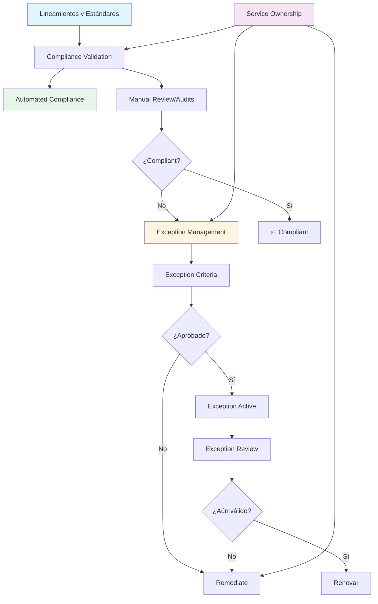
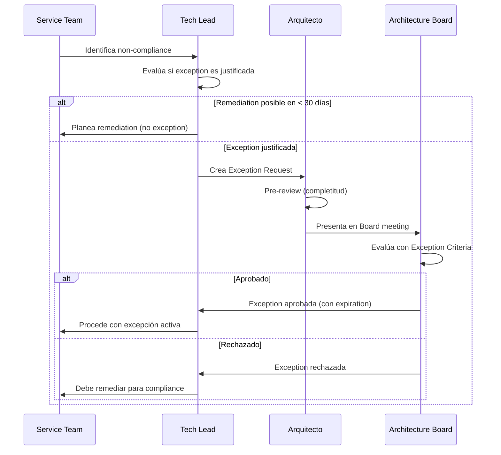
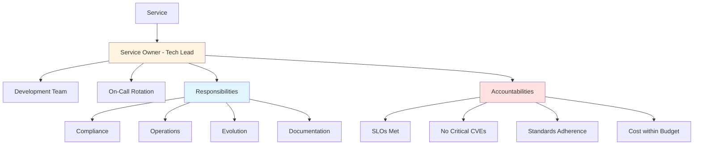

# Compliance y Excepciones

## Contexto

Este estándar define cómo validar compliance con lineamientos y estándares corporativos, gestionar excepciones cuando son necesarias, y establecer ownership claro de servicios. Complementa el lineamiento [Decisiones Arquitectónicas](../../lineamientos/gobierno/01-decisiones-arquitectonicas.md) asegurando accountability y flexibilidad controlada.

**Conceptos incluidos:**

- **Compliance Validation** → Validación manual y automatizada de adherencia a estándares
- **Automated Compliance** → Herramientas y pipelines para compliance checks
- **Exception Management** → Proceso formal para solicitar y aprobar excepciones
- **Exception Criteria** → Criterios objetivos para evaluar excepciones
- **Exception Review** → Revisión periódica de excepciones activas
- **Service Ownership** → Definición clara de responsables y accountability

---

## Stack Tecnológico

| Componente              | Tecnología             | Versión | Uso                                |
| ----------------------- | ---------------------- | ------- | ---------------------------------- |
| **SAST**                | SonarQube Community    | 10.0+   | Static analysis, quality gates     |
| **Container Scanning**  | Trivy                  | 0.50+   | Vulnerabilities en imágenes Docker |
| **IaC Scanning**        | Checkov                | 3.0+    | Security issues en Terraform       |
| **Dependency Scanning** | OWASP Dependency-Check | 9.0+    | CVEs en dependencies               |
| **CI/CD**               | GitHub Actions         | -       | Automated compliance en pipelines  |
| **IaC**                 | Terraform              | 1.7+    | Validación de configuraciones      |
| **Documentación**       | Markdown               | -       | Exception requests, ownership docs |

---

## Conceptos Fundamentales

Este estándar cubre 6 prácticas relacionadas con compliance y excepciones:

### Índice de Conceptos

1. **Compliance Validation**: Validación de adherencia a estándares (manual y automática)
2. **Automated Compliance**: Automatización de checks en CI/CD pipelines
3. **Exception Management**: Proceso para solicitar y aprobar excepciones
4. **Exception Criteria**: Criterios objetivos para evaluar si una excepción es justificada
5. **Exception Review**: Revisión periódica para cerrar excepciones temporales
6. **Service Ownership**: Definición clara de ownership, roles y responsabilidades

### Relación entre Conceptos



**Flujo típico:**

1. **Estándares definidos** → Compliance Validation (automated + manual)
2. **Non-compliance detectado** → Exception Request (si justificado) o Remediation
3. **Exception aprobado** → Active (con expiration date)
4. **Periodic review** → Renovar, Remediar o Cerrar excepción

---

## 1. Compliance Validation

### ¿Qué es Compliance Validation?

Proceso de verificar que servicios, infraestructura y código cumplen con lineamientos, estándares y políticas corporativas.

**Propósito:** Asegurar adherencia consistente a estándares arquitectónicos y de seguridad.

**Tipos de validación:**

1. **Automated Validation**: Ejecutada en CI/CD (SAST, container scanning, linting)
2. **Manual Validation**: Ejecutada en architecture reviews y audits
3. **Continuous Validation**: Monitoreo continuo en producción (drift detection)

**Aspectos evaluados:**

- ✅ **Seguridad**: Encryption, secrets management, RBAC, vulnerabilities
- ✅ **APIs**: REST standards, versionamiento, error handling
- ✅ **Datos**: Database per service, no shared DB, data ownership
- ✅ **Infraestructura**: IaC, tagging, networking, backups
- ✅ **Observabilidad**: Logging, metrics, tracing, dashboards
- ✅ **Testing**: Coverage, tipos de tests, contract testing
- ✅ **Documentación**: arc42, ADRs, runbooks

**Beneficios:**
✅ Detección temprana de desvíos
✅ Consistencia cross-team
✅ Reducción de riesgos
✅ Auditoría facilitada

### Compliance Checklist por Categoría

#### Seguridad

```markdown
### Security Compliance Checklist

- [ ] **Autenticación**: JWT vía Keycloak
- [ ] **Autorización**: RBAC implementado (no solo autenticación)
- [ ] **Secrets**: AWS Secrets Manager (no hardcoded, no en env vars plain text)
- [ ] **Encryption at rest**: RDS/S3 con encryption habilitado
- [ ] **Encryption in transit**: TLS 1.2+ para todas las comunicaciones
- [ ] **Container security**: Imagen escaneada con Trivy, sin Critical CVEs
- [ ] **Dependencies**: Escaneadas con OWASP Dependency-Check, sin High CVEs sin plan
- [ ] **Network**: Security groups con least privilege
- [ ] **Logging**: Audit logs para operaciones sensibles
```

#### APIs

```markdown
### API Compliance Checklist

- [ ] **REST standards**: Recursos con sustantivos plurales, verbos HTTP correctos
- [ ] **Versionamiento**: /api/v1/ en todos los endpoints
- [ ] **Error handling**: RFC 7807 ProblemDetails para 4xx/5xx
- [ ] **Pagination**: Implementada para listas (page, pageSize)
- [ ] **OpenAPI**: Swagger/OpenAPI specification actualizada
- [ ] **Rate limiting**: Implementado para APIs públicas
- [ ] **CORS**: Configurado apropiadamente
- [ ] **Health checks**: /health endpoint implementado
```

#### Datos

```markdown
### Data Compliance Checklist

- [ ] **Database per service**: No shared database entre servicios
- [ ] **Data ownership**: Servicio es dueño de sus propios datos
- [ ] **Migraciones**: Entity Framework Migrations versionadas en Git
- [ ] **Backups**: Automated backups habilitados (RDS)
- [ ] **Connection pooling**: Configurado adecuadamente
- [ ] **Indexes**: Creados para queries frecuentes
- [ ] **Data validation**: FluentValidation para todas las entradas
```

#### Infraestructura

```markdown
### Infrastructure Compliance Checklist

- [ ] **IaC**: 100% de infraestructura en Terraform
- [ ] **Estado remoto**: Terraform state en S3 con locking (DynamoDB)
- [ ] **Tagging**: Todos los recursos con tags: Environment, Service, Owner, CostCenter
- [ ] **Multi-AZ**: Servicios críticos con redundancia multi-AZ
- [ ] **Networking**: VPC con subnets públicas/privadas, NAT Gateway
- [ ] **Monitoring**: CloudWatch alarms para recursos críticos
- [ ] **Cost**: Budget alerts configurados
```

#### Observabilidad

```markdown
### Observability Compliance Checklist

- [ ] **Structured logging**: Serilog con JSON format
- [ ] **Correlation IDs**: X-Correlation-ID en todos los logs
- [ ] **Distributed tracing**: OpenTelemetry instrumentado
- [ ] **Metrics**: Prometheus metrics expuestas (/metrics)
- [ ] **Dashboards**: Grafana dashboard para el servicio
- [ ] **Alerting**: Alertas críticas configuradas (error rate, latency)
- [ ] **SLOs**: SLOs definidos para servicios críticos
```

### Compliance Report Template

```markdown
# Compliance Report - Customer Service

**Service**: Customer Service
**Owner**: Juan Pérez (Tech Lead)
**Date**: 2026-02-18
**Validator**: Roberto Silva (Arquitecto)

---

## Overall Compliance: 87% (🟢 GOOD)

- 🟢 Excellent: 90-100%
- 🟢 Good: 80-89%
- 🟡 Needs Improvement: 70-79%
- 🔴 Critical: < 70%

---

## Compliance by Category

| Categoría       | Score       | Status               |
| --------------- | ----------- | -------------------- |
| Seguridad       | 80% (8/10)  | 🟢 Good              |
| APIs            | 88% (7/8)   | 🟢 Good              |
| Datos           | 100% (7/7)  | 🟢 Excellent         |
| Infraestructura | 86% (6/7)   | 🟢 Good              |
| Observabilidad  | 86% (6/7)   | 🟢 Good              |
| Testing         | 70% (7/10)  | 🟡 Needs Improvement |
| Documentación   | 93% (14/15) | 🟢 Excellent         |

---

## Non-Compliance Items

### 🔴 High Severity (1)

**NC-1: RBAC No Implementado**

- **Standard**: [Security - Identity Access Management](../seguridad/identity-access-management.md)
- **Current State**: Solo autenticación (JWT), sin autorización granular
- **Expected State**: RBAC con roles (Admin, Manager, Viewer)
- **Risk**: Cualquier usuario autenticado puede ejecutar cualquier operación
- **Remediation**: Implementar RBAC con Keycloak roles
- **Timeline**: 30 días
- **Owner**: @juanp

### 🟡 Medium Severity (2)

**NC-2: Contract Testing Ausente**

- **Standard**: [Testing - Contract Testing](../testing/contract-e2e-testing.md)
- **Current State**: Sin contract tests
- **Expected State**: Pact tests para consumers de API
- **Risk**: Breaking changes no detectados
- **Remediation**: Implementar Pact para Order Service y Notification Service
- **Timeline**: 60 días
- **Owner**: @juanp

**NC-3: Error Handling Parcial**

- **Standard**: [APIs - Error Handling](../apis/api-error-handling.md)
- **Current State**: 70% de endpoints usan ProblemDetails
- **Expected State**: 100% de endpoints con RFC 7807
- **Risk**: Inconsistencia para consumers
- **Remediation**: Actualizar endpoints restantes
- **Timeline**: 15 días
- **Owner**: @juanp

### 🟢 Low Severity (3)

**NC-4**: Cost alerts no configurados
**NC-5**: Grafana dashboard sin métricas de negocio
**NC-6**: Rollback automation manual

---

## Exception Requests

### Pending Approval (1)

**EXC-REQ-001: Contract Testing - Aplazamiento**

- **Requested by**: @juanp (2026-02-18)
- **Reason**: Equipo actualmente sin capacity, prioridad en features de negocio
- **Proposed Timeline**: Implementar en Q2 2026 (en vez de 60 días)
- **Status**: ⏳ Pending review por Architecture Board

---

## Action Items

| Item                   | Severity | Owner  | Due Date   | Status                 |
| ---------------------- | -------- | ------ | ---------- | ---------------------- |
| NC-1: RBAC             | High     | @juanp | 2026-03-20 | ⏳ Planned             |
| NC-2: Contract Testing | Medium   | @juanp | 2026-04-20 | ⏳ Exception requested |
| NC-3: Error Handling   | Medium   | @juanp | 2026-03-05 | ⏳ Planned             |
| NC-4: Cost Alerts      | Low      | @juanp | 2026-03-15 | ⏳ Planned             |
| NC-5: Dashboard        | Low      | @juanp | 2026-03-15 | ⏳ Planned             |
| NC-6: Rollback         | Low      | @juanp | 2026-04-01 | ⏳ Planned             |

---

## Next Review: 2026-05-18 (3 meses)
```

---

## 2. Automated Compliance

### ¿Qué es Automated Compliance?

Automatización de compliance checks integrada en CI/CD pipelines, proporcionando feedback inmediato sobre violaciones de estándares.

**Propósito:** Shift-left de compliance, detectando issues antes de deployment.

**Herramientas utilizadas:**

- **SonarQube**: Code quality, security hotspots, code smells
- **Trivy**: Container image scanning (vulnerabilidades, misconfigurations)
- **Checkov**: IaC scanning (Terraform security issues)
- **OWASP Dependency-Check**: Dependency vulnerabilities (CVEs)
- **Markdownlint**: Documentation standards
- **GitHub Actions**: Orquestación de compliance checks

**Beneficios:**
✅ Detección inmediata (en PR)
✅ Prevención de merges non-compliant
✅ Cultura de compliance
✅ Reducción de manual effort

### GitHub Actions Pipeline Completo

```yaml
# .github/workflows/compliance-checks.yml
name: Compliance Checks

on:
  pull_request:
    branches: [main, develop]
  push:
    branches: [main]

jobs:
  # 1. SAST con SonarQube
  sonarqube:
    name: SonarQube Analysis
    runs-on: ubuntu-latest
    steps:
      - uses: actions/checkout@v4
        with:
          fetch-depth: 0 # Shallow clones disabled para analysis

      - name: Setup .NET
        uses: actions/setup-dotnet@v4
        with:
          dotnet-version: "8.0.x"

      - name: Restore dependencies
        run: dotnet restore

      - name: Build
        run: dotnet build --no-restore --configuration Release

      - name: Test with coverage
        run: dotnet test --no-build --configuration Release /p:CollectCoverage=true /p:CoverletOutputFormat=opencover

      - name: SonarQube Scan
        uses: sonarsource/sonarqube-scan-action@v2
        env:
          SONAR_TOKEN: ${{ secrets.SONAR_TOKEN }}
          SONAR_HOST_URL: ${{ secrets.SONAR_HOST_URL }}
        with:
          args: >
            -Dsonar.projectKey=customer-service
            -Dsonar.cs.opencover.reportsPaths=**/coverage.opencover.xml
            -Dsonar.qualitygate.wait=true

      - name: Check Quality Gate
        run: |
          # Quality Gate debe pasar para merge
          if [ "${{ steps.sonarqube.outputs.qualityGateStatus }}" != "PASSED" ]; then
            echo "❌ SonarQube Quality Gate FAILED"
            exit 1
          fi
          echo "✅ SonarQube Quality Gate PASSED"

  # 2. Container Scanning con Trivy
  trivy-scan:
    name: Trivy Container Scan
    runs-on: ubuntu-latest
    steps:
      - uses: actions/checkout@v4

      - name: Build Docker Image
        run: docker build -t customer-service:${{ github.sha }} .

      - name: Run Trivy scan
        uses: aquasecurity/trivy-action@master
        with:
          image-ref: customer-service:${{ github.sha }}
          format: "sarif"
          output: "trivy-results.sarif"
          severity: "CRITICAL,HIGH"
          exit-code: "1" # Fail si hay Critical o High

      - name: Upload Trivy results to GitHub Security tab
        uses: github/codeql-action/upload-sarif@v3
        if: always()
        with:
          sarif_file: "trivy-results.sarif"

  # 3. IaC Scanning con Checkov
  checkov-scan:
    name: Checkov IaC Scan
    runs-on: ubuntu-latest
    steps:
      - uses: actions/checkout@v4

      - name: Run Checkov
        uses: bridgecrewio/checkov-action@master
        with:
          directory: terraform/
          framework: terraform
          output_format: sarif
          output_file_path: checkov-results.sarif
          soft_fail: false # Fail pipeline si hay issues
          skip_check: CKV_AWS_20,CKV_AWS_23 # Excepciones aprobadas

      - name: Upload Checkov results
        uses: github/codeql-action/upload-sarif@v3
        if: always()
        with:
          sarif_file: "checkov-results.sarif"

  # 4. Dependency Scanning
  dependency-check:
    name: OWASP Dependency Check
    runs-on: ubuntu-latest
    steps:
      - uses: actions/checkout@v4

      - name: Setup .NET
        uses: actions/setup-dotnet@v4
        with:
          dotnet-version: "8.0.x"

      - name: Run OWASP Dependency-Check
        uses: dependency-check/Dependency-Check_Action@main
        with:
          project: "customer-service"
          path: "."
          format: "JSON"
          args: >
            --failOnCVSS 7
            --suppression suppression.xml

      - name: Upload Dependency-Check results
        uses: actions/upload-artifact@v4
        with:
          name: dependency-check-report
          path: dependency-check-report.json

  # 5. Documentation Linting
  markdown-lint:
    name: Markdown Lint
    runs-on: ubuntu-latest
    steps:
      - uses: actions/checkout@v4

      - name: Lint Markdown files
        uses: articulate/markdown-lint-action@v1
        with:
          config: .markdownlint.json
          files: "docs/**/*.md"

  # 6. API Contract Validation
  api-contract-validation:
    name: OpenAPI Validation
    runs-on: ubuntu-latest
    steps:
      - uses: actions/checkout@v4

      - name: Validate OpenAPI spec
        uses: char0n/swagger-editor-validate@v1
        with:
          definition-file: docs/openapi.yaml

      - name: Check breaking changes
        run: |
          # Comparar con versión anterior (usar oasdiff)
          docker run --rm -v $(pwd):/specs \
            tufin/oasdiff breaking /specs/docs/openapi-prev.yaml /specs/docs/openapi.yaml

  # 7. Architecture Decision Records validation
  adr-validation:
    name: ADR Validation
    runs-on: ubuntu-latest
    steps:
      - uses: actions/checkout@v4

      - name: Validate ADR format
        run: |
          bash scripts/validate-adrs.sh

  # 8. Compliance Report Summary
  compliance-summary:
    name: Compliance Summary
    runs-on: ubuntu-latest
    needs:
      [sonarqube, trivy-scan, checkov-scan, dependency-check, markdown-lint]
    if: always()
    steps:
      - name: Generate Summary
        run: |
          echo "## 📊 Compliance Check Results" >> $GITHUB_STEP_SUMMARY
          echo "" >> $GITHUB_STEP_SUMMARY

          echo "| Check | Status |" >> $GITHUB_STEP_SUMMARY
          echo "|-------|--------|" >> $GITHUB_STEP_SUMMARY
          echo "| SonarQube | ${{ needs.sonarqube.result == 'success' && '✅ PASSED' || '❌ FAILED' }} |" >> $GITHUB_STEP_SUMMARY
          echo "| Trivy | ${{ needs.trivy-scan.result == 'success' && '✅ PASSED' || '❌ FAILED' }} |" >> $GITHUB_STEP_SUMMARY
          echo "| Checkov | ${{ needs.checkov-scan.result == 'success' && '✅ PASSED' || '❌ FAILED' }} |" >> $GITHUB_STEP_SUMMARY
          echo "| Dependency Check | ${{ needs.dependency-check.result == 'success' && '✅ PASSED' || '❌ FAILED' }} |" >> $GITHUB_STEP_SUMMARY
          echo "| Markdown Lint | ${{ needs.markdown-lint.result == 'success' && '✅ PASSED' || '❌ FAILED' }} |" >> $GITHUB_STEP_SUMMARY
```

### Quality Gates Configuration

```ini
# sonar-project.properties
sonar.projectKey=customer-service
sonar.projectName=Customer Service
sonar.sources=src
sonar.tests=tests
sonar.cs.opencover.reportsPaths=**/coverage.opencover.xml

# Quality Gates (configurado en SonarQube)
# - Coverage > 80%
# - Duplications < 3%
# - Maintainability Rating: A
# - Reliability Rating: A
# - Security Rating: A
# - Security Hotspots Reviewed: 100%
# - New Code Coverage > 85%
```

---

## 3. Exception Management

### ¿Qué es Exception Management?

Proceso formal para solicitar, evaluar y aprobar excepciones temporales o permanentes a lineamientos y estándares cuando hay justificación válida.

**Propósito:** Flexibilidad controlada sin comprometer governance.

**Tipos de excepciones:**

1. **Temporal**: Excepción con fecha de expiración (ej. "3 meses para implementar RBAC")
2. **Permanente**: Excepción sin fecha de expiración (ej. "servicio legacy usa SQL Server en vez de PostgreSQL")
3. **Conditional**: Excepción que aplica solo bajo ciertas condiciones

**Cuándo es válido pedir excepción:**

- ✅ Restricción técnica legítima (ej. proveedor externo no soporta estándar)
- ✅ Costo prohibitivo sin ROI claro
- ✅ Timeline de negocio crítico y compliance delay rollout significativamente
- ✅ Risk mitigado con controles compensatorios

**Cuándo NO es válido:**

- ❌ "No tenemos tiempo" (temporal exception en vez de permanente)
- ❌ "No sabemos cómo" (training required, not exception)
- ❌ Preferencia personal del equipo
- ❌ Evitar esfuerzo

**Beneficios:**
✅ Flexibilidad pragmática
✅ Trazabilidad de desvíos
✅ Revisión periódica forzada
✅ Decisiones documentadas

### Proceso de Exception Request



### Exception Request Template

```markdown
# Exception Request - EXC-REQ-042

**Service**: Customer Service
**Requested by**: Juan Pérez (Tech Lead)
**Date**: 2026-02-18
**Type**: Temporal

---

## Standard / Lineamiento

**Standard**: [Testing - Contract Testing](../testing/contract-e2e-testing.md)
**Requirement**: Implementar contract tests para servicios que exponen APIs consumidas por otros servicios

---

## Non-Compliance Description

Customer Service API es consumida por Order Service y Notification Service, pero actualmente no tiene contract tests implementados (solo unit e integration tests).

---

## Justification for Exception

### Business Context

- Equipo Customer tiene roadmap agresivo Q1 2026 con features críticas de negocio
- Implementar contract testing requiere:
  - 2 semanas de effort (setup Pact, crear tests, integrar a CI/CD)
  - Coordinación con equipos consumers (Order y Notification)
- Features actuales tienen deadline inflexible (lanzamiento producto nuevo)

### Risk Assessment

**Risk si se mantiene excepción:**

- 🟡 **Medium**: Breaking changes no detectados automáticamente
- Mitigación actual: Manual coordination con Order/Notification teams antes de releases

**Risk si no se aprueba excepción:**

- 🔴 **High**: Delay de 2 semanas impacta lanzamiento de producto (revenue loss estimado $50K)

### Compensating Controls

Mientras excepción esté activa:

1. ✅ Manual testing con Order/Notification teams antes de cada release
2. ✅ Changelog detallado de cambios de API publicado en Slack #api-changes
3. ✅ Semantic versioning estricto (breaking changes = major version bump)
4. ✅ Deprecation period de 90 días para endpoints

---

## Proposed Timeline

**Exception Duration**: 90 días (hasta 2026-05-20)

**Remediation Plan**:

- **2026-04-01**: Completar features críticas Q1
- **2026-04-01 - 2026-04-15**: Implementar Pact para Customer → Order contract
- **2026-04-15 - 2026-05-01**: Implementar Pact para Customer → Notification contract
- **2026-05-01 - 2026-05-15**: Integrar a CI/CD y documentation
- **2026-05-20**: Exception expires, fully compliant

---

## Alternatives Considered

### Alternative 1: Implementar contract testing ahora

**Pros**:

- ✅ Cumple estándar inmediatamente
- ✅ Protección contra breaking changes

**Contras**:

- ❌ 2 semanas delay en features ($50K revenue loss)
- ❌ Impacta lanzamiento producto

**Decision**: Rechazada por business impact

### Alternative 2: Implementar solo para Order Service (50%)

**Pros**:

- ✅ Compliance parcial
- ✅ Solo 1 semana delay

**Contras**:

- ❌ Aún viola estándar (50% != 100%)
- ❌ Notification Service sin protección

**Decision**: Rechazada, all-or-nothing approach preferido

---

## Business Impact if Exception Denied

- 🔴 **Revenue**: $50K loss por delay de lanzamiento
- 🟡 **Team Morale**: Frustración por "governance blocking business"
- 🟡 **Reputación**: Compromiso con cliente externo en riesgo

---

## Approval Request

**Exception Type**: ⏳ Temporal (90 días)
**Expiration Date**: 2026-05-20
**Review Date**: 2026-03-15 (mitad del periodo)

**Requested approval from**: Architecture Board

---

## Supporting Documents

- [Customer Service API OpenAPI Spec](../docs/openapi.yaml)
- [Q1 2026 Roadmap](../roadmap/2026-Q1.md)
- [Business Case - New Product Launch](../business-cases/product-launch-2026.md)

---

**Submitted**: 2026-02-18
**Status**: ⏳ Pending Review
```

---

## 4. Exception Criteria

### ¿Qué son los Exception Criteria?

Criterios objetivos y transparentes para evaluar si una excepción debe ser aprobada, asegurando consistencia en decisiones del Architecture Board.

**Propósito:** Decisiones de excepciones predecibles, justas y documentadas.

**Criterios de evaluación (scoring 0-10):**

### Evaluation Framework

**1. Business Impact (peso: 30%)**

- **10 pts**: Denial causa revenue loss significativo (> $100K) o incumplimiento contractual
- **7 pts**: Denial causa delay en features con impacto moderado
- **4 pts**: Denial causa inconveniencia, no bloquea negocio
- **0 pts**: Sin impacto de negocio

**2. Technical Justification (peso: 25%)**

- **10 pts**: Restricción técnica legítima fuera de control (vendor limitation)
- **7 pts**: Alternativa compliant es significativamente más compleja/costosa
- **4 pts**: Preferencia técnica, pero alternativa compliant viable
- **0 pts**: Sin justificación técnica válida

**3. Risk & Compensating Controls (peso: 25%)**

- **10 pts**: Riesgo mitigado completamente con controles compensatorios
- **7 pts**: Riesgo parcialmente mitigado, residual risk acceptable
- **4 pts**: Controles compensatorios débiles o inexistentes
- **0 pts**: Risk inaceptable sin mitigación

**4. Remediation Plan (peso: 20%)**

- **10 pts**: Plan claro, timeline realista, recursos asignados
- **7 pts**: Plan presente pero timeline o recursos inciertos
- **4 pts**: Plan vago o timeline no realista
- **0 pts**: Sin plan de remediation

**Umbral de aprobación:**

- **≥ 70%**: Aprobación automática (Tech Lead puede aprobar)
- **60-69%**: Requiere aprobación Architecture Board
- **< 60%**: Rechazado

### Exception Evaluation Template

```markdown
# Exception Evaluation - EXC-REQ-042

**Service**: Customer Service
**Standard**: Contract Testing
**Evaluator**: Roberto Silva (Arquitecto)
**Date**: 2026-02-20

---

## Scoring

### 1. Business Impact (30%)

**Score**: 9/10 (27%)

**Rationale**:

- Revenue loss de $50K si se deniega (producto launch delay)
- Compromiso con cliente externo en riesgo
- Timeline inflexible por razones de negocio válidas

**Evidence**:

- Business case documentado con revenue projections
- Contrato con cliente firmado con deadline 2026-03-31

---

### 2. Technical Justification (25%)

**Score**: 6/10 (15%)

**Rationale**:

- No hay restricción técnica que impida implementar contract testing
- Es una cuestión de priorización, no de viabilidad técnica
- Alternativa compliant es viable pero requiere 2 semanas effort

**Notes**:

- No es vendor limitation
- Equipo tiene skills para implementar (no require training)

---

### 3. Risk & Compensating Controls (25%)

**Score**: 7/10 (17.5%)

**Rationale**:

- Compensating controls razonables:
  - Manual testing con consumer teams
  - Changelog detallado
  - Semantic versioning estricto
  - Deprecation period de 90 días
- Residual risk es Medium (no High ni Critical)

**Risk Assessment**:

- Breaking changes podrían ocurrir pero con baja probabilidad dado manual coordination
- Impact de breaking change es medium (no critical systems affected)

---

### 4. Remediation Plan (20%)

**Score**: 9/10 (18%)

**Rationale**:

- Plan muy detallado con milestones claros
- Timeline realista (90 días suficientes para implementar)
- Recursos claramente asignados (Customer Team post-Q1 features)
- Review intermedia agendada

**Remediation Plan Summary**:

- Apr 1: Complete Q1 features
- Apr 1-15: Pact with Order Service
- Apr 15-May 1: Pact with Notification Service
- May 1-15: CI/CD integration
- May 20: Fully compliant

---

## Overall Score: 77.5% (🟢 APPROVED)

**Breakdown**:

- Business Impact: 27%
- Technical Justification: 15%
- Risk & Controls: 17.5%
- Remediation Plan: 18%
- **Total: 77.5%**

**Threshold**:

- ≥ 70%: ✅ Approval
- 60-69%: Board decision required
- < 60%: ❌ Rejection

---

## Recommendation

✅ **APPROVE** with conditions:

**Conditions**:

1. **Mandatory mid-term review** on 2026-03-15 to verify compensating controls are working
2. **Hard expiration** on 2026-05-20 (no extension allowed)
3. **Bi-weekly updates** to Architecture Board on remediation progress
4. If breaking change occurs during exception period, exception is **void** and immediate remediation required

---

## Board Decision

**Approved by**: Architecture Board (unanimous)
**Date**: 2026-02-20
**Exception ID**: EXC-042
**Expiration**: 2026-05-20

**Notes from Board**:

- Solid business justification
- Good compensating controls
- Clear remediation plan
- Set precedent: "business deadlines alone not sufficient, need complete package (justification + controls + plan)"

---

**Evaluator Signature**: Roberto Silva
**Board Chair Signature**: CTO
```

---

## 5. Exception Review

### ¿Qué es Exception Review?

Proceso periódico de revisión de excepciones activas para determinar si deben renovarse, cerrarse (compliance alcanzado) o revocar.

**Propósito:** Evitar que excepciones temporales se vuelvan permanentes por inercia.

**Frecuencia de reviews:**

- **Temporal Exceptions**: Review en 50% del periodo + al expirar
- **Permanent Exceptions**: Review anual
- **All Exceptions**: Revisión en Architecture Retrospectives trimestrales

**Resultados posibles:**

1. **Close (Compliant)**: Remediation completada, exception cerrada
2. **Extend**: Extender periodo (solo con justificación válida)
3. **Revoke**: Exception revocada, remediation obligatoria inmediata
4. **Convert to Permanent**: Convertir temporal a permanente (excepcional)

**Beneficios:**
✅ Prevent compliance drift
✅ Accountability forzada
✅ Decisiones revisitadas
✅ Technical debt tracking

### Exception Registry

```markdown
# Exception Registry

**Last Updated**: 2026-02-18

---

## Active Exceptions

| ID      | Service              | Standard                    | Type      | Expiration | Status            | Owner    |
| ------- | -------------------- | --------------------------- | --------- | ---------- | ----------------- | -------- |
| EXC-042 | Customer Service     | Contract Testing            | Temporal  | 2026-05-20 | ✅ Active         | @juanp   |
| EXC-038 | Payment Service      | PostgreSQL (usa SQL Server) | Permanent | N/A        | ✅ Active         | @anat    |
| EXC-045 | Order Service        | Redis Caching               | Temporal  | 2026-04-01 | ⚠️ Overdue Review | @carlosr |
| EXC-051 | Notification Service | RBAC                        | Temporal  | 2026-06-30 | ✅ Active         | @mariam  |

---

## Expired Exceptions (30 días)

| ID      | Service          | Standard            | Closed Date | Outcome                                |
| ------- | ---------------- | ------------------- | ----------- | -------------------------------------- |
| EXC-040 | Customer Service | IaC (partial)       | 2026-02-10  | ✅ Compliant - Terraform 100%          |
| EXC-035 | Order Service    | Dependency Scanning | 2026-01-25  | ✅ Compliant - OWASP Check implemented |

---

## Statistics

- **Active Exceptions**: 4
- **Average Duration**: 105 días
- **Compliance Rate (after exception)**: 85% (close successfully)
- **Extension Rate**: 10%
- **Revocation Rate**: 5%
```

### Exception Review Meeting Template

```markdown
# Exception Review Meeting - March 2026

**Date**: 2026-03-15
**Attendees**: Architecture Board
**Facilitator**: Roberto Silva

---

## Agenda

1. Mid-term reviews (excepciones en 50% periodo)
2. Expiring soon (próximas 30 días)
3. Overdue reviews

---

## 1. Mid-Term Reviews

### EXC-042: Customer Service - Contract Testing

**Background**:

- Excepción aprobada 2026-02-20
- Duración: 90 días (expira 2026-05-20)
- Motivo: Q1 features prioritized, implement Pact in Q2

**Progress**:

- ✅ Q1 features completed on time (2026-03-31)
- ✅ Pact POC completed with Order Service
- ⚠️ Notification Service Pact not started yet

**Compensating Controls Status**:

- ✅ Manual testing with consumers: Working well, no breaking changes
- ✅ Changelog: Publicado consistentemente
- ✅ Semantic versioning: Seguido
- ✅ Deprecation period: N/A (no deprecations this period)

**Decision**: ✅ **CONTINUE** (on track for compliance by 2026-05-20)

**Actions**:

- Start Notification Service Pact next week (2026-03-18)
- Follow-up review: 2026-04-15

---

## 2. Expiring Soon

### EXC-045: Order Service - Redis Caching

**Background**:

- Excepción aprobada 2025-12-01
- Duración: 120 días (expira 2026-04-01) - ⏰ 17 días restantes
- Motivo: Performance acceptable sin cache, evitar complejidad

**Status**:

- Performance degradó significativamente (P95 latency 500ms → 1200ms)
- Caching ahora necesario, no optional
- Implementación en progreso (60% completo)

**Risk**:

- Si no completa para 2026-04-01, service no cumple SLO (P95 < 500ms)

**Decision**: ⚠️ **EXTEND 30 días** (nuevo expiration: 2026-05-01)

**Conditions**:

- Weekly updates to Board obligatorio
- Hard deadline: 2026-05-01 (no further extensions)

---

## 3. Overdue Reviews

### EXC-045: Order Service - Redis Caching

_(Same as previous, review was overdue)_

**Action**: Review completed today, extended as above

---

## Statistics This Quarter

- **Reviewed**: 3 exceptions
- **Closed (Compliant)**: 1 (EXC-040)
- **Extended**: 1 (EXC-045)
- **Continuing**: 1 (EXC-042)
- **Revoked**: 0

**Trend**: ✅ Mejorando (85% compliance rate after exception period)
```

---

## 6. Service Ownership

### ¿Qué es Service Ownership?

Definición clara y documentada de quién es responsable de cada servicio, sus obligaciones y mecanismos de accountability.

**Propósito:** Accountability clara para compliance, operación y evolución de servicios.

**Principio fundamental:** "You build it, you run it" (Amazon/DevOps culture)

**Responsabilidades del Owner:**

- ✅ **Compliance**: Asegurar adherencia a estándares y lineamientos
- ✅ **Operación**: Disponibilidad, performance, incident response
- ✅ **Evolución**: Mantener arquitectura actualizada, technical debt
- ✅ **Documentación**: arc42, ADRs, runbooks actualizados
- ✅ **Security**: Patching, vulnerability management
- ✅ **Costos**: Cost awareness y optimization

**Beneficios:**
✅ Accountability clara
✅ No "orphan services"
✅ Decisiones más rápidas
✅ Ownership culture

### Service Ownership Model



### Service Ownership Registry

````markdown
# Service Ownership Registry

**Last Updated**: 2026-02-18

---

| Service              | Owner (Tech Lead)      | Team              | On-Call             | Slack Channel         | Repository                 |
| -------------------- | ---------------------- | ----------------- | ------------------- | --------------------- | -------------------------- |
| Customer Service     | Juan Pérez (@juanp)    | Customer Team     | customer-oncall     | #customer-service     | talma/customer-service     |
| Order Service        | Carlos Ruiz (@carlosr) | Order Team        | order-oncall        | #order-service        | talma/order-service        |
| Payment Service      | Ana Torres (@anat)     | Payment Team      | payment-oncall      | #payment-service      | talma/payment-service      |
| Notification Service | María Medina (@mariam) | Notification Team | notification-oncall | #notification-service | talma/notification-service |
| Auth Service         | Luis García (@luisg)   | Platform Team     | platform-oncall     | #auth-service         | talma/auth-service         |

---

## Ownership Responsibilities

### Service Owner (Tech Lead)

#### Compliance (20% effort)

- Mantener compliance con estándares corporativos
- Gestionar excepciones si necesarias
- Participar en architecture reviews y audits
- Actualizar servicio con nuevos lineamientos

#### Operations (30% effort)

- Asegurar SLOs cumplidos
- Participar en on-call rotation
- Incident response y post-mortems
- Capacity planning

#### Evolution (30% effort)

- Roadmap técnico del servicio
- Technical debt management
- Performance optimization
- Feature development

#### Documentation (10% effort)

- Mantener arc42 actualizada
- Crear ADRs para decisiones significativas
- Runbooks actualizados
- API documentation

#### Security (10% effort)

- Vulnerability management (patching)
- Security reviews
- Secrets rotation
- Access control

---

## Team Responsibilities

### Development Team

- Implementar features y fixes
- Code reviews
- Unit e integration testing
- Documentation

### On-Call Rotation

- 24/7 incident response
- Monitor alerts
- Triage issues
- Escalate cuando necesario

**Rotation**: 1 semana por persona
**Schedule**: Ver PagerDuty schedule

---

## Accountability Metrics

### Service Owner Dashboard

| Owner    | Service      | SLO Compliance | Open Critical CVEs | Compliance Score | Cost vs Budget |
| -------- | ------------ | -------------- | ------------------ | ---------------- | -------------- |
| @juanp   | Customer     | 99.5% ✅       | 0 ✅               | 87% ✅           | 95% ✅         |
| @carlosr | Order        | 98.2% ⚠️       | 1 ⚠️               | 92% ✅           | 105% ⚠️        |
| @anat    | Payment      | 99.9% ✅       | 0 ✅               | 78% ⚠️           | 88% ✅         |
| @mariam  | Notification | 97.5% ⚠️       | 0 ✅               | 85% ✅           | 92% ✅         |
| @luisg   | Auth         | 99.95% ✅      | 0 ✅               | 95% ✅           | 90% ✅         |

**Legend**:

- ✅ Green: Target met
- ⚠️ Yellow: Below target but acceptable
- 🔴 Red: Critical, requires action

---

## Ownership Transitions

### Process for Transferring Ownership

Cuando un Tech Lead cambia de rol o servicio:

1. **Notification** (30 días antes): Notificar Architecture Board
2. **Knowledge Transfer**: 2 semanas overlap con nuevo owner
3. **Documentation Review**: Verificar docs actualizadas
4. **Access Transfer**: Permisos, secrets, credentials
5. **Formal Handover**: Reunión con Board para confirmar

**Template**:

```markdown
# Ownership Transition - Customer Service

**From**: Juan Pérez (@juanp)
**To**: María López (@marial)
**Date**: 2026-03-01
**Reason**: Juan promoted to Engineering Manager

---

## Knowledge Transfer Checklist

- [ ] Architecture overview session
- [ ] Review arc42 documentation together
- [ ] Walkthrough ADRs (specially recent ones)
- [ ] Review runbooks and incident history (last 6 months)
- [ ] On-call shadow shift (1 week)
- [ ] Introduce to stakeholders (Product Owner, consumers)
- [ ] Review open issues and roadmap
- [ ] Transfer GitHub admin access
- [ ] Transfer AWS IAM roles
- [ ] Transfer PagerDuty on-call
- [ ] Update ownership registry

**Completion Date**: 2026-03-15
**Verified by**: Architecture Board
```
````

````

---

## Implementación Integrada

### Setup Completo

```bash
#!/bin/bash
# setup-compliance.sh

# 1. Estructura de directorios
mkdir -p docs/gobierno/{exceptions,compliance-reports}

# 2. Crear Exception Request Template
cat > docs/templates/exception-request-template.md << 'EOF'
# Exception Request - EXC-REQ-XXX

**Service**: [Service Name]
**Requested by**: [Name] ([Role])
**Date**: [YYYY-MM-DD]
**Type**: [Temporal | Permanent]

## Standard / Lineamiento
[Link to standard]

## Non-Compliance Description
[Describe current state vs expected]

## Justification for Exception
[Business context, risk assessment, compensating controls]

## Proposed Timeline
[For temporal: duration and remediation plan]

## Alternatives Considered
[At least 2 alternatives]

## Business Impact if Exception Denied
[Quantify if possible]
EOF

# 3. Crear Exception Registry
cat > docs/gobierno/exceptions/registry.md << 'EOF'
# Exception Registry

[Ver template completo mostrado anteriormente]
EOF

# 4. Crear Service Ownership Registry
cat > docs/gobierno/service-ownership-registry.md << 'EOF'
# Service Ownership Registry

[Ver template completo mostrado anteriormente]
EOF

# 5. Configurar automated compliance checks
mkdir -p .github/workflows
cat > .github/workflows/compliance-checks.yml << 'EOF'
# [Ver workflow YAML completo mostrado anteriormente]
EOF

# 6. Configurar SonarQube quality gates
cat > sonar-project.properties << 'EOF'
sonar.projectKey=customer-service
# [Ver configuración completa]
EOF

# 7. Configurar Trivy para container scanning
cat > trivy.yaml << 'EOF'
severity: CRITICAL,HIGH
exit-code: 1
ignore-unfixed: true
EOF

# 8. Configurar Checkov para IaC
cat > .checkov.yaml << 'EOF'
skip-check:
  - CKV_AWS_20  # Exception EXC-XXX approved
framework: terraform
directory: terraform/
EOF

echo "✅ Compliance framework setup completed!"
````

---

## Requisitos Técnicos

### MUST (Obligatorio)

**Compliance Validation:**

- **MUST** validar compliance en CI/CD pipeline antes de merge
- **MUST** realizar auditorías manuales trimestrales para servicios críticos
- **MUST** generar compliance report con findings clasificados
- **MUST** establecer remediation plan para High/Critical findings

**Automated Compliance:**

- **MUST** ejecutar SAST (SonarQube) en cada PR
- **MUST** escanear containers con Trivy (Critical/High CVEs block merge)
- **MUST** escanear IaC con Checkov
- **MUST** escanear dependencies con OWASP Dependency-Check

**Exception Management:**

- **MUST** solicitar excepción formalmente para non-compliance intencional
- **MUST** aprobar excepciones vía Architecture Board
- **MUST** documentar excepciones en Exception Registry
- **MUST** establecer expiration date para excepciones temporales

**Exception Review:**

- **MUST** revisar excepciones temporales al 50% del periodo y al expirar
- **MUST** revisar excepciones permanentes anualmente
- **MUST** revocar excepciones si compensating controls fallan

**Service Ownership:**

- **MUST** asignar Tech Lead como Service Owner
- **MUST** documentar ownership en Service Registry
- **MUST** Service Owner accountable por compliance del servicio

### SHOULD (Fuertemente recomendado)

- **SHOULD** automatizar máximo de compliance checks posible
- **SHOULD** integrar compliance results a GitHub Security tab
- **SHOULD** establecer quality gates (SonarQube) con umbrales claros
- **SHOULD** publicar compliance dashboard con métricas agregadas
- **SHOULD** incluir compliance score en Service Owner dashboard
- **SHOULD** realizar exception reviews en Architecture Retrospectives

### MAY (Opcional)

- **MAY** usar herramientas adicionales (Snyk, Prisma Cloud, etc.)
- **MAY** implementar compliance scoring automatizado
- **MAY** crear bot de Slack para notificaciones de compliance
- **MAY** gamificar compliance (teams competition)

### MUST NOT (Prohibido)

- **MUST NOT** merge código con Critical/High security findings sin Plan
- **MUST NOT** omitir compliance checks en CI/CD
- **MUST NOT** aprobar excepciones sin evaluation formal
- **MUST NOT** permitir excepciones temporales sin remediation plan
- **MUST NOT** extender excepciones indefinidamente sin re-evaluation

---

## Referencias

**Compliance y Governance:**

- [NIST Cybersecurity Framework](https://www.nist.gov/cyberframework)
- [CIS Controls](https://www.cisecurity.org/controls/)
- [OWASP Top 10](https://owasp.org/www-project-top-ten/)

**Herramientas:**

- [SonarQube](https://www.sonarqube.org/)
- [Trivy](https://trivy.dev/)
- [Checkov](https://www.checkov.io/)
- [OWASP Dependency-Check](https://owasp.org/www-project-dependency-check/)

**Relacionados:**

- [Architecture Governance](./architecture-governance.md)
- [Lineamientos de Seguridad](../../lineamientos/seguridad/)

---

**Última actualización**: 18 de febrero de 2026
**Responsable**: Architecture Board
