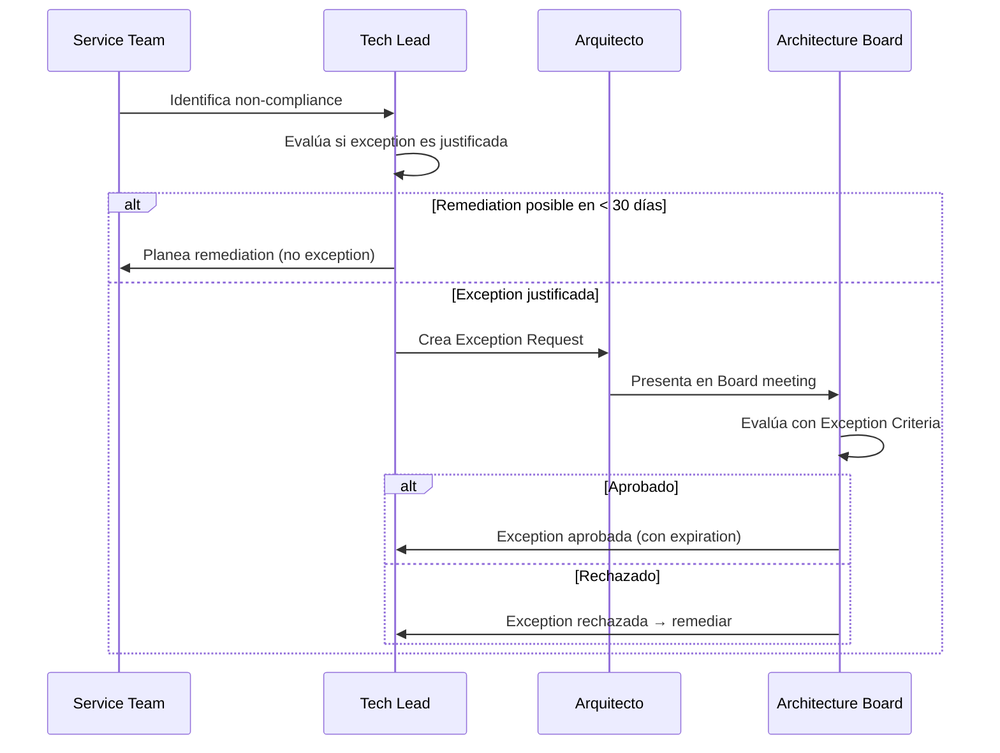

# Exception Management

## Contexto

Este estándar define el proceso para gestionar situaciones en que un servicio no puede cumplir un lineamiento o estándar de forma inmediata, proporcionando flexibilidad controlada sin comprometer el gobierno arquitectónico.

**Conceptos incluidos:**

- **Exception Management** → Proceso formal de solicitud y aprobación de excepciones
- **Exception Criteria** → Scoring objetivo para decidir si aprobar una excepción
- **Exception Review** → Revisión periódica para cerrar excepciones o exigir remediación

---

## Stack Tecnológico

| Componente        | Tecnología     | Versión | Uso                                       |
| ----------------- | -------------- | ------- | ----------------------------------------- |
| **Documentación** | Markdown       | -       | Exception requests, exception registry    |
| **Gestión**       | GitHub         | Latest  | PRs para aprobación, issues para tracking |
| **CI/CD**         | GitHub Actions | Latest  | Recordatorios y seguimiento automático    |

---

## Exception Management

### ¿Qué es Exception Management?

Proceso formal para solicitar, evaluar y aprobar excepciones temporales o permanentes a lineamientos y estándares cuando existe justificación válida.

**Tipos de excepciones:**

| Tipo            | Descripción                          | Ejemplo                                                 |
| --------------- | ------------------------------------ | ------------------------------------------------------- |
| **Temporal**    | Con fecha de expiración              | "90 días para implementar RBAC"                         |
| **Permanente**  | Sin fecha de expiración              | "servicio legacy usa SQL Server en lugar de PostgreSQL" |
| **Conditional** | Aplica solo bajo ciertas condiciones | "Solo para ambientes de desarrollo"                     |

**Cuándo es válido pedir excepción:**

- ✅ Restricción técnica legítima (vendor externo no soporta el estándar)
- ✅ Costo prohibitivo sin ROI claro
- ✅ Timeline de negocio crítico con impacto cuantificable
- ✅ Riesgo mitigado con controles compensatorios sólidos

**Cuándo NO es válido:**

- ❌ "No tenemos tiempo" (sin impacto de negocio cuantificable)
- ❌ "No sabemos cómo" (se requiere capacitación, no excepción)
- ❌ Preferencia personal del equipo
- ❌ Evitar el esfuerzo de cumplir

### Proceso de Exception Request



### Plantilla de Solicitud de Excepción

```markdown
# Solicitud de Excepción — EXC-REQ-NNN

**Servicio**: [Nombre del servicio]
**Solicitado por**: [Nombre] ([Rol])
**Fecha**: YYYY-MM-DD
**Tipo**: Temporal | Permanente

---

## Estándar / Lineamiento

**Estándar**: [Link al estándar]
**Requisito**: [Qué exige el estándar]

---

## Descripción del Incumplimiento

[Describir estado actual vs estado esperado]

---

## Justificación de la Excepción

### Contexto de Negocio

[Contexto de negocio, deadlines, impacto cuantificado]

### Evaluación de Riesgos

**Riesgo si se mantiene la excepción:**
| Riesgo | Severidad | Mitigación |
| ------ | --------- | ---------------- |
| [Riesgo] | 🟡 Medium | [cómo se mitiga] |

### Controles Compensatorios

Mientras la excepción esté activa:

1. [Control compensatorio 1]
2. [Control compensatorio 2]

---

## Cronograma Propuesto

**Duración de la excepción**: [N] días (hasta YYYY-MM-DD)

**Plan de Remediación**:

- YYYY-MM-DD: [Milestone 1]
- YYYY-MM-DD: [Hito 2 — Completamente conforme]

---

## Alternativas Consideradas

### Alternativa 1: Cumplir estándar ahora

**Pros**: ✅ Cumplimiento inmediato
**Contras**: ❌ [impacto concreto]
**Decisión**: [por qué se descartó]

### Alternativa 2: [Opción intermedia]

**Pros**: ✅ [ventaja]
**Contras**: ❌ [desventaja]
**Decisión**: [por qué se descartó]

---

## Impacto si se Niega la Excepción

- [Impacto cuantificado si es posible]

---

**Enviado**: YYYY-MM-DD
**Estado**: ⏳ Pendiente de revisión
```

---

## Exception Criteria

### ¿Qué son los Exception Criteria?

Criterios objetivos y transparentes para evaluar si una excepción debe aprobarse, asegurando consistencia en decisiones del Architecture Board.

**Scoring framework (total 100 puntos):**

### Criterios de Evaluación

**1. Impacto de Negocio (peso 30%)**

| Score | Condición                                                                              |
| ----- | -------------------------------------------------------------------------------------- |
| 10    | Denegar causa pérdida de ingresos significativa (> $100K) o incumplimiento contractual |
| 7     | Denegar causa retraso en funcionalidades con impacto moderado cuantificado             |
| 4     | Denegar causa inconveniencia pero no bloquea el negocio                                |
| 0     | Sin impacto de negocio                                                                 |

**2. Justificación Técnica (peso 25%)**

| Score | Condición                                                                |
| ----- | ------------------------------------------------------------------------ |
| 10    | Restricción técnica legítima fuera de control (limitación del proveedor) |
| 7     | Alternativa conforme es significativamente más compleja o costosa        |
| 4     | Preferencia técnica, pero alternativa conforme es viable                 |
| 0     | Sin justificación técnica válida                                         |

**3. Riesgo y Controles Compensatorios (peso 25%)**

| Score | Condición                                                          |
| ----- | ------------------------------------------------------------------ |
| 10    | Riesgo completamente mitigado con controles compensatorios sólidos |
| 7     | Riesgo parcialmente mitigado, riesgo residual aceptable            |
| 4     | Controles compensatorios débiles o inexistentes                    |
| 0     | Riesgo inaceptable sin mitigación                                  |

**4. Plan de Remediación (peso 20%)**

| Score | Condición                                                            |
| ----- | -------------------------------------------------------------------- |
| 10    | Plan claro, timeline realista, recursos asignados, hitos específicos |
| 7     | Plan presente pero timeline o recursos inciertos                     |
| 4     | Plan vago o timeline no realista                                     |
| 0     | Sin plan de remediación                                              |

**Umbral de decisión:**

| Score  | Decisión                                                    |
| ------ | ----------------------------------------------------------- |
| ≥ 70%  | ✅ Aprobación (Tech Lead puede pre-aprobar, Board ratifica) |
| 60-69% | ⚠️ Requiere aprobación formal del Architecture Board        |
| < 60%  | ❌ Rechazado — se debe remediar                             |

### Plantilla de Evaluación (simplificada)

```markdown
# Evaluación de Excepción — EXC-REQ-NNN

**Evaluador**: [Arquitecto] | **Fecha**: YYYY-MM-DD

## Puntuación

| Criterio                          | Peso | Score | Puntaje |
| --------------------------------- | ---- | ----- | ------- |
| Impacto de Negocio                | 30%  | X/10  | XX%     |
| Justificación Técnica             | 25%  | X/10  | XX%     |
| Riesgo y Controles Compensatorios | 25%  | X/10  | XX%     |
| Plan de Remediación               | 20%  | X/10  | XX%     |
| **Total**                         |      |       | **XX%** |

## Justificación por Criterio

**Impacto de Negocio**: [Justificación del score]
**Justificación Técnica**: [Justificación del score]
**Riesgo y Controles**: [Justificación del score]
**Plan de Remediación**: [Justificación del score]

## Recomendación

[✅ APROBAR | ❌ RECHAZAR] [con condiciones: ...]

**Condiciones (si aplica)**:

1. [Condición 1]
2. [Condición 2]

## Decisión del Board

**Decisión**: [Aprobado/Rechazado]
**Fecha**: YYYY-MM-DD
**ID Excepción**: EXC-NNN
**Expiración**: YYYY-MM-DD
```

---

## Revisión de Excepciones

### ¿Qué es la Revisión de Excepciones?

Proceso periódico de revisión de excepciones activas para verificar si se deben renovar, cerrar (compliance alcanzado) o revocar.

**Frecuencia:**

- **Temporal**: Review al 50% del periodo + al expirar
- **Permanente**: Review anual
- **Todas**: Revisión en Architecture Retrospectives trimestrales

**Resultados posibles:**

| Resultado                  | Cuándo aplica                                          |
| -------------------------- | ------------------------------------------------------ |
| **Cerrar (Conforme)**      | Remediación completada exitosamente                    |
| **Extender**               | Progreso demostrable, timeline ajustado (justificado)  |
| **Revocar**                | Controles compensatorios fallaron o riesgo inaceptable |
| **Convertir a Permanente** | Restricción técnica real confirmada (excepcional)      |

### Registro de Excepciones

```markdown
# Registro de Excepciones — [Mes] [YYYY]

## Excepciones Activas

| ID      | Servicio         | Estándar         | Tipo      | Vencimiento | Estado                | Responsable |
| ------- | ---------------- | ---------------- | --------- | ----------- | --------------------- | ----------- |
| EXC-042 | Customer Service | Contract Testing | Temporal  | 2026-05-20  | ✅ Activa             | @juanp      |
| EXC-038 | Payment Service  | PostgreSQL       | Permanent | N/A         | ✅ Activa             | @anat       |
| EXC-045 | Order Service    | Redis Caching    | Temporal  | 2026-04-01  | ⚠️ Revisión Pendiente | @carlosr    |

## Excepciones Cerradas (90 días)

| ID      | Servicio         | Estándar      | Cerrada    | Resultado   |
| ------- | ---------------- | ------------- | ---------- | ----------- |
| EXC-040 | Customer Service | IaC (partial) | 2026-02-10 | ✅ Conforme |

## Estadísticas

- **Activas**: N | **Duración Promedio**: N días
- **Tasa de Cumplimiento Post-Excepción**: XX%
- **Tasa de Extensión**: XX% | **Tasa de Revocación**: XX%
```

### Exception Review Meeting Template

```markdown
# Revisión de Excepciones — [Mes YYYY]

**Fecha**: YYYY-MM-DD | **Facilitador**: [Arquitecto]

---

## Agenda

1. Revisiones a mitad de período (50% del periodo)
2. Por vencer (próximas 30 días)
3. Revisiones atrasadas

---

## EXC-NNN: [Servicio] — [Estándar]

**Antecedentes**: [Resumen de la excepción]

**Avance**:

- ✅ [Hito cumplido]
- ⚠️ [Hito en riesgo]

**Estado de Controles Compensatorios**:

- ✅/❌ [Control 1]: [Estado]
- ✅/❌ [Control 2]: [Estado]

**Decisión**: [✅ CONTINUAR | ✅ CERRAR | ⚠️ EXTENDER | 🚨 REVOCAR]

**Acciones**:

- [Tarea con responsable y fecha límite]

---

## Resumen

| Revisadas | Cerradas | Extendidas | Continúan | Revocadas |
| --------- | -------- | ---------- | --------- | --------- |
| N         | N        | N          | N         | N         |
```

---

## Requisitos Técnicos

### MUST (Obligatorio)

- **MUST** presentar exception request formal para cualquier non-compliance intencional
- **MUST** obtener aprobación del Architecture Board para toda excepción
- **MUST** registrar todas las excepciones en el Exception Registry
- **MUST** asignar expiration date a excepciones temporales
- **MUST** revisar excepciones temporales al 50% del periodo y al expirar
- **MUST** revisar excepciones permanentes anualmente
- **MUST** revocar excepciones si los controles compensatorios fallan

### SHOULD (Fuertemente recomendado)

- **SHOULD** revisar todas las excepciones activas en Architecture Retrospectives trimestrales
- **SHOULD** automatizar recordatorios de review (GitHub Actions a 30 días de expiración)
- **SHOULD** publicar exception registry en el portal de documentación
- **SHOULD** incluir exception trend en governance dashboard

### MUST NOT (Prohibido)

- **MUST NOT** aprobar excepciones sin evaluación formal con scoring
- **MUST NOT** extender excepciones sin justificación documentada y nueva evaluación
- **MUST NOT** convertir excepciones temporales en permanentes por inercia

---

## Referencias

- [Compliance y Validación](./compliance-validation.md) — validación automatizada
- [Ownership de Servicios](./service-ownership.md) — accountability del service owner
- [Architecture Board y Auditorías](./architecture-board-audits.md) — quien aprueba excepciones
- [Lineamiento de Decisiones Arquitectónicas](../../lineamientos/gobierno/decisiones-arquitectonicas.md) — lineamiento base
