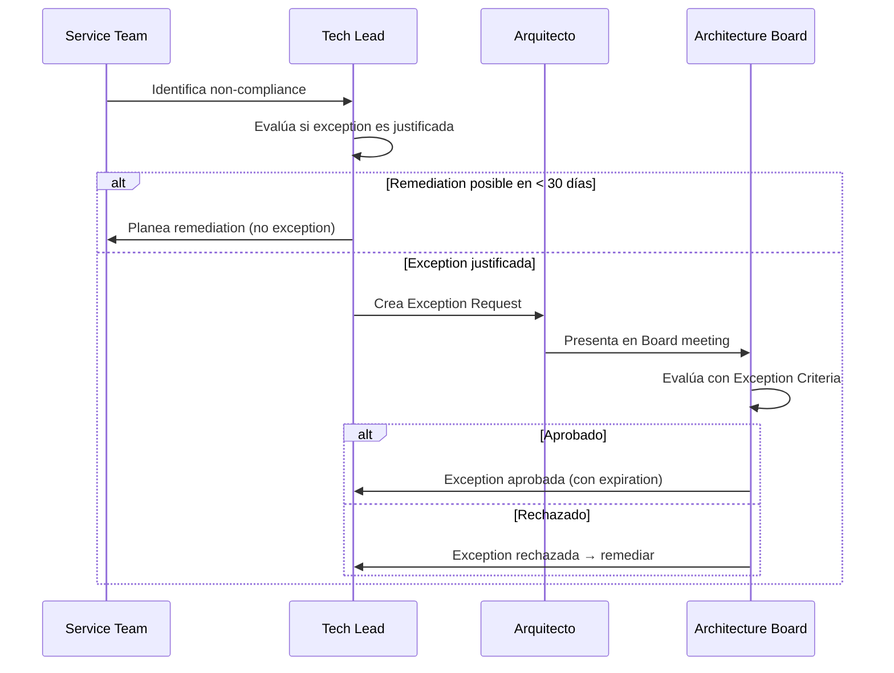

# Exception Management

## Contexto

Este estándar define el proceso para gestionar situaciones en que un servicio no puede cumplir un lineamiento o estándar de forma inmediata, proporcionando flexibilidad controlada sin comprometer el gobierno arquitectónico.

**Conceptos incluidos:**

- **Exception Management** → Proceso formal de solicitud y aprobación de excepciones
- **Exception Criteria** → Scoring objetivo para decidir si aprobar una excepción
- **Exception Review** → Revisión periódica para cerrar excepciones o exigir remediación

---

## Stack Tecnológico

| Componente        | Tecnología     | Versión | Uso                                       |
| ----------------- | -------------- | ------- | ----------------------------------------- |
| **Documentación** | Markdown       | -       | Exception requests, exception registry    |
| **Gestión**       | GitHub         | Latest  | PRs para aprobación, issues para tracking |
| **CI/CD**         | GitHub Actions | Latest  | Recordatorios y seguimiento automático    |

---

## Exception Management

### ¿Qué es Exception Management?

Proceso formal para solicitar, evaluar y aprobar excepciones temporales o permanentes a lineamientos y estándares cuando existe justificación válida.

**Tipos de excepciones:**

| Tipo            | Descripción                          | Ejemplo                                                 |
| --------------- | ------------------------------------ | ------------------------------------------------------- |
| **Temporal**    | Con fecha de expiración              | "90 días para implementar RBAC"                         |
| **Permanente**  | Sin fecha de expiración              | "servicio legacy usa SQL Server en lugar de PostgreSQL" |
| **Conditional** | Aplica solo bajo ciertas condiciones | "Solo para ambientes de desarrollo"                     |

**Cuándo es válido pedir excepción:**

- ✅ Restricción técnica legítima (vendor externo no soporta el estándar)
- ✅ Costo prohibitivo sin ROI claro
- ✅ Timeline de negocio crítico con impacto cuantificable
- ✅ Riesgo mitigado con controles compensatorios sólidos

**Cuándo NO es válido:**

- ❌ "No tenemos tiempo" (sin impacto de negocio cuantificable)
- ❌ "No sabemos cómo" (se requiere capacitación, no excepción)
- ❌ Preferencia personal del equipo
- ❌ Evitar el esfuerzo de cumplir

### Proceso de Exception Request



### Exception Request Template

```markdown
# Exception Request - EXC-REQ-NNN

**Service**: [Nombre del servicio]
**Requested by**: [Nombre] ([Rol])
**Date**: YYYY-MM-DD
**Type**: Temporal | Permanente

---

## Standard / Lineamiento

**Standard**: [Link al estándar]
**Requirement**: [Qué exige el estándar]

---

## Non-Compliance Description

[Describir estado actual vs estado esperado]

---

## Justification for Exception

### Business Context

[Contexto de negocio, deadlines, impacto cuantificado]

### Risk Assessment

**Risk si se mantiene excepción:**
| Riesgo | Severidad | Mitigación |
| ------ | --------- | ---------------- |
| [Riesgo] | 🟡 Medium | [cómo se mitiga] |

### Compensating Controls

Mientras la excepción esté activa:

1. [Control compensatorio 1]
2. [Control compensatorio 2]

---

## Proposed Timeline

**Exception Duration**: [N] días (hasta YYYY-MM-DD)

**Remediation Plan**:

- YYYY-MM-DD: [Milestone 1]
- YYYY-MM-DD: [Milestone 2 — Fully compliant]

---

## Alternatives Considered

### Alternative 1: Cumplir estándar ahora

**Pros**: ✅ Compliance inmediato
**Contras**: ❌ [impacto concreto]
**Decision**: [por qué se descartó]

### Alternative 2: [Opción intermedia]

**Pros**: ✅ [ventaja]
**Contras**: ❌ [desventaja]
**Decision**: [por qué se descartó]

---

## Business Impact if Exception Denied

- [Impacto cuantificado si es posible]

---

**Submitted**: YYYY-MM-DD
**Status**: ⏳ Pending Review
```

---

## Exception Criteria

### ¿Qué son los Exception Criteria?

Criterios objetivos y transparentes para evaluar si una excepción debe aprobarse, asegurando consistencia en decisiones del Architecture Board.

**Scoring framework (total 100 puntos):**

### Criterios de Evaluación

**1. Business Impact (peso 30%)**

| Score | Condición                                                                      |
| ----- | ------------------------------------------------------------------------------ |
| 10    | Denial causa revenue loss significativo (> $100K) o incumplimiento contractual |
| 7     | Denial causa delay en features con impacto moderado cuantificado               |
| 4     | Denial causa inconveniencia pero no bloquea el negocio                         |
| 0     | Sin impacto de negocio                                                         |

**2. Technical Justification (peso 25%)**

| Score | Condición                                                          |
| ----- | ------------------------------------------------------------------ |
| 10    | Restricción técnica legítima fuera de control (vendor limitation)  |
| 7     | Alternativa compliant es significativamente más compleja o costosa |
| 4     | Preferencia técnica, pero alternativa compliant es viable          |
| 0     | Sin justificación técnica válida                                   |

**3. Risk & Compensating Controls (peso 25%)**

| Score | Condición                                                          |
| ----- | ------------------------------------------------------------------ |
| 10    | Riesgo completamente mitigado con controles compensatorios sólidos |
| 7     | Riesgo parcialmente mitigado, residual risk aceptable              |
| 4     | Controles compensatorios débiles o inexistentes                    |
| 0     | Riesgo inaceptable sin mitigación                                  |

**4. Remediation Plan (peso 20%)**

| Score | Condición                                                                 |
| ----- | ------------------------------------------------------------------------- |
| 10    | Plan claro, timeline realista, recursos asignados, milestones específicos |
| 7     | Plan presente pero timeline o recursos inciertos                          |
| 4     | Plan vago o timeline no realista                                          |
| 0     | Sin plan de remediation                                                   |

**Umbral de decisión:**

| Score  | Decisión                                                    |
| ------ | ----------------------------------------------------------- |
| ≥ 70%  | ✅ Aprobación (Tech Lead puede pre-aprobar, Board ratifica) |
| 60-69% | ⚠️ Requiere aprobación formal del Architecture Board        |
| < 60%  | ❌ Rechazado — se debe remediar                             |

### Evaluation Template (simplificado)

```markdown
# Exception Evaluation - EXC-REQ-NNN

**Evaluador**: [Arquitecto] | **Fecha**: YYYY-MM-DD

## Scoring

| Criterio                     | Peso | Score | Puntaje |
| ---------------------------- | ---- | ----- | ------- |
| Business Impact              | 30%  | X/10  | XX%     |
| Technical Justification      | 25%  | X/10  | XX%     |
| Risk & Compensating Controls | 25%  | X/10  | XX%     |
| Remediation Plan             | 20%  | X/10  | XX%     |
| **Total**                    |      |       | **XX%** |

## Rationale por Criterio

**Business Impact**: [Justificación del score]
**Technical Justification**: [Justificación del score]
**Risk & Controls**: [Justificación del score]
**Remediation Plan**: [Justificación del score]

## Recommendation

[✅ APPROVE | ❌ REJECT] [with conditions: ...]

**Conditions (si aplica)**:

1. [Condición 1]
2. [Condición 2]

## Board Decision

**Decision**: [Approved/Rejected]
**Date**: YYYY-MM-DD
**Exception ID**: EXC-NNN
**Expiration**: YYYY-MM-DD
```

---

## Exception Review

### ¿Qué es Exception Review?

Proceso periódico de revisión de excepciones activas para verificar si se deben renovar, cerrar (compliance alcanzado) o revocar.

**Frecuencia:**

- **Temporal**: Review al 50% del periodo + al expirar
- **Permanente**: Review anual
- **Todas**: Revisión en Architecture Retrospectives trimestrales

**Resultados posibles:**

| Resultado                | Cuándo aplica                                          |
| ------------------------ | ------------------------------------------------------ |
| **Close (Compliant)**    | Remediation completada exitosamente                    |
| **Extend**               | Progreso demostrable, timeline ajustado (justificado)  |
| **Revoke**               | Controles compensatorios fallaron o riesgo inaceptable |
| **Convert to Permanent** | Restricción técnica real confirmada (excepcional)      |

### Exception Registry

```markdown
# Exception Registry — [Mes] [YYYY]

## Active Exceptions

| ID      | Service          | Standard         | Type      | Expiration | Status        | Owner    |
| ------- | ---------------- | ---------------- | --------- | ---------- | ------------- | -------- |
| EXC-042 | Customer Service | Contract Testing | Temporal  | 2026-05-20 | ✅ Active     | @juanp   |
| EXC-038 | Payment Service  | PostgreSQL       | Permanent | N/A        | ✅ Active     | @anat    |
| EXC-045 | Order Service    | Redis Caching    | Temporal  | 2026-04-01 | ⚠️ Review Due | @carlosr |

## Closed Exceptions (90 días)

| ID      | Service          | Standard      | Closed     | Outcome      |
| ------- | ---------------- | ------------- | ---------- | ------------ |
| EXC-040 | Customer Service | IaC (partial) | 2026-02-10 | ✅ Compliant |

## Statistics

- **Active**: N | **Avg Duration**: N días
- **Compliance Rate Post-Exception**: XX%
- **Extension Rate**: XX% | **Revocation Rate**: XX%
```

### Exception Review Meeting Template

```markdown
# Exception Review — [Mes YYYY]

**Date**: YYYY-MM-DD | **Facilitator**: [Arquitecto]

---

## Agenda

1. Mid-term reviews (50% del periodo)
2. Expiring soon (próximas 30 días)
3. Overdue reviews

---

## EXC-NNN: [Service] — [Standard]

**Background**: [Resumen de la excepción]

**Progress Update**:

- ✅ [Hito cumplido]
- ⚠️ [Hito en riesgo]

**Compensating Controls Status**:

- ✅/❌ [Control 1]: [Estado]
- ✅/❌ [Control 2]: [Estado]

**Decision**: [✅ CONTINUE | ✅ CLOSE | ⚠️ EXTEND | 🚨 REVOKE]

**Actions**:

- [Action item con owner y due date]

---

## Summary

| Reviewed | Closed | Extended | Continuing | Revoked |
| -------- | ------ | -------- | ---------- | ------- |
| N        | N      | N        | N          | N       |
```

---

## Requisitos Técnicos

### MUST (Obligatorio)

- **MUST** presentar exception request formal para cualquier non-compliance intencional
- **MUST** obtener aprobación del Architecture Board para toda excepción
- **MUST** registrar todas las excepciones en el Exception Registry
- **MUST** asignar expiration date a excepciones temporales
- **MUST** revisar excepciones temporales al 50% del periodo y al expirar
- **MUST** revisar excepciones permanentes anualmente
- **MUST** revocar excepciones si los controles compensatorios fallan
- **MUST NOT** aprobar excepciones sin evaluation formal con scoring
- **MUST NOT** extender excepciones sin justificación documentada y nueva evaluación

### SHOULD (Fuertemente recomendado)

- **SHOULD** revisar todas las excepciones activas en Architecture Retrospectives trimestrales
- **SHOULD** automatizar recordatorios de review (GitHub Actions a 30 días de expiración)
- **SHOULD** publicar exception registry en el portal de documentación
- **SHOULD** incluir exception trend en governance dashboard

---

## Referencias

- [Compliance y Validación](./compliance-validation.md) — validación automatizada
- [Service Ownership](./service-ownership.md) — accountability del service owner
- [Architecture Board y Audits](./architecture-board-audits.md) — quien aprueba excepciones
- [Lineamiento de Decisiones Arquitectónicas](../../lineamientos/gobierno/01-decisiones-arquitectonicas.md) — lineamiento base
