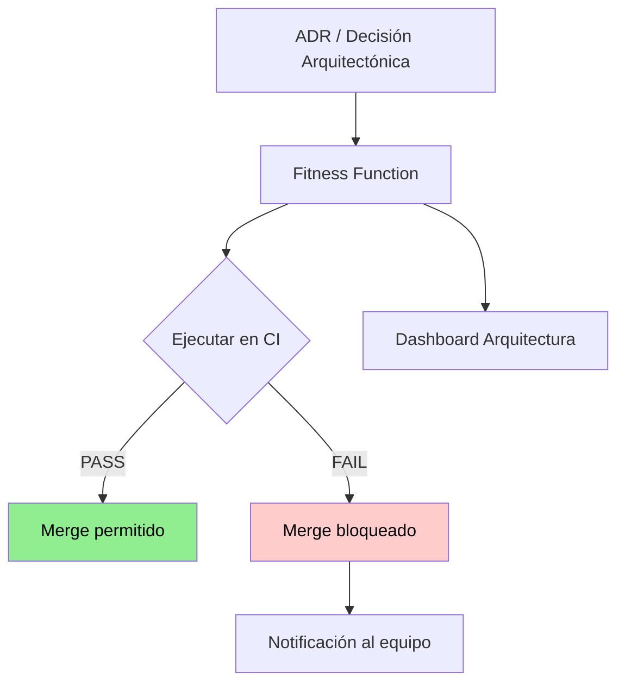

# Fitness Functions e Indicadores de Arquitectura

## Contexto

Este estándar define cómo implementar mecanismos de validación automatizada que detecten erosión arquitectónica antes de que llegue a producción. Complementa el lineamiento [Indicadores y Fitness Functions](../../lineamientos/gobierno/04-indicadores-y-fitness-functions.md).

**Conceptos incluidos:**

- **Fitness Functions** → Tests automatizados de características de arquitectura
- **Tipos de Fitness Functions** → Estructurales, de rendimiento, de seguridad, de acoplamiento
- **Integración con CI/CD** → Bloqueo de merge en pipelines
- **Umbrales y Alertas** → Cuándo bloquear vs advertir
- **Vinculación con ADRs** → Trazabilidad de cada fitness function

---

## Stack Tecnológico

| Herramienta                | Versión | Uso                                              |
| -------------------------- | ------- | ------------------------------------------------ |
| **ArchUnitNET**            | 0.10+   | Validación de dependencias y capas               |
| **xUnit**                  | 2.6+    | Framework de ejecución de fitness functions      |
| **NBomber**                | 5.0+    | Fitness functions de rendimiento                 |
| **SonarQube / SonarCloud** | —       | Complejidad ciclomática, cobertura, deuda        |
| **dotnet-outdated**        | 4.0+    | Fitness function de dependencias desactualizadas |
| **GitHub Actions**         | —       | Integración CI/CD                                |

---

## Relación entre Conceptos



---

## Fitness Functions Estructurales

### Validación de capas (ArchUnitNET)

Las fitness functions estructurales validan que las dependencias entre capas respetan la arquitectura definida.

```csharp
// Tests/Architecture/LayerDependencyTests.cs
public class LayerDependencyTests
{
    // ADR-001: Clean Architecture — Domain no puede depender de Infrastructure
    [Fact]
    public void Domain_Should_Not_Depend_On_Infrastructure()
    {
        var result = Types.InAssembly(typeof(Order).Assembly)
            .That().ResideInNamespace("*.Domain")
            .ShouldNot().HaveDependencyOn("*.Infrastructure")
            .GetResult();

        result.IsSuccessful.Should().BeTrue(
            "ADR-001: Domain layer must be free of infrastructure dependencies");
    }

    // Lineamiento multi-tenancy: Application no puede acceder a datos sin tenant context
    [Fact]
    public void Repositories_Should_Be_In_Infrastructure_Only()
    {
        var result = Types.InAssembly(typeof(OrderRepository).Assembly)
            .That().ImplementInterface(typeof(IRepository<>))
            .Should().ResideInNamespace("*.Infrastructure.Repositories")
            .GetResult();

        result.IsSuccessful.Should().BeTrue();
    }
}
```

---

## Fitness Functions de Acoplamiento

### Ciclos de dependencias prohibidos

```csharp
[Fact]
public void No_Circular_Dependencies_Between_Modules()
{
    var result = Types.InCurrentDomain()
        .That().ResideInNamespace("Talma.*")
        .ShouldNot().HaveCircularDependencies()
        .GetResult();

    result.IsSuccessful.Should().BeTrue(
        "Circular dependencies introduce acoplamiento implícito");
}
```

### Límite de dependencias externas por módulo

```csharp
[Fact]
public void Application_Layer_Should_Have_Limited_External_Dependencies()
{
    var externalDeps = GetExternalDependencies("*.Application");
    externalDeps.Count.Should().BeLessOrEqualTo(5,
        "Application layer debe ser thin — demasiadas deps externas indican fat application");
}
```

---

## Fitness Functions de Rendimiento

### Latencia máxima de endpoints críticos (NBomber)

```csharp
// Tests/Performance/ApiGatewayFitnessTests.cs
[Fact]
public void Token_Validation_Should_Complete_Within_100ms_At_P99()
{
    var scenario = Scenario.Create("token_validation", async context =>
    {
        var response = await _client.GetAsync("/api/protected-resource");
        return response.IsSuccessStatusCode ? Response.Ok() : Response.Fail();
    })
    .WithLoadSimulations(Simulation.KeepConstantActors(50, TimeSpan.FromSeconds(30)));

    var stats = NBomberRunner.RegisterScenarios(scenario).Run();

    stats.ScenarioStats[0].Ok.Latency.Percent99
        .Should().BeLessOrEqualTo(100,
            "Token validation P99 must be under 100ms — ADR-002");
}
```

---

## Fitness Functions de Calidad de Código

### Cobertura mínima y complejidad

Estas fitness functions se ejecutan como gates en SonarCloud:

```yaml
# .github/workflows/quality-gate.yml
- name: SonarCloud Quality Gate
  uses: SonarSource/sonarcloud-github-action@master
  with:
    args: >
      -Dsonar.qualitygate.wait=true
```

**Quality Gate configurado en SonarCloud:**

| Métrica                            | Umbral de bloqueo     | Umbral de advertencia |
| ---------------------------------- | --------------------- | --------------------- |
| Cobertura en código nuevo          | < 80% → FAIL          | < 85% → WARN          |
| Complejidad ciclomática por método | > 10 → FAIL           | > 7 → WARN            |
| Duplicación de código              | > 3% → FAIL           | > 1% → WARN           |
| Deuda técnica (días)               | > 5 días nuevo → FAIL | > 2 días → WARN       |

---

## Fitness Functions de Dependencias

### Detección de dependencias desactualizadas

```yaml
# .github/workflows/dependency-fitness.yml
- name: Check outdated dependencies
  run: |
    dotnet tool install -g dotnet-outdated-tool
    dotnet outdated --fail-on-updates --upgrade-type Major
```

**Regla:** Dependencias con versión mayor desactualizada por más de 6 meses bloquean el pipeline.

---

## Integración con CI/CD

### Ejecución en pipeline

```yaml
# .github/workflows/ci.yml
jobs:
  architecture-fitness:
    name: Architecture Fitness Functions
    runs-on: ubuntu-latest
    steps:
      - uses: actions/checkout@v4
      - name: Run Architecture Tests
        run: dotnet test tests/Architecture/ --logger "trx;LogFileName=arch-results.trx"
      - name: Publish Results
        uses: dorny/test-reporter@v1
        if: always()
        with:
          name: Architecture Fitness Functions
          path: "**/*.trx"
          reporter: dotnet-trx
```

**Orden de ejecución en pipeline:**

```
1. Unit Tests
2. Architecture Fitness Functions  ← bloquea si falla
3. Integration Tests
4. SonarCloud Quality Gate          ← bloquea si falla
5. Performance Fitness Functions    ← solo en PRs a main
6. Deploy
```

---

## Umbrales y Política de Fallos

| Tipo                                 | Umbral superado          | Acción                                  |
| ------------------------------------ | ------------------------ | --------------------------------------- |
| Fitness function estructural         | Cualquier fallo          | Bloquear merge inmediatamente           |
| Cobertura de código                  | < 80% en código nuevo    | Bloquear merge                          |
| Rendimiento P99                      | > umbral definido en ADR | Bloquear merge en rama main             |
| Dependencias desactualizadas (major) | > 6 meses                | Bloquear merge + crear issue automático |
| Deuda técnica                        | > 5 días nuevo           | Bloquear merge                          |

---

## Vinculación con ADRs

Cada fitness function debe referenciar el ADR o lineamiento que la justifica:

```csharp
/// <summary>
/// Fitness function para ADR-001 (Clean Architecture).
/// Valida que la capa Domain no tenga dependencias de Infrastructure.
/// Umbral: 0 violaciones (bloquea merge).
/// Revisión siguiente: 2026-Q3.
/// </summary>
[Fact]
public void Domain_Must_Not_Depend_On_Infrastructure() { ... }
```

**Catálogo de fitness functions** — mantener en `docs/fitness-functions-catalog.md`:

| ID     | Tipo        | Descripción                       | ADR/Lineamiento    | Umbral        | Estado    |
| ------ | ----------- | --------------------------------- | ------------------ | ------------- | --------- |
| FF-001 | Estructural | Domain sin deps de Infrastructure | ADR-001            | 0 violaciones | ✅ Activo |
| FF-002 | Rendimiento | Token validation P99 < 100ms      | ADR-002            | 100 ms        | ✅ Activo |
| FF-003 | Calidad     | Cobertura > 80% en código nuevo   | Lin. desarrollo/02 | 80%           | ✅ Activo |

---

## Checklist Fitness Functions

| Aspecto            | Verificación                                             |
| ------------------ | -------------------------------------------------------- |
| Vinculación        | Cada fitness function referencia un ADR o lineamiento    |
| Automatización     | Todas ejecutan en CI en cada PR                          |
| Umbral documentado | Umbral numérico explícito con justificación              |
| Bloqueo            | Fallos en ff estructurales y de cobertura bloquean merge |
| Catálogo           | `docs/fitness-functions-catalog.md` actualizado          |
| Revisión periódica | Umbrales revisados en architecture reviews trimestrales  |

---

## Referencias

- [Lineamiento Indicadores y Fitness Functions](../../lineamientos/gobierno/04-indicadores-y-fitness-functions.md)
- [Architecture Evolution](../arquitectura/architecture-evolution.md)
- [ADR Management](./adr-management.md)
- [Architecture Review Process](./architecture-review-process.md)
- [Compliance Validation](./compliance-validation.md)
- [CI Pipeline](../operabilidad/ci-pipeline.md)
