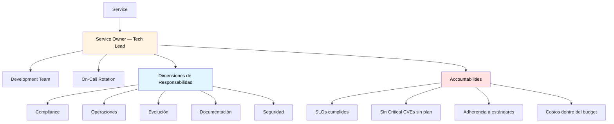

# Ownership de Servicios

## Contexto

Este estándar define quién es responsable de cada servicio, cuáles son sus obligaciones y cómo se traspasa el ownership. Implementa el principio "you build it, you run it" dentro del contexto corporativo.

**Conceptos incluidos:**

- **Service Ownership** → Modelo de accountability con el Tech Lead como Service Owner
- **Responsabilidades del Owner** → Desglose por dimensión: compliance, operación, evolución, documentación y seguridad
- **Accountability y Transiciones** → Métricas de éxito y proceso de traspaso de ownership

---

## Stack Tecnológico

| Componente         | Tecnología    | Versión | Uso                                        |
| ------------------ | ------------- | ------- | ------------------------------------------ |
| **Incidentes**     | PagerDuty     | Latest  | On-call rotation y escalation              |
| **Observabilidad** | Grafana Stack | Latest  | Dashboard de SLOs y métricas de compliance |
| **Documentación**  | Docusaurus    | 3.0+    | Portal del Service Ownership Registry      |
| **Gestión**        | GitHub        | Latest  | Repositorio de servicios y permisos        |

---

## Service Ownership

### ¿Qué es Service Ownership?

Definición clara y documentada de quién es responsable de cada servicio: el **Service Owner (Tech Lead)** tiene accountability total sobre compliance, operación, evolución y seguridad.

**Principio fundamental:** "You build it, you run it."

**Beneficios:**

- ✅ Accountability clara — no existen "orphan services"
- ✅ Decisiones más rápidas sin escalation innecesario
- ✅ Cultura de ownership
- ✅ Compliance sostenido en el tiempo

### Modelo de Ownership



### Registro de Ownership de Servicios

```markdown
# Registro de Ownership de Servicios

**Última actualización**: YYYY-MM-DD

| Servicio             | Responsable (Tech Lead) | Equipo            | On-Call             | Canal Slack           | Repositorio                |
| -------------------- | ----------------------- | ----------------- | ------------------- | --------------------- | -------------------------- |
| Customer Service     | Juan Pérez (@juanp)     | Customer Team     | customer-oncall     | #customer-service     | talma/customer-service     |
| Order Service        | Carlos Ruiz (@carlosr)  | Order Team        | order-oncall        | #order-service        | talma/order-service        |
| Payment Service      | Ana Torres (@anat)      | Payment Team      | payment-oncall      | #payment-service      | talma/payment-service      |
| Notification Service | María Medina (@mariam)  | Notification Team | notification-oncall | #notification-service | talma/notification-service |
| Auth Service         | Luis García (@luisg)    | Platform Team     | platform-oncall     | #auth-service         | talma/auth-service         |
```

---

## Responsabilidades del Owner

### Desglose por Dimensión

El Tech Lead como Service Owner dedica tiempo a cinco dimensiones:

#### Compliance (20% del tiempo)

- Mantener adherencia a estándares corporativos
- Gestionar excepciones si son necesarias (usar [Gestión de Excepciones](./exception-management.md))
- Participar en architecture reviews y audits
- Actualizar el servicio ante nuevos lineamientos

#### Operaciones (30% del tiempo)

- Asegurar SLOs cumplidos
- Liderar on-call rotation
- Incident response y post-mortems
- Capacity planning

#### Evolución (30% del tiempo)

- Roadmap técnico del servicio
- Technical debt management
- Performance optimization
- Feature development con foco en calidad arquitectónica

#### Documentación (10% del tiempo)

- Mantener arc42 actualizada
- Crear ADRs para decisiones significativas
- Runbooks actualizados
- API documentation (OpenAPI)

#### Seguridad (10% del tiempo)

- Vulnerability management (patching)
- Security reviews periódicas
- Secrets rotation
- Gestión de access control

### Responsabilidades del Equipo

| Rol                  | Responsabilidades principales                                     |
| -------------------- | ----------------------------------------------------------------- |
| **Development Team** | Features, fixes, code reviews, testing, documentación de cambios  |
| **On-Call Rotation** | 24/7 incident response, monitoring de alertas, triage, escalación |

**On-call:**

- Turno de 1 semana por persona
- Gestión de schedule en PagerDuty

---

## Accountability y Transiciones

### Dashboard de Accountability

El siguiente dashboard sirve para visibilizar el estado de cada servicio por owner:

```markdown
# Dashboard del Owner de Servicios — [Mes YYYY]

| Responsable | Servicio     | Cumplimiento SLO | CVEs Críticos | Puntaje Compliance | Costo vs Presupuesto |
| ----------- | ------------ | ---------------- | ------------- | ------------------ | -------------------- |
| @juanp      | Customer     | 99.5% ✅         | 0 ✅          | 87% ✅             | 95% ✅               |
| @carlosr    | Order        | 98.2% ⚠️         | 1 ⚠️          | 92% ✅             | 105% ⚠️              |
| @anat       | Payment      | 99.9% ✅         | 0 ✅          | 78% ⚠️             | 88% ✅               |
| @mariam     | Notification | 97.5% ⚠️         | 0 ✅          | 85% ✅             | 92% ✅               |
| @luisg      | Auth         | 99.95% ✅        | 0 ✅          | 95% ✅             | 90% ✅               |

Leyenda: ✅ Objetivo cumplido | ⚠️ Por debajo del objetivo | 🔴 Acción crítica requerida
```

**Targets:**

| Métrica          | Target  | Alerta |
| ---------------- | ------- | ------ |
| SLO Compliance   | ≥ 99.5% | < 99%  |
| Critical CVEs    | 0       | > 0    |
| Compliance Score | ≥ 85%   | < 70%  |
| Cost vs Budget   | 90-105% | > 115% |

### Proceso de Transición de Ownership

Cuando un Tech Lead cambia de rol o de servicio:

**Timeline:**

| Etapa                   | Plazo                | Responsable        |
| ----------------------- | -------------------- | ------------------ |
| 1. Notificar al Board   | 30 días antes        | Tech Lead saliente |
| 2. Knowledge Transfer   | 2 semanas de overlap | Ambos TLs          |
| 3. Review documentación | Semana 1             | TL entrante        |
| 4. Transferir accesos   | Semana 2             | TL saliente        |
| 5. Handover formal      | Día de cambio        | Architecture Board |
| 6. Update registry      | Día de cambio        | Architecture Board |

### Checklist para Transfer de Conocimiento

```markdown
# Transición de Ownership — [Nombre del Servicio]

**De**: [Nombre saliente] (@handle)
**Para**: [Nombre entrante] (@handle)
**Fecha**: YYYY-MM-DD
**Motivo**: [Motivo del cambio]

---

## Checklist de Knowledge Transfer

### Arquitectura y Decisiones

- [ ] Session de architecture overview (arc42)
- [ ] Walkthrough de ADRs (especialmente los recientes)
- [ ] Review de diagrama de componentes y dependencias

### Operaciones

- [ ] Walkthrough de runbooks e incident history (últimos 6 meses)
- [ ] On-call shadow shift (1 semana)
- [ ] Review de SLOs, alerts y dashboards en Grafana

### Equipo y Stakeholders

- [ ] Presentación al equipo
- [ ] Presentación a Product Owner y equipos consumidores
- [ ] Review de roadmap técnico y backlog

### Accesos

- [ ] Transferir GitHub admin access al repositorio
- [ ] Transferir AWS IAM roles
- [ ] Transferir PagerDuty on-call schedule
- [ ] Transferir Vault / Secrets Manager accesos relevantes

### Documentación

- [ ] Verificar que arc42 refleja el estado actual
- [ ] Verificar que exception registry está actualizado
- [ ] Verificar que ownership registry está actualizado

---

**Fecha de Finalización**: YYYY-MM-DD
**Verificado por**: Architecture Board
```

---

## Requisitos Técnicos

### MUST (Obligatorio)

- **MUST** asignar un Tech Lead como Service Owner para cada servicio
- **MUST** documentar el ownership en el Service Ownership Registry
- **MUST** el Service Owner ser accountable por compliance del servicio
- **MUST** notificar al Architecture Board con 30 días de anticipación ante cambio de ownership
- **MUST** ejecutar knowledge transfer completo antes del traspaso formal

### SHOULD (Fuertemente recomendado)

- **SHOULD** publicar el Service Ownership Registry en el portal de documentación
- **SHOULD** incluir compliance score y SLOs en el dashboard de ownership visible para todo Engineering
- **SHOULD** revisar el registry trimestralmente para confirmar owners vigentes
- **SHOULD** incluir ownership responsibilities en el onboarding de Tech Leads

### MUST NOT (Prohibido)

- **MUST NOT** operar servicios en producción sin Service Owner asignado
- **MUST NOT** completar una transición de ownership sin knowledge transfer documentado

---

## Referencias

- [Compliance y Validación](./compliance-validation.md) — compliance que el owner debe asegurar
- [Gestión de Excepciones](./exception-management.md) — proceso cuando no hay compliance
- [Architecture Board y Auditorías](./architecture-board-audits.md) — auditorías al servicio
- [Architecture Review y Checklist](./architecture-review-process.md) — reviews que el owner gestiona
- [Lineamiento Autonomía de Servicios](../../lineamientos/arquitectura/10-autonomia-de-servicios.md) — lineamiento relacionado
- [Team Topologies](https://teamtopologies.com/) — referencia para ownership model
